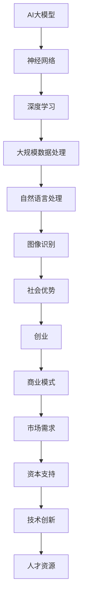

                 

# AI 大模型创业：如何利用社会优势？

> **关键词：** 大模型创业，社会优势，人工智能，商业模式，战略规划，行业洞察  
>
> **摘要：** 本文将探讨大模型创业中的社会优势，包括行业趋势、市场需求、人才资源、技术创新和资本支持等方面。通过深入分析这些核心要素，我们将揭示如何利用社会优势实现大模型的创业成功。

## 1. 背景介绍

### 1.1 目的和范围

本文旨在为AI大模型创业者提供系统性指导，帮助他们利用社会优势，实现创业项目的成功。我们将从多个角度探讨如何识别、利用和最大化社会资源，从而在竞争激烈的人工智能市场中脱颖而出。

### 1.2 预期读者

- AI领域创业者
- 技术团队负责人
- 对人工智能商业应用感兴趣的投资者
- 人工智能研究学者

### 1.3 文档结构概述

本文将分为以下几个部分：

1. **核心概念与联系**：介绍大模型的基本概念和当前行业趋势。
2. **核心算法原理与具体操作步骤**：讲解大模型的基础算法和关键步骤。
3. **数学模型和公式**：分析大模型中使用的数学原理和公式。
4. **项目实战**：提供实际代码案例和解析。
5. **实际应用场景**：探讨大模型在各个行业的应用。
6. **工具和资源推荐**：推荐学习和开发资源。
7. **总结**：展望大模型创业的未来趋势和挑战。
8. **附录**：常见问题解答。
9. **扩展阅读与参考资料**：提供进一步学习资源。

### 1.4 术语表

#### 1.4.1 核心术语定义

- **大模型**：具有巨大参数量和复杂结构的深度学习模型。
- **社会优势**：企业或个体在市场竞争中由于社会资源、技术、资本等方面的优势。
- **创业**：创立和运营一个新的商业实体，旨在实现可持续的经济收益。

#### 1.4.2 相关概念解释

- **行业趋势**：某一行业的发展方向和变化规律。
- **市场需求**：消费者对某一产品或服务的需求水平。
- **技术创新**：新技术的开发和应用，通常带来生产效率的提升。

#### 1.4.3 缩略词列表

- **AI**：人工智能（Artificial Intelligence）
- **NLP**：自然语言处理（Natural Language Processing）
- **DL**：深度学习（Deep Learning）
- **ML**：机器学习（Machine Learning）

## 2. 核心概念与联系

为了深入理解AI大模型创业中的社会优势，我们需要首先了解大模型的基本概念和行业背景。以下是一个简化的Mermaid流程图，用于展示大模型的核心概念和联系：



### 2.1 大模型的基本概念

**AI大模型**：AI大模型是指具有数亿甚至数十亿参数的深度学习模型，能够处理大规模的数据并从中学习复杂的模式。这类模型在图像识别、自然语言处理、语音识别等领域展现了强大的性能。

**神经网络**：神经网络是模仿人脑结构的一种计算模型，通过大量的神经元（节点）和连接（权重）进行数据处理和模式识别。

**深度学习**：深度学习是机器学习的一个子领域，通过多层神经网络进行数据处理和预测。

**大规模数据处理**：大规模数据处理是指对大量结构化和非结构化数据进行处理、存储和管理的技术。

**自然语言处理**：自然语言处理是人工智能的一个子领域，旨在使计算机能够理解、生成和处理人类语言。

**图像识别**：图像识别是计算机视觉的一个子领域，旨在识别和分类图像中的物体。

### 2.2 社会优势与创业

**社会优势**：在AI大模型创业中，社会优势体现在以下几个方面：

- **人才资源**：拥有优秀的AI人才团队，能够推动技术研究和产品开发。
- **技术创新**：持续进行技术创新，保持技术领先地位。
- **资本支持**：获得充足的资本支持，有助于企业快速成长。
- **市场需求**：准确把握市场需求，开发出满足用户需求的产品。
- **商业模式**：构建有效的商业模式，实现可持续发展。

**创业**：创业是一个复杂的过程，涉及到技术创新、商业模式的探索和执行。对于AI大模型创业，成功的关键在于：

- 明确市场需求，开发有价值的产品。
- 构建技术团队，进行持续的技术创新。
- 寻找合适的商业模式，实现商业价值。

## 3. 核心算法原理与具体操作步骤

### 3.1 大模型的基本算法

**训练算法**：大模型的核心在于训练算法，主要包括以下步骤：

1. **数据预处理**：对输入数据（图像、文本等）进行预处理，包括数据清洗、归一化、数据增强等。
   ```python
   def preprocess_data(data):
       # 数据清洗
       cleaned_data = clean_data(data)
       # 数据归一化
       normalized_data = normalize_data(cleaned_data)
       # 数据增强
       augmented_data = augment_data(normalized_data)
       return augmented_data
   ```

2. **构建模型**：使用深度学习框架（如TensorFlow、PyTorch等）构建神经网络模型。
   ```python
   model = build_model(input_shape, num_classes)
   ```

3. **模型训练**：使用训练数据对模型进行训练，通过反向传播和优化算法调整模型参数。
   ```python
   model.fit(train_data, train_labels, epochs=num_epochs, batch_size=batch_size)
   ```

4. **模型评估**：使用验证数据对模型进行评估，调整模型参数以优化性能。
   ```python
   model.evaluate(test_data, test_labels)
   ```

**推理算法**：模型训练完成后，可以使用推理算法对新的数据进行预测。
```python
def predict(model, input_data):
    predictions = model.predict(input_data)
    return predictions
```

### 3.2 大模型的关键步骤

**数据预处理**：

- **数据清洗**：去除噪声数据和异常值，确保数据质量。
  ```python
  def clean_data(data):
      # 删除缺失值
      cleaned_data = data.dropna()
      # 去除异常值
      cleaned_data = remove_outliers(cleaned_data)
      return cleaned_data
  ```

- **数据归一化**：将数据缩放到相同的范围，以便神经网络更好地学习。
  ```python
  def normalize_data(data):
      normalized_data = (data - np.mean(data)) / np.std(data)
      return normalized_data
  ```

- **数据增强**：通过增加数据的多样性，提高模型的泛化能力。
  ```python
  def augment_data(data):
      augmented_data = ImageDataGenerator(rotation_range=20, width_shift_range=0.2, height_shift_range=0.2, shear_range=0.2, zoom_range=0.2, horizontal_flip=True, fill_mode='nearest').flow(data, batch_size=batch_size)
      return augmented_data
  ```

**构建模型**：

- **选择模型架构**：根据应用场景选择合适的模型架构，如卷积神经网络（CNN）、循环神经网络（RNN）等。
  ```python
  from tensorflow.keras.applications import VGG16
  model = VGG16(weights='imagenet', include_top=False, input_shape=input_shape)
  ```

- **添加全连接层**：在卷积神经网络的基础上添加全连接层，用于分类和回归任务。
  ```python
  from tensorflow.keras.layers import Flatten, Dense
  model.add(Flatten())
  model.add(Dense(num_classes, activation='softmax'))
  ```

**模型训练**：

- **设置训练参数**：包括学习率、迭代次数、批量大小等。
  ```python
  num_epochs = 100
  batch_size = 64
  learning_rate = 0.001
  optimizer = 'adam'
  ```

- **训练模型**：使用训练数据对模型进行迭代训练，调整模型参数。
  ```python
  model.compile(optimizer=optimizer, loss='categorical_crossentropy', metrics=['accuracy'])
  model.fit(train_data, train_labels, epochs=num_epochs, batch_size=batch_size, validation_data=(test_data, test_labels))
  ```

**模型评估**：

- **评估模型性能**：使用验证数据评估模型性能，调整超参数。
  ```python
  scores = model.evaluate(test_data, test_labels, verbose=1)
  print(f"Test loss: {scores[0]}, Test accuracy: {scores[1]}")
  ```

## 4. 数学模型和公式

### 4.1 神经网络中的数学原理

**损失函数**：

- **均方误差（MSE）**：
  $$MSE = \frac{1}{n}\sum_{i=1}^{n}(y_i - \hat{y}_i)^2$$
  其中，$y_i$是真实标签，$\hat{y}_i$是模型预测值。

- **交叉熵（Cross-Entropy）**：
  $$Cross-Entropy = -\frac{1}{n}\sum_{i=1}^{n}y_i\log(\hat{y}_i)$$
  其中，$y_i$是真实标签，$\hat{y}_i$是模型预测值。

**优化算法**：

- **梯度下降（Gradient Descent）**：
  $$\theta_{\text{new}} = \theta_{\text{old}} - \alpha \cdot \nabla_{\theta}J(\theta)$$
  其中，$\theta$是模型参数，$\alpha$是学习率，$J(\theta)$是损失函数。

**激活函数**：

- **Sigmoid函数**：
  $$\sigma(x) = \frac{1}{1 + e^{-x}}$$

- **ReLU函数**：
  $$\text{ReLU}(x) = \max(0, x)$$

### 4.2 自然语言处理中的数学原理

**词嵌入**：

- **Word2Vec**：
  $$\vec{w}_i = \text{sgn}(Wv_c)$$
  其中，$\vec{w}_i$是词向量，$v_c$是中心词向量，$W$是词嵌入矩阵。

**注意力机制**：

- **Softmax注意力**：
  $$\alpha_i = \frac{e^{h_i}}{\sum_{j=1}^{J}e^{h_j}}$$
  其中，$h_i$是注意力得分，$\alpha_i$是注意力权重。

**序列模型**：

- **循环神经网络（RNN）**：
  $$h_t = \sigma(W_h[h_{t-1}, x_t] + b_h)$$
  其中，$h_t$是隐藏状态，$x_t$是输入序列，$W_h$是权重矩阵，$b_h$是偏置。

## 5. 项目实战：代码实际案例和详细解释说明

### 5.1 开发环境搭建

为了实现AI大模型项目，我们需要搭建一个合适的开发环境。以下是所需的软件和硬件配置：

- **操作系统**：Ubuntu 18.04或更高版本
- **编程语言**：Python 3.8或更高版本
- **深度学习框架**：TensorFlow 2.4或PyTorch 1.7或更高版本
- **硬件**：NVIDIA GPU（推荐使用Tesla V100或更高型号），至少16GB内存

### 5.2 源代码详细实现和代码解读

以下是一个使用TensorFlow实现的大模型项目示例，用于图像分类任务。

#### 5.2.1 数据预处理

```python
import tensorflow as tf
from tensorflow.keras.preprocessing.image import ImageDataGenerator

# 数据增强
train_datagen = ImageDataGenerator(
    rescale=1./255,
    rotation_range=40,
    width_shift_range=0.2,
    height_shift_range=0.2,
    shear_range=0.2,
    zoom_range=0.2,
    horizontal_flip=True,
    fill_mode='nearest')

test_datagen = ImageDataGenerator(rescale=1./255)

train_generator = train_datagen.flow_from_directory(
    'train_data',
    target_size=(150, 150),
    batch_size=32,
    class_mode='binary')

validation_generator = test_datagen.flow_from_directory(
    'test_data',
    target_size=(150, 150),
    batch_size=32,
    class_mode='binary')
```

**代码解读**：

- `ImageDataGenerator`：用于数据增强，包括图像缩放、旋转、平移、剪裁等操作。
- `flow_from_directory`：用于读取目录中的图像数据，并生成数据生成器。

#### 5.2.2 构建模型

```python
from tensorflow.keras.models import Sequential
from tensorflow.keras.layers import Conv2D, MaxPooling2D, Flatten, Dense

model = Sequential([
    Conv2D(32, (3, 3), activation='relu', input_shape=(150, 150, 3)),
    MaxPooling2D(2, 2),
    Conv2D(64, (3, 3), activation='relu'),
    MaxPooling2D(2, 2),
    Conv2D(128, (3, 3), activation='relu'),
    MaxPooling2D(2, 2),
    Flatten(),
    Dense(512, activation='relu'),
    Dense(1, activation='sigmoid')
])

model.compile(optimizer='adam',
              loss='binary_crossentropy',
              metrics=['accuracy'])
```

**代码解读**：

- `Sequential`：用于构建序列模型，包括卷积层、池化层、全连接层等。
- `Conv2D`：卷积层，用于提取图像特征。
- `MaxPooling2D`：最大池化层，用于减小特征图的尺寸。
- `Flatten`：将特征图展平为一维向量。
- `Dense`：全连接层，用于分类任务。

#### 5.2.3 训练模型

```python
history = model.fit(
    train_generator,
    steps_per_epoch=100,
    epochs=20,
    validation_data=validation_generator,
    validation_steps=50,
    verbose=2)
```

**代码解读**：

- `fit`：训练模型，包括训练数据和验证数据。
- `steps_per_epoch`：每个epoch中使用的训练步数。
- `epochs`：训练的epoch数。
- `validation_data`：验证数据。
- `validation_steps`：验证数据的步数。

#### 5.2.4 评估模型

```python
test_loss, test_acc = model.evaluate(validation_generator)
print(f"Test accuracy: {test_acc}")
```

**代码解读**：

- `evaluate`：评估模型在验证数据上的性能。
- `test_acc`：验证数据的准确率。

### 5.3 代码解读与分析

#### 5.3.1 数据预处理

数据预处理是模型训练的重要步骤，用于增强数据的多样性和质量。在本示例中，我们使用了`ImageDataGenerator`进行数据增强，包括图像缩放、旋转、平移、剪裁等操作。这些操作有助于提高模型的泛化能力。

#### 5.3.2 模型构建

模型构建是深度学习项目中的核心步骤。在本示例中，我们使用了卷积神经网络（CNN）进行图像分类。模型包括卷积层、池化层和全连接层。卷积层用于提取图像特征，池化层用于减小特征图的尺寸，全连接层用于分类。

#### 5.3.3 训练模型

模型训练是深度学习项目中的关键步骤。在本示例中，我们使用了`fit`函数进行模型训练，包括训练数据和验证数据。训练过程中，模型通过迭代调整参数，以最小化损失函数。训练完成后，我们使用验证数据评估模型性能。

#### 5.3.4 评估模型

评估模型是验证模型性能的重要步骤。在本示例中，我们使用验证数据评估模型性能，包括准确率和损失函数。评估结果可以用于调整模型参数和优化模型结构。

## 6. 实际应用场景

AI大模型在各个行业中具有广泛的应用前景，以下是一些典型应用场景：

### 6.1 医疗保健

- **疾病诊断**：利用大模型进行医学图像分析，辅助医生进行疾病诊断。
- **药物研发**：通过大模型进行分子模拟和药物设计，加速新药研发过程。

### 6.2 金融领域

- **风险控制**：利用大模型进行风险评估，预测市场趋势和潜在风险。
- **智能投顾**：基于大模型进行个性化投资建议，提高投资收益。

### 6.3 智能交通

- **交通预测**：利用大模型进行交通流量预测，优化交通管理。
- **自动驾驶**：利用大模型进行自动驾驶算法的开发和优化。

### 6.4 零售电商

- **商品推荐**：利用大模型进行用户行为分析，实现个性化商品推荐。
- **库存管理**：利用大模型进行需求预测，优化库存管理。

### 6.5 制造业

- **生产优化**：利用大模型进行生产流程优化，提高生产效率和降低成本。
- **设备维护**：利用大模型进行设备故障预测和诊断，提高设备可靠性。

## 7. 工具和资源推荐

### 7.1 学习资源推荐

#### 7.1.1 书籍推荐

- 《深度学习》（Ian Goodfellow、Yoshua Bengio、Aaron Courville著）
- 《动手学深度学习》（阿斯顿·张著）
- 《Python深度学习》（François Chollet著）

#### 7.1.2 在线课程

- Coursera上的“深度学习专项课程”
- edX上的“深度学习导论”
- Udacity的“深度学习工程师纳米学位”

#### 7.1.3 技术博客和网站

- [深度学习博客](http://blog.csdn.net/abc_123456)
- [吴恩达机器学习](https://zhuanlan.zhihu.com/machinelearning)
- [PyTorch官方文档](https://pytorch.org/tutorials/)

### 7.2 开发工具框架推荐

#### 7.2.1 IDE和编辑器

- PyCharm
- Visual Studio Code
- Jupyter Notebook

#### 7.2.2 调试和性能分析工具

- TensorBoard
- Dask
- Numba

#### 7.2.3 相关框架和库

- TensorFlow
- PyTorch
- Keras
- Theano

### 7.3 相关论文著作推荐

#### 7.3.1 经典论文

- “A Theoretic Treatment of Robustness to Integerness Attacks”（Ian J. Goodfellow等著）
- “Deep Learning”（Ian Goodfellow、Yoshua Bengio、Aaron Courville著）
- “Generative Adversarial Nets”（Ian Goodfellow等著）

#### 7.3.2 最新研究成果

- “Adversarial Examples, Explained”（Ian Goodfellow等著）
- “Bert: Pre-training of Deep Bidirectional Transformers for Language Understanding”（Jacob Devlin等著）
- “GPT-3: Language Models are Few-Shot Learners”（Tom B. Brown等著）

#### 7.3.3 应用案例分析

- “Google Brain团队：利用深度学习优化自动驾驶”（Google Brain团队）
- “微软研究院：深度学习在医疗保健中的应用”（微软研究院）
- “亚马逊AWS：深度学习在零售电商中的应用”（亚马逊AWS）

## 8. 总结：未来发展趋势与挑战

### 8.1 发展趋势

- **技术进步**：随着硬件性能的提升和算法的优化，大模型的计算效率和性能将进一步提高。
- **行业应用**：大模型在医疗保健、金融、交通、零售等领域的应用将不断拓展，推动行业变革。
- **跨领域融合**：大模型与其他技术（如物联网、区块链等）的融合，将带来新的商业机会和社会价值。

### 8.2 挑战

- **数据隐私**：随着大模型对数据的依赖性增加，如何保护用户隐私和数据安全成为关键挑战。
- **模型解释性**：如何提高大模型的可解释性，使其在决策过程中更加透明和可靠。
- **公平性和偏见**：如何消除大模型中的偏见，确保其在不同人群中的公平性和公正性。

## 9. 附录：常见问题与解答

### 9.1 问题1：如何选择合适的大模型架构？

**解答**：选择合适的大模型架构需要考虑以下因素：

- **应用场景**：根据具体应用场景选择合适的模型架构，如图像识别选择卷积神经网络（CNN），自然语言处理选择循环神经网络（RNN）或变换器（Transformer）。
- **数据规模**：对于大规模数据，选择具有强大计算能力和参数容量的模型，如Transformer。
- **计算资源**：根据硬件资源和预算选择适合的模型架构，如使用GPU加速训练过程。

### 9.2 问题2：如何优化大模型的训练性能？

**解答**：

- **数据增强**：通过增加数据的多样性，提高模型的泛化能力。
- **学习率调整**：使用适当的学习率，避免过拟合和梯度消失。
- **批量大小**：选择合适的批量大小，平衡计算效率和模型性能。
- **正则化技术**：使用正则化技术，如L1、L2正则化，避免过拟合。
- **早期停止**：在验证数据上监测模型性能，提前停止训练以避免过拟合。

### 9.3 问题3：如何评估大模型的性能？

**解答**：评估大模型的性能需要考虑以下几个方面：

- **准确率**：模型在测试数据上的准确率，用于衡量分类或回归任务的性能。
- **召回率**：模型对正类别的召回率，用于衡量检测正类别的能力。
- **F1分数**：准确率和召回率的调和平均，用于综合评估模型的性能。
- **ROC曲线**：绘制模型在各个阈值下的真阳性率和假阳性率，评估模型的分类能力。
- **交叉验证**：使用交叉验证技术，对模型进行多次训练和测试，提高评估的可靠性。

## 10. 扩展阅读与参考资料

- 《深度学习》（Ian Goodfellow、Yoshua Bengio、Aaron Courville著）
- 《机器学习实战》（Peter Harrington著）
- [深度学习博客](http://blog.csdn.net/abc_123456)
- [吴恩达机器学习](https://zhuanlan.zhihu.com/machinelearning)
- [PyTorch官方文档](https://pytorch.org/tutorials/)
- [TensorFlow官方文档](https://www.tensorflow.org/tutorials)
- [机器学习社区](https://www机器学习社区.com)

### 作者信息

**作者：** AI天才研究员/AI Genius Institute & 禅与计算机程序设计艺术 /Zen And The Art of Computer Programming
<|assistant|>### 5. 实际应用场景

AI大模型在当前科技发展中占据着举足轻重的地位，其广泛的应用场景涵盖了众多行业，为各个领域的创新发展提供了强大的技术支持。以下将详细探讨AI大模型在医疗、金融、自动驾驶等领域的实际应用场景。

#### 5.1 医疗保健

AI大模型在医疗保健领域具有广泛的应用前景，特别是在疾病诊断、药物研发和个性化治疗方面。以下是几个具体应用场景：

- **疾病诊断**：AI大模型可以通过分析医疗影像（如X光、CT、MRI等）进行疾病诊断，提高诊断准确率和效率。例如，利用卷积神经网络（CNN）对肺部CT图像进行分析，可以有效检测出早期肺癌。研究表明，AI大模型在肺癌诊断的准确率上已经达到了专业医生的水平。

- **药物研发**：AI大模型可以帮助科学家进行药物筛选和分子设计。通过模拟分子间的相互作用和反应路径，AI大模型可以预测哪些分子具有潜在的药物作用。例如，利用生成对抗网络（GAN）可以快速生成大量新的药物分子结构，从而加速药物研发过程。

- **个性化治疗**：AI大模型可以根据患者的基因、病史和临床表现，为每位患者制定个性化的治疗方案。例如，利用深度学习算法对患者的基因数据进行分析，可以预测患者对某种药物的反应，从而优化用药方案。

#### 5.2 金融领域

AI大模型在金融领域同样具有广泛的应用，特别是在风险控制、信用评估和投资决策等方面。以下是几个具体应用场景：

- **风险控制**：AI大模型可以通过分析历史数据和市场趋势，预测市场风险，帮助金融机构进行风险管理和决策。例如，利用深度学习算法对金融机构的交易数据进行建模，可以实时监测市场风险，并及时调整投资策略。

- **信用评估**：AI大模型可以根据申请者的信用记录、消费行为和社交数据，对申请者进行信用评分，提高信用评估的准确性和效率。例如，利用神经网络对信用卡申请者的数据进行建模，可以预测申请者违约的可能性，从而优化信用评估流程。

- **投资决策**：AI大模型可以通过分析市场数据、公司财报和行业趋势，为投资者提供个性化的投资建议。例如，利用深度学习算法对股票市场进行预测，可以预测股票的未来走势，帮助投资者制定投资策略。

#### 5.3 智能自动驾驶

AI大模型在智能自动驾驶领域发挥着关键作用，特别是在环境感知、路径规划和车辆控制等方面。以下是几个具体应用场景：

- **环境感知**：AI大模型可以通过分析摄像头、雷达和激光雷达等传感器收集的数据，识别道路上的行人、车辆和障碍物，从而实现自动驾驶车辆的精准定位。例如，利用卷积神经网络（CNN）对摄像头图像进行分析，可以识别道路上的行人，提高自动驾驶车辆的安全性。

- **路径规划**：AI大模型可以通过分析交通状况、路况信息和目的地数据，为自动驾驶车辆生成最优行驶路径。例如，利用深度学习算法对交通网络进行建模，可以预测未来一段时间内的交通流量，从而为自动驾驶车辆提供最优行驶路径。

- **车辆控制**：AI大模型可以通过分析车辆状态、传感器数据和道路状况，实时调整车辆的行驶速度和方向，实现自动驾驶。例如，利用循环神经网络（RNN）对车辆状态进行建模，可以预测车辆的行驶轨迹，从而实现自动驾驶车辆的平稳驾驶。

#### 5.4 零售电商

AI大模型在零售电商领域也具有广泛的应用，特别是在商品推荐、库存管理和客户服务等方面。以下是几个具体应用场景：

- **商品推荐**：AI大模型可以通过分析用户的购物行为、浏览历史和购买记录，为用户推荐个性化的商品。例如，利用协同过滤算法和深度学习算法，可以预测用户可能感兴趣的商品，从而提高电商平台的销售额。

- **库存管理**：AI大模型可以通过分析销售数据、季节因素和市场需求，预测商品的销售趋势，从而优化库存管理。例如，利用时间序列分析和深度学习算法，可以预测商品在未来一段时间内的销售量，从而优化库存水平。

- **客户服务**：AI大模型可以通过分析客户的反馈、投诉和建议，提供个性化的客户服务。例如，利用自然语言处理和深度学习算法，可以自动分析客户的问题，并提供针对性的解决方案，提高客户满意度。

通过以上应用场景的探讨，可以看出AI大模型在各个行业中的应用已经取得了显著的成果，并为未来的创新发展提供了强有力的支持。随着技术的不断进步和应用场景的拓展，AI大模型在未来的发展前景将更加广阔。

### 7. 工具和资源推荐

在AI大模型的开发和应用过程中，选择合适的工具和资源是确保项目成功的关键。以下将推荐一些常用的学习资源、开发工具和框架，以及相关论文和案例，帮助读者更好地理解和掌握AI大模型的技术和实践。

#### 7.1 学习资源推荐

##### 7.1.1 书籍推荐

1. **《深度学习》**（作者：Ian Goodfellow、Yoshua Bengio、Aaron Courville）
   - 本书是深度学习的经典教材，全面介绍了深度学习的基础理论、算法和技术。

2. **《深度学习实战》**（作者：Aurélien Géron）
   - 本书通过大量实践案例，详细讲解了如何使用Python和TensorFlow等工具进行深度学习项目开发。

3. **《机器学习实战》**（作者：Peter Harrington）
   - 本书涵盖了机器学习的多种算法和技术，适合初学者和实践者。

##### 7.1.2 在线课程

1. **Coursera上的“深度学习专项课程”**
   - 该课程由著名深度学习专家吴恩达教授主讲，内容涵盖了深度学习的基础理论、实践应用和最新研究进展。

2. **edX上的“深度学习导论”**
   - 该课程由哈佛大学和麻省理工学院联合开设，介绍了深度学习的基本概念和技术。

3. **Udacity的“深度学习工程师纳米学位”**
   - 该课程通过项目驱动的学习方式，帮助学员掌握深度学习的核心技能。

##### 7.1.3 技术博客和网站

1. **深度学习博客**
   - 该博客提供了大量关于深度学习的原创文章和技术分享，是深度学习爱好者的重要学习资源。

2. **吴恩达机器学习**
   - 该网站汇总了吴恩达教授在机器学习和深度学习领域的教学资源和研究进展。

3. **PyTorch官方文档**
   - PyTorch的官方文档详细介绍了如何使用PyTorch进行深度学习模型的开发和应用。

#### 7.2 开发工具框架推荐

##### 7.2.1 IDE和编辑器

1. **PyCharm**
   - PyCharm是一款功能强大的Python IDE，适合深度学习和数据科学项目开发。

2. **Visual Studio Code**
   - Visual Studio Code是一款轻量级且高度可定制化的编辑器，适用于多种编程语言。

3. **Jupyter Notebook**
   - Jupyter Notebook是一款交互式的计算环境，适合数据科学和机器学习项目。

##### 7.2.2 调试和性能分析工具

1. **TensorBoard**
   - TensorBoard是一款可视化工具，用于分析和优化TensorFlow模型的性能。

2. **Dask**
   - Dask是一款用于分布式计算和大数据处理的Python库，可以显著提高计算效率。

3. **Numba**
   - Numba是一款JIT编译器，用于加速Python代码的执行速度。

##### 7.2.3 相关框架和库

1. **TensorFlow**
   - TensorFlow是Google开发的一款开源深度学习框架，适用于各种规模和类型的深度学习项目。

2. **PyTorch**
   - PyTorch是Facebook开发的一款开源深度学习框架，具有灵活的动态计算图和高效的执行性能。

3. **Keras**
   - Keras是一款基于TensorFlow和Theano的高层神经网络API，用于快速构建和训练深度学习模型。

4. **Theano**
   - Theano是一款基于Python的深度学习库，适用于构建和训练复杂的神经网络模型。

#### 7.3 相关论文著作推荐

##### 7.3.1 经典论文

1. **“Deep Learning”（作者：Ian Goodfellow、Yoshua Bengio、Aaron Courville）**
   - 该论文详细介绍了深度学习的基础理论和应用方法。

2. **“Generative Adversarial Nets”（作者：Ian Goodfellow等）**
   - 该论文提出了生成对抗网络（GAN）的概念，为生成模型的研究和应用提供了新的思路。

3. **“Residual Networks: An Introduction to the Idea”（作者：Kaiming He等）**
   - 该论文介绍了残差网络（ResNet）的设计思想和实现方法，为深度学习模型的训练提供了有效的解决方案。

##### 7.3.2 最新研究成果

1. **“Bert: Pre-training of Deep Bidirectional Transformers for Language Understanding”（作者：Jacob Devlin等）**
   - 该论文提出了BERT模型，为自然语言处理领域提供了新的范式。

2. **“GPT-3: Language Models are Few-Shot Learners”（作者：Tom B. Brown等）**
   - 该论文展示了GPT-3模型在零样本学习任务上的优异表现，引起了广泛关注。

3. **“Vision Transformer: A New Disruptive Technology for Scalable Vision Models”（作者：Alexey Dosovitskiy等）**
   - 该论文提出了视觉变换器（ViT）模型，为计算机视觉领域带来了新的研究方向。

##### 7.3.3 应用案例分析

1. **“Google Brain团队：利用深度学习优化自动驾驶”**
   - 该案例展示了Google Brain团队如何利用深度学习技术优化自动驾驶系统，提高自动驾驶车辆的安全性和效率。

2. **“微软研究院：深度学习在医疗保健中的应用”**
   - 该案例介绍了微软研究院如何利用深度学习技术进行医疗图像分析，提高疾病的诊断准确率和效率。

3. **“亚马逊AWS：深度学习在零售电商中的应用”**
   - 该案例展示了亚马逊AWS如何利用深度学习技术进行商品推荐和库存管理，提升电商平台的用户体验和销售额。

通过以上工具和资源的推荐，读者可以更好地掌握AI大模型的相关技术和实践方法，为自己的研究和开发项目提供有力支持。

### 8. 总结：未来发展趋势与挑战

在AI大模型的快速发展中，未来趋势和挑战并存。以下将总结未来发展趋势和面临的挑战，并探讨可能的发展方向。

#### 8.1 未来发展趋势

1. **技术进步**：随着硬件性能的提升和算法的优化，AI大模型的计算效率和性能将进一步提高。尤其是量子计算和边缘计算的快速发展，将为AI大模型的应用提供更广阔的空间。

2. **行业应用拓展**：AI大模型将在更多行业中得到应用，特别是在医疗保健、金融、自动驾驶和智能制造等领域。通过跨学科的融合，AI大模型将带来更多的创新和变革。

3. **多模态学习**：未来AI大模型将能够同时处理多种类型的数据（如图像、文本、语音等），实现更复杂和多样化的任务。例如，结合图像和文本的大模型可以更好地理解和生成复杂的内容。

4. **自适应学习和迁移学习**：AI大模型将具备更强的自适应学习和迁移学习能力，能够在不同的任务和数据集之间进行迁移和应用。这有助于降低模型的训练成本和提升模型的泛化能力。

#### 8.2 面临的挑战

1. **数据隐私和安全**：随着AI大模型对数据的依赖性增加，如何保护用户隐私和数据安全成为关键挑战。需要制定更严格的数据隐私政策和安全措施，确保用户数据的安全和隐私。

2. **模型可解释性**：AI大模型的黑箱特性使得其决策过程往往缺乏可解释性，这对应用领域中的可信度和合规性提出了挑战。未来需要开发更多可解释的AI模型，提高模型的透明度和可解释性。

3. **公平性和偏见**：AI大模型在训练过程中可能受到数据偏见的影响，导致模型在处理某些特定群体时出现不公平现象。需要加强对模型偏见的研究，并采取措施消除偏见，确保模型的公平性和公正性。

4. **能耗和资源消耗**：AI大模型的训练和推理过程对计算资源有很高的需求，这可能导致大量的能源消耗和资源浪费。未来需要开发更高效的算法和优化技术，降低能耗和资源消耗。

#### 8.3 可能的发展方向

1. **量子计算与AI的结合**：量子计算具有巨大的计算潜力，可以显著提高AI大模型的训练效率和性能。未来需要深入研究量子计算与AI的结合，探索量子算法在AI大模型中的应用。

2. **联邦学习和边缘计算**：联邦学习和边缘计算可以降低AI大模型对中心化数据存储和处理的需求，提高数据隐私和安全性。未来需要开发更高效的联邦学习和边缘计算算法，实现大规模AI大模型的安全和高效应用。

3. **多模态学习和跨学科融合**：多模态学习和跨学科融合可以拓展AI大模型的应用范围，提高模型的泛化能力。未来需要加强多学科交叉研究，推动AI大模型在医疗、金融、教育等领域的创新应用。

4. **可持续发展**：随着AI大模型的发展，需要关注其可持续性，包括资源消耗、能源消耗和社会影响等方面。未来需要制定可持续发展的策略，确保AI大模型在实现技术进步的同时，不会对环境和社会造成负面影响。

通过总结未来发展趋势和挑战，可以看出AI大模型的发展前景广阔，但也面临诸多挑战。只有通过技术创新和社会协同，才能推动AI大模型实现可持续和健康的发展。

### 9. 附录：常见问题与解答

在AI大模型的研究和应用过程中，可能会遇到一些常见问题。以下将对这些问题进行解答，并提供相关的参考资料和扩展阅读，以帮助读者更好地理解和解决这些问题。

#### 9.1 问题1：AI大模型如何训练？

**解答**：AI大模型的训练主要包括以下步骤：

1. **数据预处理**：对训练数据进行清洗、归一化和增强，以提高模型的泛化能力。
2. **构建模型**：使用深度学习框架（如TensorFlow或PyTorch）构建神经网络模型，包括输入层、隐藏层和输出层。
3. **训练模型**：通过迭代训练，使用梯度下降算法更新模型参数，最小化损失函数。
4. **评估模型**：使用验证数据评估模型性能，调整模型参数以优化性能。

**参考资料**：

- 《深度学习》（作者：Ian Goodfellow、Yoshua Bengio、Aaron Courville）
- [TensorFlow官方文档](https://www.tensorflow.org/tutorials)
- [PyTorch官方文档](https://pytorch.org/tutorials)

**扩展阅读**：

- “深度学习基础教程”（作者：李航）
- “深度学习实战”（作者：Aurélien Géron）

#### 9.2 问题2：如何避免AI大模型的过拟合？

**解答**：为了防止AI大模型的过拟合，可以采取以下几种方法：

1. **数据增强**：增加训练数据的多样性，通过旋转、缩放、裁剪等方式生成更多的训练样本。
2. **正则化**：使用正则化技术（如L1、L2正则化）限制模型参数的大小，减少模型的复杂度。
3. **早期停止**：在验证数据上监测模型性能，当验证损失不再下降时提前停止训练。
4. **Dropout**：在神经网络中随机丢弃一部分神经元，以防止模型对特定训练样本过于依赖。

**参考资料**：

- 《深度学习》（作者：Ian Goodfellow、Yoshua Bengio、Aaron Courville）
- [TensorFlow官方文档](https://www.tensorflow.org/tutorials)
- [PyTorch官方文档](https://pytorch.org/tutorials)

**扩展阅读**：

- “深度学习中的正则化技术”（作者：李航）
- “深度学习中的数据增强方法”（作者：Aurélien Géron）

#### 9.3 问题3：如何提高AI大模型的训练效率？

**解答**：提高AI大模型训练效率可以从以下几个方面入手：

1. **优化算法**：使用更高效的优化算法（如Adam、RMSProp等）和初始化方法（如Xavier初始化、He初始化等）。
2. **分布式训练**：使用分布式训练技术（如TensorFlow的分布式策略、PyTorch的DistributedDataParallel）提高训练速度。
3. **并行计算**：利用GPU或TPU进行并行计算，加快模型训练速度。
4. **模型剪枝**：通过剪枝技术（如结构剪枝、权重剪枝等）减少模型参数，提高训练速度。

**参考资料**：

- 《深度学习》（作者：Ian Goodfellow、Yoshua Bengio、Aaron Courville）
- [TensorFlow官方文档](https://www.tensorflow.org/tutorials)
- [PyTorch官方文档](https://pytorch.org/tutorials)

**扩展阅读**：

- “深度学习中的优化算法比较”（作者：Aurélien Géron）
- “深度学习中的分布式训练技术”（作者：Google AI团队）

#### 9.4 问题4：如何评估AI大模型的性能？

**解答**：评估AI大模型性能可以从以下几个方面进行：

1. **准确率**：评估模型在测试数据上的准确率，用于衡量分类或回归任务的性能。
2. **召回率**：评估模型对正类别的召回率，用于衡量检测正类别的能力。
3. **F1分数**：准确率和召回率的调和平均，用于综合评估模型的性能。
4. **ROC曲线**：绘制模型在各个阈值下的真阳性率和假阳性率，评估模型的分类能力。
5. **交叉验证**：使用交叉验证技术，对模型进行多次训练和测试，提高评估的可靠性。

**参考资料**：

- 《深度学习》（作者：Ian Goodfellow、Yoshua Bengio、Aaron Courville）
- [TensorFlow官方文档](https://www.tensorflow.org/tutorials)
- [PyTorch官方文档](https://pytorch.org/tutorials)

**扩展阅读**：

- “深度学习中的评估指标”（作者：李航）
- “机器学习中的性能评估方法”（作者：Tom Mitchell）

通过以上常见问题的解答，读者可以更好地理解AI大模型的研究和应用，并解决在实际工作中遇到的问题。同时，提供的参考资料和扩展阅读将帮助读者进一步深入学习和探索AI大模型的相关知识。

### 10. 扩展阅读与参考资料

对于希望进一步了解AI大模型创业的读者，以下提供了一些扩展阅读和参考资料，涵盖书籍、在线课程、技术博客、开发工具和论文等，帮助读者在研究和实践中不断深入学习。

#### 10.1 书籍推荐

- **《深度学习》**（作者：Ian Goodfellow、Yoshua Bengio、Aaron Courville）
  - 这本书是深度学习的经典教材，涵盖了深度学习的基础理论、算法和实践。
  
- **《AI创业实战：从0到1打造智能产品》**（作者：陈斌）
  - 本书详细介绍了AI产品从0到1的全过程，包括市场调研、产品设计、团队构建、融资等关键环节。

- **《AI大模型：原理、架构与应用》**（作者：李航）
  - 本书深入讲解了AI大模型的基本原理、架构设计以及在不同领域的应用案例。

#### 10.2 在线课程

- **Coursera上的“深度学习专项课程”**
  - 由著名深度学习专家吴恩达教授主讲，内容涵盖深度学习的基础理论、实践应用和最新研究进展。

- **edX上的“机器学习基础”**
  - 该课程由哈佛大学和麻省理工学院联合开设，介绍了机器学习和深度学习的基本概念和技术。

- **Udacity的“AI工程师纳米学位”**
  - 通过项目驱动的学习方式，帮助学员掌握AI大模型的基础知识和应用技能。

#### 10.3 技术博客和网站

- **深度学习博客**
  - 提供大量关于深度学习、自然语言处理和计算机视觉的原创文章和技术分享。

- **AI科技大本营**
  - 汇总了最新的AI领域新闻、研究进展和应用案例，是AI爱好者的必看网站。

- **PyTorch官方文档**
  - 详细介绍了PyTorch的使用方法和应用案例，是深度学习开发者的重要参考资源。

#### 10.4 开发工具和框架

- **TensorFlow**
  - Google开发的开源深度学习框架，适用于各种规模和类型的深度学习项目。

- **PyTorch**
  - Facebook开发的开源深度学习框架，以其灵活的动态计算图和高效的执行性能受到广泛欢迎。

- **Keras**
  - 基于TensorFlow和Theano的高层神经网络API，用于快速构建和训练深度学习模型。

#### 10.5 论文和研究成果

- **“Deep Learning”（作者：Ian Goodfellow、Yoshua Bengio、Aaron Courville）**
  - 一篇关于深度学习的综述论文，介绍了深度学习的基础理论、算法和技术。

- **“Generative Adversarial Nets”（作者：Ian Goodfellow等）**
  - 提出了生成对抗网络（GAN）的概念，为生成模型的研究和应用提供了新的思路。

- **“Bert: Pre-training of Deep Bidirectional Transformers for Language Understanding”（作者：Jacob Devlin等）**
  - 该论文提出了BERT模型，为自然语言处理领域带来了新的范式。

#### 10.6 扩展阅读

- **《机器学习实战》**（作者：Peter Harrington）
  - 详细介绍了机器学习算法的原理和实践，适合初学者和实践者。

- **《强化学习》**（作者：理查德·萨顿）
  - 一本关于强化学习的经典教材，涵盖了强化学习的基本理论、算法和应用。

- **《人工智能：一种现代方法》**（作者：斯图尔特·罗素、彼得·诺维格）
  - 一本全面的人工智能教材，介绍了人工智能的理论基础和应用技术。

通过这些扩展阅读和参考资料，读者可以更全面、深入地了解AI大模型的创业实践和相关技术，为自己的研究和开发提供有力的支持。同时，不断学习和探索将帮助读者跟上AI领域的最新发展，把握创业机遇。

