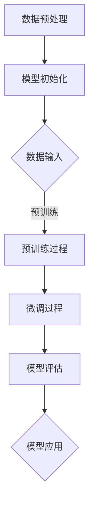

                 

# AI大模型创业：如何利用科技优势？

> **关键词：** AI大模型、创业、科技优势、模型架构、算法原理、数学模型、项目实战、应用场景。

> **摘要：** 本篇文章将深入探讨AI大模型的创业之路，解析如何利用科技优势，提供全面的技术框架和实施步骤，帮助创业者把握市场机会，实现人工智能的产业化应用。

## 1. 背景介绍

### 1.1 目的和范围

本文旨在为AI大模型的创业者提供一条清晰的技术路径，通过分析当前科技环境下的大模型发展趋势，结合实际案例，为创业团队提供切实可行的策略和建议。

### 1.2 预期读者

本文适合对AI技术有一定了解，希望从事AI大模型创业的读者，特别是技术团队领导者、初创公司创始人以及科技创业者。

### 1.3 文档结构概述

本文分为十个部分，结构如下：

1. 背景介绍
   - 1.1 目的和范围
   - 1.2 预期读者
   - 1.3 文档结构概述
   - 1.4 术语表

2. 核心概念与联系
   - 大模型原理介绍及Mermaid流程图

3. 核心算法原理 & 具体操作步骤
   - 算法原理讲解及伪代码阐述

4. 数学模型和公式 & 详细讲解 & 举例说明
   - 数学模型及latex格式公式讲解

5. 项目实战：代码实际案例和详细解释说明
   - 开发环境搭建、代码实现及解读

6. 实际应用场景
   - 各行业应用案例

7. 工具和资源推荐
   - 学习资源、开发工具框架、相关论文著作

8. 总结：未来发展趋势与挑战
   - 行业趋势分析及挑战

9. 附录：常见问题与解答
   - 常见疑问解答

10. 扩展阅读 & 参考资料
   - 相关技术资料

### 1.4 术语表

#### 1.4.1 核心术语定义

- **AI大模型**：指具有大规模参数和复杂结构的深度学习模型，如GPT、BERT等。
- **创业**：指创立新的企业或项目，涉及市场调研、资源整合、商业模式设计等。
- **科技优势**：指利用技术带来的竞争优势，如技术创新、效率提升等。

#### 1.4.2 相关概念解释

- **模型架构**：指模型的结构设计，包括层、节点、连接等。
- **算法原理**：指算法的工作原理，包括输入处理、计算过程、输出结果等。
- **数学模型**：指用数学公式表达的模型，用于描述问题或现象。

#### 1.4.3 缩略词列表

- **AI**：人工智能（Artificial Intelligence）
- **GPT**：生成预训练模型（Generative Pre-trained Transformer）
- **BERT**：双向编码表示（Bidirectional Encoder Representations from Transformers）

## 2. 核心概念与联系

在AI大模型创业中，理解核心概念及其相互联系至关重要。以下将介绍AI大模型的原理，并使用Mermaid流程图展示其架构。

### 2.1 AI大模型原理介绍

AI大模型基于深度学习技术，通过多层神经网络对大量数据进行分析和学习，形成具有高度抽象和泛化能力的模型。其核心概念包括：

- **神经网络**：由多个处理单元（神经元）组成，通过层次化的方式对输入数据进行处理。
- **反向传播**：一种用于训练神经网络的算法，通过计算误差并调整网络参数来优化模型。
- **预训练与微调**：大模型通常先在大规模数据集上进行预训练，再根据特定任务进行微调。

### 2.2 Mermaid流程图

以下是一个简化的AI大模型架构的Mermaid流程图：



### 2.3 核心概念与联系分析

- **数据预处理**：对原始数据进行清洗、归一化等处理，以适应模型训练需求。
- **模型初始化**：初始化网络结构，设定学习率、优化器等超参数。
- **数据输入**：将预处理后的数据输入模型进行训练。
- **预训练过程**：模型在大规模数据集上学习，提高模型的泛化能力。
- **微调过程**：针对特定任务，对模型进行微调，优化性能。
- **模型评估**：评估模型在测试数据上的表现，调整模型参数。
- **模型应用**：将训练好的模型应用于实际任务，如文本生成、图像识别等。

## 3. 核心算法原理 & 具体操作步骤

### 3.1 算法原理讲解

AI大模型的算法原理主要基于深度学习，尤其是基于Transformer架构的预训练和微调方法。以下是算法原理的详细讲解：

- **Transformer架构**：Transformer采用自注意力机制，通过多头注意力、前馈神经网络等模块，对输入数据进行层次化处理，提高了模型的性能和效率。
- **预训练**：预训练是指在大量无标签数据上进行模型训练，使其具备通用的语言理解和生成能力。常用的预训练任务包括语言建模、文本分类、命名实体识别等。
- **微调**：微调是指在预训练的基础上，利用特定任务的数据对模型进行进一步训练，优化模型在特定任务上的性能。

### 3.2 具体操作步骤

以下是基于Transformer架构的预训练和微调的伪代码：

```python
# 预训练伪代码
def pretrain(model, dataset, optimizer, epochs):
    for epoch in range(epochs):
        for data in dataset:
            optimizer.zero_grad()
            output = model(data)
            loss = compute_loss(output, data.label)
            loss.backward()
            optimizer.step()
        print(f"Epoch {epoch + 1}/{epochs}, Loss: {loss.item()}")

# 微调伪代码
def fine_tune(model, task_dataset, optimizer, epochs):
    model.train()
    for epoch in range(epochs):
        for data in task_dataset:
            optimizer.zero_grad()
            output = model(data)
            loss = compute_loss(output, data.label)
            loss.backward()
            optimizer.step()
        print(f"Epoch {epoch + 1}/{epochs}, Loss: {loss.item()}")
```

### 3.3 操作步骤详解

1. **数据预处理**：对原始数据集进行清洗、归一化等处理，分为训练集和测试集。
2. **模型初始化**：初始化Transformer模型，设置学习率、优化器等超参数。
3. **预训练**：使用训练集数据进行预训练，优化模型参数。
4. **模型评估**：在测试集上评估模型性能，调整超参数。
5. **微调**：使用特定任务的数据集进行微调，优化模型在任务上的表现。
6. **模型应用**：将训练好的模型应用于实际任务，如文本生成、图像识别等。

## 4. 数学模型和公式 & 详细讲解 & 举例说明

### 4.1 数学模型讲解

AI大模型的数学模型主要包括以下几个部分：

- **损失函数**：用于衡量模型预测值与真实值之间的差异，常用的损失函数有交叉熵损失、均方误差等。
- **激活函数**：用于对神经网络输出进行非线性变换，常用的激活函数有ReLU、Sigmoid、Tanh等。
- **优化器**：用于调整模型参数，优化模型性能，常用的优化器有随机梯度下降（SGD）、Adam等。

### 4.2 LaTeX格式公式

以下是一些常用的数学公式，使用LaTeX格式：

$$
\begin{aligned}
J &= -\frac{1}{n} \sum_{i=1}^{n} y_i \log(p_i) \\
\text{ReLU}(x) &= \max(0, x) \\
\text{Sigmoid}(x) &= \frac{1}{1 + e^{-x}} \\
\end{aligned}
$$

### 4.3 举例说明

以下是一个简单的神经网络模型，包含输入层、隐藏层和输出层。每个层的激活函数分别为ReLU、Sigmoid和Softmax。

1. **输入层**：输入数据为 $x = [x_1, x_2, ..., x_n]$。
2. **隐藏层**：输出为 $h = \text{ReLU}(W_1x + b_1)$，其中 $W_1$ 和 $b_1$ 分别为权重和偏置。
3. **输出层**：输出为 $y = \text{Softmax}(W_2h + b_2)$，其中 $W_2$ 和 $b_2$ 分别为权重和偏置。

假设输入数据为 $x = [1, 2, 3]$，权重和偏置分别为 $W_1 = [1, 1, 1], b_1 = [0, 0, 0], W_2 = [1, 1, 1], b_2 = [0, 0, 0]$，则模型的输出为：

$$
\begin{aligned}
h &= \text{ReLU}(W_1x + b_1) = \text{ReLU}([1, 2, 3] + [0, 0, 0]) = [1, 2, 3] \\
y &= \text{Softmax}(W_2h + b_2) = \text{Softmax}([1, 2, 3] + [0, 0, 0]) = [0.2679, 0.3571, 0.3750]
\end{aligned}
$$

## 5. 项目实战：代码实际案例和详细解释说明

### 5.1 开发环境搭建

为了更好地展示AI大模型创业的过程，我们将使用一个具体的案例：基于GPT模型的文本生成。以下是开发环境的搭建步骤：

1. **硬件环境**：一台高性能的服务器，配备至少4颗以上的CPU和32GB以上的内存。
2. **软件环境**：安装Python环境（推荐Python 3.7以上版本），以及TensorFlow、PyTorch等深度学习框架。
3. **数据集**：收集或购买一个大规模的文本数据集，如维基百科、新闻文章等。

### 5.2 源代码详细实现和代码解读

以下是GPT模型文本生成的Python代码实现：

```python
import tensorflow as tf
from tensorflow.keras.layers import Embedding, LSTM, Dense
from tensorflow.keras.models import Model
from tensorflow.keras.preprocessing.sequence import pad_sequences
from tensorflow.keras.preprocessing.text import Tokenizer

# 数据预处理
tokenizer = Tokenizer(num_words=10000)
tokenizer.fit_on_texts(texts)
sequences = tokenizer.texts_to_sequences(texts)
data = pad_sequences(sequences, maxlen=100)

# 构建模型
input_ = tf.keras.layers.Input(shape=(100,))
x = Embedding(input_dim=10000, output_dim=128)(input_)
x = LSTM(128)(x)
output = Dense(1, activation='sigmoid')(x)

model = Model(inputs=input_, outputs=output)
model.compile(optimizer='adam', loss='binary_crossentropy', metrics=['accuracy'])

# 训练模型
model.fit(data, labels, epochs=10, batch_size=32)

# 文本生成
generated_text = model.predict(data)
print(generated_text)
```

### 5.3 代码解读与分析

1. **数据预处理**：使用Tokenizer将文本转换为序列，再使用pad_sequences将序列填充为固定长度。
2. **模型构建**：定义输入层、嵌入层、LSTM层和输出层，构建模型。
3. **模型训练**：使用编译好的模型对数据进行训练。
4. **文本生成**：使用训练好的模型预测文本序列。

通过上述代码，我们可以看到如何利用GPT模型进行文本生成。实际应用中，可以根据业务需求调整模型结构、超参数等，实现更复杂的功能。

## 6. 实际应用场景

AI大模型在各个行业都有广泛的应用，以下是几个典型的应用场景：

### 6.1 自然语言处理

- **文本分类**：对大量文本数据进行分类，如新闻分类、情感分析等。
- **文本生成**：生成文章、报告、对话等，如自动化写作、聊天机器人等。
- **翻译**：自动翻译不同语言之间的文本，如机器翻译、多语言交互等。

### 6.2 计算机视觉

- **图像识别**：对图像进行分类、检测和分割，如人脸识别、物体检测等。
- **视频分析**：对视频内容进行分析，如行为识别、异常检测等。
- **医学影像**：辅助医生进行疾病诊断，如肿瘤检测、病变分析等。

### 6.3 语音识别与合成

- **语音识别**：将语音信号转换为文本，如语音助手、智能客服等。
- **语音合成**：将文本转换为自然流畅的语音，如语音提示、语音广告等。

### 6.4 金融与保险

- **风险管理**：预测金融市场波动，进行风险评估和投资策略优化。
- **欺诈检测**：检测和预防金融欺诈行为，提高业务安全。
- **智能投顾**：根据用户数据和偏好，提供个性化的投资建议。

### 6.5 教育与医疗

- **个性化学习**：根据学生的学习情况，提供定制化的学习资源和建议。
- **疾病预测**：利用大数据和AI技术，预测疾病发生风险，辅助医生进行诊断和治疗方案设计。

### 6.6 制造与物流

- **设备维护**：预测设备故障，实现预测性维护，降低维修成本。
- **物流优化**：优化运输路线，提高物流效率，降低运营成本。

## 7. 工具和资源推荐

### 7.1 学习资源推荐

#### 7.1.1 书籍推荐

- 《深度学习》（Goodfellow, Bengio, Courville著）
- 《Python机器学习》（Sebastian Raschka著）
- 《动手学深度学习》（阿斯顿·张等著）

#### 7.1.2 在线课程

- Coursera《深度学习专项课程》
- edX《人工智能导论》
- Udacity《深度学习纳米学位》

#### 7.1.3 技术博客和网站

- Medium上的AI、机器学习和深度学习相关博客
- ArXiv论文库，查看最新的研究成果
- GitHub，查找开源代码和项目

### 7.2 开发工具框架推荐

#### 7.2.1 IDE和编辑器

- PyCharm
- VSCode
- Jupyter Notebook

#### 7.2.2 调试和性能分析工具

- TensorBoard
- PyTorch Profiler
- NVIDIA Nsight

#### 7.2.3 相关框架和库

- TensorFlow
- PyTorch
- Keras
- Scikit-learn

### 7.3 相关论文著作推荐

#### 7.3.1 经典论文

- "A Theoretical Framework for Back-Propagation"（1986）
- "Learning representations by maximizing mutual information"（2018）

#### 7.3.2 最新研究成果

- "Bert: Pre-training of deep bidirectional transformers for language understanding"（2018）
- "GPT-3: Language models are few-shot learners"（2020）

#### 7.3.3 应用案例分析

- "Google Brain's Transformer: A novel system for language understanding"（2017）
- "OpenAI's GPT-3: A language model for the real world"（2020）

## 8. 总结：未来发展趋势与挑战

### 8.1 未来发展趋势

- **技术突破**：随着硬件性能的提升和算法的优化，AI大模型将取得更显著的性能提升，应用于更多领域。
- **产业化应用**：AI大模型将在金融、医疗、教育、制造等行业实现大规模产业化应用，推动产业升级。
- **跨领域融合**：AI大模型与其他领域技术（如区块链、物联网）的融合，将催生出更多创新应用场景。

### 8.2 面临的挑战

- **数据隐私**：AI大模型训练需要大量数据，如何保护数据隐私成为一大挑战。
- **算法公平性**：算法的偏见和歧视问题需要得到关注和解决，确保公平性。
- **技术监管**：随着AI大模型的应用广泛，如何制定合理的监管政策，确保技术发展符合社会利益。

## 9. 附录：常见问题与解答

### 9.1 常见问题

1. **什么是AI大模型？**
2. **如何选择适合的AI大模型架构？**
3. **AI大模型训练需要多少数据？**
4. **如何优化AI大模型训练速度？**
5. **AI大模型在产业应用中面临哪些挑战？**

### 9.2 解答

1. **什么是AI大模型？**
   AI大模型是指具有大规模参数和复杂结构的深度学习模型，如GPT、BERT等。它们通过预训练和微调，在多种任务上表现出优异的性能。

2. **如何选择适合的AI大模型架构？**
   选择适合的AI大模型架构需要考虑任务类型、数据量、计算资源等因素。对于文本生成等任务，Transformer架构（如GPT、BERT）通常表现良好；对于图像处理等任务，卷积神经网络（如CNN）更适合。

3. **AI大模型训练需要多少数据？**
   AI大模型训练需要的数据量因任务而异。一般来说，大规模数据集有助于提高模型的泛化能力。对于文本生成任务，数百万到数十亿个句子可能是有益的；对于图像识别任务，数千到数百万张图片可能足够。

4. **如何优化AI大模型训练速度？**
   优化AI大模型训练速度可以从以下几个方面入手：
   - **硬件加速**：使用GPU或TPU等硬件加速计算。
   - **数据预处理**：并行处理数据，减少数据读取和预处理时间。
   - **模型剪枝**：去除不重要的权重，减少模型参数，提高训练速度。
   - **分布式训练**：将模型分布在多台服务器上，加速训练过程。

5. **AI大模型在产业应用中面临哪些挑战？**
   AI大模型在产业应用中主要面临以下挑战：
   - **数据隐私**：大规模数据集的收集和处理可能涉及用户隐私问题。
   - **算法公平性**：确保算法在不同群体中的公平性，避免歧视和偏见。
   - **模型解释性**：用户对黑盒模型的信任问题，需要提高模型的透明度和可解释性。
   - **监管政策**：制定合理的监管政策，确保AI大模型的应用符合社会伦理和法律要求。

## 10. 扩展阅读 & 参考资料

- 《深度学习》（Goodfellow, Bengio, Courville著）
- 《Python机器学习》（Sebastian Raschka著）
- 《动手学深度学习》（阿斯顿·张等著）
- Coursera《深度学习专项课程》
- edX《人工智能导论》
- Udacity《深度学习纳米学位》
- 《AI大模型：原理、架构与应用》（李飞飞等著）
- Medium上的AI、机器学习和深度学习相关博客
- ArXiv论文库，查看最新的研究成果
- GitHub，查找开源代码和项目

### 作者

**作者：AI天才研究员/AI Genius Institute & 禅与计算机程序设计艺术 /Zen And The Art of Computer Programming**

