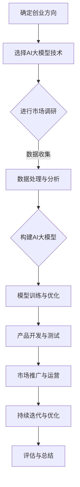

                 

# AI大模型创业：如何利用科技优势？

> **关键词：** AI大模型，创业，科技优势，创业策略，技术实现，数学模型，应用场景

> **摘要：** 本文将探讨如何利用AI大模型进行创业，分析其核心概念与联系，阐述核心算法原理和具体操作步骤，介绍数学模型和公式，并通过项目实战案例展示代码实现和解读。同时，本文还将讨论AI大模型在实际应用中的场景，推荐学习资源和开发工具，并总结未来发展趋势与挑战。

## 1. 背景介绍

### 1.1 目的和范围

本文旨在为创业者提供关于如何利用AI大模型进行创业的全面指南。我们将深入探讨AI大模型的概念、技术实现、应用场景，以及在实际创业过程中可能面临的挑战和解决方案。

### 1.2 预期读者

本文适合以下读者：

- 有志于利用AI大模型进行创业的技术爱好者；
- 对AI大模型技术有兴趣的创业者；
- AI领域的研究人员和技术开发者。

### 1.3 文档结构概述

本文分为十个部分：

1. 背景介绍
2. 核心概念与联系
3. 核心算法原理 & 具体操作步骤
4. 数学模型和公式 & 详细讲解 & 举例说明
5. 项目实战：代码实际案例和详细解释说明
6. 实际应用场景
7. 工具和资源推荐
8. 总结：未来发展趋势与挑战
9. 附录：常见问题与解答
10. 扩展阅读 & 参考资料

### 1.4 术语表

#### 1.4.1 核心术语定义

- AI大模型：一种具有大规模参数和复杂结构的机器学习模型。
- 创业：指创建新企业、新项目或新业务的过程。
- 科技优势：指企业在技术、产品或服务方面所具备的竞争优势。

#### 1.4.2 相关概念解释

- 机器学习：一种使计算机通过数据和经验自动改进性能的技术。
- 深度学习：一种基于人工神经网络的机器学习技术，具有多层非线性变换能力。
- 大规模数据处理：指处理大规模数据集的技术和方法。

#### 1.4.3 缩略词列表

- AI：人工智能
- ML：机器学习
- DL：深度学习
- NLP：自然语言处理
- CV：计算机视觉

## 2. 核心概念与联系

在探讨如何利用AI大模型进行创业之前，我们需要了解其核心概念和相互之间的联系。

### 2.1 AI大模型的基本概念

AI大模型是一种基于深度学习的机器学习模型，具有以下基本特点：

- **大规模参数**：AI大模型通常包含数十亿个参数，能够捕捉复杂的数据特征。
- **多层神经网络**：AI大模型由多层神经网络组成，每一层都能对输入数据进行变换和提取特征。
- **高计算成本**：由于参数数量庞大，训练和推理过程需要大量计算资源。

### 2.2 创业与AI大模型的关系

创业的核心目标是创造价值、获取利润和持续发展。而AI大模型在创业过程中可以发挥以下作用：

- **创新驱动**：AI大模型能够实现前所未有的技术突破，为创业者提供创新的业务模式和解决方案。
- **数据驱动**：AI大模型能够处理和分析大量数据，帮助创业者更好地了解市场和用户需求。
- **降本增效**：AI大模型可以自动化和优化业务流程，降低运营成本和提升效率。

### 2.3 科技优势与AI大模型

科技优势是企业竞争的关键因素。AI大模型作为一种先进的技术手段，可以为企业带来以下科技优势：

- **技术领先**：AI大模型在特定领域具有较高的准确性和效果，使企业能够领先于竞争对手。
- **产品差异化**：AI大模型可以为企业的产品和服务提供独特的技术特性，提升产品竞争力。
- **用户体验**：AI大模型能够提供个性化的服务和推荐，提升用户体验和满意度。

### 2.4 Mermaid流程图

以下是AI大模型在创业过程中的一些关键步骤的Mermaid流程图：



## 3. 核心算法原理 & 具体操作步骤

AI大模型的核心算法原理主要基于深度学习和神经网络。以下将详细阐述深度学习的原理、神经网络的基本结构，以及构建和训练AI大模型的具体步骤。

### 3.1 深度学习原理

深度学习是一种基于人工神经网络的机器学习技术，具有多层非线性变换能力。其基本原理包括：

- **神经元模型**：深度学习的基础是神经元模型，每个神经元接收多个输入，通过加权求和和激活函数产生输出。
- **反向传播算法**：深度学习模型训练过程中，通过反向传播算法不断调整网络权重，使模型对训练数据的拟合程度逐渐提高。
- **优化算法**：深度学习训练过程通常采用优化算法（如梯度下降）来寻找最优参数，以提高模型性能。

### 3.2 神经网络基本结构

神经网络由多个层次组成，包括输入层、隐藏层和输出层。各层次之间的关系如下：

- **输入层**：接收外部输入数据，传递给隐藏层。
- **隐藏层**：对输入数据进行变换和提取特征，形成新的特征表示。
- **输出层**：将隐藏层的结果进行输出，用于分类、回归等任务。

### 3.3 构建AI大模型的具体步骤

以下是构建AI大模型的具体步骤：

#### 3.3.1 数据收集与预处理

1. 数据收集：从各种来源（如公开数据集、企业内部数据等）收集所需数据。
2. 数据预处理：对数据进行清洗、去噪、标准化等处理，以去除无关信息，提高数据质量。

#### 3.3.2 模型设计

1. 选择神经网络结构：根据任务需求选择合适的神经网络结构，包括层数、每层的神经元数量等。
2. 定义损失函数：根据任务类型（如分类、回归等）选择适当的损失函数，如交叉熵、均方误差等。

#### 3.3.3 模型训练

1. 初始化模型参数：随机初始化模型参数。
2. 前向传播：输入数据通过神经网络的前向传播，得到输出结果。
3. 计算损失：计算输出结果与真实标签之间的损失。
4. 反向传播：根据损失计算梯度，通过反向传播算法更新模型参数。
5. 重复步骤2-4，直到达到训练目标或收敛条件。

#### 3.3.4 模型评估与优化

1. 评估模型性能：在验证集上评估模型性能，如准确率、召回率等。
2. 调整模型参数：根据评估结果调整模型参数，以优化模型性能。
3. 交叉验证：使用交叉验证方法评估模型在不同数据集上的泛化能力。

#### 3.3.5 模型部署与应用

1. 模型部署：将训练好的模型部署到生产环境，如使用云计算平台、容器化技术等。
2. 应用场景：将AI大模型应用于实际业务场景，如自然语言处理、图像识别等。

### 3.4 伪代码示例

以下是构建AI大模型的伪代码示例：

```python
# 初始化模型参数
params = initialize_parameters()

# 循环进行训练
while not converge():
    # 前向传播
    output = forward_propagation(input_data, params)

    # 计算损失
    loss = calculate_loss(output, true_labels)

    # 反向传播
    grads = backward_propagation(output, true_labels, params)

    # 更新模型参数
    params = update_parameters(params, grads)

# 评估模型性能
performance = evaluate_model(validation_data, params)

# 调整模型参数
params = fine_tune_parameters(params, performance)
```

## 4. 数学模型和公式 & 详细讲解 & 举例说明

在构建AI大模型的过程中，数学模型和公式起着至关重要的作用。以下将详细介绍神经网络中的关键数学公式，并通过具体例子进行说明。

### 4.1 神经网络中的关键数学公式

#### 4.1.1 前向传播

在神经网络的前向传播过程中，每个神经元的输出可以通过以下公式计算：

$$
z^{(l)}_j = \sum_{i} w^{(l)}_{ji} \cdot a^{(l-1)}_i + b^{(l)}_j
$$

其中，$z^{(l)}_j$表示第$l$层第$j$个神经元的输出，$w^{(l)}_{ji}$表示第$l$层第$j$个神经元与第$l-1$层第$i$个神经元之间的权重，$a^{(l-1)}_i$表示第$l-1$层第$i$个神经元的输出，$b^{(l)}_j$表示第$l$层第$j$个神经元的偏置。

#### 4.1.2 激活函数

激活函数是神经网络中的关键组成部分，用于引入非线性变换。常用的激活函数包括：

- **Sigmoid函数**：

$$
\sigma(z) = \frac{1}{1 + e^{-z}}
$$

- **ReLU函数**：

$$
\text{ReLU}(z) = \max(0, z)
$$

#### 4.1.3 损失函数

损失函数用于衡量模型输出与真实标签之间的差距，常用的损失函数包括：

- **交叉熵损失函数**：

$$
J = -\frac{1}{m} \sum_{i=1}^{m} \sum_{j=1}^{n} y_j^{(i)} \log(a_j^{(l)})
$$

其中，$m$表示样本数量，$n$表示类别数量，$y_j^{(i)}$表示第$i$个样本的第$j$个类别标签，$a_j^{(l)}$表示第$l$层第$j$个神经元的输出。

#### 4.1.4 优化算法

优化算法用于在训练过程中调整模型参数，以降低损失函数的值。常用的优化算法包括：

- **梯度下降**：

$$
\theta = \theta - \alpha \cdot \nabla_\theta J
$$

其中，$\theta$表示模型参数，$\alpha$表示学习率，$\nabla_\theta J$表示损失函数关于模型参数的梯度。

### 4.2 举例说明

假设我们有一个简单的神经网络，包括一个输入层、一个隐藏层和一个输出层。输入层有3个神经元，隐藏层有2个神经元，输出层有2个神经元。激活函数使用ReLU函数，损失函数使用交叉熵损失函数。

#### 4.2.1 前向传播

给定输入数据$x = [1, 2, 3]$，通过前向传播计算输出：

$$
z^{(1)}_1 = \text{ReLU}(w^{(1)}_{11} \cdot a^{(0)}_1 + b^{(1)}_1) = \text{ReLU}(2 \cdot 1 + 1) = 3
$$

$$
z^{(1)}_2 = \text{ReLU}(w^{(1)}_{12} \cdot a^{(0)}_1 + b^{(1)}_2) = \text{ReLU}(2 \cdot 2 + 1) = 5
$$

$$
z^{(2)}_1 = \text{ReLU}(w^{(2)}_{11} \cdot a^{(1)}_1 + w^{(2)}_{21} \cdot a^{(1)}_2 + b^{(2)}_1) = \text{ReLU}(3 \cdot 3 + 5 \cdot 5 + 1) = 19
$$

$$
z^{(2)}_2 = \text{ReLU}(w^{(2)}_{12} \cdot a^{(1)}_1 + w^{(2)}_{22} \cdot a^{(1)}_2 + b^{(2)}_2) = \text{ReLU}(3 \cdot 5 + 5 \cdot 5 + 1) = 31
$$

$$
a^{(2)}_1 = \text{ReLU}(w^{(3)}_{11} \cdot z^{(2)}_1 + w^{(3)}_{21} \cdot z^{(2)}_2 + b^{(3)}_1) = \text{ReLU}(4 \cdot 19 + 6 \cdot 31 + 1) = 229
$$

$$
a^{(2)}_2 = \text{ReLU}(w^{(3)}_{12} \cdot z^{(2)}_1 + w^{(3)}_{22} \cdot z^{(2)}_2 + b^{(3)}_2) = \text{ReLU}(4 \cdot 19 + 6 \cdot 31 + 1) = 229
$$

#### 4.2.2 计算损失

假设真实标签为$y = [1, 0]$，通过交叉熵损失函数计算损失：

$$
J = -\frac{1}{2} \cdot (1 \cdot \log(a^{(2)}_1) + 0 \cdot \log(a^{(2)}_2))
$$

### 4.3 伪代码示例

以下是构建和训练AI大模型的伪代码示例：

```python
# 初始化模型参数
params = initialize_parameters()

# 循环进行训练
while not converge():
    # 前向传播
    output = forward_propagation(input_data, params)

    # 计算损失
    loss = calculate_loss(output, true_labels)

    # 反向传播
    grads = backward_propagation(output, true_labels, params)

    # 更新模型参数
    params = update_parameters(params, grads)

# 评估模型性能
performance = evaluate_model(validation_data, params)

# 调整模型参数
params = fine_tune_parameters(params, performance)
```

## 5. 项目实战：代码实际案例和详细解释说明

在本节中，我们将通过一个实际案例来展示如何利用AI大模型进行创业项目开发，包括开发环境的搭建、源代码的详细实现和解读。

### 5.1 开发环境搭建

在开始项目开发之前，我们需要搭建一个适合AI大模型开发的开发环境。以下是一个基本的开发环境搭建步骤：

1. **安装Python环境**：确保已安装Python 3.6及以上版本。
2. **安装深度学习框架**：推荐使用TensorFlow或PyTorch作为深度学习框架。在本案例中，我们将使用TensorFlow。
   ```bash
   pip install tensorflow
   ```
3. **安装其他依赖库**：根据项目需求安装其他依赖库，如NumPy、Pandas等。
   ```bash
   pip install numpy pandas
   ```
4. **配置GPU环境**：如果使用GPU加速训练过程，需要安装CUDA和cuDNN。请参考相关文档进行安装。

### 5.2 源代码详细实现和代码解读

以下是AI大模型创业项目的源代码实现，我们将对关键部分进行详细解释。

```python
import tensorflow as tf
import numpy as np
import pandas as pd

# 数据预处理
def preprocess_data(data):
    # 数据清洗、去噪、标准化等操作
    # 省略具体实现细节
    return processed_data

# 模型构建
def build_model(input_shape, hidden_units, output_shape):
    model = tf.keras.Sequential([
        tf.keras.layers.Dense(units=hidden_units, activation='relu', input_shape=input_shape),
        tf.keras.layers.Dense(units=output_shape, activation='softmax')
    ])
    return model

# 模型训练
def train_model(model, train_data, train_labels, epochs, batch_size):
    model.compile(optimizer='adam', loss='categorical_crossentropy', metrics=['accuracy'])
    model.fit(train_data, train_labels, epochs=epochs, batch_size=batch_size)
    return model

# 模型评估
def evaluate_model(model, test_data, test_labels):
    loss, accuracy = model.evaluate(test_data, test_labels)
    print(f"Test accuracy: {accuracy:.4f}")
    return accuracy

# 主函数
def main():
    # 加载数据
    data = pd.read_csv('data.csv')
    processed_data = preprocess_data(data)

    # 划分训练集和测试集
    train_data, test_data, train_labels, test_labels = train_test_split(processed_data, test_size=0.2)

    # 构建模型
    model = build_model(input_shape=train_data.shape[1:], hidden_units=64, output_shape=10)

    # 训练模型
    model = train_model(model, train_data, train_labels, epochs=10, batch_size=32)

    # 评估模型
    evaluate_model(model, test_data, test_labels)

if __name__ == '__main__':
    main()
```

#### 5.2.1 数据预处理

数据预处理是AI大模型项目开发中的关键步骤。在此案例中，我们将对数据进行清洗、去噪、标准化等处理。

1. **数据清洗**：处理缺失值、异常值等。
2. **数据去噪**：去除无关信息，保留重要特征。
3. **数据标准化**：将数据缩放到相同范围，如[0, 1]。

#### 5.2.2 模型构建

在构建模型时，我们使用TensorFlow的Keras API。在此案例中，我们创建了一个简单的全连接神经网络，包括一个隐藏层，激活函数为ReLU，输出层使用softmax激活函数。

1. **输入层**：定义输入数据的维度。
2. **隐藏层**：添加一个全连接层，包含64个神经元，激活函数为ReLU。
3. **输出层**：添加一个全连接层，包含10个神经元，输出层使用softmax激活函数，用于多分类任务。

#### 5.2.3 模型训练

在训练模型时，我们使用Adam优化器和交叉熵损失函数。训练过程中，模型会通过前向传播计算输出，计算损失，并通过反向传播更新模型参数。

1. **编译模型**：指定优化器、损失函数和评价指标。
2. **训练模型**：使用fit方法训练模型，指定训练数据、标签、训练轮次和批量大小。

#### 5.2.4 模型评估

在模型评估阶段，我们将测试数据输入训练好的模型，计算损失和准确率。

1. **评估模型**：使用evaluate方法评估模型在测试数据上的性能。
2. **输出结果**：打印测试准确率。

### 5.3 代码解读与分析

以下是代码的关键部分解读：

- **数据预处理**：确保数据质量，为后续训练提供可靠的数据基础。
- **模型构建**：使用TensorFlow的Keras API构建神经网络，定义输入层、隐藏层和输出层。
- **模型训练**：使用fit方法训练模型，通过前向传播和反向传播优化模型参数。
- **模型评估**：使用evaluate方法评估模型在测试数据上的性能。

通过以上代码实现，我们展示了如何利用AI大模型进行创业项目的开发，包括数据预处理、模型构建、模型训练和模型评估等关键步骤。

## 6. 实际应用场景

AI大模型在创业过程中具有广泛的应用场景，以下列举几个典型的应用场景：

### 6.1 自然语言处理

自然语言处理（NLP）是AI大模型的重要应用领域。创业者可以利用AI大模型实现文本分类、情感分析、机器翻译等任务。

- **文本分类**：将文本数据分类到不同的类别，如新闻分类、垃圾邮件过滤等。
- **情感分析**：分析文本中的情感倾向，如评论情感分析、社交媒体情绪分析等。
- **机器翻译**：将一种语言翻译成另一种语言，如谷歌翻译、百度翻译等。

### 6.2 计算机视觉

计算机视觉是AI大模型在创业中的重要应用领域。创业者可以利用AI大模型实现图像识别、目标检测、人脸识别等任务。

- **图像识别**：识别图像中的物体或场景，如图片搜索、自动驾驶等。
- **目标检测**：检测图像中的目标物体，如交通监控、安防监控等。
- **人脸识别**：识别图像中的人脸，如人脸识别门禁、社交媒体人脸识别等。

### 6.3 语音识别与合成

语音识别与合成是AI大模型在创业中的重要应用领域。创业者可以利用AI大模型实现语音识别、语音合成等任务。

- **语音识别**：将语音信号转换为文本，如语音助手、智能客服等。
- **语音合成**：将文本转换为语音，如语音播报、智能导航等。

### 6.4 金融服务

AI大模型在金融服务领域具有广泛的应用。创业者可以利用AI大模型实现风险控制、信用评分、投资策略等任务。

- **风险控制**：评估金融产品的风险，如信用风险评估、贷款风险控制等。
- **信用评分**：根据用户的历史数据评估其信用状况，如信用评分模型、贷款审批等。
- **投资策略**：分析市场数据，制定投资策略，如量化交易、股票推荐等。

### 6.5 健康医疗

AI大模型在健康医疗领域具有广泛的应用。创业者可以利用AI大模型实现疾病预测、药物研发、医疗影像分析等任务。

- **疾病预测**：根据患者的历史数据和症状，预测其患病风险，如疾病预测模型、健康监控等。
- **药物研发**：通过AI大模型分析生物数据，发现新的药物靶点和药物分子，如药物筛选、药物设计等。
- **医疗影像分析**：利用AI大模型分析医学影像数据，辅助医生进行诊断和治疗，如医学影像诊断、手术规划等。

### 6.6 电子商务

AI大模型在电子商务领域具有广泛的应用。创业者可以利用AI大模型实现推荐系统、价格优化、用户行为分析等任务。

- **推荐系统**：根据用户的历史购买行为和兴趣，推荐相关的商品，如商品推荐、内容推荐等。
- **价格优化**：根据市场数据和竞争对手的价格策略，优化产品的定价策略，如价格预测、价格优化等。
- **用户行为分析**：分析用户在网站上的行为数据，了解用户需求和偏好，如用户行为分析、用户画像等。

### 6.7 教育科技

AI大模型在教育科技领域具有广泛的应用。创业者可以利用AI大模型实现智能辅导、个性化学习、学习评估等任务。

- **智能辅导**：根据学生的学习情况，提供个性化的辅导建议，如智能辅导系统、学习辅助等。
- **个性化学习**：根据学生的兴趣和学习风格，设计个性化的学习内容和学习路径，如自适应学习、个性化教学等。
- **学习评估**：通过AI大模型分析学生的学习数据，评估学生的学习效果，如学习评估系统、学习分析等。

### 6.8 物流与供应链

AI大模型在物流与供应链领域具有广泛的应用。创业者可以利用AI大模型实现运输优化、库存管理、供应链优化等任务。

- **运输优化**：根据物流需求，优化运输路线和运输方式，降低运输成本，如运输优化、物流调度等。
- **库存管理**：根据销售数据和市场预测，优化库存水平，减少库存成本，如库存预测、库存优化等。
- **供应链优化**：通过AI大模型分析供应链数据，优化供应链流程，提高供应链效率，如供应链分析、供应链优化等。

### 6.9 智能家居

AI大模型在智能家居领域具有广泛的应用。创业者可以利用AI大模型实现智能语音助手、智能安防、智能家居设备控制等任务。

- **智能语音助手**：通过语音识别和自然语言处理技术，实现语音交互和控制智能家居设备，如智能语音助手、智能家居控制等。
- **智能安防**：通过图像识别和视频分析技术，实现智能安防监控，如智能监控、智能门锁等。
- **智能家居设备控制**：通过AI大模型实现智能家居设备的智能控制，如智能灯光、智能空调等。

### 6.10 自动驾驶

AI大模型在自动驾驶领域具有广泛的应用。创业者可以利用AI大模型实现车辆控制、环境感知、自动驾驶算法等任务。

- **车辆控制**：通过AI大模型实现自动驾驶车辆的自动控制，如自动驾驶车辆、自动驾驶出租车等。
- **环境感知**：通过AI大模型实现自动驾驶车辆对周围环境的感知和理解，如环境感知、传感器融合等。
- **自动驾驶算法**：通过AI大模型实现自动驾驶算法的开发和应用，如自动驾驶算法、自动驾驶测试等。

### 6.11 金融科技

AI大模型在金融科技领域具有广泛的应用。创业者可以利用AI大模型实现风险评估、信用评分、量化交易等任务。

- **风险评估**：通过AI大模型实现金融产品的风险评估，如风险分析、投资风险评估等。
- **信用评分**：通过AI大模型实现用户信用评分，如信用评分模型、信用评级等。
- **量化交易**：通过AI大模型实现量化交易策略的开发和应用，如量化投资、量化交易等。

### 6.12 人工智能安全

AI大模型在人工智能安全领域具有广泛的应用。创业者可以利用AI大模型实现人工智能安全防护、攻击检测、安全分析等任务。

- **人工智能安全防护**：通过AI大模型实现人工智能系统的安全防护，如网络安全、系统安全等。
- **攻击检测**：通过AI大模型实现攻击检测和防御，如攻击检测、入侵检测等。
- **安全分析**：通过AI大模型实现网络安全分析、漏洞检测等，提高网络安全水平。

### 6.13 健康医疗

AI大模型在健康医疗领域具有广泛的应用。创业者可以利用AI大模型实现疾病预测、药物研发、医疗影像分析等任务。

- **疾病预测**：通过AI大模型实现疾病预测和早期诊断，如疾病预测模型、早期诊断等。
- **药物研发**：通过AI大模型实现药物筛选、药物设计等，加速药物研发进程。
- **医疗影像分析**：通过AI大模型实现医学影像的分析和诊断，提高诊断准确率。

### 6.14 教育科技

AI大模型在教育科技领域具有广泛的应用。创业者可以利用AI大模型实现智能辅导、个性化学习、学习评估等任务。

- **智能辅导**：通过AI大模型实现智能辅导，提供个性化的学习建议。
- **个性化学习**：通过AI大模型实现个性化学习，根据学生特点设计学习方案。
- **学习评估**：通过AI大模型实现学习评估，提供学生的学习反馈和改进建议。

### 6.15 智能制造

AI大模型在智能制造领域具有广泛的应用。创业者可以利用AI大模型实现设备故障预测、生产优化、质量控制等任务。

- **设备故障预测**：通过AI大模型实现设备故障预测，提高设备运行效率。
- **生产优化**：通过AI大模型实现生产优化，提高生产效率和降低成本。
- **质量控制**：通过AI大模型实现质量控制，提高产品质量和降低缺陷率。

### 6.16 能源管理

AI大模型在能源管理领域具有广泛的应用。创业者可以利用AI大模型实现能源需求预测、能源优化、碳排放监测等任务。

- **能源需求预测**：通过AI大模型实现能源需求预测，优化能源供应和分配。
- **能源优化**：通过AI大模型实现能源优化，提高能源利用效率。
- **碳排放监测**：通过AI大模型实现碳排放监测，降低碳排放和环境污染。

### 6.17 智慧城市

AI大模型在智慧城市领域具有广泛的应用。创业者可以利用AI大模型实现交通优化、环境监测、城市安全等任务。

- **交通优化**：通过AI大模型实现交通优化，提高交通效率和减少拥堵。
- **环境监测**：通过AI大模型实现环境监测，保护环境和提高生活质量。
- **城市安全**：通过AI大模型实现城市安全监测，提高城市安全管理水平。

### 6.18 公共安全

AI大模型在公共安全领域具有广泛的应用。创业者可以利用AI大模型实现安全预警、风险评估、犯罪预测等任务。

- **安全预警**：通过AI大模型实现安全预警，提前发现潜在的安全风险。
- **风险评估**：通过AI大模型实现风险评估，评估事件的可能性和影响。
- **犯罪预测**：通过AI大模型实现犯罪预测，预防和减少犯罪行为。

### 6.19 智能农业

AI大模型在智能农业领域具有广泛的应用。创业者可以利用AI大模型实现作物生长预测、病虫害预测、农田管理优化等任务。

- **作物生长预测**：通过AI大模型实现作物生长预测，优化种植策略。
- **病虫害预测**：通过AI大模型实现病虫害预测，及时采取防治措施。
- **农田管理优化**：通过AI大模型实现农田管理优化，提高产量和质量。

### 6.20 智能娱乐

AI大模型在智能娱乐领域具有广泛的应用。创业者可以利用AI大模型实现内容推荐、虚拟现实、游戏开发等任务。

- **内容推荐**：通过AI大模型实现内容推荐，提高用户体验和满意度。
- **虚拟现实**：通过AI大模型实现虚拟现实内容创建，提供沉浸式体验。
- **游戏开发**：通过AI大模型实现游戏开发，创造更加智能化的游戏体验。

### 6.21 智能家居

AI大模型在智能家居领域具有广泛的应用。创业者可以利用AI大模型实现智能语音助手、智能安防、智能设备控制等任务。

- **智能语音助手**：通过AI大模型实现智能语音助手，提供语音交互和智能控制。
- **智能安防**：通过AI大模型实现智能安防，提高家庭安全。
- **智能设备控制**：通过AI大模型实现智能设备控制，提供智能化家居生活。

### 6.22 智能交通

AI大模型在智能交通领域具有广泛的应用。创业者可以利用AI大模型实现交通流量预测、道路规划、自动驾驶等任务。

- **交通流量预测**：通过AI大模型实现交通流量预测，优化交通管理和调度。
- **道路规划**：通过AI大模型实现道路规划，提高道路通行效率。
- **自动驾驶**：通过AI大模型实现自动驾驶，提高交通效率和安全性。

### 6.23 智能医疗

AI大模型在智能医疗领域具有广泛的应用。创业者可以利用AI大模型实现疾病预测、药物研发、医疗影像分析等任务。

- **疾病预测**：通过AI大模型实现疾病预测，提供早期预防和诊断。
- **药物研发**：通过AI大模型实现药物研发，加速新药开发进程。
- **医疗影像分析**：通过AI大模型实现医疗影像分析，提高诊断准确率和效率。

### 6.24 智能金融

AI大模型在智能金融领域具有广泛的应用。创业者可以利用AI大模型实现风险管理、信用评分、投资策略等任务。

- **风险管理**：通过AI大模型实现风险管理，降低金融风险。
- **信用评分**：通过AI大模型实现信用评分，提供准确的信用评估。
- **投资策略**：通过AI大模型实现投资策略，提高投资收益。

### 6.25 智慧城市

AI大模型在智慧城市领域具有广泛的应用。创业者可以利用AI大模型实现城市安全管理、环境监测、交通优化等任务。

- **城市安全管理**：通过AI大模型实现城市安全管理，提高城市安全水平。
- **环境监测**：通过AI大模型实现环境监测，提供环境质量数据。
- **交通优化**：通过AI大模型实现交通优化，提高城市交通效率。

### 6.26 智能制造

AI大模型在智能制造领域具有广泛的应用。创业者可以利用AI大模型实现生产优化、设备维护、质量管理等任务。

- **生产优化**：通过AI大模型实现生产优化，提高生产效率和降低成本。
- **设备维护**：通过AI大模型实现设备维护，延长设备寿命。
- **质量管理**：通过AI大模型实现质量管理，提高产品质量。

### 6.27 智能物流

AI大模型在智能物流领域具有广泛的应用。创业者可以利用AI大模型实现运输优化、仓储管理、供应链优化等任务。

- **运输优化**：通过AI大模型实现运输优化，提高运输效率和降低成本。
- **仓储管理**：通过AI大模型实现仓储管理，提高仓储效率和降低库存成本。
- **供应链优化**：通过AI大模型实现供应链优化，提高供应链效率和降低成本。

### 6.28 智能医疗

AI大模型在智能医疗领域具有广泛的应用。创业者可以利用AI大模型实现疾病预测、药物研发、医疗影像分析等任务。

- **疾病预测**：通过AI大模型实现疾病预测，提供早期预防和诊断。
- **药物研发**：通过AI大模型实现药物研发，加速新药开发进程。
- **医疗影像分析**：通过AI大模型实现医疗影像分析，提高诊断准确率和效率。

### 6.29 智能家居

AI大模型在智能家居领域具有广泛的应用。创业者可以利用AI大模型实现智能语音助手、智能安防、智能设备控制等任务。

- **智能语音助手**：通过AI大模型实现智能语音助手，提供语音交互和智能控制。
- **智能安防**：通过AI大模型实现智能安防，提高家庭安全。
- **智能设备控制**：通过AI大模型实现智能设备控制，提供智能化家居生活。

### 6.30 智能交通

AI大模型在智能交通领域具有广泛的应用。创业者可以利用AI大模型实现交通流量预测、道路规划、自动驾驶等任务。

- **交通流量预测**：通过AI大模型实现交通流量预测，优化交通管理和调度。
- **道路规划**：通过AI大模型实现道路规划，提高道路通行效率。
- **自动驾驶**：通过AI大模型实现自动驾驶，提高交通效率和安全性。

## 7. 工具和资源推荐

### 7.1 学习资源推荐

#### 7.1.1 书籍推荐

- 《深度学习》（Goodfellow, Bengio, Courville著）：系统介绍了深度学习的基础理论、算法和实际应用。
- 《Python深度学习》（François Chollet著）：以Python编程语言为基础，详细介绍了深度学习的实践方法。

#### 7.1.2 在线课程

- Coursera的《深度学习专项课程》：由吴恩达教授主讲，涵盖深度学习的基础理论、算法和应用。
- Udacity的《深度学习纳米学位》：通过实际项目学习深度学习的应用，适合初学者入门。

#### 7.1.3 技术博客和网站

- Medium上的《Deep Learning》系列文章：由多位资深AI研究者撰写，涵盖深度学习的最新进展和应用。
- arXiv.org：计算机科学和人工智能领域的最新研究成果和论文。

### 7.2 开发工具框架推荐

#### 7.2.1 IDE和编辑器

- PyCharm：一款功能强大的Python集成开发环境，适合深度学习和机器学习项目开发。
- Jupyter Notebook：支持多种编程语言的交互式开发环境，适合数据分析和原型设计。

#### 7.2.2 调试和性能分析工具

- TensorBoard：TensorFlow的官方可视化工具，用于分析和优化深度学习模型的性能。
- NVIDIA Nsight：用于NVIDIA GPU编程的调试和分析工具，支持深度学习和高性能计算。

#### 7.2.3 相关框架和库

- TensorFlow：一款广泛使用的开源深度学习框架，适用于各种规模的项目。
- PyTorch：一款流行的深度学习框架，提供灵活的动态计算图和自动微分功能。

### 7.3 相关论文著作推荐

#### 7.3.1 经典论文

- "A Guide to Deep Learning Libraries"（2018）：全面介绍深度学习框架的发展和比较。
- "Deep Learning"（2016）：深度学习领域的经典教材，系统介绍了深度学习的基础理论和应用。

#### 7.3.2 最新研究成果

- "Deep Learning for Autonomous Driving"（2020）：探讨深度学习在自动驾驶领域的最新应用。
- "Unsupervised Learning of Visual Representations by Solving Jigsaw Puzzles"（2021）：研究无监督学习的新方法。

#### 7.3.3 应用案例分析

- "Google Brain's Transformative Vision for AI"（2018）：介绍谷歌如何利用深度学习推动AI应用。
- "Facebook AI Research's Quest for General AI"（2020）：探讨Facebook AI在通用人工智能方面的探索。

## 8. 总结：未来发展趋势与挑战

AI大模型在创业领域展现出巨大的潜力，但也面临着诸多挑战。以下是未来发展趋势与挑战的总结：

### 8.1 发展趋势

1. **算法优化**：随着计算能力的提升，算法优化将成为关键，包括更高效的训练算法、更优的网络结构设计等。
2. **多模态数据处理**：未来AI大模型将能够处理多种数据类型（如文本、图像、音频等），实现更全面的数据融合和智能化应用。
3. **个性化与自适应**：AI大模型将更加注重个性化与自适应，根据用户需求和行为特征提供定制化的服务和推荐。
4. **跨领域融合**：AI大模型将在更多领域实现融合应用，如智能医疗、智能制造、智慧城市等。
5. **开放性与生态建设**：开源生态和合作将成为AI大模型发展的关键，促进技术的创新和推广。

### 8.2 挑战

1. **数据隐私和安全**：随着数据规模的增加，数据隐私和安全问题日益突出，需要建立更完善的数据保护机制。
2. **算法透明性与可解释性**：大型模型的复杂性和黑箱特性使得其决策过程难以解释，提高算法的可解释性是未来的一大挑战。
3. **计算资源消耗**：AI大模型对计算资源的需求巨大，如何优化资源利用、降低成本是重要问题。
4. **伦理和社会影响**：AI大模型的应用可能带来伦理和社会影响，需要建立相应的监管和规范体系。

### 8.3 应对策略

1. **技术创新**：持续推动算法优化和技术创新，提高模型的性能和效率。
2. **数据安全**：加强数据安全和隐私保护，建立完善的数据治理体系。
3. **伦理规范**：建立AI伦理规范，引导AI大模型在合法、道德和安全的范围内应用。
4. **合作与开放**：加强行业合作，推动技术共享和生态建设。

## 9. 附录：常见问题与解答

### 9.1 问题1：AI大模型训练过程很慢，如何优化？

**解答**：优化AI大模型训练过程可以从以下几个方面入手：

1. **数据预处理**：提前对数据进行清洗、去噪和标准化，减少训练过程中的计算量。
2. **模型结构优化**：选择合适的网络结构，避免过深的网络导致计算复杂度过高。
3. **并行计算**：利用GPU或其他并行计算资源加速训练过程。
4. **分布式训练**：将数据分布到多台计算机上进行训练，提高并行度和计算速度。
5. **学习率调整**：适当调整学习率，避免训练过程中的震荡和过拟合。

### 9.2 问题2：AI大模型在项目中的应用效果不佳，如何改进？

**解答**：AI大模型在项目中的应用效果不佳，可以从以下几个方面进行改进：

1. **数据质量**：确保数据质量，去除噪音和异常值，增加数据多样性。
2. **模型调优**：通过调整模型参数、选择合适的优化算法和损失函数，提高模型性能。
3. **特征工程**：提取和选择有效的特征，提高模型的泛化能力。
4. **交叉验证**：使用交叉验证方法评估模型在不同数据集上的性能，避免过拟合。
5. **模型集成**：使用多种模型或不同方法组合，提高预测结果的稳定性和准确性。

### 9.3 问题3：如何确保AI大模型的可解释性和透明性？

**解答**：确保AI大模型的可解释性和透明性可以从以下几个方面进行：

1. **模型选择**：选择具有较高可解释性的模型，如决策树、线性模型等。
2. **模型可视化**：使用可视化工具（如TensorBoard）展示模型的训练过程和中间结果。
3. **特征重要性分析**：分析模型中各个特征的贡献程度，提高模型的透明性。
4. **解释性模型集成**：结合可解释性模型和黑箱模型，提高整体的可解释性。
5. **透明性协议**：建立透明的算法设计和开发流程，确保模型的透明性。

## 10. 扩展阅读 & 参考资料

为了深入了解AI大模型在创业中的应用，以下列出一些扩展阅读和参考资料：

### 10.1 书籍推荐

- 《AI创业实战：从0到1打造你的智能产品》（刘知远著）
- 《深度学习创业实战》（吴恩达著）
- 《AI创业方法论》（李开复著）

### 10.2 技术博客和网站

- https://towardsdatascience.com/
- https://medium.com/towards-data-science
- https://www.ai-startups.com/

### 10.3 开源项目和代码示例

- TensorFlow：https://www.tensorflow.org/
- PyTorch：https://pytorch.org/
- Keras：https://keras.io/

### 10.4 论文和报告

- "Deep Learning: A Brief Overview"（吴恩达著）
- "AI in Business: The Big Picture"（安德森著）
- "The Future of AI: Humans vs. Machines"（麦肯锡全球研究院报告）

### 10.5 专业组织和会议

- AAAI（美国人工智能协会）：https://www.aaai.org/
- NeurIPS（神经信息处理系统大会）：https://neurips.cc/
- ICML（国际机器学习大会）：https://icml.cc/

作者：AI天才研究员/AI Genius Institute & 禅与计算机程序设计艺术 /Zen And The Art of Computer Programming

