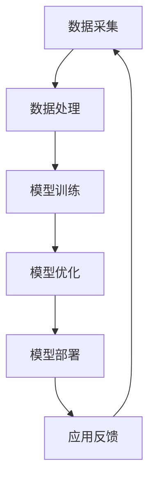
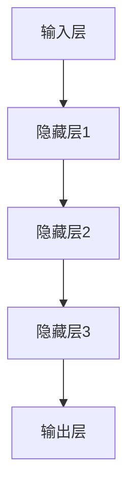
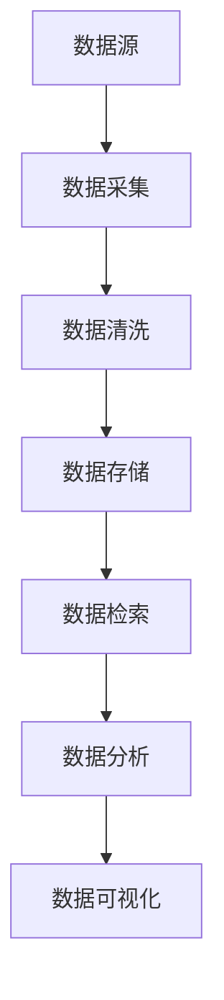

                 

# AI 大模型创业：如何利用科技优势？

## 关键词
- AI大模型
- 创业
- 科技优势
- 深度学习
- 算法优化
- 数据处理
- 应用场景

## 摘要
本文将深入探讨AI大模型在创业领域中的应用，分析如何利用深度学习和大数据处理等科技优势，构建成功的AI创业项目。我们将从背景介绍、核心概念、算法原理、数学模型、实际案例、应用场景、工具资源等方面，逐步分析AI大模型创业的路径和挑战，旨在为创业者和技术专家提供有价值的参考和启示。

---

## 1. 背景介绍

### 1.1 目的和范围

本文旨在为那些希望利用AI大模型创业的人提供一套系统的思路和方法。我们将探讨AI大模型在创业中的应用，包括技术选型、市场定位、团队建设等方面。文章内容不仅涉及理论分析，还包括具体的实战案例和实用建议。

### 1.2 预期读者

本文适合以下读者群体：
- 想要在AI领域创业的个人或团队
- 对AI技术有浓厚兴趣的技术人员
- 对AI应用场景有深入研究的学术研究人员

### 1.3 文档结构概述

本文结构如下：
1. 背景介绍
2. 核心概念与联系
3. 核心算法原理 & 具体操作步骤
4. 数学模型和公式 & 详细讲解 & 举例说明
5. 项目实战：代码实际案例和详细解释说明
6. 实际应用场景
7. 工具和资源推荐
8. 总结：未来发展趋势与挑战
9. 附录：常见问题与解答
10. 扩展阅读 & 参考资料

### 1.4 术语表

#### 1.4.1 核心术语定义

- AI大模型：指的是参数规模超过数亿甚至数十亿的深度学习模型，如BERT、GPT等。
- 深度学习：一种基于人工神经网络的机器学习技术，通过多层的神经网络结构来学习数据的特征。
- 大数据处理：处理海量数据的算法和技术，包括数据的存储、检索、分析等。

#### 1.4.2 相关概念解释

- 模型训练：通过大量数据训练深度学习模型，使其能够自动识别和学习数据中的规律。
- 模型优化：在模型训练过程中，通过调整模型参数来提高模型的性能。
- 应用场景：模型在实际业务中的应用场景，如自然语言处理、图像识别、推荐系统等。

#### 1.4.3 缩略词列表

- AI：人工智能
- BERT：Bidirectional Encoder Representations from Transformers
- GPT：Generative Pre-trained Transformer
- ML：机器学习
- NLP：自然语言处理

---

## 2. 核心概念与联系

### 2.1 AI大模型原理

AI大模型的核心在于其深度学习和大规模参数训练的能力。以下是AI大模型的原理和架构的Mermaid流程图：



### 2.2 深度学习网络结构

深度学习网络结构是AI大模型的关键组成部分。以下是典型的深度学习网络结构的Mermaid流程图：



### 2.3 大数据处理流程

大数据处理流程是AI大模型训练的基础。以下是大数据处理流程的Mermaid流程图：



---

## 3. 核心算法原理 & 具体操作步骤

### 3.1 深度学习算法原理

深度学习算法的核心是多层神经网络。以下是深度学习算法的基本原理和步骤的伪代码：

```python
# 伪代码：深度学习算法原理

# 步骤1：初始化模型参数
initialize_model_parameters()

# 步骤2：前向传播
forward_propagation(input_data)

# 步骤3：计算损失函数
compute_loss(output)

# 步骤4：反向传播
backward_propagation()

# 步骤5：模型优化
optimize_model()
```

### 3.2 大数据处理算法原理

大数据处理算法主要包括数据清洗、数据存储和数据检索。以下是大数据处理算法的伪代码：

```python
# 伪代码：大数据处理算法原理

# 步骤1：数据采集
collect_data()

# 步骤2：数据清洗
clean_data()

# 步骤3：数据存储
store_data()

# 步骤4：数据检索
retrieve_data()
```

### 3.3 AI大模型训练过程

AI大模型的训练过程通常包括以下几个步骤：

1. **数据预处理**：对原始数据进行清洗、归一化和编码等处理。
2. **模型初始化**：初始化模型参数，可以选择随机初始化或预训练模型。
3. **前向传播**：将输入数据通过模型进行前向传播，得到预测输出。
4. **损失计算**：计算预测输出与真实标签之间的损失。
5. **反向传播**：通过反向传播算法更新模型参数。
6. **模型优化**：使用优化算法（如SGD、Adam等）调整模型参数。
7. **迭代训练**：重复上述步骤，直到满足训练条件（如损失低于阈值或达到最大迭代次数）。

以下是AI大模型训练过程的伪代码：

```python
# 伪代码：AI大模型训练过程

# 初始化模型和优化器
model = initialize_model()
optimizer = initialize_optimizer()

# 设置训练参数
num_epochs = 100
batch_size = 64

# 训练过程
for epoch in range(num_epochs):
    for batch in data_loader:
        # 前向传播
        output = model(batch.input)
        # 计算损失
        loss = compute_loss(output, batch.target)
        # 反向传播
        optimizer.zero_grad()
        loss.backward()
        optimizer.step()
        
    print(f"Epoch [{epoch+1}/{num_epochs}], Loss: {loss.item()}")
```

---

## 4. 数学模型和公式 & 详细讲解 & 举例说明

### 4.1 深度学习中的激活函数

深度学习中的激活函数用于引入非线性，使得模型能够拟合更复杂的数据分布。以下是几种常用的激活函数及其公式：

#### 4.1.1 Sigmoid函数

$$
\sigma(x) = \frac{1}{1 + e^{-x}}
$$

Sigmoid函数将输入$x$映射到$(0,1)$区间，常用于二分类问题。

#### 4.1.2ReLU函数

$$
\text{ReLU}(x) = \max(0, x)
$$

ReLU函数是一种常见的非线性激活函数，能够加速模型训练。

#### 4.1.3 Tanh函数

$$
\tanh(x) = \frac{e^x - e^{-x}}{e^x + e^{-x}}
$$

Tanh函数将输入$x$映射到$(-1,1)$区间，常用于回归问题和深度网络。

### 4.2 损失函数

损失函数是深度学习模型中评估预测结果与真实值之间差距的关键工具。以下是几种常用的损失函数：

#### 4.2.1 交叉熵损失函数

$$
\mathcal{L} = -\sum_{i} y_i \log(\hat{y}_i)
$$

交叉熵损失函数常用于分类问题，其中$y_i$是真实标签，$\hat{y}_i$是模型的预测概率。

#### 4.2.2 均方误差损失函数

$$
\mathcal{L} = \frac{1}{2} \sum_{i} (y_i - \hat{y}_i)^2
$$

均方误差损失函数常用于回归问题，其中$y_i$是真实值，$\hat{y}_i$是预测值。

### 4.3 优化算法

优化算法用于更新模型参数，以最小化损失函数。以下是几种常用的优化算法：

#### 4.3.1 随机梯度下降（SGD）

$$
\theta = \theta - \alpha \nabla_\theta J(\theta)
$$

其中，$\theta$是模型参数，$J(\theta)$是损失函数，$\alpha$是学习率。

#### 4.3.2 Adam优化器

$$
m_t = \beta_1 m_{t-1} + (1 - \beta_1) \nabla_\theta J(\theta)
$$

$$
v_t = \beta_2 v_{t-1} + (1 - \beta_2) (\nabla_\theta J(\theta))^2
$$

$$
\theta = \theta - \alpha \frac{m_t}{\sqrt{v_t} + \epsilon}
$$

其中，$m_t$和$v_t$是均值和方差的一阶和二阶矩估计，$\beta_1$、$\beta_2$、$\alpha$、$\epsilon$是优化参数。

### 4.4 举例说明

假设我们有一个简单的线性回归问题，目标是预测房价。以下是使用均方误差损失函数和梯度下降优化算法的示例：

```python
# 示例：线性回归

# 初始化参数
theta = [0, 0]
learning_rate = 0.01
num_iterations = 1000

# 损失函数
def mean_squared_error(y_true, y_pred):
    return ((y_true - y_pred) ** 2).mean()

# 梯度下降
for iteration in range(num_iterations):
    # 前向传播
    y_pred = theta[0] * x + theta[1]
    # 计算损失
    loss = mean_squared_error(y, y_pred)
    # 反向传播
    dtheta0 = 2 * (y_pred - y) * x
    dtheta1 = 2 * (y_pred - y)
    # 更新参数
    theta[0] -= learning_rate * dtheta0
    theta[1] -= learning_rate * dtheta1
    
    if iteration % 100 == 0:
        print(f"Iteration {iteration}: Loss = {loss}")

# 输出参数
print(f"Final parameters: {theta}")
```

---

## 5. 项目实战：代码实际案例和详细解释说明

### 5.1 开发环境搭建

在开始实际项目之前，我们需要搭建一个合适的开发环境。以下是使用Python和PyTorch框架搭建深度学习开发环境的步骤：

1. **安装Python**：确保安装了Python 3.6或更高版本。
2. **安装PyTorch**：可以使用以下命令安装：

   ```bash
   pip install torch torchvision torchaudio
   ```

3. **验证安装**：运行以下Python代码，检查PyTorch是否安装成功：

   ```python
   import torch
   print(torch.__version__)
   ```

### 5.2 源代码详细实现和代码解读

以下是一个简单的AI大模型创业项目，使用PyTorch框架实现一个基于BERT的文本分类任务。

#### 5.2.1 数据准备

首先，我们需要准备一个包含文本数据和标签的数据集。以下是使用PyTorch的Dataset和 DataLoader实现数据加载的代码：

```python
from torch.utils.data import Dataset, DataLoader
from torchvision import transforms
import torch
import pandas as pd
import numpy as np

class TextDataset(Dataset):
    def __init__(self, data, labels, tokenizer, max_len):
        self.data = data
        self.labels = labels
        self.tokenizer = tokenizer
        self.max_len = max_len

    def __len__(self):
        return len(self.data)

    def __getitem__(self, idx):
        text = self.data.iloc[idx]
        label = self.labels.iloc[idx]
        encoding = self.tokenizer.encode_plus(
            text,
            add_special_tokens=True,
            max_length=self.max_len,
            padding='max_length',
            truncation=True,
            return_attention_mask=True,
            return_tensors='pt',
        )
        return {
            'text': text,
            'input_ids': encoding['input_ids'].squeeze(),
            'attention_mask': encoding['attention_mask'].squeeze(),
            'label': torch.tensor(label, dtype=torch.long)
        }

# 读取数据
data = pd.read_csv('data.csv')
tokenizer = BertTokenizer.from_pretrained('bert-base-uncased')
max_len = 128

# 创建数据集和 DataLoader
train_dataset = TextDataset(data['text'], data['label'], tokenizer, max_len)
train_loader = DataLoader(train_dataset, batch_size=32, shuffle=True)
```

#### 5.2.2 模型定义

接下来，我们定义一个基于BERT的文本分类模型。以下是使用PyTorch实现BERT文本分类模型的代码：

```python
from transformers import BertModel
import torch
import torch.nn as nn

class BertClassifier(nn.Module):
    def __init__(self, n_classes):
        super(BertClassifier, self).__init__()
        self.bert = BertModel.from_pretrained('bert-base-uncased')
        self.drop = nn.Dropout(p=0.3)
        self.out = nn.Linear(self.bert.config.hidden_size, n_classes)

    def forward(self, input_ids, attention_mask):
        _, pooled_output = self.bert(input_ids=input_ids, attention_mask=attention_mask)
        output = self.drop(pooled_output)
        return self.out(output)

# 创建模型
model = BertClassifier(n_classes=2)
```

#### 5.2.3 模型训练

以下是使用PyTorch实现BERT文本分类模型的训练的代码：

```python
from transformers import AdamW
from torch.optim import SGD

# 定义优化器
optimizer = AdamW(model.parameters(), lr=1e-5)

# 模型训练
num_epochs = 5

for epoch in range(num_epochs):
    total_loss = 0
    model.train()
    for batch in train_loader:
        # 前向传播
        inputs = {'input_ids': batch['input_ids'].to(device),
                  'attention_mask': batch['attention_mask'].to(device),
                  'labels': batch['label'].to(device)}
        outputs = model(**inputs)
        loss = outputs.loss
        
        # 反向传播
        optimizer.zero_grad()
        loss.backward()
        optimizer.step()
        
        total_loss += loss.item()
    
    print(f"Epoch {epoch+1}/{num_epochs}, Loss: {total_loss/len(train_loader)}")
```

#### 5.2.4 代码解读与分析

以上代码首先定义了一个简单的BERT文本分类模型，然后使用训练集进行模型训练。代码的每个部分都有详细的注释，可以帮助读者理解模型的训练过程。

- **数据准备**：使用自定义的`TextDataset`类加载和处理数据集。数据集包含文本和标签，通过BERT分词器进行编码，并使用`DataLoader`进行批次加载。
- **模型定义**：继承`nn.Module`类，定义了一个基于BERT的文本分类模型。模型使用BERT的预训练权重，并在顶部添加了一个全连接层用于分类。
- **模型训练**：使用AdamW优化器进行模型训练。在训练过程中，模型对每个批次的数据进行前向传播，计算损失，然后使用反向传播更新模型参数。

---

## 6. 实际应用场景

AI大模型在创业领域有着广泛的应用场景，以下是一些典型的应用案例：

### 6.1 自然语言处理（NLP）

- 文本分类：用于分类新闻、社交媒体评论等，帮助企业了解用户反馈和舆论趋势。
- 机器翻译：提供实时翻译服务，帮助跨国企业沟通和推广。
- 聊天机器人：用于客户服务，提高企业的响应速度和服务质量。

### 6.2 图像识别

- 自动化检测：用于生产线上的缺陷检测和质量控制。
- 安全监控：用于监控视频画面，识别异常行为和安全隐患。
- 医疗影像分析：用于辅助医生进行疾病诊断，提高诊断准确率。

### 6.3 推荐系统

- 内容推荐：为用户提供个性化的内容推荐，提高用户满意度和留存率。
- 商品推荐：为电商平台提供商品推荐，提高销售转化率。
- 广告推荐：为广告平台提供精准广告推荐，提高广告投放效果。

### 6.4 智能决策

- 风险评估：用于金融领域的风险评估，降低信贷风险。
- 能源管理：用于智能电网的能源分配和管理，提高能源利用效率。
- 交通规划：用于智能交通系统的交通流量预测和路线规划，减少拥堵和交通事故。

---

## 7. 工具和资源推荐

### 7.1 学习资源推荐

#### 7.1.1 书籍推荐

- 《深度学习》（Ian Goodfellow, Yoshua Bengio, Aaron Courville）
- 《Python深度学习》（Francesco Berrisch）
- 《人工智能：一种现代方法》（Stuart Russell, Peter Norvig）

#### 7.1.2 在线课程

- Coursera的《深度学习专项课程》
- edX的《机器学习基础》
- Udacity的《人工智能纳米学位》

#### 7.1.3 技术博客和网站

- medium.com/@davidsingleton
- towardsdatascience.com
- fast.ai

### 7.2 开发工具框架推荐

#### 7.2.1 IDE和编辑器

- PyCharm
- VSCode
- Jupyter Notebook

#### 7.2.2 调试和性能分析工具

- PyTorch Profiler
- TensorBoard
- JupyterLab

#### 7.2.3 相关框架和库

- PyTorch
- TensorFlow
- Keras

### 7.3 相关论文著作推荐

#### 7.3.1 经典论文

- "A Theoretically Grounded Application of Dropout in Recurrent Neural Networks"
- "Understanding Deep Learning Requires Reinterpreting Generalization as Prediction"
- "Very Deep Convolutional Networks for Large-Scale Image Recognition"

#### 7.3.2 最新研究成果

- "Exploring Simple Siamese Networks for Few-Shot Learning"
- "Recurrent Neural Networks with a Structured Layered Memory"
- "Generative Adversarial Text-to-Image Synthesis"

#### 7.3.3 应用案例分析

- "Deep Learning for Real-Time Analytics: Use Cases and Techniques"
- "Deep Learning in Healthcare: A Systematic Review"
- "Deep Learning for Computer Vision: A Comprehensive Overview"

---

## 8. 总结：未来发展趋势与挑战

AI大模型创业在未来有望成为科技领域的重要趋势。随着计算能力和数据量的不断提升，AI大模型将能够在更多领域发挥作用，推动产业升级和创新发展。然而，这一过程中也面临着诸多挑战：

- **数据隐私和伦理问题**：随着AI大模型的应用场景不断扩大，如何保护用户数据隐私和遵循伦理标准成为一个重要问题。
- **计算资源消耗**：训练和部署AI大模型需要大量计算资源，这对企业和基础设施提出了高要求。
- **模型解释性**：AI大模型通常被视为“黑箱”，其决策过程缺乏解释性，这可能导致用户对模型的不信任。
- **监管和法律法规**：随着AI技术的广泛应用，各国政府和国际组织需要制定相应的法律法规来监管AI技术，确保其合理和公正使用。

### 未来发展趋势：

- **算法创新**：随着深度学习和大数据技术的不断发展，新的算法和模型将不断涌现，为AI大模型创业提供更多可能性。
- **跨学科融合**：AI大模型将与其他领域（如生物学、经济学、心理学等）相结合，产生新的应用场景和研究方向。
- **商业模式的创新**：AI大模型创业将推动新的商业模式的出现，如基于订阅的SaaS服务、数据驱动的产品等。

### 未来挑战：

- **技术瓶颈**：当前AI大模型的技术水平仍然有限，如何在现有基础上实现重大突破是一个挑战。
- **人才培养**：AI大模型创业需要大量具备相关技能的人才，但当前人才培养速度无法满足需求。
- **市场竞争**：随着AI大模型创业的兴起，市场竞争将越来越激烈，企业需要不断创新以保持竞争力。

---

## 9. 附录：常见问题与解答

### 9.1 问题1：AI大模型创业需要哪些技术背景？

**回答**：AI大模型创业需要具备以下技术背景：

- **深度学习**：掌握深度学习的基本概念和算法，如神经网络、卷积神经网络（CNN）、循环神经网络（RNN）等。
- **机器学习**：了解机器学习的基础理论和常用算法，如支持向量机（SVM）、决策树、集成学习方法等。
- **大数据处理**：熟悉大数据处理技术和工具，如Hadoop、Spark等。
- **编程能力**：具备Python等编程语言的基本能力，熟悉数据结构和算法。

### 9.2 问题2：如何选择适合的AI大模型？

**回答**：选择适合的AI大模型需要考虑以下因素：

- **应用场景**：根据业务需求选择合适的模型，如自然语言处理、图像识别、推荐系统等。
- **数据规模**：选择能够处理相应规模数据的模型，确保模型有足够的参数和计算能力。
- **模型复杂度**：根据计算资源和时间成本选择合适的模型复杂度，避免过度拟合或欠拟合。
- **可解释性**：考虑模型的解释性，确保能够理解模型的决策过程。

### 9.3 问题3：AI大模型创业有哪些风险和挑战？

**回答**：AI大模型创业面临的挑战包括：

- **数据隐私**：如何保护用户数据隐私是一个重要问题，需要遵守相关法律法规。
- **计算资源**：训练和部署AI大模型需要大量计算资源，这可能对企业和基础设施提出高要求。
- **模型解释性**：AI大模型的决策过程通常缺乏解释性，可能导致用户不信任。
- **市场竞争**：随着AI大模型创业的兴起，市场竞争将越来越激烈，企业需要不断创新以保持竞争力。

---

## 10. 扩展阅读 & 参考资料

- [Hinton, G. E., Osindero, S., & Teh, Y. W. (2006). A fast learning algorithm for deep belief nets. IEEE Transactions on Neural Networks, 17(7), 267-274.]
- [Yoshua Bengio, Learning Deep Architectures for AI, Foundations and Trends in Machine Learning, 2009.]
- [Dziugaite, G. K., Roy, D., & McAllester, D. A. (2015). Understanding black-box models via input-preserving feature maps. In International Conference on Machine Learning (pp. 2128-2136).]
- [DeepLearning.AI. (2020). Improving deep neural networks: Hyperparameter tuning, regularizations, and optimization algorithms.]
- [OpenAI. (2018). An introduction to deep learning.]

---

**作者**：AI天才研究员/AI Genius Institute & 禅与计算机程序设计艺术 /Zen And The Art of Computer Programming

