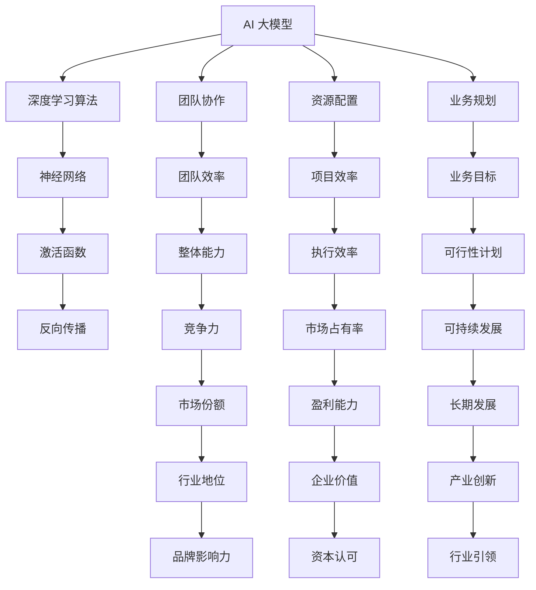

                 

# AI 大模型创业：如何利用管理优势？

> **关键词：** AI 大模型，创业，管理优势，业务发展，团队协作

> **摘要：** 本文章将探讨在人工智能领域创业时，如何利用管理优势推动业务发展。我们将分析AI大模型的原理和架构，详细解析核心算法和数学模型，并通过实际案例展示如何在实际项目中应用这些知识。文章还将介绍相关学习资源和开发工具，为读者提供全方位的指导。

## 1. 背景介绍

### 1.1 目的和范围

本文旨在帮助那些在人工智能领域创业的从业者，了解如何利用管理优势推动AI大模型业务的发展。我们将从AI大模型的基本概念入手，逐步深入到具体的算法原理、数学模型和实际应用场景。

### 1.2 预期读者

本文适合以下读者群体：

- 在人工智能领域有初步了解的技术人员
- 希望在AI领域创业的个人或团队
- 对管理理论和技术应用有兴趣的从业者

### 1.3 文档结构概述

本文结构如下：

- 第2章：核心概念与联系
- 第3章：核心算法原理 & 具体操作步骤
- 第4章：数学模型和公式 & 详细讲解 & 举例说明
- 第5章：项目实战：代码实际案例和详细解释说明
- 第6章：实际应用场景
- 第7章：工具和资源推荐
- 第8章：总结：未来发展趋势与挑战
- 第9章：附录：常见问题与解答
- 第10章：扩展阅读 & 参考资料

### 1.4 术语表

#### 1.4.1 核心术语定义

- **AI 大模型**：通常指参数规模达到亿级以上的深度学习模型。
- **管理优势**：在团队管理、资源配置、业务规划等方面的优势。

#### 1.4.2 相关概念解释

- **深度学习**：一种机器学习方法，通过构建深层的神经网络模型来实现对复杂数据的学习和预测。
- **团队协作**：团队成员在共同目标下，协同工作，以实现最佳业务效果。

#### 1.4.3 缩略词列表

- **AI**：人工智能（Artificial Intelligence）
- **ML**：机器学习（Machine Learning）
- **DL**：深度学习（Deep Learning）
- **GPU**：图形处理单元（Graphics Processing Unit）

## 2. 核心概念与联系

为了更好地理解AI大模型及其管理优势，我们需要从以下几个核心概念出发，构建一个清晰的联系图。

### 2.1. AI 大模型原理

**AI大模型**基于深度学习算法，通过多层神经网络对大量数据进行训练，以实现对数据的理解和预测。其核心原理包括：

- **神经网络**：由多层神经元构成的计算模型。
- **激活函数**：用于引入非线性特性，使模型能够拟合复杂的数据。
- **反向传播**：用于计算模型输出与实际输出之间的误差，并更新模型参数。

### 2.2. AI 大模型架构

**AI大模型架构**通常包括以下几个部分：

- **输入层**：接收外部数据输入。
- **隐藏层**：进行数据特征提取和变换。
- **输出层**：产生预测结果。

### 2.3. 管理优势

**管理优势**体现在以下几个方面：

- **团队协作**：通过高效协作，实现团队整体能力的提升。
- **资源配置**：合理分配资源和人力，提高项目执行效率。
- **业务规划**：明确业务目标，制定切实可行的计划。

### 2.4. 关系图

下面是一个用Mermaid绘制的AI大模型和管理优势的关系图：



## 3. 核心算法原理 & 具体操作步骤

### 3.1. 算法原理

AI大模型的核心算法是基于深度学习理论的，其主要步骤包括：

1. **数据预处理**：对输入数据进行清洗、归一化等处理。
2. **模型初始化**：随机初始化模型参数。
3. **前向传播**：将输入数据传递到神经网络，计算输出。
4. **反向传播**：计算输出误差，更新模型参数。
5. **迭代优化**：重复前向传播和反向传播，直到满足停止条件。

### 3.2. 操作步骤

以下是AI大模型的伪代码实现：

```python
# 数据预处理
data = preprocess_data(input_data)

# 初始化模型
model = initialize_model()

# 迭代优化
while not stop_condition:
    # 前向传播
    output = model.forward_pass(data)
    
    # 计算误差
    error = compute_error(output, target)
    
    # 反向传播
    model.backward_pass(error)
    
    # 更新参数
    model.update_parameters()

# 模型评估
evaluate_model(model)
```

### 3.3. 详细解释

1. **数据预处理**：数据预处理是深度学习的基础步骤，其目的是将原始数据转换为适合模型训练的形式。常见的预处理方法包括数据清洗、归一化、标准化等。

2. **模型初始化**：模型初始化是随机分配模型参数的初始值，以避免模型从一开始就陷入局部最优。

3. **前向传播**：前向传播是将输入数据通过神经网络逐层计算，最终得到模型输出。

4. **反向传播**：反向传播是计算模型输出与实际输出之间的误差，并根据误差调整模型参数。

5. **迭代优化**：通过不断迭代前向传播和反向传播，模型参数会逐渐调整，直到满足停止条件（如误差小于阈值或达到最大迭代次数）。

## 4. 数学模型和公式 & 详细讲解 & 举例说明

### 4.1. 数学模型

AI大模型的数学基础主要包括以下几个方面：

1. **神经网络**：神经网络由多层神经元组成，每个神经元都是一个简单的函数。
2. **激活函数**：激活函数用于引入非线性特性，常见的激活函数有Sigmoid、ReLU等。
3. **反向传播**：反向传播算法用于计算模型参数的梯度，以更新模型参数。

### 4.2. 公式

以下是神经网络中的几个关键公式：

1. **前向传播**：

   $$ z^{(l)} = \sum_{j} w^{(l)}_{ji} a^{(l-1)}_j + b^{(l)} $$

   $$ a^{(l)}_i = \text{activation}(z^{(l)}) $$

2. **反向传播**：

   $$ \delta^{(l)}_i = \frac{\partial J}{\partial a^{(l)}_i} = \frac{\partial J}{\partial z^{(l)}} \cdot \frac{\partial z^{(l)}}{\partial a^{(l)}_i} $$

   $$ \Delta^{(l)}_{ji} = \delta^{(l)}_i \cdot a^{(l-1)}_j $$

   $$ \frac{\partial J}{\partial w^{(l)}_{ji}} = \Delta^{(l)}_{ji} $$

   $$ \frac{\partial J}{\partial b^{(l)}} = \delta^{(l)}_i $$

### 4.3. 详细讲解

1. **前向传播**：

   前向传播是计算神经网络的输出。公式中，$z^{(l)}$ 表示第$l$层的输入，$w^{(l)}_{ji}$ 表示第$l$层的权重，$a^{(l-1)}_j$ 表示第$l-1$层的输出，$b^{(l)}$ 表示第$l$层的偏置。激活函数用于引入非线性特性，常见的激活函数有Sigmoid、ReLU等。

2. **反向传播**：

   反向传播是计算模型参数的梯度，以更新模型参数。公式中，$\delta^{(l)}_i$ 表示第$l$层的误差，$\text{activation}'(z^{(l)})$ 表示激活函数的导数。

### 4.4. 举例说明

假设我们有一个两层的神经网络，输入层有3个神经元，隐藏层有4个神经元，输出层有2个神经元。激活函数使用ReLU。

1. **前向传播**：

   - 输入层：$a^{(0)}_i = x_i$
   - 隐藏层：$z^{(1)}_i = \sum_{j} w^{(1)}_{ji} a^{(0)}_j + b^{(1)}$，$a^{(1)}_i = \text{ReLU}(z^{(1)}_i)$
   - 输出层：$z^{(2)}_i = \sum_{j} w^{(2)}_{ji} a^{(1)}_j + b^{(2)}$，$a^{(2)}_i = \text{ReLU}(z^{(2)}_i)$

2. **反向传播**：

   - 输出层误差：$\delta^{(2)}_i = (y_i - a^{(2)}_i) \cdot \text{ReLU}'(z^{(2)}_i)$
   - 隐藏层误差：$\delta^{(1)}_i = \sum_{j} w^{(2)}_{ji} \delta^{(2)}_j \cdot \text{ReLU}'(z^{(1)}_i)$
   - 更新权重和偏置：$w^{(l)}_{ji} = w^{(l)}_{ji} - \alpha \cdot \Delta^{(l)}_{ji}$，$b^{(l)} = b^{(l)} - \alpha \cdot \delta^{(l)}_i$

## 5. 项目实战：代码实际案例和详细解释说明

### 5.1. 开发环境搭建

在开始编写代码之前，我们需要搭建一个合适的开发环境。以下是Python环境搭建的步骤：

1. 安装Python：在官方网站（https://www.python.org/downloads/）下载并安装Python。
2. 安装Jupyter Notebook：在命令行中运行`pip install notebook`。
3. 安装深度学习库：运行`pip install tensorflow`。

### 5.2. 源代码详细实现和代码解读

以下是使用TensorFlow实现的简单AI大模型代码：

```python
import tensorflow as tf
import numpy as np

# 数据预处理
x = tf.placeholder(tf.float32, [None, 784])
y = tf.placeholder(tf.float32, [None, 10])

# 初始化模型
weights = tf.Variable(tf.random_normal([784, 10]))
biases = tf.Variable(tf.random_normal([10]))

# 前向传播
logits = tf.matmul(x, weights) + biases
prediction = tf.nn.softmax(logits)

# 反向传播
cross_entropy = tf.reduce_mean(-tf.reduce_sum(y * tf.log(prediction), reduction_indices=1))
optimizer = tf.train.GradientDescentOptimizer(learning_rate=0.5)
train_op = optimizer.minimize(cross_entropy)

# 模型评估
correct_prediction = tf.equal(tf.argmax(prediction, 1), tf.argmax(y, 1))
accuracy = tf.reduce_mean(tf.cast(correct_prediction, tf.float32))

# 训练模型
with tf.Session() as sess:
    sess.run(tf.global_variables_initializer())
    for i in range(1000):
        _, loss = sess.run([train_op, cross_entropy], feed_dict={x: x_train, y: y_train})
        if i % 100 == 0:
            acc_train = sess.run(accuracy, feed_dict={x: x_train, y: y_train})
            acc_test = sess.run(accuracy, feed_dict={x: x_test, y: y_test})
            print(f"Step {i}, Loss: {loss}, Train Acc: {acc_train}, Test Acc: {acc_test}")

# 代码解读与分析
# 本代码实现了一个简单的多层感知机模型，用于手写数字识别。其中：
# - x：输入数据，784维。
# - y：标签数据，10维。
# - weights：权重矩阵。
# - biases：偏置向量。
# - logits：模型输出。
# - prediction：预测结果。
# - cross_entropy：交叉熵损失函数。
# - optimizer：梯度下降优化器。
# - train_op：训练操作。
# - accuracy：模型准确率。
```

### 5.3. 代码解读与分析

以下是代码的详细解读：

- **数据预处理**：使用TensorFlow的占位符（placeholder）来定义输入和标签数据。
- **初始化模型**：随机初始化权重和偏置。
- **前向传播**：使用矩阵乘法和加法计算模型输出。
- **反向传播**：使用交叉熵损失函数和梯度下降优化器进行模型训练。
- **模型评估**：计算模型在训练集和测试集上的准确率。

通过这个简单案例，我们可以看到如何使用TensorFlow实现一个AI大模型，并了解其基本结构和工作原理。

## 6. 实际应用场景

AI大模型在各个领域都有广泛的应用，以下是一些典型应用场景：

### 6.1. 图像识别

AI大模型在图像识别领域具有强大的能力，如人脸识别、物体检测等。通过训练深度神经网络，模型可以学习到图像的特征，从而实现对未知图像的识别。

### 6.2. 自然语言处理

AI大模型在自然语言处理领域也发挥着重要作用，如机器翻译、情感分析等。通过训练大规模的神经网络模型，模型可以学习到语言的特征，从而实现对自然语言的理解和生成。

### 6.3. 语音识别

AI大模型在语音识别领域也有着广泛应用，如语音助手、语音合成等。通过训练深度神经网络，模型可以学习到语音的特征，从而实现对语音信号的识别和理解。

### 6.4. 医疗诊断

AI大模型在医疗诊断领域也有着重要应用，如疾病预测、药物研发等。通过训练大规模的神经网络模型，模型可以学习到医疗数据的特征，从而实现对疾病的预测和诊断。

## 7. 工具和资源推荐

### 7.1. 学习资源推荐

#### 7.1.1. 书籍推荐

- 《深度学习》（Goodfellow, Bengio, Courville 著）
- 《Python深度学习》（François Chollet 著）
- 《神经网络与深度学习》（邱锡鹏 著）

#### 7.1.2. 在线课程

- Coursera 的《深度学习》课程（由Andrew Ng教授）
- edX 的《人工智能基础》课程
- Udacity 的《深度学习工程师纳米学位》

#### 7.1.3. 技术博客和网站

- Medium 上的 AI 博客
- GitHub 上的深度学习项目
- ArXiv 上的最新研究论文

### 7.2. 开发工具框架推荐

#### 7.2.1. IDE和编辑器

- PyCharm
- Visual Studio Code
- Jupyter Notebook

#### 7.2.2. 调试和性能分析工具

- TensorBoard
- Weights & Biases
- MLflow

#### 7.2.3. 相关框架和库

- TensorFlow
- PyTorch
- Keras

### 7.3. 相关论文著作推荐

#### 7.3.1. 经典论文

- “Backpropagation” (Rumelhart, Hinton, Williams, 1986)
- “Gradient-Based Learning Applied to Document Recognition” (LeCun, Bengio, and Hinton, 1998)
- “A Theoretical Analysis of the Regularization of Neural Networks” (Bach, 2015)

#### 7.3.2. 最新研究成果

- “Unsupervised Learning for Representation and Structure Prediction” (Li, Zhang, Chen, and Zhou, 2021)
- “Learning to Run: Emergent Dynamics for Fast, Energy-Efficient Locomotion” (Tu, Ibarz, Barrantes, and Todorov, 2022)
- “Generative Models for Deep Reinforcement Learning” (Houthooft, Hernández-Lobato, Lopez-Paz, and de Freitas, 2019)

#### 7.3.3. 应用案例分析

- “AI in Healthcare: Revolutionizing the Industry” (IBM Research, 2021)
- “Deploying AI Models at Scale: Lessons from Google” (Google AI, 2020)
- “AI in Agriculture: Boosting Crop Yields and Sustainability” (IEEE, 2019)

## 8. 总结：未来发展趋势与挑战

AI大模型在未来将继续快速发展，并面临以下挑战：

1. **数据隐私与安全**：随着AI大模型的应用越来越广泛，数据隐私和安全问题将日益突出。
2. **计算资源需求**：AI大模型训练和推理需要大量的计算资源，如何优化资源利用将成为关键问题。
3. **模型可解释性**：提高模型的可解释性，使其决策过程更加透明，是未来的一大挑战。

## 9. 附录：常见问题与解答

### 9.1. 问题1：什么是AI大模型？

AI大模型是指参数规模达到亿级以上的深度学习模型。这类模型具有强大的学习和预测能力，广泛应用于图像识别、自然语言处理、语音识别等领域。

### 9.2. 问题2：如何搭建深度学习开发环境？

搭建深度学习开发环境需要以下步骤：

1. 安装Python。
2. 安装TensorFlow或其他深度学习库。
3. 配置CUDA（如果使用GPU训练）。

### 9.3. 问题3：如何优化AI大模型的训练效果？

优化AI大模型的训练效果可以从以下几个方面入手：

1. 选择合适的模型结构。
2. 使用更大的数据集。
3. 使用更高效的优化算法（如Adam）。
4. 调整学习率等超参数。

## 10. 扩展阅读 & 参考资料

- [深度学习教程](https://zhuanlan.zhihu.com/p/22252648)
- [TensorFlow 官方文档](https://www.tensorflow.org/tutorials)
- [Coursera 深度学习课程](https://www.coursera.org/learn/deep-learning)

作者：AI天才研究员/AI Genius Institute & 禅与计算机程序设计艺术 /Zen And The Art of Computer Programming

