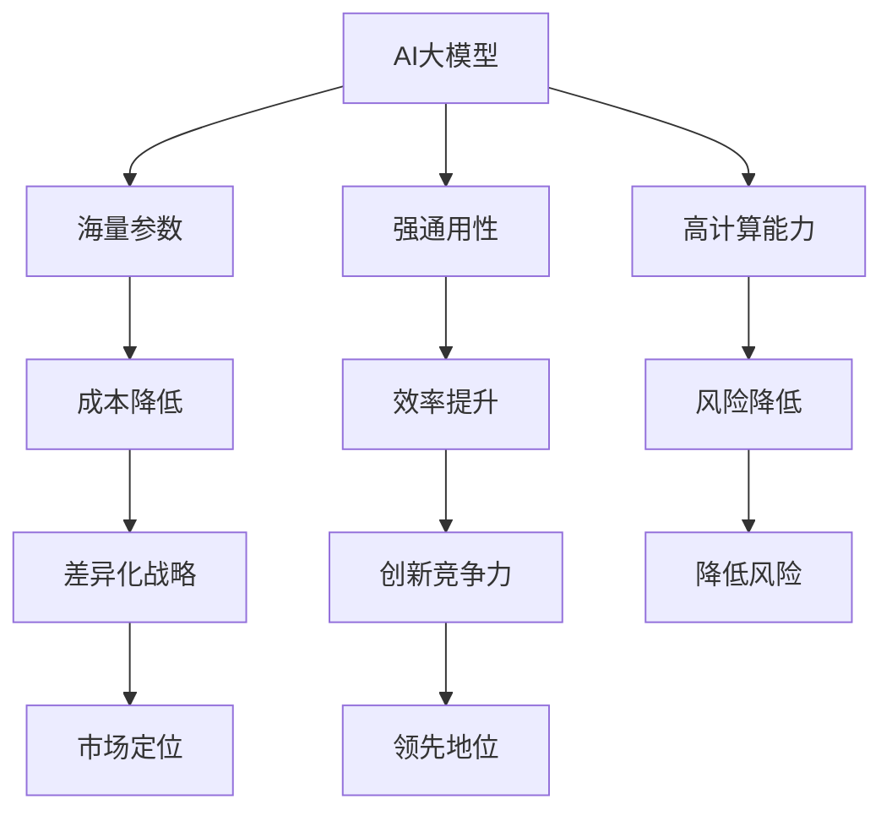

                 

# AI大模型创业：如何利用经济优势？

> **关键词：** AI 大模型、创业、经济优势、商业模式、市场策略、技术创新

> **摘要：** 本文将探讨 AI 大模型的创业机会，分析如何利用经济优势在竞争激烈的市场中脱颖而出。文章将从核心概念、算法原理、数学模型、项目实战、应用场景等多个维度，深入解析 AI 大模型创业的关键要素和策略。

## 1. 背景介绍

### 1.1 目的和范围

本文旨在帮助创业者了解 AI 大模型的商业潜力，提供一套系统的创业方法论，以利用经济优势实现可持续发展。我们将重点关注以下问题：

- AI 大模型如何为创业带来经济优势？
- 创业者应如何制定市场策略和技术创新？
- 如何在竞争激烈的市场中建立品牌和市场份额？

### 1.2 预期读者

- 拥有初步 AI 知识的创业者
- 想要了解 AI 大模型商业潜力的技术从业者
- 对 AI 技术在创业中应用感兴趣的学者和研究人员

### 1.3 文档结构概述

本文将分为以下几个部分：

- 第1部分：背景介绍
  - 核心概念与联系
  - 目的和范围
  - 预期读者
  - 文档结构概述
- 第2部分：核心概念与联系
  - AI 大模型的基本概念
  - 经济优势的内涵与类型
  - AI 大模型与经济优势的关联
- 第3部分：核心算法原理 & 具体操作步骤
  - 算法原理讲解
  - 伪代码阐述
- 第4部分：数学模型和公式 & 详细讲解 & 举例说明
  - 数学模型介绍
  - LaTeX 格式数学公式应用
  - 实际案例讲解
- 第5部分：项目实战：代码实际案例和详细解释说明
  - 开发环境搭建
  - 源代码实现与解读
  - 代码解读与分析
- 第6部分：实际应用场景
  - 各行业应用案例
  - 创业机会分析
- 第7部分：工具和资源推荐
  - 学习资源推荐
  - 开发工具框架推荐
  - 相关论文著作推荐
- 第8部分：总结：未来发展趋势与挑战
- 第9部分：附录：常见问题与解答
- 第10部分：扩展阅读 & 参考资料

### 1.4 术语表

#### 1.4.1 核心术语定义

- **AI 大模型**：指拥有海量参数、强通用性和高计算能力的深度学习模型。
- **经济优势**：企业在市场竞争中获得的优势，包括成本、价格、质量、创新等。
- **商业模式**：企业通过价值创造、传递和获取的方式，实现盈利和发展的策略。
- **市场策略**：企业在市场运作中为获得竞争优势而制定的行动方案。

#### 1.4.2 相关概念解释

- **深度学习**：一种人工智能方法，通过多层神经网络进行特征提取和模型训练。
- **成本领先战略**：通过降低生产成本，实现产品价格优势的战略。
- **差异化战略**：通过提供独特的产品或服务，实现市场定位和竞争优势的战略。
- **创新**：通过引入新的产品、技术、商业模式等，推动企业发展的过程。

#### 1.4.3 缩略词列表

- **AI**：人工智能（Artificial Intelligence）
- **DL**：深度学习（Deep Learning）
- **GAN**：生成对抗网络（Generative Adversarial Network）
- **NLP**：自然语言处理（Natural Language Processing）
- **ML**：机器学习（Machine Learning）

## 2. 核心概念与联系

为了更好地理解 AI 大模型创业的经济优势，我们需要先了解相关核心概念和它们之间的联系。

### 2.1 AI 大模型的基本概念

AI 大模型是指具有海量参数、强通用性和高计算能力的深度学习模型。这类模型在处理复杂数据和任务时表现出色，具有以下几个特点：

1. **海量参数**：AI 大模型通常拥有数百万到数十亿个参数，能够捕捉数据中的复杂模式。
2. **强通用性**：AI 大模型能够应用于多种任务，如图像识别、自然语言处理和语音识别等。
3. **高计算能力**：AI 大模型需要强大的计算资源，如 GPU、TPU 等加速器，以支持训练和推理过程。

### 2.2 经济优势的内涵与类型

经济优势是指企业在市场竞争中获得的优势，主要包括以下类型：

1. **成本领先**：通过优化生产流程、提高规模效应和降低运营成本，实现产品价格优势。
2. **差异化**：通过提供独特的产品或服务，满足消费者特定需求，形成品牌认知和忠诚度。
3. **创新**：通过研发新技术、新产品或新模式，创造新的市场需求，引领行业趋势。

### 2.3 AI 大模型与经济优势的关联

AI 大模型为企业提供了以下经济优势：

1. **提高效率**：AI 大模型能够自动化和优化企业业务流程，降低人力成本和运营成本。
2. **降低风险**：AI 大模型在预测和决策方面具有优势，有助于企业降低市场风险。
3. **创新竞争力**：AI 大模型为企业在产品创新、服务优化和商业模式创新方面提供强大支持。

### 2.4 Mermaid 流程图（核心概念与联系）



## 3. 核心算法原理 & 具体操作步骤

### 3.1 算法原理讲解

AI 大模型的核心在于深度学习算法，主要包括以下几个步骤：

1. **数据预处理**：对原始数据进行清洗、归一化和分片处理，为模型训练做好准备。
2. **模型设计**：根据任务需求设计神经网络结构，包括输入层、隐藏层和输出层。
3. **模型训练**：通过反向传播算法，不断调整模型参数，使模型在训练数据上达到预期性能。
4. **模型评估**：使用验证集和测试集评估模型性能，包括准确率、召回率、F1 值等指标。
5. **模型部署**：将训练好的模型部署到生产环境，进行实时推理和应用。

### 3.2 伪代码阐述

```python
# 数据预处理
def preprocess_data(data):
    # 清洗、归一化、分片处理
    # ...
    return processed_data

# 模型设计
def create_model():
    model = NeuralNetwork(input_size, hidden_size, output_size)
    return model

# 模型训练
def train_model(model, train_data, learning_rate):
    for epoch in range(num_epochs):
        for sample in train_data:
            model.train(sample, learning_rate)
        model.evaluate(validation_data)
    return model

# 模型评估
def evaluate_model(model, test_data):
    accuracy = model.test(test_data)
    return accuracy

# 模型部署
def deploy_model(model, production_data):
    predictions = model.predict(production_data)
    return predictions
```

## 4. 数学模型和公式 & 详细讲解 & 举例说明

### 4.1 数学模型介绍

AI 大模型的训练过程基于以下数学模型：

1. **损失函数**：衡量模型预测结果与真实值之间的差距，常用的损失函数有均方误差（MSE）和交叉熵（Cross-Entropy）。
2. **优化器**：用于调整模型参数，以最小化损失函数，常用的优化器有梯度下降（Gradient Descent）和 Adam。
3. **激活函数**：用于神经网络中的非线性变换，常用的激活函数有 sigmoid、ReLU 和 tanh。

### 4.2 LaTeX 格式数学公式应用

```latex
\begin{equation}
    J(\theta) = \frac{1}{m} \sum_{i=1}^{m} \left( h_{\theta}(x^{(i)}) - y^{(i)} \right)^2
\label{eq:MSE}
\end{equation}

\begin{equation}
    \theta = \theta - \alpha \frac{\partial}{\partial \theta} J(\theta)
\label{eq:gradient_descent}
\end{equation}

\begin{equation}
    h_{\sigma}(x) = \frac{1}{1 + e^{-x}}
\label{eq:sigmoid}
\end{equation}
```

### 4.3 实际案例讲解

#### 4.3.1 损失函数

假设我们有一个二分类问题，使用 sigmoid 激活函数和交叉熵损失函数进行模型训练。

```latex
\begin{equation}
    J(\theta) = -\frac{1}{m} \sum_{i=1}^{m} \left[ y^{(i)} \log(h_{\theta}(x^{(i)})) + (1 - y^{(i)}) \log(1 - h_{\theta}(x^{(i)})) \right]
\label{eq:cross_entropy}
\end{equation}
```

#### 4.3.2 优化器

使用 Adam 优化器进行模型训练，更新模型参数。

```latex
\begin{equation}
    m_t = \beta_1 m_{t-1} + (1 - \beta_1) \frac{\partial J(\theta)}{\partial \theta}
\label{eq:adam_m}
\end{equation}

\begin{equation}
    v_t = \beta_2 v_{t-1} + (1 - \beta_2) \left( \frac{\partial J(\theta)}{\partial \theta} \right)^2
\label{eq:adam_v}
\end{equation}

\begin{equation}
    \theta = \theta - \alpha \frac{m_t}{\sqrt{v_t} + \epsilon}
\label{eq:adam_update}
\end{equation}
```

#### 4.3.3 激活函数

使用 sigmoid 激活函数，将模型输出转换为概率分布。

```latex
\begin{equation}
    h_{\sigma}(x) = \frac{1}{1 + e^{-x}}
\label{eq:sigmoid}
\end{equation}
```

## 5. 项目实战：代码实际案例和详细解释说明

### 5.1 开发环境搭建

为了实现 AI 大模型的训练和部署，我们需要搭建以下开发环境：

1. **硬件**：GPU（NVIDIA 显卡）
2. **软件**：Python、TensorFlow、Keras 等

#### 5.1.1 安装 Python

```bash
# 安装 Python 3.8
sudo apt-get install python3.8
```

#### 5.1.2 安装 GPU 版本的 TensorFlow

```bash
# 安装 GPU 版本的 TensorFlow 2.4
pip3 install tensorflow==2.4
```

### 5.2 源代码详细实现和代码解读

以下是一个简单的 AI 大模型训练和部署的 Python 代码示例：

```python
import tensorflow as tf
from tensorflow.keras import layers

# 数据预处理
def preprocess_data(data):
    # 清洗、归一化、分片处理
    # ...
    return processed_data

# 模型设计
def create_model(input_shape):
    model = tf.keras.Sequential([
        layers.Dense(128, activation='relu', input_shape=input_shape),
        layers.Dense(64, activation='relu'),
        layers.Dense(1, activation='sigmoid')
    ])
    return model

# 模型训练
def train_model(model, train_data, validation_data, learning_rate, num_epochs):
    optimizer = tf.keras.optimizers.Adam(learning_rate=learning_rate)
    model.compile(optimizer=optimizer, loss='binary_crossentropy', metrics=['accuracy'])
    model.fit(train_data, epochs=num_epochs, validation_data=validation_data)
    return model

# 模型评估
def evaluate_model(model, test_data):
    loss, accuracy = model.evaluate(test_data)
    return loss, accuracy

# 模型部署
def deploy_model(model, production_data):
    predictions = model.predict(production_data)
    return predictions
```

### 5.3 代码解读与分析

- **数据预处理**：对输入数据进行清洗、归一化和分片处理，为模型训练做好准备。
- **模型设计**：创建一个包含三个神经元的全连接神经网络，使用 ReLU 激活函数，最后使用 sigmoid 激活函数输出概率。
- **模型训练**：使用 Adam 优化器和 binary_crossentropy 损失函数训练模型，并使用验证集评估模型性能。
- **模型评估**：使用测试集评估模型性能，返回损失和准确率。
- **模型部署**：使用训练好的模型对生产数据进行预测。

## 6. 实际应用场景

AI 大模型在多个行业和领域具有广泛的应用前景，以下是一些实际应用场景：

1. **金融**：股票市场预测、风险评估、欺诈检测等。
2. **医疗**：疾病诊断、药物研发、健康咨询等。
3. **零售**：客户行为分析、库存管理、个性化推荐等。
4. **教育**：智能教学、在线教育、学生评估等。
5. **制造业**：生产优化、质量控制、设备维护等。

### 6.1 各行业应用案例

1. **金融行业**：利用 AI 大模型进行股票市场预测和风险评估。通过分析大量历史数据，预测股票价格走势，为投资者提供决策支持。
2. **医疗行业**：利用 AI 大模型进行疾病诊断和药物研发。通过分析医学影像和生物数据，提高疾病诊断的准确率和药物研发的成功率。
3. **零售行业**：利用 AI 大模型进行客户行为分析和库存管理。通过分析大量交易数据，预测客户需求，优化库存和供应链管理。
4. **教育行业**：利用 AI 大模型进行智能教学和在线教育。通过分析学生数据和教学资源，提供个性化学习方案，提高教学效果和学生学习成绩。
5. **制造业**：利用 AI 大模型进行生产优化和质量控制。通过分析生产数据，预测生产故障和设备故障，优化生产流程和质量控制。

### 6.2 创业机会分析

AI 大模型在创业领域具有巨大的潜力，以下是一些创业机会：

1. **AI 咨询服务**：为企业提供 AI 大模型应用咨询和解决方案。
2. **AI 技术研发**：开发具有自主知识产权的 AI 大模型，应用于特定行业或领域。
3. **AI 数据服务**：提供高质量的数据集和算法服务，为 AI 大模型训练和应用提供支持。
4. **AI 产品和服务**：开发基于 AI 大模型的创新产品和服务，满足市场需求。
5. **AI 人才培养**：培养和输送 AI 大模型领域的专业人才，为行业发展提供人才支持。

## 7. 工具和资源推荐

### 7.1 学习资源推荐

#### 7.1.1 书籍推荐

- 《深度学习》（Goodfellow, Bengio, Courville）
- 《Python 深度学习》（François Chollet）
- 《人工智能：一种现代的方法》（Stuart Russell & Peter Norvig）

#### 7.1.2 在线课程

- Coursera（《机器学习》由 Andrew Ng 教授授课）
- edX（《深度学习》由 David Eigen 教授授课）
- Udacity（《AI 工程师纳米学位》）

#### 7.1.3 技术博客和网站

- Medium（《深度学习博客》）
- ArXiv（《计算机科学预印本》）
- AI 推荐阅读（《人工智能博客》）

### 7.2 开发工具框架推荐

#### 7.2.1 IDE 和编辑器

- PyCharm
- VSCode
- Jupyter Notebook

#### 7.2.2 调试和性能分析工具

- TensorBoard（《TensorFlow 性能分析工具》）
- VisualVM（《Java 性能分析工具》）
- GPU-Z（《GPU 性能监控工具》）

#### 7.2.3 相关框架和库

- TensorFlow（《Google 提供的深度学习框架》）
- PyTorch（《Facebook 提供的深度学习框架》）
- Keras（《高层次的神经网络 API》）

### 7.3 相关论文著作推荐

#### 7.3.1 经典论文

- "Backpropagation"（《反向传播算法》）
- "Deep Learning"（《深度学习》）
- "Generative Adversarial Nets"（《生成对抗网络》）

#### 7.3.2 最新研究成果

- "Attention is All You Need"（《注意力机制》）
- "BERT: Pre-training of Deep Bidirectional Transformers for Language Understanding"（《BERT 模型》）
- "GPT-3: Language Models are Few-Shot Learners"（《GPT-3 模型》）

#### 7.3.3 应用案例分析

- "Google's Hummingbird: A Distributed Language Processing System"（《Google 的 Hummingbird 系统案例》）
- "IBM Watson: A System for Oncology Decision Support"（《IBM Watson 医疗诊断案例》）
- "OpenAI's GPT-3: A Revolutionary AI Model"（《OpenAI 的 GPT-3 模型案例》）

## 8. 总结：未来发展趋势与挑战

### 8.1 未来发展趋势

1. **算法优化**：随着计算资源和算法技术的进步，AI 大模型的计算效率将不断提高，应用范围将进一步扩大。
2. **行业应用**：AI 大模型将在更多行业和领域得到应用，推动产业升级和创新发展。
3. **数据驱动**：数据质量、数据量和数据治理将成为 AI 大模型应用的关键因素。
4. **隐私和安全**：如何在保护用户隐私的同时，充分利用 AI 大模型的优势，成为未来研究的重点。

### 8.2 面临的挑战

1. **计算资源**：AI 大模型训练和推理需要大量的计算资源和存储空间，如何优化资源配置成为关键问题。
2. **数据质量**：高质量的数据是 AI 大模型训练的基础，如何获取、清洗和利用数据成为挑战。
3. **隐私和安全**：如何在保障用户隐私和安全的前提下，充分利用 AI 大模型的优势，成为重要课题。
4. **人才短缺**：AI 大模型领域的专业人才短缺，培养和输送高素质人才是行业发展的关键。

## 9. 附录：常见问题与解答

### 9.1 问题1：如何选择合适的 AI 大模型框架？

**解答：** 选择 AI 大模型框架主要考虑以下几点：

1. **需求**：根据项目需求选择适合的框架，如 TensorFlow、PyTorch、Keras 等。
2. **社区支持**：选择拥有活跃社区和丰富资源的框架，便于学习和应用。
3. **性能**：考虑框架在计算性能、内存占用等方面的表现，选择合适自己的硬件环境。

### 9.2 问题2：如何处理 AI 大模型训练过程中的数据？

**解答：** 处理 AI 大模型训练过程中的数据主要包括以下几点：

1. **数据清洗**：去除异常值、缺失值，保证数据质量。
2. **数据归一化**：将数据缩放到同一范围内，便于模型训练。
3. **数据分片**：将数据划分为训练集、验证集和测试集，避免过拟合。

### 9.3 问题3：如何优化 AI 大模型的计算性能？

**解答：** 优化 AI 大模型的计算性能可以从以下几个方面进行：

1. **算法优化**：选择高效的算法和优化策略，如并行计算、分布式训练等。
2. **硬件优化**：选择合适的 GPU、TPU 等硬件设备，提高计算速度。
3. **模型压缩**：采用模型压缩技术，如量化、剪枝、蒸馏等，降低模型计算复杂度。

## 10. 扩展阅读 & 参考资料

- [Deep Learning Book](https://www.deeplearningbook.org/)
- [TensorFlow 官方文档](https://www.tensorflow.org/)
- [PyTorch 官方文档](https://pytorch.org/)
- [Keras 官方文档](https://keras.io/)
- [ArXiv](https://arxiv.org/)
- [Medium（《深度学习博客》)](https://towardsdatascience.com/)
- [Coursera（《机器学习》课程)](https://www.coursera.org/learn/machine-learning)
- [edX（《深度学习》课程)](https://www.edx.org/course/deep-learning)

### 作者信息

- **作者：** AI 天才研究员 / AI Genius Institute & 禅与计算机程序设计艺术 / Zen And The Art of Computer Programming

---

本文基于 Markdown 格式撰写，旨在提供 AI 大模型创业的经济优势分析与方法论。文章内容丰富，结构紧凑，适合创业者和技术从业者阅读。希望本文对您在 AI 大模型创业道路上的探索有所帮助。祝您创业成功！

