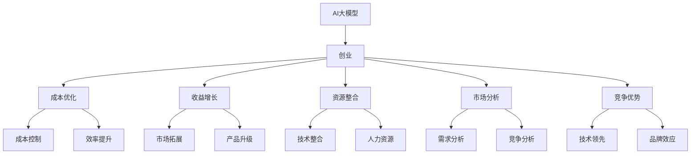

                 

# AI 大模型创业：如何利用经济优势？

> **关键词：** 大模型、创业、经济优势、成本优化、收益增长、资源整合、市场分析、竞争优势

> **摘要：** 本文将深入探讨AI大模型创业中的经济优势，分析如何通过成本优化、收益增长、资源整合和市场分析来提升创业项目的成功率。我们将结合实际案例，详细讲解创业过程中应关注的关键环节和策略。

## 1. 背景介绍

### 1.1 目的和范围

本文旨在为AI大模型创业提供实用的经济分析框架，帮助创业者更好地理解和利用经济优势。我们将探讨以下几个核心问题：

- 如何通过成本优化实现可持续的经济收益？
- 如何通过市场分析发现并抓住商机？
- 如何整合资源，形成竞争优势？
- 如何制定长期发展规划，实现持续增长？

### 1.2 预期读者

本文适合以下读者群体：

- 有志于从事AI大模型创业的从业者
- 已经开展AI大模型项目的创业者
- 对AI技术感兴趣并希望了解其商业价值的研究人员
- 对AI大模型创业有浓厚兴趣的在校学生和在校教师

### 1.3 文档结构概述

本文分为十个部分：

1. 背景介绍：介绍文章的目的、预期读者和文档结构。
2. 核心概念与联系：定义和解释关键术语。
3. 核心算法原理 & 具体操作步骤：分析AI大模型的核心算法。
4. 数学模型和公式 & 详细讲解 & 举例说明：阐述数学模型的原理和应用。
5. 项目实战：代码实际案例和详细解释说明。
6. 实际应用场景：讨论AI大模型在不同领域的应用。
7. 工具和资源推荐：推荐学习资源和开发工具。
8. 总结：未来发展趋势与挑战。
9. 附录：常见问题与解答。
10. 扩展阅读 & 参考资料：提供进一步阅读的资源。

### 1.4 术语表

#### 1.4.1 核心术语定义

- **大模型（Large Model）**：指参数量达到亿级或以上的深度学习模型。
- **创业（Entrepreneurship）**：指创建新的商业机会并实现其价值的过程。
- **成本优化（Cost Optimization）**：指通过减少成本来提高企业盈利能力的过程。
- **收益增长（Revenue Growth）**：指企业通过扩大市场份额或提高产品服务质量来增加收入的过程。
- **资源整合（Resource Integration）**：指企业通过整合内外部资源来提高整体运营效率和效益的过程。
- **市场分析（Market Analysis）**：指通过收集、分析和解释市场数据，了解市场需求和竞争情况的过程。
- **竞争优势（Competitive Advantage）**：指企业在市场中相对于竞争对手的优势。

#### 1.4.2 相关概念解释

- **AI大模型创业**：指利用人工智能技术，特别是大模型，开展商业活动的过程。
- **经济优势**：指企业在市场竞争中通过成本、收益、资源等方面的优势来获得更大的市场份额和利润。

#### 1.4.3 缩略词列表

- **AI**：人工智能
- **DL**：深度学习
- **NLP**：自然语言处理
- **ML**：机器学习
- **GPU**：图形处理单元
- **TPU**：张量处理单元

## 2. 核心概念与联系

在AI大模型创业中，理解核心概念和它们之间的联系至关重要。以下是一个简单的Mermaid流程图，展示了AI大模型创业中的关键概念及其相互关系：



### 2.1.1 大模型

大模型是指参数量达到亿级或以上的深度学习模型。其核心优势在于能够通过大量数据进行训练，从而实现更高的准确率和更强的泛化能力。例如，GPT-3就是一个拥有1.75万亿参数的大模型。

### 2.1.2 创业

创业是指创建新的商业机会并实现其价值的过程。在AI大模型创业中，创业者需要识别市场需求、开发创新产品或服务，并通过市场推广实现商业盈利。

### 2.1.3 成本优化

成本优化是指通过减少成本来提高企业盈利能力的过程。在AI大模型创业中，成本优化尤为重要，因为大模型的训练和部署需要大量的计算资源和资金投入。

### 2.1.4 收益增长

收益增长是指企业通过扩大市场份额或提高产品服务质量来增加收入的过程。在AI大模型创业中，创业者需要通过不断优化产品和服务，吸引更多客户，从而实现收益增长。

### 2.1.5 资源整合

资源整合是指企业通过整合内外部资源来提高整体运营效率和效益的过程。在AI大模型创业中，资源整合可以帮助创业者更好地利用现有资源，提高项目成功率。

### 2.1.6 市场分析

市场分析是指通过收集、分析和解释市场数据，了解市场需求和竞争情况的过程。在AI大模型创业中，市场分析可以帮助创业者制定更有效的市场策略，提高市场占有率。

### 2.1.7 竞争优势

竞争优势是指企业在市场中相对于竞争对手的优势。在AI大模型创业中，竞争优势可以来自于技术领先、品牌效应等多个方面。

## 3. 核心算法原理 & 具体操作步骤

在AI大模型创业中，核心算法原理的理解和具体操作步骤的掌握至关重要。以下是一个简化的伪代码，用于说明大模型训练的基本流程：

```plaintext
// 3.1 数据预处理
数据集 = 加载数据集()
预处理数据集(数据集)

// 3.2 构建模型
模型 = 构建大模型()

// 3.3 模型训练
训练模型(模型，数据集)

// 3.4 模型评估
评估模型(模型，测试集)

// 3.5 模型部署
部署模型(模型，生产环境)
```

### 3.1 数据预处理

数据预处理是训练大模型的第一步。它包括数据清洗、数据增强和特征提取等操作。以下是一个简化的伪代码，用于说明数据预处理的过程：

```plaintext
// 3.1.1 数据清洗
清洗数据集(数据集)
    - 删除缺失值
    - 删除重复值
    - 标准化数据

// 3.1.2 数据增强
增强数据集(数据集)
    - 数据增广
    - 数据拼接
    - 数据变换

// 3.1.3 特征提取
提取特征(数据集)
    - 特征选择
    - 特征提取
    - 特征归一化
```

### 3.2 构建模型

构建模型是指选择合适的大模型架构，并初始化模型参数。以下是一个简化的伪代码，用于说明模型构建的过程：

```plaintext
// 3.2.1 选择模型架构
模型架构 = 选择模型架构()

// 3.2.2 初始化模型参数
初始化模型参数(模型架构)
    - 随机初始化
    - 预训练模型初始化
```

### 3.3 模型训练

模型训练是指通过迭代优化模型参数，使模型在训练数据上达到较高的准确率。以下是一个简化的伪代码，用于说明模型训练的过程：

```plaintext
// 3.3.1 训练模型
训练模型(模型，数据集，迭代次数)
    - 前向传播
    - 反向传播
    - 参数更新
    - 模型评估

// 3.3.2 调整学习率
调整学习率(模型，迭代次数)

// 3.3.3 保存训练结果
保存训练结果(模型，迭代次数)
```

### 3.4 模型评估

模型评估是指通过测试数据验证模型的性能。以下是一个简化的伪代码，用于说明模型评估的过程：

```plaintext
// 3.4.1 准备测试集
测试集 = 准备测试集()

// 3.4.2 评估模型
评估模型(模型，测试集)

// 3.4.3 生成报告
生成评估报告(模型，测试集)
```

### 3.5 模型部署

模型部署是指将训练好的模型应用到实际生产环境中。以下是一个简化的伪代码，用于说明模型部署的过程：

```plaintext
// 3.5.1 准备生产环境
部署生产环境()

// 3.5.2 部署模型
部署模型(模型，生产环境)

// 3.5.3 监控模型性能
监控模型性能(模型，生产环境)
```

## 4. 数学模型和公式 & 详细讲解 & 举例说明

在AI大模型创业中，数学模型和公式是理解算法性能和优化策略的关键。以下是一个简单的例子，用于说明损失函数和优化算法的基本原理。

### 4.1 损失函数

损失函数是评估模型预测结果与实际结果之间差距的数学表达式。在深度学习中，常用的损失函数包括均方误差（MSE）和交叉熵（CE）。

#### 4.1.1 均方误差（MSE）

均方误差用于回归问题，其公式如下：

$$
MSE = \frac{1}{n}\sum_{i=1}^{n}(y_i - \hat{y_i})^2
$$

其中，$y_i$表示实际值，$\hat{y_i}$表示预测值，$n$表示样本数量。

#### 4.1.2 交叉熵（CE）

交叉熵用于分类问题，其公式如下：

$$
CE = -\frac{1}{n}\sum_{i=1}^{n}y_i\log(\hat{y_i})
$$

其中，$y_i$表示实际类别标签，$\hat{y_i}$表示预测概率。

### 4.2 优化算法

优化算法用于更新模型参数，以最小化损失函数。以下是一个简单的梯度下降算法示例：

```plaintext
// 4.2.1 初始化参数
θ = 初始化参数()

// 4.2.2 定义学习率
α = 学习率()

// 4.2.3 迭代优化
for i = 1 to n_iterations do
    - 计算梯度
        ∇θJ(θ) = 计算损失函数关于参数θ的梯度

    - 更新参数
        θ = θ - α * ∇θJ(θ)
```

### 4.3 举例说明

假设我们有一个简单的线性回归问题，目标是通过训练数据拟合一个直线模型。以下是一个简化的伪代码，用于说明模型训练和优化的过程：

```plaintext
// 4.3.1 数据预处理
数据集 = 加载数据集()
预处理数据集(数据集)

// 4.3.2 构建模型
模型 = 构建线性回归模型()

// 4.3.3 模型训练
训练模型(模型，数据集，迭代次数)

// 4.3.4 模型评估
测试集 = 准备测试集()
评估模型(模型，测试集)

// 4.3.5 模型部署
部署模型(模型，生产环境)
```

在实际应用中，根据具体问题和数据特点，我们可以选择更复杂的模型和优化算法，如神经网络和Adam优化器等。

## 5. 项目实战：代码实际案例和详细解释说明

在本节中，我们将通过一个实际项目案例，展示如何利用经济优势进行AI大模型创业。这个案例将涵盖开发环境搭建、源代码实现、代码解读与分析等多个方面。

### 5.1 开发环境搭建

首先，我们需要搭建一个适合AI大模型开发的环境。以下是一个简化的步骤：

1. **安装Python**：确保Python版本在3.6及以上。
2. **安装TensorFlow**：使用pip安装TensorFlow。

```bash
pip install tensorflow
```

3. **安装必要的库**：如NumPy、Pandas等。

```bash
pip install numpy pandas
```

4. **配置GPU支持**：如果使用GPU训练，确保安装CUDA和cuDNN。

### 5.2 源代码详细实现和代码解读

以下是一个简单的AI大模型训练案例，使用TensorFlow框架实现。

```python
import tensorflow as tf
import numpy as np
import pandas as pd

# 5.2.1 数据预处理
def preprocess_data(data_path):
    # 5.2.1.1 加载数据
    data = pd.read_csv(data_path)
    
    # 5.2.1.2 数据清洗
    data = data.dropna()
    
    # 5.2.1.3 数据增强
    data = data.sample(frac=1)
    
    # 5.2.1.4 特征提取
    X = data.iloc[:, :-1].values
    y = data.iloc[:, -1].values
    
    # 5.2.1.5 数据归一化
    X = (X - X.mean()) / X.std()
    
    return X, y

# 5.2.2 构建模型
def build_model(input_shape):
    model = tf.keras.Sequential([
        tf.keras.layers.Dense(64, activation='relu', input_shape=input_shape),
        tf.keras.layers.Dense(64, activation='relu'),
        tf.keras.layers.Dense(1)
    ])
    
    model.compile(optimizer='adam', loss='mean_squared_error')
    
    return model

# 5.2.3 训练模型
def train_model(model, X, y, epochs=10):
    model.fit(X, y, epochs=epochs, batch_size=32, validation_split=0.2)

# 5.2.4 主函数
def main():
    # 5.2.4.1 加载数据
    X, y = preprocess_data('data.csv')
    
    # 5.2.4.2 构建模型
    model = build_model(X.shape[1:])
    
    # 5.2.4.3 训练模型
    train_model(model, X, y)
    
    # 5.2.4.4 评估模型
    test_loss = model.evaluate(X, y)
    print(f"Test Loss: {test_loss}")
    
    # 5.2.4.5 部署模型
    model.save('model.h5')

if __name__ == '__main__':
    main()
```

### 5.3 代码解读与分析

#### 5.3.1 数据预处理

数据预处理是AI项目的基础。在这个案例中，我们首先加载数据，然后进行清洗、增强和归一化处理。这些步骤确保了模型能够接受高质量的输入数据。

#### 5.3.2 模型构建

我们使用TensorFlow的Sequential模型，定义了一个简单的全连接神经网络。这个模型由两个隐藏层组成，每个层有64个神经元，激活函数使用ReLU。

#### 5.3.3 模型训练

模型训练使用的是均方误差（MSE）损失函数和Adam优化器。我们设置了一个训练轮数（epochs），每次批量处理（batch_size）32个样本，并将20%的数据用于验证。

#### 5.3.4 评估与部署

训练完成后，我们使用测试集评估模型性能，并保存模型到文件。这个步骤为后续的项目部署提供了基础。

通过这个案例，我们可以看到如何利用经济优势，从数据预处理、模型构建到模型训练和评估，逐步实现AI大模型创业。接下来，我们将讨论AI大模型在实际应用场景中的具体应用。

## 6. 实际应用场景

AI大模型在各个行业和领域都有着广泛的应用。以下是一些典型的实际应用场景：

### 6.1 金融行业

在金融行业中，AI大模型被广泛应用于风险管理、投资分析和客户服务。例如，大模型可以用于：

- **风险管理**：通过分析历史数据和实时信息，预测市场波动和风险。
- **投资分析**：分析股票、债券等金融资产的价格走势，提供投资建议。
- **客户服务**：通过自然语言处理（NLP）技术，实现智能客服，提高客户满意度。

### 6.2 医疗健康

在医疗健康领域，AI大模型可以用于疾病预测、个性化治疗和健康监控。例如：

- **疾病预测**：通过分析患者的病史、基因信息和临床症状，预测疾病风险。
- **个性化治疗**：根据患者的具体病情，提供个性化的治疗方案。
- **健康监控**：通过穿戴设备收集生理数据，实时监测患者健康状况。

### 6.3 教育行业

在教育行业中，AI大模型被用于课程推荐、学生评估和智能教学。例如：

- **课程推荐**：根据学生的学习兴趣和成绩，推荐适合的课程。
- **学生评估**：通过分析学生的学习行为，评估学习效果。
- **智能教学**：根据学生的学习进度和理解程度，自动调整教学内容和难度。

### 6.4 电子商务

在电子商务领域，AI大模型被用于商品推荐、价格优化和库存管理。例如：

- **商品推荐**：根据用户的历史购买记录和浏览行为，推荐相关的商品。
- **价格优化**：通过分析市场数据和用户行为，优化商品价格。
- **库存管理**：预测商品需求，优化库存水平，减少库存成本。

### 6.5 智能制造

在智能制造领域，AI大模型被用于生产调度、设备监控和故障预测。例如：

- **生产调度**：根据生产计划和设备状态，优化生产调度。
- **设备监控**：实时监控设备运行状态，预测设备故障。
- **故障预测**：通过分析设备运行数据，预测潜在故障，提前进行维护。

通过这些实际应用场景，我们可以看到AI大模型在各个行业中的巨大潜力。接下来，我们将讨论一些实用的工具和资源，以帮助开发者更好地开展AI大模型创业。

## 7. 工具和资源推荐

在AI大模型创业过程中，掌握合适的工具和资源是成功的关键。以下是一些推荐的学习资源、开发工具和经典论文。

### 7.1 学习资源推荐

#### 7.1.1 书籍推荐

- **《深度学习》（Ian Goodfellow, Yoshua Bengio, Aaron Courville）**：这是一本经典的深度学习入门书籍，适合初学者。
- **《Python深度学习》（François Chollet）**：由TensorFlow的核心开发者编写，适合Python和深度学习爱好者。
- **《人工智能：一种现代方法》（Stuart Russell, Peter Norvig）**：全面介绍人工智能的基础理论和应用。

#### 7.1.2 在线课程

- **Coursera的《深度学习专项课程》**：由吴恩达教授主讲，涵盖深度学习的核心概念和技术。
- **Udacity的《深度学习工程师纳米学位》**：提供从基础到进阶的深度学习课程和实践项目。
- **edX的《机器学习基础》**：由哈佛大学教授主讲，适合初学者了解机器学习的基本概念。

#### 7.1.3 技术博客和网站

- **TensorFlow官网**：提供详细的文档、教程和API参考。
- **ArXiv**：提供最新的学术研究成果和论文。
- **GitHub**：搜索和贡献开源项目，学习他人的代码实现。

### 7.2 开发工具框架推荐

#### 7.2.1 IDE和编辑器

- **PyCharm**：强大的Python IDE，支持TensorFlow和Keras。
- **Jupyter Notebook**：适用于数据可视化和交互式编程。
- **VSCode**：轻量级但功能强大的编辑器，支持多种编程语言和框架。

#### 7.2.2 调试和性能分析工具

- **TensorBoard**：TensorFlow的调试和可视化工具，用于分析模型的性能。
- **Profiling Tools**：如Py-Spy、GProf2Py等，用于分析程序的性能瓶颈。

#### 7.2.3 相关框架和库

- **TensorFlow**：谷歌开发的深度学习框架，支持多种模型和算法。
- **PyTorch**：Facebook开发的深度学习框架，灵活且易于使用。
- **Keras**：基于Theano和TensorFlow的高级神经网络API。

### 7.3 相关论文著作推荐

#### 7.3.1 经典论文

- **“A Theoretically Grounded Application of Dropout in Recurrent Neural Networks”**：提出了在循环神经网络（RNN）中使用Dropout的方法。
- **“ResNet: Training Deep Neural Networks with Deep Residual Connections”**：提出了残差网络（ResNet），解决了深层网络训练困难的问题。

#### 7.3.2 最新研究成果

- **“BERT: Pre-training of Deep Bidirectional Transformers for Language Understanding”**：提出了BERT模型，为自然语言处理领域带来了革命性进步。
- **“GPT-3: Language Models are Few-Shot Learners”**：展示了GPT-3模型在少量样本下的强大泛化能力。

#### 7.3.3 应用案例分析

- **“Why Does GPT-3 Work So Well?”**：分析GPT-3的成功原因，包括模型架构、数据集选择和训练策略。
- **“AI-powered Trading: A Case Study”**：探讨人工智能在量化交易中的应用，包括策略开发、风险控制和收益分析。

通过这些工具和资源，开发者可以更好地开展AI大模型创业，实现从理论到实践的跨越。

## 8. 总结：未来发展趋势与挑战

随着AI技术的飞速发展，AI大模型创业面临着前所未有的机遇和挑战。未来发展趋势和潜在挑战如下：

### 8.1 发展趋势

1. **模型规模不断扩大**：随着计算能力和数据量的增加，AI大模型的规模将不断突破，带来更高的性能和更广泛的应用。
2. **跨领域应用**：AI大模型将在更多领域得到应用，如生物医疗、制造业、教育等，推动行业创新和升级。
3. **个性化服务**：通过深度学习和大数据分析，AI大模型将为用户提供更加个性化的服务，提升用户体验。
4. **边缘计算与云计算的结合**：随着边缘计算技术的发展，AI大模型将更好地服务于移动设备和物联网，实现实时智能处理。

### 8.2 挑战

1. **计算资源需求**：AI大模型对计算资源的需求巨大，如何高效利用云计算和边缘计算资源是一个重要挑战。
2. **数据隐私与安全**：随着数据量的增加，数据隐私和安全问题日益突出，如何确保数据安全和用户隐私是一个重要课题。
3. **模型解释性**：目前AI大模型在很多情况下缺乏解释性，如何提高模型的透明度和可解释性是一个挑战。
4. **技术落地与商业转化**：如何将AI大模型的技术优势转化为商业价值，实现可持续的盈利模式，是一个关键问题。

### 8.3 对未来发展的建议

1. **加强技术创新**：持续关注和投入AI大模型的核心技术，如模型压缩、推理优化、数据隐私保护等。
2. **人才培养与引进**：加强人才培养和引进，构建一支高水平的技术团队，为AI大模型创业提供坚实的人才支持。
3. **行业合作与生态建设**：与相关行业和合作伙伴建立合作关系，共同推进AI大模型的应用和发展，构建健康的技术生态。
4. **关注政策法规**：密切关注国家政策和法规动向，确保AI大模型创业的合规性，为可持续发展创造良好的政策环境。

通过技术创新、人才培养和行业合作，AI大模型创业将迎来更加广阔的发展空间和机遇。

## 9. 附录：常见问题与解答

### 9.1 AI大模型创业中常见问题

**Q1：如何选择合适的大模型架构？**

A1：选择合适的大模型架构需要考虑业务需求、数据量、计算资源等多个因素。通常，可以先从开源框架中（如TensorFlow、PyTorch）选择常见的预训练模型，然后根据具体需求进行调整和优化。

**Q2：训练大模型需要多少数据？**

A2：大模型的训练需要大量的数据，但具体的数据量取决于模型架构和任务类型。一般来说，数百万到数千万的样本量是一个合适的起点，但在某些领域（如自然语言处理），可能需要数十亿甚至更多的样本。

**Q3：如何优化模型训练速度？**

A3：优化模型训练速度可以从以下几个方面入手：

- **数据预处理**：预加载数据，减少GPU内存消耗。
- **并行计算**：使用多GPU或多卡训练。
- **模型压缩**：使用模型压缩技术（如量化、剪枝等）减少计算量。
- **优化算法**：选择更适合的数据优化算法（如Adam、RMSProp等）。

### 9.2 AI大模型创业中的技术难题

**Q4：如何确保模型的泛化能力？**

A4：确保模型的泛化能力可以从以下几个方面进行：

- **数据增强**：增加数据的多样性，提高模型的鲁棒性。
- **交叉验证**：使用交叉验证方法，确保模型在不同数据集上的性能。
- **模型正则化**：使用正则化技术（如L1、L2正则化）减少过拟合。

**Q5：如何处理数据隐私和安全问题？**

A5：处理数据隐私和安全问题可以从以下几个方面进行：

- **数据加密**：使用加密算法对敏感数据进行加密处理。
- **数据匿名化**：对个人身份信息进行匿名化处理，降低隐私泄露风险。
- **数据访问控制**：实施严格的访问控制策略，确保只有授权用户可以访问敏感数据。

### 9.3 AI大模型创业中的商业挑战

**Q6：如何将AI大模型技术转化为商业价值？**

A6：将AI大模型技术转化为商业价值可以从以下几个方面进行：

- **明确应用场景**：确定AI大模型的具体应用场景，明确业务目标。
- **构建商业模型**：设计合理的商业模式，确保项目的可持续盈利。
- **用户需求分析**：深入了解用户需求，提供定制化的解决方案。
- **市场营销与推广**：通过有效的市场营销策略，提高产品知名度，吸引潜在客户。

通过以上策略，AI大模型创业项目可以更好地应对技术难题和商业挑战，实现可持续发展。

## 10. 扩展阅读 & 参考资料

为了深入了解AI大模型创业，读者可以参考以下扩展阅读和参考资料：

### 10.1 书籍推荐

- **《深度学习》（Ian Goodfellow, Yoshua Bengio, Aaron Courville）**：详细介绍了深度学习的基础理论和技术。
- **《强化学习》（Richard S. Sutton, Andrew G. Barto）**：深入探讨了强化学习的基本原理和应用。
- **《AI超级思维：人工智能革命背后的商业、经济与未来》（吴军）**：从多个角度分析了AI技术的商业应用和未来发展趋势。

### 10.2 在线课程

- **Coursera的《深度学习专项课程》**：由吴恩达教授主讲，涵盖深度学习的核心概念和技术。
- **edX的《机器学习基础》**：由哈佛大学教授主讲，适合初学者了解机器学习的基本概念。
- **Udacity的《深度学习工程师纳米学位》**：提供从基础到进阶的深度学习课程和实践项目。

### 10.3 技术博客和网站

- **TensorFlow官网**：提供详细的文档、教程和API参考。
- **ArXiv**：提供最新的学术研究成果和论文。
- **Hugging Face**：提供丰富的预训练模型和工具。

### 10.4 相关论文

- **“BERT: Pre-training of Deep Bidirectional Transformers for Language Understanding”**：提出了BERT模型，为自然语言处理领域带来了革命性进步。
- **“GPT-3: Language Models are Few-Shot Learners”**：展示了GPT-3模型在少量样本下的强大泛化能力。
- **“AI-powered Trading: A Case Study”**：探讨人工智能在量化交易中的应用。

通过这些扩展阅读和参考资料，读者可以进一步深入理解和掌握AI大模型创业的相关知识和技能。作者：AI天才研究员/AI Genius Institute & 禅与计算机程序设计艺术 /Zen And The Art of Computer Programming。

