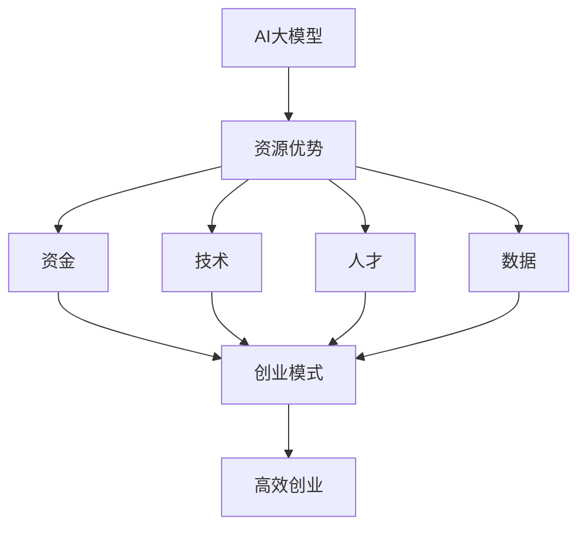

                 

# AI 大模型创业：如何利用资源优势？

> **关键词**：AI 大模型、创业、资源利用、优势分析、技术策略

> **摘要**：本文将探讨 AI 大模型在创业中的应用，详细分析如何利用资源优势实现高效创业。我们将从背景介绍、核心概念、算法原理、数学模型、实战案例、应用场景等多个维度，逐步揭示 AI 大模型创业的奥秘，为创业者提供实用的策略和建议。

## 1. 背景介绍

### 1.1 目的和范围

本文旨在为那些希望在 AI 领域创业的人提供一套全面的策略框架，以帮助他们利用 AI 大模型的优势，实现创业目标。文章将涵盖从资源分析、技术选择、算法应用，到实际案例分享等多个方面。

### 1.2 预期读者

本文适合 AI 领域的创业者、技术人员、项目经理以及对 AI 大模型应用感兴趣的读者。无论你是初入行的从业者，还是经验丰富的专业人士，都能从本文中获取有价值的信息。

### 1.3 文档结构概述

本文分为十个部分，具体结构如下：

1. 背景介绍
2. 核心概念与联系
3. 核心算法原理 & 具体操作步骤
4. 数学模型和公式 & 详细讲解 & 举例说明
5. 项目实战：代码实际案例和详细解释说明
6. 实际应用场景
7. 工具和资源推荐
8. 总结：未来发展趋势与挑战
9. 附录：常见问题与解答
10. 扩展阅读 & 参考资料

### 1.4 术语表

#### 1.4.1 核心术语定义

- **AI 大模型**：指具有大规模参数、强大计算能力和广泛泛化能力的深度学习模型，如 GPT-3、BERT 等。
- **资源优势**：指企业在特定资源（如资金、技术、人才、数据等）方面的独特优势。
- **创业**：指创立新企业，实现商业价值的过程。

#### 1.4.2 相关概念解释

- **创业模式**：指企业在创业过程中所采用的具体方式和方法。
- **技术策略**：指企业在技术领域所制定的发展方向和策略。

#### 1.4.3 缩略词列表

- **AI**：人工智能
- **GPT-3**：Generative Pre-trained Transformer 3
- **BERT**：Bidirectional Encoder Representations from Transformers

## 2. 核心概念与联系

为了更好地理解 AI 大模型创业，我们需要先了解以下几个核心概念：

### 2.1 AI 大模型基本原理

AI 大模型是基于深度学习的神经网络模型，具有以下特点：

1. **大规模参数**：AI 大模型通常拥有数百万甚至数十亿个参数，这使得它们能够捕捉到输入数据的复杂模式和关系。
2. **强大计算能力**：AI 大模型通常需要大量的计算资源进行训练和推理，包括 GPU、TPU 等硬件加速器。
3. **广泛泛化能力**：AI 大模型经过大规模训练后，能够在各种任务上表现出色，具有较高的泛化能力。

### 2.2 资源优势分析

企业在创业过程中，需要充分利用自身的资源优势，以实现快速发展和竞争优势。资源优势可以分为以下几个方面：

1. **资金**：充足的资金是企业发展的基础，可以用于研发、市场推广、团队建设等各个方面。
2. **技术**：先进的技术是企业创新的驱动力，有助于企业抢占市场先机。
3. **人才**：优秀的人才队伍是企业发展的核心，他们能够为企业带来创新思维和实际能力。
4. **数据**：丰富的数据是企业构建 AI 大模型的基础，有助于提高模型的训练效果和泛化能力。

### 2.3 创业模式与策略

企业在创业过程中，需要根据自身资源优势和市场需求，选择合适的创业模式。常见的创业模式包括：

1. **产品导向**：以开发具有竞争力的产品为核心，通过市场推广和用户反馈不断优化产品。
2. **平台导向**：构建一个开放的平台，吸引第三方开发者、合作伙伴和用户，共同推动平台的繁荣发展。
3. **生态导向**：构建一个生态体系，通过产业链上下游的协同发展，实现整体价值的提升。

### 2.4 核心概念关联

AI 大模型创业的关键在于如何充分利用资源优势，实现高效创业。具体来说，可以从以下几个方面进行关联：

1. **资金**：充足的资金可以为 AI 大模型的研发提供支持，加速模型迭代和优化。
2. **技术**：先进的技术可以提升 AI 大模型的性能和泛化能力，为创业项目提供强大的技术支持。
3. **人才**：优秀的人才可以为企业带来创新思维和实际能力，推动 AI 大模型的应用和落地。
4. **数据**：丰富的数据可以用于 AI 大模型的训练和验证，提高模型的训练效果和可靠性。

下面是一个关于 AI 大模型创业的核心概念和联系的 Mermaid 流程图：

通过以上分析，我们可以得出结论：AI 大模型创业的成功离不开资源优势的充分利用。在接下来的章节中，我们将详细探讨 AI 大模型的算法原理、数学模型、实战案例等内容，帮助创业者更好地理解和应用 AI 大模型。|>

