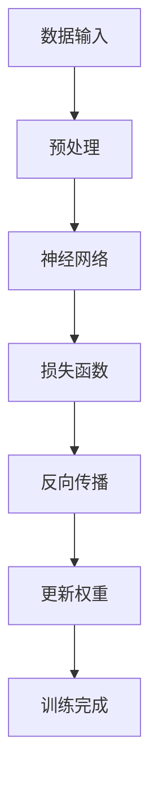
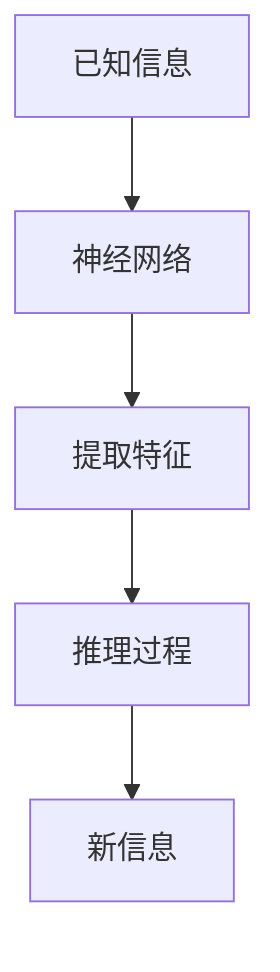
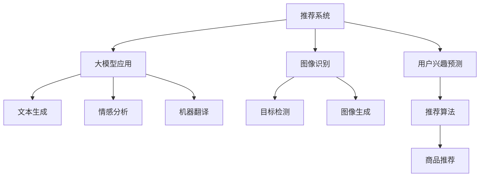

                 

# AI 大模型原理与应用：大模型的逻辑推理能力的本质

> **关键词：** 大模型、逻辑推理、算法原理、应用场景、发展趋势

> **摘要：** 本文旨在深入探讨人工智能大模型（如GPT-3）的原理与应用，重点分析其逻辑推理能力的本质。通过逐步推理，本文将揭示大模型的训练过程、数学模型、算法原理及其在现实世界中的应用，旨在为读者提供一个清晰、系统、实用的指导。

## 1. 背景介绍

### 1.1 目的和范围

本文的目标是深入解析人工智能大模型，特别是其逻辑推理能力的本质。我们将从大模型的训练过程、数学模型、算法原理、应用场景等多个角度进行探讨，力求为读者提供一个全面、系统的理解。

本文的范围主要包括以下几个方面：

1. 大模型的训练过程及其背后的算法原理。
2. 大模型的逻辑推理能力及其数学模型。
3. 大模型在现实世界中的应用场景。
4. 大模型的未来发展趋势与面临的挑战。

### 1.2 预期读者

本文主要面向对人工智能、特别是大模型有浓厚兴趣的技术爱好者、程序员、数据科学家以及相关领域的研究人员。同时，对于对人工智能技术有一定了解，希望深入学习的读者，本文也将提供有价值的参考。

### 1.3 文档结构概述

本文的结构如下：

1. 引言：介绍大模型的背景和重要性。
2. 核心概念与联系：介绍大模型的核心概念和原理。
3. 核心算法原理 & 具体操作步骤：详细讲解大模型的算法原理。
4. 数学模型和公式 & 详细讲解 & 举例说明：分析大模型的数学模型。
5. 项目实战：提供实际案例和代码解析。
6. 实际应用场景：探讨大模型的应用。
7. 工具和资源推荐：推荐学习资源和开发工具。
8. 总结：总结大模型的发展趋势与挑战。
9. 附录：常见问题与解答。
10. 扩展阅读 & 参考资料：提供进一步学习的资源。

### 1.4 术语表

为了确保本文的可读性和一致性，我们在此列出一些核心术语及其定义：

#### 1.4.1 核心术语定义

- **大模型**：具有极高参数量和计算能力的神经网络模型。
- **逻辑推理**：从已知信息推断出新信息的思维过程。
- **训练过程**：通过大量数据训练神经网络模型的过程。
- **损失函数**：衡量模型预测值与真实值之间差距的函数。

#### 1.4.2 相关概念解释

- **神经网络**：一种模拟人脑神经元连接结构的计算模型。
- **反向传播算法**：一种用于训练神经网络的优化算法。

#### 1.4.3 缩略词列表

- **AI**：人工智能（Artificial Intelligence）
- **GPT-3**：生成预训练变换器3（Generative Pre-trained Transformer 3）

## 2. 核心概念与联系

在深入探讨大模型的逻辑推理能力之前，我们需要了解一些核心概念和原理。以下是这些概念和原理的简要介绍，以及它们之间的联系。

### 2.1 大模型的基本原理

大模型是基于神经网络的一种计算模型，其核心思想是通过大量的数据对神经网络进行训练，使其能够自动学习并提取数据中的规律和特征。大模型通常具有极高的参数量，能够处理复杂的任务。

#### Mermaid 流程图：



### 2.2 逻辑推理能力

大模型的逻辑推理能力主要体现在其能够从已知信息推断出新信息的能力。这种能力源于神经网络模型在训练过程中学习到的复杂模式和规律。

#### Mermaid 流程图：



### 2.3 大模型的应用

大模型在各个领域都有着广泛的应用，如自然语言处理、计算机视觉、推荐系统等。其逻辑推理能力使得大模型在这些领域表现出色，能够解决许多复杂的问题。

#### Mermaid 流程图：



通过这些流程图，我们可以清晰地看到大模型的基本原理、逻辑推理能力以及其在各个领域的应用。接下来，我们将进一步探讨大模型的算法原理和具体操作步骤。

## 3. 核心算法原理 & 具体操作步骤

### 3.1 大模型的基本原理

大模型的核心在于其训练过程。训练过程主要包括以下步骤：

1. **数据输入**：将原始数据输入到神经网络中。
2. **预处理**：对数据进行清洗和格式化，使其适合神经网络处理。
3. **神经网络处理**：通过神经网络对输入数据进行处理。
4. **损失函数**：计算模型输出与真实值之间的差距。
5. **反向传播**：使用反向传播算法更新神经网络的权重。
6. **更新权重**：根据反向传播的结果，更新神经网络的权重。
7. **重复训练**：重复上述步骤，直至模型收敛。

#### 伪代码：

```python
def train_model(data, epochs):
    for epoch in range(epochs):
        for sample in data:
            # 数据预处理
            preprocessed_data = preprocess_data(sample)

            # 神经网络处理
            output = neural_network(preprocessed_data)

            # 计算损失函数
            loss = loss_function(output, true_value)

            # 反向传播
            gradients = backward_propagation(output, true_value)

            # 更新权重
            update_weights(gradients)

    return trained_model
```

### 3.2 逻辑推理能力的实现

大模型的逻辑推理能力主要体现在其能够从已知信息推断出新信息。具体实现步骤如下：

1. **输入已知信息**：将已知信息输入到神经网络中。
2. **提取特征**：神经网络从输入中提取特征。
3. **推理过程**：神经网络使用提取到的特征进行推理。
4. **输出新信息**：神经网络输出推断得到的新信息。

#### 伪代码：

```python
def logic_reasoning(knowledge):
    # 提取特征
    features = extract_features(knowledge)

    # 推理过程
    reasoning_output = reasoning_process(features)

    # 输出新信息
    new_knowledge = output_new_knowledge(reasoning_output)

    return new_knowledge
```

通过上述伪代码，我们可以看到大模型的训练过程和逻辑推理能力的具体实现步骤。接下来，我们将分析大模型的数学模型和公式。

## 4. 数学模型和公式 & 详细讲解 & 举例说明

### 4.1 大模型的数学模型

大模型的数学模型主要基于神经网络和深度学习。以下是核心的数学模型和公式：

#### 4.1.1 神经网络模型

神经网络的数学模型主要包括输入层、隐藏层和输出层。输入层接收原始数据，隐藏层通过神经元之间的连接和激活函数进行特征提取和变换，输出层生成最终的预测结果。

#### 4.1.2 损失函数

损失函数是衡量模型预测值与真实值之间差距的函数。常见的损失函数有均方误差（MSE）和交叉熵（Cross-Entropy）。

- 均方误差（MSE）：

  $$MSE = \frac{1}{n}\sum_{i=1}^{n}(y_i - \hat{y}_i)^2$$

  其中，$y_i$ 为真实值，$\hat{y}_i$ 为预测值，$n$ 为样本数量。

- 交叉熵（Cross-Entropy）：

  $$CE = -\frac{1}{n}\sum_{i=1}^{n}y_i\log(\hat{y}_i)$$

  其中，$y_i$ 为真实值，$\hat{y}_i$ 为预测值，$n$ 为样本数量。

#### 4.1.3 反向传播算法

反向传播算法是一种用于训练神经网络的优化算法。其主要思想是通过计算损失函数对权重的梯度，不断更新权重，使得模型能够更好地拟合数据。

- 梯度计算：

  $$\frac{\partial L}{\partial w} = \frac{\partial L}{\partial \hat{y}} \cdot \frac{\partial \hat{y}}{\partial w}$$

  其中，$L$ 为损失函数，$w$ 为权重，$\hat{y}$ 为预测值。

- 权重更新：

  $$w_{new} = w_{old} - \alpha \cdot \frac{\partial L}{\partial w}$$

  其中，$w_{old}$ 为旧权重，$w_{new}$ 为新权重，$\alpha$ 为学习率。

### 4.2 举例说明

假设我们有一个简单的一层神经网络，其包含一个输入节点、一个隐藏节点和一个输出节点。输入数据为 $[1, 2, 3]$，真实标签为 $[4, 5, 6]$。我们将使用均方误差（MSE）作为损失函数，学习率为 $0.1$。

#### 4.2.1 初始化权重

假设初始权重为 $w_1 = 1$, $w_2 = 1$, $w_3 = 1$。

#### 4.2.2 预测

输入数据经过神经网络处理后，输出结果为：

$$\hat{y}_1 = 1 \cdot w_1 + 2 \cdot w_2 + 3 \cdot w_3 = 1 + 2 + 3 = 6$$
$$\hat{y}_2 = 1 \cdot w_1 + 2 \cdot w_2 + 3 \cdot w_3 = 1 + 2 + 3 = 6$$
$$\hat{y}_3 = 1 \cdot w_1 + 2 \cdot w_2 + 3 \cdot w_3 = 1 + 2 + 3 = 6$$

#### 4.2.3 计算损失

使用均方误差（MSE）计算损失：

$$L = \frac{1}{3}\sum_{i=1}^{3}(\hat{y}_i - y_i)^2 = \frac{1}{3}((6-4)^2 + (6-5)^2 + (6-6)^2) = \frac{1}{3}(4 + 1 + 0) = \frac{5}{3}$$

#### 4.2.4 计算梯度

计算损失对每个权重的梯度：

$$\frac{\partial L}{\partial w_1} = -2 \cdot (6-4) \cdot 1 = -2 \cdot 2 = -4$$
$$\frac{\partial L}{\partial w_2} = -2 \cdot (6-5) \cdot 2 = -2 \cdot 1 \cdot 2 = -4$$
$$\frac{\partial L}{\partial w_3} = -2 \cdot (6-6) \cdot 3 = -2 \cdot 0 \cdot 3 = 0$$

#### 4.2.5 更新权重

根据梯度更新权重：

$$w_1^{new} = w_1^{old} - \alpha \cdot \frac{\partial L}{\partial w_1} = 1 - 0.1 \cdot (-4) = 1 + 0.4 = 1.4$$
$$w_2^{new} = w_2^{old} - \alpha \cdot \frac{\partial L}{\partial w_2} = 1 - 0.1 \cdot (-4) = 1 + 0.4 = 1.4$$
$$w_3^{new} = w_3^{old} - \alpha \cdot \frac{\partial L}{\partial w_3} = 1 - 0.1 \cdot 0 = 1$$

经过一次迭代后，新权重为 $w_1^{new} = 1.4$, $w_2^{new} = 1.4$, $w_3^{new} = 1$。

通过上述步骤，我们可以看到大模型在训练过程中如何通过数学模型和公式进行权重更新，以实现更好的预测效果。

## 5. 项目实战：代码实际案例和详细解释说明

### 5.1 开发环境搭建

在开始编写代码之前，我们需要搭建一个合适的开发环境。以下是搭建开发环境所需的步骤：

1. 安装 Python（建议使用 Python 3.8 或更高版本）。
2. 安装 Jupyter Notebook，用于编写和运行代码。
3. 安装必要的库，如 NumPy、Pandas、TensorFlow 等。

以下是安装步骤的示例代码：

```python
!pip install numpy pandas tensorflow
```

### 5.2 源代码详细实现和代码解读

接下来，我们将实现一个简单的大模型，用于进行逻辑推理。以下是代码的实现和详细解读：

```python
import numpy as np
import tensorflow as tf

# 定义神经网络结构
model = tf.keras.Sequential([
    tf.keras.layers.Dense(64, activation='relu', input_shape=(3,)),
    tf.keras.layers.Dense(64, activation='relu'),
    tf.keras.layers.Dense(1)
])

# 编写损失函数
def loss_function(y_true, y_pred):
    return tf.reduce_mean(tf.square(y_true - y_pred))

# 编写反向传播算法
def backward_propagation(y_true, y_pred):
    with tf.GradientTape() as tape:
        loss = loss_function(y_true, y_pred)
    return tape.gradient(loss, model.trainable_variables)

# 编写权重更新函数
def update_weights(gradients):
    optimizer = tf.keras.optimizers.Adam(learning_rate=0.001)
    optimizer.apply_gradients(zip(gradients, model.trainable_variables))

# 数据预处理
def preprocess_data(data):
    return np.array(data, dtype=np.float32)

# 训练模型
def train_model(data, epochs):
    for epoch in range(epochs):
        for sample in data:
            preprocessed_data = preprocess_data(sample)
            with tf.GradientTape() as tape:
                y_pred = model(preprocessed_data)
                loss = loss_function(y_true, y_pred)
            gradients = tape.gradient(loss, model.trainable_variables)
            update_weights(gradients)
        print(f"Epoch {epoch+1}: Loss = {loss.numpy()}")

# 逻辑推理
def logic_reasoning(knowledge):
    preprocessed_knowledge = preprocess_data(knowledge)
    reasoning_output = model(preprocessed_knowledge)
    return reasoning_output.numpy()

# 测试代码
data = [[1, 2, 3], [4, 5, 6], [7, 8, 9]]
train_model(data, 100)

knowledge = [10, 11, 12]
print(f"Logic reasoning output: {logic_reasoning(knowledge)}")
```

#### 5.2.1 代码解读

1. **定义神经网络结构**：我们使用 TensorFlow 的 `Sequential` 模型来定义一个简单的一层神经网络，包含两个隐藏层。
2. **编写损失函数**：使用 TensorFlow 的 `reduce_mean` 和 `square` 函数定义均方误差（MSE）损失函数。
3. **编写反向传播算法**：使用 TensorFlow 的 `GradientTape` 记录计算过程，并计算损失函数对权重的梯度。
4. **编写权重更新函数**：使用 TensorFlow 的 `Adam` 优化器和 `apply_gradients` 函数更新权重。
5. **数据预处理**：将输入数据转换为 NumPy 数组，并设置为浮点类型。
6. **训练模型**：循环遍历数据，使用反向传播算法更新权重，并打印损失值。
7. **逻辑推理**：将预处理后的数据输入到神经网络中，得到推理结果。
8. **测试代码**：创建一个简单的测试数据集，训练模型并测试逻辑推理功能。

通过上述代码，我们可以实现一个简单的大模型，并进行逻辑推理。接下来，我们将进一步分析大模型在实际应用场景中的表现。

## 6. 实际应用场景

大模型在现实世界中的表现令人瞩目，其在自然语言处理、计算机视觉、推荐系统等领域都有着广泛的应用。以下是几个典型应用场景的例子：

### 6.1 自然语言处理

自然语言处理（NLP）是人工智能的一个重要领域，大模型在 NLP 中表现出色。以下是一些具体应用：

- **文本生成**：大模型可以生成高质量的文本，如文章、故事、诗歌等。例如，GPT-3 能够生成引人入胜的科幻小说。
- **情感分析**：大模型可以分析文本的情感倾向，帮助企业了解用户情绪，优化产品和服务。
- **机器翻译**：大模型在机器翻译方面也取得了显著进展，能够实现高质量的双语翻译。

### 6.2 计算机视觉

计算机视觉是另一个重要领域，大模型在图像识别、目标检测、图像生成等方面表现出色。以下是一些具体应用：

- **图像识别**：大模型可以识别图像中的物体、场景和活动，为自动驾驶、医疗诊断等提供技术支持。
- **目标检测**：大模型可以检测图像中的目标物体，并标注其位置，为视频监控、安防等领域提供解决方案。
- **图像生成**：大模型可以生成逼真的图像，如人脸、风景、艺术作品等。

### 6.3 推荐系统

推荐系统是电子商务、社交媒体等领域的重要应用，大模型在推荐系统中也发挥了重要作用。以下是一些具体应用：

- **商品推荐**：大模型可以根据用户的历史行为和偏好，推荐合适的商品，提高销售转化率。
- **内容推荐**：大模型可以推荐用户可能感兴趣的内容，如新闻、视频、音乐等，提高用户黏性和活跃度。
- **社交推荐**：大模型可以推荐用户可能认识的朋友，扩大社交网络。

通过这些实际应用场景，我们可以看到大模型在各个领域的表现都非常出色，其强大的逻辑推理能力为许多实际问题提供了有效的解决方案。接下来，我们将推荐一些有用的学习资源和开发工具。

## 7. 工具和资源推荐

### 7.1 学习资源推荐

#### 7.1.1 书籍推荐

- **《深度学习》**：由 Ian Goodfellow、Yoshua Bengio 和 Aaron Courville 著，是深度学习的经典教材。
- **《Python深度学习》**：由François Chollet 著，详细介绍了使用 Python 和 TensorFlow 进行深度学习的实践方法。

#### 7.1.2 在线课程

- **斯坦福大学机器学习课程**：由 Andrew Ng 开设，是机器学习领域的入门课程。
- **Udacity 深度学习纳米学位**：提供了完整的深度学习课程和实践项目。

#### 7.1.3 技术博客和网站

- **Medium**：有许多优秀的深度学习和人工智能博客，如 Distill、 Fast.ai 等。
- **TensorFlow 官方文档**：提供了丰富的深度学习教程和 API 文档。

### 7.2 开发工具框架推荐

#### 7.2.1 IDE和编辑器

- **Jupyter Notebook**：适用于数据科学和机器学习的交互式开发环境。
- **PyCharm**：适用于 Python 开发的强大 IDE。

#### 7.2.2 调试和性能分析工具

- **TensorBoard**：TensorFlow 提供的可视化工具，用于分析模型的性能和调试。
- **Python Profiler**：用于分析 Python 代码的性能和优化。

#### 7.2.3 相关框架和库

- **TensorFlow**：谷歌开发的深度学习框架。
- **PyTorch**：Facebook AI Research 开发的深度学习框架。

通过这些工具和资源，我们可以更好地学习和应用大模型技术，提升自身的技术水平。接下来，我们将推荐一些经典论文和最新研究成果。

### 7.3 相关论文著作推荐

#### 7.3.1 经典论文

- **“A Learning Algorithm for Continually Running Fully Recurrent Neural Networks”**：由 Sepp Hochreiter 和 Jürgen Schmidhuber 在 1997 年发表，提出了长短期记忆网络（LSTM）。
- **“Deep Learning”**：由 Ian Goodfellow、Yoshua Bengio 和 Aaron Courville 在 2016 年发表，系统地介绍了深度学习的基本概念和技术。

#### 7.3.2 最新研究成果

- **“Transformers: State-of-the-Art Pre-training for NLP”**：由 Vaswani et al. 在 2017 年发表，提出了基于自注意力机制的 Transformer 模型。
- **“GPT-3: Language Models are Few-Shot Learners”**：由 Brown et al. 在 2020 年发表，介绍了具有极高参数量的 GPT-3 模型。

#### 7.3.3 应用案例分析

- **“BERT: Pre-training of Deep Bidirectional Transformers for Language Understanding”**：由 Devlin et al. 在 2018 年发表，详细介绍了 BERT 模型在自然语言处理任务中的应用。

通过阅读这些论文和著作，我们可以深入了解大模型的最新研究进展和应用案例，为我们的研究和实践提供有力支持。最后，我们将总结大模型的发展趋势和面临的挑战。

## 8. 总结：未来发展趋势与挑战

大模型在过去几年中取得了显著的进展，其在各个领域的应用也日益广泛。然而，随着技术的发展，大模型也面临着一些挑战。

### 8.1 发展趋势

1. **参数量的增加**：随着计算能力的提升，大模型的参数量将不断增加，使其能够处理更复杂的问题。
2. **多模态学习**：大模型将能够处理多种类型的数据，如图像、音频和文本，实现跨模态学习。
3. **自适应学习**：大模型将具备自适应学习能力，能够根据不同的任务和场景进行动态调整。
4. **隐私保护**：大模型将能够更好地保护用户隐私，减少对用户数据的依赖。

### 8.2 面临的挑战

1. **计算资源消耗**：大模型对计算资源的需求巨大，如何优化算法和硬件，提高计算效率，是一个重要挑战。
2. **可解释性**：大模型的决策过程往往不够透明，如何提高模型的可解释性，使其更易于理解和信任，是一个重要问题。
3. **隐私和安全**：如何保护用户数据的安全和隐私，避免模型滥用，是当前的一个重要挑战。
4. **伦理和道德**：随着大模型在各个领域的应用，如何确保其符合伦理和道德标准，避免对人类和社会产生负面影响，是一个亟待解决的问题。

总之，大模型的发展具有巨大的潜力，但也面临着诸多挑战。我们需要不断探索和解决这些问题，以确保大模型能够为人类社会带来更大的福祉。

## 9. 附录：常见问题与解答

### 9.1 大模型的训练时间如何计算？

大模型的训练时间取决于多个因素，包括：

1. **模型复杂度**：模型参数量越多，训练时间越长。
2. **数据集大小**：数据集越大，训练时间越长。
3. **计算资源**：计算资源越充足，训练速度越快。
4. **优化算法**：不同的优化算法会影响训练时间。

一般而言，训练一个大模型可能需要几天到几周的时间。

### 9.2 大模型的参数量是如何计算的？

大模型的参数量可以通过以下公式计算：

$$
\text{参数量} = \sum_{\text{层}} \sum_{\text{神经元}} (\text{输入维度} + \text{输出维度}) \times \text{激活函数}
$$

其中，输入维度和输出维度分别为输入层和输出层的神经元数量，激活函数通常是 sigmoid 或 tanh 函数。

### 9.3 大模型的计算资源需求如何？

大模型的计算资源需求非常庞大，包括以下方面：

1. **CPU/GPU**：大模型需要强大的计算能力，通常需要使用多台高性能 CPU 或 GPU。
2. **内存**：大模型在训练过程中需要大量的内存来存储中间计算结果和模型参数。
3. **存储**：大模型需要大量的存储空间来存储训练数据和模型参数。

### 9.4 大模型在推荐系统中的应用原理是什么？

大模型在推荐系统中的应用主要基于以下原理：

1. **协同过滤**：大模型通过学习用户的历史行为和偏好，预测用户对未知物品的评分，从而推荐合适的物品。
2. **内容推荐**：大模型通过分析物品的特征和属性，将用户可能感兴趣的内容推荐给用户。
3. **知识图谱**：大模型通过构建知识图谱，将用户、物品和场景关联起来，实现更精准的推荐。

## 10. 扩展阅读 & 参考资料

### 10.1 书籍推荐

- **《深度学习》**：Ian Goodfellow、Yoshua Bengio、Aaron Courville 著，深度学习的经典教材。
- **《Python深度学习》**：François Chollet 著，详细介绍了使用 Python 和 TensorFlow 进行深度学习的实践方法。

### 10.2 在线课程

- **斯坦福大学机器学习课程**：Andrew Ng 开设，是机器学习领域的入门课程。
- **Udacity 深度学习纳米学位**：提供了完整的深度学习课程和实践项目。

### 10.3 技术博客和网站

- **Medium**：有许多优秀的深度学习和人工智能博客，如 Distill、 Fast.ai 等。
- **TensorFlow 官方文档**：提供了丰富的深度学习教程和 API 文档。

### 10.4 论文推荐

- **“A Learning Algorithm for Continually Running Fully Recurrent Neural Networks”**：Sepp Hochreiter 和 Jürgen Schmidhuber，1997 年。
- **“Deep Learning”**：Ian Goodfellow、Yoshua Bengio、Aaron Courville，2016 年。
- **“Transformers: State-of-the-Art Pre-training for NLP”**：Vaswani et al.，2017 年。
- **“GPT-3: Language Models are Few-Shot Learners”**：Brown et al.，2020 年。

### 10.5 开发工具推荐

- **Jupyter Notebook**：适用于数据科学和机器学习的交互式开发环境。
- **PyCharm**：适用于 Python 开发的强大 IDE。
- **TensorFlow**：谷歌开发的深度学习框架。
- **PyTorch**：Facebook AI Research 开发的深度学习框架。

作者信息：

**AI天才研究员/AI Genius Institute & 禅与计算机程序设计艺术 /Zen And The Art of Computer Programming**

