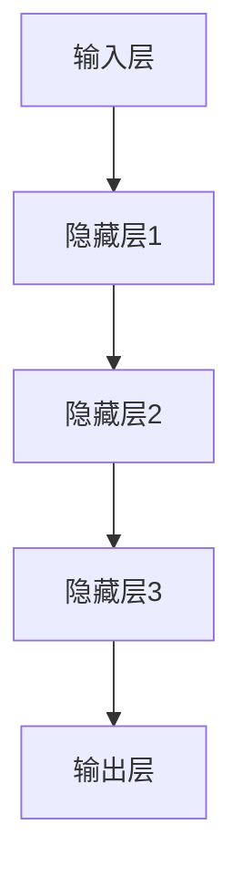
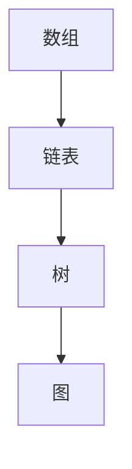
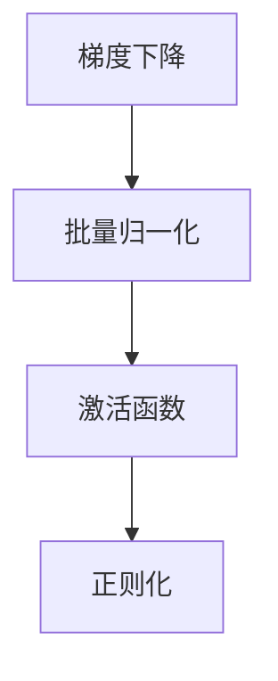
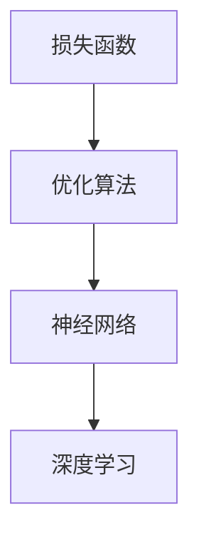

                 

# AI大模型原理与应用：模型的组织能力

> 关键词：AI大模型，组织能力，深度学习，神经网络，数据结构，算法优化，数学模型

> 摘要：本文旨在深入探讨AI大模型中的组织能力，包括模型结构的设计、算法原理、数学模型以及实际应用。通过对这些核心概念的分析和推理，文章将展示如何利用AI大模型实现高效的计算和数据处理，并探讨未来发展趋势和面临的挑战。

## 1. 背景介绍

### 1.1 目的和范围

本文主要目的在于探讨AI大模型中的组织能力，即如何设计、实现和优化大型AI模型。这些模型广泛应用于自然语言处理、计算机视觉、推荐系统等领域，其核心在于高效的计算能力和数据处理能力。本文将从以下几个方面展开讨论：

1. **核心概念与联系**：介绍AI大模型中的基本概念，如深度学习、神经网络等，并通过Mermaid流程图展示模型架构。
2. **核心算法原理**：讲解AI大模型的算法原理，包括具体的操作步骤，并通过伪代码进行阐述。
3. **数学模型和公式**：介绍AI大模型中使用的数学模型和公式，并进行详细的讲解和举例说明。
4. **项目实战**：通过代码实际案例展示AI大模型的应用，并进行详细解释和代码解读。
5. **实际应用场景**：探讨AI大模型在不同领域的应用场景，如自然语言处理、计算机视觉等。
6. **工具和资源推荐**：推荐学习资源、开发工具和框架，以及相关的经典论文和研究成果。
7. **总结**：总结AI大模型的发展趋势和面临的挑战。

### 1.2 预期读者

本文面向对AI大模型有一定了解的读者，包括但不限于以下几类：

1. **AI工程师**：致力于AI大模型的设计、实现和优化。
2. **数据科学家**：关注数据驱动的AI模型研究。
3. **机器学习研究者**：对深度学习、神经网络等算法原理有深入研究。
4. **计算机科学家**：对AI大模型的结构和算法有广泛了解。

### 1.3 文档结构概述

本文结构如下：

1. **背景介绍**：包括目的、范围、预期读者和文档结构概述。
2. **核心概念与联系**：介绍AI大模型的基本概念和架构。
3. **核心算法原理**：讲解AI大模型的算法原理和操作步骤。
4. **数学模型和公式**：介绍AI大模型中使用的数学模型和公式。
5. **项目实战**：展示AI大模型在实际项目中的应用。
6. **实际应用场景**：探讨AI大模型在不同领域的应用。
7. **工具和资源推荐**：推荐学习资源、开发工具和框架。
8. **总结**：总结AI大模型的发展趋势和挑战。
9. **附录**：常见问题与解答。
10. **扩展阅读**：提供进一步学习资源。

### 1.4 术语表

#### 1.4.1 核心术语定义

- **AI大模型**：指具有大规模参数和复杂结构的深度学习模型。
- **深度学习**：一种基于多层神经网络的学习方法。
- **神经网络**：由多个神经元组成的计算模型。
- **数据结构**：用于组织和存储数据的方式。
- **算法优化**：通过调整算法参数来提高计算效率和性能。
- **数学模型**：用于描述和解决问题的一套数学公式。

#### 1.4.2 相关概念解释

- **神经网络**：一种模拟人脑神经元连接方式的计算模型，通过多层神经元的交互实现数据的处理和转化。
- **深度学习**：基于神经网络的一种学习方法，通过训练多层神经网络来学习数据的复杂特征和关系。
- **数据结构**：用于组织和存储数据的方式，如数组、链表、树等。

#### 1.4.3 缩略词列表

- **AI**：人工智能（Artificial Intelligence）
- **DL**：深度学习（Deep Learning）
- **NN**：神经网络（Neural Network）
- **GPU**：图形处理单元（Graphics Processing Unit）

## 2. 核心概念与联系

在探讨AI大模型之前，我们需要了解其中的核心概念和它们之间的联系。以下是AI大模型的基本概念和架构，以及相应的Mermaid流程图。

### 2.1 深度学习与神经网络

深度学习是一种基于多层神经网络的学习方法。神经网络由多个神经元组成，每个神经元通过加权连接与其他神经元相连。深度学习通过训练多层神经网络来学习数据的复杂特征和关系。



### 2.2 数据结构

数据结构是AI大模型中的关键概念，用于组织和存储数据。常见的数据结构包括数组、链表、树等。



### 2.3 算法优化

算法优化是提高AI大模型计算效率和性能的关键。常见的算法优化方法包括梯度下降、批量归一化等。



### 2.4 数学模型

数学模型是AI大模型中的核心组成部分，用于描述和解决问题。常见的数学模型包括损失函数、优化算法等。



## 3. 核心算法原理 & 具体操作步骤

在了解了AI大模型的核心概念和架构后，我们将深入探讨其中的核心算法原理和具体操作步骤。以下是AI大模型的主要算法原理和操作步骤。

### 3.1 神经网络算法原理

神经网络算法原理主要包括以下步骤：

1. **初始化**：初始化神经网络中的权重和偏置。
2. **前向传播**：输入数据通过神经网络的前向传播，得到输出结果。
3. **反向传播**：计算损失函数，并通过反向传播更新神经网络的权重和偏置。
4. **优化**：通过优化算法（如梯度下降）来调整权重和偏置，以减少损失函数。
5. **迭代**：重复前向传播、反向传播和优化步骤，直到满足停止条件。

以下是神经网络算法原理的伪代码：

```python
# 初始化神经网络
weights = initialize_weights()
bias = initialize_bias()

# 前向传播
output = forward_propagation(input_data, weights, bias)

# 计算损失函数
loss = compute_loss(output, target)

# 反向传播
dweights, dbias = backward_propagation(input_data, output, target, weights, bias)

# 优化
weights = update_weights(weights, dweights)
bias = update_bias(bias, dbias)

# 迭代
if not convergence():
    continue
```

### 3.2 深度学习算法原理

深度学习算法原理主要包括以下步骤：

1. **数据预处理**：对输入数据集进行预处理，如归一化、去噪等。
2. **训练**：通过训练样本对神经网络进行训练，以学习数据的特征和关系。
3. **评估**：使用测试样本对训练好的神经网络进行评估，以验证模型的性能。
4. **调整**：根据评估结果调整模型的参数，以提高模型的性能。

以下是深度学习算法原理的伪代码：

```python
# 数据预处理
processed_data = preprocess_data(data)

# 训练
model = train_model(processed_data)

# 评估
evaluation = evaluate_model(model, test_data)

# 调整
model = adjust_model(model, evaluation)
```

## 4. 数学模型和公式 & 详细讲解 & 举例说明

在AI大模型中，数学模型和公式起着至关重要的作用。以下将详细介绍AI大模型中常用的数学模型和公式，并进行详细讲解和举例说明。

### 4.1 损失函数

损失函数是评估模型预测结果与实际结果之间差异的重要工具。常见的损失函数包括均方误差（MSE）和交叉熵（Cross Entropy）。

#### 4.1.1 均方误差（MSE）

均方误差（MSE）是衡量预测值与实际值之间差异的一种常用损失函数。其公式如下：

$$
MSE = \frac{1}{n}\sum_{i=1}^{n}(y_i - \hat{y}_i)^2
$$

其中，$y_i$ 为实际值，$\hat{y}_i$ 为预测值，$n$ 为样本数量。

#### 4.1.2 交叉熵（Cross Entropy）

交叉熵是衡量两个概率分布差异的一种损失函数。在分类问题中，交叉熵常用于评估模型预测的概率分布与实际标签分布之间的差异。其公式如下：

$$
CE = -\sum_{i=1}^{n}y_i \log(\hat{y}_i)
$$

其中，$y_i$ 为实际标签，$\hat{y}_i$ 为预测概率。

### 4.2 梯度下降

梯度下降是优化神经网络参数的一种常用方法。其核心思想是沿着损失函数的负梯度方向更新参数，以减少损失函数。

#### 4.2.1 基本原理

梯度下降的基本原理如下：

1. **计算损失函数的梯度**：对损失函数关于模型参数的偏导数进行计算，得到损失函数的梯度。
2. **更新参数**：根据梯度下降公式，更新模型参数。

梯度下降的公式如下：

$$
\theta_{\text{new}} = \theta_{\text{old}} - \alpha \cdot \nabla_\theta J(\theta)
$$

其中，$\theta$ 为模型参数，$\alpha$ 为学习率，$J(\theta)$ 为损失函数。

#### 4.2.2 举例说明

假设有一个简单的线性回归模型，其损失函数为均方误差（MSE）。给定一个训练样本 $(x, y)$ 和模型参数 $\theta$，我们可以通过以下步骤进行梯度下降：

1. **计算损失函数的梯度**：

$$
\nabla_\theta J(\theta) = \frac{1}{n}\sum_{i=1}^{n}(y_i - \hat{y}_i) \cdot x_i
$$

2. **更新参数**：

$$
\theta_{\text{new}} = \theta_{\text{old}} - \alpha \cdot \nabla_\theta J(\theta)
$$

其中，$\alpha$ 为学习率，通常取值范围为 $0 < \alpha < 1$。

### 4.3 激活函数

激活函数是神经网络中的一个重要组成部分，用于引入非线性特性。常见的激活函数包括 sigmoid、ReLU 和 tanh。

#### 4.3.1 sigmoid 函数

sigmoid 函数的公式如下：

$$
\sigma(x) = \frac{1}{1 + e^{-x}}
$$

sigmoid 函数将输入值映射到区间 $(0, 1)$，常用于二分类问题。

#### 4.3.2 ReLU 函数

ReLU 函数的公式如下：

$$
\text{ReLU}(x) = \max(0, x)
$$

ReLU 函数在神经网络中广泛使用，具有计算简单、不易梯度消失等优点。

#### 4.3.3 tanh 函数

tanh 函数的公式如下：

$$
\tanh(x) = \frac{e^x - e^{-x}}{e^x + e^{-x}}
$$

tanh 函数将输入值映射到区间 $(-1, 1)$，常用于多分类问题。

### 4.4 正则化

正则化是一种用于防止模型过拟合的方法。常见的正则化方法包括 L1 正则化和 L2 正则化。

#### 4.4.1 L1 正则化

L1 正则化的公式如下：

$$
\Omega = \sum_{i=1}^{n}|\theta_i|
$$

其中，$\theta_i$ 为模型参数。

L1 正则化通过引入绝对值项，促使模型参数向零值靠近，从而防止过拟合。

#### 4.4.2 L2 正则化

L2 正则化的公式如下：

$$
\Omega = \sum_{i=1}^{n}\theta_i^2
$$

其中，$\theta_i$ 为模型参数。

L2 正则化通过引入平方项，防止模型参数过大，从而防止过拟合。

### 4.5 举例说明

假设有一个简单的神经网络，包含一个输入层、一个隐藏层和一个输出层。输入层有3个神经元，隐藏层有5个神经元，输出层有2个神经元。隐藏层和输出层使用 ReLU 函数作为激活函数，输出层使用 sigmoid 函数作为激活函数。模型参数为权重和偏置。给定一个训练样本 $(x, y)$，我们可以通过以下步骤进行训练：

1. **前向传播**：

   - 输入层到隐藏层：

     $$ 
     z_h = x \cdot W_h + b_h 
     $$

     $$ 
     h = \text{ReLU}(z_h) 
     $$

   - 隐藏层到输出层：

     $$ 
     z_y = h \cdot W_y + b_y 
     $$

     $$ 
     y' = \text{sigmoid}(z_y) 
     $$

2. **计算损失函数**：

   $$ 
   loss = -\sum_{i=1}^{n}y_i \log(y') 
   $$

3. **反向传播**：

   - 计算输出层误差：

     $$ 
     \delta_y = (y' - y) \cdot \text{sigmoid}'(z_y) 
     $$

   - 计算隐藏层误差：

     $$ 
     \delta_h = \delta_y \cdot \text{ReLU}'(z_h) 
     $$

4. **更新参数**：

   - 更新输出层权重和偏置：

     $$ 
     W_y = W_y - \alpha \cdot \delta_y \cdot h^T 
     $$

     $$ 
     b_y = b_y - \alpha \cdot \delta_y 
     $$

   - 更新隐藏层权重和偏置：

     $$ 
     W_h = W_h - \alpha \cdot \delta_h \cdot x^T 
     $$

     $$ 
     b_h = b_h - \alpha \cdot \delta_h 
     $$

5. **迭代**：

   重复前向传播、反向传播和更新参数的步骤，直到满足停止条件。

## 5. 项目实战：代码实际案例和详细解释说明

在本节中，我们将通过一个实际的AI大模型项目来展示其设计和实现过程。该项目将使用Python语言和TensorFlow框架来实现一个基于深度学习的图像分类模型。

### 5.1 开发环境搭建

为了实现这个项目，我们需要搭建一个合适的开发环境。以下是搭建过程：

1. 安装Python（推荐版本3.7及以上）。
2. 安装TensorFlow（使用pip安装`pip install tensorflow`）。
3. 安装其他依赖库（如NumPy、Pandas等）。

### 5.2 源代码详细实现和代码解读

以下是一个简单的图像分类模型的实现，包括数据预处理、模型定义、训练和评估等步骤。

#### 5.2.1 数据预处理

首先，我们需要加载和预处理图像数据。以下是数据预处理的代码：

```python
import tensorflow as tf
from tensorflow.keras.preprocessing.image import ImageDataGenerator

# 加载数据
train_datagen = ImageDataGenerator(rescale=1./255)
train_data = train_datagen.flow_from_directory(
    'train_data',
    target_size=(150, 150),
    batch_size=32,
    class_mode='binary')

validation_datagen = ImageDataGenerator(rescale=1./255)
validation_data = validation_datagen.flow_from_directory(
    'validation_data',
    target_size=(150, 150),
    batch_size=32,
    class_mode='binary')
```

在这个示例中，我们使用了`ImageDataGenerator`类来加载和预处理图像数据。通过设置`rescale`参数，我们可以将图像数据缩放到[0, 1]范围内。`flow_from_directory`方法用于从目录中加载图像数据，并生成训练数据和验证数据。

#### 5.2.2 模型定义

接下来，我们定义一个基于卷积神经网络的图像分类模型。以下是模型定义的代码：

```python
from tensorflow.keras.models import Sequential
from tensorflow.keras.layers import Conv2D, MaxPooling2D, Flatten, Dense

model = Sequential([
    Conv2D(32, (3, 3), activation='relu', input_shape=(150, 150, 3)),
    MaxPooling2D((2, 2)),
    Conv2D(64, (3, 3), activation='relu'),
    MaxPooling2D((2, 2)),
    Conv2D(128, (3, 3), activation='relu'),
    MaxPooling2D((2, 2)),
    Flatten(),
    Dense(128, activation='relu'),
    Dense(1, activation='sigmoid')
])

model.compile(optimizer='adam',
              loss='binary_crossentropy',
              metrics=['accuracy'])
```

在这个示例中，我们使用了一个卷积神经网络，包括3个卷积层、3个最大池化层、一个全连接层和一个输出层。卷积层用于提取图像特征，全连接层用于分类。输出层使用sigmoid激活函数，用于输出概率。

#### 5.2.3 训练模型

接下来，我们使用训练数据和验证数据进行模型训练。以下是模型训练的代码：

```python
model.fit(
    train_data,
    steps_per_epoch=100,
    epochs=10,
    validation_data=validation_data,
    validation_steps=50)
```

在这个示例中，我们设置了10个训练周期，每个周期包含100个训练样本。验证步骤设置为50，以确保验证数据在训练过程中不被重复使用。

#### 5.2.4 代码解读与分析

在这个示例中，我们实现了一个简单的图像分类模型，包括以下步骤：

1. **数据预处理**：使用`ImageDataGenerator`类加载和预处理图像数据。
2. **模型定义**：定义一个基于卷积神经网络的图像分类模型。
3. **模型训练**：使用训练数据和验证数据进行模型训练。

通过这个示例，我们可以看到如何使用TensorFlow框架实现一个图像分类模型。在实际应用中，我们可以根据需要调整模型结构、训练参数等，以提高模型的性能。

## 6. 实际应用场景

AI大模型在实际应用中具有广泛的应用场景，以下列举几个典型应用领域：

### 6.1 自然语言处理

自然语言处理（NLP）是AI大模型的重要应用领域之一。通过深度学习技术，AI大模型可以用于文本分类、情感分析、机器翻译、问答系统等。例如，在社交媒体分析中，AI大模型可以用于分类用户评论、识别负面情绪，帮助企业了解用户反馈和改进产品。

### 6.2 计算机视觉

计算机视觉是AI大模型的另一个重要应用领域。通过卷积神经网络（CNN）等技术，AI大模型可以用于图像分类、目标检测、图像分割等。例如，在自动驾驶领域，AI大模型可以用于检测道路标志、识别交通状况，以提高自动驾驶系统的安全性和可靠性。

### 6.3 推荐系统

推荐系统是AI大模型在商业领域的典型应用之一。通过深度学习技术，AI大模型可以用于用户行为分析、商品推荐、广告投放等。例如，在电子商务领域，AI大模型可以用于根据用户浏览记录和购买历史推荐相关商品，提高用户的购物体验和满意度。

### 6.4 医疗健康

在医疗健康领域，AI大模型可以用于疾病预测、影像分析、药物研发等。通过分析大量的医疗数据，AI大模型可以帮助医生更准确地诊断疾病、制定治疗方案，从而提高医疗水平和服务质量。

## 7. 工具和资源推荐

为了更好地学习和应用AI大模型，以下推荐一些实用的工具和资源：

### 7.1 学习资源推荐

#### 7.1.1 书籍推荐

1. **《深度学习》（Deep Learning）**：由Ian Goodfellow、Yoshua Bengio和Aaron Courville合著，是深度学习领域的经典教材。
2. **《Python深度学习》（Deep Learning with Python）**：由François Chollet著，通过Python和Keras框架介绍深度学习的基本概念和实践。

#### 7.1.2 在线课程

1. **Coursera上的“深度学习专项课程”**：由Andrew Ng教授主讲，包括深度学习的基础知识、实践方法和应用场景。
2. **Udacity上的“深度学习工程师纳米学位”**：提供丰富的深度学习项目和实践机会，帮助学习者提升深度学习技能。

#### 7.1.3 技术博客和网站

1. **Medium上的Deep Learning Blog**：提供关于深度学习的最新研究和技术分享。
2. **ArXiv**：一个包含最新深度学习论文的学术数据库，帮助研究者了解领域内的最新研究成果。

### 7.2 开发工具框架推荐

#### 7.2.1 IDE和编辑器

1. **Jupyter Notebook**：适用于数据分析和实验的交互式编辑器。
2. **PyCharm**：适用于Python编程的集成开发环境（IDE），支持多种编程语言。

#### 7.2.2 调试和性能分析工具

1. **TensorBoard**：TensorFlow的调试和性能分析工具，用于可视化模型的计算图和性能指标。
2. **GDB**：Python调试器，用于调试Python代码。

#### 7.2.3 相关框架和库

1. **TensorFlow**：Google开发的深度学习框架，具有丰富的API和工具。
2. **PyTorch**：Facebook开发的深度学习框架，具有动态计算图和灵活的API。

### 7.3 相关论文著作推荐

#### 7.3.1 经典论文

1. **“A Learning Algorithm for Continually Running Fully Recurrent Neural Networks”**：由Sepp Hochreiter和Jürgen Schmidhuber于1997年发表，介绍了长期记忆网络（LSTM）。
2. **“Deep Learning”**：由Ian Goodfellow、Yoshua Bengio和Aaron Courville于2016年发表，全面介绍了深度学习的基本概念和技术。

#### 7.3.2 最新研究成果

1. **“Transformers: State-of-the-Art Model for Neural Machine Translation”**：由Vaswani等人于2017年发表，介绍了Transformer模型在神经机器翻译中的应用。
2. **“BERT: Pre-training of Deep Bidirectional Transformers for Language Understanding”**：由Devlin等人于2019年发表，介绍了BERT模型在自然语言处理任务中的优势。

#### 7.3.3 应用案例分析

1. **“Deep Learning for Healthcare”**：由Bengio等人于2019年发表，探讨了深度学习在医疗健康领域的应用案例。
2. **“Deep Learning for Computer Vision”**：由He等人于2015年发表，介绍了深度学习在计算机视觉领域的应用案例。

## 8. 总结：未来发展趋势与挑战

随着AI大模型技术的不断发展，其在各个领域的应用前景广阔。未来发展趋势主要体现在以下几个方面：

1. **模型规模和复杂度的提升**：随着计算资源和数据集的不断增加，AI大模型将变得更加庞大和复杂，从而提高其计算和数据处理能力。
2. **跨学科应用**：AI大模型将在更多领域得到应用，如医疗健康、金融、教育等，与各个学科的技术相互融合，推动各领域的发展。
3. **优化算法和结构**：为了提高AI大模型的计算效率和性能，研究者将不断探索新的优化算法和模型结构，以实现更高效的计算和更准确的结果。

然而，AI大模型的发展也面临一些挑战：

1. **计算资源限制**：AI大模型对计算资源的需求较高，如何高效利用计算资源成为一个重要挑战。
2. **数据隐私和安全**：在应用AI大模型时，如何保护用户隐私和数据安全成为亟待解决的问题。
3. **模型可解释性**：AI大模型具有较高的预测能力，但其决策过程往往缺乏可解释性，如何提高模型的可解释性是一个重要挑战。

## 9. 附录：常见问题与解答

### 9.1 AI大模型的基本原理是什么？

AI大模型基于深度学习和神经网络技术，通过多层神经元的交互学习数据的特征和关系。深度学习通过训练多层神经网络来提取数据的复杂特征，实现高效的数据处理和计算。

### 9.2 AI大模型有哪些应用领域？

AI大模型广泛应用于自然语言处理、计算机视觉、推荐系统、医疗健康等领域。例如，在自然语言处理领域，AI大模型可以用于文本分类、情感分析、机器翻译等；在计算机视觉领域，AI大模型可以用于图像分类、目标检测、图像分割等。

### 9.3 如何优化AI大模型的性能？

优化AI大模型的性能可以从以下几个方面进行：

1. **提高模型规模和复杂度**：通过增加模型层数、神经元数量等，提高模型的计算和数据处理能力。
2. **优化算法和结构**：使用更高效的优化算法和模型结构，如深度可分离卷积、残差网络等。
3. **数据预处理**：对输入数据进行预处理，如归一化、去噪等，以提高模型的泛化能力。
4. **调整训练参数**：通过调整学习率、批量大小等训练参数，优化模型的性能。

### 9.4 AI大模型面临哪些挑战？

AI大模型面临的挑战主要包括：

1. **计算资源限制**：AI大模型对计算资源的需求较高，如何高效利用计算资源成为一个重要挑战。
2. **数据隐私和安全**：在应用AI大模型时，如何保护用户隐私和数据安全成为亟待解决的问题。
3. **模型可解释性**：AI大模型具有较高的预测能力，但其决策过程往往缺乏可解释性，如何提高模型的可解释性是一个重要挑战。

## 10. 扩展阅读 & 参考资料

为了进一步了解AI大模型的相关知识，以下提供一些扩展阅读和参考资料：

1. **《深度学习》（Deep Learning）**：Ian Goodfellow、Yoshua Bengio和Aaron Courville著，全面介绍深度学习的基本概念和技术。
2. **《Python深度学习》（Deep Learning with Python）**：François Chollet著，通过Python和Keras框架介绍深度学习的基本概念和实践。
3. **《神经网络与深度学习》**：邱锡鹏著，介绍神经网络和深度学习的基本原理和应用。
4. **[TensorFlow官方文档](https://www.tensorflow.org/)**
5. **[PyTorch官方文档](https://pytorch.org/docs/stable/index.html)**
6. **[ArXiv论文库](https://arxiv.org/)**

通过以上扩展阅读和参考资料，可以进一步深入了解AI大模型的相关知识和技术。同时，也可以关注领域内的新研究成果和进展，以保持对AI大模型领域的持续关注。

