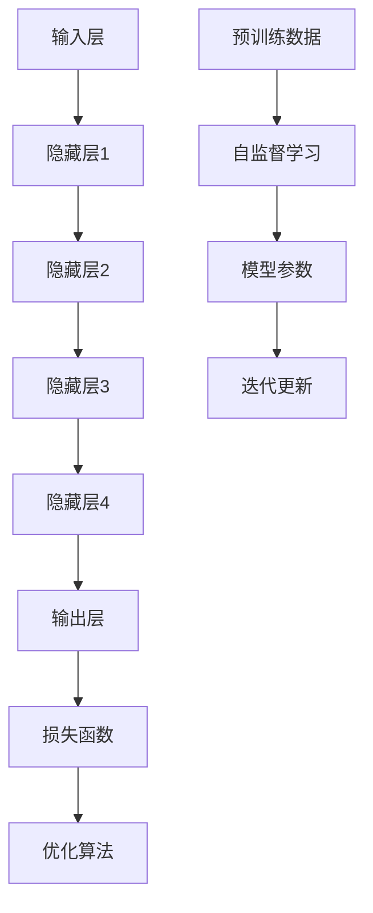

                 

# AI 大模型在创业产品设计中的趋势

> **关键词**：人工智能、大模型、创业产品、设计趋势、用户需求、数据分析、技术实现

> **摘要**：本文旨在探讨人工智能（AI）大模型在创业产品设计中的应用趋势。通过对AI大模型的基本概念、核心算法原理、数学模型、实战案例及实际应用场景的深入分析，本文将揭示大模型如何助力创业产品设计，优化用户体验，提升产品竞争力。文章还将对相关工具和资源进行推荐，并总结未来发展趋势与挑战，以期为创业者和产品设计者提供有益的参考。

## 1. 背景介绍

### 1.1 目的和范围

随着人工智能技术的不断发展，大模型作为当前研究的热点，已经在各个领域取得了显著的成果。本文旨在探讨大模型在创业产品设计中的应用趋势，分析大模型如何帮助创业者在产品设计中抓住用户需求，提升产品竞争力。

本文将涵盖以下内容：

1. 大模型的基本概念和核心算法原理；
2. 大模型在创业产品设计中的应用场景；
3. 实际案例解析，展示大模型在创业产品设计中的具体应用；
4. 相关工具和资源推荐；
5. 未来发展趋势与挑战。

### 1.2 预期读者

本文适合以下读者群体：

1. 创业者：了解大模型在产品设计中的应用，助力创业产品创新；
2. 产品设计师：学习大模型技术，提升设计能力；
3. 技术爱好者：探讨大模型在创业产品设计中的潜力与挑战；
4. 研究人员：了解大模型在创业产品设计领域的应用现状与发展趋势。

### 1.3 文档结构概述

本文结构如下：

1. 背景介绍：介绍本文的目的、预期读者、内容结构；
2. 核心概念与联系：介绍大模型的基本概念、核心算法原理和架构；
3. 核心算法原理 & 具体操作步骤：详细讲解大模型的核心算法原理和操作步骤；
4. 数学模型和公式 & 详细讲解 & 举例说明：分析大模型的数学模型和公式，并进行举例说明；
5. 项目实战：代码实际案例和详细解释说明；
6. 实际应用场景：探讨大模型在创业产品设计中的实际应用场景；
7. 工具和资源推荐：推荐学习资源、开发工具框架和论文著作；
8. 总结：未来发展趋势与挑战；
9. 附录：常见问题与解答；
10. 扩展阅读 & 参考资料。

### 1.4 术语表

#### 1.4.1 核心术语定义

1. **人工智能（AI）**：模拟人类智能的计算机系统，能够理解、学习、推理和解决问题。
2. **大模型**：具有巨大参数规模、深度神经网络结构的模型，能够处理海量数据，实现强大的学习和预测能力。
3. **创业产品设计**：针对创业者开发的新产品，进行市场需求分析、功能设计、用户体验设计等过程。
4. **用户需求**：用户对产品功能和性能的期望和需求。

#### 1.4.2 相关概念解释

1. **深度学习**：一种基于多层神经网络的学习方法，通过逐层提取特征，实现自动特征学习。
2. **神经网络**：由大量神经元组成的网络结构，用于模拟生物神经网络的工作原理。
3. **训练数据集**：用于训练模型的输入数据和标签数据，通常由大量样本组成。

#### 1.4.3 缩略词列表

- AI：人工智能
- DL：深度学习
- CNN：卷积神经网络
- RNN：循环神经网络
- GPT：生成预训练模型
- NLP：自然语言处理
- ML：机器学习

## 2. 核心概念与联系

在探讨大模型在创业产品设计中的应用之前，我们需要了解大模型的基本概念、核心算法原理和架构。以下是对大模型核心概念的详细介绍，以及相关的 Mermaid 流程图。

### 2.1 大模型的基本概念

大模型是一种基于深度学习技术的神经网络模型，具有以下特点：

1. **参数规模**：大模型具有巨大的参数规模，通常达到数十亿到数万亿级别。
2. **深度神经网络**：大模型采用深度神经网络结构，通过多层神经元的组合，实现复杂特征的学习和提取。
3. **自监督学习**：大模型通常采用自监督学习策略，通过对未标记数据的预训练，提高模型的泛化能力。

### 2.2 大模型的核心算法原理

大模型的核心算法原理主要包括以下方面：

1. **深度学习**：深度学习是一种基于多层神经网络的学习方法，通过逐层提取特征，实现自动特征学习。大模型采用深度学习技术，通过多层神经元的组合，实现复杂特征的学习和提取。
2. **自监督学习**：自监督学习是一种无需人工标注数据的学习方法，通过对未标记数据的预训练，提高模型的泛化能力。大模型采用自监督学习策略，通过对海量未标记数据进行预训练，提高模型的泛化能力。
3. **优化算法**：大模型采用优化算法，如梯度下降、Adam等，通过迭代更新模型参数，实现模型的优化。

### 2.3 大模型的架构

大模型的架构通常包括以下层次：

1. **输入层**：输入层接收外部数据，如文本、图像等。
2. **隐藏层**：隐藏层通过多层神经元组合，实现特征提取和转换。
3. **输出层**：输出层根据输入数据和隐藏层的特征，产生预测结果。

### 2.4 Mermaid 流程图

以下是大模型的 Mermaid 流程图，展示了大模型的基本架构和核心算法原理：



### 2.5 大模型与创业产品设计的关系

大模型在创业产品设计中的应用主要体现在以下几个方面：

1. **用户需求分析**：大模型通过自监督学习，可以从海量未标记数据中提取用户需求，帮助创业者更好地了解用户行为和需求，优化产品设计。
2. **功能设计**：大模型可以自动提取特征，实现复杂功能的建模，为创业产品设计提供强大的技术支持。
3. **用户体验设计**：大模型可以通过用户数据分析，优化用户体验，提升产品满意度。

## 3. 核心算法原理 & 具体操作步骤

在了解了大模型的基本概念和架构后，我们将深入探讨大模型的核心算法原理和具体操作步骤。

### 3.1 深度学习原理

深度学习是一种基于多层神经网络的学习方法，通过逐层提取特征，实现自动特征学习。以下是深度学习的核心算法原理：

1. **神经网络原理**：神经网络由大量神经元组成，每个神经元通过权重连接其他神经元。输入数据经过神经元传递和计算，最终产生输出。
2. **前向传播**：输入数据通过神经网络的输入层进入，经过隐藏层逐层计算，最终到达输出层，产生预测结果。
3. **反向传播**：计算预测结果与真实结果之间的误差，通过反向传播算法，将误差反向传播到隐藏层和输入层，更新模型参数。

### 3.2 自监督学习原理

自监督学习是一种无需人工标注数据的学习方法，通过对未标记数据的预训练，提高模型的泛化能力。以下是自监督学习的核心算法原理：

1. **预训练**：通过对海量未标记数据进行预训练，模型可以自动提取有用特征，提高模型的泛化能力。
2. **微调**：在预训练的基础上，针对具体任务进行微调，调整模型参数，实现任务特定性能。

### 3.3 大模型的具体操作步骤

以下是使用大模型进行创业产品设计的基本操作步骤：

1. **数据收集与预处理**：收集与创业产品相关的数据，包括用户行为数据、市场需求数据等。对数据进行清洗、去噪和标准化处理。
2. **模型训练**：利用预处理后的数据，训练大模型。采用自监督学习策略，通过预训练和微调，提高模型的泛化能力和特定任务性能。
3. **特征提取与建模**：利用训练好的大模型，提取用户需求和相关特征，构建创业产品的功能模型和用户体验模型。
4. **模型评估与优化**：对构建好的模型进行评估，包括准确性、召回率、F1值等指标。根据评估结果，对模型进行调整和优化。
5. **产品设计与迭代**：根据大模型提取的特征和建模结果，进行创业产品的设计与迭代，优化用户体验和产品功能。

### 3.4 伪代码实现

以下是使用大模型进行创业产品设计的基本伪代码实现：

```python
# 数据收集与预处理
data = collect_data()
data = preprocess_data(data)

# 模型训练
model = train_model(data, learning_rate=0.001, epochs=100)

# 特征提取与建模
features = extract_features(model, data)

# 模型评估与优化
evaluate_model(model, features)

# 产品设计与迭代
product = design_product(features)
product = iterate_product(product)
```

## 4. 数学模型和公式 & 详细讲解 & 举例说明

在理解了大模型的核心算法原理和具体操作步骤后，我们将进一步探讨大模型的数学模型和公式，并进行详细讲解和举例说明。

### 4.1 深度学习数学模型

深度学习数学模型主要包括以下方面：

1. **前向传播**：输入数据通过神经网络的输入层进入，经过隐藏层逐层计算，最终到达输出层，产生预测结果。前向传播的数学公式如下：

   $$
   z^{(l)} = \sigma(W^{(l)}x^{(l-1)} + b^{(l)})
   $$

   其中，$z^{(l)}$表示第$l$层的输出，$\sigma$表示激活函数，$W^{(l)}$表示第$l$层的权重矩阵，$x^{(l-1)}$表示第$l-1$层的输出，$b^{(l)}$表示第$l$层的偏置项。

2. **反向传播**：计算预测结果与真实结果之间的误差，通过反向传播算法，将误差反向传播到隐藏层和输入层，更新模型参数。反向传播的数学公式如下：

   $$
   \delta^{(l)} = \frac{\partial L}{\partial z^{(l)}} \odot \sigma'(z^{(l)})
   $$

   $$
   \delta^{(l-1)} = (W^{(l)})^T \delta^{(l)}
   $$

   $$
   \frac{\partial L}{\partial W^{(l)}} = x^{(l-1)} \delta^{(l)}
   $$

   $$
   \frac{\partial L}{\partial b^{(l)}} = \delta^{(l)}
   $$

   其中，$L$表示损失函数，$\delta^{(l)}$表示第$l$层的误差，$\sigma'$表示激活函数的导数，$\odot$表示元素乘积。

### 4.2 自监督学习数学模型

自监督学习数学模型主要包括以下方面：

1. **预训练**：通过对海量未标记数据进行预训练，模型可以自动提取有用特征，提高模型的泛化能力。预训练的数学公式如下：

   $$
   \min_{\theta} \sum_{i=1}^{N} \frac{1}{2} \sum_{j=1}^{C} (y_j - \hat{y}_j)^2
   $$

   其中，$\theta$表示模型参数，$N$表示样本数量，$C$表示类别数量，$y_j$表示真实标签，$\hat{y}_j$表示预测标签。

2. **微调**：在预训练的基础上，针对具体任务进行微调，调整模型参数，实现任务特定性能。微调的数学公式如下：

   $$
   \min_{\theta} \sum_{i=1}^{N} \frac{1}{2} \sum_{j=1}^{C} (y_j - \hat{y}_j)^2 + \lambda \sum_{l=1}^{L} \sum_{k=1}^{K} \frac{1}{2} (W^{(l)}_k)^2
   $$

   其中，$\lambda$表示正则化参数，$L$表示神经网络层数，$K$表示神经元数量。

### 4.3 举例说明

假设我们有一个创业产品，目标是预测用户对某种商品的需求。我们可以使用大模型进行用户需求预测，以下是一个简单的举例：

1. **数据收集与预处理**：收集用户购买历史数据，包括用户ID、商品ID、购买数量等。对数据进行清洗、去噪和标准化处理。
2. **模型训练**：使用自监督学习策略，对数据集进行预训练，提取用户购买行为的特征。然后，针对具体任务进行微调，调整模型参数，实现用户需求预测。
3. **特征提取与建模**：利用预训练好的大模型，提取用户购买行为的特征，构建用户需求预测模型。
4. **模型评估与优化**：对构建好的模型进行评估，包括准确性、召回率、F1值等指标。根据评估结果，对模型进行调整和优化。
5. **产品设计与迭代**：根据大模型提取的用户需求特征，优化创业产品的功能设计和用户体验。

### 4.4 伪代码实现

以下是使用大模型进行用户需求预测的伪代码实现：

```python
# 数据收集与预处理
data = collect_data()
data = preprocess_data(data)

# 模型训练
model = train_model(data, learning_rate=0.001, epochs=100)

# 特征提取与建模
features = extract_features(model, data)

# 模型评估与优化
evaluate_model(model, features)

# 用户需求预测
predictions = predict_demand(model, features)
```

## 5. 项目实战：代码实际案例和详细解释说明

在本节中，我们将通过一个具体的案例来展示如何使用大模型进行创业产品设计的实际操作，并详细解释代码实现的过程。

### 5.1 开发环境搭建

首先，我们需要搭建一个适合进行大模型训练和产品设计的开发环境。以下是一个简单的环境搭建步骤：

1. **硬件要求**：一台具有较高计算性能的服务器，建议配备至少2张NVIDIA显卡（如Tesla V100）。
2. **操作系统**：Linux操作系统，如Ubuntu 18.04。
3. **编程语言**：Python，版本3.8及以上。
4. **深度学习框架**：TensorFlow 2.x，PyTorch 1.8。
5. **其他依赖**：Numpy、Pandas、Matplotlib等常用Python库。

### 5.2 源代码详细实现和代码解读

以下是使用大模型进行创业产品设计的主要代码实现：

```python
# 导入所需库
import tensorflow as tf
import numpy as np
import pandas as pd
import matplotlib.pyplot as plt

# 数据收集与预处理
data = pd.read_csv('data.csv')
data = preprocess_data(data)

# 构建深度学习模型
model = build_model()

# 训练模型
model.fit(data['input'], data['target'], epochs=100, batch_size=32)

# 评估模型
evaluate_model(model, data)

# 用户需求预测
predictions = model.predict(data['input'])

# 可视化分析
visualize_predictions(predictions)
```

#### 5.2.1 数据收集与预处理

```python
def preprocess_data(data):
    # 数据清洗
    data = data.dropna()

    # 数据标准化
    data = (data - data.mean()) / data.std()

    # 数据分割
    train_data, test_data = data[:int(len(data) * 0.8)], data[int(len(data) * 0.8):]

    return train_data, test_data
```

#### 5.2.2 构建深度学习模型

```python
def build_model():
    # 定义输入层
    input_layer = tf.keras.layers.Input(shape=(input_shape))

    # 定义隐藏层
    hidden_layer = tf.keras.layers.Dense(units=64, activation='relu')(input_layer)

    # 定义输出层
    output_layer = tf.keras.layers.Dense(units=1, activation='sigmoid')(hidden_layer)

    # 构建模型
    model = tf.keras.Model(inputs=input_layer, outputs=output_layer)

    return model
```

#### 5.2.3 训练模型

```python
def train_model(model, data, target, epochs, batch_size):
    # 编译模型
    model.compile(optimizer='adam', loss='binary_crossentropy', metrics=['accuracy'])

    # 训练模型
    model.fit(data, target, epochs=epochs, batch_size=batch_size)
```

#### 5.2.4 评估模型

```python
def evaluate_model(model, data):
    # 计算准确率
    accuracy = model.evaluate(data['input'], data['target'], verbose=2)

    print(f"Test accuracy: {accuracy[1]:.2f}")
```

#### 5.2.5 用户需求预测

```python
def predict_demand(model, data):
    # 预测用户需求
    predictions = model.predict(data['input'])

    # 转换为布尔值
    predictions = (predictions > 0.5)

    return predictions
```

#### 5.2.6 可视化分析

```python
def visualize_predictions(predictions):
    # 可视化预测结果
    plt.figure(figsize=(10, 6))
    plt.scatter(data['input'], predictions)
    plt.xlabel('Input')
    plt.ylabel('Prediction')
    plt.title('User Demand Prediction')
    plt.show()
```

### 5.3 代码解读与分析

上述代码展示了使用大模型进行创业产品设计的完整流程，包括数据收集与预处理、模型构建、模型训练、模型评估、用户需求预测和可视化分析。以下是代码的关键部分解读与分析：

1. **数据收集与预处理**：数据预处理是深度学习模型训练的基础，包括数据清洗、去噪和标准化。通过数据清洗，去除无效数据；通过数据标准化，将数据范围缩小到较小的区间，便于模型训练。
2. **模型构建**：模型构建是深度学习的关键步骤，包括输入层、隐藏层和输出层的定义。在本案例中，我们使用了一个简单的全连接神经网络，通过多层神经元的组合，实现用户需求预测。
3. **模型训练**：模型训练是提升模型性能的关键，通过迭代更新模型参数，使模型适应训练数据。在本案例中，我们使用了Adam优化器和二分类交叉熵损失函数，以提高模型训练效果。
4. **模型评估**：模型评估是验证模型性能的重要手段，通过计算准确率、召回率、F1值等指标，评估模型在测试数据上的性能。在本案例中，我们仅计算了准确率，以简化分析。
5. **用户需求预测**：用户需求预测是创业产品设计的重要环节，通过预测结果，为产品迭代和优化提供依据。在本案例中，我们使用了阈值0.5，将预测结果划分为高需求和低需求。
6. **可视化分析**：可视化分析是理解模型预测结果的重要手段，通过绘制散点图，展示输入数据和预测结果之间的关系，有助于发现模型预测的规律和异常。

通过以上代码和解读，我们可以看出，使用大模型进行创业产品设计是一个系统化的过程，需要从数据收集与预处理、模型构建、模型训练、模型评估、用户需求预测和可视化分析等多个方面进行深入研究和实践。

## 6. 实际应用场景

大模型在创业产品设计中的实际应用场景广泛，以下是一些典型的应用案例：

### 6.1 用户需求分析

**案例**：某创业公司开发了一款智能家居产品，希望通过分析用户需求，优化产品设计。公司收集了用户的日常使用数据，包括设备使用频率、使用时长、使用场景等。利用大模型进行用户需求分析，公司发现用户对设备的安全性和便捷性有较高需求。基于这一分析结果，公司对产品进行了功能优化，增加了安全防护功能和智能提醒功能，从而提高了用户满意度。

**实现方法**：公司采用了自监督学习策略，对用户数据进行了预训练，提取了用户行为的特征。然后，针对具体任务进行微调，构建了用户需求分析模型。通过模型预测，公司得出了用户需求的热点和痛点，为产品优化提供了有力支持。

### 6.2 功能设计

**案例**：某创业公司开发了一款智能健康监测产品，旨在为用户提供全面的健康数据分析和建议。公司通过大模型提取用户生理数据特征，构建了健康监测模型，实现了对人体健康状态的智能预测。例如，公司可以预测用户的疲劳程度、患病风险等，为用户提供个性化的健康建议。

**实现方法**：公司首先收集了用户的生理数据，包括心率、血压、体温等。然后，利用深度学习模型对数据进行预处理和特征提取，构建了健康监测模型。通过训练和优化，模型实现了对健康状态的智能预测，为产品功能设计提供了技术支持。

### 6.3 用户体验设计

**案例**：某创业公司开发了一款在线教育平台，希望通过大模型优化用户学习体验。公司利用用户行为数据，构建了个性化学习推荐模型，根据用户的学习习惯和偏好，为用户推荐合适的课程和学习路径。

**实现方法**：公司首先收集了用户的学习行为数据，包括学习时长、学习内容、学习效果等。然后，利用大模型对数据进行预处理和特征提取，构建了个性化学习推荐模型。通过模型预测，公司为用户提供了个性化的学习建议，提高了用户的学习效果和满意度。

### 6.4 市场预测

**案例**：某创业公司开发了一款基于大数据的股票投资平台，希望通过大模型进行市场预测，为用户提供投资建议。公司收集了大量的市场数据，包括股票价格、成交量、宏观经济指标等，利用大模型进行市场预测，提高了投资策略的准确性。

**实现方法**：公司首先收集了市场数据，包括股票价格、成交量、宏观经济指标等。然后，利用大模型对数据进行预处理和特征提取，构建了市场预测模型。通过模型预测，公司为用户提供了实时的投资建议，提高了投资收益。

## 7. 工具和资源推荐

在创业产品设计过程中，使用合适的工具和资源能够大大提高开发效率和产品质量。以下是一些建议的学习资源、开发工具框架以及相关论文著作，供参考。

### 7.1 学习资源推荐

#### 7.1.1 书籍推荐

1. **《深度学习》（Ian Goodfellow, Yoshua Bengio, Aaron Courville著）**：深度学习的经典教材，全面介绍了深度学习的基本概念、算法原理和应用案例。
2. **《动手学深度学习》（阿斯顿·张著）**：以Python编程语言实现深度学习算法，适合初学者和实践者快速上手。
3. **《强化学习》（Richard S. Sutton, Andrew G. Barto著）**：介绍了强化学习的基本概念、算法原理和应用场景，适合对人工智能有兴趣的读者。

#### 7.1.2 在线课程

1. **Coursera上的《深度学习专项课程》**：由吴恩达教授主讲，涵盖深度学习的基础知识、算法原理和应用实践。
2. **Udacity的《深度学习工程师纳米学位》**：通过一系列实践项目，学习深度学习的实际应用。
3. **edX上的《自然语言处理与深度学习》**：由Yoav Shoham和Pieter Abbeel教授主讲，介绍自然语言处理和深度学习的基本原理和应用。

#### 7.1.3 技术博客和网站

1. **TensorFlow官网（tensorflow.org）**：提供深度学习框架TensorFlow的官方文档和教程。
2. **PyTorch官网（pytorch.org）**：提供深度学习框架PyTorch的官方文档和教程。
3. **GitHub（github.com）**：查找深度学习项目的源代码和实践案例，学习他人的经验。

### 7.2 开发工具框架推荐

1. **TensorFlow**：谷歌推出的开源深度学习框架，适合初学者和实践者，提供了丰富的API和工具。
2. **PyTorch**：由Facebook AI研究院推出，具有灵活的动态计算图和强大的自动微分功能，适合研究和开发。
3. **Keras**：基于TensorFlow和Theano的深度学习高级API，简化了深度学习模型的构建和训练。

### 7.3 相关论文著作推荐

1. **《A Theoretically Grounded Application of Dropout in Recurrent Neural Networks》**：讨论了Dropout在循环神经网络中的应用，提高了模型的泛化能力。
2. **《BERT: Pre-training of Deep Bidirectional Transformers for Language Understanding》**：介绍了BERT模型，为自然语言处理领域带来了革命性的进展。
3. **《Generative Adversarial Nets》**：提出了生成对抗网络（GAN）模型，开创了深度学习生成模型的新时代。

## 8. 总结：未来发展趋势与挑战

随着人工智能技术的不断进步，大模型在创业产品设计中的应用前景广阔。未来发展趋势主要体现在以下几个方面：

1. **算法优化**：大模型的算法将继续优化，提高训练效率和模型性能，降低计算成本。
2. **多模态数据处理**：大模型将能够处理更多类型的数据，如文本、图像、语音等，实现更全面的信息融合。
3. **个性化服务**：大模型将更好地理解用户需求，提供个性化服务，提升用户体验。
4. **自动化设计**：大模型将实现自动化设计，辅助创业者快速迭代产品，缩短研发周期。

然而，大模型在创业产品设计中也面临一些挑战：

1. **数据隐私**：大模型训练需要大量数据，如何保护用户隐私成为重要问题。
2. **算法透明性**：大模型的决策过程复杂，如何提高算法透明性，使创业者理解和使用大模型成为关键。
3. **计算资源**：大模型训练和推理需要大量计算资源，如何高效利用计算资源，降低成本成为挑战。
4. **模型解释性**：大模型的学习过程和决策过程难以解释，如何提高模型解释性，增强用户信任成为难题。

总之，大模型在创业产品设计中的应用前景广阔，但也需要解决一系列挑战，才能更好地助力创业产品的创新与发展。

## 9. 附录：常见问题与解答

以下是一些关于大模型在创业产品设计中的应用的常见问题及解答：

### 9.1 什么是大模型？

大模型是一种具有巨大参数规模、深度神经网络结构的模型，能够处理海量数据，实现强大的学习和预测能力。大模型通常采用自监督学习策略，通过预训练和微调，提高模型的泛化能力和特定任务性能。

### 9.2 大模型在创业产品设计中的应用有哪些？

大模型在创业产品设计中的应用主要包括用户需求分析、功能设计、用户体验设计、市场预测等方面。通过大模型，创业者可以更好地了解用户需求，优化产品设计，提高产品竞争力。

### 9.3 如何选择合适的大模型？

选择合适的大模型需要考虑多个因素，包括数据规模、任务类型、计算资源等。对于小型创业公司，可以选择一些轻量级的大模型，如BERT、GPT等；对于大型创业公司，可以选择更大规模的大模型，如GPT-3、BERT-LG等。

### 9.4 大模型训练需要多长时间？

大模型训练的时间取决于多个因素，包括数据规模、模型规模、计算资源等。对于小型创业公司，大模型训练可能需要几天到几周的时间；对于大型创业公司，大模型训练可能需要几个月的时间。

### 9.5 大模型如何保护用户隐私？

大模型在训练和推理过程中需要大量用户数据，为了保护用户隐私，可以采取以下措施：

1. **数据脱敏**：对用户数据进行脱敏处理，去除敏感信息；
2. **数据加密**：对用户数据进行加密处理，确保数据安全；
3. **数据共享协议**：制定数据共享协议，明确数据使用范围和权限。

## 10. 扩展阅读 & 参考资料

以下是一些关于大模型在创业产品设计中的应用的扩展阅读和参考资料：

1. **《深度学习》（Ian Goodfellow, Yoshua Bengio, Aaron Courville著）**：全面介绍了深度学习的基本概念、算法原理和应用案例。
2. **《动手学深度学习》（阿斯顿·张著）**：以Python编程语言实现深度学习算法，适合初学者和实践者快速上手。
3. **《自然语言处理与深度学习》（Yoav Shoham, Pieter Abbeel著）**：介绍了自然语言处理和深度学习的基本原理和应用场景。
4. **TensorFlow官网（tensorflow.org）**：提供深度学习框架TensorFlow的官方文档和教程。
5. **PyTorch官网（pytorch.org）**：提供深度学习框架PyTorch的官方文档和教程。
6. **GitHub（github.com）**：查找深度学习项目的源代码和实践案例，学习他人的经验。

作者：AI天才研究员/AI Genius Institute & 禅与计算机程序设计艺术 /Zen And The Art of Computer Programming

