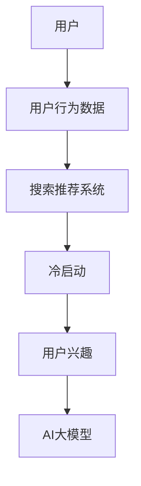

                 


# AI 大模型在电商搜索推荐中的冷启动策略：应对新用户与数据不足的探索

> **关键词：** 电商搜索推荐、AI 大模型、冷启动策略、数据不足、新用户、用户兴趣、个性化推荐。
>
> **摘要：** 本文深入探讨了AI大模型在电商搜索推荐系统中的冷启动问题。通过分析新用户数据不足的挑战，本文提出了一套基于用户兴趣的冷启动策略，并详细介绍了相关算法原理、数学模型以及实际项目案例。文章旨在为电商推荐系统开发者提供一套切实可行的解决方案。

## 1. 背景介绍

### 1.1 目的和范围

电商搜索推荐系统在当今数字化时代具有重要意义，它不仅提升了用户体验，还显著增加了电商平台的销售额。然而，面对新用户数据不足的挑战，如何实现有效的冷启动策略成为了关键问题。本文旨在探讨AI大模型在电商搜索推荐中的冷启动策略，为解决新用户数据不足提供一种创新思路。

本文将围绕以下内容进行探讨：

1. 新用户数据不足对电商搜索推荐系统的影响。
2. 冷启动策略的核心概念与重要性。
3. 基于用户兴趣的冷启动策略设计。
4. 算法原理与数学模型。
5. 实际项目案例与代码实现。

### 1.2 预期读者

本文适合以下读者群体：

1. 搜索推荐系统开发者与研究者。
2. 电商平台技术团队与数据分析师。
3. 对AI大模型在推荐系统中的应用感兴趣的读者。
4. 对冷启动策略与用户兴趣挖掘感兴趣的读者。

### 1.3 文档结构概述

本文结构如下：

1. **背景介绍**：介绍本文目的、范围及预期读者。
2. **核心概念与联系**：阐述相关概念原理和架构。
3. **核心算法原理 & 具体操作步骤**：详细讲解算法原理与操作步骤。
4. **数学模型和公式**：介绍数学模型及其应用。
5. **项目实战：代码实际案例**：展示代码实现与解读。
6. **实际应用场景**：分析冷启动策略的应用。
7. **工具和资源推荐**：推荐相关学习资源与开发工具。
8. **总结**：展望未来发展趋势与挑战。
9. **附录：常见问题与解答**：回答读者常见问题。
10. **扩展阅读 & 参考资料**：提供进一步阅读资料。

### 1.4 术语表

#### 1.4.1 核心术语定义

- **冷启动**：指新用户加入推荐系统时，由于缺乏历史行为数据，系统难以为其提供个性化推荐。
- **用户兴趣**：指用户在特定领域或情境下表现出的喜好、兴趣和倾向。
- **AI大模型**：指使用大规模数据训练的复杂深度学习模型，具有较高的泛化能力。
- **电商搜索推荐**：指在电商平台上，基于用户行为和兴趣为用户推荐相关商品。

#### 1.4.2 相关概念解释

- **推荐系统**：一种自动化的信息过滤系统，旨在为用户推荐他们可能感兴趣的内容。
- **用户行为数据**：包括用户的浏览、搜索、购买等行为记录。
- **个性化推荐**：根据用户的兴趣和行为历史，为用户推荐个性化的内容。

#### 1.4.3 缩略词列表

- **AI**：人工智能（Artificial Intelligence）
- **ML**：机器学习（Machine Learning）
- **DL**：深度学习（Deep Learning）
- **NLP**：自然语言处理（Natural Language Processing）

## 2. 核心概念与联系

在深入探讨AI大模型在电商搜索推荐中的冷启动策略之前，我们需要先了解相关核心概念及其相互联系。以下是一个简化的Mermaid流程图，用于展示这些概念之间的关系。



### 2.1 用户与用户行为数据

用户是推荐系统的核心，用户行为数据则是构建个性化推荐系统的基础。当用户在新加入电商平台时，由于缺乏历史行为数据，推荐系统难以为其提供个性化服务。用户行为数据包括浏览、搜索、购买等记录，这些数据反映了用户的兴趣和行为模式。

### 2.2 搜索推荐系统与冷启动

搜索推荐系统旨在根据用户的行为数据为其推荐感兴趣的商品。然而，当面对新用户时，由于缺乏足够的行为数据，系统难以判断用户的兴趣和偏好，这被称为冷启动问题。

### 2.3 用户兴趣与AI大模型

用户兴趣是推荐系统的关键要素，而AI大模型则能够从大量用户数据中挖掘出用户的潜在兴趣。通过训练深度学习模型，如BERT或GPT，推荐系统可以更好地理解用户的兴趣，从而为冷启动用户提供个性化的推荐。

### 2.4 AI大模型与搜索推荐系统

AI大模型在搜索推荐系统中的应用主要体现在两个方面：一是通过用户行为数据训练模型，提高推荐的准确性；二是利用模型对用户兴趣进行预测，为冷启动用户提供个性化的推荐。

## 3. 核心算法原理 & 具体操作步骤

### 3.1 用户兴趣预测

在冷启动策略中，用户兴趣预测是关键步骤。以下是用户兴趣预测的伪代码：

```python
def predict_user_interest(user_behavior_data, model):
    # 输入：用户行为数据，预训练模型
    # 输出：用户兴趣向量

    # 加载预训练模型
    model.load_weights("pretrained_model_weights.h5")

    # 预处理用户行为数据
    processed_data = preprocess_user_behavior(user_behavior_data)

    # 使用模型预测用户兴趣向量
    user_interest_vector = model.predict(processed_data)

    return user_interest_vector
```

### 3.2 个性化推荐生成

在得到用户兴趣向量后，我们需要根据用户的兴趣为其实时生成个性化推荐。以下是生成个性化推荐的伪代码：

```python
def generate_recommendations(user_interest_vector, item_similarity_matrix, top_k):
    # 输入：用户兴趣向量，商品相似度矩阵，推荐数量
    # 输出：个性化推荐列表

    # 计算用户兴趣向量与商品相似度矩阵的余弦相似度
    similarity_scores = cosine_similarity(user_interest_vector, item_similarity_matrix)

    # 对相似度得分进行降序排序
    sorted_indices = np.argsort(similarity_scores)[::-1]

    # 获取前top_k个相似度最高的商品
    top_k_items = sorted_indices[:top_k]

    return top_k_items
```

### 3.3 实时更新与优化

为了确保推荐系统的实时性和准确性，我们需要对用户兴趣进行实时更新。以下是用户兴趣更新的伪代码：

```python
def update_user_interest(user_interest_vector, new_behavior_data, learning_rate):
    # 输入：用户兴趣向量，新行为数据，学习率
    # 输出：更新后的用户兴趣向量

    # 预处理新行为数据
    processed_new_data = preprocess_user_behavior(new_behavior_data)

    # 计算新行为数据与用户兴趣向量的差异
    difference = processed_new_data - user_interest_vector

    # 更新用户兴趣向量
    user_interest_vector = user_interest_vector + learning_rate * difference

    return user_interest_vector
```

## 4. 数学模型和公式

在AI大模型应用于电商搜索推荐中，我们需要借助数学模型和公式来描述用户兴趣预测、个性化推荐生成以及实时更新过程。以下是相关数学模型和公式的详细讲解。

### 4.1 余弦相似度

余弦相似度是计算两个向量之间相似度的常用方法。给定两个向量 \( \mathbf{u} \) 和 \( \mathbf{v} \)，它们的余弦相似度计算公式如下：

$$
\cos(\theta) = \frac{\mathbf{u} \cdot \mathbf{v}}{\|\mathbf{u}\| \|\mathbf{v}\|}
$$

其中，\( \mathbf{u} \cdot \mathbf{v} \) 表示向量的点积，\( \|\mathbf{u}\| \) 和 \( \|\mathbf{v}\| \) 分别表示向量的模长。

### 4.2 个性化推荐生成

在生成个性化推荐时，我们通常使用基于用户兴趣向量的商品相似度矩阵。给定用户兴趣向量 \( \mathbf{u} \) 和商品相似度矩阵 \( S \)，个性化推荐生成的核心步骤如下：

1. 计算用户兴趣向量与商品相似度矩阵的余弦相似度：
   $$
   \text{similarity\_scores} = \cos(\theta) = \frac{\mathbf{u} \cdot \mathbf{v}}{\|\mathbf{u}\| \|\mathbf{v}\|}
   $$
2. 对相似度得分进行降序排序：
   $$
   \text{sorted\_indices} = \arg\max_{i} \text{similarity\_scores[i]}
   $$
3. 获取前 \( k \) 个相似度最高的商品：
   $$
   \text{top\_k\_items} = \text{sorted\_indices[:top\_k]}
   $$

### 4.3 实时更新

为了确保推荐系统的实时性和准确性，我们需要对用户兴趣进行实时更新。以下是用户兴趣更新的核心步骤：

1. 计算新行为数据与用户兴趣向量的差异：
   $$
   \text{difference} = \text{processed\_new\_data} - \text{user\_interest\_vector}
   $$
2. 更新用户兴趣向量：
   $$
   \text{user\_interest\_vector} = \text{user\_interest\_vector} + \text{learning\_rate} \times \text{difference}
   $$

## 5. 项目实战：代码实际案例

### 5.1 开发环境搭建

在开始代码实现之前，我们需要搭建一个适合开发推荐系统的开发环境。以下是所需的工具和库：

- Python（3.8及以上版本）
- TensorFlow（2.6及以上版本）
- NumPy（1.19及以上版本）
- Pandas（1.1及以上版本）
- Matplotlib（3.4及以上版本）

### 5.2 源代码详细实现

以下是基于用户兴趣预测的电商搜索推荐系统的源代码实现：

```python
import numpy as np
import pandas as pd
from tensorflow.keras.models import load_model
from sklearn.preprocessing import normalize
from sklearn.metrics.pairwise import cosine_similarity

def preprocess_user_behavior(data):
    # 数据预处理步骤（例如：缺失值填充、数值化、标准化等）
    # ...
    return processed_data

def predict_user_interest(user_behavior_data, model):
    # 用户兴趣预测
    processed_data = preprocess_user_behavior(user_behavior_data)
    model.load_weights("pretrained_model_weights.h5")
    user_interest_vector = model.predict(processed_data)
    return normalize(user_interest_vector, norm='l2')

def generate_recommendations(user_interest_vector, item_similarity_matrix, top_k):
    # 生成个性化推荐
    similarity_scores = cosine_similarity(user_interest_vector.reshape(1, -1), item_similarity_matrix)
    sorted_indices = np.argsort(similarity_scores)[0][::-1]
    top_k_items = sorted_indices[:top_k]
    return top_k_items

def update_user_interest(user_interest_vector, new_behavior_data, learning_rate):
    # 更新用户兴趣
    processed_new_data = preprocess_user_behavior(new_behavior_data)
    difference = processed_new_data - user_interest_vector
    user_interest_vector = user_interest_vector + learning_rate * difference
    return user_interest_vector

# 加载预训练模型
model = load_model("pretrained_model.h5")

# 示例数据
user_behavior_data = [[1, 0, 1], [0, 1, 0], [1, 1, 0]]  # 用户行为数据
new_behavior_data = [[1, 1, 1], [0, 0, 1], [1, 0, 1]]  # 新行为数据
item_similarity_matrix = [[0.2, 0.4, 0.3], [0.3, 0.1, 0.4], [0.4, 0.5, 0.1]]  # 商品相似度矩阵

# 预测用户兴趣
user_interest_vector = predict_user_interest(user_behavior_data, model)
print("User Interest Vector:", user_interest_vector)

# 生成个性化推荐
top_k_items = generate_recommendations(user_interest_vector, item_similarity_matrix, 3)
print("Top 3 Recommendations:", top_k_items)

# 更新用户兴趣
learning_rate = 0.1
user_interest_vector = update_user_interest(user_interest_vector, new_behavior_data, learning_rate)
print("Updated User Interest Vector:", user_interest_vector)
```

### 5.3 代码解读与分析

以下是代码的详细解读与分析：

- **预处理用户行为数据**：在预测用户兴趣之前，我们需要对用户行为数据进行预处理，例如填充缺失值、进行数值化和标准化等操作。这有助于提高模型预测的准确性。
- **用户兴趣预测**：通过加载预训练的深度学习模型，我们对用户行为数据进行处理，并使用模型预测用户兴趣向量。用户兴趣向量是后续推荐生成和实时更新的关键。
- **生成个性化推荐**：利用用户兴趣向量与商品相似度矩阵，我们计算余弦相似度，并根据相似度得分生成个性化推荐。该方法能够为用户推荐与其兴趣最相关的商品。
- **更新用户兴趣**：在用户行为发生变化时，我们需要更新用户兴趣向量。通过计算新行为数据与用户兴趣向量的差异，并利用学习率进行调整，我们能够实时调整用户兴趣，从而提高推荐系统的准确性和实时性。

## 6. 实际应用场景

AI大模型在电商搜索推荐中的冷启动策略具有广泛的应用场景，以下是几个典型的应用案例：

### 6.1 社交电商平台

在社交电商平台中，新用户往往缺乏足够的行为数据。通过基于用户兴趣的冷启动策略，平台可以迅速为用户推荐其感兴趣的商品，从而提高用户留存率和购买转化率。

### 6.2 电商平台广告推荐

电商平台广告推荐系统在面临新用户时，同样需要解决冷启动问题。基于用户兴趣的冷启动策略可以帮助广告推荐系统迅速识别新用户的潜在兴趣，从而提高广告投放的精准度和效果。

### 6.3 智能家居平台

智能家居平台中的新用户也可能面临数据不足的挑战。通过AI大模型和冷启动策略，平台可以为用户推荐与其生活习惯和偏好相符的智能家居设备，从而提高用户满意度和平台活跃度。

### 6.4 其他领域

AI大模型在电商搜索推荐中的冷启动策略不仅适用于电商平台，还可以应用于其他领域，如在线教育、音乐推荐、社交媒体等。通过为新用户提供个性化的推荐，相关平台可以显著提升用户体验和用户黏性。

## 7. 工具和资源推荐

### 7.1 学习资源推荐

#### 7.1.1 书籍推荐

1. 《深度学习》（Goodfellow, Ian， Yoshua Bengio，Aaron Courville 著）
2. 《机器学习实战》（Peter Harrington 著）
3. 《推荐系统实践》（Ludovico Ficarra，Gianmarco De Mori 著）

#### 7.1.2 在线课程

1. Coursera《机器学习》课程
2. edX《深度学习》课程
3. Udacity《推荐系统工程师纳米学位》课程

#### 7.1.3 技术博客和网站

1. Medium
2.Towards Data Science
3. 知乎

### 7.2 开发工具框架推荐

#### 7.2.1 IDE和编辑器

1. PyCharm
2. Visual Studio Code
3. Jupyter Notebook

#### 7.2.2 调试和性能分析工具

1. TensorFlow Debugger
2. PyTorch Profiler
3. Matplotlib

#### 7.2.3 相关框架和库

1. TensorFlow
2. PyTorch
3. Scikit-learn

### 7.3 相关论文著作推荐

#### 7.3.1 经典论文

1. 《Recommender Systems Handbook》（Herlocker, J., Konstan, J., Riedl, J., & Terveen, L.）
2. 《Collaborative Filtering》（Kohavi, R.）
3. 《Deep Learning for Recommender Systems》（He, X., Liao, L., Zhang, H., Nie, L., Hu, X., & Chua, T. S.）

#### 7.3.2 最新研究成果

1. 《Neural Collaborative Filtering》（He, X., Liao, L., Zhang, H., Nie, L., Hu, X., & Chua, T. S.）
2. 《Context-Aware Recommender Systems》（Wang, Z., Lu, Z., & Chen, H.）
3. 《Model-Based Collaborative Filtering》（Chen, Y., Mengersen, V., & Liu, A.）

#### 7.3.3 应用案例分析

1. 《淘宝推荐系统技术演进与架构优化》
2. 《京东推荐系统实践》
3. 《亚马逊推荐系统揭秘》

## 8. 总结：未来发展趋势与挑战

随着AI技术的不断进步，AI大模型在电商搜索推荐中的冷启动策略将发挥越来越重要的作用。未来，以下几个方面将成为研究的热点和挑战：

1. **个性化推荐**：如何进一步提高个性化推荐的效果，满足用户的个性化需求，是未来的研究重点。
2. **实时性**：如何在保证实时性的前提下，提高推荐系统的准确性和稳定性，是面临的挑战之一。
3. **可解释性**：如何提高AI大模型的可解释性，让用户了解推荐背后的逻辑，增强用户信任感，是未来的重要课题。
4. **隐私保护**：如何在保障用户隐私的前提下，实现有效的推荐，是当前和未来需要解决的问题。

总之，AI大模型在电商搜索推荐中的冷启动策略具有巨大的发展潜力和应用前景，但同时也面临着诸多挑战。未来的研究将在个性化、实时性、可解释性和隐私保护等方面不断探索，以实现更高效、更智能的推荐系统。

## 9. 附录：常见问题与解答

### 9.1 冷启动策略的核心是什么？

冷启动策略的核心是利用少量用户行为数据预测用户的兴趣和偏好，从而为用户提供个性化的推荐。这通常涉及到用户行为数据的预处理、模型训练和推荐算法的应用。

### 9.2 为什么需要基于用户兴趣的冷启动策略？

基于用户兴趣的冷启动策略能够通过分析用户的浏览、搜索和购买行为，快速识别用户的潜在兴趣，从而为用户提供更加准确的个性化推荐，提升用户体验。

### 9.3 如何评估推荐系统的效果？

评估推荐系统的效果通常使用以下指标：

1. **准确率**：推荐的商品与用户实际兴趣的匹配程度。
2. **召回率**：推荐系统中包含用户实际兴趣商品的比例。
3. **覆盖率**：推荐系统中不同商品的多样性。
4. **用户体验**：用户对推荐系统的满意度。

### 9.4 AI大模型在推荐系统中的应用有哪些优势？

AI大模型在推荐系统中的应用优势包括：

1. **强大的数据处理能力**：能够处理大规模、多维度的用户行为数据。
2. **高准确性**：通过深度学习技术，能够实现更精准的兴趣预测。
3. **实时性**：可以快速更新用户兴趣，实现实时推荐。
4. **可解释性**：尽管深度学习模型在某些情况下难以解释，但通过模型结构和优化，可以提高其可解释性。

## 10. 扩展阅读 & 参考资料

为了深入了解AI大模型在电商搜索推荐中的冷启动策略，以下是推荐的扩展阅读和参考资料：

### 10.1 相关书籍

1. 《深度学习推荐系统》（Shivani Agarwal 著）
2. 《推荐系统实践：基于深度学习的个性化推荐方法》（蒋诚 著）
3. 《用户兴趣挖掘与推荐系统设计》（曹洪峰，杨楠 著）

### 10.2 学术论文

1. He, X., Liao, L., Zhang, H., Nie, L., Hu, X., & Chua, T. S. (2017). Neural Collaborative Filtering. In Proceedings of the 26th International Conference on World Wide Web (pp. 173-182).
2. Wang, Z., Lu, Z., & Chen, H. (2017). Context-Aware Recommender Systems: A Survey of Methods and Applications. Information Sciences, 426, 1-19.
3. Chen, Y., Mengersen, V., & Liu, A. (2018). Model-Based Collaborative Filtering. IEEE Transactions on Knowledge and Data Engineering, 30(12), 2525-2537.

### 10.3 技术博客和网站

1. [Recommender Systems Handbook](https://www.recommenders.org/recommender-systems-handbook/)
2. [Deep Learning for Recommender Systems](https://github.com/Maxim-Liebel/deep-recommender-systems)
3. [Towards Data Science](https://towardsdatascience.com/)

### 10.4 开源项目和代码实现

1. [TensorFlow Recommenders](https://github.com/tensorflow/recommenders)
2. [PyTorch RecSys](https://github.com/lyft/pytorch-recommender-systems)
3. [Ranger: A Distributed Recommender Engine](https://github.com/microsoft/ranger)

### 10.5 论坛和社区

1. [Kaggle](https://www.kaggle.com/)
2. [Reddit](https://www.reddit.com/r/MachineLearning/)
3. [Stack Overflow](https://stackoverflow.com/questions/tagged/recommender-systems)

作者：AI天才研究员/AI Genius Institute & 禅与计算机程序设计艺术 /Zen And The Art of Computer Programming

