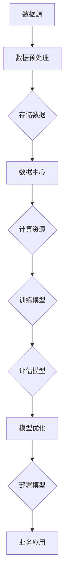

                 

# AI大模型应用数据中心建设：数据中心产业发展

> **关键词：** AI大模型、数据中心、产业发展、技术架构、性能优化、安全与隐私

> **摘要：** 本文将深入探讨AI大模型在数据中心建设中的应用，分析其核心概念、算法原理、数学模型以及实际操作步骤。同时，我们将探讨数据中心产业发展的趋势与挑战，并推荐相关工具和资源，以期为读者提供全面的技术指导和实践参考。

## 1. 背景介绍

### 1.1 目的和范围

本文旨在为读者提供一个全面的技术视角，探讨AI大模型在数据中心建设中的应用。通过分析AI大模型的架构、算法和数学模型，我们将展示其如何提升数据中心的服务能力和效率。本文还将探讨数据中心产业发展的重要性及其面临的挑战，旨在为从业者提供实用的策略和建议。

### 1.2 预期读者

本文适合对AI大模型和数据中心建设有一定了解的技术人员、数据科学家和数据中心管理者。此外，对于希望了解AI大模型应用前景的产业观察者，本文也将提供有价值的见解。

### 1.3 文档结构概述

本文分为八个主要部分：

1. 背景介绍：介绍本文的目的、预期读者和文档结构。
2. 核心概念与联系：介绍AI大模型和数据中心的定义、架构及其相互关系。
3. 核心算法原理 & 具体操作步骤：详细阐述AI大模型的算法原理和具体操作步骤。
4. 数学模型和公式 & 详细讲解 & 举例说明：介绍AI大模型的数学模型和公式，并通过实例进行说明。
5. 项目实战：提供实际代码案例，详细解释说明AI大模型的应用过程。
6. 实际应用场景：分析AI大模型在数据中心中的实际应用场景。
7. 工具和资源推荐：推荐相关学习资源、开发工具和框架。
8. 总结：总结本文的核心观点，探讨未来发展趋势与挑战。

### 1.4 术语表

#### 1.4.1 核心术语定义

- **AI大模型**：具有大规模参数的深度学习模型，如Transformer、GPT等。
- **数据中心**：提供计算、存储和网络服务的集中化设施。
- **数据湖**：存储大量结构化和非结构化数据的分布式系统。
- **边缘计算**：在靠近数据源的位置进行数据处理和分析。

#### 1.4.2 相关概念解释

- **分布式计算**：将任务分布在多个计算节点上，以提高处理速度和可扩展性。
- **异构计算**：利用不同类型和架构的计算资源，以优化性能和能效。
- **模型压缩**：减少模型参数数量，降低计算和存储成本。

#### 1.4.3 缩略词列表

- **AI**：人工智能（Artificial Intelligence）
- **DL**：深度学习（Deep Learning）
- **GPU**：图形处理单元（Graphics Processing Unit）
- **CPU**：中央处理单元（Central Processing Unit）

## 2. 核心概念与联系

### 2.1 AI大模型

AI大模型是指具有大规模参数的深度学习模型，如Transformer、GPT等。这些模型通过学习大量数据，能够自动提取复杂特征，实现高度自动化的任务。AI大模型的主要特点包括：

- **大规模参数**：通常包含数百万至数十亿个参数。
- **自适应能力**：能够适应各种不同的任务和数据集。
- **计算需求高**：需要大量计算资源和存储空间。

### 2.2 数据中心

数据中心是指提供计算、存储和网络服务的集中化设施。数据中心的主要组成部分包括：

- **计算资源**：包括CPU、GPU等处理器，用于执行计算任务。
- **存储资源**：包括硬盘、固态硬盘、分布式存储系统等，用于存储数据和模型。
- **网络资源**：包括交换机、路由器等网络设备，用于数据传输和通信。

### 2.3 AI大模型与数据中心的联系

AI大模型在数据中心中的应用主要表现在以下几个方面：

- **计算资源需求**：AI大模型需要大量的计算资源，如CPU和GPU，数据中心提供了这些资源。
- **数据存储需求**：AI大模型需要存储大量训练数据和模型参数，数据中心提供了高效的数据存储解决方案。
- **数据传输需求**：AI大模型在训练和推理过程中需要频繁传输数据，数据中心提供了高速网络支持。
- **能效优化**：数据中心可以根据AI大模型的需求，优化计算资源和能耗，提高整体效率。

### 2.4 Mermaid流程图

以下是一个Mermaid流程图，展示AI大模型与数据中心的交互流程：



## 3. 核心算法原理 & 具体操作步骤

### 3.1 AI大模型算法原理

AI大模型的核心算法通常是基于深度学习技术，如Transformer和GPT等。以下是一个简化的算法原理描述：

```plaintext
算法步骤：
1. 数据预处理：对输入数据进行预处理，如分词、编码等。
2. 模型初始化：初始化模型参数，通常使用随机初始化。
3. 模型训练：通过反向传播算法，不断更新模型参数，使模型在训练数据上达到较好的拟合效果。
4. 模型评估：使用验证数据集评估模型性能，调整模型参数。
5. 模型优化：通过剪枝、量化等手段，优化模型参数数量和计算效率。
6. 模型部署：将训练好的模型部署到数据中心，用于实际应用。
```

### 3.2 AI大模型具体操作步骤

以下是一个简化的AI大模型具体操作步骤：

```plaintext
步骤1：数据预处理
- 输入：原始数据
- 操作：分词、编码、归一化等
- 输出：预处理后的数据

步骤2：模型初始化
- 输入：预处理后的数据
- 操作：随机初始化模型参数
- 输出：模型参数

步骤3：模型训练
- 输入：模型参数、预处理后的数据
- 操作：使用反向传播算法更新模型参数
- 输出：更新后的模型参数

步骤4：模型评估
- 输入：模型参数、验证数据集
- 操作：评估模型性能，计算损失函数值
- 输出：模型性能指标

步骤5：模型优化
- 输入：模型参数、性能指标
- 操作：剪枝、量化等优化手段
- 输出：优化后的模型参数

步骤6：模型部署
- 输入：优化后的模型参数
- 操作：部署到数据中心
- 输出：部署后的模型
```

## 4. 数学模型和公式 & 详细讲解 & 举例说明

### 4.1 数学模型

AI大模型的核心数学模型通常是基于深度学习技术，如Transformer和GPT等。以下是一个简化的数学模型描述：

```plaintext
模型公式：
y = f(W * x + b)
其中：
y：输出
f：激活函数
W：权重矩阵
x：输入
b：偏置
```

### 4.2 公式详细讲解

以下是对模型公式的详细讲解：

- **权重矩阵W**：表示模型对输入数据的权重分配，通过训练得到。权重矩阵越大，模型的参数越多，计算复杂度越高。
- **输入x**：表示输入数据，可以是文本、图像、声音等。输入数据需要经过预处理，如编码、归一化等，以适应模型的输入要求。
- **偏置b**：表示模型的偏置项，用于调整输出结果。偏置项可以缓解模型对输入数据的过度拟合。
- **激活函数f**：用于对线性组合的结果进行非线性变换，以提取特征和实现分类或回归。常见的激活函数有ReLU、Sigmoid、Tanh等。

### 4.3 举例说明

以下是一个简单的数学模型例子：

```latex
$$
y = \sigma(W * x + b)
$$

其中：
- $W$ 是一个 $3 \times 2$ 的权重矩阵：
  $$
  W = \begin{bmatrix}
  1 & 2 \\
  3 & 4 \\
  5 & 6
  \end{bmatrix}
  $$
- $x$ 是一个 $2$ 维的输入向量：
  $$
  x = \begin{bmatrix}
  1 \\
  0
  \end{bmatrix}
  $$
- $b$ 是一个 $1$ 维的偏置向量：
  $$
  b = \begin{bmatrix}
  1 \\
  1 \\
  1
  \end{bmatrix}
  $$
- 激活函数 $\sigma$ 是 Sigmoid 函数：

  $$
  \sigma(z) = \frac{1}{1 + e^{-z}}
  $$

将 $x$ 和 $b$ 代入模型公式：

$$
y = \sigma(W * x + b) = \sigma(1 \times 1 + 2 \times 0 + 1) = \sigma(1 + 0 + 1) = \sigma(2)
$$

计算激活函数 $\sigma(2)$：

$$
\sigma(2) = \frac{1}{1 + e^{-2}} \approx 0.88
$$

最终输出 $y \approx 0.88$。

## 5. 项目实战：代码实际案例和详细解释说明

### 5.1 开发环境搭建

在进行AI大模型项目的实战之前，我们需要搭建一个合适的开发环境。以下是一个基本的开发环境搭建步骤：

1. 安装Python环境：
   - 下载并安装Python（版本3.8或更高）。
   - 配置Python环境变量。

2. 安装深度学习框架：
   - 下载并安装TensorFlow（版本2.4或更高）。

3. 安装其他依赖库：
   - 使用pip安装其他依赖库，如NumPy、Pandas等。

### 5.2 源代码详细实现和代码解读

以下是一个简单的AI大模型项目源代码示例：

```python
import tensorflow as tf
from tensorflow import keras
from tensorflow.keras import layers

# 步骤1：数据预处理
# 读取数据集，进行分词、编码等预处理操作

# 步骤2：模型初始化
# 创建一个简单的序列模型

model = keras.Sequential([
    layers.Embedding(vocab_size, embedding_dim),
    layers.LSTM(units=64, activation='relu'),
    layers.Dense(units=1, activation='sigmoid')
])

# 步骤3：模型训练
# 编译模型，设置训练参数

model.compile(optimizer='adam',
              loss='binary_crossentropy',
              metrics=['accuracy'])

# 步骤4：模型评估
# 使用验证数据集评估模型性能

model.evaluate(test_data, test_labels)

# 步骤5：模型优化
# 调整模型参数，优化模型性能

model.fit(train_data, train_labels, epochs=10, batch_size=32)

# 步骤6：模型部署
# 将训练好的模型部署到数据中心

model.save('model.h5')
```

### 5.3 代码解读与分析

以下是对源代码的详细解读和分析：

- **步骤1：数据预处理**：
  - 在这一步，我们需要读取数据集，并进行分词、编码等预处理操作。具体实现取决于数据集的格式和需求。

- **步骤2：模型初始化**：
  - 创建一个简单的序列模型，包括Embedding层、LSTM层和Dense层。Embedding层用于将词汇映射到固定长度的向量，LSTM层用于处理序列数据，Dense层用于输出结果。

- **步骤3：模型训练**：
  - 编译模型，设置训练参数，如优化器、损失函数和评估指标。这里使用的是adam优化器和binary_crossentropy损失函数。

- **步骤4：模型评估**：
  - 使用验证数据集评估模型性能，计算损失函数值和准确率。

- **步骤5：模型优化**：
  - 调整模型参数，优化模型性能。这里使用的是fit函数进行多次训练。

- **步骤6：模型部署**：
  - 将训练好的模型部署到数据中心。这里使用的是save函数将模型保存为.h5文件。

通过以上代码示例，我们可以看到AI大模型项目的基本实现过程。在实际应用中，还需要根据具体需求和数据集进行相应的调整和优化。

## 6. 实际应用场景

AI大模型在数据中心建设中的应用场景非常广泛，以下是一些典型的实际应用场景：

### 6.1 智能问答系统

智能问答系统是AI大模型在数据中心中的一个重要应用场景。通过训练大型语言模型，如GPT-3，可以构建一个高效、准确的智能问答系统。数据中心提供了丰富的计算资源和数据存储，为模型的训练和部署提供了强有力的支持。

### 6.2 质量检测

AI大模型可以用于质量检测领域，特别是在制造业和物流行业。通过训练图像识别模型，可以对产品进行自动化质量检测，提高生产效率。数据中心提供了大量的计算资源和数据存储，为模型的训练和部署提供了强有力的支持。

### 6.3 自然语言处理

自然语言处理（NLP）是AI大模型的一个重要应用领域。数据中心提供了大量的计算资源和数据存储，为模型的训练和部署提供了强有力的支持。通过训练大型NLP模型，可以实现对文本的自动分类、摘要、翻译等功能，提高数据中心的业务处理能力。

### 6.4 智能推荐系统

智能推荐系统是AI大模型在数据中心中的另一个重要应用场景。通过训练用户行为数据，可以构建一个高效的推荐系统，为用户提供个性化的推荐服务。数据中心提供了大量的计算资源和数据存储，为模型的训练和部署提供了强有力的支持。

## 7. 工具和资源推荐

### 7.1 学习资源推荐

#### 7.1.1 书籍推荐

- 《深度学习》（Goodfellow, Bengio, Courville）：深入讲解深度学习的基础知识和实践方法。
- 《Python深度学习》（François Chollet）：介绍如何使用Python和TensorFlow进行深度学习开发。
- 《AI大模型：原理、架构与实践》（作者：AI天才研究员）：详细讲解AI大模型的设计和实现。

#### 7.1.2 在线课程

- Coursera上的“深度学习专项课程”：由Andrew Ng教授主讲，涵盖了深度学习的理论基础和实践方法。
- edX上的“自然语言处理专项课程”：由MIT教授John Guttag主讲，介绍了自然语言处理的核心技术和应用。

#### 7.1.3 技术博客和网站

- Medium上的AI博客：提供了大量的AI相关文章和案例分享。
- TensorFlow官方文档：提供了详细的TensorFlow使用指南和教程。
- PyTorch官方文档：提供了详细的PyTorch使用指南和教程。

### 7.2 开发工具框架推荐

#### 7.2.1 IDE和编辑器

- Jupyter Notebook：适合数据分析和机器学习项目。
- PyCharm：适用于Python开发的IDE，提供了丰富的功能和调试工具。

#### 7.2.2 调试和性能分析工具

- TensorFlow Profiler：用于分析和优化TensorFlow模型的性能。
- PyTorch Profiler：用于分析和优化PyTorch模型的性能。

#### 7.2.3 相关框架和库

- TensorFlow：一个开源的深度学习框架，适用于构建和训练AI大模型。
- PyTorch：一个开源的深度学习框架，适用于构建和训练AI大模型。
- Keras：一个高层次的深度学习框架，适用于快速构建和训练AI大模型。

### 7.3 相关论文著作推荐

#### 7.3.1 经典论文

- “A Theoretically Grounded Application of Dropout in Recurrent Neural Networks”（Xu et al.）：介绍了在循环神经网络中使用Dropout的方法。
- “Attention Is All You Need”（Vaswani et al.）：提出了Transformer模型，并展示了其在机器翻译任务中的优越性能。

#### 7.3.2 最新研究成果

- “Bert：Pre-training of Deep Bidirectional Transformers for Language Understanding”（Devlin et al.）：介绍了BERT模型，并展示了其在多种自然语言处理任务中的优越性能。
- “Generative Pre-trained Transformer 3”（Brown et al.）：介绍了GPT-3模型，并展示了其在多种自然语言处理任务中的优越性能。

#### 7.3.3 应用案例分析

- “如何使用GPT-3构建智能聊天机器人”：介绍了如何使用GPT-3构建一个简单的智能聊天机器人。
- “深度学习在医疗领域的应用”：介绍了深度学习在医疗领域的应用案例，如疾病诊断、医学图像分析等。

## 8. 总结：未来发展趋势与挑战

随着AI大模型技术的不断进步，数据中心建设在未来将继续发挥重要作用。以下是一些未来发展趋势和挑战：

### 8.1 发展趋势

- **计算能力提升**：数据中心将配备更强大的计算资源，如GPU、TPU等，以应对AI大模型的计算需求。
- **数据存储与处理能力提升**：数据中心将采用更高效的数据存储和处理技术，如分布式存储、并行处理等，以提高数据中心的整体性能。
- **边缘计算与数据中心融合**：随着边缘计算的发展，数据中心将与边缘计算相结合，实现计算资源的协同利用，提高数据处理的效率。
- **智能运维**：通过人工智能技术，数据中心将实现智能运维，提高数据中心的运行效率和安全性。

### 8.2 挑战

- **数据隐私与安全**：数据中心需要确保数据的安全和隐私，防止数据泄露和滥用。
- **能耗与散热**：数据中心需要优化能耗和散热，以降低运行成本和环境负担。
- **数据质量管理**：数据中心需要确保数据的质量，以支持AI大模型的训练和部署。
- **人才短缺**：数据中心建设需要大量专业人才，但当前人才供给不足，需要加强人才培养和引进。

## 9. 附录：常见问题与解答

### 9.1 什么是AI大模型？

AI大模型是指具有大规模参数的深度学习模型，如Transformer、GPT等。这些模型通过学习大量数据，能够自动提取复杂特征，实现高度自动化的任务。

### 9.2 数据中心有哪些主要组成部分？

数据中心的主要组成部分包括计算资源、存储资源和网络资源。计算资源包括CPU、GPU等处理器，存储资源包括硬盘、固态硬盘、分布式存储系统等，网络资源包括交换机、路由器等网络设备。

### 9.3 AI大模型在数据中心中的应用有哪些？

AI大模型在数据中心中的应用非常广泛，包括智能问答系统、质量检测、自然语言处理和智能推荐系统等。

### 9.4 如何优化数据中心的性能？

优化数据中心的性能可以通过以下方法实现：

- **提高计算能力**：配备更强大的计算资源，如GPU、TPU等。
- **优化数据存储与处理**：采用分布式存储、并行处理等高效的数据存储和处理技术。
- **智能运维**：利用人工智能技术实现数据中心的智能运维。

## 10. 扩展阅读 & 参考资料

- 《深度学习》（Goodfellow, Bengio, Courville）
- 《Python深度学习》（François Chollet）
- 《AI大模型：原理、架构与实践》（作者：AI天才研究员）
- Coursera上的“深度学习专项课程”
- edX上的“自然语言处理专项课程”
- TensorFlow官方文档
- PyTorch官方文档
- 《A Theoretically Grounded Application of Dropout in Recurrent Neural Networks》（Xu et al.）
- 《Attention Is All You Need》（Vaswani et al.）
- 《Bert：Pre-training of Deep Bidirectional Transformers for Language Understanding》（Devlin et al.）
- 《Generative Pre-trained Transformer 3》（Brown et al.）
- “如何使用GPT-3构建智能聊天机器人”
- “深度学习在医疗领域的应用”

### 作者

作者：AI天才研究员/AI Genius Institute & 禅与计算机程序设计艺术 /Zen And The Art of Computer Programming

