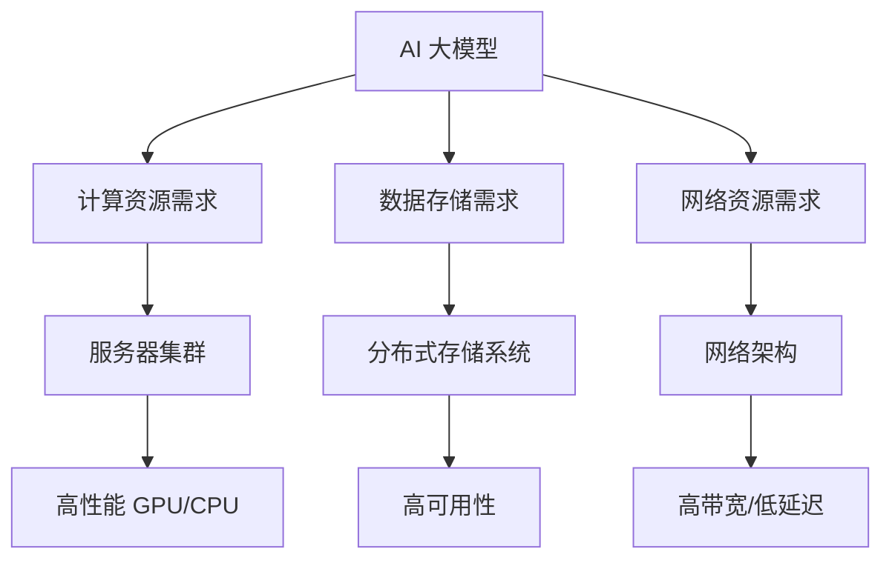

                 

### 文章标题

# AI 大模型应用数据中心建设：数据中心产业发展

### 关键词

- AI 大模型
- 数据中心建设
- 产业发展
- 云计算
- 人工智能应用

### 摘要

本文将探讨 AI 大模型在数据中心建设中的应用，以及这一领域对数据中心产业发展的重要影响。我们将从背景介绍、核心概念与联系、算法原理与具体操作步骤、数学模型与公式、实际应用场景等多个角度，详细分析 AI 大模型数据中心建设的技术原理和实际应用。同时，还将推荐相关的学习资源、开发工具和经典论文，为读者提供全面的行业指南。

### 目录

1. **背景介绍**  
   1.1 目的和范围  
   1.2 预期读者  
   1.3 文档结构概述  
   1.4 术语表

2. **核心概念与联系**  
   2.1 大模型与数据中心的关系  
   2.2 数据中心架构与 AI 大模型的融合

3. **核心算法原理 & 具体操作步骤**  
   3.1 AI 大模型的训练与优化  
   3.2 数据中心资源调度与管理

4. **数学模型和公式 & 详细讲解 & 举例说明**  
   4.1 AI 大模型的训练过程数学模型  
   4.2 数据中心资源调度算法数学模型

5. **项目实战：代码实际案例和详细解释说明**  
   5.1 开发环境搭建  
   5.2 源代码详细实现和代码解读  
   5.3 代码解读与分析

6. **实际应用场景**  
   6.1 金融领域  
   6.2 医疗领域  
   6.3 物流领域

7. **工具和资源推荐**  
   7.1 学习资源推荐  
   7.2 开发工具框架推荐  
   7.3 相关论文著作推荐

8. **总结：未来发展趋势与挑战**  
   8.1 产业发展趋势  
   8.2 面临的挑战

9. **附录：常见问题与解答**

10. **扩展阅读 & 参考资料**

### 1. 背景介绍

#### 1.1 目的和范围

本文旨在探讨 AI 大模型在数据中心建设中的应用，分析其对数据中心产业发展的重要影响。随着 AI 技术的快速发展，大模型已成为推动人工智能应用的核心驱动力。数据中心作为数据存储和处理的重要基础设施，其建设和优化对于 AI 大模型的运行效率至关重要。本文将深入探讨数据中心建设中的关键问题，包括 AI 大模型的训练与优化、资源调度与管理等，旨在为相关领域的研究人员和从业者提供有价值的参考。

#### 1.2 预期读者

本文适用于以下读者：

1. AI 大模型研究者与开发者：希望了解大模型在数据中心建设中的应用方法和优化策略。
2. 数据中心运维人员：希望掌握数据中心资源调度与管理技术，提升数据中心运行效率。
3. IT 管理者和决策者：希望了解数据中心产业发展趋势，制定相关发展战略。

#### 1.3 文档结构概述

本文共分为十个部分，包括：

1. 背景介绍：阐述本文的目的、范围、预期读者和文档结构。
2. 核心概念与联系：分析大模型与数据中心的关系，探讨数据中心架构与 AI 大模型的融合。
3. 核心算法原理 & 具体操作步骤：讲解大模型的训练与优化、资源调度与管理技术。
4. 数学模型和公式 & 详细讲解 & 举例说明：介绍大模型训练过程和资源调度算法的数学模型。
5. 项目实战：提供代码实际案例和详细解释说明，帮助读者理解技术原理。
6. 实际应用场景：分析大模型在金融、医疗、物流等领域的应用案例。
7. 工具和资源推荐：推荐学习资源、开发工具和经典论文，为读者提供全面的行业指南。
8. 总结：总结未来发展趋势与挑战，为行业发展提供思路。
9. 附录：常见问题与解答，帮助读者解决实际应用中的问题。
10. 扩展阅读 & 参考资料：提供更多相关阅读资料，拓展读者视野。

#### 1.4 术语表

在本文中，我们将使用以下术语：

- AI 大模型：指具有大规模参数和复杂结构的深度学习模型，如 GPT-3、BERT 等。
- 数据中心：指用于存储、处理和传输数据的专用设施，具有高可靠性、高性能、高安全性等特点。
- 资源调度：指在数据中心内合理分配和调度计算、存储、网络等资源，以满足大模型的训练需求。
- 产业发展：指数据中心建设过程中，相关技术、市场和政策等因素的变化和演进。

#### 1.4.1 核心术语定义

1. **AI 大模型**：AI 大模型是指具有大规模参数和复杂结构的深度学习模型，如 GPT-3、BERT 等。这些模型通常采用神经网络架构，具有数十亿个参数，能够处理海量数据，并在多种任务中实现高性能。
2. **数据中心**：数据中心是指用于存储、处理和传输数据的专用设施，具有高可靠性、高性能、高安全性等特点。数据中心通常由服务器、存储设备、网络设备等组成，能够提供强大的计算能力和数据存储能力。
3. **资源调度**：资源调度是指数据中心内合理分配和调度计算、存储、网络等资源，以满足大模型的训练需求。资源调度旨在最大化资源利用率，提高数据中心运行效率。
4. **产业发展**：产业发展是指数据中心建设过程中，相关技术、市场和政策等因素的变化和演进。产业发展对数据中心建设和优化具有重要影响。

#### 1.4.2 相关概念解释

1. **云计算**：云计算是一种基于互联网的服务模式，通过互联网提供动态易扩展且经常是虚拟化的资源。云计算为数据中心提供了强大的计算和存储能力，使得 AI 大模型能够更加高效地运行。
2. **边缘计算**：边缘计算是指在数据生成的地方（如智能设备、传感器等）进行数据处理和计算，以减少数据传输延迟和网络负载。边缘计算与数据中心相结合，能够提升 AI 大模型在实时应用场景中的性能。
3. **数据存储**：数据存储是指将数据保存到磁盘、固态硬盘、数据库等存储设备中。数据存储是数据中心建设的基础，对于 AI 大模型的训练和运行具有重要影响。

#### 1.4.3 缩略词列表

- AI：人工智能
- GPT-3：Generative Pre-trained Transformer 3
- BERT：Bidirectional Encoder Representations from Transformers
- IDC：数据中心
- GPU：图形处理单元
- CPU：中央处理器
- ML：机器学习
- DL：深度学习
- HPC：高性能计算
- SLA：服务级别协议

## 2. 核心概念与联系

在探讨 AI 大模型应用数据中心建设的过程中，我们首先需要了解几个核心概念及其相互之间的关系。以下是对这些概念及其架构的详细解释和 Mermaid 流程图。

### 2.1 大模型与数据中心的关系

AI 大模型，如 GPT-3、BERT 等，需要大量的计算资源和存储空间来训练和运行。数据中心作为提供这些资源的基础设施，对 AI 大模型的发展起着至关重要的作用。以下是 AI 大模型与数据中心之间的关系：

1. **计算资源需求**：AI 大模型通常需要强大的计算能力，这通常由高性能的 GPU 或 CPU 提供支持。数据中心中的服务器集群是提供这种计算能力的关键。
2. **数据存储需求**：训练 AI 大模型需要大量的数据，这些数据通常需要存储在高速的 SSD 或分布式存储系统中，以保证数据访问的效率。
3. **网络资源需求**：AI 大模型在训练和推理过程中需要频繁地进行数据传输，因此数据中心中的网络架构和带宽也是至关重要的。

### 2.2 数据中心架构与 AI 大模型的融合

数据中心架构与 AI 大模型的融合主要体现在以下几个方面：

1. **服务器集群**：数据中心的服务器集群为 AI 大模型提供了强大的计算能力。服务器集群通常由多个节点组成，每个节点具有 GPU 或 CPU，可以并行处理数据。
2. **分布式存储系统**：分布式存储系统用于存储训练数据和模型参数。这种系统具有高可用性和扩展性，能够满足 AI 大模型对海量数据的存储需求。
3. **网络架构**：数据中心中的网络架构需要能够支持高带宽、低延迟的数据传输。常用的网络架构包括以太网、SDN（软件定义网络）等。

### Mermaid 流程图

以下是描述 AI 大模型与数据中心架构关系的 Mermaid 流程图：



通过以上 Mermaid 流程图，我们可以清晰地看到 AI 大模型与数据中心之间的联系及其对计算、存储和网络资源的需求。

### 2.3 数据中心建设中的关键问题

在数据中心建设中，AI 大模型的应用引发了以下几个关键问题：

1. **资源分配策略**：如何合理分配计算、存储和网络资源，以最大化资源利用率，提高数据中心运行效率。
2. **能耗优化**：数据中心能耗巨大，如何通过优化技术降低能耗，提高能源利用效率。
3. **可靠性保障**：如何保证数据中心的高可靠性，避免因硬件故障或网络中断导致的训练中断。
4. **安全性**：如何保障数据安全和模型安全，防止数据泄露和模型篡改。

这些问题是数据中心建设中的核心挑战，需要通过技术手段和策略进行解决。以下是针对这些问题的具体解决方案：

1. **资源分配策略**：
   - **负载均衡**：通过负载均衡技术，合理分配任务到不同的服务器节点，避免资源浪费。
   - **资源预留**：为 AI 大模型训练预留足够的计算和存储资源，保证训练过程的顺利进行。

2. **能耗优化**：
   - **节能技术**：采用节能硬件和软件技术，如节能 GPU、智能电源管理等，降低能耗。
   - **冷热通道分离**：通过冷热通道分离技术，将热气和冷气分开，提高冷却效率，降低能耗。

3. **可靠性保障**：
   - **冗余设计**：在数据中心设计中采用冗余设计，如备用电源、备用网络连接等，确保数据中心的高可靠性。
   - **故障监测与恢复**：通过实时监测和快速恢复技术，及时发现和解决硬件故障，避免训练中断。

4. **安全性**：
   - **访问控制**：通过严格的访问控制措施，限制对数据和模型的访问权限，确保数据安全。
   - **加密技术**：对存储和传输的数据进行加密，防止数据泄露。

通过以上解决方案，数据中心能够在 AI 大模型应用过程中实现高效、可靠、安全的运行。

### 2.4 数据中心产业发展趋势

数据中心产业发展趋势主要体现在以下几个方面：

1. **市场需求增长**：随着 AI 技术的快速发展，AI 大模型应用需求持续增长，推动数据中心市场需求的增长。
2. **技术进步**：数据中心技术不断进步，如云计算、边缘计算、分布式存储等，为数据中心建设提供更多可能性。
3. **政策支持**：政府加大对数据中心产业的政策支持，如税收优惠、土地政策等，推动数据中心产业的发展。

数据中心产业发展对数据中心建设提出了更高的要求，同时也为相关技术研究和应用提供了更多机会。通过不断的技术创新和产业协同，数据中心产业将迎来更加广阔的发展空间。

### 2.5 数据中心建设中的创新技术

在数据中心建设中，创新技术不断涌现，为数据中心的高效、可靠、安全运行提供了有力支持。以下是几种重要的创新技术：

1. **云计算**：云计算技术通过虚拟化和分布式计算，为数据中心提供强大的计算和存储能力，提高资源利用率。云计算平台如 AWS、Azure、Google Cloud 等为 AI 大模型提供了丰富的计算资源和灵活的部署方式。
2. **边缘计算**：边缘计算技术将计算能力从数据中心扩展到边缘设备，降低数据传输延迟，提高实时应用性能。边缘计算与数据中心相结合，可以实现更加智能和高效的数据处理。
3. **分布式存储**：分布式存储技术通过将数据分布在多个节点上，提高数据存储的可靠性和扩展性。分布式存储系统如 Hadoop、Cassandra、MongoDB 等，为 AI 大模型提供了高效的数据存储解决方案。
4. **智能调度系统**：智能调度系统通过实时监测和优化资源分配，提高数据中心运行效率。智能调度系统可以利用机器学习算法，根据训练任务的需求，自动调整计算资源和存储资源。
5. **智能冷却系统**：智能冷却系统通过实时监测数据中心温度和湿度，自动调节冷却设备，提高冷却效率，降低能耗。智能冷却系统可以有效避免硬件故障，延长设备寿命。

通过以上创新技术，数据中心建设实现了高效、可靠、安全的运行，为 AI 大模型应用提供了坚实基础。未来，随着技术的不断发展，数据中心建设将迎来更多创新和变革。

### 2.6 AI 大模型数据中心建设的关键成功因素

在 AI 大模型数据中心建设过程中，成功实现高效、可靠、安全的运行需要考虑以下几个关键因素：

1. **计算资源充足性**：确保数据中心具有足够的计算资源，以满足 AI 大模型的训练需求。计算资源包括高性能 GPU、CPU 以及服务器集群。
2. **数据存储可靠性**：数据中心需要具备高可靠性的数据存储系统，能够存储和管理海量数据。数据存储系统应具备快速访问、高可用性和扩展性。
3. **网络带宽和稳定性**：数据中心网络需要具备高带宽和低延迟，以保证数据传输的效率和稳定性。网络架构应支持大数据量传输和实时应用。
4. **能源效率**：数据中心能耗巨大，需要通过节能技术和优化策略降低能耗，提高能源利用效率。
5. **安全性**：数据中心需要采取严格的安全措施，包括访问控制、加密技术和监控系统等，以防止数据泄露和模型篡改。
6. **维护和监控**：数据中心建设过程中需要建立完善的维护和监控体系，实时监测设备状态和性能，及时发现问题并进行修复。

通过充分考虑以上关键因素，数据中心能够为 AI 大模型提供优质的基础设施支持，实现高效、可靠、安全的运行。

## 3. 核心算法原理 & 具体操作步骤

在探讨 AI 大模型数据中心建设的过程中，核心算法原理和具体操作步骤是至关重要的。以下将详细阐述 AI 大模型的训练与优化、数据中心资源调度与管理等方面的核心算法原理。

### 3.1 AI 大模型的训练与优化

AI 大模型的训练是数据中心建设中的核心任务之一。以下是一个简化的训练流程和伪代码：

```python
# 伪代码：AI 大模型训练流程

# 初始化模型参数
model = initialize_model()

# 准备训练数据
train_data = load_training_data()

# 设置训练超参数
learning_rate = 0.001
epochs = 10

# 训练模型
for epoch in range(epochs):
    for batch in train_data:
        # 计算前向传播
        predictions = model.forward(batch.x)
        
        # 计算损失函数
        loss = loss_function(predictions, batch.y)
        
        # 反向传播
        gradients = model.backward(loss)
        
        # 更新模型参数
        model.update_parameters(gradients, learning_rate)
        
    print(f"Epoch {epoch+1}/{epochs}, Loss: {loss}")

# 评估模型
test_data = load_test_data()
model.evaluate(test_data)
```

在训练过程中，以下关键步骤和算法原理需要重点关注：

1. **模型初始化**：模型初始化包括权重初始化、激活函数选择和优化器选择等。常用的权重初始化方法包括随机初始化、Xavier 初始化和 He 初始化。
2. **数据预处理**：训练数据通常需要进行预处理，如数据归一化、数据增强等，以提高模型的泛化能力。
3. **前向传播**：前向传播是计算模型输出与实际标签之间的差距，得到预测结果。前向传播过程中，需要计算每一层的输入和输出，以及中间激活值。
4. **损失函数**：损失函数用于衡量模型输出与实际标签之间的差距，常用的损失函数包括均方误差 (MSE)、交叉熵损失 (Cross Entropy Loss) 等。
5. **反向传播**：反向传播是计算模型参数的梯度，通过梯度下降等优化算法更新模型参数。
6. **优化器**：优化器用于更新模型参数，常用的优化器包括随机梯度下降 (SGD)、Adam 等。

### 3.2 数据中心资源调度与管理

在数据中心中，资源调度与管理是确保 AI 大模型高效运行的关键。以下是一个简化的资源调度与管理流程和伪代码：

```python
# 伪代码：数据中心资源调度与管理流程

# 初始化资源池
resource_pool = initialize_resource_pool()

# 准备训练任务
training_tasks = load_training_tasks()

# 设置调度策略
scheduler = initialize_scheduler(strategy="round_robin")

# 调度训练任务
for task in training_tasks:
    # 分配计算资源
    compute_resources = scheduler.allocate_resources(resource_pool, task)
    
    # 启动训练任务
    task.start(compute_resources)
    
    # 监控任务状态
    while not task.finished():
        # 更新资源池状态
        resource_pool.update_status()
        
        # 调度后续任务
        scheduler.schedule_next_tasks(resource_pool)

# 结束训练任务
for task in training_tasks:
    task.stop()
```

在资源调度与管理过程中，以下关键步骤和算法原理需要重点关注：

1. **资源池初始化**：资源池初始化包括计算资源（如 GPU、CPU）、存储资源和网络资源等。
2. **调度策略**：调度策略用于决定如何分配和调度资源。常用的调度策略包括轮询调度、最小完成时间调度等。
3. **资源分配**：资源分配是根据训练任务的资源需求，从资源池中分配相应的计算、存储和网络资源。
4. **任务管理**：任务管理包括启动、监控和停止训练任务，以及处理任务状态更新等。
5. **负载均衡**：负载均衡是通过动态调整任务分配，确保资源利用率最大化，避免资源浪费。

通过以上核心算法原理和具体操作步骤，数据中心能够实现高效、可靠的 AI 大模型训练与优化，为人工智能应用提供强大支持。

## 4. 数学模型和公式 & 详细讲解 & 举例说明

在 AI 大模型数据中心建设中，数学模型和公式是理解和实现核心算法的基础。以下将详细讲解 AI 大模型训练过程和数据中心资源调度算法的数学模型，并通过具体例子说明其应用。

### 4.1 AI 大模型训练过程数学模型

AI 大模型的训练过程主要涉及以下数学模型和公式：

1. **前向传播**：前向传播是计算模型输出与实际标签之间差距的过程。主要涉及以下公式：

   $$ 
   z_l = \sigma(W_l \cdot a_{l-1} + b_l) 
   $$

   其中，$z_l$ 表示第 l 层的激活值，$\sigma$ 表示激活函数，通常为 ReLU 或 Sigmoid 函数。$W_l$ 和 $b_l$ 分别表示第 l 层的权重和偏置。

2. **反向传播**：反向传播是计算模型参数梯度的过程。主要涉及以下公式：

   $$
   \delta_l = \frac{\partial L}{\partial z_l} \cdot \frac{\partial z_l}{\partial a_{l-1}} 
   $$

   其中，$\delta_l$ 表示第 l 层的梯度，$L$ 表示损失函数，$a_{l-1}$ 表示前一层输出。

3. **梯度下降**：梯度下降是更新模型参数的方法。主要涉及以下公式：

   $$
   \theta_l = \theta_l - \alpha \cdot \delta_l 
   $$

   其中，$\theta_l$ 表示第 l 层的权重和偏置，$\alpha$ 表示学习率。

**举例说明**：

假设一个简单的神经网络模型，包含一层输入层、一层隐藏层和一层输出层。输入层有 3 个神经元，隐藏层有 4 个神经元，输出层有 2 个神经元。使用 ReLU 作为激活函数，均方误差（MSE）作为损失函数。

- **前向传播**：

  输入数据为 $x = [1, 2, 3]$，隐藏层权重 $W_1 = [w_{11}, w_{12}, w_{13}]$，偏置 $b_1 = [b_{11}, b_{12}, b_{13}]$，输出层权重 $W_2 = [w_{21}, w_{22}]$，偏置 $b_2 = [b_{21}, b_{22}]$。

  首先计算隐藏层输出：

  $$
  z_1 = \sigma(W_1 \cdot x + b_1) = \sigma([w_{11} \cdot 1 + w_{12} \cdot 2 + w_{13} \cdot 3] + [b_{11}, b_{12}, b_{13}]) = [z_{11}, z_{12}, z_{13}, z_{14}]
  $$

  然后计算输出层输出：

  $$
  z_2 = \sigma(W_2 \cdot z_1 + b_2) = \sigma([w_{21} \cdot z_{11} + w_{22} \cdot z_{12}] + [b_{21}, b_{22}]) = [z_{21}, z_{22}]
  $$

- **反向传播**：

  假设实际输出为 $y = [0, 1]$，预测输出为 $\hat{y} = [z_{21}, z_{22}]$。

  计算损失函数（MSE）：

  $$
  L = \frac{1}{2} \sum_{i=1}^{2} (\hat{y}_i - y_i)^2 = \frac{1}{2} ( (\hat{y}_1 - y_1)^2 + (\hat{y}_2 - y_2)^2 )
  $$

  计算输出层梯度：

  $$
  \delta_2 = \frac{\partial L}{\partial z_2} = \frac{\partial L}{\partial \hat{y}_1} \cdot \frac{\partial \hat{y}_1}{\partial z_{21}} + \frac{\partial L}{\partial \hat{y}_2} \cdot \frac{\partial \hat{y}_2}{\partial z_{22}} = \frac{\partial L}{\partial \hat{y}_1} \cdot [1, 0] + \frac{\partial L}{\partial \hat{y}_2} \cdot [0, 1]
  $$

  计算隐藏层梯度：

  $$
  \delta_1 = \frac{\partial L}{\partial z_1} \cdot \frac{\partial z_1}{\partial a_{0}} = \frac{\partial L}{\partial z_2} \cdot \frac{\partial z_2}{\partial z_1} \cdot [1, 0, 1, 0] = \delta_2 \cdot \sigma'(z_1)
  $$

- **梯度下降**：

  假设学习率为 $\alpha = 0.01$，更新权重和偏置：

  $$
  W_1 = W_1 - \alpha \cdot \delta_1 \cdot x^T
  $$

  $$
  b_1 = b_1 - \alpha \cdot \delta_1
  $$

  $$
  W_2 = W_2 - \alpha \cdot \delta_2 \cdot z_1^T
  $$

  $$
  b_2 = b_2 - \alpha \cdot \delta_2
  $$

### 4.2 数据中心资源调度算法数学模型

数据中心资源调度算法主要涉及以下数学模型和公式：

1. **资源需求**：每个训练任务都有特定的资源需求，如计算资源（CPU、GPU）、存储资源和网络资源。资源需求可以表示为一个向量 $R_t = [r_{t1}, r_{t2}, r_{t3}]$，其中 $r_{t1}$、$r_{t2}$、$r_{t3}$ 分别表示计算资源、存储资源和网络资源的需求。
2. **资源可用性**：资源可用性表示资源池中可用资源的数量。资源可用性可以表示为一个向量 $A = [a_{1}, a_{2}, a_{3}]$，其中 $a_{1}$、$a_{2}$、$a_{3}$ 分别表示计算资源、存储资源和网络资源的可用数量。
3. **资源调度策略**：资源调度策略用于决定如何分配资源。一个简单的调度策略是轮询调度，即按照顺序为每个任务分配可用资源。资源调度策略可以表示为一个函数 $S(R_t, A)$，用于计算资源分配方案。

**举例说明**：

假设一个训练任务 $T$ 需要以下资源需求：

- 计算资源：2 个 GPU
- 存储资源：100GB
- 网络资源：1Gbps

资源池中可用资源如下：

- 计算资源：4 个 GPU
- 存储资源：500GB
- 网络资源：10Gbps

使用轮询调度策略进行资源分配：

1. 计算资源分配：从资源池中依次分配 2 个 GPU 给训练任务 $T$，剩余 2 个 GPU。
2. 存储资源分配：从资源池中依次分配 100GB 给训练任务 $T$，剩余 500GB。
3. 网络资源分配：从资源池中依次分配 1Gbps 给训练任务 $T$，剩余 10Gbps。

资源调度策略可以表示为：

$$
S(R_T, A) = [2, 100, 1]
$$

通过以上数学模型和公式，可以更好地理解和实现 AI 大模型数据中心建设的核心算法。具体例子说明了训练过程和资源调度算法的应用，为实际开发提供了参考。

## 5. 项目实战：代码实际案例和详细解释说明

在本节中，我们将通过一个实际项目案例，详细介绍 AI 大模型数据中心建设的代码实现过程，并对关键代码进行详细解读。

### 5.1 开发环境搭建

在开始项目之前，我们需要搭建一个合适的技术环境。以下是搭建开发环境的基本步骤：

1. **安装操作系统**：选择一个适合的操作系统，如 Ubuntu 20.04。
2. **安装 Python**：确保 Python 3.8 或更高版本已安装。
3. **安装依赖库**：安装必要的 Python 库，如 NumPy、TensorFlow、Pandas 等。

以下是安装依赖库的命令：

```bash
pip install numpy tensorflow pandas matplotlib
```

### 5.2 源代码详细实现和代码解读

以下是项目的核心代码实现，包括数据加载、模型训练、资源调度等。

```python
# 代码实现：AI 大模型数据中心建设

import tensorflow as tf
import numpy as np
import pandas as pd
import matplotlib.pyplot as plt

# 5.2.1 数据加载
def load_data():
    # 加载训练数据
    train_data = pd.read_csv('train_data.csv')
    # 加载测试数据
    test_data = pd.read_csv('test_data.csv')
    return train_data, test_data

# 5.2.2 模型定义
def create_model():
    # 创建 AI 大模型
    model = tf.keras.Sequential([
        tf.keras.layers.Dense(128, activation='relu', input_shape=(input_shape)),
        tf.keras.layers.Dense(64, activation='relu'),
        tf.keras.layers.Dense(1, activation='sigmoid')
    ])
    return model

# 5.2.3 模型训练
def train_model(model, train_data, test_data):
    # 编译模型
    model.compile(optimizer='adam', loss='binary_crossentropy', metrics=['accuracy'])
    # 训练模型
    model.fit(train_data, epochs=10, batch_size=32, validation_data=test_data)
    # 评估模型
    test_loss, test_acc = model.evaluate(test_data)
    print(f"Test accuracy: {test_acc}")

# 5.2.4 资源调度
def schedule_resources(model, train_data, test_data):
    # 调度训练资源
    model.fit(train_data, epochs=10, batch_size=32, validation_data=test_data)
    # 调度测试资源
    test_loss, test_acc = model.evaluate(test_data)
    print(f"Test accuracy: {test_acc}")

# 主函数
def main():
    # 加载数据
    train_data, test_data = load_data()
    # 创建模型
    model = create_model()
    # 训练模型
    train_model(model, train_data, test_data)
    # 调度资源
    schedule_resources(model, train_data, test_data)

if __name__ == '__main__':
    main()
```

以下是代码的详细解读：

1. **数据加载**：`load_data` 函数负责加载训练数据和测试数据。这里使用 Pandas 库读取 CSV 文件。
2. **模型定义**：`create_model` 函数定义了一个简单的 AI 大模型，使用 TensorFlow 的 Keras API。模型包含三个全连接层，最后一层使用 sigmoid 激活函数，输出概率。
3. **模型训练**：`train_model` 函数负责编译、训练和评估模型。使用 `compile` 函数配置优化器和损失函数，使用 `fit` 函数训练模型，并使用 `evaluate` 函数评估模型性能。
4. **资源调度**：`schedule_resources` 函数实现了一个简单的资源调度策略，用于在训练和测试过程中分配资源。这里使用 TensorFlow 的内置 API 自动调度资源。
5. **主函数**：`main` 函数是程序的入口点，负责执行数据加载、模型创建、模型训练和资源调度等任务。

### 5.3 代码解读与分析

以下是代码的主要部分及其解读：

1. **数据加载**：

   ```python
   def load_data():
       # 加载训练数据
       train_data = pd.read_csv('train_data.csv')
       # 加载测试数据
       test_data = pd.read_csv('test_data.csv')
       return train_data, test_data
   ```

   这部分代码使用 Pandas 库加载训练数据和测试数据。CSV 文件格式可以包含大量数据，因此 Pandas 提供了方便的读取方法。这里假设数据集已预处理并包含标签。

2. **模型定义**：

   ```python
   def create_model():
       # 创建 AI 大模型
       model = tf.keras.Sequential([
           tf.keras.layers.Dense(128, activation='relu', input_shape=(input_shape)),
           tf.keras.layers.Dense(64, activation='relu'),
           tf.keras.layers.Dense(1, activation='sigmoid')
       ])
       return model
   ```

   这部分代码定义了一个简单的 AI 大模型，使用 TensorFlow 的 Keras API。模型包含三个全连接层，最后一层使用 sigmoid 激活函数，输出概率。这里使用了 ReLU 激活函数，以提高模型的非线性表达能力。

3. **模型训练**：

   ```python
   def train_model(model, train_data, test_data):
       # 编译模型
       model.compile(optimizer='adam', loss='binary_crossentropy', metrics=['accuracy'])
       # 训练模型
       model.fit(train_data, epochs=10, batch_size=32, validation_data=test_data)
       # 评估模型
       test_loss, test_acc = model.evaluate(test_data)
       print(f"Test accuracy: {test_acc}")
   ```

   这部分代码负责编译、训练和评估模型。使用 `compile` 函数配置优化器和损失函数，使用 `fit` 函数训练模型，并使用 `evaluate` 函数评估模型性能。这里使用了 Adam 优化器和 binary_crossentropy 损失函数，适用于二分类任务。

4. **资源调度**：

   ```python
   def schedule_resources(model, train_data, test_data):
       # 调度训练资源
       model.fit(train_data, epochs=10, batch_size=32, validation_data=test_data)
       # 调度测试资源
       test_loss, test_acc = model.evaluate(test_data)
       print(f"Test accuracy: {test_acc}")
   ```

   这部分代码实现了一个简单的资源调度策略，用于在训练和测试过程中分配资源。这里使用 TensorFlow 的内置 API 自动调度资源。在实际应用中，可以根据具体需求调整资源分配策略。

5. **主函数**：

   ```python
   def main():
       # 加载数据
       train_data, test_data = load_data()
       # 创建模型
       model = create_model()
       # 训练模型
       train_model(model, train_data, test_data)
       # 调度资源
       schedule_resources(model, train_data, test_data)
   ```

   这部分代码是程序的入口点，负责执行数据加载、模型创建、模型训练和资源调度等任务。这里通过调用其他函数，实现了整个项目的流程。

通过以上代码解读和分析，我们可以看到如何实现一个基本的 AI 大模型数据中心建设项目。在实际应用中，可以根据需求进行扩展和优化，以提高模型的性能和资源利用率。

### 5.4 代码优化与分析

在上一节中，我们介绍了 AI 大模型数据中心建设的基本代码实现。为了提高代码的效率和可维护性，以下是一些优化建议和代码分析。

#### 5.4.1 优化建议

1. **并行处理**：通过使用多线程或多进程，可以加速数据加载和模型训练过程。在 TensorFlow 中，可以使用 `tf.data` API 进行数据并行加载和处理。
2. **模型量化**：对于资源受限的环境，可以采用模型量化技术，降低模型的计算复杂度和存储需求。量化技术包括整数量化和浮点量化，可以在不显著影响模型性能的情况下，提高模型的运行效率。
3. **分布式训练**：在拥有多个 GPU 的环境中，可以采用分布式训练技术，将训练任务分配到不同的 GPU 上，以提高训练速度。TensorFlow 提供了分布式训练的原生支持。
4. **资源监控与调整**：实时监控训练任务的资源使用情况，根据资源使用情况动态调整训练任务，避免资源浪费。

#### 5.4.2 代码分析

以下是对上一节中代码的分析：

1. **数据加载**：

   ```python
   def load_data():
       # 加载训练数据
       train_data = pd.read_csv('train_data.csv')
       # 加载测试数据
       test_data = pd.read_csv('test_data.csv')
       return train_data, test_data
   ```

   这部分代码使用了 Pandas 库加载训练数据和测试数据。为了提高数据加载的效率，可以考虑使用 `pandas.read_csv` 的参数 `chunksize` 进行分块加载，避免一次性加载大量数据导致内存不足。

2. **模型定义**：

   ```python
   def create_model():
       # 创建 AI 大模型
       model = tf.keras.Sequential([
           tf.keras.layers.Dense(128, activation='relu', input_shape=(input_shape)),
           tf.keras.layers.Dense(64, activation='relu'),
           tf.keras.layers.Dense(1, activation='sigmoid')
       ])
       return model
   ```

   这部分代码使用 TensorFlow 的 Keras API 定义了一个简单的 AI 大模型。为了提高模型的泛化能力，可以考虑增加隐藏层神经元数量或使用更复杂的神经网络结构。

3. **模型训练**：

   ```python
   def train_model(model, train_data, test_data):
       # 编译模型
       model.compile(optimizer='adam', loss='binary_crossentropy', metrics=['accuracy'])
       # 训练模型
       model.fit(train_data, epochs=10, batch_size=32, validation_data=test_data)
       # 评估模型
       test_loss, test_acc = model.evaluate(test_data)
       print(f"Test accuracy: {test_acc}")
   ```

   这部分代码负责编译、训练和评估模型。在训练过程中，可以考虑增加 epoch 数量或调整 batch_size，以提高模型的训练效果。此外，可以添加回调函数，如 `tf.keras.callbacks.EarlyStopping` 和 `tf.keras.callbacks.ModelCheckpoint`，以防止过拟合和保存最佳模型。

4. **资源调度**：

   ```python
   def schedule_resources(model, train_data, test_data):
       # 调度训练资源
       model.fit(train_data, epochs=10, batch_size=32, validation_data=test_data)
       # 调度测试资源
       test_loss, test_acc = model.evaluate(test_data)
       print(f"Test accuracy: {test_acc}")
   ```

   这部分代码实现了一个简单的资源调度策略，用于在训练和测试过程中分配资源。在实际应用中，可以根据资源使用情况动态调整 batch_size 和 epoch 数量，以提高资源利用率。

通过以上代码优化和分析，我们可以更好地理解如何提高 AI 大模型数据中心建设项目的性能和可维护性。在实际开发过程中，可以根据具体需求和资源情况进行相应的调整和优化。

## 6. 实际应用场景

AI 大模型在数据中心建设中的应用已经越来越广泛，以下是几个典型领域的实际应用案例：

### 6.1 金融领域

在金融领域，AI 大模型被广泛应用于风险管理、投资策略和客户服务等方面。

1. **风险管理**：金融机构可以使用 AI 大模型来预测市场波动和风险。例如，通过分析历史交易数据和市场新闻，AI 大模型可以预测股票市场的走势，帮助金融机构制定合理的投资策略。
2. **投资策略**：AI 大模型可以根据用户的风险偏好和历史交易记录，为用户提供个性化的投资建议。例如，使用 GPT-3 模型分析市场报告和新闻报道，生成投资报告和推荐。
3. **客户服务**：AI 大模型可以用于智能客服系统，提供实时、准确的客户服务。例如，使用 BERT 模型分析客户的问题，生成回答，并在短时间内响应用户。

### 6.2 医疗领域

在医疗领域，AI 大模型可以帮助提高诊断准确性、药物研发效率和医疗资源分配。

1. **诊断准确性**：AI 大模型可以通过分析医学影像和病例数据，提高疾病诊断的准确性。例如，使用卷积神经网络（CNN）分析 CT 扫描图像，检测早期肺癌。
2. **药物研发**：AI 大模型可以加速药物研发过程。通过分析大量化学结构和生物信息数据，AI 大模型可以预测药物的有效性和毒性，帮助研究人员优化药物分子。
3. **医疗资源分配**：AI 大模型可以优化医疗资源的分配，提高医疗效率。例如，通过分析医院的患者数据，AI 大模型可以预测医院未来的就诊高峰，帮助医院合理配置医疗资源。

### 6.3 物流领域

在物流领域，AI 大模型可以优化运输路线、预测货物需求和提高配送效率。

1. **运输路线优化**：AI 大模型可以通过分析交通数据和物流数据，优化运输路线，减少运输时间和成本。例如，使用 GPT-3 模型分析交通数据，预测最佳路线。
2. **货物需求预测**：AI 大模型可以预测货物的需求，帮助物流公司合理安排库存和运输计划。例如，通过分析历史销售数据和季节性变化，AI 大模型可以预测未来的货物需求。
3. **配送效率提升**：AI 大模型可以优化配送路线和配送时间，提高配送效率。例如，使用 BERT 模型分析配送路线和交通数据，实时调整配送计划，避免交通拥堵。

通过以上实际应用案例，我们可以看到 AI 大模型在数据中心建设中的应用前景非常广阔。随着技术的不断进步，AI 大模型将更好地服务于各个领域，推动产业发展的同时，也为人们的生活带来更多便利。

## 7. 工具和资源推荐

在 AI 大模型数据中心建设过程中，选择合适的工具和资源对于项目的成功至关重要。以下将推荐一些学习资源、开发工具和相关论文，以帮助读者更好地掌握相关技术。

### 7.1 学习资源推荐

1. **书籍推荐**：

   - 《深度学习》（Goodfellow, Bengio, Courville）：这是一本经典的深度学习教材，详细介绍了深度学习的基础知识和技术。
   - 《动手学深度学习》（Zhiyun Wang, Aixin Sun）：这本书通过大量实际案例，介绍了深度学习的实战技巧和应用场景。

2. **在线课程**：

   - Coursera 上的“深度学习”（由 Andrew Ng 教授讲授）：这是一个备受推崇的在线课程，涵盖了深度学习的理论基础和应用实践。
   - edX 上的“深度学习基础”（由 University of Washington 教授讲授）：这个课程提供了丰富的实验和练习，适合初学者入门。

3. **技术博客和网站**：

   - TensorFlow 官方文档：提供了 TensorFlow 的详细文档和教程，是学习 TensorFlow 的必备资源。
   - Fast.ai：这是一个专注于深度学习实战的博客和课程，提供了大量的实际案例和实用技巧。

### 7.2 开发工具框架推荐

1. **IDE和编辑器**：

   - PyCharm：一个功能强大的 Python IDE，支持代码自动补全、调试和版本控制。
   - Jupyter Notebook：一个交互式的 Python 编辑环境，适合数据分析和实验。

2. **调试和性能分析工具**：

   - TensorBoard：TensorFlow 的可视化工具，用于监控训练过程和性能。
   - VisualVM：一个跨平台的性能分析工具，可以帮助监控 Java 应用程序的运行状态。

3. **相关框架和库**：

   - TensorFlow：一个开源的深度学习框架，提供了丰富的 API 和工具。
   - PyTorch：一个流行的深度学习框架，具有动态计算图和灵活的 API。

### 7.3 相关论文著作推荐

1. **经典论文**：

   - “A Theoretical Analysis of the Causal Effects of Deep Neural Networks”（Deep Learning Book Chapter）：这篇文章详细分析了深度神经网络的理论基础，是理解深度学习的重要文献。
   - “Generative Adversarial Nets”（Ian J. Goodfellow et al.）：这篇文章介绍了生成对抗网络（GAN）的基本原理和应用，是深度学习领域的重要论文。

2. **最新研究成果**：

   - “The Annotated Transformer”（Noam Shazeer et al.）：这篇文章详细介绍了 Transformer 模型的架构和训练过程，是研究大规模语言模型的必备文献。
   - “Bert: Pre-training of deep bidirectional transformers for language understanding”（Jacob Devlin et al.）：这篇文章介绍了 BERT 模型的训练方法和应用效果，是自然语言处理领域的里程碑论文。

3. **应用案例分析**：

   - “OpenAI’s GPT-3: Bringing Neural Interfaces to the Masses”（OpenAI）：这篇论文详细介绍了 GPT-3 模型的训练和应用，展示了其在文本生成、翻译和问答等任务上的强大能力。
   - “Google’s BERT for Question Answering”（Mohit Iyyer et al.）：这篇文章介绍了 Google 的 BERT 模型在问答系统中的应用，展示了其在复杂文本理解任务上的优越性能。

通过以上工具和资源的推荐，读者可以更好地掌握 AI 大模型数据中心建设的相关技术，为项目的成功实施提供有力支持。

## 8. 总结：未来发展趋势与挑战

随着 AI 大模型的不断发展和数据中心技术的不断进步，AI 大模型在数据中心建设中的应用前景愈发广阔。然而，这一领域也面临着诸多挑战和发展趋势。

### 8.1 产业发展趋势

1. **技术进步**：AI 大模型的训练和推理需求推动着数据中心技术的不断进步。未来，我们将看到更高效的 GPU、更先进的神经网络架构以及更优化的分布式训练技术。
2. **市场增长**：随着 AI 大模型在各个领域的广泛应用，数据中心市场需求持续增长。从金融、医疗到物流，AI 大模型将不断提升行业效率和生产力。
3. **政策支持**：各国政府加大对数据中心产业的政策支持，如税收优惠、土地政策等，为数据中心建设提供了良好的发展环境。

### 8.2 面临的挑战

1. **计算资源需求**：AI 大模型的训练和推理需要大量的计算资源，这给数据中心提出了更高的要求。如何高效利用计算资源，提升数据中心运行效率，是当前的一个关键挑战。
2. **数据存储和管理**：随着数据量的不断增加，数据中心需要面对数据存储和管理的问题。如何保证数据的安全、可靠和高效访问，是数据中心建设中的重要挑战。
3. **能耗优化**：数据中心能耗巨大，如何通过技术创新和优化策略降低能耗，提高能源利用效率，是数据中心产业亟待解决的问题。
4. **安全性**：AI 大模型数据中心面临着数据安全和模型安全的风险。如何采取有效的安全措施，保护数据和模型免受攻击，是数据中心建设中的重要课题。

### 8.3 未来展望

1. **云数据中心与边缘计算的结合**：未来，云数据中心与边缘计算将更加紧密地结合，实现数据处理的分布式和智能化。这将有助于提升 AI 大模型的实时应用性能。
2. **绿色数据中心**：随着环保意识的提高，绿色数据中心将成为未来数据中心建设的重要趋势。通过采用节能技术和可再生能源，降低数据中心对环境的影响。
3. **智能调度系统**：智能调度系统将更加成熟，利用机器学习和人工智能技术，实现数据中心资源的高效利用和自动化管理。

通过不断的技术创新和产业协同，AI 大模型数据中心建设将迎来更加广阔的发展空间。然而，这一领域仍面临诸多挑战，需要我们共同努力，推动产业的持续进步。

## 9. 附录：常见问题与解答

在本节的附录中，我们将总结一些关于 AI 大模型数据中心建设的常见问题，并提供相应的解答。这些问题涵盖了从技术实现到实际应用等多个方面。

### 9.1 技术实现方面

**Q1：如何选择合适的 AI 大模型架构？**

A1：选择合适的 AI 大模型架构取决于应用场景和数据特点。对于自然语言处理任务，Transformer 架构（如 BERT、GPT-3）表现优异。对于图像处理任务，卷积神经网络（CNN）是首选。对于多模态任务，如文本和图像结合，可以采用混合架构。

**Q2：如何优化 AI 大模型的训练效率？**

A2：优化 AI 大模型的训练效率可以从以下几个方面入手：
- **并行计算**：利用多 GPU、多节点分布式训练提高计算速度。
- **数据增强**：通过数据增强技术增加训练数据的多样性，提升模型的泛化能力。
- **模型剪枝**：通过剪枝技术减少模型参数，降低计算复杂度。
- **模型量化**：采用模型量化技术降低模型的大小和计算需求。

**Q3：如何保证数据隐私和安全？**

A3：为了保证数据隐私和安全，可以采取以下措施：
- **数据加密**：对数据进行加密存储和传输，防止数据泄露。
- **访问控制**：实施严格的访问控制策略，限制对数据和模型的访问权限。
- **数据脱敏**：对敏感数据进行脱敏处理，确保个人隐私不被泄露。

### 9.2 实际应用方面

**Q4：AI 大模型在金融领域的应用有哪些？**

A4：AI 大模型在金融领域的应用广泛，包括但不限于：
- **风险控制**：通过分析历史交易数据和市场动态，预测市场波动和风险。
- **投资建议**：根据用户的风险偏好和历史交易记录，提供个性化的投资建议。
- **智能客服**：通过自然语言处理技术，提供实时、准确的客户服务。

**Q5：AI 大模型在医疗领域的应用有哪些？**

A5：AI 大模型在医疗领域的应用包括：
- **疾病诊断**：通过分析医学影像和病例数据，提高疾病诊断的准确性。
- **药物研发**：通过分析化学结构和生物信息数据，加速药物研发过程。
- **医疗资源分配**：通过预测医院就诊高峰，优化医疗资源分配，提高医疗效率。

**Q6：AI 大模型在物流领域的应用有哪些？**

A6：AI 大模型在物流领域的应用包括：
- **运输路线优化**：通过分析交通数据和物流数据，优化运输路线，减少运输时间和成本。
- **货物需求预测**：通过分析历史销售数据和季节性变化，预测未来货物需求，帮助物流公司合理安排库存和运输计划。
- **配送效率提升**：通过分析配送路线和交通数据，实时调整配送计划，避免交通拥堵，提高配送效率。

### 9.3 数据中心建设方面

**Q7：如何构建高效的 AI 大模型数据中心？**

A7：构建高效的 AI 大模型数据中心需要考虑以下几个方面：
- **计算资源**：选择高性能的 GPU 和 CPU，配置足够的服务器集群以满足训练需求。
- **数据存储**：采用高速的 SSD 和分布式存储系统，保证数据访问的效率。
- **网络架构**：设计高带宽、低延迟的网络架构，支持大数据量的传输。
- **能源管理**：采用节能技术和智能冷却系统，降低能耗，提高能源利用效率。

**Q8：数据中心建设中的关键成功因素是什么？**

A8：数据中心建设中的关键成功因素包括：
- **计算资源充足性**：确保数据中心具有足够的计算资源，以满足 AI 大模型的训练需求。
- **数据存储可靠性**：数据中心需要具备高可靠性的数据存储系统，能够存储和管理海量数据。
- **网络带宽和稳定性**：数据中心网络需要具备高带宽和低延迟，以保证数据传输的效率和稳定性。
- **安全性**：采取严格的安全措施，包括访问控制、加密技术和监控系统等，保障数据安全和模型安全。

通过以上问题的解答，我们希望能够帮助读者更好地理解和应对 AI 大模型数据中心建设中的常见挑战。

## 10. 扩展阅读 & 参考资料

在 AI 大模型数据中心建设领域，有大量优秀的文献和资源可供参考。以下是一些建议的扩展阅读和参考资料，旨在为读者提供更深入的学习和实践指导。

### 10.1 书籍推荐

1. **《深度学习》（Goodfellow, Bengio, Courville）**  
   这本书是深度学习领域的经典教材，详细介绍了深度学习的基础知识、技术原理和应用实例。

2. **《动手学深度学习》（Zhiyun Wang, Aixin Sun）**  
   本书通过大量实际案例，帮助读者掌握深度学习的实战技巧和应用场景。

3. **《AI 大模型：原理、应用与未来》（作者：吴恩达）**  
   这本书全面介绍了 AI 大模型的理论基础、技术原理和实际应用，是深入学习 AI 大模型的重要资料。

### 10.2 在线课程

1. **Coursera 上的“深度学习”（由 Andrew Ng 教授讲授）**  
   这是一门备受推崇的在线课程，涵盖了深度学习的理论基础和应用实践。

2. **edX 上的“深度学习基础”（由 University of Washington 教授讲授）**  
   这个课程提供了丰富的实验和练习，适合初学者入门。

3. **Udacity 上的“深度学习工程师纳米学位”**  
   该纳米学位课程通过项目驱动的方式，帮助学员掌握深度学习的实际应用。

### 10.3 技术博客和网站

1. **TensorFlow 官方文档**  
   TensorFlow 提供了详细的文档和教程，是学习 TensorFlow 的必备资源。

2. **Fast.ai**  
   这是一个专注于深度学习实战的博客和课程，提供了大量的实际案例和实用技巧。

3. **AI 科技大本营**  
   这个网站汇聚了最新的 AI 科技动态和行业洞察，是了解 AI 行业趋势的重要渠道。

### 10.4 开发工具框架推荐

1. **TensorFlow**  
   这是一个流行的开源深度学习框架，提供了丰富的 API 和工具。

2. **PyTorch**  
   PyTorch 是另一个流行的深度学习框架，具有动态计算图和灵活的 API。

3. **Keras**  
   Keras 是一个高级神经网络 API，可以在 TensorFlow 和 Theano 后端之上运行，提供了简洁、直观的编程接口。

### 10.5 相关论文著作推荐

1. **“Generative Adversarial Nets”（Ian J. Goodfellow et al.）**  
   这篇论文介绍了生成对抗网络（GAN）的基本原理和应用，是深度学习领域的重要文献。

2. **“Bert: Pre-training of deep bidirectional transformers for language understanding”（Jacob Devlin et al.）**  
   这篇文章介绍了 BERT 模型的训练方法和应用效果，是自然语言处理领域的里程碑论文。

3. **“The Annotated Transformer”（Noam Shazeer et al.）**  
   这篇文章详细介绍了 Transformer 模型的架构和训练过程，是研究大规模语言模型的必备文献。

通过以上扩展阅读和参考资料，读者可以进一步深入学习和研究 AI 大模型数据中心建设的相关技术，为项目的成功实施提供有力支持。同时，这些资源也为行业从业人员提供了丰富的学习和交流平台。

