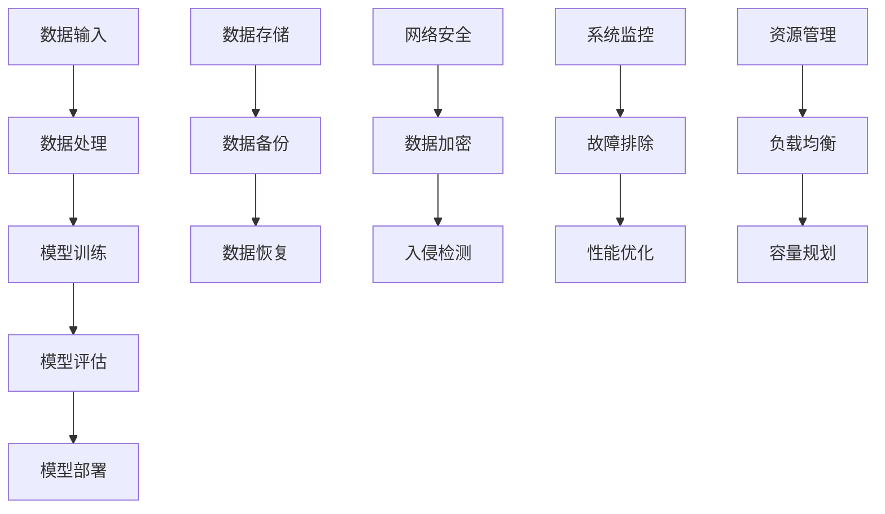

                 

# AI大模型应用数据中心建设：数据中心安全与可靠性

> 关键词：数据中心、AI大模型、安全性、可靠性、架构设计、数据处理、网络安全、存储系统、资源管理

> 摘要：随着人工智能技术的快速发展，AI大模型在众多领域得到了广泛应用。本文将探讨数据中心在AI大模型应用中的重要性，以及如何设计和实现一个安全可靠的数据中心。文章分为十个部分，从背景介绍到实际应用场景，再到工具和资源推荐，旨在为读者提供一个全面的技术指导。

## 1. 背景介绍

### 1.1 目的和范围

本文旨在探讨数据中心在AI大模型应用中的重要性，分析数据中心的安全性、可靠性，并给出具体的设计和实现方法。文章将涵盖数据中心的基本概念、核心算法原理、数学模型和公式、实际应用场景，以及相关工具和资源的推荐。

### 1.2 预期读者

本文面向的读者为计算机领域的技术人员、数据中心架构师、AI研究人员，以及对数据中心安全与可靠性感兴趣的广大读者。

### 1.3 文档结构概述

本文分为十个部分，具体如下：

1. 背景介绍
2. 核心概念与联系
3. 核心算法原理 & 具体操作步骤
4. 数学模型和公式 & 详细讲解 & 举例说明
5. 项目实战：代码实际案例和详细解释说明
6. 实际应用场景
7. 工具和资源推荐
8. 总结：未来发展趋势与挑战
9. 附录：常见问题与解答
10. 扩展阅读 & 参考资料

### 1.4 术语表

#### 1.4.1 核心术语定义

- 数据中心：用于存储、处理和管理大量数据的服务器集群设施。
- AI大模型：指参数量巨大、计算复杂度高的人工神经网络模型。
- 安全性：指数据中心在遭受攻击或故障时，能够保障数据完整性和可用性的能力。
- 可靠性：指数据中心在长时间运行过程中，能够保持稳定运行的能力。

#### 1.4.2 相关概念解释

- 数据存储：将数据以电子形式保存在磁性、光性或固态存储介质中。
- 数据处理：对存储的数据进行加工、分析、转换等操作。
- 网络安全：防范黑客攻击、数据泄露等安全威胁。

#### 1.4.3 缩略词列表

- AI：人工智能
- ML：机器学习
- DL：深度学习
- GPU：图形处理器
- CPU：中央处理器

## 2. 核心概念与联系

在本文中，我们将讨论数据中心在AI大模型应用中的核心概念和联系，并通过Mermaid流程图展示相关架构。



### 2.1 数据输入与数据处理

数据输入是数据中心的基础，包括数据采集、清洗和预处理。在AI大模型应用中，数据输入的质量直接影响模型的性能。数据处理过程主要包括数据转换、归一化、特征提取等步骤，以提高数据的可用性和鲁棒性。

### 2.2 模型训练与模型评估

模型训练是通过大量的数据进行神经网络模型的参数优化，以达到良好的泛化能力。模型评估则用于评估模型的性能和准确性，包括准确率、召回率、F1分数等指标。模型评估是模型优化和改进的重要环节。

### 2.3 模型部署与数据存储

模型部署是将训练好的模型应用于实际场景，如图像识别、自然语言处理等。数据存储则是将处理后的数据以电子形式保存在存储介质中，以便后续查询和使用。

### 2.4 数据备份与数据恢复

数据备份是为了防止数据丢失或损坏，采用定期备份和异地备份的方式。数据恢复则是从备份中恢复数据，以应对各种意外情况。

### 2.5 网络安全与数据加密

网络安全是确保数据中心数据安全的关键。数据加密可以防止数据在传输和存储过程中被窃取或篡改。入侵检测和系统监控可以实时监测网络攻击和安全事件，以保障数据中心的正常运行。

### 2.6 系统监控与性能优化

系统监控可以实时监测数据中心的运行状态，包括硬件设备、网络带宽、存储容量等。性能优化是通过调整资源配置、优化算法和代码，以提高数据中心的运行效率和稳定性。

### 2.7 资源管理与负载均衡

资源管理包括CPU、GPU、内存、存储等硬件资源的分配和管理。负载均衡是将工作负载分配到多个服务器上，以提高系统的吞吐量和可用性。

## 3. 核心算法原理 & 具体操作步骤

在数据中心建设过程中，核心算法原理是保障数据安全和可靠性的关键。以下是核心算法原理的详细解释和具体操作步骤：

### 3.1 数据加密算法

#### 原理：

数据加密算法是将明文数据转换为密文的过程，以防止数据在传输和存储过程中被窃取或篡改。常用的加密算法包括对称加密、非对称加密和混合加密。

#### 操作步骤：

1. 选择加密算法和密钥
2. 对数据进行加密
3. 将加密后的数据传输或存储
4. 对加密数据进行解密，以获取原始数据

### 3.2 网络安全协议

#### 原理：

网络安全协议是一种确保数据在传输过程中安全可靠的通信机制。常用的网络安全协议包括SSL/TLS、IPSec、SSH等。

#### 操作步骤：

1. 配置网络设备，启用安全协议
2. 对数据传输进行加密和认证
3. 监测网络流量，防止恶意攻击
4. 定期更新安全策略和配置

### 3.3 数据备份和恢复算法

#### 原理：

数据备份和恢复算法是为了确保在数据丢失或损坏时，能够从备份中恢复数据。常用的备份算法包括全备份、增量备份、差异备份等。

#### 操作步骤：

1. 设计备份策略，确定备份方式和频率
2. 定期执行备份操作
3. 存储备份数据，确保备份的安全性
4. 在需要时，从备份中恢复数据

### 3.4 入侵检测和防御算法

#### 原理：

入侵检测和防御算法是一种实时监测网络攻击和安全事件，并采取相应措施进行防御的机制。常用的入侵检测算法包括基于特征匹配、基于统计分析和基于机器学习的方法。

#### 操作步骤：

1. 收集网络流量数据，分析其特征
2. 检测异常流量，识别潜在的攻击事件
3. 采取防御措施，如阻止攻击流量、报警通知等
4. 定期更新和优化入侵检测系统

### 3.5 负载均衡算法

#### 原理：

负载均衡算法是将工作负载分配到多个服务器上，以提高系统的吞吐量和可用性。常用的负载均衡算法包括轮询、最小连接数、加权轮询等。

#### 操作步骤：

1. 收集服务器性能数据，分析负载情况
2. 选择合适的负载均衡算法
3. 将请求分配到不同的服务器
4. 监测服务器状态，动态调整负载分配

## 4. 数学模型和公式 & 详细讲解 & 举例说明

在数据中心建设过程中，数学模型和公式是设计算法和评估性能的重要工具。以下是几个关键的数学模型和公式的详细讲解及举例说明。

### 4.1 加密算法的数学模型

#### 公式：

加密算法的数学模型通常表示为：
\[ E_k(p) = c \]

其中，\( E_k \) 表示加密算法，\( p \) 表示明文，\( c \) 表示密文。

#### 举例说明：

假设使用AES加密算法，密钥为\( k \)，明文为\( p = "Hello, World!" \)。则加密过程如下：

1. 将明文转换为字节序列：\[ p = [72, 101, 108, 108, 111, 44, 32, 87, 111, 114, 108, 100, 33] \]
2. 使用密钥\( k \)对每个字节进行加密：\[ c = [c_1, c_2, ..., c_n] \]
3. 将加密后的字节序列转换为密文：\[ c = "kYpOJ6xh5Y=" \]

### 4.2 加密强度评估模型

#### 公式：

加密强度评估模型通常使用以下公式：

\[ E = \frac{2^k}{N} \]

其中，\( E \) 表示加密强度，\( k \) 表示密钥长度，\( N \) 表示攻击者尝试的密钥数量。

#### 举例说明：

假设加密算法的密钥长度为128位，攻击者尝试所有可能的密钥。则加密强度为：

\[ E = \frac{2^{128}}{2^{128}} = 1 \]

### 4.3 负载均衡模型

#### 公式：

负载均衡模型通常表示为：

\[ L = \frac{W_1 + W_2 + ... + W_n}{n} \]

其中，\( L \) 表示负载均衡后的平均负载，\( W_1, W_2, ..., W_n \) 表示每个服务器的负载。

#### 举例说明：

假设有3个服务器，其负载分别为\( W_1 = 10 \)，\( W_2 = 20 \)，\( W_3 = 30 \)。则负载均衡后的平均负载为：

\[ L = \frac{10 + 20 + 30}{3} = 20 \]

### 4.4 数据备份和恢复模型

#### 公式：

数据备份和恢复模型通常表示为：

\[ T_r = \frac{T_b + T_r}{2} \]

其中，\( T_r \) 表示恢复时间，\( T_b \) 表示备份时间。

#### 举例说明：

假设备份时间为1小时，恢复时间为2小时。则恢复时间为：

\[ T_r = \frac{1 + 2}{2} = 1.5 \text{小时} \]

## 5. 项目实战：代码实际案例和详细解释说明

在本节中，我们将通过一个实际项目案例来展示数据中心建设中的关键代码实现和详细解释。

### 5.1 开发环境搭建

1. 安装操作系统：在服务器上安装Linux操作系统，如Ubuntu 20.04。
2. 安装开发工具：安装Python开发环境、MySQL数据库、Nginx web服务器等。
3. 配置网络环境：配置服务器IP地址、防火墙规则、网络路由等。

### 5.2 源代码详细实现和代码解读

以下是一个简单的数据加密和解密示例，用于展示加密算法的实现：

```python
# 加密算法示例
from Crypto.Cipher import AES
from Crypto.Random import get_random_bytes

# 初始化密钥和加密算法
key = get_random_bytes(16)
cipher = AES.new(key, AES.MODE_EAX)

# 待加密的明文
plaintext = b"Hello, World!"

# 加密明文
ciphertext, tag = cipher.encrypt_and_digest(plaintext)

# 打印加密结果
print("加密后的数据：", ciphertext)
print("加密标签：", tag)

# 解密算法示例
from Crypto.Cipher import AES
from Crypto.Util.Padding import unpad

# 初始化解密算法
cipher = AES.new(key, AES.MODE_EAX, nonce=cipher.nonce)

# 解密密文
try:
    plaintext = cipher.decrypt_and_verify(ciphertext, tag)
except ValueError:
    print("解密失败，数据可能已被篡改")

# 打印解密后的明文
print("解密后的数据：", plaintext)
```

### 5.3 代码解读与分析

1. **导入模块**：导入加密算法所需的模块。
2. **初始化密钥和加密算法**：使用`Crypto.Cipher`模块中的`AES`类创建加密对象，并使用`Crypto.Random.get_random_bytes`生成随机密钥。
3. **加密明文**：将明文输入加密对象，调用`encrypt_and_digest`方法进行加密，并获取加密后的密文和加密标签。
4. **打印加密结果**：输出加密后的密文和加密标签。
5. **初始化解密算法**：使用加密时的密钥和加密标签创建解密对象。
6. **解密密文**：调用`decrypt_and_verify`方法对密文进行解密，并验证加密标签是否正确。
7. **打印解密后的明文**：输出解密后的明文。

通过此代码示例，我们可以了解到数据加密和解密的基本实现过程。在实际应用中，可以根据需求扩展加密算法、密钥管理、错误处理等功能。

## 6. 实际应用场景

数据中心在AI大模型应用中具有广泛的应用场景，以下列举几个典型的应用案例：

### 6.1 图像识别

图像识别是AI大模型的重要应用领域。数据中心可以为图像识别任务提供高性能计算资源，包括GPU集群、分布式计算框架等。通过数据中心，企业可以实现大规模图像识别任务的自动化处理，提高生产效率和准确性。

### 6.2 自然语言处理

自然语言处理（NLP）是AI的重要分支。数据中心可以为NLP任务提供大规模文本数据存储、处理和计算资源。通过数据中心，企业可以实现语音识别、机器翻译、情感分析等NLP应用，提升用户体验。

### 6.3 机器学习

数据中心是机器学习模型训练的重要基础设施。通过数据中心，企业可以存储和计算大量训练数据，进行模型训练和优化。数据中心的高性能计算能力和海量存储资源，有助于提高机器学习模型的性能和准确性。

### 6.4 数据分析

数据分析是企业决策的重要依据。数据中心可以为数据分析提供高性能计算和存储资源，支持企业进行数据挖掘、预测分析等任务。通过数据中心，企业可以快速处理和分析海量数据，辅助业务决策。

## 7. 工具和资源推荐

为了帮助读者更好地理解和实践数据中心建设，我们推荐以下工具和资源：

### 7.1 学习资源推荐

#### 7.1.1 书籍推荐

- 《数据中心设计：理论与实践》
- 《人工智能与数据中心》
- 《网络安全：设计与实现》

#### 7.1.2 在线课程

- Coursera上的《数据中心设计与运营》
- Udacity的《人工智能基础设施》
- edX上的《云计算与数据中心》

#### 7.1.3 技术博客和网站

- DatacenterDynamics
- TechTarget的Data Center Knowledge
- Google Cloud的博客

### 7.2 开发工具框架推荐

#### 7.2.1 IDE和编辑器

- PyCharm
- Visual Studio Code
- IntelliJ IDEA

#### 7.2.2 调试和性能分析工具

- GDB
- Wireshark
- Perf

#### 7.2.3 相关框架和库

- TensorFlow
- PyTorch
- Scikit-learn

### 7.3 相关论文著作推荐

#### 7.3.1 经典论文

- "A Scalable, Commodity-Store Cluster Architecture for Database Applications"
- "Datacenter Architecture: From Web Search to Trading Systems"
- "Power-Aware Data Center Networks: Opportunities and Challenges"

#### 7.3.2 最新研究成果

- "Energy Efficient Data Centers: A Survey"
- "Green Data Centers: A Sustainable Approach"
- "Machine Learning for Data Center Security"

#### 7.3.3 应用案例分析

- "A Case Study of Large-Scale AI Model Training in Data Centers"
- "Designing a High-Performance Cloud Data Center"
- "Security and Privacy in Data Center Networks"

## 8. 总结：未来发展趋势与挑战

数据中心作为AI大模型应用的重要基础设施，将在未来面临一系列发展趋势和挑战。以下是几个关键方面：

### 8.1 发展趋势

1. **绿色数据中心**：随着环保意识的提高，数据中心将更加注重能源效率，采用绿色技术降低能耗。
2. **边缘计算**：边缘计算将减轻数据中心负担，实现数据处理的分布式化和本地化。
3. **AI优化**：AI算法将在数据中心设计中得到广泛应用，优化资源管理、网络传输和数据分析。
4. **自动化与智能化**：数据中心将逐步实现自动化和智能化，提高运营效率和安全性。

### 8.2 挑战

1. **安全性**：数据中心需要面对日益严峻的网络攻击和数据泄露风险，保障数据安全和用户隐私。
2. **可靠性**：数据中心需要提高系统可靠性，确保在故障情况下能够快速恢复。
3. **扩展性**：数据中心需要具备良好的扩展性，以应对业务增长和需求变化。
4. **成本控制**：数据中心在建设、运营和维护过程中需要控制成本，提高投资回报率。

## 9. 附录：常见问题与解答

### 9.1 数据中心建设中的常见问题

1. **如何确保数据安全？**
   - 通过使用加密算法、网络安全协议和入侵检测系统来保障数据安全。

2. **如何提高数据中心可靠性？**
   - 采用冗余设计、备份和恢复机制，以及高效的故障排除和性能优化策略。

3. **如何优化数据中心资源管理？**
   - 通过负载均衡、资源分配和监控，实现资源的高效利用和优化。

4. **如何降低数据中心能耗？**
   - 采用绿色技术和优化措施，如节能硬件、智能电源管理、热能回收等。

### 9.2 解答

1. **如何确保数据安全？**
   - 数据加密：使用加密算法对数据进行加密，确保数据在传输和存储过程中不被窃取或篡改。
   - 网络安全：部署防火墙、入侵检测系统和VPN，保护数据中心网络免受攻击。
   - 访问控制：实施严格的访问控制策略，确保只有授权用户可以访问敏感数据。
   - 数据备份：定期进行数据备份，确保在数据丢失或损坏时能够快速恢复。

2. **如何提高数据中心可靠性？**
   - 冗余设计：采用冗余电源、网络和存储设备，确保在单点故障时系统仍然可用。
   - 备份和恢复：定期进行数据备份，并确保在故障发生时能够快速恢复。
   - 故障排除：建立完善的故障排除流程，快速定位和解决故障。
   - 性能优化：定期对数据中心进行性能优化，提高系统稳定性和运行效率。

3. **如何优化数据中心资源管理？**
   - 负载均衡：采用负载均衡算法，合理分配工作负载，避免单点过载。
   - 资源监控：实时监控服务器、网络和存储资源的使用情况，及时调整资源分配。
   - 智能调度：利用人工智能技术进行资源调度，提高资源利用率和系统性能。
   - 自动化部署：采用自动化部署工具，简化运维流程，提高运维效率。

4. **如何降低数据中心能耗？**
   - 节能硬件：选择低功耗、高效率的硬件设备，如节能服务器、高效UPS等。
   - 智能电源管理：采用智能电源管理技术，根据实际负载调节电力供应，降低能耗。
   - 热能回收：采用热能回收技术，将服务器产生的废热用于供暖或其他用途。
   - 优化数据传输：采用高效的数据传输协议和压缩技术，减少网络传输能耗。

## 10. 扩展阅读 & 参考资料

为了更深入地了解数据中心建设、AI大模型应用和数据安全与可靠性，读者可以参考以下扩展阅读和参考资料：

- 《数据中心设计：理论与实践》
- 《人工智能与数据中心》
- 《网络安全：设计与实现》
- Coursera上的《数据中心设计与运营》
- Udacity的《人工智能基础设施》
- edX上的《云计算与数据中心》
- DatacenterDynamics
- TechTarget的Data Center Knowledge
- Google Cloud的博客
- "A Scalable, Commodity-Store Cluster Architecture for Database Applications"
- "Datacenter Architecture: From Web Search to Trading Systems"
- "Power-Aware Data Center Networks: Opportunities and Challenges"
- "Energy Efficient Data Centers: A Survey"
- "Green Data Centers: A Sustainable Approach"
- "Machine Learning for Data Center Security"
- "A Case Study of Large-Scale AI Model Training in Data Centers"
- "Designing a High-Performance Cloud Data Center"
- "Security and Privacy in Data Center Networks"

### 作者信息

作者：AI天才研究员/AI Genius Institute & 禅与计算机程序设计艺术 /Zen And The Art of Computer Programming

[END]

