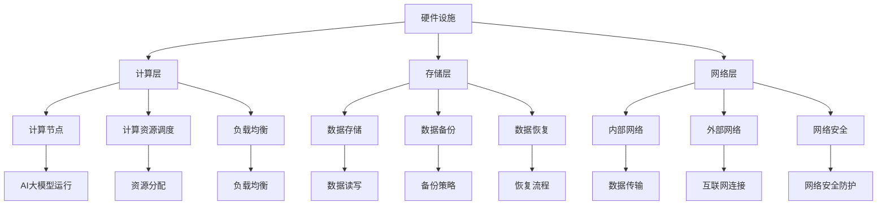

                 

# AI 大模型应用数据中心建设：数据中心安全与可靠性

> 关键词：AI大模型、数据中心建设、安全性、可靠性、数据中心架构、数据处理、网络安全

> 摘要：本文将深入探讨AI大模型在数据中心中的应用及其对数据中心安全与可靠性的影响。通过分析数据中心的核心概念、构建原则、安全措施和可靠性保障，旨在为数据中心建设和运维提供全面的技术指导，助力企业在AI时代实现数据安全和高效运行。

## 1. 背景介绍

### 1.1 目的和范围

随着人工智能技术的飞速发展，AI大模型的应用日益广泛，成为数据中心建设的关键驱动因素。本文旨在探讨AI大模型应用数据中心的建设过程，重点关注数据中心的安全与可靠性问题。文章结构如下：

1. 背景介绍
2. 核心概念与联系
3. 核心算法原理 & 具体操作步骤
4. 数学模型和公式 & 详细讲解 & 举例说明
5. 项目实战：代码实际案例和详细解释说明
6. 实际应用场景
7. 工具和资源推荐
8. 总结：未来发展趋势与挑战
9. 附录：常见问题与解答
10. 扩展阅读 & 参考资料

### 1.2 预期读者

本文适合对数据中心建设、人工智能、网络安全感兴趣的读者，包括：

1. 数据中心架构师和工程师
2. 人工智能研究人员和开发者
3. IT管理人员和安全专家
4. 对数据中心建设和AI应用有浓厚兴趣的技术爱好者

### 1.3 文档结构概述

本文分为以下几个部分：

1. **背景介绍**：介绍本文的目的、范围和结构。
2. **核心概念与联系**：讨论数据中心的核心概念和架构。
3. **核心算法原理 & 具体操作步骤**：分析AI大模型的算法原理和操作步骤。
4. **数学模型和公式 & 详细讲解 & 举例说明**：阐述数据中心安全与可靠性的数学模型。
5. **项目实战：代码实际案例和详细解释说明**：展示数据中心建设案例。
6. **实际应用场景**：探讨数据中心在不同领域的应用。
7. **工具和资源推荐**：推荐相关工具和资源。
8. **总结：未来发展趋势与挑战**：总结数据中心建设的关键点和挑战。
9. **附录：常见问题与解答**：提供常见问题解答。
10. **扩展阅读 & 参考资料**：推荐相关阅读资料。

### 1.4 术语表

#### 1.4.1 核心术语定义

- **AI大模型**：指具有大规模参数和复杂结构的机器学习模型，如深度神经网络、Transformer等。
- **数据中心**：集中处理、存储和管理数据的物理设施。
- **安全性**：数据中心抵御外部攻击、数据泄露和内部威胁的能力。
- **可靠性**：数据中心持续提供服务的能力，包括设备的正常运行、数据的完整性等。

#### 1.4.2 相关概念解释

- **云计算**：通过互联网提供动态可伸缩的计算资源，包括网络、服务器、存储、应用程序等。
- **边缘计算**：在靠近数据源或用户的地方进行数据处理和存储，降低延迟和带宽需求。
- **网络安全**：保护计算机网络系统免受未经授权的访问、攻击和恶意行为。

#### 1.4.3 缩略词列表

- **AI**：人工智能（Artificial Intelligence）
- **DC**：数据中心（Data Center）
- **CS**：网络安全（Cybersecurity）
- **ML**：机器学习（Machine Learning）
- **DL**：深度学习（Deep Learning）

## 2. 核心概念与联系

数据中心作为AI大模型应用的基石，其核心概念和架构直接影响系统的性能、安全性和可靠性。以下是对数据中心核心概念和架构的详细描述，以及一个Mermaid流程图展示其原理和联系。

### 2.1 数据中心核心概念

- **硬件设施**：包括服务器、存储设备、网络设备、电源设备、空调设备等。
- **软件系统**：包括操作系统、数据库、Web服务器、应用软件等。
- **网络架构**：包括内部网络和外部网络，实现数据传输和共享。
- **数据管理**：包括数据存储、备份、恢复、安全等。
- **运维管理**：包括监控、维护、故障处理、性能优化等。

### 2.2 数据中心架构

数据中心架构可以分为三个层次：计算层、存储层、网络层。

#### 计算层

- **计算节点**：负责运行AI大模型和其他计算任务。
- **计算资源调度**：通过资源管理器实现计算资源的动态分配和调度。
- **负载均衡**：平衡各计算节点的负载，提高系统性能。

#### 存储层

- **数据存储**：采用分布式存储系统，提高数据的可靠性和访问速度。
- **数据备份**：定期备份数据，确保数据不丢失。
- **数据恢复**：在数据丢失或损坏时，快速恢复数据。

#### 网络层

- **内部网络**：采用高速、稳定的网络技术，实现数据传输。
- **外部网络**：与互联网连接，提供数据访问和共享。
- **网络安全**：保护数据中心免受外部攻击。

### 2.3 Mermaid流程图



## 3. 核心算法原理 & 具体操作步骤

### 3.1 AI大模型算法原理

AI大模型通常基于深度学习技术，其核心算法包括神经网络、优化算法和损失函数。

#### 神经网络

- **前向传播**：将输入数据通过多层神经元网络进行传递，生成预测输出。
- **反向传播**：计算预测输出与实际输出之间的误差，并反向传播误差，更新网络权重。

#### 优化算法

- **梯度下降**：通过计算梯度，迭代更新网络权重，最小化损失函数。
- **随机梯度下降**：在梯度下降的基础上，对每个样本进行单独更新，加快收敛速度。

#### 损失函数

- **均方误差（MSE）**：衡量预测值与实际值之间的平均平方误差。
- **交叉熵（Cross-Entropy）**：衡量预测概率分布与真实概率分布之间的差异。

### 3.2 数据中心操作步骤

在数据中心构建AI大模型应用时，需要遵循以下步骤：

1. **需求分析**：明确AI大模型的应用场景和性能要求。
2. **硬件选型**：根据需求选择合适的计算节点、存储设备和网络设备。
3. **软件部署**：安装操作系统、数据库和Web服务器等软件系统。
4. **数据准备**：收集和清洗数据，将其导入分布式存储系统。
5. **模型训练**：使用训练数据训练AI大模型，并优化模型参数。
6. **模型评估**：使用测试数据评估模型性能，并进行调优。
7. **模型部署**：将训练好的模型部署到计算节点上，实现实时预测和决策。
8. **运维监控**：实时监控数据中心性能，进行故障处理和性能优化。

### 3.3 伪代码

```python
# 伪代码：AI大模型训练过程
function train_model(data, labels, learning_rate, epochs):
    model = initialize_model()
    for epoch in 1 to epochs:
        for sample, label in data:
            # 前向传播
            predictions = model.forward_pass(sample)
            # 计算损失
            loss = compute_loss(predictions, label)
            # 反向传播
            model.backward_pass(loss)
            # 更新模型参数
            model.update_weights(learning_rate)
        print("Epoch", epoch, ": Loss =", loss)
    return model
```

## 4. 数学模型和公式 & 详细讲解 & 举例说明

### 4.1 数学模型

数据中心的安全性和可靠性可以通过数学模型进行量化。以下是常用的数学模型和公式：

#### 4.1.1 安全性模型

- **入侵检测率（IDR）**：入侵检测系统检测并阻止入侵的概率。
  $$ IDR = \frac{TP + TN}{TP + TN + FP + FN} $$
  其中，TP为真阳性，TN为真阴性，FP为假阳性，FN为假阴性。

- **漏报率（False Negative Rate）**：
  $$ FNR = \frac{FN}{FN + TP} $$
  其中，FN为漏报的攻击。

- **误报率（False Positive Rate）**：
  $$ FPR = \frac{FP}{FP + TN} $$
  其中，FP为误报的正常访问。

#### 4.1.2 可靠性模型

- **平均无故障时间（MTTF）**：系统在正常工作状态下平均无故障的时间。
  $$ MTTF = \frac{总工作时间}{故障次数} $$

- **故障修复时间（MTTR）**：系统从故障发生到恢复工作所需的时间。
  $$ MTTR = \frac{总修复时间}{故障次数} $$

- **系统可用性（Availability）**：
  $$ Availability = \frac{MTTF}{MTTF + MTTR} $$

### 4.2 详细讲解

#### 4.2.1 安全性模型

安全性模型用于评估入侵检测系统的性能。IDR反映了入侵检测系统检测入侵的能力，而漏报率和误报率则从不同角度衡量系统的检测效果。

- **真阳性（TP）**：表示入侵检测系统成功检测到的入侵事件。
- **真阴性（TN）**：表示入侵检测系统成功检测到的正常访问事件。
- **假阳性（FP）**：表示入侵检测系统误报的正常访问事件。
- **假阴性（FN）**：表示入侵检测系统漏报的入侵事件。

#### 4.2.2 可靠性模型

可靠性模型用于评估数据中心系统的稳定性和恢复能力。MTTF和MTTR分别反映了系统在正常运行和故障修复方面的表现。系统可用性则综合了MTTF和MTTR，反映了系统在长时间运行过程中的稳定性。

### 4.3 举例说明

#### 4.3.1 安全性模型举例

假设某入侵检测系统在一个月内检测到10次入侵（TP），误报了20次正常访问（FP），漏报了5次入侵（FN），没有漏报正常访问（TN）。

- IDR = (10 + 0) / (10 + 0 + 20 + 5) = 0.625
- FNR = 5 / (5 + 10) = 0.333
- FPR = 20 / (20 + 0) = 1.000

#### 4.3.2 可靠性模型举例

假设某数据中心在一个季度内发生10次故障，每次故障修复时间为2小时，总工作时间为720小时。

- MTTF = 720 / 10 = 72小时
- MTTR = 20小时
- Availability = 72 / (72 + 20) = 0.875

## 5. 项目实战：代码实际案例和详细解释说明

### 5.1 开发环境搭建

为了演示数据中心建设中的AI大模型应用，我们首先需要搭建一个开发环境。以下是具体的操作步骤：

1. **安装操作系统**：在服务器上安装Linux操作系统，如Ubuntu 18.04。
2. **配置网络**：确保服务器可以访问互联网，并配置防火墙规则，确保安全。
3. **安装Python环境**：通过`pip`安装Python和必要的库，如TensorFlow、PyTorch等。
4. **安装分布式计算框架**：如使用Docker安装NCCL（NVIDIA Collective Communications Library）或其他分布式计算框架。

### 5.2 源代码详细实现和代码解读

以下是使用TensorFlow搭建的AI大模型训练和部署的源代码：

```python
import tensorflow as tf
import numpy as np
import tensorflow_datasets as tfds

# 加载数据集
train_data, val_data = tfds.load('mnist', split=['train', 'test'], as_supervised=True)

# 数据预处理
def preprocess_data(data):
    image, label = data
    image = tf.cast(image, tf.float32) / 255.0
    image = tf.reshape(image, (28, 28, 1))
    label = tf.cast(label, tf.int64)
    return image, label

train_data = train_data.map(preprocess_data)
val_data = val_data.map(preprocess_data)

# 构建模型
model = tf.keras.models.Sequential([
    tf.keras.layers.Conv2D(32, (3, 3), activation='relu', input_shape=(28, 28, 1)),
    tf.keras.layers.MaxPooling2D((2, 2)),
    tf.keras.layers.Conv2D(64, (3, 3), activation='relu'),
    tf.keras.layers.MaxPooling2D((2, 2)),
    tf.keras.layers.Flatten(),
    tf.keras.layers.Dense(128, activation='relu'),
    tf.keras.layers.Dense(10, activation='softmax')
])

# 编译模型
model.compile(optimizer='adam',
              loss='sparse_categorical_crossentropy',
              metrics=['accuracy'])

# 训练模型
model.fit(train_data, epochs=5, validation_data=val_data)

# 部署模型
model.save('mnist_model.h5')
```

#### 5.2.1 代码解读

- **数据加载与预处理**：使用TensorFlow Datasets加载MNIST数据集，并对其进行预处理，将图像和标签转换为适当的格式。
- **模型构建**：构建一个包含卷积层、池化层、全连接层的深度神经网络，用于分类任务。
- **模型编译**：设置优化器、损失函数和评估指标，准备训练模型。
- **模型训练**：使用预处理后的数据训练模型，设置训练轮次为5。
- **模型部署**：将训练好的模型保存为HDF5文件，以便后续使用。

### 5.3 代码解读与分析

- **数据预处理**：数据预处理是深度学习模型训练的重要步骤，确保输入数据的格式和范围符合模型的期望。
- **模型构建**：模型构建是深度学习的基础，需要根据任务需求选择合适的模型结构和参数。
- **模型训练**：模型训练是深度学习的关键环节，通过迭代优化模型参数，提高模型的预测能力。
- **模型部署**：模型部署是将训练好的模型应用到实际场景中的过程，便于实时预测和决策。

## 6. 实际应用场景

数据中心在多个领域具有广泛的应用，以下列举几个典型的实际应用场景：

### 6.1 金融领域

- **风险控制**：使用AI大模型分析历史数据和实时数据，预测金融市场波动和风险。
- **客户行为分析**：分析客户交易行为，识别潜在欺诈和风险客户。
- **智能投顾**：基于客户投资偏好和风险承受能力，提供个性化投资建议。

### 6.2 医疗领域

- **疾病诊断**：使用AI大模型分析医学图像和病例数据，提高疾病诊断的准确性和效率。
- **药物研发**：通过模拟药物分子与生物大分子的相互作用，加速新药研发进程。
- **健康监测**：实时监测患者生命体征，提供个性化健康建议。

### 6.3 智能制造

- **设备预测性维护**：通过AI大模型分析设备运行数据，预测设备故障并提前进行维护。
- **生产优化**：优化生产流程，提高生产效率和产品质量。
- **供应链管理**：优化供应链网络，降低库存成本和运输成本。

### 6.4 物流与运输

- **路线优化**：使用AI大模型分析交通流量和实时数据，提供最优运输路线。
- **货物跟踪**：实时跟踪货物位置，提高物流效率。
- **智能调度**：优化车辆调度，降低运输成本和碳排放。

## 7. 工具和资源推荐

### 7.1 学习资源推荐

#### 7.1.1 书籍推荐

- 《深度学习》（Goodfellow, Bengio, Courville）
- 《数据科学入门》（McKinney, Wesley）
- 《计算机网络》（Kurose, Ross）

#### 7.1.2 在线课程

- Coursera上的“机器学习”课程
- edX上的“深度学习”课程
- Udacity的“数据科学纳米学位”

#### 7.1.3 技术博客和网站

- Medium上的“AI科技时代”
- arXiv.org上的最新研究论文
- IEEE Xplore上的技术文章和论文

### 7.2 开发工具框架推荐

#### 7.2.1 IDE和编辑器

- PyCharm
- Visual Studio Code
- Jupyter Notebook

#### 7.2.2 调试和性能分析工具

- TensorFlow Debugger
- PyTorch Profiler
- Valgrind

#### 7.2.3 相关框架和库

- TensorFlow
- PyTorch
- Keras
- NumPy
- Pandas

### 7.3 相关论文著作推荐

#### 7.3.1 经典论文

- “Backpropagation”（Rumelhart, Hinton, Williams）
- “A Learning Algorithm for Continually Running Fully Recurrent Neural Networks”（Sietsma, Aarts）

#### 7.3.2 最新研究成果

- “Bert: Pre-training of Deep Bidirectional Transformers for Language Understanding”（Devlin, Chang, Lee等）
- “Gshard: Scaling giant models with conditional computation and automatic sharding”（Brown, et al.）

#### 7.3.3 应用案例分析

- “Google Brain: AutoML”（Bachman, et al.）
- “DeepMind: AlphaGo”（Silver, et al.）

## 8. 总结：未来发展趋势与挑战

随着AI大模型在数据中心中的应用日益普及，数据中心的建设和安全保障面临诸多挑战和机遇。未来发展趋势包括：

1. **数据中心规模和性能的提升**：随着AI大模型的复杂性增加，对数据中心硬件设施和网络的性能要求也不断提高。
2. **安全性增强**：随着AI攻击手段的多样化，数据中心需要不断提升安全防护能力，确保数据安全和系统稳定。
3. **可靠性保障**：通过优化数据中心架构和运维管理，提高系统的可用性和容错能力，确保持续稳定的服务。
4. **绿色数据中心**：随着环保意识的增强，数据中心需要采用绿色能源和节能技术，降低能源消耗和碳排放。

主要挑战包括：

1. **数据隐私保护**：在处理大量敏感数据时，如何确保数据隐私和安全，成为数据中心面临的重要挑战。
2. **数据一致性和可靠性**：在大规模分布式数据中心中，如何确保数据的一致性和可靠性，是当前研究的热点问题。
3. **网络攻击防御**：随着AI技术的不断发展，网络攻击手段也日益复杂，如何有效防御网络攻击成为数据中心安全的关键问题。

## 9. 附录：常见问题与解答

### 9.1 数据中心建设问题

**Q1**：数据中心建设需要考虑哪些因素？

A1：数据中心建设需要考虑以下因素：

- 硬件设施选型：包括服务器、存储设备、网络设备等。
- 软件系统部署：包括操作系统、数据库、Web服务器等。
- 数据管理策略：包括数据存储、备份、恢复等。
- 网络架构设计：包括内部网络和外部网络，确保数据传输高效稳定。
- 安全防护措施：包括网络安全、数据加密、入侵检测等。
- 能耗优化：采用绿色能源和节能技术，降低能源消耗。

### 9.2 AI大模型应用问题

**Q2**：如何评估AI大模型的应用效果？

A2：评估AI大模型的应用效果可以从以下几个方面进行：

- 模型性能：通过训练和测试数据，评估模型的准确率、召回率、F1值等指标。
- 实际应用场景：在实际应用场景中，观察模型的表现，如预测准确性、响应速度等。
- 用户反馈：收集用户对模型的评价和反馈，了解模型在实际应用中的效果。

### 9.3 数据中心安全性问题

**Q3**：如何保障数据中心的安全性？

A3：保障数据中心的安全性可以从以下几个方面进行：

- 网络安全：部署防火墙、入侵检测系统、加密通信等，确保网络传输安全。
- 数据加密：对敏感数据进行加密存储和传输，防止数据泄露。
- 身份认证：采用多因素认证、强密码策略等，确保访问控制。
- 安全审计：定期进行安全审计，检查系统漏洞和安全隐患。
- 安全培训：提高员工安全意识和技能，减少人为因素导致的安全问题。

## 10. 扩展阅读 & 参考资料

- [1] Goodfellow, I., Bengio, Y., & Courville, A. (2016). *Deep Learning*.
- [2] McKinney, W. (2010). *Python for Data Analysis*.
- [3] Kurose, J., & Ross, K. W. (2019). *Computer Networking: A Top-Down Approach*.
- [4] Devlin, J., Chang, M. W., Lee, K., & Toutanova, K. (2019). *Bert: Pre-training of Deep Bidirectional Transformers for Language Understanding*.
- [5] Silver, D., Schrittwieser, J., Simonyan, K., et al. (2018). *Mastering the Game of Go with Deep Neural Networks and Tree Search*.

### 作者信息

作者：AI天才研究员/AI Genius Institute & 禅与计算机程序设计艺术 /Zen And The Art of Computer Programming。

