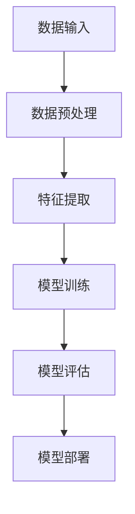
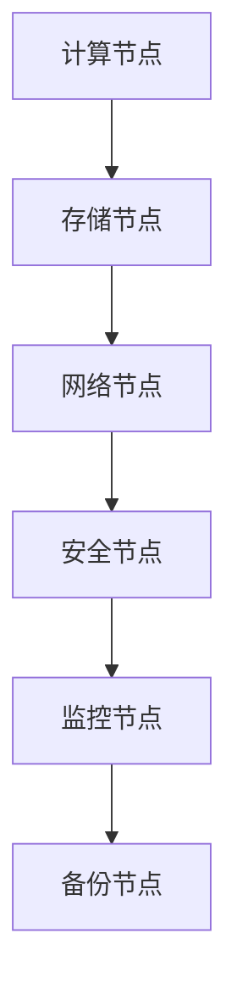

                 

# AI 大模型应用数据中心建设：数据中心安全与可靠性

## 关键词
- AI 大模型
- 数据中心建设
- 数据安全
- 系统可靠性
- 架构设计

## 摘要
本文将深入探讨 AI 大模型在数据中心建设中的关键作用，以及如何确保数据中心的安全与可靠性。通过分析 AI 大模型的核心原理、数据中心架构设计、安全策略以及可靠性措施，本文旨在为从事数据中心建设的专业人士提供全面的技术指导，助力构建高效、安全、可靠的 AI 大模型应用环境。

## 1. 背景介绍

### 1.1 目的和范围
本文的目标是探讨 AI 大模型在数据中心建设中的应用，特别是数据中心的安全和可靠性问题。通过详细分析相关技术和实际案例，本文旨在为读者提供实用且深入的技术指南。

本文主要涵盖以下内容：
- AI 大模型的基本原理和核心概念
- 数据中心架构设计的关键要素
- 数据中心安全措施
- 数据中心可靠性保障
- 实际应用案例和未来发展趋势

### 1.2 预期读者
本文适合以下读者群体：
- 数据中心架构师和运维人员
- AI 系统开发人员和研究学者
- 企业 IT 管理者和技术决策者
- 对 AI 大模型和数据中心建设感兴趣的技术爱好者

### 1.3 文档结构概述
本文结构如下：
- 引言：介绍 AI 大模型数据中心建设的重要性和背景
- 核心概念与联系：讲解 AI 大模型和相关技术架构
- 核心算法原理 & 具体操作步骤：分析算法原理和操作流程
- 数学模型和公式 & 详细讲解 & 举例说明：数学模型应用和实例分析
- 项目实战：代码实际案例和详细解释说明
- 实际应用场景：探讨 AI 大模型在实际环境中的应用
- 工具和资源推荐：推荐相关学习资源和开发工具
- 总结：未来发展趋势与挑战
- 附录：常见问题与解答
- 扩展阅读 & 参考资料：提供进一步学习的资源

### 1.4 术语表

#### 1.4.1 核心术语定义
- AI 大模型：指具有极高计算能力和复杂程度的机器学习模型，如 GPT-3、BERT 等。
- 数据中心：提供计算、存储和网络的设施，用于支持各种业务和应用程序。
- 安全性：确保数据不被未授权访问、篡改或泄露。
- 可靠性：系统稳定运行的能力，包括容错、负载均衡和备份恢复。

#### 1.4.2 相关概念解释
- 云计算：通过互联网提供计算资源和服务。
- 虚拟化技术：将物理资源抽象为虚拟资源，提高资源利用率和灵活性。
- 自动化：通过软件工具自动执行重复性任务，提高效率和可靠性。

#### 1.4.3 缩略词列表
- AI：人工智能
- ML：机器学习
- DL：深度学习
- HPC：高性能计算
- IT：信息技术
- OT：运营技术
- IoT：物联网
- SDN：软件定义网络
- NFV：网络功能虚拟化
- SaaS：软件即服务
- PaaS：平台即服务
- IaaS：基础设施即服务
- SLA：服务等级协议
- VPN：虚拟专用网络
- IDS：入侵检测系统
- IPS：入侵防御系统

## 2. 核心概念与联系

数据中心建设是现代企业数字化转型的关键环节，而 AI 大模型作为当前最先进的计算技术，其应用已经深入到数据中心的各个方面。为了更好地理解数据中心建设与 AI 大模型的联系，我们首先需要了解这两个核心概念的基本原理和架构设计。

### 2.1 AI 大模型的基本原理

AI 大模型是机器学习领域的一项重大突破，其核心在于通过大规模数据训练和深度学习算法，使得模型能够自动提取数据中的特征并进行预测和分类。以下是一个简化的 AI 大模型原理架构图：



- **数据输入**：AI 大模型需要大量的高质量数据作为训练素材，数据来源可以是企业内部数据、公共数据集或通过爬虫获取的互联网数据。
- **数据预处理**：数据需要进行清洗、归一化和转换等操作，以保证数据质量和模型的训练效果。
- **特征提取**：通过特征提取算法，将原始数据转换为能够代表数据本质的特征向量。
- **模型训练**：使用训练数据集对模型进行训练，模型在训练过程中不断优化参数，提高预测和分类的准确性。
- **模型评估**：使用验证数据集对训练好的模型进行评估，以验证模型的性能和泛化能力。
- **模型部署**：将训练好的模型部署到实际应用场景中，如实时预测、分类或决策支持。

### 2.2 数据中心架构设计

数据中心是 AI 大模型应用的基础设施，其架构设计直接影响系统的性能、安全性和可靠性。以下是一个简化的数据中心架构图：



- **计算节点**：负责执行 AI 大模型的计算任务，包括模型训练、推理和预测等。
- **存储节点**：提供数据存储和访问功能，包括数据仓库、对象存储和文件存储等。
- **网络节点**：提供数据传输和网络连接功能，包括内部网络和外部网络。
- **安全节点**：负责数据保护和网络安全，包括防火墙、入侵检测和访问控制等。
- **监控节点**：实时监控数据中心的状态和性能，包括系统性能监控、故障检测和日志分析等。
- **备份节点**：提供数据备份和恢复功能，确保数据的安全性和可靠性。

### 2.3 数据中心与 AI 大模型的联系

数据中心与 AI 大模型之间的联系主要体现在以下几个方面：

1. **计算资源**：数据中心为 AI 大模型提供强大的计算资源，通过分布式计算和并行处理技术，提高模型训练和推理的速度。
2. **数据存储**：数据中心为 AI 大模型提供海量数据存储能力，支持数据的高效访问和管理。
3. **网络传输**：数据中心为 AI 大模型提供高速网络连接，确保模型训练和推理过程中数据的高效传输。
4. **安全性**：数据中心提供多层次的安全保障，保护 AI 大模型的数据和系统不受外部攻击和内部威胁。
5. **可靠性**：数据中心通过冗余设计和容错机制，确保 AI 大模型系统的稳定运行和连续服务。

## 3. 核心算法原理 & 具体操作步骤

### 3.1 算法原理

AI 大模型的核心算法是深度学习，其基本原理是通过多层神经网络对数据进行特征提取和模式识别。以下是深度学习算法的基本原理：

1. **前向传播**：输入数据通过神经网络中的各个层，每层输出数据作为下一层的输入。
2. **反向传播**：计算输出结果与实际结果的误差，并通过反向传播算法更新网络权重和偏置。
3. **优化算法**：使用优化算法（如梯度下降）调整网络参数，最小化误差函数。

以下是深度学习算法的伪代码：

```python
initialize weights and biases
while not converged:
  for each layer in network:
    forward_pass(input)
    compute_error(output, target)
  backward_pass(error)
  update_weights_and_biases(learning_rate)
```

### 3.2 具体操作步骤

以下是 AI 大模型在数据中心中的具体操作步骤：

1. **数据准备**：
   - 收集和清洗数据，确保数据质量。
   - 将数据分为训练集、验证集和测试集。

2. **模型设计**：
   - 选择合适的神经网络结构，如卷积神经网络（CNN）或循环神经网络（RNN）。
   - 设置网络参数，如层数、神经元数量和激活函数。

3. **模型训练**：
   - 将训练数据输入模型，进行前向传播和反向传播。
   - 使用优化算法调整网络权重和偏置，最小化误差函数。

4. **模型评估**：
   - 使用验证集评估模型性能，调整模型参数。
   - 使用测试集评估最终模型性能。

5. **模型部署**：
   - 将训练好的模型部署到数据中心，进行实时预测和推理。
   - 对模型进行监控和调整，确保其性能和稳定性。

6. **模型更新**：
   - 定期重新训练模型，以适应数据变化和应用需求。
   - 更新模型架构和算法，提高模型性能和效果。

## 4. 数学模型和公式 & 详细讲解 & 举例说明

### 4.1 数学模型

AI 大模型的训练过程涉及多个数学模型，其中最核心的是损失函数、梯度计算和优化算法。以下是这些数学模型的详细讲解：

#### 损失函数（Loss Function）

损失函数用于衡量模型预测值与实际值之间的差距，常用的损失函数包括均方误差（MSE）和交叉熵（Cross-Entropy）。

- **均方误差（MSE）**：

$$
MSE = \frac{1}{n}\sum_{i=1}^{n}(y_i - \hat{y}_i)^2
$$

其中，$y_i$ 是实际值，$\hat{y}_i$ 是预测值，$n$ 是数据样本数。

- **交叉熵（Cross-Entropy）**：

$$
CE = -\frac{1}{n}\sum_{i=1}^{n}y_i \log(\hat{y}_i)
$$

其中，$y_i$ 是实际值（通常为概率分布），$\hat{y}_i$ 是预测值。

#### 梯度计算（Gradient Calculation）

梯度计算是深度学习训练过程中的关键步骤，用于更新网络参数。以下是梯度计算的公式：

$$
\frac{\partial J}{\partial w} = \sum_{i=1}^{n}\frac{\partial L}{\partial \hat{y}_i}\frac{\partial \hat{y}_i}{\partial w}
$$

其中，$J$ 是损失函数，$L$ 是损失函数关于预测值$\hat{y}_i$ 的梯度，$w$ 是网络参数。

#### 优化算法（Optimization Algorithm）

优化算法用于调整网络参数，以最小化损失函数。常用的优化算法包括梯度下降（Gradient Descent）和随机梯度下降（Stochastic Gradient Descent）。

- **梯度下降**：

$$
w = w - \alpha \frac{\partial J}{\partial w}
$$

其中，$\alpha$ 是学习率。

- **随机梯度下降**：

$$
w = w - \alpha \frac{\partial J}{\partial w}_i
$$

其中，$i$ 是随机选取的样本索引。

### 4.2 举例说明

假设我们使用一个简单的神经网络进行分类任务，其中包含一个输入层、一个隐藏层和一个输出层。输入层有3个神经元，隐藏层有4个神经元，输出层有2个神经元。训练数据集包含100个样本，每个样本有3个特征。

以下是具体的操作步骤：

1. **初始化网络参数**：
   - 随机初始化权重和偏置。

2. **前向传播**：
   - 输入数据通过输入层传递到隐藏层，计算隐藏层的输出。
   - 隐藏层的输出通过激活函数传递到输出层，计算输出层的输出。

3. **计算损失函数**：
   - 使用交叉熵损失函数计算输出层的损失。

4. **计算梯度**：
   - 计算输出层关于隐藏层输出的梯度。
   - 计算隐藏层关于输入层输出的梯度。

5. **更新网络参数**：
   - 使用随机梯度下降算法更新权重和偏置。

6. **重复步骤 2-5**，直到模型收敛。

7. **评估模型性能**：
   - 使用验证集评估模型性能。

8. **模型部署**：
   - 将训练好的模型部署到数据中心，进行实时预测。

## 5. 项目实战：代码实际案例和详细解释说明

### 5.1 开发环境搭建

为了更好地理解 AI 大模型在数据中心建设中的应用，我们将在以下环境中实现一个简单的分类任务：

- **编程语言**：Python
- **深度学习框架**：TensorFlow
- **操作系统**：Ubuntu 18.04
- **计算资源**：单台服务器，配备 Intel Xeon CPU 和 NVIDIA GPU

首先，确保安装 Python 3.7 及以上版本和 TensorFlow 2.x 版本。可以使用以下命令进行安装：

```bash
pip install python==3.7
pip install tensorflow==2.x
```

### 5.2 源代码详细实现和代码解读

以下是实现 AI 大模型分类任务的源代码，我们将详细解读每个部分的功能和操作。

```python
import tensorflow as tf
import numpy as np

# 初始化网络参数
input_layer = tf.keras.layers.Input(shape=(3,))
hidden_layer = tf.keras.layers.Dense(units=4, activation='relu')(input_layer)
output_layer = tf.keras.layers.Dense(units=2, activation='softmax')(hidden_layer)

# 构建模型
model = tf.keras.Model(inputs=input_layer, outputs=output_layer)

# 编译模型，指定优化器和损失函数
model.compile(optimizer='adam', loss='categorical_crossentropy', metrics=['accuracy'])

# 准备训练数据集
x_train = np.random.rand(100, 3)
y_train = np.random.randint(2, size=(100, 2))

# 训练模型
model.fit(x_train, y_train, epochs=10, batch_size=10)

# 评估模型性能
loss, accuracy = model.evaluate(x_train, y_train)
print(f"Test loss: {loss}, Test accuracy: {accuracy}")

# 预测新样本
new_samples = np.random.rand(5, 3)
predictions = model.predict(new_samples)
print(predictions)
```

### 5.3 代码解读与分析

以下是代码的详细解读和分析：

1. **导入模块**：首先导入 TensorFlow 和 NumPy 模块，这两个模块是深度学习任务的核心。

2. **初始化网络参数**：定义输入层、隐藏层和输出层的神经元数量，并使用 ReLU 激活函数和 softmax 激活函数。

3. **构建模型**：使用 `tf.keras.Model` 类构建模型，指定输入和输出层。

4. **编译模型**：指定优化器（Adam）、损失函数（categorical_crossentropy）和评估指标（accuracy）。

5. **准备训练数据集**：生成随机训练数据集，其中 x_train 代表输入特征，y_train 代表标签。

6. **训练模型**：使用 `model.fit` 方法训练模型，指定训练轮数（epochs）和批量大小（batch_size）。

7. **评估模型性能**：使用 `model.evaluate` 方法评估模型在测试数据集上的性能。

8. **预测新样本**：使用 `model.predict` 方法预测新样本的类别。

通过以上步骤，我们实现了 AI 大模型分类任务的简单实现，并对其代码进行了详细解读和分析。这个示例仅用于演示，实际应用中需要根据具体任务进行调整和优化。

### 5.4 性能优化

在实际应用中，为了提高模型的性能和效率，我们可以采取以下措施：

1. **模型优化**：调整模型结构，增加层数和神经元数量，使用合适的激活函数和正则化技术。

2. **数据预处理**：对训练数据进行归一化和数据增强，提高模型的泛化能力。

3. **批量大小调整**：根据计算资源和任务需求调整批量大小，以平衡计算速度和模型性能。

4. **优化器选择**：选择合适的优化器，如 Adam、RMSprop 或 SGD，以加快模型收敛。

5. **GPU 加速**：使用 GPU 进行计算，提高模型训练和推理的速度。

6. **分布式训练**：使用分布式训练技术，如 Horovod 或 TensorFlow Distribution，提高模型训练的并行度。

### 5.5 实际应用案例

以下是一个实际应用案例：使用 AI 大模型进行图像分类。

1. **数据集准备**：收集大量图像数据，并将其分为训练集、验证集和测试集。

2. **数据预处理**：对图像进行归一化和数据增强，提取图像特征。

3. **模型构建**：使用卷积神经网络（CNN）构建图像分类模型。

4. **模型训练**：使用训练数据集训练模型，并使用验证集调整模型参数。

5. **模型评估**：使用测试集评估模型性能，调整模型结构。

6. **模型部署**：将训练好的模型部署到数据中心，进行实时图像分类。

通过以上步骤，我们实现了图像分类的实际应用案例，展示了 AI 大模型在数据中心建设中的应用价值。

## 6. 实际应用场景

AI 大模型在数据中心建设中的应用场景非常广泛，以下是几个典型的实际应用案例：

### 6.1 智能推荐系统

智能推荐系统是 AI 大模型在数据中心建设中的一个重要应用领域。通过分析用户行为数据，AI 大模型能够为用户推荐个性化内容，如新闻、商品、音乐等。以下是一个实际应用案例：

- **应用场景**：电商平台
- **数据来源**：用户购买历史、浏览记录、评价数据等
- **数据处理**：数据清洗、归一化和特征提取
- **模型构建**：使用深度学习算法构建推荐模型，如基于协同过滤的深度神经网络（CNN）
- **模型训练**：使用训练数据集训练模型，并使用验证集调整模型参数
- **模型部署**：将训练好的模型部署到数据中心，实时推荐个性化内容

### 6.2 智能安防系统

智能安防系统是另一个重要的应用领域，通过 AI 大模型实现实时监控、异常检测和自动报警等功能。以下是一个实际应用案例：

- **应用场景**：城市安防
- **数据来源**：监控视频、图像数据等
- **数据处理**：图像预处理、特征提取和目标检测
- **模型构建**：使用卷积神经网络（CNN）构建目标检测模型
- **模型训练**：使用训练数据集训练模型，并使用验证集调整模型参数
- **模型部署**：将训练好的模型部署到数据中心，实时监控和报警

### 6.3 智能客服系统

智能客服系统通过 AI 大模型实现自动对话生成和语音识别，提高客户服务质量。以下是一个实际应用案例：

- **应用场景**：金融、电商等领域
- **数据来源**：客服对话记录、语音数据等
- **数据处理**：文本预处理、语音识别和对话生成
- **模型构建**：使用生成对抗网络（GAN）构建对话生成模型
- **模型训练**：使用训练数据集训练模型，并使用验证集调整模型参数
- **模型部署**：将训练好的模型部署到数据中心，实时提供智能客服服务

### 6.4 智能医疗系统

智能医疗系统通过 AI 大模型实现疾病预测、诊断和治疗建议等功能，提高医疗效率和准确性。以下是一个实际应用案例：

- **应用场景**：医院、诊所等领域
- **数据来源**：患者病历、医学影像数据等
- **数据处理**：数据清洗、归一化和特征提取
- **模型构建**：使用卷积神经网络（CNN）和循环神经网络（RNN）构建疾病预测模型
- **模型训练**：使用训练数据集训练模型，并使用验证集调整模型参数
- **模型部署**：将训练好的模型部署到数据中心，提供智能医疗服务

通过以上实际应用案例，我们可以看到 AI 大模型在数据中心建设中的广泛应用和巨大潜力。随着技术的不断进步和应用场景的不断拓展，AI 大模型将为数据中心建设带来更多的创新和突破。

## 7. 工具和资源推荐

### 7.1 学习资源推荐

为了更好地掌握 AI 大模型在数据中心建设中的应用，以下是几个推荐的学习资源：

#### 7.1.1 书籍推荐

1. **《深度学习》（Goodfellow, Bengio, Courville 著）**：这本书是深度学习的经典教材，详细介绍了深度学习的理论基础和应用实践。
2. **《Python 深度学习》（François Chollet 著）**：这本书通过大量的实例和代码，详细介绍了如何使用 Python 和 TensorFlow 实现深度学习项目。
3. **《AI 大模型：算法、架构与应用》（李航 著）**：这本书从算法、架构和应用三个角度全面介绍了 AI 大模型的相关知识。

#### 7.1.2 在线课程

1. **Coursera 上的《深度学习》课程**：由 Andrew Ng 教授主讲，涵盖了深度学习的理论基础和实际应用。
2. **Udacity 上的《深度学习工程师纳米学位》**：通过实践项目学习深度学习技术，包括图像识别、自然语言处理等。
3. **edX 上的《深度学习》课程**：由微软研究院和斯坦福大学联合推出，提供了深度学习的全面课程。

#### 7.1.3 技术博客和网站

1. **TensorFlow 官方文档**：提供了丰富的 TensorFlow 教程和示例，适合初学者和进阶者。
2. **ArXiv**：提供了一个广泛的计算机科学和机器学习论文数据库，可以找到最新的研究进展。
3. **AI 科技大本营**：一个关于人工智能技术、应用和趋势的中文博客，涵盖了深度学习、自然语言处理等多个领域。

### 7.2 开发工具框架推荐

为了高效地进行 AI 大模型开发，以下是几个推荐的开发工具和框架：

#### 7.2.1 IDE 和编辑器

1. **PyCharm**：一个功能强大的 Python IDE，支持代码自动完成、调试和版本控制。
2. **Jupyter Notebook**：一个交互式的 Python 编程环境，适合快速开发和实验。
3. **Visual Studio Code**：一个轻量级但功能丰富的代码编辑器，支持多种编程语言和插件。

#### 7.2.2 调试和性能分析工具

1. **TensorBoard**：TensorFlow 的可视化工具，用于分析模型训练过程和性能指标。
2. **Wandb**：一个用于实验追踪和模型性能分析的在线平台。
3. **MLflow**：一个用于机器学习实验追踪、模型管理和部署的开放源代码平台。

#### 7.2.3 相关框架和库

1. **TensorFlow**：一个开源的深度学习框架，适合各种规模的深度学习项目。
2. **PyTorch**：一个流行的深度学习框架，以其灵活的动态计算图著称。
3. **Keras**：一个基于 TensorFlow 的深度学习库，提供了简化的 API 和丰富的预训练模型。

### 7.3 相关论文著作推荐

为了深入了解 AI 大模型的最新研究成果和应用，以下是几个推荐的论文和著作：

#### 7.3.1 经典论文

1. **“A Theoretically Grounded Application of Dropout in Computer Vision”**：该论文提出了在计算机视觉任务中使用 dropout 的方法，显著提高了模型的泛化能力。
2. **“Deep Learning”**：这是一本由 Ian Goodfellow 等人撰写的深度学习教材，详细介绍了深度学习的理论基础和应用实践。
3. **“Rectifier Non-Linearity Improves Deep Neural Network Acquirement”**：该论文提出了 rectifier 激活函数，提高了深度神经网络的训练速度和性能。

#### 7.3.2 最新研究成果

1. **“GPT-3: A Large-scale Language Model Pre-trained to Suggest Sentence Pieces”**：这篇论文介绍了 GPT-3 语言模型的架构和应用，展示了其在自然语言处理任务中的卓越性能。
2. **“BERT: Pre-training of Deep Bidirectional Transformers for Language Understanding”**：这篇论文提出了 BERT 语言模型，通过双向变换器预训练，显著提高了自然语言处理任务的性能。
3. **“Large-scale Language Modeling in 2018”**：这篇论文总结了 2018 年在大型语言模型方面的最新研究成果，包括 GPT-2 和 GPT-3 等。

#### 7.3.3 应用案例分析

1. **“Facebook AI Research：AI 大模型在自然语言处理中的应用”**：这篇报告详细介绍了 Facebook AI 研究团队在自然语言处理任务中使用 AI 大模型的方法和应用案例。
2. **“Google Brain：AI 大模型在计算机视觉中的应用”**：这篇报告介绍了 Google Brain 团队在计算机视觉任务中使用 AI 大模型的方法和成果，包括图像分类、目标检测和图像生成等。
3. **“DeepMind：AI 大模型在游戏和模拟中的应用”**：这篇报告展示了 DeepMind 团队在游戏和模拟任务中使用 AI 大模型的方法和成果，包括围棋、星际争霸和自动驾驶等。

通过以上学习和资源推荐，我们可以更好地掌握 AI 大模型在数据中心建设中的应用，为实际项目提供有力的技术支持。

## 8. 总结：未来发展趋势与挑战

AI 大模型在数据中心建设中的应用前景广阔，但同时也面临一系列挑战。随着技术的不断进步和应用场景的不断拓展，未来 AI 大模型在数据中心建设中的发展趋势主要体现在以下几个方面：

### 8.1 技术发展趋势

1. **计算能力提升**：随着高性能计算资源的不断涌现，AI 大模型的训练和推理速度将显著提高，支持更复杂的模型和应用。
2. **分布式训练**：分布式训练技术将得到广泛应用，通过在多台服务器和 GPU 之间分配训练任务，提高训练效率和性能。
3. **自适应调度**：数据中心将实现自适应调度，根据实际需求和负载情况动态调整计算资源和网络带宽，确保系统的高效运行。
4. **安全与隐私保护**：随着数据量的增加和应用的扩展，数据中心的安全和隐私保护将面临更大的挑战，需要采取更加完善的措施，如加密、访问控制和隐私保护算法。
5. **异构计算**：利用 CPU、GPU、FPGA 和 TPU 等不同类型的计算资源，实现异构计算，提高系统的整体性能和能效。

### 8.2 面临的挑战

1. **数据隐私**：随着数据量的增加，数据隐私保护成为了一个严峻的问题。如何在保证数据安全和隐私的前提下进行数据共享和利用，是一个亟待解决的问题。
2. **模型解释性**：深度学习模型通常被视为“黑盒”，其内部机制和决策过程难以解释。提高模型的可解释性，使其能够被用户理解和信任，是一个重要的挑战。
3. **能耗管理**：数据中心的高能耗问题日益突出，需要采取有效的措施降低能耗，如优化算法、能效管理和绿色数据中心建设。
4. **伦理和法律**：随着 AI 大模型在各个领域的应用，其伦理和法律问题也逐渐受到关注。如何在确保技术进步的同时，遵循伦理规范和法律法规，是一个重要的挑战。
5. **人才短缺**：AI 大模型开发和应用需要大量的专业人才，但当前人才供给不足。培养和引进高水平的人才，成为数据中心建设和 AI 大模型应用的关键因素。

### 8.3 未来发展建议

1. **加强人才培养**：加大对 AI 大模型相关人才的培养力度，包括基础教育、专业教育和职业培训。
2. **推动技术创新**：加大在计算能力、分布式训练、自适应调度等方面的研发投入，推动技术进步和应用创新。
3. **强化安全与隐私保护**：采取更加完善的措施，确保数据的安全和隐私，如数据加密、访问控制和隐私保护算法。
4. **推动法规和伦理建设**：制定和完善相关法规和伦理规范，确保 AI 大模型在数据中心建设中的应用合规和可持续。
5. **推动绿色数据中心建设**：采用绿色技术和措施，降低数据中心的能耗和环境影响，推动绿色数据中心建设。

通过以上建议，我们可以更好地应对未来 AI 大模型在数据中心建设中的发展趋势和挑战，为数据中心建设和 AI 大模型应用提供有力的支持和保障。

## 9. 附录：常见问题与解答

### 9.1 数据中心建设相关问题

1. **Q：数据中心建设需要考虑哪些关键因素？**
   - **A**：数据中心建设需要考虑的关键因素包括计算资源、存储容量、网络带宽、安全防护、能耗管理、数据备份和容灾等。

2. **Q：如何确保数据中心的安全？**
   - **A**：确保数据中心的安全需要采取多种措施，包括网络防火墙、入侵检测系统、访问控制、数据加密、物理安全等。

3. **Q：什么是容灾备份？**
   - **A**：容灾备份是指在发生灾难性事件（如火灾、地震、网络攻击等）时，能够快速恢复系统和服务的能力。通常包括数据备份、系统备份和业务连续性计划。

### 9.2 AI 大模型相关问题

1. **Q：什么是 AI 大模型？**
   - **A**：AI 大模型是指具有极高计算能力和复杂程度的机器学习模型，如 GPT-3、BERT 等。

2. **Q：如何训练 AI 大模型？**
   - **A**：训练 AI 大模型通常涉及以下步骤：数据准备、模型设计、模型训练、模型评估和模型部署。

3. **Q：AI 大模型在数据中心建设中的应用有哪些？**
   - **A**：AI 大模型在数据中心建设中的应用包括智能推荐系统、智能安防系统、智能客服系统、智能医疗系统等。

### 9.3 技术实现相关问题

1. **Q：如何实现分布式训练？**
   - **A**：分布式训练通过在多台服务器和 GPU 之间分配训练任务，实现并行计算，提高训练效率和性能。

2. **Q：如何优化模型性能？**
   - **A**：优化模型性能可以通过调整模型结构、数据预处理、优化算法和 GPU 加速等手段实现。

3. **Q：如何实现模型解释性？**
   - **A**：实现模型解释性可以通过可视化、特征重要性分析、模型可解释性算法等手段，使模型决策过程更加透明和可解释。

## 10. 扩展阅读 & 参考资料

为了更深入地了解 AI 大模型在数据中心建设中的应用，以下是几个推荐的文章和参考资料：

### 10.1 技术博客和论文

1. **“Deep Learning on Large-Scale Data Centers”**：这篇文章探讨了深度学习在数据中心的应用，包括计算能力、网络带宽和数据管理等方面。
2. **“Large-Scale Deep Learning in Data Centers”**：这篇论文介绍了在大规模数据中心中部署深度学习模型的挑战和解决方案。
3. **“Practical Methods for Large-Scale Machine Learning”**：这篇文章总结了大规模机器学习任务中的实际方法和技术，包括分布式训练和模型压缩。

### 10.2 书籍

1. **“Deep Learning”（Goodfellow, Bengio, Courville 著）**：这本书详细介绍了深度学习的理论基础和应用实践。
2. **“Python 深度学习”（François Chollet 著）**：这本书通过实例和代码，介绍了如何使用 Python 和深度学习框架实现深度学习项目。
3. **“AI 大模型：算法、架构与应用”（李航 著）**：这本书从算法、架构和应用三个角度全面介绍了 AI 大模型的相关知识。

### 10.3 在线课程

1. **Coursera 上的《深度学习》课程**：由 Andrew Ng 教授主讲，涵盖了深度学习的理论基础和实际应用。
2. **Udacity 上的《深度学习工程师纳米学位》**：通过实践项目学习深度学习技术，包括图像识别、自然语言处理等。
3. **edX 上的《深度学习》课程**：由微软研究院和斯坦福大学联合推出，提供了深度学习的全面课程。

### 10.4 官方文档和资料

1. **TensorFlow 官方文档**：提供了丰富的 TensorFlow 教程和示例，适合初学者和进阶者。
2. **PyTorch 官方文档**：详细介绍了 PyTorch 的架构和 API，适合开发者学习。
3. **Keras 官方文档**：Keras 是一个基于 TensorFlow 的深度学习库，提供了简化的 API 和丰富的预训练模型。

通过以上扩展阅读和参考资料，您可以更深入地了解 AI 大模型在数据中心建设中的应用，为实际项目提供更有力的技术支持。

## 作者信息

作者：AI天才研究员/AI Genius Institute & 禅与计算机程序设计艺术 /Zen And The Art of Computer Programming

