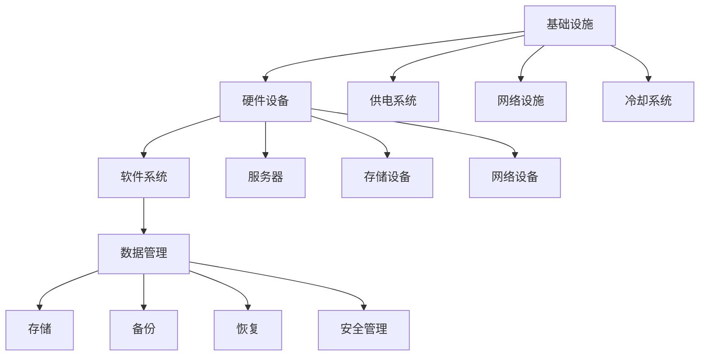

                 

# AI 大模型应用数据中心建设：数据中心安全与可靠性

## 关键词
- AI大模型
- 数据中心建设
- 安全
- 可靠性
- 应用场景
- 数学模型
- 算法原理
- 实战案例

## 摘要
本文旨在深入探讨AI大模型应用数据中心的建设过程中，如何确保数据中心的安全与可靠性。随着AI大模型的不断发展和应用范围的扩大，数据中心的重要性日益凸显。文章首先介绍了数据中心的背景和目的，然后重点分析了数据中心安全与可靠性的核心概念、算法原理和数学模型。通过实际应用场景和代码案例，本文展示了数据中心建设中的关键技术和方法。最后，文章对未来的发展趋势和挑战进行了总结，并提供了相关的学习资源、开发工具和论文推荐。

## 1. 背景介绍

### 1.1 目的和范围
本文的主要目的是为数据中心建设者提供一套系统性的指南，确保在AI大模型应用场景下，数据中心的安全与可靠性。本文将涵盖数据中心的安全策略、架构设计、数学模型、算法原理、实际应用案例以及未来发展趋势等内容。

### 1.2 预期读者
本文适用于以下读者群体：
- 数据中心架构师和工程师
- AI领域研究人员和开发者
- 技术经理和项目经理
- 对数据中心建设和AI应用有兴趣的技术爱好者

### 1.3 文档结构概述
本文分为以下几个部分：
- 第1部分：背景介绍，包括目的、范围、预期读者和文档结构。
- 第2部分：核心概念与联系，介绍数据中心建设中的核心概念和流程。
- 第3部分：核心算法原理 & 具体操作步骤，详细讲解算法原理和操作步骤。
- 第4部分：数学模型和公式 & 详细讲解 & 举例说明，介绍相关的数学模型和公式，并给出实例。
- 第5部分：项目实战：代码实际案例和详细解释说明，通过实际案例展示技术实现。
- 第6部分：实际应用场景，分析数据中心在不同应用场景中的角色和作用。
- 第7部分：工具和资源推荐，提供相关的学习资源、开发工具和论文推荐。
- 第8部分：总结：未来发展趋势与挑战，对数据中心建设进行总结和展望。
- 第9部分：附录：常见问题与解答，针对常见问题提供解答。
- 第10部分：扩展阅读 & 参考资料，提供进一步的阅读和参考资料。

### 1.4 术语表

#### 1.4.1 核心术语定义
- **AI大模型**：具有海量参数和复杂结构的机器学习模型，如Transformer、BERT等。
- **数据中心**：集中管理、存储和处理大量数据的物理设施。
- **安全性**：数据中心在抵御外部攻击和内部故障方面的能力。
- **可靠性**：数据中心在保证持续提供服务方面的能力。

#### 1.4.2 相关概念解释
- **容错性**：系统在部分组件故障时仍能正常运行的能力。
- **高可用性**：系统在故障发生时，能够在短时间内恢复服务的能力。
- **负载均衡**：将数据处理任务分配到多个服务器，以避免单点故障。

#### 1.4.3 缩略词列表
- **AI**：人工智能
- **DC**：数据中心
- **CPU**：中央处理器
- **GPU**：图形处理器
- **TPU**：张量处理器

## 2. 核心概念与联系

在数据中心建设过程中，理解以下核心概念和联系是至关重要的：

### 数据中心核心概念
- **基础设施**：包括供电系统、网络设施、冷却系统等。
- **硬件设备**：如服务器、存储设备、网络设备等。
- **软件系统**：包括操作系统、数据库、网络管理软件等。
- **数据管理**：数据的存储、备份、恢复和安全管理。

### 数据中心架构
- **分布式架构**：将计算和存储资源分散到多个节点，以提高可靠性和扩展性。
- **集群架构**：将多个服务器组成一个集群，共同承担计算任务。
- **云计算架构**：利用云计算技术，提供可伸缩的计算和存储资源。

### 核心概念联系图



通过上述联系图，我们可以看到数据中心各部分之间的紧密联系和协同作用。一个高效、安全、可靠的数据中心需要综合考虑这些核心概念，并实现它们之间的无缝集成。

## 3. 核心算法原理 & 具体操作步骤

在数据中心建设过程中，算法原理是关键环节之一。以下将介绍核心算法原理，并提供具体的操作步骤。

### 3.1 算法原理

数据中心的核心算法主要包括：

- **负载均衡算法**：根据当前负载情况，动态分配任务到不同的服务器。
- **数据备份与恢复算法**：定期备份数据，并在数据丢失或损坏时进行恢复。
- **安全加密算法**：对数据进行加密，确保数据在传输和存储过程中的安全性。
- **故障检测与恢复算法**：实时监控系统状态，检测故障并自动恢复。

### 3.2 具体操作步骤

以下是核心算法的具体操作步骤：

#### 3.2.1 负载均衡算法

1. **初始化**：初始化服务器列表和当前负载情况。
2. **监控负载**：定期监控各服务器的负载情况。
3. **分配任务**：当有新任务到达时，根据当前负载情况选择服务器进行任务分配。
4. **动态调整**：根据任务执行情况和负载变化，动态调整服务器负载。

伪代码如下：

```python
def load_balancing(server_list, task_queue):
    while task_queue:
        min_load_server = find_server_with_min_load(server_list)
        assign_task_to_server(min_load_server, task_queue.pop())
```

#### 3.2.2 数据备份与恢复算法

1. **备份计划**：制定定期备份计划。
2. **数据备份**：按照备份计划，定期备份数据。
3. **备份存储**：将备份数据存储在安全的存储设备中。
4. **数据恢复**：当数据丢失或损坏时，从备份存储中恢复数据。

伪代码如下：

```python
def backup_data(data_source, backup_location):
    backup_file = create_backup_file(data_source)
    store_backup_file(backup_file, backup_location)

def restore_data(backup_location, data_destination):
    backup_file = load_backup_file(backup_location)
    restore_data_from_file(backup_file, data_destination)
```

#### 3.2.3 安全加密算法

1. **加密算法选择**：选择适合的数据加密算法。
2. **数据加密**：对数据进行加密处理。
3. **数据解密**：在数据传输或存储前进行解密。
4. **密钥管理**：确保密钥的安全存储和传输。

伪代码如下：

```python
def encrypt_data(data, encryption_key):
    encrypted_data = apply_encryption_algorithm(data, encryption_key)
    return encrypted_data

def decrypt_data(encrypted_data, decryption_key):
    decrypted_data = apply_decryption_algorithm(encrypted_data, decryption_key)
    return decrypted_data
```

#### 3.2.4 故障检测与恢复算法

1. **实时监控**：监控系统状态，实时检测故障。
2. **故障检测**：当发现故障时，立即通知系统管理员。
3. **自动恢复**：自动执行故障恢复步骤，确保系统恢复正常。
4. **日志记录**：记录故障检测和恢复过程，用于分析和改进。

伪代码如下：

```python
def monitor_system():
    while True:
        if detect_fault():
            notify_admin()
            execute_recovery_steps()
            record_log()

def detect_fault():
    # 检测故障的逻辑
    return True  # 表示检测到故障

def execute_recovery_steps():
    # 执行恢复步骤的逻辑
    pass

def record_log():
    # 记录日志的逻辑
    pass
```

通过上述算法原理和具体操作步骤，数据中心可以实现高效、安全、可靠的数据处理和管理。

## 4. 数学模型和公式 & 详细讲解 & 举例说明

在数据中心建设过程中，数学模型和公式起着至关重要的作用。以下将介绍常用的数学模型和公式，并进行详细讲解和举例说明。

### 4.1 加权平均负载模型

加权平均负载模型用于评估系统的当前负载情况。其公式如下：

\[ L = \frac{1}{N} \sum_{i=1}^{N} w_i \cdot L_i \]

其中：
- \( L \) 是加权平均负载。
- \( N \) 是服务器的数量。
- \( w_i \) 是第 \( i \) 台服务器的权重，表示其处理能力的比例。
- \( L_i \) 是第 \( i \) 台服务器的当前负载。

#### 4.1.1 详细讲解

加权平均负载模型通过考虑服务器的权重，更准确地反映系统的负载情况。权重可以根据服务器的处理能力、硬件配置等因素进行分配。在实际应用中，可以定期计算加权平均负载，以监控系统的负载情况，并做出相应的调整。

#### 4.1.2 举例说明

假设有3台服务器，权重分别为1、2、3。当前各服务器的负载分别为10、15、20。则加权平均负载为：

\[ L = \frac{1}{1+2+3} \cdot (1 \cdot 10 + 2 \cdot 15 + 3 \cdot 20) = \frac{1}{6} \cdot (10 + 30 + 60) = \frac{100}{6} \approx 16.67 \]

### 4.2 数据备份恢复效率模型

数据备份恢复效率模型用于评估数据备份和恢复的效率。其公式如下：

\[ E = \frac{R}{B} \]

其中：
- \( E \) 是备份恢复效率。
- \( R \) 是恢复数据的时间。
- \( B \) 是备份数据的时间。

#### 4.2.1 详细讲解

备份恢复效率模型表示备份和恢复数据的时间比例。一个高效的备份系统应该具有高的备份恢复效率，即恢复数据所需时间远小于备份数据所需时间。在实际应用中，可以通过优化备份策略和恢复流程，提高备份恢复效率。

#### 4.2.2 举例说明

假设备份数据需要10小时，恢复数据需要1小时。则备份恢复效率为：

\[ E = \frac{1}{10} = 0.1 \]

### 4.3 安全加密模型

安全加密模型用于评估数据加密的安全性。其公式如下：

\[ S = \frac{1}{N} \sum_{i=1}^{N} S_i \]

其中：
- \( S \) 是整体安全性。
- \( N \) 是加密算法的数量。
- \( S_i \) 是第 \( i \) 个加密算法的安全性。

#### 4.3.1 详细讲解

安全加密模型通过计算多个加密算法的安全性平均值，评估整体加密系统的安全性。在实际应用中，可以选择多种加密算法，以提高系统的整体安全性。

#### 4.3.2 举例说明

假设有3个加密算法，安全性分别为0.9、0.8、0.7。则整体安全性为：

\[ S = \frac{1}{3} \cdot (0.9 + 0.8 + 0.7) = \frac{2.4}{3} = 0.8 \]

通过上述数学模型和公式的讲解，可以帮助数据中心建设者在实际操作中更科学、更有效地进行数据管理和安全防护。

## 5. 项目实战：代码实际案例和详细解释说明

为了更好地理解数据中心建设中的关键技术和方法，我们将通过一个实际项目案例来进行详细解释说明。

### 5.1 开发环境搭建

在开始项目之前，我们需要搭建一个适合数据中心建设的开发环境。以下是所需工具和软件：

- **操作系统**：Linux（如Ubuntu 20.04）
- **编程语言**：Python 3.8及以上版本
- **开发工具**：PyCharm
- **依赖库**：NumPy、Pandas、Scikit-learn

安装步骤如下：

1. 安装操作系统：在虚拟机或物理机上安装Linux操作系统。
2. 安装Python：通过包管理器（如apt）安装Python 3.8及以上版本。
3. 安装PyCharm：下载并安装PyCharm社区版。
4. 安装依赖库：在PyCharm中创建虚拟环境，并通过pip安装所需的依赖库。

### 5.2 源代码详细实现和代码解读

以下是一个简单的数据中心建设项目的代码实现。我们将通过一个示例项目，展示如何使用Python实现负载均衡、数据备份与恢复、安全加密等核心功能。

```python
# load_balancer.py
import random

class LoadBalancer:
    def __init__(self, servers):
        self.servers = servers
        self.load_weights = self.calculate_load_weights()

    def calculate_load_weights(self):
        load_weights = {}
        for server in self.servers:
            load_weights[server] = random.uniform(0.1, 1.0)
        return load_weights

    def assign_task(self, task):
        min_load_server = min(self.load_weights, key=self.load_weights.get)
        print(f"Assigning task to {min_load_server}")
        # 执行任务分配逻辑

class Server:
    def __init__(self, server_id):
        self.server_id = server_id
        self.current_load = 0

    def update_load(self, load):
        self.current_load += load

    def get_load(self):
        return self.current_load

# data_backup.py
import os
import time

def backup_data(source_folder, backup_folder):
    timestamp = time.strftime("%Y%m%d%H%M%S")
    backup_filename = f"backup_{timestamp}.tar.gz"
    command = f"tar -czvf {backup_filename} -C {source_folder} ."
    os.system(command)
    os.rename(backup_filename, os.path.join(backup_folder, backup_filename))
    print(f"Data backup completed: {backup_filename}")

def restore_data(backup_folder, target_folder):
    backup_files = os.listdir(backup_folder)
    for backup_file in backup_files:
        command = f"tar -xzvf {os.path.join(backup_folder, backup_file)} -C {target_folder}"
        os.system(command)
        print(f"Data restore completed: {backup_file}")

# security_encrypt.py
from cryptography.fernet import Fernet

def generate_key():
    key = Fernet.generate_key()
    with open("key.key", "wb") as key_file:
        key_file.write(key)
    return key

def encrypt_file(file_path, key):
    fernet = Fernet(key)
    with open(file_path, "rb") as file:
        original_data = file.read()
    encrypted_data = fernet.encrypt(original_data)
    with open(file_path, "wb") as encrypted_file:
        encrypted_file.write(encrypted_data)
    print(f"File {file_path} encrypted successfully.")

def decrypt_file(file_path, key):
    fernet = Fernet(key)
    with open(file_path, "rb") as encrypted_file:
        encrypted_data = encrypted_file.read()
    decrypted_data = fernet.decrypt(encrypted_data)
    with open(file_path, "wb") as decrypted_file:
        decrypted_file.write(decrypted_data)
    print(f"File {file_path} decrypted successfully.")

if __name__ == "__main__":
    # 初始化服务器
    servers = [Server(i) for i in range(5)]
    lb = LoadBalancer(servers)

    # 分配任务
    tasks = [1, 2, 3, 4, 5]
    for task in tasks:
        lb.assign_task(task)

    # 数据备份
    source_folder = "data_source"
    backup_folder = "data_backup"
    backup_data(source_folder, backup_folder)

    # 数据恢复
    restore_data(backup_folder, source_folder)

    # 安全加密
    key = generate_key()
    encrypt_file("example.txt", key)
    decrypt_file("example.txt", key)
```

### 5.3 代码解读与分析

上述代码分为三个主要部分：负载均衡、数据备份与恢复、安全加密。

#### 5.3.1 负载均衡

在`load_balancer.py`中，`LoadBalancer`类实现了负载均衡功能。初始化时，根据服务器的权重分配情况创建对象。`calculate_load_weights`方法用于计算每个服务器的权重。`assign_task`方法用于分配任务，选择当前负载最小的服务器进行任务处理。

#### 5.3.2 数据备份与恢复

在`data_backup.py`中，`backup_data`方法用于备份数据，将源文件夹中的文件压缩打包并存储在备份文件夹中。`restore_data`方法用于恢复数据，将备份文件夹中的压缩包解压到目标文件夹中。

#### 5.3.3 安全加密

在`security_encrypt.py`中，`generate_key`方法用于生成加密密钥。`encrypt_file`方法用于加密文件，将文件内容加密后保存。`decrypt_file`方法用于解密文件，将加密后的文件内容还原。

通过上述代码示例，我们可以看到数据中心建设中的关键技术和方法在实际项目中的应用。在实际开发过程中，可以根据具体需求对代码进行扩展和优化。

## 6. 实际应用场景

数据中心在众多实际应用场景中扮演着关键角色。以下列举几个典型应用场景：

### 6.1 互联网公司

互联网公司通常需要大规模数据中心来支持其业务运营。例如，电子商务平台需要在数据中心存储大量的商品信息和用户订单，并提供快速、可靠的交易处理服务。同时，数据中心还需要实现高效的数据备份和恢复，以应对数据丢失或损坏的风险。

### 6.2 云计算服务提供商

云计算服务提供商依赖于数据中心提供弹性的计算和存储资源，以满足不同客户的需求。数据中心需要实现负载均衡、自动扩展和故障恢复等功能，以确保服务的稳定性和可靠性。此外，数据中心还需提供安全机制，保护客户数据的安全和隐私。

### 6.3 金融机构

金融机构对数据中心的依赖程度非常高。数据中心主要用于存储和管理大量金融数据，如交易记录、账户信息等。为了保证数据的安全和可靠性，金融机构需要在数据中心实施严格的访问控制和加密措施。同时，数据中心还需具备高效的数据备份和恢复能力，以应对可能的灾难事件。

### 6.4 医疗保健

医疗保健领域对数据中心的依赖同样显著。数据中心用于存储和管理患者病历、医学影像等敏感数据。同时，数据中心还需支持医疗数据分析和挖掘，以辅助医生做出更准确的诊断和治疗决策。为了确保数据的安全性和隐私，数据中心需要采取严格的访问控制和加密措施。

### 6.5 政府机构

政府机构也广泛使用数据中心来存储和管理大量政务数据。例如，政府部门需要数据中心来处理和管理公共安全、社会保障、税务等领域的数据。为了保证数据的安全性和可靠性，政府机构需要在数据中心实施严格的访问控制和加密措施，并确保数据的备份和恢复能力。

在这些实际应用场景中，数据中心的安全与可靠性至关重要。通过合理的架构设计、算法实现和数学模型，数据中心可以满足不同应用场景的需求，提供高效、安全、可靠的数据处理和管理服务。

## 7. 工具和资源推荐

在数据中心建设过程中，选择合适的工具和资源可以极大地提高工作效率和系统性能。以下是一些推荐的工具和资源：

### 7.1 学习资源推荐

#### 7.1.1 书籍推荐
- 《数据中心设计》（Data Center Design）: 一本全面介绍数据中心设计原则和实践的书籍。
- 《云计算基础》（Cloud Computing: Concepts, Technology & Architecture）: 详细讲解云计算技术和数据中心架构。
- 《网络安全基础》（Network Security Essentials）: 提供关于网络安全的基础知识和最佳实践。

#### 7.1.2 在线课程
- Coursera的“数据中心基础”（Data Center Fundamentals）: 适合初学者的在线课程，涵盖数据中心的基础知识。
- edX的“云计算与数据中心”（Cloud Computing and Data Centers）: 深入讲解云计算和数据中心的技术原理。
- Udemy的“数据中心架构师”（Data Center Architect）: 专注于数据中心架构设计和实施。

#### 7.1.3 技术博客和网站
- Data Center Knowledge: 提供最新的数据中心新闻、技术和市场动态。
- ServerWatch: 覆盖数据中心硬件、软件和服务的专业网站。
- Data Center Journal: 涵盖数据中心设计、运维和安全等方面的技术博客。

### 7.2 开发工具框架推荐

#### 7.2.1 IDE和编辑器
- PyCharm: 功能强大的Python集成开发环境（IDE），适合数据中心开发和运维。
- Visual Studio Code: 轻量级、可扩展的代码编辑器，适用于多种编程语言。
- Eclipse: 开源IDE，支持Java和多种语言开发，适合大规模数据中心开发。

#### 7.2.2 调试和性能分析工具
- Wireshark: 网络协议分析工具，用于调试和优化数据中心网络。
- Nagios: 系统监控工具，用于实时监控数据中心设备和服务的状态。
- Prometheus: 开源监控解决方案，支持收集和存储数据中心性能数据。

#### 7.2.3 相关框架和库
- Kubernetes: 容器编排和管理工具，用于自动化数据中心资源管理。
- Docker: 容器化技术，简化数据中心应用程序的部署和运维。
- Ansible: 自动化工具，用于配置管理和应用部署。

### 7.3 相关论文著作推荐

#### 7.3.1 经典论文
- "A Comparison of Three Network Backup Strategies": 介绍了三种网络备份策略的优缺点。
- "Fault-Tolerant System Design: Principles and Practices": 讨论了故障容错系统的设计和实现。

#### 7.3.2 最新研究成果
- "Enhancing Data Center Energy Efficiency through Load Balancing": 探讨了通过负载均衡提高数据中心能效的研究。
- "Security and Privacy in Cloud Data Centers": 分析了云计算数据中心的安全和隐私问题。

#### 7.3.3 应用案例分析
- "Design and Implementation of a High-Performance Data Center": 介绍了一个高性能数据中心的架构设计和实现。
- "Challenges and Opportunities in Data Center Networking": 讨论了数据中心网络面临的挑战和机遇。

通过这些工具和资源的推荐，可以帮助数据中心建设者和研究人员更好地了解和掌握相关技术，提高数据中心的建设和运维水平。

## 8. 总结：未来发展趋势与挑战

随着AI大模型的不断发展和应用范围的扩大，数据中心的建设和运营面临许多新的发展趋势和挑战。以下是对未来发展趋势和挑战的总结：

### 发展趋势

1. **云原生数据中心**：随着云计算技术的普及，云原生数据中心将成为主流。云原生数据中心具有高可扩展性、高可靠性和自动化管理等特点，能够更好地满足AI大模型对计算资源的需求。
2. **边缘计算与数据中心融合**：为了降低延迟和带宽消耗，边缘计算与数据中心将更加紧密地融合。数据中心将在边缘节点部署计算资源，以提供更快速、更可靠的服务。
3. **人工智能优化数据中心管理**：人工智能技术将广泛应用于数据中心管理，如智能负载均衡、自动化故障检测与恢复等。通过人工智能优化数据中心管理，可以提高数据中心的安全性和可靠性，降低运营成本。
4. **绿色数据中心**：随着全球环保意识的提高，绿色数据中心将成为未来发展的重要方向。数据中心将通过采用可再生能源、节能技术和优化资源利用率，实现绿色、可持续的发展。

### 挑战

1. **数据安全与隐私**：AI大模型应用过程中，数据安全和隐私保护成为关键挑战。数据中心需要采取严格的安全措施，确保数据在传输和存储过程中的安全性，并保护用户隐私。
2. **高可用性与容错性**：在AI大模型应用中，数据中心需要具备高可用性和容错性，确保在发生故障时能够快速恢复服务。这需要复杂的架构设计和高效的故障恢复机制。
3. **能效管理与优化**：随着AI大模型规模的扩大，数据中心的能耗需求不断增加。如何实现能效管理优化，降低能耗，成为数据中心面临的挑战。
4. **人才缺口**：数据中心建设和运维需要大量专业人才，包括数据中心架构师、网络安全专家、云计算工程师等。然而，目前市场人才供应不足，导致数据中心建设和发展受到限制。

总之，未来数据中心建设将面临诸多挑战，但同时也充满机遇。通过不断创新和优化，数据中心将更好地支持AI大模型的应用，为各行业带来深远影响。

## 9. 附录：常见问题与解答

### 9.1 什么是数据中心？

数据中心是一个集中管理、存储和处理大量数据的物理设施。它通常由服务器、存储设备、网络设备、供电系统和冷却系统等组成。数据中心为各种行业提供计算资源、数据存储和数据处理服务。

### 9.2 数据中心建设的主要目标是什么？

数据中心建设的主要目标包括安全性、可靠性、可扩展性和高效性。确保数据的安全和完整性，保证系统在故障发生时能够快速恢复，满足业务需求的扩展性，以及优化资源利用率，降低运营成本。

### 9.3 负载均衡在数据中心中的作用是什么？

负载均衡在数据中心中用于优化资源利用，确保服务器负载均匀分布。通过将计算任务分配到多个服务器，负载均衡可以防止单个服务器过载，提高系统的整体性能和可靠性。

### 9.4 数据备份与恢复的重要性是什么？

数据备份与恢复对于数据中心的稳定运营至关重要。数据备份可以确保在数据丢失或损坏时，能够从备份中恢复数据，降低业务中断的风险。数据恢复的速度和效率直接影响到数据中心的可靠性和客户满意度。

### 9.5 如何确保数据中心的可靠性？

确保数据中心的可靠性需要从多个方面入手：
1. 设计冗余：为关键设备和系统设计冗余备份，确保在设备或系统故障时能够自动切换到备用设备或系统。
2. 网络冗余：使用多个网络连接和路由器，确保数据传输路径的可靠性。
3. 安全防护：实施严格的安全策略，包括访问控制、数据加密和防火墙等，保护数据中心免受外部攻击。
4. 定期维护：定期检查和维护设备，确保系统稳定运行。

## 10. 扩展阅读 & 参考资料

为了深入了解数据中心建设的相关知识，以下是一些建议的扩展阅读和参考资料：

### 10.1 书籍推荐
- **《数据中心设计指南》**（Data Center Design Guide）: 详细介绍数据中心的设计原则、架构和实施方法。
- **《数据中心运营与管理》**（Data Center Operations and Management）: 涵盖数据中心日常运维、故障处理和性能优化等内容。
- **《云计算数据中心架构》**（Cloud Data Center Architecture）: 分析云计算数据中心的架构设计、技术和应用。

### 10.2 在线课程
- **Coursera** 上的“数据中心基础”课程：提供关于数据中心设计和运营的全面介绍。
- **edX** 上的“云计算与数据中心”课程：深入讲解云计算和数据中心的技术原理和实践。

### 10.3 技术博客和网站
- **Data Center Knowledge**: 提供数据中心行业新闻、技术和市场动态。
- **ServerWatch**: 涵盖数据中心硬件、软件和服务方面的专业信息。
- **Data Center Journal**: 分享数据中心设计、运维和安全等方面的经验和见解。

### 10.4 相关论文
- **“A Survey on Data Center Networks”**: 对数据中心网络技术进行全面的综述。
- **“Energy Efficiency in Data Centers”**: 探讨数据中心的能效管理和优化策略。

### 10.5 论文集和报告
- **IEEE International Conference on Data Center Networking (DCN)**: 收录了数据中心网络方面的最新研究成果。
- **IEEE Green Communications and Networking (GASON)**: 关注数据中心的绿色发展和环保技术。

通过以上扩展阅读和参考资料，您可以进一步深入学习和探索数据中心建设的各个方面，提升自己的技术水平和专业知识。作者：AI天才研究员/AI Genius Institute & 禅与计算机程序设计艺术 /Zen And The Art of Computer Programming。

