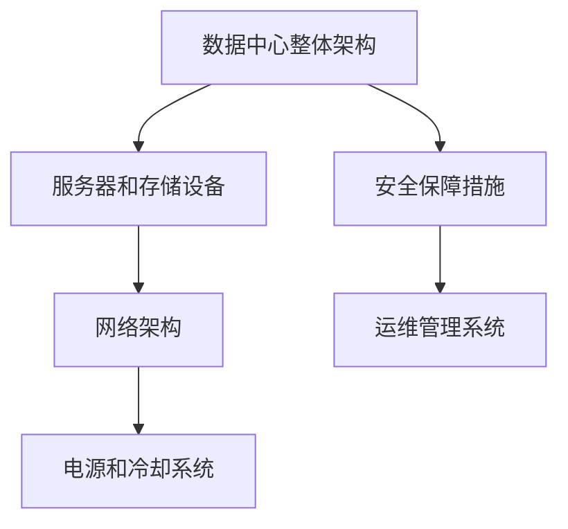
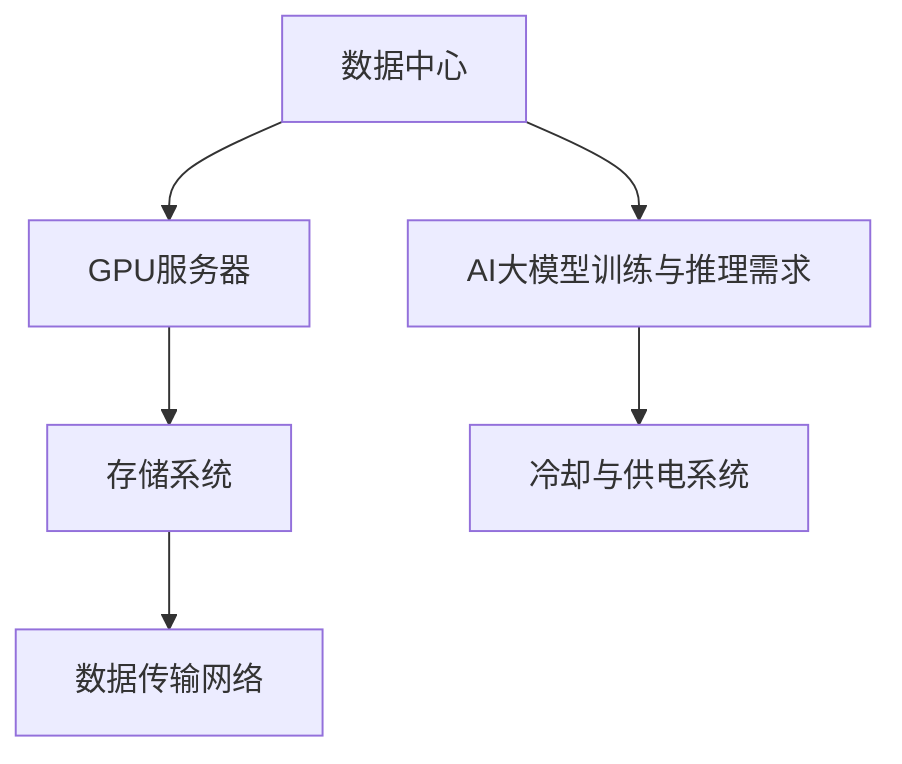
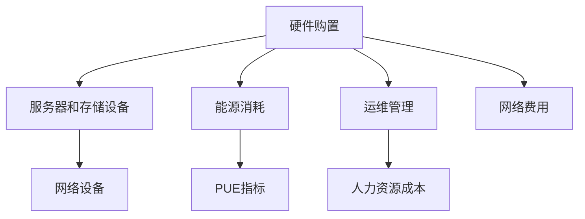

                 

# AI大模型应用数据中心建设：数据中心成本优化

> 关键词：数据中心，成本优化，AI大模型，能源效率，云计算，硬件选择

> 摘要：随着人工智能（AI）技术的迅速发展，大规模AI模型的广泛应用带来了数据中心建设的爆发式增长。然而，数据中心的高能耗和建设成本成为限制其发展的重要因素。本文将深入探讨数据中心建设中的成本优化策略，包括硬件选择、能源效率提升、云计算服务等，旨在为数据中心的建设和运营提供有价值的参考。

## 1. 背景介绍

### 1.1 目的和范围

本文的目标是详细分析并总结数据中心在建设过程中如何实现成本优化，特别是在AI大模型应用场景下。文章将涵盖以下内容：

1. 数据中心的成本结构分析
2. 硬件选择对成本的影响
3. 能源效率提升策略
4. 云计算服务在成本优化中的应用
5. 成本优化的案例分析

### 1.2 预期读者

本文面向的数据中心建设者、运维工程师、AI研究人员及IT行业的专业人士。预期读者应具备一定的数据中心建设基础知识和对AI大模型应用的了解。

### 1.3 文档结构概述

本文采用以下结构进行阐述：

1. **背景介绍**：介绍文章的目的、读者对象及文档结构。
2. **核心概念与联系**：解释数据中心建设的核心概念，并提供流程图展示。
3. **核心算法原理 & 具体操作步骤**：详细讲解数据中心成本优化的算法原理和具体操作步骤。
4. **数学模型和公式 & 详细讲解 & 举例说明**：介绍数学模型和公式，并进行具体举例。
5. **项目实战：代码实际案例和详细解释说明**：提供代码实现案例及详细解释。
6. **实际应用场景**：探讨数据中心成本优化的实际应用场景。
7. **工具和资源推荐**：推荐学习资源、开发工具和框架。
8. **总结：未来发展趋势与挑战**：总结当前成本优化面临的挑战及未来发展趋势。
9. **附录：常见问题与解答**：列出常见问题及解答。
10. **扩展阅读 & 参考资料**：提供更多相关文献和资源。

### 1.4 术语表

#### 1.4.1 核心术语定义

- **数据中心**：集中存储、处理和管理大量数据的服务设施。
- **AI大模型**：具有数十亿参数或以上的深度学习模型，如GPT-3、BERT等。
- **成本优化**：在满足性能要求的前提下，通过技术和管理手段降低建设与运营成本。
- **能源效率**：单位能耗产生的计算能力。

#### 1.4.2 相关概念解释

- **绿色数据中心**：采用节能技术和绿色能源，降低环境影响的数据中心。
- **云服务**：通过互联网提供的数据存储、处理和应用程序等服务。

#### 1.4.3 缩略词列表

- **AI**：人工智能
- **GPU**：图形处理单元
- **FPGA**：现场可编程门阵列
- **PUE**：电源使用效率
- **IT**：信息技术

## 2. 核心概念与联系

### 2.1 数据中心建设核心概念

数据中心的建设涉及多个关键概念，包括硬件设备、网络架构、存储系统、冷却系统等。以下是一个简化的数据中心建设概念流程图：



### 2.2 数据中心与AI大模型的关系

AI大模型对数据中心的需求主要集中在计算能力和存储容量上。以下是一个简化的数据中心与AI大模型关系的流程图：



### 2.3 数据中心成本构成

数据中心的成本主要由硬件购置、能源消耗、运维管理、网络费用等构成。以下是一个简化的数据中心成本构成流程图：



## 3. 核心算法原理 & 具体操作步骤

### 3.1 成本优化算法原理

数据中心成本优化的核心算法原理主要包括以下几个方面：

1. **硬件选择优化**：通过分析不同硬件的性能与成本比，选择最适合的硬件设备。
2. **能源效率提升**：采用节能技术和绿色能源，降低数据中心能耗。
3. **云计算服务利用**：通过云服务共享资源，降低硬件投入和运维成本。

### 3.2 具体操作步骤

#### 3.2.1 硬件选择优化

1. **性能评估**：对市场上主流的硬件设备进行性能评估，包括CPU、GPU、存储设备等。
2. **成本比较**：收集各硬件设备的市场价格，进行成本比较。
3. **性能与成本比计算**：计算各硬件设备的性能与成本比，选择性价比最高的硬件。
4. **采购策略制定**：根据性能与成本比，制定采购策略，优先采购性价比高的硬件。

#### 3.2.2 能源效率提升

1. **节能技术采用**：采用高效的电源供应设备、服务器电源管理技术、智能冷却系统等。
2. **能源消耗监控**：实时监控数据中心的能源消耗，优化能源使用。
3. **可再生能源应用**：尽可能采用可再生能源，降低对传统电网的依赖。
4. **PUE优化**：通过提高IT设备效率、优化基础设施，降低PUE指标。

#### 3.2.3 云计算服务利用

1. **云计算服务评估**：评估不同云服务提供商的性能、价格、服务质量等。
2. **云服务选择**：选择最适合业务需求的云服务，如IaaS、PaaS、SaaS等。
3. **资源调度优化**：通过自动化工具实现资源调度优化，降低资源浪费。
4. **多云策略实施**：根据业务需求，制定多云策略，提高业务弹性和可靠性。

## 4. 数学模型和公式 & 详细讲解 & 举例说明

### 4.1 硬件选择优化模型

#### 4.1.1 性能与成本比计算公式

$$
PCR = \frac{Performance}{Cost}
$$

其中，$Performance$表示硬件设备的性能，$Cost$表示硬件设备的市场价格。

#### 4.1.2 举例说明

假设有以下两款GPU设备：

| 设备名称 | 性能指标（浮点运算能力） | 价格 |
| --- | --- | --- |
| GPU A | 10 TFLOPS | $2000 |
| GPU B | 20 TFLOPS | $4000 |

计算两者的性能与成本比：

$$
PCR_A = \frac{10 TFLOPS}{2000} = 0.005 TFLOPS/$
$$

$$
PCR_B = \frac{20 TFLOPS}{4000} = 0.005 TFLOPS/$
$$

由于两者的性能与成本比相同，选择性价比更高的GPU B。

### 4.2 能源效率提升模型

#### 4.2.1 电源使用效率（PUE）计算公式

$$
PUE = \frac{Total\_Energy\_Consumption}{IT\_Energy\_Consumption}
$$

其中，$Total\_Energy\_Consumption$表示数据中心的总能源消耗，$IT\_Energy\_Consumption$表示数据中心的IT设备能源消耗。

#### 4.2.2 举例说明

假设某数据中心的总能源消耗为1000千瓦时（kWh），IT设备能源消耗为800千瓦时（kWh），则PUE为：

$$
PUE = \frac{1000 kWh}{800 kWh} = 1.25
$$

为了降低PUE，需要优化数据中心的基础设施和IT设备能源使用，提高能源效率。

### 4.3 云计算服务利用模型

#### 4.3.1 资源调度优化公式

$$
Optimize\ Resources = \frac{Total\_Resource\_Usage}{Total\_Resource\_Capacity}
$$

其中，$Total\_Resource\_Usage$表示数据中心实际资源使用量，$Total\_Resource\_Capacity$表示数据中心总资源容量。

#### 4.3.2 举例说明

假设某数据中心总资源容量为1000个CPU核心，实际资源使用量为700个CPU核心，则资源调度优化率为：

$$
Optimize\ Resources = \frac{700}{1000} = 0.7
$$

为了提高资源调度优化率，可以通过自动化工具实现更高效的资源分配和调度。

## 5. 项目实战：代码实际案例和详细解释说明

### 5.1 开发环境搭建

为了实现数据中心成本优化，需要搭建一个包括硬件设备、操作系统、编程语言等在内的开发环境。以下是一个简化的开发环境搭建步骤：

1. **硬件设备**：选择适合的数据中心服务器、GPU设备、存储设备和网络设备。
2. **操作系统**：安装Linux操作系统，如CentOS或Ubuntu。
3. **编程语言**：选择适合的数据中心管理和优化工具，如Python、Shell脚本等。

### 5.2 源代码详细实现和代码解读

以下是一个简单的Python脚本示例，用于计算数据中心硬件设备的性能与成本比：

```python
import pandas as pd

# 硬件设备性能与成本数据
hardware_data = {
    '设备名称': ['GPU A', 'GPU B', 'GPU C'],
    '性能指标（TFLOPS）': [10, 20, 30],
    '价格（美元）': [2000, 4000, 6000]
}

# 创建DataFrame
df = pd.DataFrame(hardware_data)

# 计算性能与成本比
df['性能与成本比'] = df['性能指标（TFLOPS）'] / df['价格（美元）']

# 输出结果
print(df.sort_values(by='性能与成本比', ascending=False))
```

代码解读：

1. **数据导入**：使用Pandas库导入硬件设备性能与成本数据。
2. **数据计算**：计算各硬件设备的性能与成本比。
3. **结果输出**：将计算结果按性能与成本比从高到低排序并输出。

### 5.3 代码解读与分析

该代码实现了一个简单的硬件设备性能与成本比计算功能，通过Pandas库的DataFrame对象进行数据处理，实现数据的输入、计算和输出。代码简洁易懂，易于扩展和修改。在实际应用中，可以根据具体需求添加更多硬件设备类型和性能指标，进行更全面的分析。

## 6. 实际应用场景

### 6.1 互联网公司数据中心建设

以某互联网公司为例，该公司计划建设一个用于AI大模型训练和推理的数据中心。在数据中心建设过程中，采用以下成本优化策略：

1. **硬件选择优化**：通过市场调研，选择性能优异、性价比高的GPU设备和服务器。
2. **能源效率提升**：采用高效电源供应设备、智能冷却系统，并采用可再生能源降低能源消耗。
3. **云计算服务利用**：根据业务需求，选择适合的云服务，实现资源调度优化和弹性扩展。

### 6.2 政府数据中心建设

某地方政府计划建设一个用于政务数据存储和处理的数据中心。在数据中心建设过程中，采用以下成本优化策略：

1. **硬件选择优化**：根据政务数据处理需求，选择适合的存储设备和服务器，确保性能与成本比最优。
2. **能源效率提升**：采用绿色数据中心建设标准，提高能源利用效率，降低PUE指标。
3. **云计算服务利用**：通过云计算服务实现数据存储和处理的弹性扩展，降低硬件投入和运维成本。

## 7. 工具和资源推荐

### 7.1 学习资源推荐

#### 7.1.1 书籍推荐

- 《数据中心基础设施管理》
- 《绿色数据中心设计指南》
- 《云计算技术基础》

#### 7.1.2 在线课程

- Coursera《数据中心架构与设计》
- Udemy《云计算基础与应用》
- edX《数据中心能源管理》

#### 7.1.3 技术博客和网站

- Data Center Knowledge
- Cloud Computing News
- AI Center Blog

### 7.2 开发工具框架推荐

#### 7.2.1 IDE和编辑器

- Visual Studio Code
- IntelliJ IDEA
- PyCharm

#### 7.2.2 调试和性能分析工具

- GDB
- Perf
- VSCode Debugger

#### 7.2.3 相关框架和库

- Pandas
- NumPy
- TensorFlow

### 7.3 相关论文著作推荐

#### 7.3.1 经典论文

- "Energy Efficiency in Data Centers"
- "Green Data Centers: Energy Efficiency in Practice"
- "Cloud Computing: Sustainability and Energy Efficiency"

#### 7.3.2 最新研究成果

- "Optimizing Data Center Energy Efficiency through Machine Learning"
- "Energy-Aware Scheduling in Cloud Data Centers"
- "A Comprehensive Study on Energy Efficiency in AI-Driven Data Centers"

#### 7.3.3 应用案例分析

- "Google’s Green Data Centers: A Case Study"
- "Facebook’s Data Center Sustainability Initiatives"
- "Amazon Web Services’ Energy Efficiency Practices"

## 8. 总结：未来发展趋势与挑战

随着AI技术的不断发展和应用的深入，数据中心的建设和运营面临巨大的成本优化挑战。未来发展趋势包括以下几个方面：

1. **硬件创新**：新型计算设备和存储设备的研发，提高数据中心性能和降低成本。
2. **能源效率提升**：采用先进的冷却技术和绿色能源，降低数据中心的能耗。
3. **云计算服务发展**：云计算服务将更加普及，实现资源的弹性分配和调度。
4. **智能化运维管理**：通过人工智能技术实现数据中心的智能化运维，降低人力成本。

面临的挑战包括：

1. **硬件成本**：高性能计算设备的成本较高，如何降低硬件采购成本成为关键问题。
2. **能源供应**：稳定可靠的能源供应是数据中心建设的重要保障，绿色能源的普及和成本降低是未来发展的重点。
3. **网络安全**：数据中心的安全问题不容忽视，需要采取有效的安全措施保护数据安全。

## 9. 附录：常见问题与解答

### 9.1 什么是数据中心的PUE指标？

PUE（Power Usage Effectiveness）指标是衡量数据中心能源效率的重要指标，表示数据中心总能耗与IT设备能耗的比值。PUE值越低，表示数据中心的能源利用效率越高。

### 9.2 如何提高数据中心的能源效率？

提高数据中心的能源效率可以从以下几个方面入手：

1. 采用高效电源供应设备。
2. 采用智能冷却系统，优化冷却效率。
3. 采用可再生能源，降低对传统电网的依赖。
4. 实施能耗监控和管理，优化能源使用。

### 9.3 云计算服务如何帮助数据中心实现成本优化？

云计算服务可以通过以下几个方面帮助数据中心实现成本优化：

1. 资源共享：通过云服务实现资源的弹性分配和调度，降低硬件投入和运维成本。
2. 按需付费：根据实际需求付费，避免资源浪费。
3. 自动化运维：通过云服务实现智能化的运维管理，降低人力成本。

## 10. 扩展阅读 & 参考资料

- [《数据中心基础设施管理》](https://www.amazon.com/dp/1119292411)
- [《绿色数据中心设计指南》](https://www.amazon.com/dp/144931934X)
- [《云计算技术基础》](https://www.amazon.com/dp/0128007616)
- [Google Green Data Centers](https://www.google.com/search?q=google+green+data+centers)
- [Facebook Data Center Sustainability](https://www.facebook.com/EnvironmentalSustainability/)
- [Amazon Web Services Energy Efficiency](https://aws.amazon.com/about-aws/sustainability/)

**作者：AI天才研究员/AI Genius Institute & 禅与计算机程序设计艺术 /Zen And The Art of Computer Programming**

