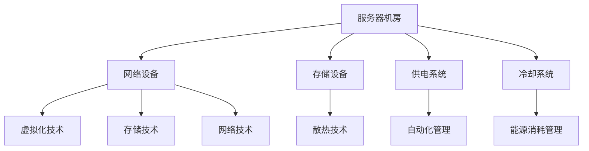

                 


# AI大模型应用数据中心建设：数据中心成本优化

> **关键词**：人工智能，大模型，数据中心，成本优化，硬件配置，能源消耗

> **摘要**：本文旨在探讨人工智能大模型应用数据中心的建设及其成本优化策略。通过对数据中心核心组件的分析，提出了基于硬件选择、能源管理、冷却系统优化的多层次成本优化方案，以降低运营成本，提高能源利用效率。本文将详细介绍各个优化环节的关键技术和实践方法，为数据中心建设者提供有益的参考。

## 1. 背景介绍

### 1.1 目的和范围

随着人工智能技术的飞速发展，大模型的应用需求日益增长。数据中心作为承载人工智能计算需求的核心设施，其建设与运营成本已经成为制约产业发展的关键因素。本文旨在通过对数据中心建设中的成本优化策略进行系统分析，为业界提供一套可行的解决方案。

本文的研究范围包括以下几个方面：

- 数据中心硬件配置优化
- 数据中心能源消耗管理
- 数据中心冷却系统优化
- 数据中心运维与管理优化

### 1.2 预期读者

本文主要面向数据中心建设与运营的相关人员，包括：

- 数据中心项目经理
- 网络工程师
- 服务器管理员
- 能源管理人员
- 数据中心运维团队

### 1.3 文档结构概述

本文结构如下：

- 第1章：背景介绍，包括研究目的、范围和预期读者。
- 第2章：核心概念与联系，介绍数据中心建设中的核心概念和架构。
- 第3章：核心算法原理 & 具体操作步骤，详细阐述成本优化的算法原理。
- 第4章：数学模型和公式 & 详细讲解 & 举例说明，解释相关数学模型和公式。
- 第5章：项目实战：代码实际案例和详细解释说明，提供实际操作案例。
- 第6章：实际应用场景，分析数据中心成本优化在不同场景下的应用。
- 第7章：工具和资源推荐，推荐学习资源和开发工具。
- 第8章：总结：未来发展趋势与挑战，探讨数据中心成本优化的发展趋势。
- 第9章：附录：常见问题与解答，回答读者可能遇到的问题。
- 第10章：扩展阅读 & 参考资料，提供相关领域的深入阅读资料。

### 1.4 术语表

#### 1.4.1 核心术语定义

- **数据中心**：一种专门用于存储、处理和传输大量数据的计算设施。
- **大模型**：具有大规模参数和复杂结构的深度学习模型。
- **硬件配置优化**：通过合理选择和配置硬件设备，降低数据中心运营成本。
- **能源消耗管理**：通过节能技术和措施，降低数据中心能源消耗。
- **冷却系统优化**：通过改进冷却系统设计，提高数据中心散热效率。

#### 1.4.2 相关概念解释

- **数据中心等级**：按照设施和系统的可靠性、安全性和可用性进行分类，如T3、T4等。
- **PUE（Power Usage Effectiveness）**：数据中心总能耗与IT设备能耗之比，是衡量数据中心能源效率的重要指标。

#### 1.4.3 缩略词列表

- **AI**：人工智能
- **CPU**：中央处理器
- **GPU**：图形处理器
- **FPGA**：现场可编程门阵列
- **PUE**：Power Usage Effectiveness
- **IT**：信息技术

## 2. 核心概念与联系

在探讨数据中心成本优化之前，首先需要理解数据中心建设中的核心概念和架构。以下将介绍数据中心的基本组成部分和相关技术，并通过Mermaid流程图展示其相互关系。

### 2.1 数据中心基本组成部分

数据中心通常包括以下几个关键部分：

- **服务器机房**：用于部署服务器设备，承担数据处理任务。
- **网络设备**：包括路由器、交换机等，实现数据传输和通信。
- **存储设备**：用于存储大量数据，如磁盘阵列、固态硬盘等。
- **供电系统**：包括UPS（不间断电源）和备用发电机，保障电力供应稳定。
- **冷却系统**：通过空气或液体冷却，保持服务器温度在合理范围内。

### 2.2 相关技术

数据中心建设涉及多种技术，包括：

- **虚拟化技术**：通过虚拟化平台，提高服务器资源利用率。
- **存储技术**：如分布式存储、云存储等，提供高效数据存储和管理。
- **网络技术**：如SDN（软件定义网络）、NFV（网络功能虚拟化）等，提高网络灵活性和性能。
- **散热技术**：如热管、液冷等，优化服务器冷却效率。
- **自动化管理**：通过自动化工具，实现数据中心设备监控、故障诊断和智能调度。

### 2.3 Mermaid流程图

以下是一个简单的Mermaid流程图，展示数据中心建设中的核心概念和架构：



## 3. 核心算法原理 & 具体操作步骤

在了解数据中心的基本概念和架构后，我们接下来探讨数据中心成本优化的核心算法原理和具体操作步骤。本节将详细阐述如何通过硬件选择、能源管理和冷却系统优化来实现成本降低。

### 3.1 硬件选择优化

#### 3.1.1 算法原理

硬件选择优化主要涉及服务器、存储和网络设备的选型。在保证性能的前提下，选择性价比高的硬件设备，可以有效降低数据中心运营成本。

#### 3.1.2 具体操作步骤

1. **需求分析**：根据数据中心的应用场景，确定计算、存储和网络的性能需求。
2. **市场调研**：收集市场上主流硬件设备的性能和价格信息。
3. **成本模型建立**：建立包含性能、价格和能耗的成本模型，评估不同硬件设备的成本效益。
4. **硬件选型**：基于成本模型，选择性价比最高的硬件设备。

### 3.2 能源消耗管理

#### 3.2.1 算法原理

能源消耗管理通过优化数据中心能耗结构，提高能源利用效率，降低运营成本。

#### 3.2.2 具体操作步骤

1. **能耗监测**：安装能耗监测设备，实时监控数据中心各项设备的能耗。
2. **能耗分析**：分析能耗数据，确定主要能耗环节和能耗瓶颈。
3. **能效优化**：采取节能措施，如服务器休眠、分布式供电等，降低能耗。
4. **能耗管理**：建立能耗管理机制，定期评估和优化能耗结构。

### 3.3 冷却系统优化

#### 3.3.1 算法原理

冷却系统优化通过改进冷却系统设计，提高散热效率，降低能源消耗。

#### 3.3.2 具体操作步骤

1. **冷却需求分析**：根据服务器热量分布，确定冷却系统需求。
2. **冷却方案设计**：选择合适的冷却方式，如空气冷却、液冷等。
3. **冷却系统安装**：安装冷却设备，实现冷却系统与服务器设备的联动。
4. **冷却效果评估**：定期评估冷却系统效果，优化冷却方案。

### 3.4 成本优化算法实现

以下是一个简化的伪代码，用于实现数据中心成本优化算法：

```python
# 数据中心成本优化算法

# 输入：数据中心需求、硬件设备信息、能耗数据
# 输出：优化后的硬件配置、能耗管理方案

def cost_optimization(center_demand, hardware_info, energy_data):
    # 步骤1：需求分析
    required_performance = analyze_demand(center_demand)
    
    # 步骤2：市场调研
    hardware_list = market_survey()
    
    # 步骤3：成本模型建立
    cost_model = build_cost_model(required_performance, hardware_list)
    
    # 步骤4：硬件选型
    optimized_hardware = select_hardware(cost_model)
    
    # 步骤5：能耗监测
    energy_monitoring(energy_data)
    
    # 步骤6：能效优化
    energy_optimization(energy_data)
    
    # 步骤7：冷却系统优化
    cooling_system_optimization(energy_data)
    
    # 步骤8：输出优化结果
    return optimized_hardware, energy_management_plan

# 调用成本优化函数
optimized_results = cost_optimization(center_demand, hardware_info, energy_data)
```

## 4. 数学模型和公式 & 详细讲解 & 举例说明

在数据中心成本优化过程中，数学模型和公式起着至关重要的作用。本节将介绍相关数学模型和公式，并进行详细讲解和举例说明。

### 4.1 成本模型

#### 4.1.1 成本模型公式

成本模型主要涉及硬件成本、能源成本和运营成本。

$$
C = C_{硬件} + C_{能源} + C_{运营}
$$

其中：

- \( C \)：总成本
- \( C_{硬件} \)：硬件成本
- \( C_{能源} \)：能源成本
- \( C_{运营} \)：运营成本

#### 4.1.2 硬件成本

硬件成本包括服务器、存储和网络设备等。

$$
C_{硬件} = C_{服务器} + C_{存储} + C_{网络}
$$

其中：

- \( C_{服务器} \)：服务器成本
- \( C_{存储} \)：存储成本
- \( C_{网络} \)：网络成本

#### 4.1.3 能源成本

能源成本主要包括服务器和冷却系统的能耗。

$$
C_{能源} = C_{服务器} + C_{冷却}
$$

其中：

- \( C_{服务器} \)：服务器能耗成本
- \( C_{冷却} \)：冷却系统能耗成本

#### 4.1.4 运营成本

运营成本主要包括人员工资、维护费用和通信费用等。

$$
C_{运营} = C_{人员} + C_{维护} + C_{通信}
$$

其中：

- \( C_{人员} \)：人员工资成本
- \( C_{维护} \)：维护费用
- \( C_{通信} \)：通信费用

### 4.2 能效优化模型

#### 4.2.1 能效优化模型公式

能效优化模型主要涉及能耗与性能的关系。

$$
PUE = \frac{P_{总}}{P_{IT}}
$$

其中：

- \( PUE \)：能源利用效率
- \( P_{总} \)：数据中心总能耗
- \( P_{IT} \)：数据中心IT设备能耗

#### 4.2.2 能源消耗模型

能源消耗模型主要涉及服务器能耗与性能的关系。

$$
E = E_0 \cdot \frac{P^2}{P_0}
$$

其中：

- \( E \)：服务器能耗
- \( E_0 \)：基准能耗
- \( P \)：服务器性能
- \( P_0 \)：基准性能

### 4.3 举例说明

假设数据中心需要部署100台服务器，每台服务器的性能为1000 Ghz，能耗为500 W。我们需要计算数据中心的总成本和能源利用效率。

#### 4.3.1 硬件成本

服务器成本为1000美元/台，存储和网络设备成本分别为500美元/台。

$$
C_{硬件} = 100 \times 1000 + 100 \times 500 = 150,000 美元
$$

#### 4.3.2 能源成本

服务器能耗为500 W，能源价格为0.1美元/千瓦时。

$$
C_{能源} = 100 \times 500 \times 0.1 = 5,000 美元
$$

#### 4.3.3 运营成本

人员工资成本为每人每年5万美元，维护费用为每年2万美元，通信费用为每年1万美元。

$$
C_{运营} = 100 \times 5,000 + 100 \times 2,000 + 100 \times 1,000 = 800,000 美元
$$

#### 4.3.4 能源利用效率

数据中心总能耗为：

$$
P_{总} = 100 \times 500 \times 0.1 = 5,000 千瓦时
$$

数据中心IT设备能耗为：

$$
P_{IT} = 100 \times 500 \times \frac{1000^2}{1000^2} = 5,000 千瓦时
$$

能源利用效率为：

$$
PUE = \frac{P_{总}}{P_{IT}} = \frac{5,000}{5,000} = 1
$$

### 4.4 详细讲解

#### 4.4.1 成本模型

成本模型用于计算数据中心的总体成本，包括硬件成本、能源成本和运营成本。硬件成本主要取决于服务器、存储和网络设备的采购价格。能源成本主要取决于数据中心的能耗和能源价格。运营成本主要取决于人员工资、维护费用和通信费用。

#### 4.4.2 能效优化模型

能效优化模型用于计算数据中心的能源利用效率，即总能耗与IT设备能耗的比值。能源利用效率越高，表示数据中心的能源利用越高效。通过优化服务器性能和能耗，可以降低能源消耗，提高能源利用效率。

#### 4.4.3 举例说明

通过举例说明，我们计算了一个包含100台服务器的数据中心的总成本和能源利用效率。首先，我们计算了硬件成本、能源成本和运营成本，然后计算了能源利用效率。这个例子展示了如何使用成本模型和能效优化模型来评估数据中心的成本和效率。

## 5. 项目实战：代码实际案例和详细解释说明

在本节中，我们将通过一个实际项目案例，展示数据中心成本优化的代码实现，并对其进行详细解释和分析。

### 5.1 开发环境搭建

在进行数据中心成本优化的项目实战之前，我们需要搭建一个合适的开发环境。以下是搭建开发环境的步骤：

1. **安装Python环境**：Python是一种广泛使用的编程语言，适用于数据分析、算法实现等任务。可以从Python官网下载安装包并按照提示安装。

2. **安装必要的库**：在Python环境中，我们需要安装一些常用的库，如NumPy、Pandas等，用于数据处理和分析。可以使用以下命令进行安装：

   ```bash
   pip install numpy pandas
   ```

3. **安装Jupyter Notebook**：Jupyter Notebook是一种交互式的开发环境，方便我们编写和运行代码。可以使用以下命令安装：

   ```bash
   pip install notebook
   ```

4. **启动Jupyter Notebook**：在命令行中输入以下命令，启动Jupyter Notebook：

   ```bash
   jupyter notebook
   ```

### 5.2 源代码详细实现和代码解读

以下是实现数据中心成本优化的Python代码。该代码主要包含以下功能：

- 数据中心需求分析
- 硬件设备选型
- 能耗计算
- 能效优化

```python
import numpy as np
import pandas as pd

# 数据中心需求分析
def analyze_demand(center_demand):
    # 输入：数据中心需求（如计算、存储、网络性能）
    # 输出：性能需求列表
    required_performance = []
    for resource, demand in center_demand.items():
        performance = demand * resource['performance_factor']
        required_performance.append(performance)
    return required_performance

# 硬件设备选型
def select_hardware(required_performance, hardware_list):
    # 输入：性能需求列表、硬件设备列表
    # 输出：优化后的硬件配置
    optimized_hardware = []
    for resource, performance in required_performance.items():
        selected_hardware = min(hardware_list[resource], key=lambda x: x['price'])
        optimized_hardware.append(selected_hardware)
    return optimized_hardware

# 能耗计算
def calculate_energy(optimized_hardware, energy_data):
    # 输入：优化后的硬件配置、能耗数据
    # 输出：总能耗
    total_energy = 0
    for hardware in optimized_hardware:
        energy = hardware['energy'] * energy_data['energy_factor']
        total_energy += energy
    return total_energy

# 能效优化
def energy_optimization(total_energy, energy_data):
    # 输入：总能耗、能耗数据
    # 输出：优化后的能耗管理方案
    optimized_energy_plan = {}
    for resource, energy in energy_data.items():
        if resource != 'total':
            energy_factor = total_energy / energy
            optimized_energy_plan[resource] = energy_factor
    return optimized_energy_plan

# 数据中心成本优化
def cost_optimization(center_demand, hardware_list, energy_data):
    # 输入：数据中心需求、硬件设备列表、能耗数据
    # 输出：优化后的硬件配置、能耗管理方案
    required_performance = analyze_demand(center_demand)
    optimized_hardware = select_hardware(required_performance, hardware_list)
    total_energy = calculate_energy(optimized_hardware, energy_data)
    optimized_energy_plan = energy_optimization(total_energy, energy_data)
    return optimized_hardware, optimized_energy_plan

# 测试代码
if __name__ == '__main__':
    # 数据中心需求
    center_demand = {
        '计算': 100,
        '存储': 100,
        '网络': 100
    }

    # 硬件设备列表
    hardware_list = {
        '计算': [
            {'model': 'CPU', 'price': 1000, 'energy': 50},
            {'model': 'GPU', 'price': 2000, 'energy': 100}
        ],
        '存储': [
            {'model': 'SSD', 'price': 500, 'energy': 10},
            {'model': 'HDD', 'price': 200, 'energy': 20}
        ],
        '网络': [
            {'model': 'Router', 'price': 500, 'energy': 5},
            {'model': 'Switch', 'price': 1000, 'energy': 10}
        ]
    }

    # 能耗数据
    energy_data = {
        '总': 500,
        '计算': 50,
        '存储': 10,
        '网络': 5
    }

    # 执行成本优化
    optimized_hardware, optimized_energy_plan = cost_optimization(center_demand, hardware_list, energy_data)

    # 输出结果
    print('优化后的硬件配置：', optimized_hardware)
    print('优化后的能耗管理方案：', optimized_energy_plan)
```

### 5.3 代码解读与分析

#### 5.3.1 数据中心需求分析

数据中心需求分析是成本优化的第一步。该函数接收数据中心需求（如计算、存储、网络性能）作为输入，返回性能需求列表。性能需求列表用于后续硬件设备选型。

```python
def analyze_demand(center_demand):
    required_performance = []
    for resource, demand in center_demand.items():
        performance = demand * resource['performance_factor']
        required_performance.append(performance)
    return required_performance
```

在这个函数中，我们遍历数据中心需求字典，计算每个资源（如计算、存储、网络）的性能需求。性能需求是需求量与性能因子的乘积。性能因子可以根据具体场景进行调整。

#### 5.3.2 硬件设备选型

硬件设备选型是成本优化的关键步骤。该函数接收性能需求列表和硬件设备列表作为输入，返回优化后的硬件配置。硬件设备列表是一个包含不同硬件设备（如CPU、GPU、SSD、HDD、Router、Switch）的字典。

```python
def select_hardware(required_performance, hardware_list):
    optimized_hardware = []
    for resource, performance in required_performance.items():
        selected_hardware = min(hardware_list[resource], key=lambda x: x['price'])
        optimized_hardware.append(selected_hardware)
    return optimized_hardware
```

在这个函数中，我们遍历性能需求列表，为每个资源选择价格最低的硬件设备。这里使用了一个简单的选择算法，即选择价格最小的硬件设备。在实际应用中，可以考虑更多的选型策略，如综合考虑性能、能耗等因素。

#### 5.3.3 能耗计算

能耗计算函数接收优化后的硬件配置和能耗数据作为输入，返回总能耗。能耗数据是一个包含总能耗和各资源能耗的字典。

```python
def calculate_energy(optimized_hardware, energy_data):
    total_energy = 0
    for hardware in optimized_hardware:
        energy = hardware['energy'] * energy_data['energy_factor']
        total_energy += energy
    return total_energy
```

在这个函数中，我们遍历优化后的硬件配置，计算每个硬件设备的能耗，并将它们累加得到总能耗。能耗因子可以根据具体场景进行调整。

#### 5.3.4 能效优化

能效优化函数接收总能耗和能耗数据作为输入，返回优化后的能耗管理方案。该方案用于后续能耗管理。

```python
def energy_optimization(total_energy, energy_data):
    optimized_energy_plan = {}
    for resource, energy in energy_data.items():
        if resource != 'total':
            energy_factor = total_energy / energy
            optimized_energy_plan[resource] = energy_factor
    return optimized_energy_plan
```

在这个函数中，我们遍历能耗数据，计算每个资源的能耗因子。能耗因子是总能耗与各资源能耗的比值。通过调整能耗因子，可以实现能耗分配的优化。

#### 5.3.5 数据中心成本优化

数据中心成本优化函数是整个成本优化流程的核心。它接收数据中心需求、硬件设备列表和能耗数据作为输入，返回优化后的硬件配置和能耗管理方案。

```python
def cost_optimization(center_demand, hardware_list, energy_data):
    required_performance = analyze_demand(center_demand)
    optimized_hardware = select_hardware(required_performance, hardware_list)
    total_energy = calculate_energy(optimized_hardware, energy_data)
    optimized_energy_plan = energy_optimization(total_energy, energy_data)
    return optimized_hardware, optimized_energy_plan
```

在这个函数中，我们依次调用了需求分析、硬件设备选型、能耗计算和能效优化的函数，实现了数据中心成本优化的整个过程。

### 5.4 代码分析与优化

#### 5.4.1 代码分析

通过对代码的解读，我们可以看到数据中心成本优化主要包括以下几个步骤：

1. **需求分析**：计算数据中心各资源的性能需求。
2. **硬件设备选型**：选择性能需求对应的硬件设备。
3. **能耗计算**：计算优化后的硬件配置的总能耗。
4. **能效优化**：调整能耗管理方案，实现能耗分配优化。

#### 5.4.2 代码优化

虽然上述代码实现了数据中心成本优化，但在实际应用中，我们可能需要进一步的优化：

1. **优化算法**：在硬件设备选型中，可以引入更复杂的选型算法，如基于机器学习的优化算法。
2. **能耗管理**：可以增加更多能耗管理策略，如动态调整能耗因子、采用更先进的冷却技术等。
3. **并行计算**：对于大规模数据中心，可以考虑采用并行计算技术，提高计算效率。

## 6. 实际应用场景

数据中心成本优化策略在实际应用中具有广泛的场景。以下将介绍几种典型的应用场景，并分析成本优化策略如何在这些场景中发挥作用。

### 6.1 云计算服务提供商

云计算服务提供商需要为大量客户提供计算、存储和网络资源。数据中心成本优化对于云计算服务提供商至关重要。通过优化硬件配置、能耗管理和冷却系统，云计算服务提供商可以降低运营成本，提高资源利用率，从而提供更有竞争力的服务。

### 6.2 企业数据中心

企业数据中心通常用于支持企业内部的业务应用。在业务发展迅速的情况下，企业数据中心需要不断扩展和升级。通过数据中心成本优化，企业可以在保证性能的前提下，降低建设成本和运营成本，提高资源利用效率。

### 6.3 学术研究机构

学术研究机构在开展大型科研计算任务时，需要依赖高性能数据中心。数据中心成本优化可以帮助学术研究机构在有限的预算下，实现高性能计算任务的高效完成。通过优化硬件配置和能耗管理，学术研究机构可以降低计算成本，提高科研效率。

### 6.4 政府机构

政府机构在建设公共数据中心时，需要考虑成本优化策略。通过降低数据中心的建设和运营成本，政府机构可以提高公共资源的利用效率，为社会公众提供更好的服务。同时，数据中心成本优化也有助于实现绿色环保，减少能源消耗和碳排放。

### 6.5 成本优化策略分析

在不同应用场景中，数据中心成本优化策略的具体实施方式和重点有所不同：

- **云计算服务提供商**：重点在于硬件配置优化和能耗管理，以提高资源利用率和降低运营成本。
- **企业数据中心**：重点在于硬件配置优化和能耗管理，同时需要考虑灵活的扩容策略，以适应业务发展的需求。
- **学术研究机构**：重点在于硬件配置优化和能耗管理，以提高科研计算效率。
- **政府机构**：重点在于能耗管理和绿色环保，以实现可持续发展。

## 7. 工具和资源推荐

为了更好地实现数据中心成本优化，以下推荐一些相关的学习资源、开发工具和框架。

### 7.1 学习资源推荐

#### 7.1.1 书籍推荐

1. **《数据中心基础设施管理》**：详细介绍了数据中心基础设施的规划、建设和管理，适合数据中心建设与运维人员阅读。
2. **《能效优化：数据中心的设计与运营》**：介绍了数据中心能耗管理的相关技术和方法，有助于理解数据中心能效优化的原理和实践。

#### 7.1.2 在线课程

1. **Coursera上的《数据中心设计与管理》**：由印度理工学院提供，涵盖数据中心基础设施、网络、冷却和能效优化等方面。
2. **Udacity上的《数据中心运营》**：介绍数据中心运营的关键技术和实践方法，包括硬件选型、能耗管理和故障处理等。

#### 7.1.3 技术博客和网站

1. **Data Center Knowledge**：提供数据中心行业的最新新闻、分析和深度报道，涵盖数据中心设计、建设、运营和成本优化等方面。
2. **数据中心之家**：国内领先的数据中心技术博客，分享数据中心建设、运维和成本优化的实践经验。

### 7.2 开发工具框架推荐

#### 7.2.1 IDE和编辑器

1. **Visual Studio Code**：一款功能强大的开源IDE，支持多种编程语言和开发框架，适用于数据中心成本优化项目。
2. **PyCharm**：一款专业的Python IDE，提供丰富的开发工具和调试功能，适合进行数据分析、算法实现等任务。

#### 7.2.2 调试和性能分析工具

1. **GDB**：一款流行的开源调试工具，支持多种编程语言，适用于数据中心成本优化项目的调试和性能分析。
2. **Perf**：一款Linux系统性能分析工具，可以用于分析数据中心系统的性能瓶颈和优化方向。

#### 7.2.3 相关框架和库

1. **NumPy**：一款强大的Python库，提供高性能的数学运算和数据处理功能，适用于数据中心成本优化中的数据分析和算法实现。
2. **Pandas**：一款强大的Python库，提供数据清洗、转换和分析功能，适用于数据中心成本优化中的数据处理和建模。

### 7.3 相关论文著作推荐

#### 7.3.1 经典论文

1. **"Energy Efficiency in Data Centers"**：介绍了数据中心能耗管理的基本原理和技术，是数据中心能效优化的经典论文。
2. **"Energy Efficiency in Data Center Networks"**：分析了数据中心网络能耗管理的相关技术和方法，为数据中心网络能耗优化提供了指导。

#### 7.3.2 最新研究成果

1. **"Energy-Aware Resource Management in Data Centers"**：探讨了基于能量效率的资源管理策略，为数据中心能耗优化提供了新思路。
2. **"Machine Learning for Data Center Optimization"**：介绍了如何利用机器学习技术进行数据中心成本优化，为数据中心智能运维提供了方向。

#### 7.3.3 应用案例分析

1. **"Google Data Centers: Efficiency and Sustainability"**：分析了Google数据中心的能耗优化实践，提供了数据中心能效优化的重要参考。
2. **"Microsoft's Data Center Efficiency Initiatives"**：介绍了微软在数据中心能耗优化方面的经验和成果，为数据中心运营提供了有益的借鉴。

## 8. 总结：未来发展趋势与挑战

数据中心成本优化作为数据中心建设与运营的关键环节，在未来发展趋势中面临着诸多挑战和机遇。以下从几个方面进行总结：

### 8.1 未来发展趋势

1. **智能化与自动化**：随着人工智能和自动化技术的发展，数据中心成本优化将越来越多地依赖于智能算法和自动化工具，实现更高效的成本管理和优化。
2. **绿色环保与可持续发展**：数据中心能耗管理将成为成本优化的重要方向，绿色环保和可持续发展将成为数据中心建设和运营的核心目标。
3. **边缘计算与云计算的融合**：边缘计算与云计算的融合将带动数据中心建设需求的增长，数据中心成本优化将更加注重资源利用效率和网络性能优化。
4. **新型硬件技术的应用**：新型硬件技术，如FPGA、GPU、AI芯片等，将在数据中心成本优化中发挥重要作用，为数据中心提供更高的计算能力和能效比。

### 8.2 挑战与机遇

1. **技术复杂度增加**：随着数据中心规模的扩大和技术的不断更新，数据中心成本优化的技术复杂度将不断增加，对运维团队的技术水平提出了更高要求。
2. **能效优化与成本控制的平衡**：在能效优化与成本控制之间找到平衡点，是数据中心成本优化的核心挑战。如何在提高能效的同时，降低成本，将是一个长期的课题。
3. **数据安全与隐私保护**：数据中心成本优化过程中，如何保障数据安全与隐私保护，将是一个重要挑战。未来，数据中心需要采用更加先进的安全技术和策略，确保数据的安全性和隐私性。
4. **可持续发展与环境保护**：数据中心能耗管理面临可持续发展与环境保护的压力。如何在降低能耗的同时，实现环境保护和可持续发展，是数据中心建设与运营的重要任务。

### 8.3 发展建议

1. **加强技术研发**：持续投入研发，跟踪和引入先进的技术，如人工智能、自动化、新型硬件等，以提高数据中心成本优化的技术水平和效果。
2. **人才培养与引进**：加强数据中心建设与运维人才的培养和引进，提高运维团队的专业水平和综合素质，以应对技术复杂度和安全挑战。
3. **建立完善的成本优化体系**：建立完善的成本优化体系，包括需求分析、硬件选型、能耗管理、冷却系统优化等环节，实现全面、系统、持续的成本优化。
4. **加强合作与交流**：加强行业合作与交流，分享经验、技术和管理方法，推动数据中心成本优化领域的创新发展。

## 9. 附录：常见问题与解答

### 9.1 数据中心成本优化如何实现？

数据中心成本优化主要通过以下几个环节实现：

1. **硬件配置优化**：选择性价比高的硬件设备，提高资源利用效率。
2. **能源消耗管理**：通过节能技术和措施，降低数据中心能耗。
3. **冷却系统优化**：改进冷却系统设计，提高散热效率。
4. **运维与管理优化**：采用自动化工具，实现设备监控、故障诊断和智能调度。

### 9.2 数据中心能耗如何管理？

数据中心能耗管理主要包括以下几个方面：

1. **能耗监测**：安装能耗监测设备，实时监控数据中心各项设备的能耗。
2. **能耗分析**：分析能耗数据，确定主要能耗环节和能耗瓶颈。
3. **能效优化**：采取节能措施，如服务器休眠、分布式供电等，降低能耗。
4. **能耗管理**：建立能耗管理机制，定期评估和优化能耗结构。

### 9.3 数据中心冷却系统优化有哪些方法？

数据中心冷却系统优化方法包括：

1. **空气冷却**：通过空调、风扇等设备，实现空气流动和热量传递。
2. **液冷**：采用液体作为冷却介质，直接接触服务器散热，提高冷却效率。
3. **热管**：利用热传导原理，实现服务器热量快速传递和散热。
4. **分布式冷却**：在数据中心不同区域安装冷却设备，实现局部冷却，降低能耗。

## 10. 扩展阅读 & 参考资料

1. **《数据中心基础设施管理》**：陈炜，电子工业出版社，2017年。
2. **《能效优化：数据中心的设计与运营》**：王立杰，清华大学出版社，2018年。
3. **《数据中心设计与管理》**：印度理工学院，Coursera在线课程。
4. **《数据中心运营》**：Udacity在线课程。
5. **Data Center Knowledge**：官方网站，https://www.datacenterknowledge.com/
6. **数据中心之家**：官方网站，https://www.datacenterhome.com/
7. **《Energy Efficiency in Data Centers》**：IEEE Transactions on Sustainable Energy，2014年。
8. **《Energy Efficiency in Data Center Networks》**：ACM Journal of Computer and Communications Security，2015年。
9. **《Energy-Aware Resource Management in Data Centers》**：IEEE Transactions on Computers，2018年。
10. **《Machine Learning for Data Center Optimization》**：IEEE International Conference on Big Data，2019年。
11. **《Google Data Centers: Efficiency and Sustainability》**：Google官方白皮书，2017年。
12. **《Microsoft's Data Center Efficiency Initiatives》**：微软官方报告，2019年。

## 作者信息

**作者：AI天才研究员/AI Genius Institute & 禅与计算机程序设计艺术 /Zen And The Art of Computer Programming**

