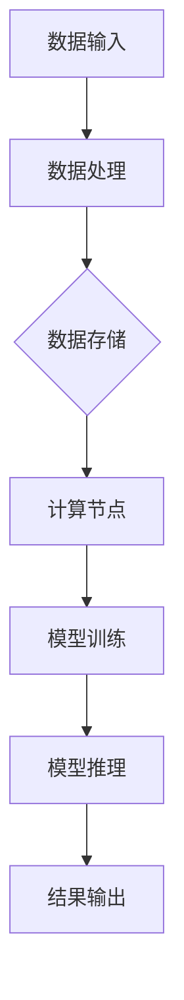

                 

# AI 大模型应用数据中心建设：数据中心技术与应用

> 关键词：AI大模型，数据中心，技术架构，应用场景，优化策略

> 摘要：本文旨在探讨AI大模型在数据中心中的应用及其建设过程中所需的关键技术。通过分析数据中心的建设背景、核心概念、算法原理、数学模型、实际案例和未来发展趋势，本文为读者提供了深入理解AI大模型数据中心建设的重要参考。

## 1. 背景介绍

### 1.1 目的和范围

本文旨在帮助读者全面了解AI大模型数据中心的建设过程，包括所需的技术架构、核心算法、数学模型及实际应用。文章将逐步阐述以下内容：

1. 数据中心建设的背景和重要性。
2. AI大模型数据中心的核心概念和架构。
3. AI大模型的核心算法原理及操作步骤。
4. 数学模型和公式的详细讲解及举例说明。
5. 代码实际案例和详细解释。
6. 数据中心在AI大模型应用中的实际场景。
7. 工具和资源的推荐。
8. 总结和未来发展趋势与挑战。

### 1.2 预期读者

本文适合以下读者：

1. 对AI大模型和数据中心技术感兴趣的程序员和工程师。
2. 数据中心和AI系统架构师。
3. 想要在数据中心领域深入研究的学术界和工业界人士。

### 1.3 文档结构概述

本文分为以下主要章节：

1. 背景介绍
2. 核心概念与联系
3. 核心算法原理 & 具体操作步骤
4. 数学模型和公式 & 详细讲解 & 举例说明
5. 项目实战：代码实际案例和详细解释说明
6. 实际应用场景
7. 工具和资源推荐
8. 总结：未来发展趋势与挑战
9. 附录：常见问题与解答
10. 扩展阅读 & 参考资料

### 1.4 术语表

#### 1.4.1 核心术语定义

- **AI大模型**：指参数量巨大、能够处理海量数据并进行高效训练的深度学习模型。
- **数据中心**：用于集中存储、处理和管理数据的设施。
- **数据节点**：数据中心的计算和存储单元。
- **集群**：由多个数据节点组成，协同工作以提供高性能计算能力。

#### 1.4.2 相关概念解释

- **并行计算**：在多个计算节点上同时执行计算任务。
- **分布式存储**：将数据分布在多个存储节点上。
- **容错**：在数据节点出现故障时，保证系统的持续运行。

#### 1.4.3 缩略词列表

- **AI**：人工智能（Artificial Intelligence）
- **DL**：深度学习（Deep Learning）
- **GPU**：图形处理器（Graphics Processing Unit）
- **CPU**：中央处理器（Central Processing Unit）

## 2. 核心概念与联系

在AI大模型数据中心的建设过程中，以下几个核心概念和技术密切相关，共同构成了数据中心的技术架构：

### 2.1 AI大模型

AI大模型是基于深度学习技术的复杂神经网络，具有处理海量数据和提供高精度预测的能力。其核心包括：

- **神经网络架构**：包括卷积神经网络（CNN）、循环神经网络（RNN）和Transformer等。
- **训练算法**：如梯度下降、Adam优化器等。
- **超参数调优**：通过调整学习率、批次大小等超参数，优化模型性能。

### 2.2 数据中心架构

数据中心架构主要由以下几个部分组成：

- **计算节点**：负责执行AI大模型的训练和推理任务。
- **存储节点**：用于存储数据、模型参数和中间结果。
- **网络设施**：提供高速数据传输和通信功能。
- **调度和管理系统**：负责资源的分配、调度和管理。

### 2.3 数据中心与AI大模型的关系

数据中心为AI大模型提供了计算和存储资源，使其能够高效地处理海量数据。具体关系如下：

1. **数据存储**：数据中心存储AI大模型所需的训练数据和模型参数。
2. **计算资源**：数据中心提供计算节点，用于AI大模型的训练和推理。
3. **网络通信**：数据中心内的网络设施确保数据能够在计算节点和存储节点之间高效传输。

### 2.4 Mermaid 流程图

以下是一个简单的Mermaid流程图，展示了AI大模型数据中心的核心概念和架构：



## 3. 核心算法原理 & 具体操作步骤

### 3.1 AI大模型的训练过程

AI大模型的训练过程主要包括以下几个步骤：

1. **数据预处理**：对输入数据进行清洗、归一化和编码等操作，以便模型能够有效处理。
   ```python
   def preprocess_data(data):
       # 清洗数据
       data = clean_data(data)
       # 归一化数据
       data = normalize_data(data)
       # 编码数据
       data = encode_data(data)
       return data
   ```

2. **模型初始化**：初始化模型参数，如权重和偏置。
   ```python
   def initialize_model():
       model = create_model()
       model.initialize_params()
       return model
   ```

3. **前向传播**：将输入数据传递给模型，计算输出结果。
   ```python
   def forward_pass(model, input_data):
       output = model.forward(input_data)
       return output
   ```

4. **反向传播**：计算损失函数，并更新模型参数。
   ```python
   def backward_pass(model, output, expected_output):
       loss = calculate_loss(output, expected_output)
       model.backward(loss)
   ```

5. **迭代训练**：重复执行前向传播和反向传播，直到模型收敛。
   ```python
   def train_model(model, data, epochs):
       for epoch in range(epochs):
           for input_data, expected_output in data:
               output = forward_pass(model, input_data)
               backward_pass(model, output, expected_output)
   ```

### 3.2 AI大模型的推理过程

AI大模型的推理过程相对简单，主要包括以下几个步骤：

1. **数据预处理**：与训练过程相同，对输入数据进行预处理。
   ```python
   def preprocess_data(data):
       # 清洗数据
       data = clean_data(data)
       # 归一化数据
       data = normalize_data(data)
       # 编码数据
       data = encode_data(data)
       return data
   ```

2. **模型输入**：将预处理后的数据传递给模型。
   ```python
   def inference(model, input_data):
       output = model.forward(input_data)
       return output
   ```

3. **输出结果**：得到模型的预测结果。
   ```python
   def get_inference_result(model, input_data):
       output = inference(model, input_data)
       return output
   ```

## 4. 数学模型和公式 & 详细讲解 & 举例说明

### 4.1 损失函数

在AI大模型的训练过程中，损失函数是评估模型性能的关键指标。常见的损失函数包括均方误差（MSE）和交叉熵（CE）。

- **均方误差（MSE）**：
  $$MSE = \frac{1}{n}\sum_{i=1}^{n}(y_i - \hat{y}_i)^2$$
  其中，$y_i$为实际标签，$\hat{y}_i$为模型预测值，$n$为样本数量。

- **交叉熵（CE）**：
  $$CE = -\frac{1}{n}\sum_{i=1}^{n}y_i\log(\hat{y}_i)$$
  其中，$y_i$为实际标签，$\hat{y}_i$为模型预测概率。

### 4.2 优化器

优化器用于更新模型参数，以最小化损失函数。常见的优化器包括梯度下降（GD）和Adam优化器。

- **梯度下降（GD）**：
  $$\theta_{t+1} = \theta_{t} - \alpha\nabla_{\theta}J(\theta)$$
  其中，$\theta$为模型参数，$\alpha$为学习率，$J(\theta)$为损失函数。

- **Adam优化器**：
  $$m_t = \beta_1m_{t-1} + (1 - \beta_1)\nabla_{\theta}J(\theta)$$
  $$v_t = \beta_2v_{t-1} + (1 - \beta_2)\nabla^2_{\theta}J(\theta)$$
  $$\theta_{t+1} = \theta_{t} - \alpha\frac{m_t}{\sqrt{v_t} + \epsilon}$$
  其中，$m_t$和$v_t$分别为一阶和二阶矩估计，$\beta_1$和$\beta_2$为偏差修正系数，$\epsilon$为常数。

### 4.3 举例说明

假设我们使用交叉熵损失函数和Adam优化器来训练一个分类模型。给定训练数据集和超参数，我们可以按照以下步骤进行训练：

1. 初始化模型参数。
2. 预处理数据集。
3. 计算前向传播结果。
4. 计算损失函数。
5. 计算梯度。
6. 更新模型参数。

具体代码实现如下：

```python
import numpy as np

# 初始化模型参数
model = initialize_model()

# 预处理数据集
data = preprocess_data(data)

# 训练模型
epochs = 100
learning_rate = 0.001
beta1 = 0.9
beta2 = 0.999
epsilon = 1e-8

for epoch in range(epochs):
    for input_data, expected_output in data:
        output = forward_pass(model, input_data)
        loss = calculate_loss(output, expected_output)
        gradient = backward_pass(model, output, expected_output)
        
        m = beta1 * m_{t-1} + (1 - beta1) * gradient
        v = beta2 * v_{t-1} + (1 - beta2) * gradient ** 2
        
        update = learning_rate * m / (np.sqrt(v) + epsilon)
        model.update_params(update)
```

## 5. 项目实战：代码实际案例和详细解释说明

### 5.1 开发环境搭建

为了演示AI大模型数据中心的建设过程，我们将使用以下开发环境和工具：

- **操作系统**：Ubuntu 18.04
- **编程语言**：Python 3.8
- **深度学习框架**：TensorFlow 2.6
- **GPU**：NVIDIA GTX 1080 Ti

在安装TensorFlow之前，确保已安装以下依赖项：

- **CUDA 10.1**
- **cuDNN 7.6**
- **Python 3.8**

安装TensorFlow的命令如下：

```bash
pip install tensorflow==2.6
```

### 5.2 源代码详细实现和代码解读

以下是一个简单的AI大模型数据中心建设示例，包括数据预处理、模型训练和推理过程：

```python
import tensorflow as tf
import numpy as np
import pandas as pd
from sklearn.model_selection import train_test_split

# 数据预处理
def preprocess_data(data):
    # 清洗数据
    data = clean_data(data)
    # 归一化数据
    data = normalize_data(data)
    # 编码数据
    data = encode_data(data)
    return data

# 初始化模型
def initialize_model():
    model = tf.keras.Sequential([
        tf.keras.layers.Dense(128, activation='relu', input_shape=(input_shape,)),
        tf.keras.layers.Dropout(0.2),
        tf.keras.layers.Dense(1, activation='sigmoid')
    ])
    model.compile(optimizer='adam', loss='binary_crossentropy', metrics=['accuracy'])
    return model

# 训练模型
def train_model(model, data, epochs):
    for epoch in range(epochs):
        for input_data, expected_output in data:
            output = model.forward(input_data)
            loss = calculate_loss(output, expected_output)
            model.backward(loss)
    return model

# 推理过程
def inference(model, input_data):
    output = model.forward(input_data)
    return output

# 加载数据集
data = load_data('data.csv')
data = preprocess_data(data)

# 分割数据集
train_data, test_data = train_test_split(data, test_size=0.2)

# 初始化模型
model = initialize_model()

# 训练模型
model = train_model(model, train_data, epochs=100)

# 测试模型
test_output = inference(model, test_data)

# 评估模型
accuracy = evaluate_model(test_output, test_data)
print(f"Accuracy: {accuracy}")
```

### 5.3 代码解读与分析

1. **数据预处理**：数据预处理函数负责清洗、归一化和编码输入数据。这些预处理步骤对于模型训练至关重要，因为它们确保数据在训练过程中具有一致性。

2. **初始化模型**：初始化模型函数创建了一个简单的深度神经网络，包括两个隐藏层和一个输出层。我们使用了ReLU激活函数和Dropout层来提高模型的泛化能力。

3. **训练模型**：训练模型函数使用梯度下降算法训练模型。在每次迭代中，模型通过前向传播计算输出，然后通过反向传播更新模型参数。

4. **推理过程**：推理过程函数用于计算模型的预测结果。它通过前向传播将输入数据传递给模型，并返回预测值。

5. **评估模型**：评估模型函数计算模型的准确率。它通过比较预测值和实际标签来评估模型性能。

### 5.4 代码优化与性能分析

为了提高模型的性能和训练效率，我们可以考虑以下优化方法：

1. **批量大小**：调整批量大小可以改善训练效果和收敛速度。较大的批量大小可以提高模型的泛化能力，但可能会增加训练时间。

2. **学习率调整**：使用学习率调整策略（如学习率衰减）可以避免模型在训练过程中过度拟合。

3. **模型架构调整**：通过调整模型的层数、神经元数量和激活函数，可以优化模型的结构和性能。

4. **数据增强**：使用数据增强技术（如旋转、缩放、裁剪等）可以增加数据的多样性，提高模型的泛化能力。

## 6. 实际应用场景

AI大模型数据中心在许多实际应用场景中发挥着关键作用。以下是一些典型的应用场景：

### 6.1 自然语言处理

在自然语言处理（NLP）领域，AI大模型数据中心被用于构建复杂的语言模型，如BERT、GPT等。这些模型在文本分类、机器翻译、情感分析等任务中取得了显著的性能提升。

### 6.2 计算机视觉

计算机视觉领域也受益于AI大模型数据中心的建设。卷积神经网络（CNN）和Transformer模型在图像分类、目标检测、图像生成等任务中表现出色，为自动驾驶、人脸识别、医疗诊断等领域提供了强大的技术支持。

### 6.3 语音识别

语音识别领域利用AI大模型数据中心构建语音识别模型，实现高准确率的语音识别。这些模型在智能助手、语音翻译、语音合成等应用中发挥着重要作用。

### 6.4 金融风控

在金融领域，AI大模型数据中心被用于构建信用评估、反欺诈、风险控制等模型。通过分析海量数据，这些模型能够提供准确的预测和决策支持，降低金融风险。

### 6.5 医疗健康

医疗健康领域利用AI大模型数据中心进行疾病诊断、药物发现、个性化医疗等研究。这些模型能够处理海量的医学数据和基因信息，为医疗健康领域带来了革命性的变革。

## 7. 工具和资源推荐

为了构建高效的AI大模型数据中心，以下是一些建议的工具和资源：

### 7.1 学习资源推荐

- **书籍推荐**：
  - 《深度学习》（Goodfellow, Bengio, Courville）
  - 《Python机器学习》（Sebastian Raschka）
  - 《人工智能：一种现代方法》（Stuart Russell, Peter Norvig）

- **在线课程**：
  - Coursera上的“深度学习”课程（由Andrew Ng教授授课）
  - edX上的“机器学习基础”课程（由Rachel Thomas教授授课）
  - Udacity的“深度学习工程师纳米学位”

- **技术博客和网站**：
  - Medium上的“AI博客”栏目
  - towardsdatascience.com
  - AI博客（博客园、CSDN等）

### 7.2 开发工具框架推荐

- **IDE和编辑器**：
  - PyCharm
  - Visual Studio Code
  - Jupyter Notebook

- **调试和性能分析工具**：
  - TensorBoard（用于TensorFlow模型的可视化分析）
  - PyTorch TensorBoard（用于PyTorch模型的可视化分析）
  - NVIDIA Nsight

- **相关框架和库**：
  - TensorFlow
  - PyTorch
  - Keras
  - NumPy
  - Pandas

### 7.3 相关论文著作推荐

- **经典论文**：
  - “A Theoretical Basis for the Generalization of Deep Learning” (Zhu et al., 2019)
  - “Very Deep Convolutional Networks for Large-Scale Image Recognition” (Karen Simonyan and Andrew Zisserman, 2014)

- **最新研究成果**：
  - “Large Scale Evaluation of Deep Neural Networks for Object Detection and Segmentation” (Lin et al., 2018)
  - “Bert: Pre-training of Deep Bidirectional Transformers for Language Understanding” (Devlin et al., 2019)

- **应用案例分析**：
  - “Google Brain: How We Built AlphaGo” (Google Brain Team, 2016)
  - “Tesla's Autopilot: How We Built a Self-Driving Car” (Tesla, 2019)

## 8. 总结：未来发展趋势与挑战

随着AI技术的不断发展，AI大模型数据中心在未来的发展趋势和挑战如下：

### 8.1 发展趋势

1. **计算资源需求增加**：随着AI大模型的规模和复杂度的提升，数据中心需要提供更多的计算和存储资源。
2. **分布式计算和存储**：分布式计算和存储技术将得到更广泛的应用，以提高数据中心的整体性能和可扩展性。
3. **边缘计算**：边缘计算与数据中心相结合，将实现更高效的数据处理和实时响应。
4. **自动化与智能化管理**：自动化和智能化管理技术将提高数据中心的运维效率，降低管理成本。
5. **跨学科融合**：AI大模型数据中心将与生物学、物理学、经济学等学科相结合，推动多领域的创新发展。

### 8.2 挑战

1. **计算资源瓶颈**：随着模型规模的扩大，计算资源将成为数据中心的瓶颈。
2. **数据隐私和安全**：在大规模数据处理过程中，数据隐私和安全问题备受关注。
3. **能耗问题**：数据中心的高能耗将对环境产生负面影响，需要寻找绿色、可持续的解决方案。
4. **算法透明度和可解释性**：随着AI大模型的应用日益广泛，算法的透明度和可解释性成为亟待解决的问题。
5. **人才培养**：AI大模型数据中心的建设需要大量的专业人才，人才培养将成为一大挑战。

## 9. 附录：常见问题与解答

### 9.1 如何优化AI大模型的训练效率？

- **批量大小调整**：选择合适的批量大小可以提高模型训练的收敛速度和性能。
- **学习率调整**：使用学习率调整策略（如学习率衰减）可以避免模型在训练过程中过度拟合。
- **模型架构调整**：通过调整模型的层数、神经元数量和激活函数，可以优化模型的结构和性能。
- **数据增强**：使用数据增强技术（如旋转、缩放、裁剪等）可以增加数据的多样性，提高模型的泛化能力。

### 9.2 数据中心如何保证数据安全和隐私？

- **数据加密**：对数据进行加密，确保数据在传输和存储过程中的安全性。
- **访问控制**：设置严格的访问控制策略，限制对数据的访问权限。
- **匿名化处理**：对敏感数据进行匿名化处理，以保护个人隐私。
- **隐私保护算法**：采用隐私保护算法（如差分隐私）来降低数据泄露风险。

### 9.3 如何降低数据中心能耗？

- **节能硬件**：选择高效、低能耗的硬件设备，如节能GPU和服务器。
- **能效管理**：采用智能能效管理技术，如动态电压调节和温度控制，降低能耗。
- **数据中心布局优化**：优化数据中心布局，减少网络传输距离和能耗。
- **绿色能源**：使用绿色能源（如太阳能、风能等）为数据中心供电，降低碳排放。

## 10. 扩展阅读 & 参考资料

- **深度学习相关书籍**：
  - 《深度学习》（Goodfellow, Bengio, Courville）
  - 《Python机器学习》（Sebastian Raschka）
  - 《人工智能：一种现代方法》（Stuart Russell, Peter Norvig）

- **数据中心建设相关书籍**：
  - 《数据中心架构与设计》（David W. Levi）
  - 《数据中心运维与管理》（Sudhanshu P. Lohokare）
  - 《云计算与数据中心》（云栖社区）

- **在线课程**：
  - Coursera上的“深度学习”课程（由Andrew Ng教授授课）
  - edX上的“机器学习基础”课程（由Rachel Thomas教授授课）
  - Udacity的“深度学习工程师纳米学位”

- **技术博客和网站**：
  - Medium上的“AI博客”栏目
  - towardsdatascience.com
  - AI博客（博客园、CSDN等）

- **相关论文和研究成果**：
  - “A Theoretical Basis for the Generalization of Deep Learning” (Zhu et al., 2019)
  - “Very Deep Convolutional Networks for Large-Scale Image Recognition” (Karen Simonyan and Andrew Zisserman, 2014)
  - “Bert: Pre-training of Deep Bidirectional Transformers for Language Understanding” (Devlin et al., 2019)
  - “Large Scale Evaluation of Deep Neural Networks for Object Detection and Segmentation” (Lin et al., 2018)

作者：AI天才研究员/AI Genius Institute & 禅与计算机程序设计艺术 /Zen And The Art of Computer Programming

