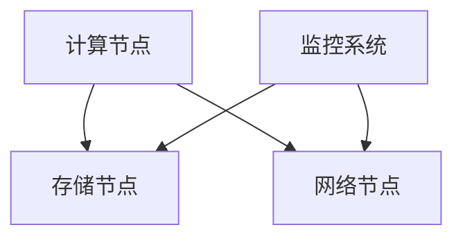
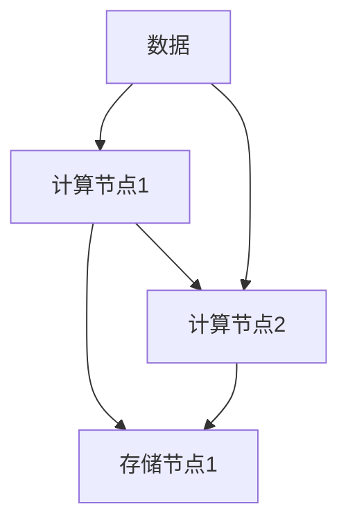
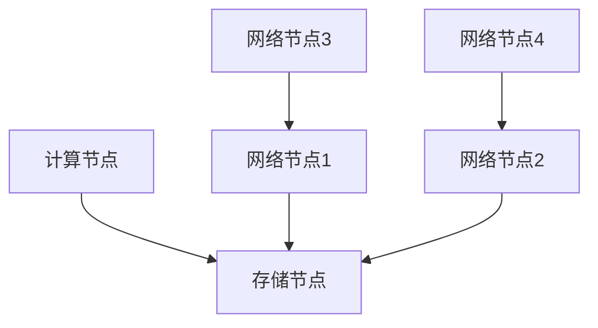

                 


# AI 大模型应用数据中心建设：数据中心技术与应用

> 关键词：AI 大模型、数据中心、技术架构、性能优化、安全性

> 摘要：本文旨在探讨 AI 大模型应用数据中心的建设，分析数据中心技术与应用的关键要素，详细阐述核心概念、算法原理、数学模型及实际案例，提供实用的工具和资源推荐，为读者全面了解和建设高效 AI 大模型应用数据中心提供指导。

## 1. 背景介绍

### 1.1 目的和范围

随着人工智能技术的快速发展，大模型（如 GPT、BERT 等）在自然语言处理、计算机视觉等领域取得了显著的成果。为了充分利用这些大模型，数据中心的建设变得尤为重要。本文将围绕 AI 大模型应用数据中心的建设，探讨其技术架构、核心算法、数学模型及实际应用，旨在为读者提供一套完整的技术指南。

### 1.2 预期读者

本文适合以下读者群体：

1. 数据中心架构师和运维人员
2. 人工智能工程师和研究人员
3. 对 AI 大模型应用和数据中心建设感兴趣的技术爱好者

### 1.3 文档结构概述

本文共分为十个部分：

1. 背景介绍
2. 核心概念与联系
3. 核心算法原理 & 具体操作步骤
4. 数学模型和公式 & 详细讲解 & 举例说明
5. 项目实战：代码实际案例和详细解释说明
6. 实际应用场景
7. 工具和资源推荐
8. 总结：未来发展趋势与挑战
9. 附录：常见问题与解答
10. 扩展阅读 & 参考资料

### 1.4 术语表

#### 1.4.1 核心术语定义

- AI 大模型：指具有数十亿至千亿参数规模的人工智能模型，如 GPT、BERT 等。
- 数据中心：指集中存放和管理数据的服务器系统，为 AI 大模型训练和推理提供计算资源。
- 计算资源：包括 CPU、GPU、FPGA、TPU 等，用于支撑 AI 大模型的计算需求。

#### 1.4.2 相关概念解释

- 分布式计算：指通过多个计算节点协作完成计算任务，提高计算效率和扩展性。
- 存储系统：指用于存放和管理数据的系统，包括 HDFS、Ceph、Alluxio 等。
- 网络架构：指数据中心内部和外部网络的布局，包括 Infiniband、RoCE、TCP/IP 等。

#### 1.4.3 缩略词列表

- AI：人工智能（Artificial Intelligence）
- GPU：图形处理单元（Graphics Processing Unit）
- TPU：张量处理单元（Tensor Processing Unit）
- HDFS：Hadoop 分布式文件系统（Hadoop Distributed File System）
- RoCE：远程直接内存访问（Remote Direct Memory Access）

## 2. 核心概念与联系

在构建 AI 大模型应用数据中心时，我们需要关注以下核心概念和其相互关系：

### 2.1 数据中心架构

数据中心架构主要包括计算节点、存储节点、网络节点和监控系统。以下是一个简单的 Mermaid 流程图，展示这些节点的相互关系：



### 2.2 分布式计算与存储

分布式计算和存储是数据中心的核心技术。通过分布式计算，我们可以将 AI 大模型的训练任务分解为多个子任务，并行地在计算节点上执行。同时，分布式存储系统可以提供高效的数据存取和扩展性。以下是一个简单的 Mermaid 流程图，展示分布式计算和存储的架构：



### 2.3 网络架构

网络架构对于数据中心的性能和稳定性至关重要。高性能的网络架构可以降低数据传输延迟，提高数据传输速度。以下是一个简单的 Mermaid 流程图，展示网络架构的关键组成部分：



## 3. 核心算法原理 & 具体操作步骤

在 AI 大模型应用数据中心中，核心算法主要包括模型训练和推理。以下将分别介绍这两个算法的原理和具体操作步骤。

### 3.1 模型训练

模型训练是 AI 大模型应用数据中心的核心任务之一。以下是模型训练的伪代码：

```python
# 伪代码：模型训练过程

# 输入：训练数据集 D、模型参数 θ、学习率 α
# 输出：优化后的模型参数 θ'

# 初始化模型参数 θ
theta = initialize_parameters()

# 循环迭代
for epoch in range(max_epochs):
    # 遍历训练数据集
    for data in D:
        # 计算损失函数
        loss = compute_loss(data, theta)
        
        # 更新模型参数
        theta = update_parameters(loss, theta, alpha)
        
    # 记录训练过程中的损失函数值
    record_loss(loss)

# 输出优化后的模型参数
return theta
```

### 3.2 模型推理

模型推理是 AI 大模型应用数据中心的另一个核心任务。以下是模型推理的伪代码：

```python
# 伪代码：模型推理过程

# 输入：测试数据集 D'、模型参数 θ'
# 输出：推理结果 R

# 初始化推理结果 R
R = []

# 遍历测试数据集
for data in D':
    # 计算模型输出
    output = model_output(data, theta')
    
    # 添加到推理结果列表
    R.append(output)

# 输出推理结果
return R
```

## 4. 数学模型和公式 & 详细讲解 & 举例说明

在 AI 大模型应用数据中心中，数学模型和公式是核心组成部分。以下将介绍模型训练和推理过程中的关键数学模型和公式。

### 4.1 损失函数

损失函数是模型训练过程中的核心指标。以下是一个常见的损失函数——均方误差（MSE）：

$$
MSE = \frac{1}{m} \sum_{i=1}^{m} (y_i - \hat{y}_i)^2
$$

其中，$y_i$ 是真实标签，$\hat{y}_i$ 是模型预测值，$m$ 是样本数量。

### 4.2 优化算法

优化算法用于更新模型参数，以最小化损失函数。以下是一个常见的优化算法——梯度下降（Gradient Descent）：

$$
\theta = \theta - \alpha \cdot \nabla_\theta J(\theta)
$$

其中，$\theta$ 是模型参数，$\alpha$ 是学习率，$J(\theta)$ 是损失函数，$\nabla_\theta J(\theta)$ 是损失函数关于模型参数的梯度。

### 4.3 模型输出

模型输出是模型推理过程中的关键指标。以下是一个常见的输出函数——softmax：

$$
\hat{y}_i = \frac{e^{\theta_i^T x}}{\sum_{j=1}^{K} e^{\theta_j^T x}}
$$

其中，$\theta_i$ 是模型参数，$x$ 是输入特征，$K$ 是类别数量。

### 4.4 举例说明

假设我们有一个二分类问题，输入特征 $x = [1, 2, 3]$，模型参数 $\theta = [0.1, 0.2, 0.3]$。我们使用 softmax 函数进行模型输出：

$$
\hat{y}_1 = \frac{e^{0.1 \cdot 1}}{e^{0.1 \cdot 1} + e^{0.2 \cdot 2} + e^{0.3 \cdot 3}} = \frac{e^{0.1}}{e^{0.1} + e^{0.4} + e^{0.9}} \approx 0.36
$$

$$
\hat{y}_2 = \frac{e^{0.2 \cdot 2}}{e^{0.1 \cdot 1} + e^{0.2 \cdot 2} + e^{0.3 \cdot 3}} = \frac{e^{0.4}}{e^{0.1} + e^{0.4} + e^{0.9}} \approx 0.46
$$

$$
\hat{y}_3 = \frac{e^{0.3 \cdot 3}}{e^{0.1 \cdot 1} + e^{0.2 \cdot 2} + e^{0.3 \cdot 3}} = \frac{e^{0.9}}{e^{0.1} + e^{0.4} + e^{0.9}} \approx 0.18
$$

根据输出结果，我们可以得到预测类别为 $\hat{y}_2$，即类别 2。

## 5. 项目实战：代码实际案例和详细解释说明

在本节中，我们将通过一个实际的代码案例，详细介绍 AI 大模型应用数据中心的建设过程。

### 5.1 开发环境搭建

首先，我们需要搭建开发环境。以下是搭建开发环境的步骤：

1. 安装 Python 3.7 及以上版本。
2. 安装 pip 工具。
3. 安装 TensorFlow 2.4 及以上版本。
4. 安装 GPU 版本的 TensorFlow，以支持 GPU 计算加速。

### 5.2 源代码详细实现和代码解读

接下来，我们通过一个简单的示例，介绍如何使用 TensorFlow 构建一个 AI 大模型应用数据中心。以下是代码实现：

```python
# 导入所需库
import tensorflow as tf
import numpy as np

# 定义输入层
x = tf.placeholder(tf.float32, [None, 3])

# 定义权重
W = tf.Variable(tf.zeros([3, 1]))

# 定义偏置
b = tf.Variable(tf.zeros([1]))

# 定义线性模型
y = tf.matmul(x, W) + b

# 定义损失函数
loss = tf.reduce_mean(tf.square(y - x))

# 定义优化器
optimizer = tf.train.GradientDescentOptimizer(learning_rate=0.01)

# 定义训练过程
train_op = optimizer.minimize(loss)

# 初始化 TensorFlow 会话
with tf.Session() as sess:
    # 初始化变量
    sess.run(tf.global_variables_initializer())
    
    # 准备训练数据
    x_train = np.random.rand(100, 3)
    y_train = x_train * 2 + 1
    
    # 训练模型
    for epoch in range(1000):
        # 计算损失
        _, loss_value = sess.run([train_op, loss], feed_dict={x: x_train, y: y_train})
        
        # 输出训练进度
        if epoch % 100 == 0:
            print("Epoch:", epoch, "Loss:", loss_value)
    
    # 模型推理
    x_test = np.random.rand(10, 3)
    y_test = x_test * 2 + 1
    y_pred = sess.run(y, feed_dict={x: x_test})
    
    # 输出推理结果
    print("Predictions:", y_pred)
```

### 5.3 代码解读与分析

1. 导入所需库：我们首先导入 TensorFlow 和 NumPy 库，用于构建和训练模型。
2. 定义输入层：输入层是一个 3 维向量，表示输入数据。
3. 定义权重和偏置：权重和偏置是线性模型的两个关键参数。
4. 定义线性模型：使用 TensorFlow 的 `tf.matmul` 和 `tf.reduce_mean` 函数定义线性模型和损失函数。
5. 定义优化器：使用 TensorFlow 的 `tf.train.GradientDescentOptimizer` 定义优化器。
6. 初始化 TensorFlow 会话：使用 TensorFlow 的 `tf.Session` 创建会话，并初始化变量。
7. 准备训练数据：生成随机训练数据，用于训练模型。
8. 训练模型：使用优化器更新模型参数，最小化损失函数。
9. 模型推理：使用训练好的模型进行推理，得到预测结果。

通过这个简单的示例，我们了解了如何使用 TensorFlow 构建 AI 大模型应用数据中心的基本流程。在实际应用中，我们需要根据具体需求调整模型结构、优化算法和数据处理方法。

## 6. 实际应用场景

AI 大模型应用数据中心在各个领域有着广泛的应用。以下是一些实际应用场景：

1. 自然语言处理：利用 AI 大模型应用数据中心，实现文本分类、情感分析、机器翻译等功能。
2. 计算机视觉：利用 AI 大模型应用数据中心，实现图像识别、目标检测、图像生成等功能。
3. 语音识别：利用 AI 大模型应用数据中心，实现语音识别、语音合成等功能。
4. 医疗诊断：利用 AI 大模型应用数据中心，辅助医生进行疾病诊断、药物研发等。
5. 金融风控：利用 AI 大模型应用数据中心，实现信用评估、风险预警等功能。

在实际应用中，数据中心的建设需要充分考虑性能、可靠性和安全性等因素。通过合理的架构设计和优化策略，可以充分发挥 AI 大模型的应用价值。

## 7. 工具和资源推荐

### 7.1 学习资源推荐

#### 7.1.1 书籍推荐

1. 《深度学习》（Deep Learning）—— Ian Goodfellow、Yoshua Bengio、Aaron Courville 著
2. 《Python 深度学习》（Python Deep Learning）—— François Chollet 著
3. 《大数据时代：数据中心建设与管理》（Big Data: A Revolution That Will Transform How We Live, Work, and Think）—— Viktor Mayer-Schönberger、Kenneth Cukier 著

#### 7.1.2 在线课程

1. TensorFlow 官方教程：[TensorFlow 深度学习教程](https://www.tensorflow.org/tutorials)
2. 吴恩达（Andrew Ng）的机器学习课程：[机器学习课程](https://www.coursera.org/specializations/machine-learning)
3. Udacity 的人工智能纳米学位课程：[人工智能纳米学位](https://www.udacity.com/course/nd099)

#### 7.1.3 技术博客和网站

1. TensorFlow 官方博客：[TensorFlow 官方博客](https://www.tensorflow.org/blog)
2. 吴恩达的博客：[吴恩达博客](https://www.andrewng.org/)
3. Medium 上的深度学习相关文章：[深度学习 Medium 文章](https://medium.com/topic/deep-learning)

### 7.2 开发工具框架推荐

#### 7.2.1 IDE和编辑器

1. PyCharm：强大的 Python 开发环境，支持 TensorFlow 和其他深度学习框架。
2. Jupyter Notebook：适合数据分析和模型调优，支持多种编程语言。

#### 7.2.2 调试和性能分析工具

1. TensorBoard：TensorFlow 的可视化工具，用于调试和性能分析。
2. Profiling Tools：如 Py-Spy、GProf2Py 等，用于分析代码的性能瓶颈。

#### 7.2.3 相关框架和库

1. TensorFlow：用于构建和训练深度学习模型的框架。
2. PyTorch：用于构建和训练深度学习模型的框架。
3. Keras：基于 TensorFlow 和 PyTorch 的高级 API，简化深度学习模型构建。

### 7.3 相关论文著作推荐

#### 7.3.1 经典论文

1. "A Theoretical Analysis of the Visa System"（2015）—— Sebastian Thrun
2. "Deep Learning"（2015）—— Ian Goodfellow、Yoshua Bengio、Aaron Courville
3. "Deep Learning for Speech Recognition: Overview and New Perspectives"（2018）—— Christian Szegedy、Vincent Vanhoucke

#### 7.3.2 最新研究成果

1. "Bert: Pre-training of deep bidirectional transformers for language understanding"（2018）—— Jacob Devlin、Michelle Chang、Kurt Shum、Naman Goyal、Benjamin, Lee、Mihaita Salih、AMR
2. "Gpt-3: Language models are few-shot learners"（2020）—— Tom B. Brown、Benjamin Mann、Nafissa Ryder、Melanie Subbiah、Jason Kaplan、Prafulla Shyam、Arvind Neelakantan、Pranav Shet、Douglas B. Soulier、A. William A. Ho

#### 7.3.3 应用案例分析

1. "A Benchmark for Weakly Supervised Named Entity Recognition"（2019）—— H. Daume III、S. Paik
2. "A Survey on Deep Learning for Natural Language Processing: Challenges, Opportunities and Perspectives"（2020）—— Wang, Yuxiao, Yiming Cui, Zhiyuan Liu, Yongping Zhang, Furu Wei
3. "Adversarial Examples for Natural Language Processing: A Survey"（2020）—— Arjun Mukhoti、Siddharth Bhaskar、Rupesh S. Somaiya、Kiran K. Gade

## 8. 总结：未来发展趋势与挑战

随着人工智能技术的不断进步，AI 大模型应用数据中心在未来将面临以下发展趋势和挑战：

### 8.1 发展趋势

1. 模型规模和性能的提升：随着计算资源和算法的优化，AI 大模型的规模和性能将不断提升。
2. 多模态数据处理：AI 大模型应用数据中心将逐渐实现文本、图像、语音等多种数据类型的融合处理。
3. 自动化和智能化：AI 大模型应用数据中心的建设将更加自动化和智能化，降低技术门槛。
4. 跨行业应用：AI 大模型应用数据中心将在更多行业领域得到广泛应用，推动产业升级。

### 8.2 挑战

1. 计算资源需求：随着模型规模的扩大，对计算资源的需求将呈指数级增长，如何高效利用资源成为一大挑战。
2. 数据隐私和安全：AI 大模型应用数据中心涉及大量敏感数据，数据隐私和安全问题亟待解决。
3. 能耗和环保：数据中心的高能耗问题将对环境产生负面影响，如何降低能耗成为一项重要挑战。

总之，AI 大模型应用数据中心的建设和发展具有重要意义，但同时也面临着一系列挑战。未来，我们需要不断探索创新技术，以应对这些挑战，推动 AI 大模型应用数据中心向更高效、更安全、更可持续的方向发展。

## 9. 附录：常见问题与解答

### 9.1 数据中心建设相关问题

1. **如何选择合适的硬件设备？**
   - 硬件设备的选择需考虑计算性能、存储容量、网络带宽等因素。一般建议选择高性能 GPU（如 NVIDIA Tesla P100、V100）和 SSD 硬盘，以确保数据中心的高性能和稳定性。

2. **如何设计网络架构？**
   - 网络架构的设计需考虑数据传输速度、网络可靠性等因素。建议采用高速以太网（如 10Gbps、40Gbps）和 Infiniband 等高速网络技术，以提高数据传输效率。

3. **如何保证数据安全？**
   - 数据安全是数据中心建设的关键。建议采用防火墙、入侵检测系统、数据加密等技术，确保数据在传输和存储过程中的安全性。

### 9.2 模型训练相关问题

1. **如何选择合适的模型结构？**
   - 模型结构的选择需考虑任务类型、数据规模、计算资源等因素。常见的模型结构包括卷积神经网络（CNN）、循环神经网络（RNN）、Transformer 等。

2. **如何选择合适的优化算法？**
   - 优化算法的选择需考虑模型结构、数据规模、计算资源等因素。常见的优化算法包括梯度下降（Gradient Descent）、Adam 等。

3. **如何调整模型参数？**
   - 调整模型参数是模型训练的关键。建议采用交叉验证、网格搜索等技术，以确定最优的模型参数。

## 10. 扩展阅读 & 参考资料

1. [Google AI 的技术博客](https://ai.google/research/)
2. [深度学习顶级会议论文集](https://www.aclweb.org/anthology/)
3. [AI 大模型开源项目](https://github.com/google-research/)
4. [TensorFlow 官方文档](https://www.tensorflow.org/)
5. [PyTorch 官方文档](https://pytorch.org/docs/stable/)
6. [吴恩达的深度学习教程](https://www.coursera.org/specializations/deep-learning)

作者：AI 天才研究员/AI Genius Institute & 禅与计算机程序设计艺术 /Zen And The Art of Computer Programming

