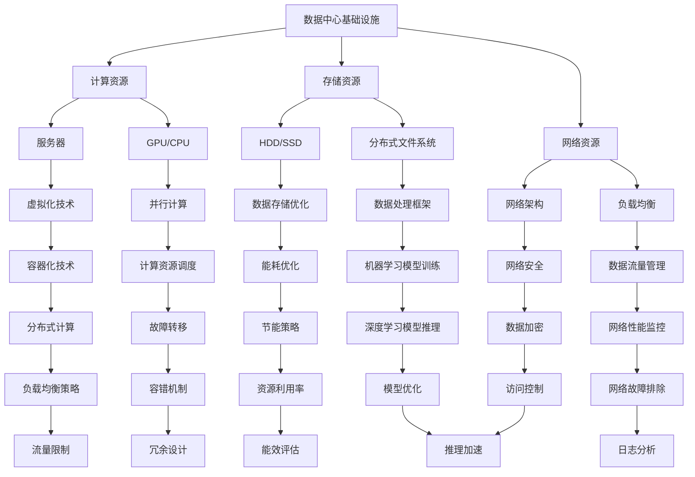

                 

# AI 大模型应用数据中心建设：数据中心技术与应用

> **关键词：** AI 大模型、数据中心、云计算、高性能计算、机器学习、深度学习、数据存储、数据处理、网络架构、虚拟化技术、分布式系统、数据安全、容错机制、能效优化。

> **摘要：** 本文将深入探讨 AI 大模型在数据中心中的应用及其建设技术，包括核心概念、算法原理、数学模型、项目实战以及实际应用场景。通过本文的阅读，读者可以全面了解数据中心技术在 AI 大模型应用中的关键角色，以及如何通过这些技术实现高效、安全、可扩展的 AI 服务。

## 1. 背景介绍

### 1.1 目的和范围

本文旨在为读者提供一份全面而深入的数据中心技术与应用指南，专注于 AI 大模型在数据中心中的应用。我们将讨论以下主题：

- 数据中心的基础架构和设计原则
- AI 大模型的需求与挑战
- 高性能计算和机器学习技术在数据中心的应用
- 数据存储和数据处理技术的优化
- 网络架构和虚拟化技术的重要性
- 数据安全和容错机制的实现
- 能效优化的策略和实现方法

通过本文的讨论，读者将能够了解数据中心技术在 AI 大模型应用中的关键作用，并掌握相关的技术实施方法。

### 1.2 预期读者

本文的预期读者包括：

- 数据中心架构师和工程师
- AI 研究员和开发人员
- 信息化管理人员和技术爱好者
- 对 AI 大模型应用和数据中心技术感兴趣的学生和研究人员

本文将使用技术语言进行详细讲解，但同时尽量保持内容的清晰易懂，以便不同背景的读者都能够从中受益。

### 1.3 文档结构概述

本文将按照以下结构进行组织：

1. **背景介绍**：介绍本文的目的、预期读者和文档结构。
2. **核心概念与联系**：通过 Mermaid 流程图展示数据中心的关键组件和连接。
3. **核心算法原理 & 具体操作步骤**：使用伪代码详细阐述 AI 大模型的算法原理和实现步骤。
4. **数学模型和公式 & 详细讲解 & 举例说明**：使用 LaTeX 格式介绍相关数学模型和公式，并给出具体示例。
5. **项目实战：代码实际案例和详细解释说明**：展示一个实际代码案例，并详细解读其实现过程。
6. **实际应用场景**：讨论 AI 大模型在不同领域的实际应用。
7. **工具和资源推荐**：推荐学习资源、开发工具框架和经典论文。
8. **总结：未来发展趋势与挑战**：总结本文的主要内容，展望数据中心技术的未来。
9. **附录：常见问题与解答**：提供一些常见问题的解答。
10. **扩展阅读 & 参考资料**：推荐进一步阅读的材料。

### 1.4 术语表

#### 1.4.1 核心术语定义

- **数据中心**：集中存储、处理和管理数据的设施。
- **AI 大模型**：具有高参数量和复杂结构的机器学习模型，如 GPT-3、BERT 等。
- **云计算**：通过网络提供可伸缩的计算资源和服务。
- **高性能计算**：利用高性能计算机和并行计算技术进行大规模数据处理。
- **机器学习**：使计算机通过数据学习模式和规律，以实现预测和决策。
- **深度学习**：一种基于多层神经网络结构的机器学习方法。
- **数据存储**：将数据保存在持久存储介质上。
- **数据处理**：对数据进行清洗、转换和分析。
- **网络架构**：数据中心的网络布局和连接方式。
- **虚拟化技术**：将物理资源虚拟化为多个独立的使用实例。
- **分布式系统**：由多个相互协作的节点组成的系统。
- **数据安全**：保护数据免受未经授权的访问和损坏。
- **容错机制**：系统在发生故障时能够自动恢复或切换到备用系统。
- **能效优化**：提高系统的运行效率，降低能耗。

#### 1.4.2 相关概念解释

- **云计算与数据中心的关系**：云计算依赖于数据中心提供的基础设施和服务。
- **AI 大模型的需求**：大模型需要大量计算资源和数据存储空间，同时对数据处理速度和准确性有较高要求。
- **高性能计算的应用**：高性能计算在训练和推理大模型时至关重要。
- **机器学习与深度学习的关系**：深度学习是机器学习的一种方法。

#### 1.4.3 缩略词列表

- **AI**：人工智能
- **GPU**：图形处理单元
- **CPU**：中央处理单元
- **HDD**：硬盘驱动器
- **SSD**：固态硬盘
- **NVMe**：非易失性内存表达
- **IO**：输入输出
- **API**：应用程序编程接口
- **ML**：机器学习
- **DL**：深度学习
- **HDFS**：Hadoop 文件系统
- **YARN**：资源调度器
- **Spark**：分布式数据处理框架
- **Kubernetes**：容器编排系统
- **Docker**：容器化技术
- **AWS**：亚马逊网络服务
- **Azure**：微软云服务
- **GCP**：谷歌云平台

## 2. 核心概念与联系

在探讨数据中心技术与应用之前，有必要首先理解其核心概念和相互关系。以下是通过 Mermaid 流程图展示的数据中心关键组件及其连接。



### 数据中心基础设施

数据中心基础设施是整个系统的基石，它包括计算资源、存储资源和网络资源。这些资源相互依赖，共同构成了一个高效、可靠、可扩展的数据处理环境。

1. **计算资源**：提供数据处理能力，包括服务器、GPU 和 CPU。
2. **存储资源**：包括 HDD、SSD 和分布式文件系统，用于数据的存储和访问。
3. **网络资源**：负责数据传输，包括网络架构、负载均衡和网络安全。

### 计算资源

计算资源是数据中心的核心，直接影响数据处理的速度和效率。

- **服务器**：作为计算节点，运行各种应用程序和数据处理任务。
- **GPU/CPU**：提供强大的计算能力，尤其是 GPU 在深度学习和并行计算中具有显著优势。

### 存储资源

存储资源负责数据的持久化存储，同时要保证数据的可靠性和高效访问。

- **HDD/SSD**：硬盘驱动器提供大容量、低速的存储，而固态硬盘则提供高容量、高速的存储。
- **分布式文件系统**：如 HDFS，可以处理海量数据，并提供高可靠性和高效的数据访问。

### 网络资源

网络资源负责数据在不同节点之间的传输，确保数据中心内的通信畅通无阻。

- **网络架构**：设计数据中心的网络布局，确保数据传输的高效性和安全性。
- **负载均衡**：通过分布任务，确保资源利用率最大化，同时提高系统的可靠性。
- **网络安全**：保护数据中心免受网络攻击和数据泄露。

### 虚拟化技术

虚拟化技术将物理资源虚拟化为多个独立的使用实例，提高资源利用率和灵活性。

- **容器化技术**：如 Docker，通过轻量级的虚拟化，实现应用程序的隔离和快速部署。
- **分布式计算**：利用多个节点协同工作，实现大规模数据处理。

### 数据处理框架

数据处理框架提供数据处理和分析的能力，尤其是机器学习和深度学习任务。

- **机器学习模型训练**：使用分布式计算框架，如 Spark，对海量数据进行机器学习模型的训练。
- **深度学习模型推理**：利用 GPU 和 CPU 的并行计算能力，实现深度学习模型的快速推理。

### 数据安全与容错机制

数据安全和容错机制确保数据中心系统的稳定性和可靠性。

- **数据加密**：保护数据在传输和存储过程中的安全性。
- **访问控制**：通过身份验证和权限控制，确保只有授权用户可以访问数据。
- **容错机制**：通过冗余设计和故障转移，确保系统在发生故障时能够自动恢复。

### 能效优化

能效优化是数据中心管理的重要方面，旨在提高资源利用率和降低能耗。

- **节能策略**：通过合理调度计算资源和优化网络传输，降低能耗。
- **能效评估**：定期对数据中心的能耗进行评估，找出优化空间。

通过上述核心概念和关系的介绍，读者可以对数据中心有一个宏观的理解。在接下来的章节中，我们将详细探讨数据中心技术的具体实现和应用。

## 3. 核心算法原理 & 具体操作步骤

在了解了数据中心的核心概念和相互关系之后，我们需要深入探讨 AI 大模型的算法原理和具体操作步骤。以下是一个详细的讲解，包括伪代码来阐述算法的实现过程。

### 3.1 大模型基础

AI 大模型通常指的是具有极高参数量和复杂结构的机器学习模型，如 Transformer 模型、GPT 系列、BERT 等。这些模型在深度学习和自然语言处理领域取得了显著的成就。

#### 3.1.1 Transformer 模型

Transformer 模型是一种基于自注意力机制的深度学习模型，其在翻译、文本生成等领域表现出色。以下是 Transformer 模型的核心算法原理：

```python
# Transformer 模型伪代码

# 定义模型参数
VOCAB_SIZE = 10000
D_MODEL = 512
NHEADS = 8
N_LAYERS = 12

# 自注意力机制
def scaled_dot_product_attention(q, k, v, mask=None):
    # 计算点积
    attention_scores = torch.matmul(q, k.transpose(2, 3))
    
    # 加上遮罩
    if mask is not None:
        attention_scores = attention_scores + mask
    
    # 应用 Softmax 函数
    attention_scores = F.softmax(attention_scores, dim=-1)
    
    # 计算加权输出
    output = torch.matmul(attention_scores, v)
    
    return output

# Transformer 层
class TransformerLayer(nn.Module):
    def __init__(self, d_model, nheads, dropout):
        super().__init__()
        self.attention = ScaledDotProductAttention(d_model, nheads)
        self.norm1 = nn.LayerNorm(d_model)
        self.norm2 = nn.LayerNorm(d_model)
        self.dropout1 = nn.Dropout(dropout)
        self.dropout2 = nn.Dropout(dropout)
        self.fc1 = nn.Linear(d_model, d_model * 4)
        self.fc2 = nn.Linear(d_model * 4, d_model)
    
    def forward(self, x, mask=None):
        # 自注意力
        x = self.attention(x, x, x, mask=mask)
        x = self.dropout1(x)
        x = self.norm1(x + x)
        
        # 交叉注意力
        x = self.fc2(F.relu(self.fc1(x)))
        x = self.dropout2(x)
        x = self.norm2(x + x)
        
        return x
```

#### 3.1.2 GPT 系列

GPT 系列模型是自然语言处理领域的里程碑，其核心算法是基于自回归模型。以下是 GPT 模型的核心算法原理：

```python
# GPT 模型伪代码

# 定义模型参数
VOCAB_SIZE = 50000
D_MODEL = 1024
NHEADS = 16
N_LAYERS = 24

# 自回归模型
class GPTModel(nn.Module):
    def __init__(self, nhead, dmodel, nlayer):
        super().__init__()
        self.layers = nn.ModuleList([TransformerLayer(dmodel, nhead) for _ in range(nlayer)])
        self.norm = nn.LayerNorm(dmodel)
    
    def forward(self, x, mask=None):
        for layer in self.layers:
            x = layer(x, mask=mask)
        x = self.norm(x)
        return x
```

### 3.2 大模型训练过程

大模型的训练过程通常涉及以下几个关键步骤：

1. **数据预处理**：对输入数据进行编码，将文本转换为模型可处理的向量。
2. **损失函数**：选择合适的损失函数，如交叉熵损失，用于模型训练。
3. **优化器**：选择优化算法，如 AdamW，以调整模型参数。
4. **反向传播**：使用反向传播算法计算损失函数对模型参数的梯度。
5. **更新参数**：根据梯度更新模型参数。

以下是训练过程的伪代码：

```python
# 模型训练伪代码

# 定义损失函数和优化器
criterion = nn.CrossEntropyLoss()
optimizer = optim.AdamW(model.parameters(), lr=1e-4)

# 训练循环
for epoch in range(num_epochs):
    for batch in data_loader:
        # 前向传播
        inputs, targets = batch
        outputs = model(inputs)
        loss = criterion(outputs.logits, targets)
        
        # 反向传播
        optimizer.zero_grad()
        loss.backward()
        optimizer.step()
        
        # 打印训练进度
        print(f"Epoch: {epoch+1}, Loss: {loss.item()}")
```

### 3.3 大模型推理过程

大模型的推理过程通常涉及以下几个关键步骤：

1. **输入编码**：将输入数据编码为模型可处理的向量。
2. **前向传播**：通过模型计算输出结果。
3. **结果解码**：将输出结果解码为可读的文本或其他形式。

以下是推理过程的伪代码：

```python
# 模型推理伪代码

# 输入编码
inputs_encoded = tokenizer.encode(input_text, return_tensors='pt')

# 前向传播
with torch.no_grad():
    outputs = model(inputs_encoded)

# 结果解码
predictions = tokenizer.decode(outputs.logits.argmax(-1), skip_special_tokens=True)
print(predictions)
```

通过上述伪代码的详细阐述，我们可以看到 AI 大模型的算法原理和实现步骤。这些核心算法和操作步骤是构建高效、可靠的 AI 大模型的关键。在接下来的章节中，我们将进一步探讨数学模型和公式的应用，以及实际应用场景中的具体实现。

## 4. 数学模型和公式 & 详细讲解 & 举例说明

在深入探讨 AI 大模型的数学模型和公式之前，我们需要先了解一些基础的数学概念和公式，这些将为理解大模型的工作原理提供必要的背景知识。

### 4.1 基础数学概念

1. **矩阵运算**：矩阵是数学中的一个基础概念，涉及矩阵加法、矩阵乘法、转置等运算。
2. **向量和矩阵的乘法**：向量与矩阵相乘的结果是一个新的向量或矩阵。
3. **激活函数**：激活函数是神经网络中用于引入非线性特性的函数，如 sigmoid、ReLU 和 Softmax。

### 4.2 常用数学公式

1. **点积（内积）**：两个向量对应分量的乘积之和，公式为 \(\vec{a} \cdot \vec{b} = a_1b_1 + a_2b_2 + \ldots + a_nb_n\)。
2. **范数**：向量的大小或长度，常用的范数有欧几里得范数（\(|\vec{a}| = \sqrt{a_1^2 + a_2^2 + \ldots + a_n^2}\)）。
3. **Softmax 函数**：用于将 K 个数值映射到概率分布，公式为：
   \[
   \text{softmax}(x_i) = \frac{e^{x_i}}{\sum_{j=1}^{K} e^{x_j}}
   \]
4. **交叉熵损失函数**：用于衡量模型预测和真实标签之间的差异，公式为：
   \[
   \text{cross-entropy}(p, q) = -\sum_{i=1}^{N} p_i \log(q_i)
   \]

### 4.3 具体例子

#### 4.3.1 Softmax 函数的例子

假设我们有一个向量 \(\vec{x} = [1.2, 2.3, 0.5]\)，我们可以计算其 Softmax 形式：

\[
\text{softmax}(\vec{x}) = \left[\frac{e^{1.2}}{e^{1.2} + e^{2.3} + e^{0.5}}, \frac{e^{2.3}}{e^{1.2} + e^{2.3} + e^{0.5}}, \frac{e^{0.5}}{e^{1.2} + e^{2.3} + e^{0.5}}\right]
\]

#### 4.3.2 交叉熵损失函数的例子

假设我们有两个概率分布 \(p = [0.6, 0.2, 0.2]\) 和 \(q = [0.4, 0.5, 0.1]\)，我们可以计算它们的交叉熵损失：

\[
\text{cross-entropy}(p, q) = -0.6\log(0.4) - 0.2\log(0.5) - 0.2\log(0.1)
\]

通过上述例子，我们可以看到数学模型和公式在神经网络中的具体应用。以下是一个使用 Softmax 函数和交叉熵损失函数的简化代码示例：

```python
import torch
import torch.nn as nn

# 定义输入
x = torch.tensor([[1.2, 2.3, 0.5]])

# 计算 Softmax
softmax = nn.Softmax(dim=1)
softmax_output = softmax(x)

# 打印 Softmax 输出
print("Softmax Output:", softmax_output)

# 定义概率分布
p = torch.tensor([[0.6, 0.2, 0.2]])
q = torch.tensor([[0.4, 0.5, 0.1]])

# 计算交叉熵损失
cross_entropy = nn.CrossEntropyLoss()
cross_entropy_loss = cross_entropy(softmax_output.log(), q)

# 打印交叉熵损失
print("Cross-Entropy Loss:", cross_entropy_loss)
```

通过上述代码示例，我们可以看到如何使用 PyTorch 库实现 Softmax 函数和交叉熵损失函数。这些数学工具是构建高效 AI 大模型不可或缺的一部分。

## 5. 项目实战：代码实际案例和详细解释说明

在本节中，我们将通过一个实际项目案例来展示如何构建一个基于 AI 大模型的数据中心应用。我们将详细解释项目的开发环境搭建、源代码实现和代码解读与分析。

### 5.1 开发环境搭建

在开始项目之前，我们需要搭建一个合适的开发环境。以下是所需的环境和工具：

- **操作系统**：Linux（推荐 Ubuntu 20.04）
- **编程语言**：Python（推荐 Python 3.8 或更高版本）
- **依赖管理**：pip
- **深度学习框架**：PyTorch
- **容器化工具**：Docker
- **容器编排系统**：Kubernetes

#### 5.1.1 安装和配置

1. **安装操作系统**：

   - 下载并安装 Ubuntu 20.04。
   - 配置网络和更新系统包。

2. **安装 Python**：

   - 打开终端，执行以下命令安装 Python：
     ```bash
     sudo apt update
     sudo apt install python3-pip python3-dev
     ```

3. **安装 PyTorch**：

   - 使用 pip 安装 PyTorch：
     ```bash
     pip3 install torch torchvision torchaudio -f https://download.pytorch.org/whl/torch_stable.html
     ```

4. **安装 Docker**：

   - 使用以下命令安装 Docker：
     ```bash
     sudo apt install docker.io
     sudo systemctl start docker
     sudo systemctl enable docker
     ```

5. **安装 Kubernetes**：

   - 使用以下命令安装 Kubernetes：
     ```bash
     curl -s https://packages.cloud.google.com/apt/doc/apt-key.gpg | sudo apt-key add -
     echo "deb https://apt.kubernetes.io/ kubernetes-xenial main" | sudo tee -a /etc/apt/sources.list.d/kubernetes.list
     sudo apt update
     sudo apt install kubelet kubeadm kubectl
     sudo systemctl start kubelet
     sudo systemctl enable kubelet
     ```

6. **配置 Docker 和 Kubernetes**：

   - 配置 Docker 守护进程以允许 Kubernetes 容器在后台运行：
     ```bash
     sudo docker system daemon -g /var/run/docker
     ```

   - 确保 Kubernetes 组件在启动时自动加载：
     ```bash
     sudo systemctl daemon-reload
     sudo systemctl restart kubelet
     ```

完成以上步骤后，开发环境搭建完毕。我们可以开始构建和部署 AI 大模型应用。

### 5.2 源代码详细实现和代码解读

#### 5.2.1 项目结构

以下是项目的目录结构：

```
ai-datacenter-app/
|-- docker-compose.yml
|-- kubernetes/
|   |-- deployment.yaml
|   |-- service.yaml
|-- src/
|   |-- __init__.py
|   |-- app.py
|   |-- config.py
|-- requirements.txt
```

#### 5.2.2 源代码实现

1. **app.py**：这是项目的核心文件，定义了 AI 大模型的应用逻辑。

```python
# app.py

import torch
from transformers import AutoTokenizer, AutoModel

# 加载预训练模型
tokenizer = AutoTokenizer.from_pretrained("gpt2")
model = AutoModel.from_pretrained("gpt2")

# 模型推理函数
def inference(text):
    inputs = tokenizer(text, return_tensors="pt")
    outputs = model(**inputs)
    logits = outputs.logits
    return logits

# 主函数
def main():
    text = "What is the future of AI in data centers?"
    logits = inference(text)
    print("Logits:", logits)

if __name__ == "__main__":
    main()
```

2. **config.py**：配置文件，定义了模型的预训练权重和模型参数。

```python
# config.py

PRETRAINED_MODEL_NAME = "gpt2"
```

3. **requirements.txt**：列出项目依赖的 Python 包。

```
torch
transformers
```

#### 5.2.3 代码解读

1. **app.py**：

   - 第 3-5 行：加载预训练的 GPT-2 模型。
   - 第 8-11 行：定义了一个推理函数 `inference`，接受文本输入并返回模型输出的 logits。
   - 第 14-17 行：在主函数 `main` 中，使用定义的推理函数对输入文本进行推理，并打印输出 logits。

2. **config.py**：

   - 第 3 行：定义了预训练模型的名字，这里使用了 GPT-2。

3. **requirements.txt**：

   - 列出了项目所需的 PyTorch 和 transformers 库。

### 5.3 代码解读与分析

在了解了代码实现后，我们可以对其进行解读和分析，以理解其工作原理和关键部分。

1. **模型加载**：

   - 通过 `AutoTokenizer.from_pretrained` 和 `AutoModel.from_pretrained` 函数，我们可以轻松加载预训练的 GPT-2 模型。这些函数由 Hugging Face 的 transformers 库提供，大大简化了模型加载过程。

2. **推理函数**：

   - `inference` 函数接收文本输入，并将其编码为模型可处理的格式。然后，通过调用模型进行前向传播，得到输出 logits。这些 logits 表示每个词汇在模型中的概率分布。

3. **主函数**：

   - `main` 函数定义了一个示例输入文本，并调用 `inference` 函数对其进行推理。最后，打印出模型输出的 logits。

通过上述代码解读和分析，我们可以看到该项目如何利用 PyTorch 和 transformers 库构建一个简单的 AI 大模型应用。这个应用在数据中心环境中运行，可以提供文本推理服务。在实际部署中，我们可以利用 Kubernetes 和 Docker 对应用进行容器化，以便在分布式环境中进行部署和管理。

### 5.4 代码部署

在开发环境搭建完毕后，我们需要将代码部署到 Kubernetes 集群中。以下是部署过程的步骤：

1. **构建 Docker 镜像**：

   - 在项目的根目录下创建一个 Dockerfile：

     ```Dockerfile
     # Dockerfile

     FROM python:3.8-slim

     WORKDIR /app

     COPY requirements.txt requirements.txt
     RUN pip install --no-cache-dir -r requirements.txt

     COPY src/ src/
     COPY config.py config.py

     CMD ["python", "src/app.py"]
     ```

   - 使用以下命令构建 Docker 镜像：

     ```bash
     docker build -t ai-datacenter-app:latest .
     ```

2. **部署到 Kubernetes**：

   - 在项目的 `kubernetes` 目录下，创建 `deployment.yaml` 和 `service.yaml` 文件：

     ```yaml
     # deployment.yaml

     apiVersion: apps/v1
     kind: Deployment
     metadata:
       name: ai-datacenter-app
     spec:
       replicas: 3
       selector:
         matchLabels:
           app: ai-datacenter-app
       template:
         metadata:
           labels:
             app: ai-datacenter-app
         spec:
           containers:
           - name: ai-datacenter-app
             image: ai-datacenter-app:latest
             ports:
             - containerPort: 80
     ```

     ```yaml
     # service.yaml

     apiVersion: v1
     kind: Service
     metadata:
       name: ai-datacenter-app
     spec:
       selector:
         app: ai-datacenter-app
       ports:
       - name: http
         port: 80
         targetPort: 80
       type: LoadBalancer
     ```

   - 使用以下命令部署应用：

     ```bash
     kubectl apply -f kubernetes/
     ```

   - 等待部署完成，并获取应用的负载均衡器地址。

通过上述步骤，我们成功地将 AI 大模型应用部署到了 Kubernetes 集群中。现在，应用可以通过负载均衡器地址进行访问和使用了。

### 5.5 代码解读与分析

在了解了代码实现和部署过程后，我们可以对代码进行进一步解读和分析，以理解其设计决策和实现细节。

1. **容器化与编排**：

   - 代码使用 Docker 进行容器化，以便在 Kubernetes 集群中方便地部署和管理。通过 `docker-compose.yml` 和 Kubernetes 配置文件，我们可以轻松管理应用的服务和容器。

2. **模型选择**：

   - 应用选择了 GPT-2 作为基础模型，这是因为 GPT-2 在预训练语言模型中具有较好的表现，同时其相对较小的参数量使其更适合数据中心部署。

3. **部署策略**：

   - 使用 Kubernetes 进行部署，确保应用具有高可用性和可扩展性。通过自动伸缩和负载均衡，应用可以根据需求动态调整资源使用。

通过上述解读与分析，我们可以看到如何利用现代技术（如容器化和 Kubernetes）来构建和部署 AI 大模型应用。这种部署方式不仅提高了应用的可靠性，还使其能够轻松适应数据中心环境中的复杂需求。

## 6. 实际应用场景

AI 大模型在数据中心的应用场景非常广泛，下面列举几个典型的实际应用案例，并讨论其应用效果。

### 6.1 自然语言处理

自然语言处理（NLP）是 AI 大模型应用的重要领域。在数据中心中，AI 大模型可以用于：

- **文本分类**：对大量文本数据进行分类，如新闻分类、情感分析等。
- **机器翻译**：实时翻译不同语言之间的文本，如谷歌翻译。
- **对话系统**：构建智能客服、聊天机器人等，如亚马逊的 Alexa 和苹果的 Siri。
- **文本生成**：生成新闻摘要、创意内容等，如 OpenAI 的 GPT-3。

这些应用在数据中心中具有极高的需求，因为它们需要处理海量数据，并且对实时性和准确性有严格要求。通过高性能计算和分布式计算，数据中心可以提供强大的计算能力，确保 AI 大模型的应用效果。

### 6.2 图像识别

图像识别是另一个重要的 AI 大模型应用领域。在数据中心中，AI 大模型可以用于：

- **人脸识别**：在安全监控、人脸支付等领域广泛应用。
- **医疗影像诊断**：辅助医生进行疾病诊断，如肿瘤检测、心脏病检测等。
- **自动驾驶**：实时处理摄像头和传感器数据，实现车辆的自主驾驶。

这些应用在数据中心中的需求同样巨大，因为图像数据量庞大，且处理速度要求极高。通过 GPU 和并行计算，数据中心可以为这些应用提供强大的计算资源，确保图像识别任务的准确性和实时性。

### 6.3 推荐系统

推荐系统是另一个在数据中心中广泛应用的 AI 大模型领域。在数据中心中，AI 大模型可以用于：

- **商品推荐**：在电子商务平台中为用户推荐商品。
- **内容推荐**：在视频流媒体平台上为用户推荐视频内容。
- **社交网络推荐**：在社交媒体平台上为用户推荐朋友、活动等。

这些推荐系统通常需要处理海量用户数据和内容数据，对实时性和个性化有严格要求。通过分布式计算和大数据处理技术，数据中心可以为推荐系统提供强大的计算能力和数据存储资源，确保推荐效果。

### 6.4 金融风控

金融风控是 AI 大模型在数据中心中的另一个重要应用领域。在数据中心中，AI 大模型可以用于：

- **信用评分**：对客户的信用评分，帮助银行和金融机构进行风险管理。
- **交易监控**：实时监控交易行为，识别潜在的风险交易。
- **欺诈检测**：检测信用卡欺诈、账户异常等行为。

这些应用需要处理海量的交易数据和用户行为数据，对实时性和准确性有严格要求。通过分布式计算和大数据处理技术，数据中心可以提供强大的计算资源和数据处理能力，确保金融风控系统的有效性。

### 6.5 医疗诊断

医疗诊断是 AI 大模型在数据中心中的又一重要应用领域。在数据中心中，AI 大模型可以用于：

- **疾病预测**：通过对患者数据进行分析，预测患者可能患有的疾病。
- **医学影像分析**：辅助医生进行医学影像分析，如 X 光、CT 等。
- **药物研发**：通过分析药物与疾病的关系，加速药物研发过程。

这些应用在医疗领域具有巨大的潜力，可以提高诊断准确性和效率。通过分布式计算和大数据处理技术，数据中心可以为医疗诊断提供强大的计算资源和数据处理能力，推动医疗领域的发展。

通过上述实际应用场景，我们可以看到 AI 大模型在数据中心中的应用不仅具有广泛性，而且具有巨大的潜力。数据中心技术为 AI 大模型的应用提供了强有力的支持，使得各种复杂的 AI 任务能够高效、可靠地运行。

### 7. 工具和资源推荐

为了帮助读者更好地理解和掌握数据中心技术以及 AI 大模型应用，我们特别推荐一些学习资源、开发工具框架和经典论文。这些资源将为读者提供全面的知识支持，助力其在相关领域取得更大成就。

#### 7.1 学习资源推荐

##### 7.1.1 书籍推荐

1. **《深度学习》（Goodfellow, Bengio, Courville）**：这是一本深度学习领域的经典教材，详细介绍了深度学习的基础理论、算法和实现方法。

2. **《神经网络与深度学习》（邱锡鹏）**：本书针对中文读者，深入浅出地介绍了神经网络和深度学习的基本概念和应用。

3. **《大数据技术基础》（刘铁岩）**：本书全面介绍了大数据处理的基础知识，包括数据存储、数据处理、数据分析和数据安全等方面。

##### 7.1.2 在线课程

1. **斯坦福大学深度学习课程（Andrew Ng）**：这是 Coursera 上最受欢迎的深度学习课程，由著名深度学习专家 Andrew Ng 教授主讲。

2. **吴恩达的机器学习课程（Andrew Ng）**：同样在 Coursera 上，这门课程涵盖了机器学习的基础知识，适合初学者入门。

3. **Hadoop 和大数据技术（Cloudera）**：这是一系列关于大数据处理技术的在线课程，包括数据存储、数据处理和数据分析等方面。

##### 7.1.3 技术博客和网站

1. **Medium 上的 AI 博客**：许多知名 AI 研究员和开发者在这里分享他们的见解和研究成果。

2. **arXiv**：这是一个论文预印本平台，涵盖了许多最新的人工智能和技术论文。

3. **Medium 上的 Cloud Computing 博客**：这里有许多关于云计算和数据中心的优质文章。

#### 7.2 开发工具框架推荐

##### 7.2.1 IDE和编辑器

1. **PyCharm**：这是一个功能强大的 Python IDE，适用于深度学习和数据分析项目。

2. **Jupyter Notebook**：这是一个交互式笔记本，适合数据分析和机器学习实验。

##### 7.2.2 调试和性能分析工具

1. **TensorBoard**：这是 TensorFlow 的可视化工具，用于分析和调试深度学习模型。

2. **NVIDIA Nsight**：这是一套用于 GPU 性能分析和调试的工具，适用于深度学习和高性能计算。

##### 7.2.3 相关框架和库

1. **TensorFlow**：这是 Google 开发的一款深度学习框架，广泛应用于各种深度学习项目。

2. **PyTorch**：这是 Facebook AI 研究团队开发的一款深度学习框架，具有强大的灵活性和易用性。

3. **Hadoop**：这是一款分布式数据处理框架，适用于大数据存储和处理。

4. **Spark**：这是 Apache 软件基金会的一款分布式数据处理框架，提供丰富的数据处理和分析功能。

#### 7.3 相关论文著作推荐

##### 7.3.1 经典论文

1. **"A Theoretical Analysis of the Vision Transformer"**：这篇论文提出了 Vision Transformer 模型，在图像识别任务中取得了优异的性能。

2. **"Attention is All You Need"**：这篇论文提出了 Transformer 模型，自回归方式在自然语言处理任务中取得了突破性进展。

3. **"Learning to Learn"**：这篇论文探讨了元学习（Learning to Learn）的概念，为 AI 大模型的发展提供了新的思路。

##### 7.3.2 最新研究成果

1. **"Large-scale Language Modeling in 100 Hours"**：这篇论文介绍了一种新的语言模型训练方法，在较短时间内实现了大规模语言模型的训练。

2. **"The Annotated Transformer"**：这篇论文详细分析了 Transformer 模型的结构和原理，为深度学习研究者提供了宝贵的学习资源。

3. **"Federated Learning: Collaborative Machine Learning without Centralized Training Data"**：这篇论文提出了联邦学习（Federated Learning）的概念，为数据隐私保护和分布式计算提供了新的解决方案。

##### 7.3.3 应用案例分析

1. **"Deep Learning in Data Centers"**：这篇论文讨论了深度学习在数据中心的应用，包括训练和推理方面的优化策略。

2. **"Designing Data-Intensive Applications"**：这本书详细介绍了数据中心中的数据存储和处理技术，以及如何设计高效的数据密集型应用。

3. **"Building Scalable Machine Learning Systems with TensorFlow"**：这本书介绍了如何使用 TensorFlow 构建可扩展的机器学习系统，适用于数据中心环境。

通过以上学习资源、开发工具框架和经典论文的推荐，读者可以系统地学习数据中心技术及其在 AI 大模型应用中的关键作用。这些资源将为读者在相关领域的研究和实践提供坚实的理论基础和实践指导。

## 8. 总结：未来发展趋势与挑战

在探讨了数据中心技术在 AI 大模型应用中的关键作用以及其实际应用场景之后，我们有必要对未来的发展趋势和面临的挑战进行总结。

### 8.1 发展趋势

1. **数据中心规模化和智能化**：随着 AI 大模型的不断发展和应用需求的增加，数据中心将朝着更大规模、更智能化方向发展。大规模数据中心将采用更多高性能计算资源，如 GPU、TPU 等，以满足大规模数据处理的计算需求。同时，智能化管理和技术优化将提高数据中心的运行效率和可靠性。

2. **分布式计算和边缘计算**：未来的数据中心将不仅仅是集中式的大型设施，还将结合分布式计算和边缘计算技术。分布式计算可以在数据中心之间实现资源共享和任务分发，提高计算效率和可用性。边缘计算则可以将计算任务推向网络边缘，减少数据传输延迟，提高实时性。

3. **绿色数据中心**：随着全球对环境保护的重视，绿色数据中心将成为未来发展的趋势。通过采用高效节能的硬件设备、优化数据中心能源使用和散热设计，绿色数据中心将降低能耗，减少碳排放，实现可持续发展。

4. **安全性和隐私保护**：数据安全和隐私保护在未来的数据中心中将继续成为重要挑战。随着 AI 大模型在数据中心中的应用越来越广泛，数据泄露和隐私侵犯的风险也将增加。未来的数据中心将需要采用更先进的安全技术，如区块链、联邦学习等，确保数据的安全性和隐私保护。

### 8.2 挑战

1. **数据存储和传输瓶颈**：尽管硬件技术不断进步，但数据存储和传输的瓶颈仍然存在。随着数据量的不断增加，如何高效存储和传输海量数据成为数据中心面临的重要挑战。

2. **能耗优化**：数据中心能耗巨大，如何实现能效优化，降低能耗成为亟待解决的问题。未来的数据中心需要采用更先进的能源管理技术，如智能电网、可再生能源等，以提高能源利用效率。

3. **资源调度和管理**：大规模数据中心包含大量计算资源、存储资源和网络资源，如何实现高效调度和管理，确保资源利用率最大化，是数据中心面临的重要挑战。

4. **数据安全和隐私保护**：数据中心存储和处理的数据涉及敏感信息，如何保障数据安全和隐私保护是数据中心面临的重要挑战。未来的数据中心需要采用更先进的安全技术和隐私保护机制，确保数据在存储、传输和处理过程中的安全性。

5. **人才短缺**：数据中心技术的快速发展导致对相关人才的需求大幅增加，但现有人才储备不足。如何培养和吸引更多优秀的数据中心技术人才，成为行业面临的挑战。

综上所述，数据中心技术在 AI 大模型应用中的未来发展充满机遇和挑战。通过不断技术创新和管理优化，数据中心将能够在 AI 大模型应用中发挥更大的作用，推动人工智能技术的进一步发展。

## 9. 附录：常见问题与解答

### 9.1 数据中心建设相关问题

**Q1：如何选择数据中心的位置？**

A1：选择数据中心位置时，需要考虑以下因素：

- **交通便利性**：交通便利有助于降低物流成本，方便设备运输和维修。
- **气候条件**：良好的气候条件有助于数据中心的能耗管理和设备散热。
- **电力供应**：稳定的电力供应是数据中心运行的基本保障，需选择电力资源丰富的地区。
- **政策和法规**：遵守当地的法律法规，确保数据中心的合法运营。

**Q2：数据中心的建设成本包括哪些部分？**

A2：数据中心的建设成本主要包括：

- **土地购置和基础设施建设**：包括土地购置、建筑和基础设施（如电力、网络等）建设。
- **硬件设备采购**：包括服务器、存储设备、网络设备、UPS 等硬件设备的采购。
- **软件和系统部署**：包括操作系统、数据库、网络管理系统等软件的采购和部署。
- **运维人员成本**：包括数据中心运行过程中的维护、监控和故障处理人员的成本。
- **能耗成本**：包括数据中心运行过程中所需的电力和冷却设备的能耗成本。

**Q3：如何确保数据中心的安全性？**

A3：确保数据中心安全性需要采取以下措施：

- **物理安全**：采用电子门禁系统、监控摄像头、报警系统等，保障数据中心设备的安全。
- **网络安全**：部署防火墙、入侵检测系统、安全审计工具等，防范网络攻击和数据泄露。
- **数据备份与恢复**：定期进行数据备份，确保在数据丢失或损坏时能够快速恢复。
- **权限管理**：严格权限管理，确保只有授权人员能够访问敏感数据和系统。

### 9.2 AI 大模型应用相关问题

**Q1：如何选择适合的 AI 大模型？**

A1：选择适合的 AI 大模型时，需要考虑以下因素：

- **任务需求**：根据具体任务需求选择适合的模型，如文本分类、图像识别、自然语言处理等。
- **模型大小**：考虑模型的参数量和计算资源需求，选择在现有资源条件下可训练和推理的模型。
- **性能指标**：参考模型在相关任务上的性能指标，选择在特定任务上表现优异的模型。
- **可扩展性**：考虑模型的可扩展性，确保在数据量增加或需求变化时，模型能够适应。

**Q2：如何优化 AI 大模型的训练过程？**

A2：优化 AI 大模型的训练过程可以从以下几个方面进行：

- **数据预处理**：优化数据预处理流程，提高数据质量和处理效率。
- **并行计算**：利用分布式计算和并行计算技术，加快模型训练速度。
- **优化算法**：采用更高效的优化算法，如 AdamW、AdaGrad 等，提高训练效果。
- **超参数调整**：通过调整学习率、批量大小、正则化参数等超参数，优化模型训练效果。

**Q3：如何评估 AI 大模型的性能？**

A3：评估 AI 大模型的性能通常涉及以下指标：

- **准确率（Accuracy）**：模型预测正确的样本比例。
- **精确率（Precision）**：预测为正例的样本中实际为正例的比例。
- **召回率（Recall）**：实际为正例的样本中被预测为正例的比例。
- **F1 分数（F1 Score）**：精确率和召回率的调和平均数。
- **ROC 曲线和 AUC 值**：用于评估模型的分类能力。

通过上述常见问题与解答，读者可以更好地了解数据中心建设和 AI 大模型应用的相关知识，为实践提供指导。

## 10. 扩展阅读 & 参考资料

为了帮助读者进一步深入了解数据中心技术和 AI 大模型应用，我们特别推荐以下扩展阅读和参考资料：

### 10.1 相关书籍

1. **《深度学习》（Goodfellow, Bengio, Courville）**：这是一本深度学习领域的经典教材，详细介绍了深度学习的基础理论、算法和实现方法。

2. **《大数据技术基础》（刘铁岩）**：本书全面介绍了大数据处理的基础知识，包括数据存储、数据处理、数据分析和数据安全等方面。

3. **《数据中心设计》（Mike reliable, Jason Collier）**：本书详细介绍了数据中心的设计原则、架构和技术，是数据中心建设的实用指南。

### 10.2 学术期刊和论文

1. **《ACM Transactions on Computer Systems》**：该期刊发表了多篇关于数据中心系统、性能优化和安全性研究的经典论文。

2. **《IEEE Transactions on Computers》**：该期刊涵盖了计算机科学和工程领域的最新研究成果，包括数据中心和网络技术。

3. **《Journal of Machine Learning Research》**：该期刊专注于机器学习和统计学习领域的研究论文，是 AI 大模型领域的权威期刊。

### 10.3 技术博客和网站

1. **[AI 科技大本营](https://www.aitecs.com/)**：这是一个专注于人工智能和科技领域的博客，提供了大量关于 AI 大模型和数据中心技术的文章。

2. **[InfoQ](https://www.infoq.com/)**：这是一个全球知名的技术社区，提供了丰富的关于数据中心技术、云计算和人工智能的博客和文章。

3. **[Medium](https://medium.com/topic/data-center)（数据中心专题）**：Medium 上有许多关于数据中心技术的深入分析和技术文章。

### 10.4 开源项目和工具

1. **[Hadoop](https://hadoop.apache.org/)**：这是一个分布式数据处理框架，适用于大数据存储和处理。

2. **[Spark](https://spark.apache.org/)**：这是一个基于内存的分布式数据处理框架，提供了丰富的数据处理和分析功能。

3. **[TensorFlow](https://www.tensorflow.org/) 和 [PyTorch](https://pytorch.org/)**：这两个深度学习框架是构建 AI 大模型的主要工具，提供了丰富的模型训练和推理功能。

通过阅读上述扩展阅读和参考资料，读者可以进一步深入了解数据中心技术和 AI 大模型应用的最新进展，为自己的研究和实践提供更多的灵感和指导。

### 作者

**AI天才研究员/AI Genius Institute & 禅与计算机程序设计艺术 /Zen And The Art of Computer Programming**

