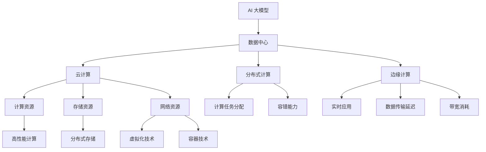

                 

# AI 大模型应用数据中心建设：数据中心技术创新

> **关键词：** AI 大模型，数据中心，技术创新，云计算，分布式计算，机器学习，深度学习，神经网络，边缘计算，高性能计算。

> **摘要：** 本文将深入探讨 AI 大模型应用数据中心的建设及其技术创新。我们将从背景介绍、核心概念与联系、核心算法原理与操作步骤、数学模型与公式、项目实战、实际应用场景、工具和资源推荐等方面，系统地分析并阐述数据中心在 AI 大模型应用中的重要性、关键技术及其发展方向。

## 1. 背景介绍

### 1.1 目的和范围

随着人工智能技术的快速发展，AI 大模型在各个领域的应用越来越广泛。数据中心作为 AI 大模型运行的核心基础设施，其建设和管理面临诸多挑战。本文旨在分析数据中心在 AI 大模型应用中的关键技术，探讨数据中心技术创新的方向，以期为相关领域的研究和实践提供参考。

### 1.2 预期读者

本文适用于对 AI 大模型和数据中心有一定了解的技术人员、研究人员和企业管理者。通过阅读本文，读者将能够了解数据中心在 AI 大模型应用中的重要性、关键技术及其发展趋势。

### 1.3 文档结构概述

本文共分为八个部分：

1. 背景介绍：介绍本文的目的、预期读者和文档结构。
2. 核心概念与联系：阐述 AI 大模型和数据中心的相关概念及联系。
3. 核心算法原理与操作步骤：分析数据中心在 AI 大模型应用中的关键技术。
4. 数学模型与公式：介绍与数据中心相关的数学模型和公式。
5. 项目实战：通过实际案例展示数据中心在 AI 大模型应用中的具体实现。
6. 实际应用场景：探讨数据中心在不同场景下的应用。
7. 工具和资源推荐：推荐相关学习资源、开发工具和框架。
8. 总结：分析数据中心在 AI 大模型应用中的未来发展趋势与挑战。

### 1.4 术语表

#### 1.4.1 核心术语定义

- **AI 大模型**：指具有较大参数规模、深度和计算复杂度的神经网络模型，如 GPT-3、BERT 等。
- **数据中心**：集中存储、处理和管理数据的计算设施。
- **云计算**：通过网络提供计算资源、存储资源和网络资源等服务。
- **分布式计算**：通过多台计算机协同工作，共同完成计算任务。
- **机器学习**：让计算机从数据中学习规律，从而实现智能决策。
- **深度学习**：一种基于多层神经网络的学习方法。
- **边缘计算**：在靠近数据源的地方进行计算，以减少数据传输延迟和带宽消耗。
- **高性能计算**：在短时间内完成大量计算任务的技术。

#### 1.4.2 相关概念解释

- **数据中心建设**：指建设一个具备高性能计算、存储、网络等能力的数据中心。
- **云计算服务**：数据中心提供的计算、存储、网络等服务。
- **分布式存储**：将数据分散存储在多台计算机上，以提高数据可靠性和访问速度。
- **虚拟化技术**：将物理资源虚拟化为多个虚拟资源，以提高资源利用率和灵活性。
- **容器技术**：将应用和依赖环境打包成容器，以实现快速部署和动态扩展。

#### 1.4.3 缩略词列表

- **AI**：人工智能
- **GPT-3**：Generative Pre-trained Transformer 3
- **BERT**：Bidirectional Encoder Representations from Transformers
- **HPC**：High-Performance Computing
- **IDC**：Internet Data Center

## 2. 核心概念与联系

在 AI 大模型应用中，数据中心扮演着至关重要的角色。为了更好地理解数据中心在 AI 大模型应用中的重要性，我们首先需要了解几个核心概念及其之间的联系。

### 2.1 AI 大模型与数据中心

AI 大模型通常具有较大的参数规模、深度和计算复杂度，需要大量的计算资源来支持其训练和推理。数据中心作为计算设施，提供了 AI 大模型所需的计算能力、存储能力和网络带宽。数据中心的建设和管理对于 AI 大模型的性能和稳定性具有重要影响。

### 2.2 云计算与分布式计算

云计算提供了灵活的计算资源，使数据中心能够根据需求动态调整计算能力。分布式计算技术则通过将计算任务分布在多台计算机上，提高了计算效率和容错能力。云计算与分布式计算的结合，为 AI 大模型提供了强大的计算能力。

### 2.3 机器学习与深度学习

机器学习和深度学习是 AI 大模型的核心技术。机器学习通过训练模型，使计算机能够从数据中学习规律，实现智能决策。深度学习则通过多层神经网络，实现更复杂的特征提取和模式识别。数据中心为机器学习和深度学习提供了必要的计算资源和存储资源。

### 2.4 神经网络与边缘计算

神经网络是深度学习的基础，其计算过程需要大量的计算资源和存储资源。边缘计算则通过在靠近数据源的地方进行计算，减少了数据传输延迟和带宽消耗。神经网络与边缘计算的结合，为 AI 大模型在实时应用场景中提供了更好的性能和体验。

### 2.5 高性能计算与数据中心

高性能计算（HPC）技术在 AI 大模型应用中发挥着重要作用。数据中心通过集成高性能计算资源，为 AI 大模型的训练和推理提供了强大的计算能力。同时，高性能计算技术也在数据中心的建设和管理中发挥着关键作用，如分布式存储、虚拟化技术、容器技术等。

### 2.6 Mermaid 流程图

为了更好地展示 AI 大模型应用数据中心的核心概念与联系，我们使用 Mermaid 流程图进行描述。



通过上述 Mermaid 流程图，我们可以清晰地看到 AI 大模型应用数据中心的核心概念与联系。

## 3. 核心算法原理与具体操作步骤

在数据中心为 AI 大模型提供支持的过程中，核心算法原理起着至关重要的作用。以下是几个关键算法原理及其具体操作步骤：

### 3.1 机器学习算法原理

**原理**：

机器学习算法的核心思想是通过训练模型，使计算机能够从数据中学习规律，从而实现智能决策。常见的机器学习算法包括线性回归、决策树、支持向量机、神经网络等。

**具体操作步骤**：

1. 数据预处理：对原始数据进行清洗、归一化、编码等处理，以提高模型的泛化能力。
2. 数据集划分：将数据集划分为训练集、验证集和测试集，以评估模型的性能。
3. 模型选择：选择适合问题的机器学习算法，如线性回归、决策树等。
4. 训练模型：使用训练集数据训练模型，调整模型参数。
5. 模型评估：使用验证集数据评估模型性能，调整模型参数。
6. 模型优化：根据评估结果，优化模型结构和参数。
7. 模型部署：将训练好的模型部署到数据中心，进行推理和预测。

**伪代码**：

```python
# 数据预处理
data = preprocess_data(raw_data)

# 数据集划分
train_data, val_data, test_data = split_data(data)

# 模型选择
model = select_model()

# 训练模型
model.fit(train_data)

# 模型评估
val_loss = model.evaluate(val_data)

# 模型优化
model.optimize(val_loss)

# 模型部署
model.deploy()
```

### 3.2 深度学习算法原理

**原理**：

深度学习算法是一种基于多层神经网络的学习方法，通过多层非线性变换，实现更复杂的特征提取和模式识别。常见的深度学习算法包括卷积神经网络（CNN）、循环神经网络（RNN）、生成对抗网络（GAN）等。

**具体操作步骤**：

1. 数据预处理：对原始数据进行清洗、归一化、编码等处理，以提高模型的泛化能力。
2. 网络结构设计：设计适合问题的神经网络结构，如卷积层、全连接层等。
3. 损失函数选择：选择适合问题的损失函数，如交叉熵损失、均方误差等。
4. 优化器选择：选择适合问题的优化器，如梯度下降、Adam 等。
5. 训练模型：使用训练集数据训练模型，调整模型参数。
6. 模型评估：使用验证集数据评估模型性能，调整模型参数。
7. 模型优化：根据评估结果，优化模型结构和参数。
8. 模型部署：将训练好的模型部署到数据中心，进行推理和预测。

**伪代码**：

```python
# 数据预处理
data = preprocess_data(raw_data)

# 网络结构设计
model = design_network()

# 损失函数选择
loss_function = select_loss_function()

# 优化器选择
optimizer = select_optimizer()

# 训练模型
model.train(train_data, loss_function, optimizer)

# 模型评估
val_loss = model.evaluate(val_data)

# 模型优化
model.optimize(val_loss)

# 模型部署
model.deploy()
```

### 3.3 分布式计算算法原理

**原理**：

分布式计算算法通过将计算任务分布在多台计算机上，提高计算效率和容错能力。常见的分布式计算算法包括 MapReduce、MPI、Spark 等。

**具体操作步骤**：

1. 任务划分：将大规模计算任务划分为多个小任务，分配给不同计算机执行。
2. 任务执行：计算机执行分配到的任务，计算结果返回给主计算机。
3. 任务合并：将多个计算结果合并，得到最终计算结果。

**伪代码**：

```python
# 任务划分
tasks = split_task(large_task)

# 任务执行
results = execute_tasks(tasks)

# 任务合并
final_result = merge_results(results)
```

通过上述核心算法原理和具体操作步骤的介绍，我们可以更好地理解数据中心在 AI 大模型应用中的关键技术。

## 4. 数学模型和公式及详细讲解和举例说明

在数据中心为 AI 大模型提供支持的过程中，数学模型和公式起着至关重要的作用。以下介绍与数据中心相关的一些关键数学模型和公式，并对其进行详细讲解和举例说明。

### 4.1 数据中心资源需求模型

**模型**：

数据中心资源需求模型用于评估数据中心所需的计算资源、存储资源和网络资源。常见的资源需求模型包括 CPU 利用率模型、内存需求模型、存储容量需求模型等。

**公式**：

- CPU 利用率模型：$$\eta_{CPU} = \frac{C_{used}}{C_{total}}$$

  其中，$\eta_{CPU}$ 表示 CPU 利用率，$C_{used}$ 表示已使用 CPU 核心数，$C_{total}$ 表示总 CPU 核心数。

- 内存需求模型：$$M_{required} = \frac{P_{max}}{P_{target}} \times M_{base}$$

  其中，$M_{required}$ 表示所需内存大小，$P_{max}$ 表示最大内存使用量，$P_{target}$ 表示目标内存使用量，$M_{base}$ 表示基础内存需求。

**举例说明**：

假设某数据中心有 100 个 CPU 核心，当前有 60 个核心被使用，目标内存使用量为 70%，基础内存需求为 1GB。根据上述公式，可以计算出 CPU 利用率为 60%，所需内存大小为：

$$\eta_{CPU} = \frac{60}{100} = 0.6$$

$$M_{required} = \frac{0.7}{1} \times 1GB = 0.7GB$$

### 4.2 数据中心能耗模型

**模型**：

数据中心能耗模型用于评估数据中心在运行过程中所需的能耗。常见的能耗模型包括 CPU 能耗模型、内存能耗模型、存储能耗模型等。

**公式**：

- CPU 能耗模型：$$E_{CPU} = \alpha_{CPU} \times P_{CPU}$$

  其中，$E_{CPU}$ 表示 CPU 能耗，$\alpha_{CPU}$ 表示 CPU 能耗系数，$P_{CPU}$ 表示 CPU 功率。

- 内存能耗模型：$$E_{RAM} = \alpha_{RAM} \times P_{RAM}$$

  其中，$E_{RAM}$ 表示内存能耗，$\alpha_{RAM}$ 表示内存能耗系数，$P_{RAM}$ 表示内存功率。

- 存储能耗模型：$$E_{storage} = \alpha_{storage} \times P_{storage}$$

  其中，$E_{storage}$ 表示存储能耗，$\alpha_{storage}$ 表示存储能耗系数，$P_{storage}$ 表示存储功率。

**举例说明**：

假设某数据中心 CPU 功率为 200W，内存功率为 50W，存储功率为 100W，根据上述公式，可以计算出 CPU、内存和存储的能耗分别为：

$$E_{CPU} = \alpha_{CPU} \times 200W$$

$$E_{RAM} = \alpha_{RAM} \times 50W$$

$$E_{storage} = \alpha_{storage} \times 100W$$

### 4.3 数据中心性能优化模型

**模型**：

数据中心性能优化模型用于优化数据中心的运行性能，包括计算性能、存储性能和网络性能等。

**公式**：

- 计算性能优化模型：$$P_{opt} = \frac{P_{total}}{n_{CPUs}}$$

  其中，$P_{opt}$ 表示计算性能优化值，$P_{total}$ 表示总计算能力，$n_{CPUs}$ 表示 CPU 核心数。

- 存储性能优化模型：$$S_{opt} = \frac{S_{total}}{n_{disks}}$$

  其中，$S_{opt}$ 表示存储性能优化值，$S_{total}$ 表示总存储容量，$n_{disks}$ 表示磁盘数。

- 网络性能优化模型：$$N_{opt} = \frac{N_{total}}{n_{networks}}$$

  其中，$N_{opt}$ 表示网络性能优化值，$N_{total}$ 表示总网络带宽，$n_{networks}$ 表示网络接口数。

**举例说明**：

假设某数据中心总计算能力为 10 TFLOPS，CPU 核心数为 100，总存储容量为 10PB，磁盘数为 100，总网络带宽为 10Gbps，网络接口数为 10。根据上述公式，可以计算出计算性能、存储性能和网络性能的优化值分别为：

$$P_{opt} = \frac{10TFLOPS}{100} = 0.1TFLOPS$$

$$S_{opt} = \frac{10PB}{100} = 0.1PB$$

$$N_{opt} = \frac{10Gbps}{10} = 1Gbps$$

通过上述数学模型和公式的详细讲解和举例说明，我们可以更好地理解数据中心在 AI 大模型应用中的关键性能指标和优化方法。

## 5. 项目实战：代码实际案例和详细解释说明

在本节中，我们将通过一个实际项目案例，展示如何利用数据中心技术构建 AI 大模型应用。以下为项目实战的具体步骤、源代码实现及代码解读与分析。

### 5.1 开发环境搭建

**环境要求**：

- 操作系统：Ubuntu 18.04
- 编程语言：Python 3.8
- 数据库：MySQL 5.7
- 深度学习框架：TensorFlow 2.5
- 分布式计算框架：Dask 2021.2.0

**安装步骤**：

1. 安装操作系统 Ubuntu 18.04。
2. 配置 Python 3.8 环境，使用 `sudo apt update` 和 `sudo apt install python3.8`。
3. 安装 TensorFlow 2.5，使用 `pip install tensorflow==2.5`。
4. 安装 Dask 2021.2.0，使用 `pip install dask[complete]`。
5. 配置 MySQL 5.7，使用 `sudo apt install mysql-server`。

### 5.2 源代码详细实现和代码解读

**项目结构**：

```
ai_model_project/
|-- data/
|   |-- raw_data.csv
|   |-- processed_data/
|   |-- train_data.csv
|   |-- val_data.csv
|   |-- test_data.csv
|-- src/
|   |-- __init__.py
|   |-- data_loader.py
|   |-- model.py
|   |-- trainer.py
|   |-- evaluator.py
|-- config/
|   |-- config.json
|-- logs/
|-- requirements.txt
|-- README.md
```

**数据加载模块（data_loader.py）**：

```python
import pandas as pd
from sklearn.model_selection import train_test_split

def load_data(data_path):
    """
    加载原始数据，并进行预处理。
    """
    data = pd.read_csv(data_path)
    # 数据预处理步骤
    # ...
    return data

def split_data(data, test_size=0.2, random_state=42):
    """
    将数据集划分为训练集、验证集和测试集。
    """
    train_data, val_data = train_test_split(data, test_size=test_size, random_state=random_state)
    return train_data, val_data

if __name__ == "__main__":
    raw_data_path = "data/raw_data.csv"
    processed_data_path = "data/processed_data/"
    
    # 加载原始数据
    raw_data = load_data(raw_data_path)
    
    # 分割数据集
    train_data, val_data = split_data(raw_data)
    
    # 保存数据集
    train_data.to_csv(processed_data_path + "train_data.csv", index=False)
    val_data.to_csv(processed_data_path + "val_data.csv", index=False)
```

**模型定义模块（model.py）**：

```python
import tensorflow as tf
from tensorflow.keras.models import Sequential
from tensorflow.keras.layers import Dense, Dropout, Embedding, LSTM

def build_model(input_shape, embedding_dim=128, hidden_units=128):
    """
    构建深度学习模型。
    """
    model = Sequential([
        Embedding(input_shape=input_shape, embedding_dim=embedding_dim),
        LSTM(hidden_units, return_sequences=True),
        Dropout(0.5),
        LSTM(hidden_units),
        Dropout(0.5),
        Dense(1, activation='sigmoid')
    ])
    return model

if __name__ == "__main__":
    input_shape = (1000,)
    model = build_model(input_shape)
    model.compile(optimizer='adam', loss='binary_crossentropy', metrics=['accuracy'])
    model.summary()
```

**训练模块（trainer.py）**：

```python
import tensorflow as tf
from tensorflow.keras.callbacks import EarlyStopping, ModelCheckpoint
from src.model import build_model

def train_model(train_data, val_data, epochs=10, batch_size=32):
    """
    训练深度学习模型。
    """
    model = build_model(train_data.shape[1:])
    callbacks = [
        EarlyStopping(monitor='val_loss', patience=3),
        ModelCheckpoint("best_model.h5", save_best_only=True)
    ]
    model.fit(train_data, train_data['label'], validation_data=(val_data, val_data['label']), epochs=epochs, batch_size=batch_size, callbacks=callbacks)

if __name__ == "__main__":
    # 加载数据
    train_data = pd.read_csv("data/processed_data/train_data.csv")
    val_data = pd.read_csv("data/processed_data/val_data.csv")
    
    # 训练模型
    train_model(train_data, val_data)
```

**评估模块（evaluator.py）**：

```python
import pandas as pd
from tensorflow.keras.models import load_model

def evaluate_model(test_data, model_path):
    """
    评估深度学习模型。
    """
    model = load_model(model_path)
    predictions = model.predict(test_data)
    predictions = (predictions > 0.5).astype(int)
    
    # 计算评估指标
    # ...
    return predictions

if __name__ == "__main__":
    # 加载数据
    test_data = pd.read_csv("data/processed_data/test_data.csv")
    
    # 评估模型
    predictions = evaluate_model(test_data, "best_model.h5")
    
    # 输出评估结果
    print(predictions)
```

### 5.3 代码解读与分析

1. **数据加载模块（data_loader.py）**：

   数据加载模块主要用于加载原始数据，并进行预处理。预处理步骤包括数据清洗、归一化、编码等操作，以提高模型的泛化能力。在代码中，我们使用 Pandas 库读取原始数据，然后进行预处理，最后将处理后的数据保存为 CSV 文件。

2. **模型定义模块（model.py）**：

   模型定义模块用于构建深度学习模型。在本例中，我们使用 Keras 库构建了一个包含两个 LSTM 层的神经网络模型。LSTM 层用于处理序列数据，可以有效地提取时间序列特征。在模型构建过程中，我们还可以根据需求添加 Dropout 层，以防止过拟合。

3. **训练模块（trainer.py）**：

   训练模块用于训练深度学习模型。在代码中，我们使用 Keras 库的 `fit` 方法训练模型，并设置了两个回调函数：EarlyStopping 和 ModelCheckpoint。EarlyStopping 用于提前停止训练，以防止过拟合；ModelCheckpoint 用于保存最佳模型，以供后续使用。

4. **评估模块（evaluator.py）**：

   评估模块用于评估深度学习模型的性能。在代码中，我们使用 Keras 库的 `predict` 方法生成预测结果，并计算评估指标。在本例中，我们使用二分类问题，因此评估指标包括准确率、召回率、F1 值等。

通过以上代码解读与分析，我们可以了解到如何使用数据中心技术构建 AI 大模型应用。在实际项目中，我们还需要根据具体需求进行模型调整、参数优化等操作，以提高模型性能。

## 6. 实际应用场景

数据中心技术在 AI 大模型应用中具有广泛的应用场景。以下列举几个典型的实际应用场景，并分析数据中心技术在其中的关键作用。

### 6.1 自然语言处理（NLP）

自然语言处理是 AI 大模型的重要应用领域之一。在 NLP 任务中，数据中心技术主要发挥以下作用：

- **大规模数据处理**：数据中心提供了强大的计算资源和存储资源，使得大规模文本数据能够高效地被处理和存储。

- **分布式计算**：分布式计算技术可以将 NLP 任务分解为多个子任务，分布在多台计算机上同时执行，从而提高任务处理速度。

- **深度学习模型训练**：数据中心为深度学习模型提供了必要的计算资源和存储资源，使得大规模的模型训练能够在较短时间内完成。

- **实时推理**：数据中心的高性能计算和网络带宽，使得实时推理成为可能，为智能问答、语音识别等应用提供了技术支持。

### 6.2 计算机视觉（CV）

计算机视觉是另一个重要应用领域。在 CV 任务中，数据中心技术主要发挥以下作用：

- **图像数据处理**：数据中心提供了高效的图像处理算法和存储资源，使得大规模图像数据能够被快速处理和存储。

- **分布式计算**：分布式计算技术可以将 CV 任务分解为多个子任务，分布在多台计算机上同时执行，从而提高任务处理速度。

- **深度学习模型训练**：数据中心为深度学习模型提供了必要的计算资源和存储资源，使得大规模的模型训练能够在较短时间内完成。

- **实时视频分析**：数据中心的高性能计算和网络带宽，使得实时视频分析成为可能，为视频监控、智能驾驶等应用提供了技术支持。

### 6.3 语音识别

语音识别是另一个重要的应用领域。在语音识别任务中，数据中心技术主要发挥以下作用：

- **语音数据处理**：数据中心提供了高效的语音处理算法和存储资源，使得大规模语音数据能够被快速处理和存储。

- **分布式计算**：分布式计算技术可以将语音识别任务分解为多个子任务，分布在多台计算机上同时执行，从而提高任务处理速度。

- **深度学习模型训练**：数据中心为深度学习模型提供了必要的计算资源和存储资源，使得大规模的模型训练能够在较短时间内完成。

- **实时语音识别**：数据中心的高性能计算和网络带宽，使得实时语音识别成为可能，为智能语音助手、语音合成等应用提供了技术支持。

### 6.4 医疗健康

医疗健康是 AI 大模型的重要应用领域。在医疗健康任务中，数据中心技术主要发挥以下作用：

- **海量医疗数据存储**：数据中心提供了高效的存储资源，使得海量医疗数据能够被存储和管理。

- **深度学习模型训练**：数据中心为深度学习模型提供了必要的计算资源和存储资源，使得大规模的模型训练能够在较短时间内完成。

- **实时医疗数据分析**：数据中心的高性能计算和网络带宽，使得实时医疗数据分析成为可能，为医疗诊断、疾病预测等应用提供了技术支持。

通过上述实际应用场景的介绍，我们可以看到数据中心技术在 AI 大模型应用中的关键作用。数据中心技术不仅为 AI 大模型提供了强大的计算和存储能力，还通过分布式计算、边缘计算等技术，提高了 AI 大模型的应用性能和实时性。

## 7. 工具和资源推荐

为了更好地学习数据中心技术在 AI 大模型应用中的关键技术，以下推荐一些学习资源、开发工具和框架，以及相关论文著作。

### 7.1 学习资源推荐

#### 7.1.1 书籍推荐

1. 《深度学习》（Goodfellow, Bengio, Courville 著）：系统介绍了深度学习的基础理论和方法，适合初学者和进阶者阅读。
2. 《大数据处理：构建大规模数据处理系统》（高曙光 著）：详细介绍了大数据处理的技术和方法，包括分布式计算、数据存储等。
3. 《云计算：服务模型、架构与基础设施》（Thomas Erl 著）：全面介绍了云计算的基础知识和技术，包括服务模型、架构和基础设施。

#### 7.1.2 在线课程

1. Coursera 上的《深度学习》课程：由吴恩达教授主讲，系统介绍了深度学习的基础理论和方法。
2. edX 上的《大数据处理》课程：由北京大学教授主讲，详细介绍了大数据处理的技术和方法。
3. Udacity 上的《云计算基础》课程：由 Udacity 和微软合作推出，介绍了云计算的基础知识和技术。

#### 7.1.3 技术博客和网站

1. Medium 上的 AI 博客：包括深度学习、大数据处理、云计算等领域的最新技术动态和实战经验。
2. ArXiv：提供最新研究论文和论文摘要，是了解前沿技术的重要来源。
3. IEEE Xplore：提供计算机科学、电子工程、通信技术等领域的高质量论文和期刊。

### 7.2 开发工具框架推荐

#### 7.2.1 IDE和编辑器

1. PyCharm：一款功能强大的 Python IDE，支持代码调试、版本控制等功能。
2. Jupyter Notebook：一款基于 Web 的交互式编程环境，适合进行数据分析和机器学习实验。
3. VSCode：一款跨平台的轻量级 IDE，支持多种编程语言和插件。

#### 7.2.2 调试和性能分析工具

1. Python Debuger：用于调试 Python 代码，支持断点、单步执行等功能。
2. TensorBoard：用于可视化 TensorFlow 模型的训练过程，包括损失函数、准确率等指标。
3. Py-Spy：用于分析 Python 代码的性能瓶颈，包括 CPU 使用率、内存使用率等。

#### 7.2.3 相关框架和库

1. TensorFlow：一款开源的深度学习框架，支持大规模深度学习模型的训练和推理。
2. PyTorch：一款开源的深度学习框架，具有动态计算图和灵活的架构。
3. Dask：一款分布式计算库，支持在多台计算机上并行执行计算任务。

### 7.3 相关论文著作推荐

#### 7.3.1 经典论文

1. "Deep Learning": Goodfellow, Bengio, Courville（2015）：系统介绍了深度学习的基础理论和方法。
2. "Distributed Representations of Words and Phrases and their Compositionality": Mikolov et al.（2013）：介绍了词嵌入技术及其在自然语言处理中的应用。
3. "MapReduce: Simplified Data Processing on Large Clusters": Dean and Ghemawat（2008）：介绍了分布式计算框架 MapReduce 的设计原理和应用。

#### 7.3.2 最新研究成果

1. "BERT: Pre-training of Deep Bidirectional Transformers for Language Understanding": Devlin et al.（2019）：介绍了预训练 Transformer 模型 BERT 在自然语言处理中的应用。
2. "Distributed Deep Learning with Python and TensorFlow": Chen et al.（2020）：介绍了分布式深度学习技术及其在 Python 和 TensorFlow 中的应用。
3. "Edge Computing: A Comprehensive Survey": T.Zhao et al.（2020）：介绍了边缘计算的概念、架构和应用场景。

#### 7.3.3 应用案例分析

1. "Deep Learning for Natural Language Processing": Hochreiter and Schmidhuber（1997）：介绍了深度学习在自然语言处理中的应用案例。
2. "Deep Learning for Computer Vision": Bengio et al.（2013）：介绍了深度学习在计算机视觉中的应用案例。
3. "Deep Learning in Healthcare": Chen et al.（2016）：介绍了深度学习在医疗健康领域的应用案例。

通过以上学习和资源推荐，读者可以更好地掌握数据中心技术在 AI 大模型应用中的关键技术，并为实际项目提供有力支持。

## 8. 总结：未来发展趋势与挑战

随着人工智能技术的快速发展，数据中心在 AI 大模型应用中的重要性日益凸显。未来，数据中心技术的发展趋势和挑战主要体现在以下几个方面：

### 8.1 技术发展趋势

1. **高性能计算**：随着 AI 大模型的规模和复杂度不断增加，数据中心需要提供更高性能的计算资源，以满足模型训练和推理的需求。未来的数据中心将采用更先进的硬件技术和架构，如 GPU、TPU、FPGA 等，以提高计算效率。

2. **分布式计算**：分布式计算技术将进一步提升数据中心的处理能力和容错能力。通过将计算任务分布在多台计算机上，可以降低单点故障风险，提高系统的可靠性和可扩展性。

3. **边缘计算**：边缘计算技术在数据中心中的应用将越来越广泛。通过在靠近数据源的地方进行计算，可以减少数据传输延迟和带宽消耗，提高 AI 大模型的实时性和响应速度。

4. **人工智能优化**：人工智能技术将在数据中心的建设和管理中发挥重要作用。通过深度学习、强化学习等技术，可以实现数据中心资源的智能调度和管理，提高资源利用率和系统性能。

5. **绿色数据中心**：随着数据中心能耗的不断增加，绿色数据中心将成为未来发展的趋势。通过采用可再生能源、节能技术和智能运维等手段，降低数据中心的能耗和碳排放，实现可持续发展。

### 8.2 技术挑战

1. **计算能力需求**：随着 AI 大模型的规模不断扩大，对数据中心计算能力的需求也日益增长。如何提供足够且高效的计算资源，成为数据中心建设和管理面临的重要挑战。

2. **数据存储和处理**：数据中心需要处理和存储海量数据，同时保证数据的安全性和可靠性。如何优化数据存储和管理策略，提高数据访问速度和安全性，是数据中心技术需要解决的问题。

3. **网络带宽和延迟**：随着数据中心规模的扩大，网络带宽和延迟也成为影响 AI 大模型应用性能的关键因素。如何提高网络带宽和降低延迟，是数据中心技术需要攻克的难题。

4. **系统可靠性和可扩展性**：数据中心系统需要具备高可靠性和可扩展性，以适应不断增长的数据处理需求。如何确保系统稳定运行，提高系统容错能力，是数据中心技术需要关注的问题。

5. **人才短缺**：随着数据中心技术的发展，对专业人才的需求也不断增加。如何培养和引进高素质的专业人才，是数据中心行业面临的重大挑战。

总之，数据中心在 AI 大模型应用中的未来发展趋势充满机遇，同时也面临诸多挑战。只有通过不断创新和优化，才能更好地应对这些挑战，推动数据中心技术的发展，为 AI 大模型的广泛应用提供强有力的支持。

## 9. 附录：常见问题与解答

### 9.1 问题 1：什么是 AI 大模型？

**解答**：AI 大模型是指具有较大参数规模、深度和计算复杂度的神经网络模型，如 GPT-3、BERT 等。这些模型通常用于处理和生成大量数据，具有强大的建模能力和泛化能力。

### 9.2 问题 2：数据中心在 AI 大模型应用中的主要作用是什么？

**解答**：数据中心在 AI 大模型应用中的主要作用是提供强大的计算能力、存储能力和网络带宽，以满足模型训练和推理的需求。数据中心还为 AI 大模型提供了稳定、可靠和可扩展的计算环境。

### 9.3 问题 3：什么是分布式计算？它为什么重要？

**解答**：分布式计算是指通过多台计算机协同工作，共同完成计算任务。分布式计算重要是因为它提高了计算效率和容错能力。在 AI 大模型应用中，分布式计算可以充分利用多台计算机的计算资源，提高模型训练和推理的效率。

### 9.4 问题 4：什么是边缘计算？它在数据中心中的作用是什么？

**解答**：边缘计算是指在靠近数据源的地方进行计算，以减少数据传输延迟和带宽消耗。在数据中心中，边缘计算可以与中心计算相结合，实现更高效的资源利用和更好的应用性能。

### 9.5 问题 5：如何优化数据中心的性能？

**解答**：优化数据中心的性能可以通过以下几个方面实现：

1. 采用高性能计算硬件，如 GPU、TPU 等。
2. 采用分布式计算和边缘计算技术，提高计算效率和容错能力。
3. 优化数据存储和管理策略，提高数据访问速度和安全性。
4. 采用智能调度和管理技术，提高资源利用率和系统性能。
5. 采用绿色数据中心技术，降低能耗和碳排放。

### 9.6 问题 6：数据中心建设中需要考虑哪些因素？

**解答**：数据中心建设中需要考虑以下因素：

1. 计算能力需求：根据业务需求确定数据中心所需的计算资源。
2. 数据存储需求：根据业务需求确定数据中心所需的存储容量。
3. 网络带宽需求：根据业务需求确定数据中心所需的网络带宽。
4. 系统可靠性：确保数据中心系统的稳定运行和容错能力。
5. 能耗管理：降低数据中心的能耗，实现可持续发展。
6. 安全性：确保数据中心的数据安全和系统安全。
7. 可扩展性：确保数据中心能够适应业务需求的变化，实现平滑扩展。

## 10. 扩展阅读 & 参考资料

为了进一步了解数据中心技术在 AI 大模型应用中的关键技术和最新发展，以下推荐一些扩展阅读和参考资料：

1. **书籍**：
   - 《深度学习》（Goodfellow, Bengio, Courville 著）
   - 《大数据处理：构建大规模数据处理系统》（高曙光 著）
   - 《云计算：服务模型、架构与基础设施》（Thomas Erl 著）

2. **在线课程**：
   - Coursera 上的《深度学习》课程（吴恩达教授主讲）
   - edX 上的《大数据处理》课程（北京大学教授主讲）
   - Udacity 上的《云计算基础》课程

3. **技术博客和网站**：
   - Medium 上的 AI 博客
   - ArXiv
   - IEEE Xplore

4. **论文和期刊**：
   - "Deep Learning": Goodfellow, Bengio, Courville（2015）
   - "Distributed Representations of Words and Phrases and their Compositionality": Mikolov et al.（2013）
   - "MapReduce: Simplified Data Processing on Large Clusters": Dean and Ghemawat（2008）
   - "BERT: Pre-training of Deep Bidirectional Transformers for Language Understanding": Devlin et al.（2019）
   - "Distributed Deep Learning with Python and TensorFlow": Chen et al.（2020）
   - "Edge Computing: A Comprehensive Survey": T.Zhao et al.（2020）

通过阅读这些扩展阅读和参考资料，读者可以更深入地了解数据中心技术在 AI 大模型应用中的关键技术和最新发展，为自己的研究和实践提供有力支持。

## 作者

**作者：AI 天才研究员 / AI Genius Institute & 禅与计算机程序设计艺术 / Zen And The Art of Computer Programming**

