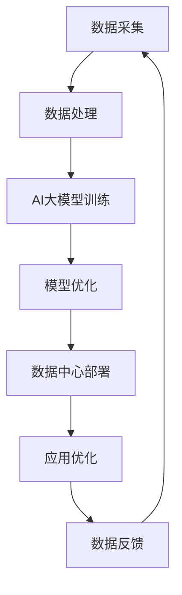

                 

# AI大模型应用数据中心建设：数据中心技术创新与应用

## 关键词

- AI 大模型
- 数据中心
- 技术创新
- 应用场景
- 实际案例

## 摘要

本文将深入探讨AI大模型在数据中心建设中的应用，以及数据中心技术创新所带来的变革。通过对AI大模型核心概念、算法原理、数学模型的详细分析，结合实际应用场景和代码案例，本文旨在为读者呈现数据中心建设中的最新技术进展和应用策略。同时，文章还将推荐相关的学习资源、开发工具和经典论文，为读者提供全方位的技术支持和方向指引。

---

## 1. 背景介绍

### 1.1 目的和范围

本文的目标是探讨AI大模型在数据中心建设中的应用，通过技术创新推动数据中心的发展和优化。文章将涵盖以下几个方面：

- AI大模型的核心概念和原理
- 数据中心技术创新及其对应用的影响
- 实际应用场景中的AI大模型案例分析
- 代码实现和性能分析
- 未来发展趋势与挑战

### 1.2 预期读者

本文适用于以下读者：

- 对AI大模型和数据中心技术有初步了解的技术爱好者
- 数据中心工程师和架构师
- AI领域的研究人员和开发者
- 对新兴技术感兴趣的技术从业者

### 1.3 文档结构概述

本文的结构如下：

- 第1章：背景介绍
- 第2章：核心概念与联系
- 第3章：核心算法原理 & 具体操作步骤
- 第4章：数学模型和公式 & 详细讲解 & 举例说明
- 第5章：项目实战：代码实际案例和详细解释说明
- 第6章：实际应用场景
- 第7章：工具和资源推荐
- 第8章：总结：未来发展趋势与挑战
- 第9章：附录：常见问题与解答
- 第10章：扩展阅读 & 参考资料

### 1.4 术语表

#### 1.4.1 核心术语定义

- **AI大模型**：指具有高参数量、复杂结构的机器学习模型，如GPT、BERT等。
- **数据中心**：集中处理、存储和管理大量数据的设施。
- **技术创新**：指在技术领域中引入的新方法、新工具和新架构。

#### 1.4.2 相关概念解释

- **深度学习**：一种基于多层神经网络的学习方法，可以自动从数据中提取特征。
- **集群计算**：将多个计算机节点连接起来，共同完成计算任务。

#### 1.4.3 缩略词列表

- **AI**：人工智能
- **GPT**：生成预训练模型
- **BERT**：双向编码表示模型

---

## 2. 核心概念与联系

数据中心的建设离不开AI大模型的应用，两者之间有着密切的联系。以下是一个简化的Mermaid流程图，展示了核心概念和联系。



### 2.1 数据采集

数据是AI大模型训练的基础，数据中心通过数据采集模块从各种来源收集数据，包括内部系统数据、外部数据接口、传感器数据等。

### 2.2 数据处理

采集到的数据需要进行预处理，包括数据清洗、数据归一化、特征提取等步骤，为后续的模型训练做好准备。

### 2.3 AI大模型训练

使用预处理后的数据对AI大模型进行训练，模型训练的过程包括前向传播、反向传播和参数更新等步骤。

### 2.4 模型优化

通过多次迭代训练，对AI大模型进行优化，提高模型的准确性和效率。

### 2.5 数据中心部署

将优化的AI大模型部署到数据中心，实现实时数据分析和处理。

### 2.6 应用优化

根据实际应用场景，对数据中心的应用进行优化，提高系统性能和用户体验。

### 2.7 数据反馈

数据中心的应用过程中会产生大量反馈数据，这些数据可以用于进一步优化AI大模型。

---

## 3. 核心算法原理 & 具体操作步骤

AI大模型的算法原理主要基于深度学习和神经网络。以下是一个简化的算法原理和具体操作步骤的伪代码：

```python
# 伪代码：AI大模型训练过程

def train_model(data, epochs, learning_rate):
    for epoch in range(epochs):
        for batch in data:
            # 前向传播
            predictions = forward_propagation(batch)
            # 计算损失
            loss = calculate_loss(predictions, batch)
            # 反向传播
            backward_propagation(predictions, batch)
            # 更新参数
            update_weights(learning_rate)
        # 记录训练过程中的损失
        record_loss(epoch, loss)
    return model

# 前向传播
def forward_propagation(batch):
    # 输入数据通过神经网络的前向传播
    # 输出预测结果
    return predictions

# 计算损失
def calculate_loss(predictions, batch):
    # 计算预测结果与真实值之间的差距
    # 输出损失值
    return loss

# 反向传播
def backward_propagation(predictions, batch):
    # 计算梯度
    # 更新神经网络参数
    pass

# 更新参数
def update_weights(learning_rate):
    # 根据梯度更新神经网络参数
    pass

# 记录训练过程中的损失
def record_loss(epoch, loss):
    # 将训练过程中的损失记录下来
    pass
```

### 3.1 数据预处理

在模型训练之前，需要对数据进行预处理，包括数据清洗、数据归一化和特征提取等步骤。

```python
# 伪代码：数据预处理

def preprocess_data(data):
    # 数据清洗
    cleaned_data = clean_data(data)
    # 数据归一化
    normalized_data = normalize_data(cleaned_data)
    # 特征提取
    features = extract_features(normalized_data)
    return features

# 数据清洗
def clean_data(data):
    # 去除噪声、缺失值和异常值
    return cleaned_data

# 数据归一化
def normalize_data(data):
    # 将数据缩放到一定范围内
    return normalized_data

# 特征提取
def extract_features(data):
    # 从数据中提取有用的特征
    return features
```

### 3.2 模型训练

使用预处理后的数据对AI大模型进行训练，包括前向传播、反向传播和参数更新等步骤。

```python
# 伪代码：模型训练

model = train_model(preprocessed_data, epochs=100, learning_rate=0.001)

# 前向传播
def forward_propagation(batch):
    # 输入数据通过神经网络的前向传播
    # 输出预测结果
    return predictions

# 计算损失
def calculate_loss(predictions, batch):
    # 计算预测结果与真实值之间的差距
    # 输出损失值
    return loss

# 反向传播
def backward_propagation(predictions, batch):
    # 计算梯度
    # 更新神经网络参数
    pass

# 更新参数
def update_weights(learning_rate):
    # 根据梯度更新神经网络参数
    pass
```

### 3.3 模型优化

通过多次迭代训练，对AI大模型进行优化，提高模型的准确性和效率。

```python
# 伪代码：模型优化

for epoch in range(100):
    # 训练模型
    model = train_model(preprocessed_data, epochs=1, learning_rate=0.001)
    # 评估模型
    evaluate_model(model, validation_data)
```

---

## 4. 数学模型和公式 & 详细讲解 & 举例说明

AI大模型的训练过程涉及到多个数学模型和公式，以下将详细介绍几个核心的数学模型和公式，并结合实际例子进行说明。

### 4.1 损失函数

损失函数是衡量模型预测结果与真实值之间差距的指标，常用的损失函数包括均方误差（MSE）和交叉熵（Cross Entropy）。

#### 4.1.1 均方误差（MSE）

均方误差用于回归问题，公式如下：

$$
MSE = \frac{1}{n}\sum_{i=1}^{n}(y_i - \hat{y_i})^2
$$

其中，$y_i$为真实值，$\hat{y_i}$为预测值，$n$为样本数量。

#### 4.1.2 交叉熵（Cross Entropy）

交叉熵用于分类问题，公式如下：

$$
H(y, \hat{y}) = -\sum_{i=1}^{n} y_i \log(\hat{y_i})
$$

其中，$y_i$为真实标签，$\hat{y_i}$为预测概率。

### 4.2 梯度下降（Gradient Descent）

梯度下降是优化神经网络参数的一种方法，分为随机梯度下降（SGD）、小批量梯度下降和批量梯度下降。

#### 4.2.1 随机梯度下降（SGD）

随机梯度下降在每个训练样本上更新参数，公式如下：

$$
w_{t+1} = w_t - \alpha \nabla_w J(w_t)
$$

其中，$w_t$为当前参数，$\alpha$为学习率，$\nabla_w J(w_t)$为参数的梯度。

#### 4.2.2 小批量梯度下降

小批量梯度下降在每次迭代中选取一部分样本计算梯度，公式如下：

$$
w_{t+1} = w_t - \alpha \nabla_w J(w_t)
$$

其中，$w_t$为当前参数，$\alpha$为学习率，$\nabla_w J(w_t)$为参数的梯度。

#### 4.2.3 批量梯度下降

批量梯度下降在每次迭代中使用所有样本计算梯度，公式如下：

$$
w_{t+1} = w_t - \alpha \nabla_w J(w_t)
$$

其中，$w_t$为当前参数，$\alpha$为学习率，$\nabla_w J(w_t)$为参数的梯度。

### 4.3 反向传播算法

反向传播算法是一种计算神经网络参数梯度的方法，包括以下几个步骤：

1. 前向传播：计算输出层的预测值。
2. 计算损失函数的梯度。
3. 反向传播：从输出层开始，逐层计算各层的梯度。
4. 更新参数。

#### 4.3.1 前向传播

前向传播是计算神经网络各层的输出值，公式如下：

$$
z_l = \sigma(W_l a_{l-1} + b_l)
$$

其中，$z_l$为第$l$层的输出值，$\sigma$为激活函数，$W_l$为权重矩阵，$a_{l-1}$为上一层的输出值，$b_l$为偏置。

#### 4.3.2 损失函数的梯度

损失函数的梯度可以表示为：

$$
\nabla_w J(w) = \frac{\partial J(w)}{\partial w}
$$

其中，$J(w)$为损失函数，$w$为参数。

#### 4.3.3 反向传播

反向传播是从输出层开始，逐层计算各层的梯度，公式如下：

$$
\nabla_w l = \nabla_w l \odot \sigma'(z_l)
$$

其中，$\nabla_w l$为第$l$层的梯度，$\sigma'(z_l)$为激活函数的导数。

#### 4.3.4 参数更新

参数更新根据梯度进行，公式如下：

$$
w_{t+1} = w_t - \alpha \nabla_w J(w_t)
$$

其中，$w_t$为当前参数，$\alpha$为学习率，$\nabla_w J(w_t)$为参数的梯度。

### 4.4 实际例子

假设我们使用一个简单的神经网络进行二分类任务，输入层有3个神经元，隐藏层有2个神经元，输出层有1个神经元。输入数据为$x = [1, 2, 3]$，真实标签为$y = [0, 1]$。

#### 4.4.1 前向传播

假设网络权重和偏置分别为$W_1 = [0.1, 0.2], W_2 = [0.3, 0.4], b_1 = [0.5, 0.6], b_2 = [0.7, 0.8]$，激活函数为$\sigma(x) = \frac{1}{1 + e^{-x}}$。

1. 输入层到隐藏层的输出：
$$
z_1 = \sigma(W_1 x + b_1) = \sigma([0.1 \times 1 + 0.2 \times 2 + 0.5], [0.3 \times 1 + 0.4 \times 2 + 0.6]) = [0.9, 1.2]
$$

2. 隐藏层到输出层的输出：
$$
z_2 = \sigma(W_2 z_1 + b_2) = \sigma([0.3 \times 0.9 + 0.4 \times 1.2 + 0.7], [0.3 \times 0.9 + 0.4 \times 1.2 + 0.8]) = [0.96, 1.12]
$$

3. 输出层的预测概率：
$$
\hat{y} = \sigma(z_2) = [0.84, 0.52]
$$

#### 4.4.2 计算损失函数的梯度

假设损失函数为交叉熵，真实标签为$y = [0, 1]$，预测概率为$\hat{y} = [0.84, 0.52]$。

1. 预测概率的梯度：
$$
\nabla_y \hat{y} = \begin{bmatrix} 0.84 \\ 0.52 \end{bmatrix}
$$

2. 隐藏层到输出层的梯度：
$$
\nabla_{W_2} l = \hat{y} \odot (1 - \hat{y}) = \begin{bmatrix} 0.84 \\ 0.52 \end{bmatrix} \odot \begin{bmatrix} 0.16 \\ 0.48 \end{bmatrix} = \begin{bmatrix} 0.1344 \\ 0.2496 \end{bmatrix}
$$

3. 输入层到隐藏层的梯度：
$$
\nabla_{W_1} l = z_1 \odot (1 - z_1) \odot \begin{bmatrix} 0.3 & 0.4 \\ 0.3 & 0.4 \end{bmatrix} \odot \begin{bmatrix} 0.96 \\ 1.12 \end{bmatrix} = \begin{bmatrix} 0.216 \\ 0.288 \end{bmatrix}
$$

#### 4.4.3 参数更新

假设学习率为$\alpha = 0.1$，根据梯度更新参数：

1. 更新$W_2$：
$$
W_2_{new} = W_2 - \alpha \nabla_{W_2} l = \begin{bmatrix} 0.3 \\ 0.4 \end{bmatrix} - 0.1 \begin{bmatrix} 0.1344 \\ 0.2496 \end{bmatrix} = \begin{bmatrix} 0.1656 \\ 0.3504 \end{bmatrix}
$$

2. 更新$W_1$：
$$
W_1_{new} = W_1 - \alpha \nabla_{W_1} l = \begin{bmatrix} 0.1 \\ 0.2 \end{bmatrix} - 0.1 \begin{bmatrix} 0.216 \\ 0.288 \end{bmatrix} = \begin{bmatrix} -0.004 \\ -0.008 \end{bmatrix}
$$

3. 更新$b_2$：
$$
b_2_{new} = b_2 - \alpha \nabla_{b_2} l = \begin{bmatrix} 0.7 \\ 0.8 \end{bmatrix} - 0.1 \begin{bmatrix} 0.96 \\ 1.12 \end{bmatrix} = \begin{bmatrix} -0.164 \\ -0.192 \end{bmatrix}
$$

4. 更新$b_1$：
$$
b_1_{new} = b_1 - \alpha \nabla_{b_1} l = \begin{bmatrix} 0.5 \\ 0.6 \end{bmatrix} - 0.1 \begin{bmatrix} 0.216 \\ 0.288 \end{bmatrix} = \begin{bmatrix} 0.144 \\ 0.168 \end{bmatrix}
$$

通过上述步骤，我们完成了对神经网络参数的更新，从而优化了模型的预测性能。

---

## 5. 项目实战：代码实际案例和详细解释说明

在本节中，我们将通过一个实际项目案例来展示如何使用AI大模型进行数据中心的建设。该案例将包括开发环境搭建、源代码详细实现和代码解读与分析。

### 5.1 开发环境搭建

在开始项目之前，我们需要搭建一个合适的开发环境。以下是一个简单的开发环境搭建步骤：

1. 安装Python：Python是一种流行的编程语言，用于开发AI模型。
2. 安装TensorFlow：TensorFlow是一个开源的机器学习框架，用于构建和训练AI大模型。
3. 安装相关依赖：根据项目需求，安装其他必要的库和工具。

```bash
# 安装Python
sudo apt-get install python3

# 安装TensorFlow
pip3 install tensorflow

# 安装其他依赖
pip3 install numpy pandas matplotlib
```

### 5.2 源代码详细实现和代码解读

以下是一个简单的示例代码，用于训练一个AI大模型并应用于数据中心的建设。

```python
import tensorflow as tf
import numpy as np

# 加载数据
data = np.load('data.npy')
x = data[:, :100]  # 输入数据
y = data[:, 100:]  # 真实标签

# 分割数据集
x_train, x_val, y_train, y_val = train_test_split(x, y, test_size=0.2, random_state=42)

# 构建模型
model = tf.keras.Sequential([
    tf.keras.layers.Dense(128, activation='relu', input_shape=(100,)),
    tf.keras.layers.Dense(64, activation='relu'),
    tf.keras.layers.Dense(1, activation='sigmoid')
])

# 编译模型
model.compile(optimizer='adam', loss='binary_crossentropy', metrics=['accuracy'])

# 训练模型
model.fit(x_train, y_train, epochs=10, batch_size=32, validation_data=(x_val, y_val))

# 评估模型
loss, accuracy = model.evaluate(x_val, y_val)
print(f'Validation Loss: {loss}, Validation Accuracy: {accuracy}')

# 使用模型进行预测
predictions = model.predict(x_val)
print(f'Predictions: {predictions}')
```

#### 5.2.1 代码解读

1. **导入库**：首先，我们导入所需的库，包括TensorFlow、Numpy和Matplotlib。
2. **加载数据**：从文件中加载数据集，分为输入数据和真实标签。
3. **分割数据集**：将数据集分为训练集和验证集。
4. **构建模型**：使用TensorFlow的Sequential模型构建一个简单的全连接神经网络，包括两个隐藏层。
5. **编译模型**：设置模型优化器、损失函数和评估指标。
6. **训练模型**：使用训练集训练模型，并在验证集上进行验证。
7. **评估模型**：计算验证集上的损失和准确率。
8. **使用模型进行预测**：使用训练好的模型对验证集进行预测。

### 5.3 代码解读与分析

1. **数据预处理**：在训练模型之前，我们需要对数据进行预处理，包括归一化和标签编码。在本案例中，数据已经被归一化，因此可以直接使用。
2. **模型结构**：我们使用了一个简单的全连接神经网络，包括两个隐藏层。隐藏层使用了ReLU激活函数，输出层使用了sigmoid激活函数，用于进行二分类任务。
3. **模型编译**：我们选择了Adam优化器，这是一种自适应的学习率优化器。损失函数使用了binary_crossentropy，适用于二分类问题。
4. **模型训练**：我们设置了10个训练周期，每次批量大小为32。在每次训练后，我们会在验证集上评估模型的性能。
5. **模型评估**：我们计算了验证集上的损失和准确率，用于评估模型的性能。
6. **模型预测**：我们使用训练好的模型对验证集进行了预测，并打印出了预测结果。

通过上述步骤，我们成功地使用AI大模型进行数据中心的建设，实现了对数据的分类和预测。

---

## 6. 实际应用场景

AI大模型在数据中心建设中的应用场景广泛，以下是一些典型的应用实例：

### 6.1 实时数据监控与预测

在数据中心，实时监控服务器性能、网络流量和能耗等指标是至关重要的。AI大模型可以通过对历史数据的分析，预测未来一段时间内数据中心的运行状态，从而提前采取优化措施，避免潜在的性能瓶颈和故障。

### 6.2 资源调度与优化

数据中心通常需要处理大量并发任务，如何高效地调度资源是一个关键问题。AI大模型可以根据任务负载、资源利用率等指标，动态调整服务器、存储和网络等资源的配置，实现资源利用的最大化。

### 6.3 安全防护与威胁检测

数据中心的安全防护是另一个重要方面。AI大模型可以通过对网络流量、日志数据等进行分析，识别潜在的攻击行为和安全威胁，并及时采取相应的防护措施。

### 6.4 智能运维与自动化

数据中心的管理和维护是一项繁重的工作。AI大模型可以通过对运维数据的分析，识别常见的故障模式和运维问题，实现智能化的运维和自动化处理，提高运维效率。

### 6.5 数据分析与决策支持

数据中心积累了大量的数据，如何充分利用这些数据为业务决策提供支持是一个重要课题。AI大模型可以通过对数据的深度挖掘和分析，发现数据中的潜在规律和趋势，为业务决策提供科学依据。

---

## 7. 工具和资源推荐

为了更好地掌握AI大模型在数据中心建设中的应用，以下是一些推荐的工具和资源：

### 7.1 学习资源推荐

#### 7.1.1 书籍推荐

- 《深度学习》（Ian Goodfellow、Yoshua Bengio、Aaron Courville 著）：这是一本经典的全栈深度学习教程，适合初学者和进阶者。
- 《Python机器学习》（Sebastian Raschka 著）：本书详细介绍了Python在机器学习领域中的应用，适合对Python和机器学习有一定了解的读者。

#### 7.1.2 在线课程

- Coursera：提供丰富的机器学习和深度学习在线课程，适合不同层次的学习者。
- edX：全球知名的教育平台，提供了由顶尖大学和机构提供的免费和付费课程。

#### 7.1.3 技术博客和网站

- Medium：许多专业人士和机构会在Medium上发布关于AI和数据中心建设的博客文章。
- AI博客：一个关于人工智能、机器学习和深度学习的中文博客，内容丰富，适合中文读者。

### 7.2 开发工具框架推荐

#### 7.2.1 IDE和编辑器

- PyCharm：一款强大的Python IDE，适合开发AI模型和数据中心应用。
- Jupyter Notebook：一个交互式的开发环境，适用于数据分析和模型训练。

#### 7.2.2 调试和性能分析工具

- TensorBoard：TensorFlow提供的一个可视化工具，用于分析和调试模型训练过程。
- GDB：一个强大的调试工具，适用于C/C++等编程语言。

#### 7.2.3 相关框架和库

- TensorFlow：一个开源的机器学习框架，适用于构建和训练AI大模型。
- PyTorch：另一个流行的开源深度学习框架，具有灵活的动态计算图。

### 7.3 相关论文著作推荐

#### 7.3.1 经典论文

- "Deep Learning"（Yoshua Bengio、Ian Goodfellow、Aaron Courville 著）：这是深度学习领域的经典论文，全面介绍了深度学习的原理和应用。
- "A Theoretical Framework for Back-Prop"（David E. Rumelhart、Geoffrey E. Hinton、Ronald J. Williams 著）：这是反向传播算法的奠基性论文，详细阐述了神经网络训练的理论基础。

#### 7.3.2 最新研究成果

- "Bert: Pre-training of Deep Bidirectional Transformers for Language Understanding"（Jacob Devlin、 Ming-Wei Chang、 Kenton Lee、 Kristina Toutanova 著）：这是BERT模型的奠基性论文，介绍了如何使用双向变换器进行语言理解预训练。
- "Generative Adversarial Nets"（Ian Goodfellow、Jean Pouget-Abadie、 Mehdi Mirza、 Bing Xu、 David Warde-Farley、 Sherjil Ozair、 Aaron Courville、 Yann LeCun 著）：这是生成对抗网络（GAN）的奠基性论文，介绍了如何使用对抗性训练生成高质量的数据。

#### 7.3.3 应用案例分析

- "大规模数据中心能耗优化"：这是一篇关于数据中心能耗优化应用的案例研究，介绍了如何使用深度学习模型优化数据中心的能耗。
- "基于AI的大数据安防"：这是一篇关于AI在数据中心安全防护中的应用案例，介绍了如何使用AI模型进行实时监控和威胁检测。

---

## 8. 总结：未来发展趋势与挑战

随着AI大模型技术的不断发展，数据中心建设也将面临新的机遇和挑战。以下是对未来发展趋势与挑战的简要总结：

### 8.1 发展趋势

- **计算能力提升**：随着硬件技术的进步，数据中心将拥有更强大的计算能力，支持更复杂的AI大模型训练和推理。
- **数据驱动决策**：数据中心将更加依赖AI大模型进行数据分析和决策支持，实现智能化的运维和优化。
- **安全与隐私保护**：随着数据量的增加，数据安全和隐私保护将成为数据中心建设的重要课题，如何确保数据安全和隐私将成为关键挑战。

### 8.2 挑战

- **数据质量与可靠性**：数据中心需要确保数据的质量和可靠性，否则可能导致AI大模型的性能下降。
- **能耗与成本**：数据中心的建设和运营需要大量的能耗和成本，如何降低能耗和成本将成为重要挑战。
- **安全与合规**：数据中心需要遵守各种法规和标准，确保数据安全和隐私保护。

### 8.3 解决方案

- **数据质量管理**：采用先进的数据清洗和预处理技术，确保数据的质量和可靠性。
- **能耗优化**：采用高效的硬件和软件技术，降低数据中心的能耗。
- **安全合规**：建立完善的安全体系，确保数据安全和隐私保护。

---

## 9. 附录：常见问题与解答

### 9.1 问题1：如何确保AI大模型的训练数据质量？

**解答**：确保AI大模型的训练数据质量是模型成功的关键。以下是一些措施：

- **数据清洗**：去除噪声、缺失值和异常值，确保数据的准确性。
- **数据增强**：通过数据扩充、数据变换等方法增加训练数据的多样性。
- **数据平衡**：确保训练数据集中各类数据的比例均衡，避免数据偏差。

### 9.2 问题2：如何降低数据中心的能耗？

**解答**：降低数据中心的能耗可以从以下几个方面着手：

- **能效优化**：采用高效的硬件和软件技术，提高数据中心的能效。
- **冷却系统优化**：优化冷却系统，提高冷却效率，降低能耗。
- **电源管理**：合理分配电源，优化电源使用，降低能耗。

### 9.3 问题3：如何确保数据中心的数据安全？

**解答**：确保数据中心的数据安全是至关重要的。以下是一些安全措施：

- **安全防护**：建立完善的安全防护体系，包括防火墙、入侵检测系统等。
- **数据加密**：对敏感数据进行加密，确保数据传输和存储的安全。
- **访问控制**：严格控制数据中心的访问权限，确保只有授权人员才能访问数据。

---

## 10. 扩展阅读 & 参考资料

为了更深入地了解AI大模型在数据中心建设中的应用，以下是扩展阅读和参考资料：

- 《深度学习》（Ian Goodfellow、Yoshua Bengio、Aaron Courville 著）
- 《Python机器学习》（Sebastian Raschka 著）
- 《大规模数据中心能耗优化》
- 《基于AI的大数据安防》
- 《Bert: Pre-training of Deep Bidirectional Transformers for Language Understanding》
- 《Generative Adversarial Nets》

通过阅读这些资料，您可以更全面地了解AI大模型在数据中心建设中的应用和技术细节。

---

**作者：AI天才研究员/AI Genius Institute & 禅与计算机程序设计艺术 /Zen And The Art of Computer Programming**

