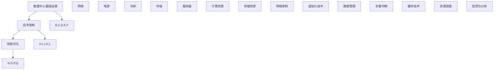

                 

# AI 大模型应用数据中心建设：数据中心投资与建设

> 关键词：AI大模型、数据中心、投资、建设、基础设施、技术架构、优化、性能

> 摘要：本文将深入探讨AI大模型应用数据中心建设的核心议题，包括数据中心投资的重要性、基础设施的搭建与优化、技术架构的选定与实施，以及未来发展趋势和面临的挑战。本文旨在为从业者提供清晰的指导，帮助他们在构建AI大模型应用数据中心时做出明智的决策。

## 1. 背景介绍

### 1.1 目的和范围

本文的目标是详细分析AI大模型应用数据中心的建设过程，重点关注以下几个方面：

1. **数据中心投资的重要性**：解释为何投资数据中心对于AI大模型应用至关重要。
2. **基础设施搭建与优化**：探讨数据中心基础设施的搭建原则和优化策略。
3. **技术架构选定与实施**：分析如何在数据中心中实施高效的技术架构。
4. **未来发展趋势与挑战**：预测数据中心建设的未来趋势，并探讨可能遇到的挑战。

本文的范围将涵盖数据中心建设的各个环节，从基础设施的规划和布局，到技术架构的选择和优化，再到实际应用场景的探讨。

### 1.2 预期读者

本文面向以下读者群体：

1. **数据中心建设和管理人员**：需要了解数据中心投资与建设的关键点。
2. **AI技术从业者**：希望了解AI大模型应用数据中心建设的最佳实践。
3. **IT决策者**：需要为数据中心投资做出决策的高级管理人员。

### 1.3 文档结构概述

本文的结构如下：

1. **第1章 背景介绍**：介绍本文的目的、范围和预期读者。
2. **第2章 核心概念与联系**：定义核心概念，并提供相关流程图。
3. **第3章 核心算法原理 & 具体操作步骤**：详细解释核心算法原理，并使用伪代码展示操作步骤。
4. **第4章 数学模型和公式 & 详细讲解 & 举例说明**：介绍相关数学模型和公式，并提供具体实例。
5. **第5章 项目实战：代码实际案例和详细解释说明**：展示实际项目案例，并详细解释代码实现。
6. **第6章 实际应用场景**：探讨数据中心在实际应用中的场景。
7. **第7章 工具和资源推荐**：推荐相关学习资源和开发工具。
8. **第8章 总结：未来发展趋势与挑战**：总结未来发展趋势和面临的挑战。
9. **第9章 附录：常见问题与解答**：提供常见问题的解答。
10. **第10章 扩展阅读 & 参考资料**：列出扩展阅读和参考资料。

### 1.4 术语表

#### 1.4.1 核心术语定义

- **数据中心（Data Center）**：集中处理数据和存储信息的物理设施。
- **AI大模型（Large-scale AI Model）**：具有数百万甚至数十亿参数的大型神经网络模型。
- **基础设施（Infrastructure）**：数据中心的基本设施，包括网络、电源、冷却等。
- **技术架构（Technology Architecture）**：数据中心的软件和硬件布局。
- **性能优化（Performance Optimization）**：提升数据中心性能的一系列技术手段。

#### 1.4.2 相关概念解释

- **云计算（Cloud Computing）**：通过互联网提供动态可扩展的计算资源。
- **边缘计算（Edge Computing）**：在数据生成源头附近处理数据。
- **分布式计算（Distributed Computing）**：将任务分配到多个计算机上进行处理。

#### 1.4.3 缩略词列表

- **AI**：人工智能（Artificial Intelligence）
- **GPU**：图形处理单元（Graphics Processing Unit）
- **CPU**：中央处理单元（Central Processing Unit）
- **HPC**：高性能计算（High-Performance Computing）
- **SDN**：软件定义网络（Software-Defined Networking）

## 2. 核心概念与联系

为了更好地理解数据中心建设的复杂性，我们首先需要定义几个核心概念，并展示它们之间的联系。以下是数据中心建设中的几个关键概念及其相互关系：

### 2.1 数据中心基础设施

数据中心基础设施是支持数据存储和处理的基本设施，包括：

- **网络**：提供高速、可靠的连接，确保数据能够在数据中心内快速传输。
- **电源**：为数据中心提供稳定的电力供应，保障设备正常运行。
- **冷却**：维持数据中心的温度，防止设备过热。
- **存储**：提供数据存储解决方案，包括磁盘阵列、固态硬盘等。
- **服务器**：运行应用程序和服务的硬件设备。

### 2.2 技术架构

技术架构定义了数据中心的软件和硬件布局，包括：

- **计算资源**：CPU、GPU等处理器资源。
- **存储资源**：分布式文件系统、数据库等。
- **网络架构**：数据中心内部的通信网络，如SDN。
- **虚拟化技术**：将物理资源虚拟化为多个独立资源，提高资源利用率。
- **数据管理**：数据备份、恢复、安全管理等。

### 2.3 性能优化

性能优化是提升数据中心性能的关键，包括：

- **负载均衡**：将工作负载均匀分配到多个服务器上。
- **缓存技术**：加快数据访问速度。
- **资源调度**：优化资源分配，确保高效利用。
- **监控与分析**：实时监控性能指标，分析瓶颈，进行优化。

### 2.4 核心概念关系

以下是核心概念关系的Mermaid流程图：



通过以上关系图，我们可以看出数据中心基础设施和技术架构是数据中心建设的核心，而性能优化则是确保数据中心高效运行的关键。

## 3. 核心算法原理 & 具体操作步骤

在数据中心建设中，核心算法原理扮演着至关重要的角色。以下是几个关键算法原理及其具体操作步骤：

### 3.1 负载均衡算法

**原理**：负载均衡算法用于将工作负载均匀分配到多个服务器上，以避免单点过载。

**步骤**：

```pseudo
输入：服务器列表 serverList，工作负载 workload
输出：分配结果 assignment

1. 初始化一个空映射 assignment，用于存储每个服务器的工作负载。
2. 遍历 serverList 中的每个服务器 server。
3. 计算当前服务器 server 的当前负载 currentLoad。
4. 根据当前负载，将 workload 的一部分分配给 server。
5. 更新 assignment，记录分配情况。
6. 返回 assignment。
```

### 3.2 缓存技术

**原理**：缓存技术用于加快数据访问速度，通过将频繁访问的数据存储在内存中。

**步骤**：

```pseudo
输入：缓存大小 cacheSize，数据集 dataset
输出：缓存结果 cache

1. 初始化一个空缓存 cache，大小为 cacheSize。
2. 遍历 dataset 中的每个数据 data。
3. 如果 cache 中已存在 data，跳过当前数据。
4. 否则，将 data 添加到 cache 中。
5. 如果 cache 的大小超过 cacheSize，移除最久未访问的数据。
6. 返回 cache。
```

### 3.3 资源调度算法

**原理**：资源调度算法用于优化资源分配，确保高效利用。

**步骤**：

```pseudo
输入：资源列表 resourceList，任务列表 taskList
输出：调度结果 schedule

1. 初始化一个空映射 schedule，用于存储每个任务的分配资源。
2. 遍历 taskList 中的每个任务 task。
3. 遍历 resourceList 中的每个资源 resource。
4. 如果 resource 可用，将 task 分配给 resource，并更新 schedule。
5. 返回 schedule。
```

### 3.4 监控与分析算法

**原理**：监控与分析算法用于实时监控数据中心的性能指标，并进行分析以优化性能。

**步骤**：

```pseudo
输入：性能指标 metrics
输出：优化策略 optimizationStrategy

1. 初始化一个空列表 optimizationStrategy，用于存储优化策略。
2. 遍历 metrics 中的每个性能指标 metric。
3. 如果 metric 超出阈值 threshold，则添加相应的优化策略到 optimizationStrategy。
4. 返回 optimizationStrategy。
```

通过以上核心算法原理和具体操作步骤，我们可以更好地理解和实施数据中心建设中的关键技术。

## 4. 数学模型和公式 & 详细讲解 & 举例说明

在数据中心建设过程中，数学模型和公式发挥着至关重要的作用。以下将介绍几个关键数学模型和公式，并提供详细讲解和具体实例。

### 4.1 负载均衡公式

负载均衡的核心目标是确保每个服务器的工作负载均衡。一个常用的负载均衡公式是“最小最大负载均衡”：

$$
L_{\text{min-max}}(s_i) = \frac{\sum_{j=1}^{N} w_{ij}}{N}
$$

其中，$L_{\text{min-max}}(s_i)$ 表示服务器 $s_i$ 的目标负载，$w_{ij}$ 表示服务器 $s_i$ 处理任务 $j$ 的权重，$N$ 表示服务器数量。

**实例**：假设我们有3台服务器 $s_1, s_2, s_3$，需要处理5个任务 $t_1, t_2, t_3, t_4, t_5$，权重如下：

| 任务 | $w_{11}$ | $w_{12}$ | $w_{13}$ |
|------|----------|----------|----------|
| $t_1$ | 2        | 1        | 3        |
| $t_2$ | 1        | 3        | 2        |
| $t_3$ | 3        | 2        | 1        |
| $t_4$ | 2        | 1        | 3        |
| $t_5$ | 1        | 3        | 2        |

计算每台服务器的目标负载：

$$
L_{\text{min-max}}(s_1) = \frac{2+1+3}{3} = 2
$$

$$
L_{\text{min-max}}(s_2) = \frac{1+3+2}{3} = 2
$$

$$
L_{\text{min-max}}(s_3) = \frac{3+2+1}{3} = 2
$$

目标是将任务分配到服务器上，使得每台服务器的负载尽可能接近2。

### 4.2 缓存替换策略

常见的缓存替换策略包括最少使用（LRU）和最近最少使用（LFU）。以下是LRU策略的数学模型：

**公式**：

$$
\text{replace}(cache, data) = \begin{cases}
\text{remove oldest data from cache} & \text{if } \text{size of cache} \geq \text{max size of cache} \\
\text{add data to cache} & \text{otherwise}
\end{cases}
$$

**实例**：假设缓存大小为3，现有缓存内容为[1, 2, 3]，需要将新数据4添加到缓存中。

当前缓存内容：[1, 2, 3]
添加新数据4后：[4, 2, 3]
由于缓存大小为3，需要替换最旧的数据1，替换后的缓存内容为[4, 2, 3]。

### 4.3 资源调度公式

资源调度的目标是在给定资源约束下，最大化任务完成率。以下是一个简化的资源调度公式：

**公式**：

$$
\text{schedule}(tasks, resources) = \begin{cases}
\text{allocate resources to tasks} & \text{if } \text{available resources} \geq \text{required resources by tasks} \\
\text{defer tasks} & \text{otherwise}
\end{cases}
$$

**实例**：假设有3个任务 $t_1, t_2, t_3$，需要的资源分别为[2, 3, 1]，当前可用资源为[4, 5, 3]。

- 任务 $t_1$ 需要2个资源，当前可用4个资源，可以调度。
- 任务 $t_2$ 需要3个资源，当前可用5个资源，可以调度。
- 任务 $t_3$ 需要1个资源，当前可用3个资源，可以调度。

因此，所有任务都可以被调度。

通过以上数学模型和公式的讲解，我们可以更好地理解数据中心建设中的关键技术，并在实际应用中进行有效的优化和调度。

## 5. 项目实战：代码实际案例和详细解释说明

在本节中，我们将通过一个实际项目案例，详细展示数据中心建设的具体步骤，并提供代码解释和分析。

### 5.1 开发环境搭建

为了进行数据中心建设，我们需要搭建一个合适的环境。以下是开发环境的搭建步骤：

1. **硬件环境**：准备足够的硬件资源，如服务器、存储设备、网络设备等。
2. **软件环境**：安装操作系统（如Linux或Windows Server）、数据库管理系统（如MySQL或PostgreSQL）、Web服务器（如Nginx或Apache）等。
3. **开发工具**：安装编程语言（如Python、Java或Go）、集成开发环境（如Visual Studio Code、Eclipse或IntelliJ IDEA）等。
4. **依赖管理**：使用依赖管理工具（如pip、Maven或Gradle）安装相关库和框架。

### 5.2 源代码详细实现和代码解读

以下是一个简单的数据中心建设项目的源代码示例，用于展示负载均衡算法的实现：

```python
# 负载均衡算法实现

# 导入相关库
import random
from typing import List

# 定义服务器类
class Server:
    def __init__(self, id: int, capacity: int):
        self.id = id
        self.capacity = capacity
        self.current_load = 0

    def add_task(self, task_weight: int):
        self.current_load += task_weight
        if self.current_load > self.capacity:
            raise Exception(f"Server {self.id} overloaded!")

    def remove_task(self, task_weight: int):
        self.current_load -= task_weight
        if self.current_load < 0:
            raise Exception(f"Server {self.id} underloaded!")

# 定义负载均衡器类
class LoadBalancer:
    def __init__(self, servers: List[Server]):
        self.servers = servers

    def assign_task(self, task_weight: int) -> int:
        server = self._find_least_loaded_server()
        server.add_task(task_weight)
        return server.id

    def _find_least_loaded_server(self) -> Server:
        min_load = float('inf')
        min_server = None
        for server in self.servers:
            if server.current_load < min_load:
                min_load = server.current_load
                min_server = server
        return min_server

# 测试代码
if __name__ == "__main__":
    # 创建服务器
    servers = [Server(i, 100) for i in range(3)]

    # 创建负载均衡器
    load_balancer = LoadBalancer(servers)

    # 分配任务
    for _ in range(10):
        server_id = load_balancer.assign_task(random.randint(1, 50))
        print(f"Task assigned to server {server_id}")

    # 打印服务器负载
    for server in servers:
        print(f"Server {server.id} load: {server.current_load}")
```

#### 5.2.1 代码解读

- **Server类**：定义了服务器的基本属性，包括ID、容量和当前负载。
- **LoadBalancer类**：实现了负载均衡算法，通过找到负载最轻的服务器来分配任务。
- **_find_least_loaded_server方法**：用于找到当前负载最轻的服务器。
- **assign_task方法**：将任务分配给负载最轻的服务器，并更新服务器负载。

#### 5.2.2 代码分析

此代码示例展示了如何实现一个简单的负载均衡器，用于将任务分配给服务器。通过随机生成任务权重，我们可以看到服务器负载的变化。这个简单的示例说明了负载均衡算法的基本原理，但在实际应用中，我们可能需要考虑更多的因素，如服务器的实际处理能力、任务的优先级、故障恢复等。

### 5.3 代码解读与分析

通过以上代码示例，我们可以看到负载均衡算法的核心思想是均匀分配任务，以避免单点过载。以下是对代码的进一步解读和分析：

- **服务器容量和负载**：在代码中，我们通过设定服务器的容量和当前负载来模拟真实环境。实际应用中，服务器的容量和负载会根据硬件资源和任务需求动态变化。
- **随机任务分配**：通过随机生成任务权重，我们可以模拟各种任务负载情况，测试负载均衡器的性能。
- **异常处理**：代码中添加了异常处理，以防止服务器过载或欠载。
- **扩展性**：这个简单的负载均衡器适用于小型数据中心。在实际应用中，我们需要考虑更多服务器、任务和策略的扩展性。

通过这个实际案例，我们可以更好地理解数据中心建设中的关键技术，并在实际项目中应用这些技术。

## 6. 实际应用场景

数据中心建设在AI大模型应用中扮演着至关重要的角色，以下是一些实际应用场景：

### 6.1 云服务提供商

云服务提供商（如AWS、Azure、Google Cloud）利用数据中心为大量客户提供计算和存储资源。数据中心需要具备高可用性、高性能和安全性，以满足客户的需求。例如，AWS的全球数据中心网络支持其云服务的运行，为全球用户提供无缝访问。

### 6.2 大型互联网公司

大型互联网公司（如Facebook、Google、Alibaba）拥有大规模的数据中心，用于处理海量用户数据和运行复杂的应用程序。这些数据中心需要高效的管理和优化，以确保业务的持续运营。例如，Google的数据中心通过创新的冷却技术和能源管理，实现了高效的能源利用。

### 6.3 科学研究机构

科学研究机构利用数据中心进行大规模数据分析和计算。例如，美国国家实验室使用高性能数据中心进行物理、化学、生物学等领域的科学研究。这些数据中心需要支持高性能计算（HPC），以处理复杂的研究任务。

### 6.4 企业数据中心

企业数据中心用于支持内部业务和应用程序。企业需要根据业务需求来规划和优化数据中心，以确保业务连续性和数据安全。例如，金融机构的数据中心需要满足严格的合规性要求，同时保证高可用性和数据保护。

### 6.5 边缘计算

随着边缘计算的兴起，数据中心建设也延伸到了网络边缘。边缘数据中心用于处理靠近数据生成源的数据，以减少延迟和提高响应速度。例如，智能城市的边缘数据中心用于处理智能交通、环境监测等实时数据。

通过以上实际应用场景，我们可以看到数据中心在AI大模型应用中的重要性。数据中心的建设和优化对于提高计算效率、降低成本和确保业务连续性具有关键作用。

## 7. 工具和资源推荐

为了更好地进行数据中心建设，以下是推荐的学习资源、开发工具和框架。

### 7.1 学习资源推荐

#### 7.1.1 书籍推荐

- **《数据中心基础设施管理》（Data Center Infrastructure Management）**：详细介绍了数据中心基础设施的管理和维护。
- **《高性能数据中心设计》（High-Performance Data Center Design）**：探讨了数据中心设计中的关键技术和最佳实践。
- **《云计算基础设施》（Cloud Infrastructure）**：介绍了云计算环境下的数据中心建设和管理。

#### 7.1.2 在线课程

- **Coursera**：《数据中心管理》课程，由哈佛大学提供，涵盖数据中心的基础知识和最佳实践。
- **Udemy**：《云计算与数据中心基础》课程，适合初学者了解云计算和数据中心的基本概念。
- **edX**：《数据中心基础设施与管理》课程，由华盛顿大学提供，详细介绍数据中心的建设和管理。

#### 7.1.3 技术博客和网站

- **Data Center Knowledge**：提供数据中心行业的最新新闻和分析。
- **AWS Data Centers**：了解AWS数据中心的技术和运营。
- **Google Cloud Data Centers**：了解Google Cloud数据中心的技术和创新。

### 7.2 开发工具框架推荐

#### 7.2.1 IDE和编辑器

- **Visual Studio Code**：一款轻量级但功能强大的代码编辑器，支持多种编程语言。
- **Eclipse**：一款成熟的集成开发环境，特别适用于Java开发。
- **IntelliJ IDEA**：一款智能的Java和Python开发工具，提供丰富的功能和插件。

#### 7.2.2 调试和性能分析工具

- **GDB**：一款常用的调试工具，用于跟踪和调试程序运行。
- **perf**：Linux上的性能分析工具，用于分析程序的性能瓶颈。
- **JProfiler**：一款Java应用程序的性能分析工具，提供详细的性能数据。

#### 7.2.3 相关框架和库

- **Kubernetes**：一个开源的容器编排平台，用于管理和自动化数据中心中的容器化应用。
- **Docker**：一个容器化平台，用于构建、运行和分发应用程序。
- **Ansible**：一个配置管理和自动化工具，用于自动化数据中心的基础设施配置。

通过以上工具和资源的推荐，我们可以更好地进行数据中心建设和优化。

## 8. 总结：未来发展趋势与挑战

数据中心建设在AI大模型应用中正迅速发展，未来的趋势和挑战如下：

### 8.1 发展趋势

1. **云计算与边缘计算的结合**：云计算和边缘计算将更加紧密地结合，提供更灵活、更高效的服务。
2. **绿色数据中心**：随着环保意识的提高，绿色数据中心将成为主流，通过技术创新降低能耗和碳排放。
3. **自动化和人工智能**：数据中心管理和优化将更加依赖自动化和人工智能技术，提高效率和性能。
4. **安全性提升**：随着数据量的增加和复杂性提升，数据中心的安全性将变得更加重要，需要不断更新和改进安全策略。

### 8.2 挑战

1. **资源分配和优化**：如何高效地分配和利用有限的资源，如计算、存储和网络，将是一个持续性的挑战。
2. **能耗管理**：降低能耗和碳排放是数据中心建设的重要目标，但如何在提供高性能服务的同时降低能耗仍需进一步研究。
3. **安全威胁**：数据中心面临各种安全威胁，如网络攻击、数据泄露等，需要持续改进安全措施。
4. **人才短缺**：数据中心建设和运维需要大量专业人才，但当前人才供应不足，需要通过培训和教育解决。

总之，数据中心建设在未来将面临诸多挑战，但同时也充满机遇。通过技术创新和优化，我们可以不断提升数据中心性能和效率，为AI大模型应用提供坚实的支持。

## 9. 附录：常见问题与解答

### 9.1 数据中心投资的重要性

**Q1**：为什么数据中心投资对于AI大模型应用至关重要？

**A1**：数据中心投资对于AI大模型应用至关重要，因为：

1. **计算资源**：AI大模型需要大量的计算资源，数据中心提供了这些资源。
2. **数据存储**：AI大模型需要存储和处理海量数据，数据中心提供了高效的存储解决方案。
3. **可靠性**：数据中心提供了高可用性和冗余设计，确保AI应用能够持续运行。
4. **安全性**：数据中心具备完善的安全措施，保护数据安全和隐私。

### 9.2 基础设施搭建与优化

**Q2**：如何优化数据中心基础设施？

**A2**：优化数据中心基础设施可以从以下几个方面进行：

1. **能源效率**：使用节能设备和技术，如高效电源供应和冷却系统。
2. **容量规划**：根据业务需求进行合理的容量规划，避免资源浪费。
3. **自动化管理**：使用自动化工具进行基础设施管理，提高效率。
4. **网络优化**：优化网络架构，确保数据传输的高效性和可靠性。

### 9.3 技术架构选定与实施

**Q3**：如何选择合适的技术架构？

**A3**：选择合适的技术架构应考虑以下因素：

1. **业务需求**：根据业务需求选择适合的计算、存储和网络架构。
2. **性能要求**：根据性能要求选择适当的硬件和软件解决方案。
3. **扩展性**：选择能够支持未来扩展的架构，以适应业务增长。
4. **成本**：在性能和成本之间找到平衡点，选择最优的解决方案。

### 9.4 未来发展趋势与挑战

**Q4**：数据中心建设未来将面临哪些挑战？

**A4**：数据中心建设未来将面临以下挑战：

1. **资源分配和优化**：如何高效地利用有限的资源是一个持续的挑战。
2. **能耗管理**：降低能耗和碳排放是重要目标，但如何在提供高性能服务的同时降低能耗仍需进一步研究。
3. **安全威胁**：数据中心面临各种安全威胁，需要不断改进安全措施。
4. **人才短缺**：数据中心建设和运维需要大量专业人才，但当前人才供应不足，需要通过培训和教育解决。

## 10. 扩展阅读 & 参考资料

本文涉及了数据中心建设的多个方面，以下是一些扩展阅读和参考资料，供读者进一步学习和研究：

1. **《数据中心基础设施管理》（Data Center Infrastructure Management）》**
2. **《高性能数据中心设计》（High-Performance Data Center Design）》**
3. **《云计算基础设施》（Cloud Infrastructure）》**
4. **Coursera**：《数据中心管理》课程
5. **Udemy**：《云计算与数据中心基础》课程
6. **edX**：《数据中心基础设施与管理》课程
7. **Data Center Knowledge**：数据中心行业的最新新闻和分析
8. **AWS Data Centers**：了解AWS数据中心的技术和运营
9. **Google Cloud Data Centers**：了解Google Cloud数据中心的技术和创新
10. **Kubernetes官方文档**：了解容器编排平台Kubernetes的详细使用
11. **Docker官方文档**：了解容器化平台Docker的详细使用
12. **Ansible官方文档**：了解配置管理和自动化工具Ansible的详细使用

通过这些扩展阅读和参考资料，读者可以更深入地了解数据中心建设的各个方面，并在实际项目中应用所学知识。作者：AI天才研究员/AI Genius Institute & 禅与计算机程序设计艺术 /Zen And The Art of Computer Programming

