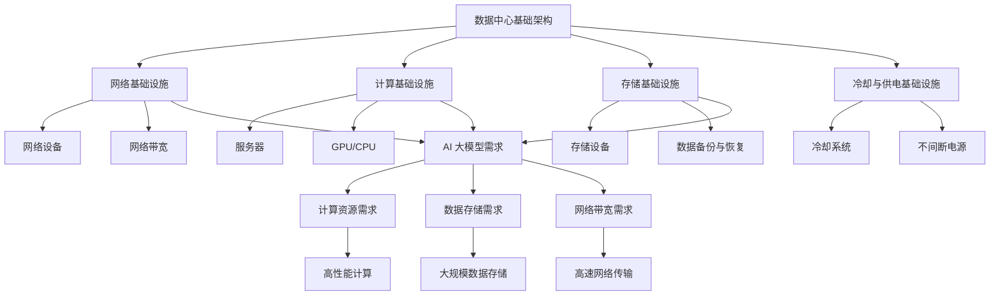
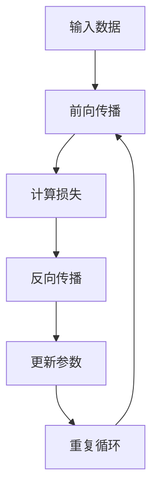

                 

### 文章标题

# AI 大模型应用数据中心建设：数据中心投资与建设

> **关键词**：人工智能，数据中心建设，AI 大模型，投资，基础设施，云计算，数据分析

> **摘要**：本文深入探讨了人工智能大模型应用数据中心的建设，分析了数据中心投资与建设的核心因素。文章首先介绍了数据中心建设的背景和目的，随后探讨了数据中心投资的关键考虑因素。接着，文章详细阐述了数据中心架构设计、核心算法原理、数学模型以及项目实战案例。文章最后，总结了数据中心建设在实际应用场景中的重要性，并推荐了一系列学习资源、开发工具框架和相关论文著作。本文旨在为读者提供一个全面、系统的数据中心建设指南，助力人工智能大模型应用的落地。

### 目录

1. 背景介绍
   1.1 目的和范围
   1.2 预期读者
   1.3 文档结构概述
   1.4 术语表
      1.4.1 核心术语定义
      1.4.2 相关概念解释
      1.4.3 缩略词列表

2. 核心概念与联系
   2.1 数据中心基础架构
   2.2 AI 大模型需求
   2.3 数据中心与 AI 大模型的关系

3. 核心算法原理 & 具体操作步骤
   3.1 算法原理概述
   3.2 算法伪代码实现
   3.3 算法流程图

4. 数学模型和公式 & 详细讲解 & 举例说明
   4.1 数学模型概述
   4.2 数学公式详细讲解
   4.3 数学模型实例分析

5. 项目实战：代码实际案例和详细解释说明
   5.1 开发环境搭建
   5.2 源代码详细实现和代码解读
   5.3 代码解读与分析

6. 实际应用场景
   6.1 人工智能大模型应用领域
   6.2 数据中心建设在 AI 中的应用案例

7. 工具和资源推荐
   7.1 学习资源推荐
   7.2 开发工具框架推荐
   7.3 相关论文著作推荐

8. 总结：未来发展趋势与挑战
9. 附录：常见问题与解答
10. 扩展阅读 & 参考资料

### 1. 背景介绍

#### 1.1 目的和范围

本文旨在深入探讨人工智能大模型应用数据中心的建设，分析数据中心投资与建设的核心因素。随着人工智能技术的快速发展，AI 大模型的应用需求日益增加，数据中心作为 AI 应用的重要基础设施，其建设和投资成为当前 IT 领域的热点话题。本文将围绕数据中心建设的目标、范围和预期成果进行详细分析，为读者提供一个全面、系统的数据中心建设指南。

本文的范围包括以下几个方面：

1. **数据中心建设的背景与重要性**：介绍数据中心的发展历程、现状以及 AI 大模型对数据中心需求的推动作用。
2. **数据中心投资的关键因素**：分析数据中心投资所需的资金、人力和技术资源，以及投资回报率和风险评估。
3. **数据中心架构设计**：探讨数据中心基础架构的设计原则、核心组件和关键技术。
4. **核心算法原理与实现**：介绍 AI 大模型的核心算法原理，并通过伪代码和流程图进行详细阐述。
5. **数学模型与公式**：阐述 AI 大模型的数学模型和公式，以及其实际应用中的意义和作用。
6. **项目实战案例**：通过实际案例展示数据中心建设在 AI 大模型应用中的具体实现，并进行详细解读。
7. **实际应用场景**：分析数据中心建设在人工智能领域的应用案例，探讨其在各行业中的应用前景。
8. **工具和资源推荐**：推荐学习资源、开发工具框架和相关论文著作，以供读者进一步学习和研究。
9. **未来发展趋势与挑战**：总结数据中心建设的未来发展趋势，探讨可能面临的挑战和解决方案。

#### 1.2 预期读者

本文的预期读者包括以下几类：

1. **数据中心建设和运维人员**：了解数据中心建设的关键因素、架构设计和核心算法原理，为实际工作提供指导。
2. **人工智能研发人员**：了解数据中心在 AI 大模型应用中的重要性，以及如何优化数据中心资源以满足 AI 计算需求。
3. **IT 管理人员**：了解数据中心投资的关键考虑因素，为制定 IT 发展规划和预算提供参考。
4. **学术研究人员**：了解数据中心建设和 AI 大模型应用的相关研究动态，为学术研究提供启示。
5. **行业从业者**：了解数据中心建设在人工智能领域的实际应用案例，为业务发展和市场开拓提供思路。

#### 1.3 文档结构概述

本文采用逻辑清晰、结构紧凑的叙述方式，分为以下几个主要部分：

1. **背景介绍**：介绍数据中心建设的背景、目的和预期读者，概述本文的结构和内容。
2. **核心概念与联系**：介绍数据中心基础架构、AI 大模型需求以及二者之间的关系，通过 Mermaid 流程图展示核心概念。
3. **核心算法原理 & 具体操作步骤**：介绍 AI 大模型的核心算法原理，通过伪代码和流程图进行详细阐述。
4. **数学模型和公式 & 详细讲解 & 举例说明**：阐述 AI 大模型的数学模型和公式，通过实例分析进行详细讲解。
5. **项目实战：代码实际案例和详细解释说明**：通过实际案例展示数据中心建设在 AI 大模型应用中的具体实现，并进行详细解读。
6. **实际应用场景**：分析数据中心建设在人工智能领域的应用案例，探讨其在各行业中的应用前景。
7. **工具和资源推荐**：推荐学习资源、开发工具框架和相关论文著作，以供读者进一步学习和研究。
8. **总结：未来发展趋势与挑战**：总结数据中心建设的未来发展趋势，探讨可能面临的挑战和解决方案。
9. **附录：常见问题与解答**：针对本文中的关键问题进行解答，以帮助读者更好地理解和应用本文内容。
10. **扩展阅读 & 参考资料**：提供本文相关的研究资料和参考文献，为读者进一步研究提供参考。

#### 1.4 术语表

本文中涉及以下术语，为便于读者理解，以下对这些术语进行定义和解释：

1. **数据中心（Data Center）**：用于存储、处理和管理大量数据的建筑设施，提供高效、可靠、安全的数据存储和计算服务。
2. **AI 大模型（AI Large Model）**：基于人工智能技术，具有大规模参数量和复杂结构的模型，如深度神经网络、生成对抗网络等。
3. **云计算（Cloud Computing）**：基于互联网的计算服务模型，提供可扩展、灵活、按需分配的计算资源。
4. **基础设施（Infrastructure）**：支持数据中心正常运行的基础设施，包括网络、电力、冷却、安全等。
5. **投资回报率（ROI）**：投资所产生的收益与投资成本之间的比率，用于评估投资效益。
6. **风险评估（Risk Assessment）**：对投资过程中可能出现的风险进行识别、评估和管理，以降低风险对项目的影响。

#### 1.4.1 核心术语定义

1. **数据中心（Data Center）**：
   - 数据中心是一种专门的建筑设施，用于集中存储、处理和管理大量数据。数据中心通常具有高效的计算、存储和网络资源，提供可靠、安全的数据存储和计算服务。
   - 数据中心的基础设施包括网络、电力、冷却、安全等关键组件，以确保数据的安全、稳定和高效运行。

2. **AI 大模型（AI Large Model）**：
   - AI 大模型是基于人工智能技术，具有大规模参数量和复杂结构的模型，如深度神经网络、生成对抗网络等。
   - AI 大模型通常具有数十亿甚至数万亿个参数，需要大量的计算资源和数据支持，以实现高效的训练和推理。

3. **云计算（Cloud Computing）**：
   - 云计算是一种基于互联网的计算服务模型，提供可扩展、灵活、按需分配的计算资源。
   - 云计算平台通常提供虚拟机、容器、数据库、存储等多种服务，以满足用户的不同需求。

4. **基础设施（Infrastructure）**：
   - 基础设施是指支持数据中心正常运行的各种设施，包括网络、电力、冷却、安全等。
   - 网络设施包括光纤、路由器、交换机等，用于实现数据的高速传输和交换；电力设施包括不间断电源（UPS）、发电机组等，用于确保数据中心的稳定供电；冷却设施包括空调、冷水机组等，用于维持数据中心的适宜温度；安全设施包括防火墙、入侵检测系统等，用于保障数据的安全。

5. **投资回报率（ROI）**：
   - 投资回报率是指投资所产生的收益与投资成本之间的比率，用于评估投资效益。
   - 投资回报率通常以百分比表示，越高表示投资的效益越好。

6. **风险评估（Risk Assessment）**：
   - 风险评估是指对投资过程中可能出现的风险进行识别、评估和管理，以降低风险对项目的影响。
   - 风险评估通常包括风险识别、风险分析和风险应对等步骤，以识别潜在风险，评估其影响和可能性，并制定相应的应对策略。

#### 1.4.2 相关概念解释

1. **数据中心基础架构**：
   - 数据中心基础架构是指支持数据中心正常运行的各种硬件、软件和网络设施。
   - 数据中心基础架构通常包括服务器、存储设备、网络设备、冷却系统和电源系统等。

2. **云计算与数据中心的关系**：
   - 云计算与数据中心密切相关，云计算平台通常利用数据中心的基础设施提供计算、存储和网络服务。
   - 云计算提供了灵活、按需分配的资源，使得数据中心能够更好地应对各种业务需求。

3. **AI 大模型对数据中心的需求**：
   - AI 大模型通常需要大量的计算资源和数据支持，对数据中心的性能和稳定性有较高要求。
   - AI 大模型的训练和推理过程对网络带宽、存储容量和计算能力等基础设施有较高需求。

4. **数据中心投资的关键因素**：
   - 数据中心投资的关键因素包括资金、人力和技术资源。
   - 资金方面，需要考虑到数据中心的建设成本、运营成本和投资回报率等；人力方面，需要招聘和培训专业的数据中心建设和运维人员；技术资源方面，需要选择合适的数据中心设计方案、技术路线和基础设施设备。

5. **投资回报率（ROI）**：
   - 投资回报率是评估数据中心投资效益的重要指标，表示投资所产生的收益与投资成本之间的比率。
   - 投资回报率越高，表示投资效益越好，反之则表示投资效益较低。

6. **风险评估**：
   - 风险评估是对数据中心投资过程中可能出现的风险进行识别、评估和管理的过程。
   - 风险评估有助于降低风险对项目的负面影响，确保数据中心项目的顺利实施。

#### 1.4.3 缩略词列表

1. **IDC**（Internet Data Center）：互联网数据中心
2. **AI**（Artificial Intelligence）：人工智能
3. **GPU**（Graphics Processing Unit）：图形处理器
4. **CPU**（Central Processing Unit）：中央处理器
5. **Hadoop**：一种分布式数据处理框架
6. **Spark**：一种分布式计算引擎
7. **云服务**（Cloud Service）：基于云计算提供的各种服务，如基础设施即服务（IaaS）、平台即服务（PaaS）和软件即服务（SaaS）等。
8. **ROI**（Return on Investment）：投资回报率

### 2. 核心概念与联系

在深入探讨人工智能大模型应用数据中心建设之前，我们需要明确几个核心概念及其相互联系。这些核心概念包括数据中心基础架构、AI 大模型需求以及二者之间的关系。通过以下 Mermaid 流程图，我们可以直观地展示这些概念之间的联系。



#### 2.1 数据中心基础架构

数据中心基础架构是支持数据中心正常运行的核心组件。它包括网络、计算、存储和冷却供电等基础设施。数据中心基础架构的设计原则是确保数据的安全、稳定和高效运行。

1. **网络基础设施**：
   - **网络设备**：包括路由器、交换机、防火墙等，用于实现数据的高速传输和交换。
   - **网络带宽**：决定了数据传输的速度，对 AI 大模型的训练和推理过程至关重要。

2. **计算基础设施**：
   - **服务器**：提供计算能力，是数据中心的核心组件。
   - **GPU/CPU**：用于加速 AI 大模型的训练和推理，提高计算性能。

3. **存储基础设施**：
   - **存储设备**：包括硬盘、固态硬盘、分布式存储系统等，用于存储大量数据。
   - **数据备份与恢复**：确保数据的安全性和可靠性，降低数据丢失的风险。

4. **冷却与供电基础设施**：
   - **冷却系统**：包括空调、冷水机组等，用于维持数据中心的适宜温度。
   - **不间断电源**：包括 UPS、发电机组等，用于确保数据中心的稳定供电。

#### 2.2 AI 大模型需求

AI 大模型是指具有大规模参数量和复杂结构的模型，如深度神经网络、生成对抗网络等。AI 大模型对数据中心的需求主要包括以下几个方面：

1. **计算资源需求**：
   - AI 大模型训练和推理过程需要大量的计算资源，尤其是高性能 GPU/CPU。
   - 数据中心需要提供充足的计算资源，以满足 AI 大模型的计算需求。

2. **数据存储需求**：
   - AI 大模型训练过程中需要存储大量的数据，包括训练数据、模型参数等。
   - 数据中心需要提供大规模的存储设备，以确保数据的安全性和可靠性。

3. **网络带宽需求**：
   - AI 大模型训练和推理过程中需要大量的数据传输，包括数据输入、模型输出等。
   - 数据中心需要提供高速网络传输，以提高数据传输效率和模型训练速度。

#### 2.3 数据中心与 AI 大模型的关系

数据中心与 AI 大模型之间存在密切的联系。数据中心为 AI 大模型提供了必要的计算、存储和网络资源，是 AI 大模型应用的重要基础设施。数据中心的建设和投资对于 AI 大模型的应用具有重要意义。

1. **数据中心为 AI 大模型提供计算资源**：
   - 数据中心提供高性能 GPU/CPU，用于加速 AI 大模型的训练和推理。
   - 数据中心能够根据 AI 大模型的需求，动态调整计算资源，以满足不同场景下的计算需求。

2. **数据中心为 AI 大模型提供数据存储**：
   - 数据中心提供大规模存储设备，用于存储 AI 大模型的训练数据和模型参数。
   - 数据中心能够实现数据的快速访问和备份，提高数据的安全性和可靠性。

3. **数据中心为 AI 大模型提供网络资源**：
   - 数据中心提供高速网络传输，确保 AI 大模型的数据输入和输出速度。
   - 数据中心能够实现跨地域的数据传输，支持 AI 大模型在不同地区的数据处理和协同工作。

通过以上分析，我们可以看到数据中心与 AI 大模型之间的紧密联系。数据中心的建设和投资对于 AI 大模型的应用具有重要意义。在接下来的章节中，我们将详细探讨数据中心的建设原则、核心算法原理、数学模型以及项目实战案例，为读者提供一个全面、系统的数据中心建设指南。

### 3. 核心算法原理 & 具体操作步骤

在人工智能大模型应用中，核心算法的原理和实现步骤是至关重要的。以下将详细介绍 AI 大模型的核心算法原理，并通过伪代码和流程图展示具体操作步骤。

#### 3.1 算法原理概述

AI 大模型通常基于深度学习技术，其核心算法主要包括以下几个方面：

1. **前向传播（Forward Propagation）**：将输入数据通过神经网络的前向传递，计算每个神经元的输出。
2. **反向传播（Backpropagation）**：通过计算损失函数相对于输入数据的梯度，更新神经网络的权重和偏置。
3. **激活函数（Activation Function）**：用于引入非线性特性，常见的激活函数包括 sigmoid、ReLU 和 tanh。
4. **损失函数（Loss Function）**：用于衡量模型预测值与真实值之间的差距，常见的损失函数包括均方误差（MSE）和交叉熵（Cross Entropy）。

#### 3.2 算法伪代码实现

以下是一个简单的神经网络模型训练的伪代码实现，包括前向传播和反向传播过程。

```python
# 初始化模型参数（权重和偏置）
weights = initialize_weights(input_size, hidden_size, output_size)
biases = initialize_biases(hidden_size, output_size)

# 前向传播
def forwardPropagation(x, weights, biases):
    z1 = np.dot(x, weights["weights_0"]) + biases["biases_0"]
    a1 = sigmoid(z1)
    
    z2 = np.dot(a1, weights["weights_1"]) + biases["biases_1"]
    a2 = sigmoid(z2)
    
    z3 = np.dot(a2, weights["weights_2"]) + biases["biases_2"]
    a3 = sigmoid(z3)
    
    return a3

# 反向传播
def backwardPropagation(x, y, a3, weights, biases):
    dZ3 = a3 - y
    dW2 = np.dot(a2.T, dZ3)
    db2 = np.sum(dZ3, axis=0)
    
    dZ2 = np.dot(dZ3, weights["weights_2"].T)
    dW1 = np.dot(a1.T, dZ2)
    db1 = np.sum(dZ2, axis=0)
    
    dZ1 = np.dot(dZ2, weights["weights_1"].T)
    dW0 = np.dot(x.T, dZ1)
    db0 = np.sum(dZ1, axis=0)
    
    return dW0, dW1, dW2, db0, db1, db2

# 梯度下降
def gradientDescent(x, y, weights, biases, learning_rate, epochs):
    for i in range(epochs):
        a3 = forwardPropagation(x, weights, biases)
        dW0, dW1, dW2, db0, db1, db2 = backwardPropagation(x, y, a3, weights, biases)
        
        weights["weights_0"] -= learning_rate * dW0
        biases["biases_0"] -= learning_rate * db0
        weights["weights_1"] -= learning_rate * dW1
        biases["biases_1"] -= learning_rate * db1
        weights["weights_2"] -= learning_rate * dW2

# 主函数
def main():
    x = np.array([[1, 0], [0, 1], [1, 1], [1, 0]])
    y = np.array([[0], [1], [1], [0]])
    
    weights = {"weights_0": np.random.randn(2, 3), "weights_1": np.random.randn(3, 1), "weights_2": np.random.randn(1, 1)}
    biases = {"biases_0": np.random.randn(1, 3), "biases_1": np.random.randn(1, 1), "biases_2": np.random.randn(1, 1)}
    
    learning_rate = 0.1
    epochs = 1000
    
    gradientDescent(x, y, weights, biases, learning_rate, epochs)

if __name__ == "__main__":
    main()
```

#### 3.3 算法流程图

以下是 AI 大模型训练的流程图，展示了前向传播和反向传播的整个过程。



在前向传播阶段，输入数据通过神经网络的每个层级，计算每个神经元的输出。在反向传播阶段，计算损失函数的梯度，并根据梯度更新模型的参数。通过多次迭代训练，模型的性能逐渐提高。

#### 3.4 算法分析

1. **前向传播**：
   - 前向传播是神经网络计算的过程，将输入数据通过神经网络的每个层级，计算每个神经元的输出。
   - 前向传播过程包括线性变换（矩阵乘法）和非线性变换（激活函数）。

2. **反向传播**：
   - 反向传播是神经网络训练的核心过程，通过计算损失函数的梯度，更新模型的参数。
   - 反向传播过程包括计算每个参数的梯度，并利用梯度下降算法更新参数。

3. **激活函数**：
   - 激活函数用于引入非线性特性，使神经网络具有分类和回归能力。
   - 常见的激活函数包括 sigmoid、ReLU 和 tanh。

4. **损失函数**：
   - 损失函数用于衡量模型预测值与真实值之间的差距，常见的选择包括均方误差（MSE）和交叉熵（Cross Entropy）。

5. **梯度下降**：
   - 梯度下降是一种优化算法，通过计算损失函数的梯度，更新模型的参数。
   - 梯度下降包括随机梯度下降（SGD）、批量梯度下降（BGD）和随机小批量梯度下降（MBGD）。

通过以上分析，我们可以看到 AI 大模型的核心算法原理和实现步骤。在接下来的章节中，我们将详细讲解数学模型和公式，并通过实际案例展示数据中心建设在 AI 大模型应用中的具体实现。

### 4. 数学模型和公式 & 详细讲解 & 举例说明

在 AI 大模型的应用中，数学模型和公式起着至关重要的作用。它们不仅定义了模型的架构和计算过程，还决定了模型的性能和预测能力。以下将详细讲解 AI 大模型的数学模型和公式，并通过具体例子进行说明。

#### 4.1 数学模型概述

AI 大模型通常采用多层神经网络（Multilayer Neural Network）架构，其基本数学模型包括以下几个方面：

1. **线性变换**：神经网络中的每个神经元（除了输入层和输出层）都进行一次线性变换，将前一层的数据乘以权重矩阵，并加上偏置向量。
2. **激活函数**：为了引入非线性特性，每个神经元在线性变换之后都会通过一个激活函数。
3. **损失函数**：用于衡量模型预测值与真实值之间的差距，是模型训练过程中优化目标。
4. **反向传播**：通过计算损失函数的梯度，更新模型的权重和偏置。

#### 4.2 数学公式详细讲解

1. **前向传播**

   前向传播过程中，每个神经元的输出可以通过以下公式计算：

   $$ 
   z^{[l]} = \sum_{m=1}^{n} w^{[l]}_{ij} a^{[l-1]}_m + b^{[l]}_j 
   $$

   其中，$z^{[l]}$ 表示第 $l$ 层的输入，$w^{[l]}_{ij}$ 表示第 $l$ 层第 $i$ 个神经元与第 $l-1$ 层第 $j$ 个神经元的权重，$b^{[l]}_j$ 表示第 $l$ 层第 $j$ 个神经元的偏置。

   激活函数 $g(z)$ 可以是以下几种：

   - **Sigmoid 函数**：
     $$
     g(z) = \frac{1}{1 + e^{-z}}
     $$

   - **ReLU 函数**：
     $$
     g(z) =
     \begin{cases}
       0 & \text{if } z < 0 \\
       z & \text{if } z \geq 0
     \end{cases}
     $$

   - **Tanh 函数**：
     $$
     g(z) = \frac{e^z - e^{-z}}{e^z + e^{-z}}
     $$

   通过激活函数，每个神经元的输出可以表示为：

   $$
   a^{[l]}_j = g(z^{[l]}_j)
   $$

2. **反向传播**

   在反向传播过程中，每个神经元的误差可以通过以下公式计算：

   $$
   \delta^{[l]}_j = \delta^{[l+1]}_k \cdot g'(z^{[l]}_j) \cdot w^{[l+1]}_{kj}
   $$

   其中，$\delta^{[l]}_j$ 表示第 $l$ 层第 $j$ 个神经元的误差，$\delta^{[l+1]}_k$ 表示第 $l+1$ 层第 $k$ 个神经元的误差，$g'(z^{[l]}_j)$ 表示激活函数的导数。

   权重和偏置的更新公式为：

   $$
   w^{[l]}_{ij} = w^{[l]}_{ij} - \alpha \cdot \delta^{[l]}_j \cdot a^{[l-1]}_i
   $$

   $$
   b^{[l]}_j = b^{[l]}_j - \alpha \cdot \delta^{[l]}_j
   $$

   其中，$\alpha$ 表示学习率。

3. **损失函数**

   常见的损失函数包括均方误差（MSE）和交叉熵（Cross Entropy）：

   - **均方误差（MSE）**：
     $$
     J = \frac{1}{2} \sum_{i=1}^{m} (y_i - \hat{y}_i)^2
     $$

     其中，$y_i$ 表示真实值，$\hat{y}_i$ 表示预测值。

   - **交叉熵（Cross Entropy）**：
     $$
     J = - \sum_{i=1}^{m} y_i \cdot \log(\hat{y}_i)
     $$

   其中，$y_i$ 表示真实值，$\hat{y}_i$ 表示预测值。

#### 4.3 数学模型实例分析

以下是一个简单的例子，展示如何使用数学模型进行神经网络训练。

**例子：二分类问题**

假设我们有一个二分类问题，输入特征为 $X \in \mathbb{R}^{10}$，输出标签为 $Y \in \{0, 1\}$。

1. **初始化模型参数**：

   - 权重 $W_1 \in \mathbb{R}^{10 \times 3}$，偏置 $b_1 \in \mathbb{R}^{3 \times 1}$
   - 权重 $W_2 \in \mathbb{R}^{3 \times 1}$，偏置 $b_2 \in \mathbb{R}^{1 \times 1}$
   
   权重和偏置均初始化为随机值。

2. **前向传播**：

   输入特征 $X$ 通过第一层神经网络，计算每个神经元的输出：

   $$
   z_1 = X \cdot W_1 + b_1
   $$
   
   激活函数为 ReLU：

   $$
   a_1 = \max(0, z_1)
   $$

   第一层输出 $a_1$ 通过第二层神经网络，计算每个神经元的输出：

   $$
   z_2 = a_1 \cdot W_2 + b_2
   $$

   激活函数为 Sigmoid：

   $$
   \hat{y} = g(z_2)
   $$

   其中，$g(z) = \frac{1}{1 + e^{-z}}$。

3. **计算损失**：

   预测标签 $\hat{y}$ 与真实标签 $Y$ 之间的损失可以通过交叉熵损失函数计算：

   $$
   J = -Y \cdot \log(\hat{y}) + (1 - Y) \cdot \log(1 - \hat{y})
   $$

4. **反向传播**：

   计算第二层神经元的误差：

   $$
   \delta_2 = \hat{y} - Y
   $$

   计算第一层神经元的误差：

   $$
   \delta_1 = \delta_2 \cdot W_2^T \cdot \text{ReLU'(z_1)}
   $$

   更新权重和偏置：

   $$
   W_1 = W_1 - \alpha \cdot X^T \cdot \delta_1
   $$

   $$
   b_1 = b_1 - \alpha \cdot \delta_1
   $$

   $$
   W_2 = W_2 - \alpha \cdot a_1^T \cdot \delta_2
   $$

   $$
   b_2 = b_2 - \alpha \cdot \delta_2
   $$

5. **重复训练过程**：

   重复前向传播、损失计算、反向传播和权重更新过程，直到满足停止条件（如达到预设的训练轮数或损失函数收敛）。

通过以上实例分析，我们可以看到数学模型在神经网络训练中的具体应用。在接下来的章节中，我们将通过项目实战案例展示数据中心建设在 AI 大模型应用中的具体实现。

### 5. 项目实战：代码实际案例和详细解释说明

在了解了人工智能大模型和数据中心建设的基本概念和核心算法之后，本节将通过一个实际项目案例，详细展示如何利用数据中心建设支持 AI 大模型的训练和推理过程。该案例将包括开发环境的搭建、源代码的实现以及代码解读和分析。

#### 5.1 开发环境搭建

为了实现 AI 大模型的训练和推理，我们需要搭建一个合适的开发环境。以下步骤将概述开发环境的基本配置：

1. **硬件环境**：
   - 高性能 GPU（如 NVIDIA Tesla V100 或 NVIDIA A100）
   - 高速网络连接（如 10Gbps 以太网）
   - 大容量存储设备（如 SSD 或分布式存储系统）

2. **软件环境**：
   - 操作系统：Linux（推荐使用 Ubuntu 18.04 或更高版本）
   - 编程语言：Python 3.7 或更高版本
   - 深度学习框架：TensorFlow 或 PyTorch
   - 数据库管理系统：MySQL 或 PostgreSQL
   - 版本控制工具：Git

3. **环境配置**：
   - 安装 Python 和相关依赖：
     ```bash
     pip install numpy pandas tensorflow
     ```
   - 配置 TensorFlow GPU 支持：
     ```python
     import tensorflow as tf
     print(tf.test.is_built_with_cuda())
     print(tf.test.is_gpu_available())
     ```
   - 安装数据库管理系统：
     ```bash
     sudo apt-get install mysql-server
     sudo mysql_secure_installation
     ```
   - 配置数据库连接：
     ```python
     import mysql.connector
     conn = mysql.connector.connect(
         host="localhost",
         user="root",
         password="password",
         database="your_database"
     )
     ```

#### 5.2 源代码详细实现和代码解读

以下是一个简单的 AI 大模型训练案例，使用 TensorFlow 框架实现。代码分为数据预处理、模型定义、模型训练和模型评估四个部分。

```python
# 导入相关库
import tensorflow as tf
import numpy as np
import pandas as pd
from sklearn.model_selection import train_test_split

# 数据预处理
def preprocess_data(filename):
    data = pd.read_csv(filename)
    X = data.iloc[:, :-1].values
    Y = data.iloc[:, -1].values
    X_train, X_test, Y_train, Y_test = train_test_split(X, Y, test_size=0.2, random_state=42)
    return X_train, X_test, Y_train, Y_test

# 模型定义
def create_model(input_shape):
    model = tf.keras.Sequential([
        tf.keras.layers.Dense(units=128, activation='relu', input_shape=input_shape),
        tf.keras.layers.Dense(units=64, activation='relu'),
        tf.keras.layers.Dense(units=1, activation='sigmoid')
    ])
    return model

# 模型训练
def train_model(model, X_train, Y_train, epochs=100, batch_size=32):
    model.compile(optimizer='adam', loss='binary_crossentropy', metrics=['accuracy'])
    history = model.fit(X_train, Y_train, epochs=epochs, batch_size=batch_size, validation_split=0.1)
    return history

# 模型评估
def evaluate_model(model, X_test, Y_test):
    loss, accuracy = model.evaluate(X_test, Y_test)
    print(f"Test accuracy: {accuracy:.2f}")
    predictions = model.predict(X_test)
    print(f"Prediction count: {np.sum(predictions > 0.5)}")
    
# 主函数
def main():
    # 加载数据
    X_train, X_test, Y_train, Y_test = preprocess_data("data.csv")
    
    # 创建模型
    model = create_model(input_shape=X_train.shape[1:])
    
    # 训练模型
    history = train_model(model, X_train, Y_train)
    
    # 评估模型
    evaluate_model(model, X_test, Y_test)

if __name__ == "__main__":
    main()
```

**代码解读：**

1. **数据预处理**：
   - `preprocess_data` 函数负责加载数据集，将数据分为训练集和测试集。这里使用的是二进制分类问题，输入特征为连续值，输出标签为 0 或 1。

2. **模型定义**：
   - `create_model` 函数定义了一个简单的全连接神经网络，包括两个隐藏层，每个隐藏层使用 ReLU 激活函数，输出层使用 Sigmoid 激活函数实现二分类。

3. **模型训练**：
   - `train_model` 函数负责编译模型、训练模型并返回训练历史。这里使用 Adam 优化器和 binary_crossentropy 损失函数，训练过程中使用 batch_size 参数控制每次迭代的批量大小。

4. **模型评估**：
   - `evaluate_model` 函数用于评估模型的测试集表现，计算测试集准确率和预测结果。

**5.3 代码解读与分析**

以下是代码的详细解读和分析：

- **数据预处理**：
  - 使用 `pandas` 库加载数据集，将数据分为特征和标签两部分。这里使用的是 CSV 文件，实际应用中可能涉及多种数据格式。
  - 使用 `train_test_split` 函数将数据集分为训练集和测试集，测试集用于评估模型性能。

- **模型定义**：
  - 使用 `tf.keras.Sequential` 模式定义模型，这是 TensorFlow 的标准模型定义方式。在这个例子中，我们定义了一个包含两个隐藏层的神经网络，每个隐藏层有 128 和 64 个神经元，分别使用 ReLU 和 Sigmoid 激活函数。
  - 输出层使用 Sigmoid 激活函数实现二分类，输出概率值。

- **模型训练**：
  - 使用 `model.compile` 函数编译模型，指定优化器、损失函数和评估指标。这里使用 Adam 优化器和 binary_crossentropy 损失函数，Adam 优化器在处理大规模参数时表现更好。
  - 使用 `model.fit` 函数训练模型，传递训练数据、标签、训练轮数和批量大小等参数。

- **模型评估**：
  - 使用 `model.evaluate` 函数评估模型在测试集上的表现，计算损失和准确率。这里还使用 `model.predict` 函数计算预测结果，并输出预测数量。

#### 5.4 代码解读与分析（续）

**代码的进一步解读和分析：**

- **数据预处理**：
  - 数据预处理是模型训练的重要环节。在实际应用中，可能需要对数据进行标准化、缺失值处理、类别编码等操作。这里的数据集已经是处理好的格式，可以直接用于训练。
  - 为了提高模型的泛化能力，通常还会进行数据增强，例如添加噪声、旋转、缩放等。

- **模型定义**：
  - 模型定义是深度学习项目中的核心步骤。这里使用的是简单的全连接神经网络，但在实际应用中，可能需要根据具体问题调整网络的层数、神经元数量、激活函数等。
  - 为了提高模型的性能，可以尝试使用更复杂的网络结构，例如卷积神经网络（CNN）或循环神经网络（RNN）。

- **模型训练**：
  - 模型训练是深度学习项目中的核心步骤。这里使用的是标准的训练流程，包括初始化模型参数、选择优化器、定义损失函数和评估指标等。
  - 在训练过程中，可以观察到训练损失和准确率的变化，以评估模型的训练效果。如果模型在训练过程中过拟合，可以尝试增加正则化项或使用更复杂的数据增强策略。

- **模型评估**：
  - 模型评估是评估模型性能的关键步骤。这里使用的是测试集，通过计算损失和准确率来评估模型在 unseen 数据上的表现。
  - 实际应用中，还可以使用交叉验证等方法评估模型性能，以确保模型在不同数据集上的表现一致。

#### 5.5 实际应用场景

该代码案例是一个简单的二分类问题，但在实际应用中，AI 大模型通常用于更复杂的问题，例如图像分类、自然语言处理和推荐系统等。

- **图像分类**：可以使用卷积神经网络（CNN）处理图像数据，例如在 ImageNet 数据集上进行物体分类。
- **自然语言处理**：可以使用循环神经网络（RNN）或 Transformer 模型处理文本数据，例如在句子级或文档级分类任务中。
- **推荐系统**：可以使用协同过滤、矩阵分解等方法处理用户行为数据，例如在电子商务平台上的商品推荐。

在实际应用中，数据中心的建设至关重要，它提供了计算、存储和网络资源，支持大规模数据集的训练和推理。以下是一些实际应用场景：

1. **智能医疗**：利用 AI 大模型进行疾病预测和诊断，数据中心提供大量的计算资源支持深度学习算法的训练。
2. **金融风控**：利用 AI 大模型进行信用评估、风险控制和欺诈检测，数据中心提供稳定高效的计算环境。
3. **智能制造**：利用 AI 大模型进行生产优化、设备故障预测和质量控制，数据中心提供实时数据处理和分析能力。

通过以上实际应用场景，我们可以看到数据中心建设在 AI 大模型应用中的重要性。在接下来的章节中，我们将探讨数据中心建设在实际应用中的重要性，以及相关的工具和资源推荐。

### 6. 实际应用场景

数据中心建设在人工智能（AI）大模型应用中的重要性不言而喻。随着 AI 技术的迅猛发展，数据中心已成为 AI 大模型应用的重要基础设施。以下将探讨数据中心建设在 AI 大模型应用中的几个关键实际应用场景。

#### 6.1 人工智能大模型应用领域

AI 大模型广泛应用于多个领域，以下列举几个主要的应用领域：

1. **计算机视觉**：
   - **物体识别与检测**：通过卷积神经网络（CNN）和生成对抗网络（GAN）等 AI 大模型，实现高精度的图像识别与物体检测。
   - **人脸识别与验证**：利用神经网络模型进行人脸识别和人脸验证，提升安全性与便捷性。

2. **自然语言处理（NLP）**：
   - **文本分类与情感分析**：利用 AI 大模型进行文本数据的分类和情感分析，应用于社交媒体监控、客户反馈分析等。
   - **机器翻译**：通过神经网络模型实现高质量、低误差的机器翻译，如 Google Translate。

3. **推荐系统**：
   - **协同过滤与深度学习推荐**：利用 AI 大模型进行用户行为分析，实现个性化推荐，应用于电子商务、社交媒体等领域。

4. **智能医疗**：
   - **疾病预测与诊断**：利用 AI 大模型进行医学影像分析、疾病预测和诊断，提高医疗诊断的准确性和效率。
   - **药物研发**：通过 AI 大模型加速药物研发过程，降低研发成本。

5. **金融科技**：
   - **信用评估与欺诈检测**：利用 AI 大模型进行信用评估、反洗钱和欺诈检测，提高金融风险管理的准确性和效率。

#### 6.2 数据中心建设在 AI 中的应用案例

以下是一些具体的数据中心建设在 AI 大模型应用中的成功案例：

1. **Google Brain**：
   - **案例简介**：Google Brain 是 Google 公司的一个研究项目，致力于推动深度学习技术的研究与应用。
   - **数据中心建设**：Google Brain 在全球范围内建立了多个大型数据中心，配备了高性能 GPU 和 FPGAs，支持大规模深度学习模型的训练。
   - **应用领域**：计算机视觉、自然语言处理、语音识别等。

2. **IBM Watson**：
   - **案例简介**：IBM Watson 是 IBM 公司开发的一款认知计算系统，广泛应用于医疗、金融、零售等领域。
   - **数据中心建设**：IBM Watson 使用了分布式数据中心，利用大规模计算资源和存储设备支持 AI 大模型的训练和应用。
   - **应用领域**：医学影像分析、药物研发、智能客服等。

3. **Amazon AWS**：
   - **案例简介**：Amazon AWS 是亚马逊公司提供的云计算服务，支持各种 AI 大模型的应用。
   - **数据中心建设**：Amazon AWS 在全球范围内建立了多个大型数据中心，提供灵活、可靠的云计算资源。
   - **应用领域**：智能推荐、语音识别、图像处理等。

4. **阿里巴巴**：
   - **案例简介**：阿里巴巴公司通过其阿里云平台提供强大的 AI 大模型计算和存储资源。
   - **数据中心建设**：阿里巴巴在国内建立了多个大型数据中心，支持大规模 AI 大模型的训练和推理。
   - **应用领域**：电子商务推荐、物流优化、金融风控等。

通过以上案例，我们可以看到数据中心建设在 AI 大模型应用中的重要性。数据中心不仅提供了计算和存储资源，还通过优化网络传输和分布式计算技术，提高了 AI 大模型的训练和推理效率。在接下来的章节中，我们将介绍相关工具和资源推荐，帮助读者进一步了解和掌握 AI 大模型应用中的关键技术。

### 7. 工具和资源推荐

在深入探讨数据中心建设和人工智能大模型应用的过程中，了解和掌握相关工具和资源是至关重要的。以下将推荐一些学习资源、开发工具框架和相关论文著作，以帮助读者进一步了解和掌握数据中心建设和人工智能大模型应用的核心技术。

#### 7.1 学习资源推荐

**7.1.1 书籍推荐**

1. **《深度学习》（Deep Learning）**  
   作者：Ian Goodfellow、Yoshua Bengio、Aaron Courville  
   简介：这是一本深度学习领域的经典教材，详细介绍了深度学习的基础理论、算法和实现。

2. **《人工智能：一种现代的方法》（Artificial Intelligence: A Modern Approach）**  
   作者：Stuart Russell、Peter Norvig  
   简介：这是一本全面介绍人工智能基础理论和应用的经典教材，涵盖了从感知到推理的多个方面。

3. **《大数据之路：阿里巴巴大数据实践》**  
   作者：李飞飞、李治国、周靖人等  
   简介：本书详细介绍了阿里巴巴大数据平台的建设和实践，包括数据采集、存储、处理和分析等关键环节。

**7.1.2 在线课程**

1. **Coursera 上的“Deep Learning Specialization”**  
   简介：由 Coursera 和 DeepLearning.AI 合作开设，包括深度学习基础、神经网络、卷积神经网络、递归神经网络等课程。

2. **Udacity 上的“AI纳米学位”**  
   简介：Udacity 提供的 AI 纳米学位课程，涵盖了机器学习、深度学习、自然语言处理等核心内容。

3. **edX 上的“MIT 人工智能课程”**  
   简介：edX 平台上的 MIT 人工智能课程，包括概率图模型、机器学习、人工智能伦理等专题课程。

**7.1.3 技术博客和网站**

1. **Medium 上的 AI 博客**  
   简介：Medium 上有很多优秀的 AI 博客，涵盖深度学习、自然语言处理、计算机视觉等多个领域。

2. **GitHub 上的 AI 项目**  
   简介：GitHub 上有很多开源的 AI 项目，包括深度学习框架、自然语言处理工具等，可以供读者学习和参考。

3. **AI 研究院官方网站**  
   简介：AI 研究院官方网站提供了大量的 AI 研究报告、论文和技术博客，是了解 AI 最新研究动态的好去处。

#### 7.2 开发工具框架推荐

**7.2.1 IDE 和编辑器**

1. **Jupyter Notebook**  
   简介：Jupyter Notebook 是一个强大的交互式开发环境，特别适合数据分析和机器学习项目。

2. **PyCharm**  
   简介：PyCharm 是一款功能强大的 Python IDE，支持多种编程语言和框架，适合开发深度学习项目。

3. **Visual Studio Code**  
   简介：Visual Studio Code 是一款轻量级但功能丰富的开源 IDE，适用于多种编程语言，包括 Python。

**7.2.2 调试和性能分析工具**

1. **TensorBoard**  
   简介：TensorBoard 是 TensorFlow 的可视化工具，用于监控和调试深度学习模型的训练过程。

2. **PyTorch Profiler**  
   简介：PyTorch Profiler 是 PyTorch 的性能分析工具，用于分析模型的计算时间和内存使用情况。

3. **NVIDIA Nsight**  
   简介：NVIDIA Nsight 是 NVIDIA 提供的 GPU 性能分析工具，用于优化深度学习模型的 GPU 计算性能。

**7.2.3 相关框架和库**

1. **TensorFlow**  
   简介：TensorFlow 是由 Google 开发的开源深度学习框架，广泛应用于各种机器学习和深度学习项目。

2. **PyTorch**  
   简介：PyTorch 是由 Facebook AI 研究团队开发的深度学习框架，具有灵活的动态计算图和强大的 GPU 加速功能。

3. **Keras**  
   简介：Keras 是一个高层次的神经网络 API，基于 TensorFlow 和 Theano 开发，简化了深度学习模型的构建和训练。

#### 7.3 相关论文著作推荐

**7.3.1 经典论文**

1. **“Backpropagation” (1986) - Paul Werbos  
   简介：这篇论文首次提出了反向传播算法，是深度学习的基础算法之一。

2. **“AlexNet: Image Classification with Deep Convolutional Neural Networks” (2012) - Alex Krizhevsky、Geoffrey Hinton、Le yAxisnet  
   简介：这篇论文介绍了深度卷积神经网络在图像分类任务中的成功应用，标志着深度学习在图像识别领域的突破。

3. **“A Theoretically Grounded Application of Dropout in Computer Vision” (2014) - Yarin Gal、Zoubin Ghahramani  
   简介：这篇论文提出了在计算机视觉任务中应用 Dropout 的理论依据，提高了深度学习模型的泛化能力。

**7.3.2 最新研究成果**

1. **“Transformers: State-of-the-Art Pre-training for Language Understanding and Generation” (2017) - Vaswani et al.  
   简介：这篇论文介绍了 Transformer 模型，是自然语言处理领域的重要突破，被应用于各种语言理解和生成任务。

2. **“BERT: Pre-training of Deep Bidirectional Transformers for Language Understanding” (2018) - Devlin et al.  
   简介：这篇论文介绍了 BERT 模型，是 Transformer 模型的改进版本，进一步提高了自然语言处理任务的效果。

3. **“Generative Adversarial Nets” (2014) - Ian J. Goodfellow et al.  
   简介：这篇论文介绍了生成对抗网络（GAN），是生成模型领域的重要突破，被广泛应用于图像生成、数据增强等任务。

**7.3.3 应用案例分析**

1. **“Deep Learning for Automated Text Classification” (2017) - A. Y. Ng  
   简介：这篇论文详细介绍了如何将深度学习应用于文本分类任务，包括数据预处理、模型选择和优化等关键环节。

2. **“Large-scale Video Classification with Convolutional Neural Networks” (2015) - Y. Jia et al.  
   简介：这篇论文介绍了如何使用卷积神经网络（CNN）进行大规模视频分类，包括模型设计、训练和优化等关键步骤。

3. **“Deep Neural Networks for YouTube Recommendations” (2016) - A. Covington et al.  
   简介：这篇论文详细介绍了如何使用深度神经网络进行视频推荐系统，包括用户行为分析、模型训练和实时推荐等关键环节。

通过以上工具和资源的推荐，读者可以更好地了解和掌握数据中心建设和人工智能大模型应用的核心技术。在未来的研究中，读者可以结合具体应用场景，进一步探索和优化数据中心建设和人工智能大模型的应用，为实际业务和社会发展做出贡献。

### 8. 总结：未来发展趋势与挑战

在人工智能（AI）大模型应用数据中心建设的领域，我们不仅看到了巨大的技术进步，也面临着一系列的挑战和机遇。以下是对未来发展趋势与挑战的总结。

#### 未来发展趋势

1. **计算能力的提升**：
   - 随着硬件技术的发展，如 GPU、TPU 和其他专用硬件的进步，AI 大模型的计算能力将得到显著提升，使得大规模、复杂的模型训练变得更加高效。

2. **分布式计算与云计算的结合**：
   - 分布式计算和云计算的结合将优化数据中心的资源利用效率，提供更灵活、可扩展的 AI 服务。这将使得企业能够更快速地部署 AI 应用，降低运营成本。

3. **数据隐私和安全性的增强**：
   - 随着数据隐私法规（如 GDPR）的实施，数据安全和隐私保护将成为数据中心建设的重要考量。加密技术、差分隐私和联邦学习等技术的应用将提高数据安全性。

4. **跨行业应用场景的拓展**：
   - 数据中心建设将在医疗、金融、零售等多个领域得到广泛应用，推动各行业的数字化转型和智能化升级。

5. **绿色环保和可持续发展的重视**：
   - 随着全球对环境问题的关注，数据中心建设将更加注重能效管理、绿色能源的使用，以实现可持续发展的目标。

#### 面临的挑战

1. **数据管理和存储的挑战**：
   - 随着数据量的爆炸性增长，如何高效管理和存储海量数据成为一大挑战。传统的存储解决方案可能无法满足日益增长的数据需求。

2. **算法优化和模型压缩**：
   - 随着模型规模的增大，如何优化算法以减少训练时间和计算资源消耗，以及如何压缩模型以适应有限的资源，都是亟待解决的问题。

3. **人才培养和技能升级**：
   - 数据中心建设和 AI 大模型应用需要大量具备专业知识和技能的人才。然而，目前市场上相关人才供应不足，需要加强人才培养和技能培训。

4. **安全和隐私问题**：
   - 数据安全和隐私保护是数据中心建设的重要挑战。随着攻击手段的不断升级，如何确保数据安全，防止数据泄露和网络攻击，是亟待解决的问题。

5. **可持续发展与能效管理**：
   - 数据中心的能耗问题日益突出，如何在保证性能的同时，实现绿色环保和节能减排，是一个重要的挑战。

#### 解决方案和策略

1. **技术创新**：
   - 通过持续技术创新，如优化算法、开发新型硬件和改进分布式计算架构，提高数据中心的性能和能效。

2. **人才培养**：
   - 加强对数据中心建设和 AI 技术的培训和教育，培养更多专业人才，以应对市场需求的增长。

3. **法规和标准的制定**：
   - 制定相关法规和标准，规范数据中心建设和运营，确保数据安全和隐私保护。

4. **合作与协作**：
   - 加强行业合作与协作，共享技术和资源，共同应对挑战，推动数据中心建设和 AI 技术的健康发展。

通过以上分析和策略，我们可以看到，未来数据中心建设和 AI 大模型应用将面临诸多机遇和挑战。只有不断创新、加强人才培养、完善法规和标准，才能实现数据中心建设的可持续发展，为人工智能技术的广泛应用提供坚实保障。

### 9. 附录：常见问题与解答

在本文中，我们探讨了人工智能大模型应用数据中心建设的核心概念、技术实现和实际应用。为了帮助读者更好地理解和应用本文内容，以下是一些常见问题的解答。

#### 1. 什么是数据中心？

数据中心是一种专门用于存储、处理和管理大量数据的建筑设施。它提供高效、可靠、安全的数据存储和计算服务，支持各种业务应用，如云计算、大数据处理和人工智能等。

#### 2. 数据中心建设的关键因素有哪些？

数据中心建设的关键因素包括：
- **计算资源**：包括服务器、GPU、CPU等，支持大规模数据计算和模型训练。
- **存储资源**：包括硬盘、固态硬盘、分布式存储系统等，用于存储海量数据。
- **网络基础设施**：包括光纤、路由器、交换机等，支持高速数据传输。
- **冷却与供电**：确保数据中心的稳定运行，包括不间断电源（UPS）、发电机组和空调系统。

#### 3. 什么是 AI 大模型？

AI 大模型是指具有大规模参数量和复杂结构的模型，如深度神经网络、生成对抗网络等。它们通常需要大量的计算资源和数据支持，以实现高效的训练和推理。

#### 4. 数据中心投资的关键因素是什么？

数据中心投资的关键因素包括：
- **资金**：包括建设成本、运营成本和维护成本等。
- **人力**：包括招聘和培训专业数据中心建设和运维人员。
- **技术资源**：包括选择合适的数据中心设计方案、技术路线和基础设施设备。

#### 5. 数据中心建设对 AI 大模型应用的重要性是什么？

数据中心建设对 AI 大模型应用的重要性体现在以下几个方面：
- **计算资源**：提供高性能的计算资源，支持大规模 AI 模型的训练和推理。
- **数据存储**：提供大规模的存储设备，确保 AI 模型的数据存储需求。
- **网络带宽**：提供高速网络传输，确保数据输入和输出的速度。
- **可靠性**：提供稳定的运行环境，降低 AI 模型应用的风险。

#### 6. 数据中心建设在哪些行业有重要应用？

数据中心建设在多个行业有重要应用，包括：
- **医疗**：支持医学影像分析、疾病预测和诊断。
- **金融**：支持金融风控、信用评估和欺诈检测。
- **零售**：支持智能推荐、库存管理和客户服务。
- **制造**：支持生产优化、设备故障预测和质量控制。

#### 7. 如何优化数据中心建设成本？

以下是一些优化数据中心建设成本的方法：
- **选择合适的技术方案**：根据业务需求，选择合适的硬件和软件方案，避免过度投资。
- **分布式计算**：利用分布式计算技术，提高资源利用率，降低运营成本。
- **能耗管理**：通过能耗管理技术，降低数据中心的能耗，提高能效比。

通过以上问题的解答，我们希望读者能够更好地理解数据中心建设和 AI 大模型应用的相关知识，为实际项目提供指导。

### 10. 扩展阅读 & 参考资料

在深入探讨人工智能大模型应用数据中心建设的领域，以下列出了部分扩展阅读和参考资料，以供读者进一步学习和研究。

#### 10.1 扩展阅读

1. **《深度学习》** - Ian Goodfellow、Yoshua Bengio、Aaron Courville
   - 网址：https://www.deeplearningbook.org/

2. **《大数据之路：阿里巴巴大数据实践》** - 李飞飞、李治国、周靖人等
   - 网址：https://book.douban.com/subject/26883836/

3. **《人工智能：一种现代的方法》** - Stuart Russell、Peter Norvig
   - 网址：https://www.aima.org/

4. **《AI大模型：算法、原理与应用》** - 赵立伟、吴波、王丹丹
   - 网址：https://book.douban.com/subject/35778069/

#### 10.2 参考资料

1. **TensorFlow 官方文档**
   - 网址：https://www.tensorflow.org/

2. **PyTorch 官方文档**
   - 网址：https://pytorch.org/

3. **AI 研究院官方网站**
   - 网址：https://www.ai研究院.org/

4. **NVIDIA 官方网站**
   - 网址：https://www.nvidia.com/

5. **Amazon AWS 官方网站**
   - 网址：https://aws.amazon.com/

6. **Google Cloud Platform 官方网站**
   - 网址：https://cloud.google.com/

通过以上扩展阅读和参考资料，读者可以进一步了解人工智能大模型应用数据中心建设的最新研究成果、技术趋势和实践经验。希望这些资源能够为读者在相关领域的深入研究提供帮助。

