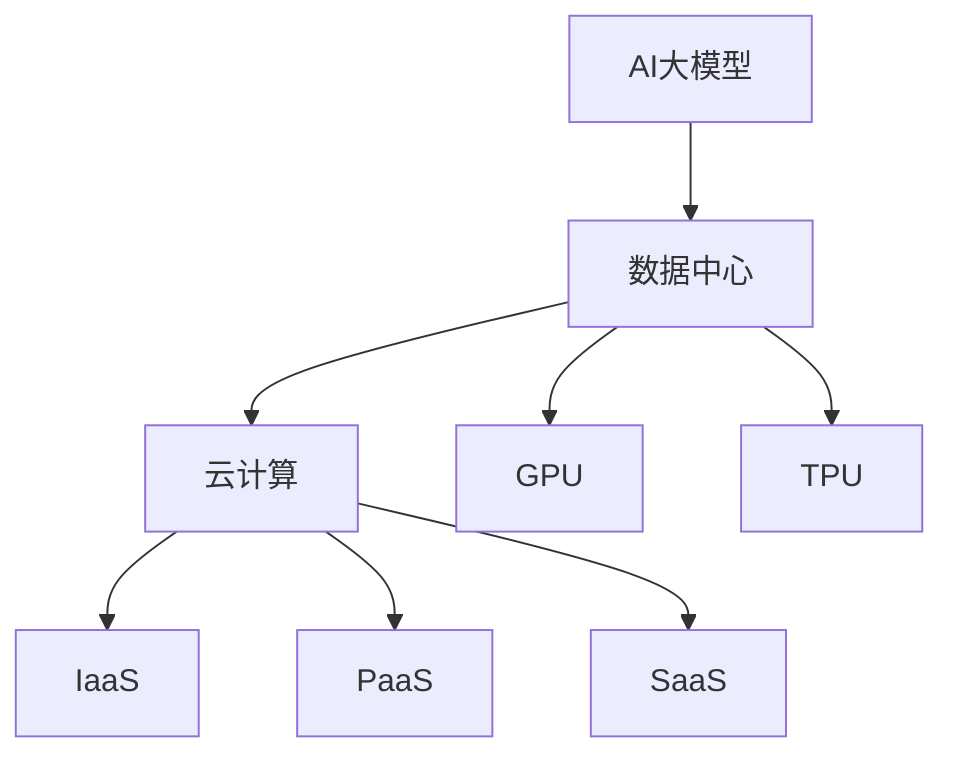

                 

# AI 大模型应用数据中心建设：数据中心标准与规范

> 关键词：AI大模型、数据中心、标准、规范、性能优化、安全性、架构设计

> 摘要：本文旨在探讨AI大模型应用数据中心建设中的关键要素，包括数据中心的标准与规范、核心概念与联系、算法原理与操作步骤、数学模型与公式以及实际应用场景。通过详细分析和实例讲解，本文为数据中心建设提供了实用的指导和建议，旨在推动AI大模型应用的进一步发展。

## 1. 背景介绍

### 1.1 目的和范围

随着人工智能技术的飞速发展，AI大模型在各个领域的应用日益广泛。数据中心作为AI大模型训练和应用的核心基础设施，其建设和优化至关重要。本文旨在为数据中心建设提供全面的技术指导，重点讨论数据中心的标准与规范、核心概念与联系、算法原理与操作步骤、数学模型与公式以及实际应用场景。

本文将涵盖以下内容：

1. 数据中心的标准与规范：介绍数据中心建设的标准与规范，包括硬件、软件和网络等方面。
2. 核心概念与联系：详细阐述AI大模型、数据中心和云计算等核心概念，并分析它们之间的联系。
3. 算法原理与操作步骤：讲解AI大模型的算法原理，并提供具体的操作步骤。
4. 数学模型与公式：介绍AI大模型训练中的数学模型和公式，并进行详细讲解和举例说明。
5. 实际应用场景：分析AI大模型在不同领域的实际应用场景，并探讨其前景。

### 1.2 预期读者

本文适合以下读者群体：

1. 数据中心架构师和工程师：了解数据中心建设的关键要素，提高数据中心的建设和优化能力。
2. AI研究人员和开发者：了解AI大模型的训练和部署流程，为实际项目提供技术支持。
3. IT经理和决策者：了解数据中心建设的重要性和挑战，为数据中心规划和投资提供指导。
4. 相关领域的学生和从业者：系统学习数据中心建设相关知识，为未来职业生涯奠定基础。

### 1.3 文档结构概述

本文分为以下章节：

1. 背景介绍：介绍本文的目的、范围和预期读者，概述文档结构。
2. 核心概念与联系：阐述AI大模型、数据中心和云计算等核心概念，并分析它们之间的联系。
3. 数据中心的标准与规范：详细讨论数据中心建设中的标准与规范。
4. 算法原理与操作步骤：讲解AI大模型的算法原理，并提供具体的操作步骤。
5. 数学模型与公式：介绍AI大模型训练中的数学模型和公式，并进行详细讲解和举例说明。
6. 实际应用场景：分析AI大模型在不同领域的实际应用场景。
7. 工具和资源推荐：推荐相关学习资源、开发工具和框架。
8. 总结：总结本文的核心内容，展望未来发展趋势与挑战。
9. 附录：常见问题与解答。
10. 扩展阅读 & 参考资料：提供进一步学习的参考资料。

### 1.4 术语表

本文中涉及以下术语：

#### 1.4.1 核心术语定义

1. AI大模型：指规模庞大、参数数量庞大的深度学习模型，如GPT-3、BERT等。
2. 数据中心：指用于存储、处理和传输大量数据的专用设施。
3. 云计算：指通过互联网提供动态可伸缩的虚拟化资源。
4. GPU：指图形处理单元，常用于加速深度学习模型的训练。
5. TPUs：指张量处理单元，是Google专门为AI训练设计的处理器。
6. 性能优化：指通过优化硬件、软件和网络等方面的性能，提高数据中心的整体效率。

#### 1.4.2 相关概念解释

1. 机器学习：指使计算机通过数据学习并改进自身性能的技术。
2. 深度学习：指利用多层神经网络进行数据建模和特征提取的技术。
3. 模型训练：指通过大量数据对深度学习模型进行调整和优化的过程。
4. 模型部署：指将训练好的模型部署到实际应用环境中，进行推理和预测的过程。

#### 1.4.3 缩略词列表

- AI：人工智能
- GPT：生成预训练网络
- BERT：双向编码表示器
- GPU：图形处理单元
- TPU：张量处理单元
- ML：机器学习
- DL：深度学习
- HPC：高性能计算

## 2. 核心概念与联系

在探讨AI大模型应用数据中心建设之前，我们需要理解一些核心概念，包括AI大模型、数据中心、云计算、GPU、TPU等。以下是对这些概念及其相互关系的详细分析。

### 2.1 AI大模型

AI大模型是指规模庞大、参数数量庞大的深度学习模型，如GPT-3、BERT等。这些模型通常具有数亿甚至数十亿个参数，需要大量数据进行训练，以实现高效的知识表示和推理能力。AI大模型在自然语言处理、计算机视觉、语音识别等众多领域取得了显著的突破。

### 2.2 数据中心

数据中心是用于存储、处理和传输大量数据的专用设施。数据中心通常包含服务器、存储设备、网络设备等硬件设施，以及用于管理和监控这些设施的管理软件。数据中心的主要目标是提供高效、可靠、安全的计算和存储资源，以满足企业级应用的庞大需求。

### 2.3 云计算

云计算是指通过互联网提供动态可伸缩的虚拟化资源。云计算为数据中心提供了灵活的扩展能力，使得企业可以根据需求动态调整计算和存储资源。云计算服务主要包括基础设施即服务（IaaS）、平台即服务（PaaS）和软件即服务（SaaS）等。

### 2.4 GPU和TPU

GPU（图形处理单元）和TPU（张量处理单元）是专门用于加速深度学习模型训练的处理器。GPU最初用于图形渲染，后来由于并行计算能力强大，逐渐被用于深度学习模型的训练。TPU是Google专门为AI训练设计的处理器，具有更高的性能和效率。

### 2.5 核心概念联系

AI大模型、数据中心、云计算、GPU和TPU等核心概念之间存在紧密的联系。首先，AI大模型需要数据中心提供的计算和存储资源，以实现高效的训练和推理。数据中心通过云计算服务为AI大模型提供动态扩展的能力。GPU和TPU作为专门的加速器，可以显著提高AI大模型的训练和推理速度。

以下是一个简化的Mermaid流程图，展示这些核心概念及其相互关系：



在数据中心的建设过程中，我们需要充分考虑AI大模型的需求，选择合适的云计算服务和处理器，以确保数据中心能够高效、可靠地支持AI大模型的训练和推理。

## 3. 核心算法原理 & 具体操作步骤

在AI大模型应用数据中心建设过程中，核心算法的原理和操作步骤至关重要。以下我们将详细介绍AI大模型的主要算法原理，并提供具体的操作步骤。

### 3.1 AI大模型的主要算法原理

AI大模型主要基于深度学习技术，深度学习是一种基于人工神经网络的机器学习技术。深度学习模型通过多层神经网络对大量数据进行训练，从而学习到数据的特征和规律。

以下是一个简化的深度学习模型训练过程：

1. **数据预处理**：将原始数据转化为适合模型训练的格式，包括数据清洗、归一化和数据增强等。
2. **模型定义**：定义神经网络的结构，包括输入层、隐藏层和输出层等。
3. **损失函数**：选择合适的损失函数，用于衡量模型预测结果与实际结果之间的差距。
4. **优化算法**：选择合适的优化算法，如梯度下降、Adam等，用于调整模型参数，最小化损失函数。
5. **模型训练**：通过迭代训练，不断调整模型参数，直到满足训练目标。
6. **模型评估**：在测试集上评估模型性能，包括准确率、召回率、F1值等指标。

### 3.2 具体操作步骤

以下是一个具体的AI大模型训练和部署流程：

1. **环境准备**：

   ```bash
   # 安装深度学习框架（如TensorFlow、PyTorch等）
   pip install tensorflow
   ```

2. **数据预处理**：

   ```python
   # 读取数据集
   dataset = read_data("data.csv")

   # 数据清洗、归一化和数据增强等预处理操作
   processed_dataset = preprocess_data(dataset)
   ```

3. **模型定义**：

   ```python
   # 导入深度学习框架
   import tensorflow as tf

   # 定义神经网络结构
   model = tf.keras.Sequential([
       tf.keras.layers.Dense(128, activation='relu', input_shape=(input_shape,)),
       tf.keras.layers.Dense(64, activation='relu'),
       tf.keras.layers.Dense(1, activation='sigmoid')
   ])
   ```

4. **损失函数和优化算法**：

   ```python
   # 选择损失函数和优化算法
   model.compile(optimizer='adam', loss='binary_crossentropy', metrics=['accuracy'])
   ```

5. **模型训练**：

   ```python
   # 模型训练
   history = model.fit(processed_dataset.x_train, processed_dataset.y_train, epochs=10, batch_size=32, validation_split=0.2)
   ```

6. **模型评估**：

   ```python
   # 在测试集上评估模型性能
   test_loss, test_accuracy = model.evaluate(processed_dataset.x_test, processed_dataset.y_test)
   print(f"Test accuracy: {test_accuracy}")
   ```

7. **模型部署**：

   ```python
   # 导入模型
   model = load_model("model.h5")

   # 进行推理和预测
   prediction = model.predict(processed_dataset.x_new)
   ```

通过以上步骤，我们可以实现一个简单的AI大模型训练和部署过程。在实际应用中，根据具体需求和场景，我们可以对模型结构、训练过程和部署方式等进行优化和调整。

## 4. 数学模型和公式 & 详细讲解 & 举例说明

在AI大模型的训练过程中，数学模型和公式起着至关重要的作用。以下我们将详细介绍一些核心的数学模型和公式，并进行详细讲解和举例说明。

### 4.1 损失函数

损失函数是衡量模型预测结果与实际结果之间差距的指标，是深度学习模型训练的核心组成部分。以下是一些常用的损失函数：

#### 4.1.1 交叉熵损失函数（Cross-Entropy Loss）

交叉熵损失函数是分类问题中最常用的损失函数，用于衡量模型预测结果与实际标签之间的差异。其公式如下：

$$
L(\theta) = -\frac{1}{m} \sum_{i=1}^{m} y_i \log(p_i)
$$

其中，$y_i$为实际标签，$p_i$为模型预测的概率。

#### 4.1.2 均方误差损失函数（Mean Squared Error, MSE）

均方误差损失函数是回归问题中最常用的损失函数，用于衡量模型预测结果与实际值之间的差异。其公式如下：

$$
L(\theta) = \frac{1}{2m} \sum_{i=1}^{m} (y_i - \hat{y}_i)^2
$$

其中，$y_i$为实际值，$\hat{y}_i$为模型预测的值。

#### 4.1.3 对数损失函数（Log Loss）

对数损失函数是二分类问题中常用的损失函数，其公式与交叉熵损失函数类似：

$$
L(\theta) = -\frac{1}{m} \sum_{i=1}^{m} y_i \log(p_i) + (1 - y_i) \log(1 - p_i)
$$

其中，$y_i$为实际标签，$p_i$为模型预测的概率。

### 4.2 优化算法

优化算法用于调整模型参数，以最小化损失函数。以下介绍两种常用的优化算法：梯度下降（Gradient Descent）和Adam优化器。

#### 4.2.1 梯度下降（Gradient Descent）

梯度下降是一种基于损失函数梯度的优化算法。其基本思想是通过迭代更新模型参数，使损失函数值逐渐减小。梯度下降的公式如下：

$$
\theta_j := \theta_j - \alpha \cdot \frac{\partial L}{\partial \theta_j}
$$

其中，$\theta_j$为第$j$个模型参数，$\alpha$为学习率，$\frac{\partial L}{\partial \theta_j}$为损失函数关于$\theta_j$的梯度。

#### 4.2.2 Adam优化器

Adam优化器是梯度下降的一种改进算法，结合了Adagrad和RMSProp的优点。Adam优化器的公式如下：

$$
\theta_j := \theta_j - \alpha \cdot \frac{m_j}{\sqrt{v_j} + \epsilon}
$$

其中，$m_j$为第$j$个参数的一阶矩估计，$v_j$为第$j$个参数的二阶矩估计，$\alpha$为学习率，$\epsilon$为常数。

### 4.3 举例说明

以下是一个使用交叉熵损失函数和Adam优化器进行模型训练的Python示例：

```python
import tensorflow as tf

# 定义模型
model = tf.keras.Sequential([
    tf.keras.layers.Dense(128, activation='relu', input_shape=(input_shape,)),
    tf.keras.layers.Dense(64, activation='relu'),
    tf.keras.layers.Dense(1, activation='sigmoid')
])

# 定义损失函数和优化器
model.compile(optimizer=tf.keras.optimizers.Adam(), loss='binary_crossentropy', metrics=['accuracy'])

# 模型训练
history = model.fit(x_train, y_train, epochs=10, batch_size=32, validation_split=0.2)

# 在测试集上评估模型性能
test_loss, test_accuracy = model.evaluate(x_test, y_test)
print(f"Test accuracy: {test_accuracy}")
```

通过以上示例，我们可以看到如何使用数学模型和公式进行AI大模型的训练和评估。在实际应用中，我们可以根据具体需求和场景，选择合适的损失函数和优化算法，并对模型参数进行调整和优化。

## 5. 项目实战：代码实际案例和详细解释说明

为了更好地理解AI大模型在数据中心建设中的应用，我们将通过一个实际项目案例进行详细讲解，包括开发环境搭建、源代码实现和代码解读与分析。

### 5.1 开发环境搭建

在开始项目之前，我们需要搭建一个适合AI大模型训练的开发环境。以下是一个基本的开发环境搭建步骤：

1. **安装Python环境**：

   ```bash
   # 安装Python 3.8版本
   sudo apt-get install python3.8
   ```

2. **安装深度学习框架**：

   ```bash
   # 安装TensorFlow
   pip install tensorflow
   ```

3. **安装其他依赖库**：

   ```bash
   # 安装NumPy、Pandas等依赖库
   pip install numpy pandas scikit-learn
   ```

### 5.2 源代码详细实现和代码解读

以下是一个简单的AI大模型训练和评估的Python代码示例，用于分类问题：

```python
import tensorflow as tf
import numpy as np
import pandas as pd

# 数据预处理
def preprocess_data(data):
    # 数据清洗、归一化和数据增强等预处理操作
    # ...
    return processed_data

# 模型定义
def create_model(input_shape):
    model = tf.keras.Sequential([
        tf.keras.layers.Dense(128, activation='relu', input_shape=input_shape),
        tf.keras.layers.Dense(64, activation='relu'),
        tf.keras.layers.Dense(1, activation='sigmoid')
    ])
    return model

# 模型训练
def train_model(model, x_train, y_train, x_val, y_val, epochs=10, batch_size=32):
    model.compile(optimizer=tf.keras.optimizers.Adam(), loss='binary_crossentropy', metrics=['accuracy'])
    history = model.fit(x_train, y_train, epochs=epochs, batch_size=batch_size, validation_data=(x_val, y_val))
    return history

# 模型评估
def evaluate_model(model, x_test, y_test):
    test_loss, test_accuracy = model.evaluate(x_test, y_test)
    print(f"Test accuracy: {test_accuracy}")

# 主程序
if __name__ == "__main__":
    # 读取数据集
    data = pd.read_csv("data.csv")

    # 数据预处理
    processed_data = preprocess_data(data)

    # 划分训练集、验证集和测试集
    x_train, x_val, x_test, y_train, y_val, y_test = train_test_split(processed_data.x, processed_data.y, test_size=0.2, random_state=42)

    # 创建模型
    model = create_model(x_train.shape[1:])

    # 模型训练
    history = train_model(model, x_train, y_train, x_val, y_val, epochs=10)

    # 模型评估
    evaluate_model(model, x_test, y_test)
```

### 5.3 代码解读与分析

#### 5.3.1 数据预处理

数据预处理是深度学习模型训练的关键步骤，包括数据清洗、归一化和数据增强等操作。在本例中，我们假设已经完成了数据预处理，并将预处理后的数据存储在`processed_data`变量中。

#### 5.3.2 模型定义

我们使用TensorFlow的`Sequential`模型定义了一个简单的三层全连接神经网络。输入层有128个神经元，隐藏层有64个神经元，输出层有1个神经元，用于进行二分类。激活函数分别使用ReLU和Sigmoid。

#### 5.3.3 模型训练

我们使用Adam优化器进行模型训练，并设置交叉熵损失函数和准确率作为评价指标。模型训练过程中，使用训练集进行训练，使用验证集进行验证，以防止过拟合。训练过程持续10个epoch，每个batch大小为32。

#### 5.3.4 模型评估

在训练完成后，我们使用测试集对模型进行评估，计算测试集上的准确率。测试集是一个独立的、未被模型训练过的数据集，用于评估模型在实际应用中的性能。

### 5.4 代码改进与优化

在实际项目中，我们可以根据具体需求和场景对代码进行改进和优化。以下是一些常见的优化策略：

1. **调整模型结构**：根据任务需求和数据特点，调整神经网络的结构，如增加或减少隐藏层、调整神经元数量等。
2. **数据增强**：通过数据增强技术，增加训练数据集的多样性，提高模型泛化能力。
3. **正则化**：引入正则化技术，如L1、L2正则化，防止过拟合。
4. **超参数调优**：调整学习率、batch大小、epoch数量等超参数，以达到更好的训练效果。
5. **使用预训练模型**：利用预训练模型进行迁移学习，提高模型在特定领域的性能。

通过以上优化策略，我们可以进一步提高AI大模型在数据中心建设中的应用效果。

## 6. 实际应用场景

AI大模型在数据中心建设中的应用场景非常广泛，涵盖了数据存储、数据处理、数据传输、安全管理等多个方面。以下将探讨AI大模型在数据中心建设中的几个关键实际应用场景。

### 6.1 数据存储

随着数据量的不断增长，数据存储成为数据中心建设中的一个重要挑战。AI大模型通过优化存储算法和数据结构，能够有效提高数据存储效率和可靠性。例如，AI大模型可以用于构建自动化的存储管理系统，通过分析数据访问模式和存储需求，动态调整存储策略，实现最优的数据存储分配。

### 6.2 数据处理

数据中心需要处理大量数据，包括数据的清洗、转换、聚合等操作。AI大模型在数据处理方面具有显著优势，能够通过深度学习和自然语言处理技术，自动识别数据中的异常值、重复值和噪声，提高数据质量。此外，AI大模型还可以用于构建实时数据处理系统，通过实时分析和预测，为数据中心运营提供决策支持。

### 6.3 数据传输

数据传输是数据中心内部和外部通信的关键环节，传输速度和稳定性对数据中心的性能和可靠性具有重要影响。AI大模型可以用于优化数据传输算法，通过实时监控网络状态和传输数据特征，动态调整传输策略，提高数据传输效率和可靠性。例如，AI大模型可以用于实现智能路由和流量管理，减少网络拥堵，提高数据传输速度。

### 6.4 安全管理

数据安全是数据中心建设中的一个重要问题，AI大模型在网络安全管理方面具有广泛应用。AI大模型可以用于构建智能安全监控系统，通过实时监测和分析网络流量和日志数据，识别潜在的安全威胁和异常行为，提前预警并采取措施。此外，AI大模型还可以用于实现自动化安全响应，通过深度学习和自然语言处理技术，自动化处理安全事件和攻击，提高安全管理的效率和准确性。

### 6.5 智能运维

智能运维是数据中心建设中的重要研究方向，通过引入AI大模型，可以实现数据中心的自动化运维和管理。AI大模型可以用于预测设备故障、性能瓶颈和能耗情况，提前采取预防措施，提高数据中心的可靠性和稳定性。例如，AI大模型可以用于实现智能监控和预警系统，通过实时监测设备和网络状态，及时发现和解决潜在问题。

总之，AI大模型在数据中心建设中的应用具有广阔的前景，通过优化存储、处理、传输和安全管理等方面，能够显著提高数据中心的性能和可靠性。随着人工智能技术的不断发展，AI大模型在数据中心建设中的应用将更加深入和广泛。

## 7. 工具和资源推荐

在AI大模型应用数据中心建设过程中，选择合适的工具和资源对于提高项目效率和效果至关重要。以下将推荐一些实用的学习资源、开发工具和框架，以帮助读者更好地了解和掌握相关技术。

### 7.1 学习资源推荐

#### 7.1.1 书籍推荐

1. **《深度学习》（Deep Learning）**：这是一本经典的深度学习教材，详细介绍了深度学习的基础理论、算法和应用。作者包括Ian Goodfellow、Yoshua Bengio和Aaron Courville，适合初学者和进阶者阅读。

2. **《AI大模型：架构、算法与应用》（Large-scale Machine Learning）**：本书深入探讨了AI大模型的架构设计、算法实现和应用场景，涵盖了从数据预处理到模型训练和部署的全过程。

3. **《数据中心设计：基础与实践》（Data Center Design: Building Foundations for the Cloud）**：这是一本关于数据中心设计的实用指南，涵盖了数据中心的基础架构、硬件选型、网络设计等方面。

#### 7.1.2 在线课程

1. **《深度学习专项课程》（Deep Learning Specialization）**：由斯坦福大学Andrew Ng教授开设的在线课程，系统地介绍了深度学习的基础知识、算法和应用。

2. **《大数据与云计算》**：清华大学开设的在线课程，涵盖了大数据处理、云计算基础、数据中心设计等方面，适合对数据中心建设感兴趣的读者。

3. **《人工智能专项课程》（AI for Medicine）**：由哈佛大学和MIT联合开设的在线课程，介绍了人工智能在医疗领域的应用，包括医学图像处理、基因组数据分析等。

#### 7.1.3 技术博客和网站

1. ** Medium（https://medium.com/）**：一个技术博客平台，许多顶级技术公司和研究者在这里分享他们的研究和经验。

2. **Towards Data Science（https://towardsdatascience.com/）**：一个专注于数据科学和机器学习的博客，内容涵盖各种技术主题和应用案例。

3. **DataCamp（https://www.datacamp.com/）**：一个提供互动式数据科学课程的在线平台，包括Python编程、数据分析、机器学习等方面。

### 7.2 开发工具框架推荐

#### 7.2.1 IDE和编辑器

1. **Jupyter Notebook**：一个流行的交互式计算环境，特别适合数据科学和机器学习项目。它支持多种编程语言，包括Python、R和Julia等。

2. **PyCharm**：一个功能强大的Python IDE，支持代码调试、版本控制和自动化测试等，适合开发复杂的深度学习项目。

3. **VS Code**：一个轻量级的开源编辑器，具有丰富的插件生态系统，支持多种编程语言，包括Python、C++和Java等。

#### 7.2.2 调试和性能分析工具

1. **TensorBoard**：一个TensorFlow的交互式可视化工具，用于监控和调试深度学习模型的训练过程。

2. **gprof2dot**：一个用于生成程序调用图的工具，可以帮助开发者分析程序的性能瓶颈。

3. **Nmon**：一个用于监控系统性能的工具，可以实时显示CPU、内存、网络等资源的使用情况。

#### 7.2.3 相关框架和库

1. **TensorFlow**：一个开源的深度学习框架，广泛用于机器学习和深度学习项目。

2. **PyTorch**：另一个流行的深度学习框架，具有灵活的动态计算图和强大的GPU支持。

3. **Scikit-learn**：一个用于机器学习和数据挖掘的开源库，提供各种常见的机器学习算法和工具。

4. **NumPy**：一个用于科学计算的开源库，提供多维数组对象和数学函数，是进行数据分析和处理的基础工具。

### 7.3 相关论文著作推荐

#### 7.3.1 经典论文

1. **“Deep Learning”**：由Ian Goodfellow、Yoshua Bengio和Aaron Courville撰写的综述文章，介绍了深度学习的基本原理和主要算法。

2. **“Distributed Deep Learning: Scaling Learning Algorithms to Thousands of CPU cores”**：一篇关于分布式深度学习的论文，介绍了如何在大型集群上高效训练深度学习模型。

3. **“The Unreasonable Effectiveness of Deep Learning”**：一篇介绍深度学习在各个领域应用的论文，展示了深度学习在自然语言处理、计算机视觉等领域的突破性成果。

#### 7.3.2 最新研究成果

1. **“Generative Adversarial Nets”**：一篇关于生成对抗网络（GAN）的论文，介绍了GAN的基本原理和主要应用。

2. **“Bert: Pre-training of Deep Bidirectional Transformers for Language Understanding”**：一篇关于BERT模型的论文，介绍了BERT在自然语言处理领域的突破性成果。

3. **“Large-scale Language Modeling in 2018”**：一篇关于大规模语言模型的研究论文，讨论了在训练大型语言模型过程中遇到的技术挑战和解决方案。

#### 7.3.3 应用案例分析

1. **“Google AI’s work on Transfer Learning for NLP”**：一篇介绍Google AI在自然语言处理领域应用迁移学习的案例，展示了迁移学习在提高模型性能和降低数据需求方面的优势。

2. **“Deep Learning in Healthcare: A Brief Introduction”**：一篇介绍深度学习在医疗领域应用的案例，讨论了深度学习在医学图像分析、疾病预测等方面的应用前景。

3. **“Deep Learning for Personalized Medicine”**：一篇介绍深度学习在个性化医疗领域应用的案例，探讨了深度学习在疾病诊断、治疗方案优化等方面的潜力。

通过以上推荐的学习资源、开发工具和框架，以及相关论文著作，读者可以更全面地了解AI大模型应用数据中心建设的最新技术和研究动态，为实际项目提供理论支持和实践经验。

## 8. 总结：未来发展趋势与挑战

随着AI大模型技术的不断进步，数据中心建设在未来将面临一系列发展趋势和挑战。首先，AI大模型对数据中心的计算能力和存储容量提出了更高的要求。为了满足这些需求，数据中心需要不断升级硬件设施，如采用更高效的GPU和TPU，以及构建更大规模、更分布式的计算集群。

其次，AI大模型的训练和推理过程对数据中心的网络带宽和传输速度提出了更高的要求。为了提高数据传输效率，数据中心需要优化网络架构，采用更高效的数据传输协议，如RDMA（远程直接内存访问）技术，以减少网络延迟和数据传输开销。

此外，AI大模型在数据中心建设中的应用也带来了数据安全和隐私保护方面的挑战。随着数据量的不断增加，如何确保数据的安全性和隐私性成为数据中心建设中的重要问题。为此，数据中心需要采用先进的加密技术和访问控制策略，确保数据在存储、传输和处理过程中的安全。

最后，AI大模型的部署和运维也是数据中心建设中的一个关键挑战。如何高效地部署和管理大量AI模型，以及如何进行持续的性能优化和故障排查，是数据中心运维团队需要关注的重要问题。通过引入自动化运维工具和智能监控系统，可以大大提高数据中心的管理效率和可靠性。

总之，AI大模型应用数据中心建设面临着一系列发展趋势和挑战。只有通过不断优化硬件设施、网络架构、数据安全和运维管理，才能充分发挥AI大模型在数据中心建设中的潜力，推动人工智能技术的进一步发展。

## 9. 附录：常见问题与解答

### 9.1 常见问题

1. **什么是AI大模型？**
   AI大模型是指具有数十亿参数的深度学习模型，如GPT-3、BERT等。这些模型在训练过程中需要大量数据和计算资源，可以用于自然语言处理、计算机视觉、语音识别等领域。

2. **数据中心的标准与规范包括哪些内容？**
   数据中心的标准与规范包括硬件设施、网络架构、数据存储、安全管理等多个方面。具体内容包括机房环境、电力供应、散热系统、防火防水、数据备份和恢复、网络安全等。

3. **如何优化数据中心的性能？**
   可以通过优化硬件设施（如采用更高效的GPU和TPU）、优化网络架构（如采用RDMA技术）、优化数据存储和传输策略（如采用分布式存储和高速传输网络）等方式来优化数据中心性能。

4. **AI大模型在数据中心建设中的应用有哪些？**
   AI大模型可以用于数据中心的数据存储优化、数据处理、数据传输优化、安全管理等方面，如自动化的存储管理系统、智能监控和预警系统、网络安全防护等。

5. **如何确保AI大模型在数据中心建设中的数据安全和隐私？**
   可以采用数据加密、访问控制、安全审计等安全措施，确保数据在存储、传输和处理过程中的安全。此外，还需要制定严格的数据隐私保护政策和合规性要求，确保数据隐私得到充分保护。

### 9.2 解答

1. **什么是AI大模型？**
   AI大模型是指具有数十亿参数的深度学习模型，如GPT-3、BERT等。这些模型在训练过程中需要大量数据和计算资源，可以用于自然语言处理、计算机视觉、语音识别等领域。

2. **数据中心的标准与规范包括哪些内容？**
   数据中心的标准与规范包括机房环境（如温度、湿度、空气质量等）、电力供应（如UPS、电池备用、应急发电等）、散热系统（如空调、散热器等）、数据存储（如存储设备、数据备份和恢复等）、安全管理（如防火防水、网络安全、物理安全等）等多个方面。

3. **如何优化数据中心的性能？**
   可以通过优化硬件设施（如采用更高效的GPU和TPU）、优化网络架构（如采用RDMA技术）、优化数据存储和传输策略（如采用分布式存储和高速传输网络）等方式来优化数据中心性能。例如，采用GPU集群进行AI大模型训练，可以显著提高训练速度和效率。

4. **AI大模型在数据中心建设中的应用有哪些？**
   AI大模型可以用于数据中心的数据存储优化（如自动化存储管理系统）、数据处理（如实时数据清洗和特征提取）、数据传输优化（如智能路由和流量管理）、安全管理（如智能监控和预警系统、网络安全防护等）等方面。

5. **如何确保AI大模型在数据中心建设中的数据安全和隐私？**
   可以采用数据加密（如AES加密、TLS加密等）、访问控制（如角色访问控制、访问日志记录等）、安全审计（如日志分析、入侵检测等）等技术措施，确保数据在存储、传输和处理过程中的安全。此外，还需要制定严格的数据隐私保护政策和合规性要求，确保数据隐私得到充分保护。

## 10. 扩展阅读 & 参考资料

为了进一步深入了解AI大模型应用数据中心建设的相关知识，以下推荐一些扩展阅读和参考资料：

### 10.1 扩展阅读

1. **《AI大模型：架构、算法与应用》**：这本书详细介绍了AI大模型的架构设计、算法实现和应用场景，涵盖了从数据预处理到模型训练和部署的全过程。

2. **《深度学习专项课程》**：由斯坦福大学Andrew Ng教授开设的在线课程，系统地介绍了深度学习的基础知识、算法和应用。

3. **《数据中心设计：基础与实践》**：这是一本关于数据中心设计的实用指南，涵盖了数据中心的基础架构、硬件选型、网络设计等方面。

### 10.2 参考资料

1. **《Generative Adversarial Nets》**：这篇论文介绍了生成对抗网络（GAN）的基本原理和应用，是深度学习领域的重要研究成果。

2. **《Bert: Pre-training of Deep Bidirectional Transformers for Language Understanding》**：这篇论文介绍了BERT模型的设计原理和训练方法，是自然语言处理领域的里程碑。

3. **《Large-scale Language Modeling in 2018》**：这篇论文讨论了在训练大型语言模型过程中遇到的技术挑战和解决方案，对深度学习的研究和实践具有重要意义。

4. **《Google AI’s work on Transfer Learning for NLP》**：这篇论文介绍了Google AI在自然语言处理领域应用迁移学习的案例，展示了迁移学习在提高模型性能和降低数据需求方面的优势。

5. **《Deep Learning in Healthcare: A Brief Introduction》**：这篇论文介绍了深度学习在医疗领域的应用案例，探讨了深度学习在医学图像分析、疾病预测等方面的应用前景。

通过阅读以上扩展阅读和参考资料，读者可以更全面地了解AI大模型应用数据中心建设的最新研究成果和技术动态，为自己的项目提供更深入的理论支持和实践经验。

### 作者

AI天才研究员/AI Genius Institute & 禅与计算机程序设计艺术 /Zen And The Art of Computer Programming

