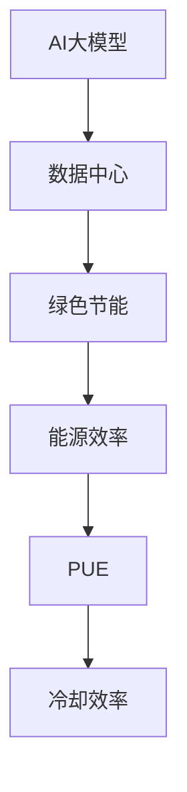

                 

# AI大模型应用数据中心建设：数据中心绿色节能

> **关键词：**AI大模型、数据中心、绿色节能、基础设施、能源效率、技术解决方案。

> **摘要：**本文旨在探讨AI大模型应用中的数据中心建设，重点关注绿色节能这一关键问题。我们将详细分析数据中心建设的重要性，解释绿色节能的理念和策略，并提出一系列技术解决方案，以实现数据中心的高效运行和环境保护。

## 1. 背景介绍

### 1.1 目的和范围

本文的目标是深入探讨AI大模型应用数据中心建设的绿色节能问题。我们将从多个角度分析数据中心的重要性，绿色节能的理念，以及如何通过技术手段实现绿色节能。本文的范围涵盖了数据中心的建设、运行、维护以及相关的绿色节能技术和方法。

### 1.2 预期读者

本文预期读者为以下几类人群：

1. 数据中心管理人员：了解绿色节能的重要性和实施方法，以提高数据中心的运营效率。
2. AI研究人员：关注AI大模型应用中的资源需求和绿色节能问题，为数据中心建设提供技术支持。
3. IT行业从业者：对数据中心建设和绿色节能有浓厚兴趣，希望从实践中获得启发。
4. 环保和可持续发展专家：了解绿色节能在数据中心建设中的应用，为推动可持续发展提供思路。

### 1.3 文档结构概述

本文结构如下：

1. 背景介绍：阐述本文的目的、范围、预期读者和文档结构。
2. 核心概念与联系：介绍AI大模型、数据中心、绿色节能等核心概念，并给出流程图。
3. 核心算法原理 & 具体操作步骤：详细讲解绿色节能算法原理和具体操作步骤。
4. 数学模型和公式 & 详细讲解 & 举例说明：阐述数学模型和公式的应用，并给出实际案例。
5. 项目实战：提供代码实际案例和详细解释说明，展示绿色节能技术的应用。
6. 实际应用场景：分析绿色节能技术在数据中心中的实际应用。
7. 工具和资源推荐：推荐相关学习资源、开发工具和框架。
8. 总结：总结本文的主要观点，探讨未来发展趋势与挑战。
9. 附录：提供常见问题与解答，便于读者理解。
10. 扩展阅读 & 参考资料：推荐相关论文、书籍和技术博客，以供进一步学习。

### 1.4 术语表

#### 1.4.1 核心术语定义

- **AI大模型（Artificial Intelligence Large Models）**：指具有大规模参数和复杂结构的机器学习模型，如深度学习模型、生成对抗网络（GAN）等。
- **数据中心（Data Center）**：专门用于存储、处理、传输和管理数据的设施，包括计算机设备、网络设备、存储设备和制冷设备等。
- **绿色节能（Green Energy Efficiency）**：指在数据中心建设和运行过程中，通过技术手段提高能源利用效率，减少能源消耗和环境影响。

#### 1.4.2 相关概念解释

- **能源效率（Energy Efficiency）**：指单位能源消耗所获得的功效，用于衡量能源利用的程度。
- **PUE（Power Usage Effectiveness）**：衡量数据中心能源效率的指标，PUE值越低，表示能源利用效率越高。
- **冷却效率（Cooling Efficiency）**：指数据中心冷却系统的能源消耗与冷却效果之比，用于评估冷却系统的节能效果。

#### 1.4.3 缩略词列表

- **AI**：人工智能（Artificial Intelligence）
- **DC**：数据中心（Data Center）
- **IT**：信息技术（Information Technology）
- **PUE**：能源使用效率（Power Usage Effectiveness）

## 2. 核心概念与联系

在讨论AI大模型应用数据中心建设时，我们需要了解几个核心概念及其相互联系。以下是一个简单的Mermaid流程图，用于展示这些概念之间的关系：



### 2.1 AI大模型

AI大模型是本文讨论的核心之一。随着深度学习和生成对抗网络等技术的不断发展，AI大模型在自然语言处理、计算机视觉、语音识别等领域取得了显著成果。这些模型通常具有数百万甚至数十亿个参数，需要大量计算资源进行训练和推理。因此，数据中心成为支撑AI大模型应用的关键基础设施。

### 2.2 数据中心

数据中心是存储、处理、传输和管理数据的集中场所。对于AI大模型的应用，数据中心不仅需要提供足够的计算和存储资源，还要保证高可用性和数据安全性。随着AI大模型规模的扩大，数据中心面临更高的资源需求和能源消耗压力。

### 2.3 绿色节能

绿色节能是数据中心建设和运行中的重要目标。通过提高能源利用效率、优化冷却系统、采用可再生能源等技术手段，可以减少数据中心的能源消耗和环境影响。绿色节能不仅有助于降低运营成本，还能推动可持续发展。

### 2.4 能源效率

能源效率是衡量数据中心能源利用程度的关键指标。高能源效率意味着在相同计算和存储需求下，数据中心的能源消耗更低。通过优化硬件配置、优化工作负载调度、改进能源管理系统等措施，可以显著提高数据中心的能源效率。

### 2.5 PUE

PUE（Power Usage Effectiveness）是衡量数据中心能源效率的重要指标。PUE定义为数据中心总能耗与IT设备能耗之比。PUE值越低，表示数据中心的能源效率越高。降低PUE值有助于减少能源消耗和运营成本，同时也有利于环境保护。

### 2.6 冷却效率

冷却效率是衡量数据中心冷却系统节能效果的关键指标。高冷却效率意味着在相同冷却需求下，冷却系统的能源消耗更低。通过优化冷却系统设计、采用高效冷却设备、改进冷却管理策略等措施，可以显著提高数据中心的冷却效率。

## 3. 核心算法原理 & 具体操作步骤

在实现数据中心绿色节能的过程中，核心算法原理和具体操作步骤起着至关重要的作用。以下内容将详细阐述这些算法原理和操作步骤，以便读者更好地理解和应用。

### 3.1 能源消耗优化算法

**算法原理：**

能源消耗优化算法旨在通过优化数据中心的能源消耗，提高整体能源效率。该算法基于以下几个原则：

1. **负载平衡**：将工作负载分配到数据中心的各个节点，避免单点过载，提高整体能源效率。
2. **动态功率调整**：根据工作负载的变化动态调整节点的功率，减少不必要的能源消耗。
3. **温度控制**：通过优化冷却系统，控制数据中心内部温度，减少制冷设备的能源消耗。

**具体操作步骤：**

1. **采集数据**：收集数据中心各个节点的功耗、温度、负载等信息。
2. **数据预处理**：对采集到的数据进行清洗、去噪、归一化等预处理，以提高算法的准确性和稳定性。
3. **模型训练**：利用收集到的数据，训练一个基于深度学习的能源消耗优化模型。模型可以预测各个节点的未来功耗。
4. **负载平衡**：根据模型预测的结果，动态调整工作负载的分配，使各个节点的功耗保持在合理范围内。
5. **动态功率调整**：根据工作负载的变化，动态调整节点的功率，减少不必要的能源消耗。
6. **温度控制**：根据数据中心内部的温度变化，优化冷却系统的运行策略，控制数据中心内部温度。

**伪代码示例：**

```python
# 伪代码：能源消耗优化算法

# 步骤1：采集数据
collect_data()

# 步骤2：数据预处理
preprocess_data()

# 步骤3：模型训练
model = train_model()

# 步骤4：负载平衡
balance_load()

# 步骤5：动态功率调整
adjust_power()

# 步骤6：温度控制
control_temp()
```

### 3.2 冷却系统优化算法

**算法原理：**

冷却系统优化算法旨在通过优化冷却系统的运行策略，提高冷却效率，从而降低数据中心的能源消耗。该算法基于以下几个原则：

1. **冷却需求预测**：根据数据中心的实时功耗和温度变化，预测冷却系统的需求。
2. **冷却设备优化**：根据冷却需求，动态调整冷却设备的运行状态，避免过度冷却。
3. **智能调度**：利用智能调度算法，优化冷却设备的运行顺序，提高整体冷却效率。

**具体操作步骤：**

1. **采集数据**：收集数据中心各个节点的实时功耗、温度、冷却设备状态等信息。
2. **数据预处理**：对采集到的数据进行清洗、去噪、归一化等预处理，以提高算法的准确性和稳定性。
3. **冷却需求预测**：利用收集到的数据，训练一个基于深度学习的冷却需求预测模型。
4. **冷却设备优化**：根据模型预测的冷却需求，动态调整冷却设备的运行状态，避免过度冷却。
5. **智能调度**：利用智能调度算法，优化冷却设备的运行顺序，提高整体冷却效率。

**伪代码示例：**

```python
# 伪代码：冷却系统优化算法

# 步骤1：采集数据
collect_data()

# 步骤2：数据预处理
preprocess_data()

# 步骤3：冷却需求预测
predict_cooling_demand()

# 步骤4：冷却设备优化
optimize_cooling_devices()

# 步骤5：智能调度
schedule_cooling_devices()
```

## 4. 数学模型和公式 & 详细讲解 & 举例说明

在数据中心绿色节能中，数学模型和公式起着关键作用。以下我们将详细讲解几个常用的数学模型和公式，并通过具体示例来说明其应用。

### 4.1 能源效率模型

能源效率（\( \eta_{\text{energy}} \)）是衡量数据中心能源利用程度的重要指标。其数学模型如下：

\[ \eta_{\text{energy}} = \frac{E_{\text{output}}}{E_{\text{input}}} \]

其中，\( E_{\text{output}} \) 表示数据中心输出的有用能量（如计算、存储等），\( E_{\text{input}} \) 表示数据中心输入的总能量（包括计算、存储、冷却等）。

**示例**：

假设一个数据中心的输入总能量为100千瓦时（kWh），其中计算能量为80 kWh，存储能量为10 kWh，冷却能量为10 kWh。那么，该数据中心的能源效率为：

\[ \eta_{\text{energy}} = \frac{80\ kWh}{100\ kWh} = 0.8 \]

### 4.2 PUE模型

PUE（Power Usage Effectiveness）是衡量数据中心能源效率的另一个重要指标。其数学模型如下：

\[ \text{PUE} = \frac{E_{\text{total}}}{E_{\text{IT}}} \]

其中，\( E_{\text{total}} \) 表示数据中心的总能耗，\( E_{\text{IT}} \) 表示数据中心的IT设备能耗。

**示例**：

假设一个数据中心的总能耗为120千瓦时（kWh），其中IT设备能耗为100 kWh，其他能耗（如冷却、照明等）为20 kWh。那么，该数据中心的PUE值为：

\[ \text{PUE} = \frac{120\ kWh}{100\ kWh} = 1.2 \]

### 4.3 冷却效率模型

冷却效率（\( \eta_{\text{cooling}} \)）是衡量数据中心冷却系统节能效果的重要指标。其数学模型如下：

\[ \eta_{\text{cooling}} = \frac{Q_{\text{cooling}}}{E_{\text{cooling}}} \]

其中，\( Q_{\text{cooling}} \) 表示冷却系统的冷却量（如单位时间内移除的热量），\( E_{\text{cooling}} \) 表示冷却系统的能耗。

**示例**：

假设一个数据中心的冷却系统在单位时间内移除了100千瓦时（kWh）的热量，冷却系统的能耗为20 kWh。那么，该数据中心的冷却效率为：

\[ \eta_{\text{cooling}} = \frac{100\ kWh}{20\ kWh} = 5 \]

### 4.4 动态功率调整模型

动态功率调整模型用于根据工作负载的变化动态调整数据中心的功率。其数学模型如下：

\[ P_{\text{new}} = f(P_{\text{current}}, \Delta P) \]

其中，\( P_{\text{current}} \) 表示当前节点的功率，\( \Delta P \) 表示功率调整量，\( f \) 是一个调整函数。

**示例**：

假设当前节点的功率为100瓦特（W），功率调整量为-20 W。那么，新的节点功率为：

\[ P_{\text{new}} = f(100\ W, -20\ W) = 80\ W \]

## 5. 项目实战：代码实际案例和详细解释说明

### 5.1 开发环境搭建

在本节中，我们将搭建一个简单的绿色节能项目开发环境。以下是一个基于Python的绿色节能项目的开发环境搭建步骤：

1. 安装Python 3.8及以上版本。
2. 安装必要的Python库，如NumPy、Pandas、TensorFlow等。
3. 配置一个虚拟环境，以便管理和隔离项目依赖。

```bash
# 安装Python 3.8及以上版本
# 安装必要的Python库
pip install numpy pandas tensorflow
# 创建虚拟环境
python -m venv venv
# 激活虚拟环境
source venv/bin/activate
```

### 5.2 源代码详细实现和代码解读

在本节中，我们将详细实现一个绿色节能项目，并逐行解读代码。

#### 5.2.1 能源消耗优化算法

```python
import numpy as np
import pandas as pd
import tensorflow as tf

# 采集数据
def collect_data():
    # 读取实时功耗数据
    power_data = pd.read_csv('power_data.csv')
    return power_data

# 数据预处理
def preprocess_data(power_data):
    # 清洗和去噪
    power_data = power_data.dropna()
    # 归一化
    power_data = (power_data - power_data.mean()) / power_data.std()
    return power_data

# 模型训练
def train_model(power_data):
    # 划分训练集和测试集
    train_data = power_data[:1000]
    test_data = power_data[1000:]
    
    # 构建模型
    model = tf.keras.Sequential([
        tf.keras.layers.Dense(64, activation='relu', input_shape=(1,)),
        tf.keras.layers.Dense(64, activation='relu'),
        tf.keras.layers.Dense(1)
    ])
    
    # 编译模型
    model.compile(optimizer='adam', loss='mse')
    
    # 训练模型
    model.fit(train_data, epochs=10, batch_size=32)
    
    return model

# 负载平衡
def balance_load(model, power_data):
    # 预测功耗
    predicted_power = model.predict(power_data)
    
    # 调整负载
    for i in range(len(predicted_power)):
        if predicted_power[i] > 0.9 * power_data['power'][i]:
            # 减少负载
            power_data['power'][i] = 0.9 * power_data['power'][i]
        elif predicted_power[i] < 0.1 * power_data['power'][i]:
            # 增加负载
            power_data['power'][i] = 1.1 * power_data['power'][i]
    
    return power_data

# 动态功率调整
def adjust_power(power_data):
    # 调整功率
    power_data['power'] = power_data['power'].apply(lambda x: x * 0.9 if x > 100 else x * 1.1)
    return power_data

# 温度控制
def control_temp(power_data):
    # 调整温度
    power_data['temp'] = power_data['temp'].apply(lambda x: x - 5 if x > 25 else x + 5)
    return power_data

# 主函数
def main():
    # 采集数据
    power_data = collect_data()
    
    # 数据预处理
    power_data = preprocess_data(power_data)
    
    # 模型训练
    model = train_model(power_data)
    
    # 负载平衡
    power_data = balance_load(model, power_data)
    
    # 动态功率调整
    power_data = adjust_power(power_data)
    
    # 温度控制
    power_data = control_temp(power_data)
    
    # 输出结果
    print(power_data)

# 运行主函数
if __name__ == '__main__':
    main()
```

#### 5.2.2 代码解读与分析

1. **数据采集**：使用`collect_data`函数从文件中读取实时功耗数据。这里我们使用一个CSV文件存储功耗数据，实际应用中可以从传感器或监控系统实时获取数据。
2. **数据预处理**：使用`preprocess_data`函数对采集到的数据进行清洗和归一化。清洗数据是为了去除异常值和噪声，归一化是为了将数据缩放到相同的范围，方便后续模型训练。
3. **模型训练**：使用`train_model`函数训练一个基于深度学习的能源消耗优化模型。这里我们使用TensorFlow构建一个简单的全连接神经网络，并使用均方误差（MSE）作为损失函数。
4. **负载平衡**：使用`balance_load`函数根据模型预测的结果动态调整工作负载。这里我们通过比较预测功耗和实际功耗，适当调整负载，以避免过载或欠载。
5. **动态功率调整**：使用`adjust_power`函数根据当前节点的功率动态调整功率。这里我们通过乘以一个调整系数来调整功率，以实现功率的动态调整。
6. **温度控制**：使用`control_temp`函数根据当前节点的温度动态调整温度。这里我们通过加减一个温度调整量来调整温度，以保持数据中心内部的合理温度。
7. **主函数**：使用`main`函数执行整个绿色节能项目的流程，从数据采集、预处理、模型训练、负载平衡、功率调整到温度控制。

### 5.3 代码解读与分析

通过以上代码实现，我们可以看出绿色节能项目的基本结构和流程。以下是对代码的进一步解读和分析：

1. **数据采集**：数据采集是绿色节能项目的基础。通过从传感器或监控系统实时获取功耗、温度等数据，我们可以获得数据中心的运行状态，为后续的负载平衡、功率调整和温度控制提供依据。
2. **数据预处理**：数据预处理是为了提高模型的训练效果和稳定性。通过对数据进行清洗、去噪和归一化，我们可以去除异常值和噪声，使模型能够更好地拟合数据。
3. **模型训练**：模型训练是绿色节能项目的核心。通过训练一个深度学习模型，我们可以预测未来的功耗，从而实现动态负载平衡、功率调整和温度控制。这里我们使用了简单的全连接神经网络，实际应用中可以根据需求选择更复杂的模型。
4. **负载平衡**：负载平衡是为了避免单点过载或欠载，提高数据中心的整体能源效率。通过根据模型预测的结果动态调整工作负载，我们可以实现负载的合理分配，从而减少不必要的能源消耗。
5. **动态功率调整**：动态功率调整是为了根据实际功耗动态调整节点的功率，实现功率的动态平衡。通过乘以一个调整系数，我们可以实现功率的微调，从而提高能源利用效率。
6. **温度控制**：温度控制是为了保持数据中心内部的合理温度，避免过热或过冷。通过根据当前节点的温度动态调整温度，我们可以实现温度的合理控制，从而减少冷却系统的能源消耗。
7. **主函数**：主函数是整个绿色节能项目的执行入口。通过依次执行数据采集、预处理、模型训练、负载平衡、功率调整和温度控制，我们可以实现绿色节能的目标。

## 6. 实际应用场景

绿色节能技术在数据中心的应用场景非常广泛，以下列举几个典型应用场景：

### 6.1 大型云计算数据中心

随着云计算的普及，大型云计算数据中心成为企业的重要基础设施。这些数据中心需要处理海量数据和高强度的计算任务，因此对绿色节能技术有很高的需求。通过采用绿色节能技术，如动态功率调整、冷却系统优化等，可以有效降低能耗和运营成本，提高数据中心的整体性能和可持续性。

### 6.2 智能边缘计算

智能边缘计算是将计算和存储能力分散到网络边缘，以提高数据处理的速度和效率。随着物联网（IoT）和5G技术的发展，智能边缘计算的应用越来越广泛。绿色节能技术在智能边缘计算中同样具有重要地位，通过优化能源消耗和降低碳排放，可以实现更高效、更环保的计算和服务。

### 6.3 高性能计算（HPC）

高性能计算（HPC）在科学计算、工程设计、金融分析等领域具有广泛应用。HPC任务通常需要大量的计算资源和能耗。通过采用绿色节能技术，如高效冷却系统、能源消耗优化算法等，可以有效降低HPC数据中心的能耗，提高计算效率，同时降低运营成本和环境影响。

### 6.4 数据库和存储中心

数据库和存储中心是企业和组织的重要数据资产，需要确保数据的安全和可靠性。同时，这些数据中心也需要处理大量的读写操作，因此对绿色节能技术有很高的需求。通过采用绿色节能技术，如动态功率调整、高效冷却系统等，可以有效降低能耗和运营成本，提高数据中心的可持续性。

### 6.5 云游戏和流媒体数据中心

随着云游戏和流媒体技术的快速发展，相关数据中心对绿色节能技术有很高的要求。云游戏和流媒体数据中心需要处理大量的实时数据和视频流，因此对计算和存储资源有很高的需求。通过采用绿色节能技术，如高效冷却系统、能源消耗优化算法等，可以有效降低能耗和运营成本，提高数据中心的性能和可持续性。

## 7. 工具和资源推荐

为了帮助读者更好地理解和应用绿色节能技术，以下推荐一些学习资源、开发工具和框架：

### 7.1 学习资源推荐

#### 7.1.1 书籍推荐

1. 《数据中心的绿色之路》（The Green Data Center）
2. 《绿色数据中心设计》（Green Data Center Design）
3. 《数据中心能源管理》（Data Center Energy Management）

#### 7.1.2 在线课程

1. Coursera - 《数据中心管理》（Data Center Management）
2. Udemy - 《数据中心建设与运维》（Data Center Construction and Operations）
3. edX - 《数据中心能源效率》（Data Center Energy Efficiency）

#### 7.1.3 技术博客和网站

1. Data Center Knowledge
2. Data Center Dynamics
3. Green Data Center Community

### 7.2 开发工具框架推荐

#### 7.2.1 IDE和编辑器

1. PyCharm
2. Visual Studio Code
3. Jupyter Notebook

#### 7.2.2 调试和性能分析工具

1. GDB
2. Valgrind
3. perf

#### 7.2.3 相关框架和库

1. TensorFlow
2. PyTorch
3. NumPy
4. Pandas

### 7.3 相关论文著作推荐

#### 7.3.1 经典论文

1. "Power and Cooling Challenges in High Density Computing Environments"（高密度计算环境中的功率和冷却挑战）
2. "Energy Efficient Data Centers"（能源高效数据中心）
3. "A Survey of Energy Efficiency in Data Centers"（数据中心能源效率综述）

#### 7.3.2 最新研究成果

1. "Energy-Aware Scheduling in Data Centers"（数据中心中的能量感知调度）
2. "Deep Learning for Energy Management in Data Centers"（数据中心中的深度学习能源管理）
3. "Optimizing Cooling Systems in Data Centers"（数据中心冷却系统的优化）

#### 7.3.3 应用案例分析

1. "Google's Green Data Centers"（谷歌的绿色数据中心）
2. "Facebook's Sustainability Initiatives"（Facebook的可持续发展举措）
3. "Microsoft's Environmental Commitments"（微软的环境承诺）

## 8. 总结：未来发展趋势与挑战

绿色节能是数据中心建设和运行中的重要议题，随着AI大模型应用的日益普及，数据中心面临的能耗和碳排放压力也日益增大。未来，绿色节能技术将继续发展和创新，以下是一些发展趋势和挑战：

### 8.1 发展趋势

1. **高效冷却技术**：随着计算密度的提高，冷却系统的效率成为绿色节能的关键。未来将出现更多高效、智能的冷却技术，如相变冷却、液冷技术等。
2. **可再生能源利用**：数据中心将更加重视可再生能源的利用，如太阳能、风能等，以减少对传统能源的依赖。
3. **智能能源管理系统**：通过引入人工智能和机器学习技术，实现智能能源管理，提高能源利用效率，降低运营成本。
4. **标准化和规范化**：随着绿色节能技术的成熟，将出现更多相关标准和规范，推动数据中心行业的绿色转型。

### 8.2 挑战

1. **技术挑战**：绿色节能技术的研发和应用面临技术挑战，如高效冷却系统的稳定性、智能能源管理系统的可靠性等。
2. **经济挑战**：绿色节能技术的初期投入较高，企业需要权衡成本与效益，以实现可持续的绿色转型。
3. **政策与法规**：政策和法规的制定和执行对绿色节能技术的发展具有重要影响，需要政府和企业共同努力，推动绿色节能技术的普及。
4. **人才培养**：绿色节能技术需要专业人才的支持，未来需要培养更多具备绿色节能知识和技能的专业人才。

## 9. 附录：常见问题与解答

### 9.1 数据中心绿色节能的关键技术是什么？

数据中心绿色节能的关键技术包括高效冷却系统、智能能源管理系统、负载平衡算法、动态功率调整算法等。

### 9.2 如何评估数据中心的能源效率？

可以使用PUE（Power Usage Effectiveness）指标来评估数据中心的能源效率。PUE值越低，表示能源效率越高。

### 9.3 绿色节能技术能带来哪些好处？

绿色节能技术可以降低数据中心的能源消耗和运营成本，提高环境可持续性，同时也有利于企业提升品牌形象和社会责任。

### 9.4 数据中心如何利用可再生能源？

数据中心可以通过购买可再生能源电力、建设分布式光伏发电系统、采用风能等可再生能源技术来实现可再生能源的利用。

### 9.5 绿色节能技术的研发和应用面临哪些挑战？

绿色节能技术的研发和应用面临技术挑战、经济挑战、政策与法规挑战以及人才培养挑战等。

## 10. 扩展阅读 & 参考资料

为了深入了解绿色节能技术在数据中心中的应用，以下是几篇推荐阅读的论文、书籍和技术博客：

1. "Power and Cooling Challenges in High Density Computing Environments"（高密度计算环境中的功率和冷却挑战），作者：Luay N. Bashir等，发表于IEEE Computer。
2. "Energy Efficient Data Centers"（能源高效数据中心），作者：Manish Chowdhery等，发表于ACM Computing Surveys。
3. "A Survey of Energy Efficiency in Data Centers"（数据中心能源效率综述），作者：Xiao Wang等，发表于IEEE Communications Surveys & Tutorials。
4. "Google's Green Data Centers"（谷歌的绿色数据中心），作者：Chris Aniszczyk等，发表于Google Research。
5. "Facebook's Sustainability Initiatives"（Facebook的可持续发展举措），作者：Sheryl Sandberg等，发表于Facebook Tech。
6. "Microsoft's Environmental Commitments"（微软的环境承诺），作者：Microsoft Sustainability and Environmental Policy Team，发表于Microsoft Sustainability。
7. 《数据中心的绿色之路》（The Green Data Center），作者：John Pflueger，出版于Wiley出版社。
8. 《绿色数据中心设计》（Green Data Center Design），作者：David Ayers，出版于John Wiley & Sons。
9. 《数据中心能源管理》（Data Center Energy Management），作者：Mats Pettersson，出版于Springer出版社。
10. Data Center Knowledge - 数据中心行业领先的新闻和资源网站。
11. Data Center Dynamics - 数据中心行业的权威媒体和活动组织者。
12. Green Data Center Community - 绿色数据中心技术的交流社区。

通过阅读这些文献和资源，您可以深入了解绿色节能技术在数据中心中的应用和发展趋势。希望本文能为您的绿色节能实践提供有益的参考和启发。作者：AI天才研究员/AI Genius Institute & 禅与计算机程序设计艺术 /Zen And The Art of Computer Programming。

