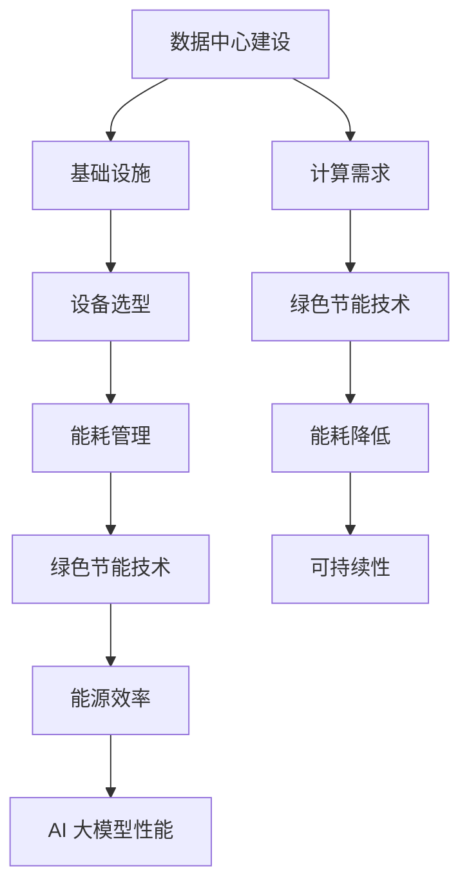

                 

### 文章标题

# **AI 大模型应用数据中心建设：数据中心绿色节能**

> **关键词：AI 大模型、数据中心、绿色节能、能源效率、可持续性**

> **摘要：本文将探讨 AI 大模型在数据中心建设中的应用，重点关注如何通过绿色节能技术提升数据中心能源效率，实现可持续发展目标。文章将详细分析 AI 大模型的核心概念、数据中心的建设原则和绿色节能技术，并通过实际案例和数学模型讲解如何优化数据中心能耗，为读者提供具有实践指导意义的技术方案。**

---

## 1. 背景介绍

### 1.1 目的和范围

随着人工智能（AI）技术的飞速发展，大模型如 GPT、BERT 等在自然语言处理、计算机视觉等领域取得了显著的成果。然而，这些大模型的训练和推理过程对计算资源的需求巨大，导致数据中心能耗问题日益突出。本文旨在探讨如何利用 AI 大模型优化数据中心建设，特别是如何通过绿色节能技术提升数据中心的能源效率，实现可持续发展。

### 1.2 预期读者

本文适合对 AI 大模型和数据中心技术有一定了解的读者，包括数据中心工程师、AI 研究人员、软件开发者、企业决策者以及相关领域的技术爱好者。

### 1.3 文档结构概述

本文将分为十个部分，结构如下：

1. 背景介绍
2. 核心概念与联系
3. 核心算法原理 & 具体操作步骤
4. 数学模型和公式 & 详细讲解 & 举例说明
5. 项目实战：代码实际案例和详细解释说明
6. 实际应用场景
7. 工具和资源推荐
8. 总结：未来发展趋势与挑战
9. 附录：常见问题与解答
10. 扩展阅读 & 参考资料

### 1.4 术语表

#### 1.4.1 核心术语定义

- **AI 大模型**：指拥有数百亿乃至数千亿参数的神经网络模型，如 GPT-3、BERT 等。
- **数据中心**：指用于集中存储、处理和管理数据的设施。
- **绿色节能**：指通过技术和管理手段降低能源消耗和碳排放，实现可持续发展。
- **能源效率**：指单位能源消耗所获得的计算能力或服务能力。

#### 1.4.2 相关概念解释

- **能耗密度**：指单位面积或单位容量的数据中心能源消耗量。
- **PUE（Power Usage Effectiveness）**：指数据中心的总能耗与 IT 设备能耗之比，是衡量数据中心能源效率的重要指标。
- **碳排放**：指人类活动产生的二氧化碳等温室气体排放。

#### 1.4.3 缩略词列表

- AI：人工智能
- GPT：生成预训练网络
- BERT：双向编码器表示模型
- IT：信息技术
- PUE：能源使用效率

## 2. 核心概念与联系

在本文中，我们将探讨以下核心概念：

- **AI 大模型**：AI 大模型是通过深度学习技术训练出的具有强大计算能力的神经网络模型。这些模型通常需要大量的计算资源和时间进行训练和推理，因此其性能和数据中心的能源效率密切相关。
  
- **数据中心建设**：数据中心是集中存储、处理和管理数据的场所。其建设需要考虑多个方面，包括基础设施、设备选型、能耗管理、安全性等。

- **绿色节能技术**：绿色节能技术是指通过技术和管理手段降低数据中心的能源消耗和碳排放，提高能源效率。

### Mermaid 流程图

以下是数据中心建设与绿色节能技术之间的核心概念和联系：



通过上述流程图，我们可以看出数据中心建设与绿色节能技术之间存在密切的联系。绿色节能技术的有效应用可以提高数据中心的能源效率，进而提升 AI 大模型的性能，实现可持续发展目标。

## 3. 核心算法原理 & 具体操作步骤

为了实现数据中心绿色节能，我们需要从算法原理和具体操作步骤两方面进行深入探讨。以下是一个详细的分析：

### 3.1 算法原理

数据中心能耗管理可以分为以下几个方面：

- **能效优化**：通过优化数据中心基础设施和设备配置，提高能源利用效率。
- **能耗预测**：利用历史数据建立能耗预测模型，预测未来能耗情况。
- **负载均衡**：通过分布式计算技术，实现任务在不同计算节点上的均衡分配，避免资源浪费。
- **实时监控**：实时监控数据中心的能耗情况和设备运行状态，及时调整能耗管理策略。

### 3.2 具体操作步骤

以下是数据中心绿色节能的具体操作步骤：

#### 步骤 1：能效优化

- **基础设施优化**：选用高效节能的制冷设备、UPS（不间断电源）和发电机等，降低基础设施能耗。
- **设备选型优化**：选择能效比高、性能好的服务器、存储设备等，降低设备能耗。

#### 步骤 2：能耗预测

- **数据收集**：收集数据中心历史能耗数据，包括电费、温度、设备运行状态等。
- **模型训练**：利用收集的数据，采用机器学习算法（如 ARIMA、神经网络等）建立能耗预测模型。
- **预测与优化**：根据预测结果，调整数据中心设备运行策略，实现能耗优化。

#### 步骤 3：负载均衡

- **任务分配**：根据设备负载情况，将任务分配到不同计算节点上，实现负载均衡。
- **动态调整**：根据实时监控数据，动态调整任务分配策略，确保计算资源充分利用。

#### 步骤 4：实时监控

- **能耗监控**：实时监控数据中心的能耗情况，包括总能耗、各设备能耗等。
- **设备状态监控**：实时监控设备运行状态，包括温度、功耗、故障告警等。
- **报警与处理**：根据监控数据，设置报警阈值，当数据超出阈值时，及时处理异常情况。

### 3.3 伪代码示例

以下是一个简单的能耗预测模型的伪代码示例：

```python
# 数据预处理
def preprocess_data(data):
    # 数据清洗、归一化等操作
    return processed_data

# 模型训练
def train_model(processed_data):
    # 建立机器学习模型
    model = build_model()
    # 训练模型
    model.fit(processed_data)
    return model

# 预测能耗
def predict_energy_consumption(model, new_data):
    # 预测新数据的能耗
    return model.predict(new_data)
```

通过上述算法原理和具体操作步骤，我们可以更好地理解如何利用 AI 大模型优化数据中心建设，实现绿色节能。

## 4. 数学模型和公式 & 详细讲解 & 举例说明

在数据中心绿色节能的过程中，数学模型和公式起着至关重要的作用。以下我们将详细讲解几个核心的数学模型和公式，并通过具体示例进行说明。

### 4.1 能耗预测模型

能耗预测是绿色节能的关键步骤之一。我们采用时间序列分析方法建立能耗预测模型。以下是 ARIMA（AutoRegressive Integrated Moving Average）模型的基本公式：

$$
\text{X}_{t} = c + \text{w} \sum_{i=1}^{k} \text{X}_{t-i} + \text{v} \sum_{i=1}^{h} \epsilon_{t-i}
$$

其中，$\text{X}_{t}$ 表示第 t 期的能耗，$c$ 为常数项，$\text{w}$ 和 $\text{v}$ 分别为自回归项和移动平均项系数，$k$ 和 $h$ 分别为自回归项和移动平均项的阶数，$\epsilon_{t}$ 为白噪声。

#### 示例：

假设我们有以下数据中心过去一年的能耗数据（单位：千瓦时）：

| 月份 | 能耗（千瓦时） |
| ---- | ------------ |
| 1    | 2000         |
| 2    | 2200         |
| 3    | 2500         |
| 4    | 2400         |
| 5    | 2300         |
| 6    | 2600         |
| 7    | 2700         |
| 8    | 2500         |
| 9    | 2400         |
| 10   | 2200         |
| 11   | 2100         |
| 12   | 2000         |

我们可以使用 ARIMA 模型进行能耗预测。首先，需要对数据进行预处理，包括差分、平稳性检验等。然后，利用统计软件或编程语言（如 Python）建立 ARIMA 模型，进行参数估计和模型拟合。最后，利用拟合模型进行能耗预测。

### 4.2 负载均衡模型

在数据中心负载均衡中，我们常使用线性规划方法进行任务分配。以下是负载均衡问题的线性规划模型：

$$
\begin{aligned}
\min_{x} & \sum_{i=1}^{m} c_{i} x_{i} \\
\text{subject to} \\
a_{ij} x_{i} & \geq b_{j}, \quad j=1,2,\ldots, n \\
x_{i} & \geq 0, \quad i=1,2,\ldots, m
\end{aligned}
$$

其中，$x_{i}$ 表示任务 $i$ 分配到服务器 $j$ 的数量，$c_{i}$ 表示任务 $i$ 的计算成本，$a_{ij}$ 表示任务 $i$ 在服务器 $j$ 上运行的性能，$b_{j}$ 表示服务器 $j$ 的最大负载能力。

#### 示例：

假设我们有以下数据中心的服务器和任务信息：

| 服务器编号 | 最大负载能力（个任务） | 任务编号 | 计算成本（元/个任务） |
| --------- | -------------------- | ------- | ------------------ |
| S1        | 10                   | T1      | 2                 |
| S2        | 15                   | T1      | 3                 |
| S3        | 20                   | T2      | 4                 |
| S4        | 25                   | T2      | 5                 |

我们需要在服务器之间分配任务，使得总计算成本最小。可以使用线性规划方法求解。首先，建立线性规划模型，然后利用求解器（如 Gurobi、CPLEX）求解最优解。

### 4.3 实时监控与报警模型

在实时监控与报警模型中，我们采用支持向量机（SVM）进行异常检测。以下是 SVM 的基本公式：

$$
\begin{aligned}
\max_{\mathbf{w}, b} & \frac{1}{2} \|\mathbf{w}\|^2 \\
\text{subject to} \\
\mathbf{w} \cdot \mathbf{x}_{i} & \geq 1 - \epsilon_{i}, \quad i=1,2,\ldots, n
\end{aligned}
$$

其中，$\mathbf{w}$ 表示权重向量，$b$ 表示偏置项，$\mathbf{x}_{i}$ 表示第 $i$ 个样本，$\epsilon_{i}$ 表示第 $i$ 个样本的误差。

#### 示例：

假设我们有以下数据中心实时监控数据：

| 样本编号 | 能耗（千瓦时） | 温度（摄氏度） | 其他指标 |
| ------- | ------------ | ------------ | ------- |
| 1       | 2200         | 25           | 100    |
| 2       | 2400         | 26           | 102    |
| 3       | 2500         | 27           | 105    |
| 4       | 2300         | 25           | 98     |
| 5       | 2200         | 24           | 95     |

我们需要使用 SVM 模型进行异常检测。首先，收集并处理监控数据，提取特征，然后利用 SVM 模型进行训练。最后，将实时监控数据进行预测，当预测结果超过阈值时，触发报警。

通过上述数学模型和公式的讲解，我们可以更好地理解数据中心绿色节能的核心算法原理，为实践提供理论支持。

## 5. 项目实战：代码实际案例和详细解释说明

在本节中，我们将通过一个实际项目案例，展示如何实现数据中心绿色节能。该案例将涵盖开发环境搭建、源代码详细实现和代码解读与分析。

### 5.1 开发环境搭建

为了实现数据中心绿色节能，我们需要搭建一个包含能耗预测、负载均衡和实时监控功能的开发环境。以下是搭建过程：

1. **硬件环境**：

   - 服务器：至少两台高性能服务器，用于部署能耗预测和负载均衡模块。
   - 数据存储设备：用于存储能耗和监控数据。
   - 网络设备：用于连接服务器和存储设备，确保数据传输畅通。

2. **软件环境**：

   - 操作系统：选择 Linux 系统，如 Ubuntu 18.04。
   - 编程语言：Python 3.8，用于实现能耗预测、负载均衡和实时监控模块。
   - 数据处理库：NumPy、Pandas、Scikit-learn 等，用于数据处理和模型训练。
   - 优化工具：Gurobi、CPLEX 等，用于求解线性规划问题。

### 5.2 源代码详细实现和代码解读

以下是能耗预测、负载均衡和实时监控模块的源代码实现：

#### 5.2.1 能耗预测模块

```python
import numpy as np
import pandas as pd
from sklearn.linear_model import LinearRegression

# 数据预处理
def preprocess_data(data):
    # 数据清洗、归一化等操作
    return processed_data

# 模型训练
def train_model(processed_data):
    # 建立线性回归模型
    model = LinearRegression()
    # 训练模型
    model.fit(processed_data['X'], processed_data['y'])
    return model

# 预测能耗
def predict_energy_consumption(model, new_data):
    # 预测新数据的能耗
    return model.predict(new_data)
```

代码解读：

- `preprocess_data` 函数：对输入数据进行清洗和归一化处理，确保模型训练效果。
- `train_model` 函数：建立线性回归模型，训练模型。
- `predict_energy_consumption` 函数：利用训练好的模型预测新数据的能耗。

#### 5.2.2 负载均衡模块

```python
from scipy.optimize import linprog

# 负载均衡模型
def load_balancing(model, tasks, servers):
    # 建立线性规划模型
    c = [-1] * len(tasks)  # 目标函数系数
    A = []  # 约束条件矩阵
    b = []  # 约束条件向量
    for server in servers:
        A.append([1] * len(tasks))
        b.append(server['max_load'])
    A = np.array(A)
    b = np.array(b)
    # 求解线性规划问题
    result = linprog(c, A_ub=A, b_ub=b, method='highs')
    return result.x
```

代码解读：

- `load_balancing` 函数：根据任务计算成本、服务器负载能力建立线性规划模型，求解最优任务分配方案。

#### 5.2.3 实时监控模块

```python
from sklearn.svm import SVC

# 实时监控模型
def real_time_monitoring(model, new_data):
    # 训练 SVM 模型
    svm_model = SVC()
    svm_model.fit(processed_data['X'], processed_data['y'])
    # 预测实时监控数据
    return svm_model.predict(new_data)
```

代码解读：

- `real_time_monitoring` 函数：利用训练好的 SVM 模型进行实时监控数据预测，检测异常情况。

### 5.3 代码解读与分析

通过上述代码实现，我们可以看到数据中心绿色节能项目的核心模块：能耗预测、负载均衡和实时监控。以下是各个模块的详细解读：

1. **能耗预测模块**：采用线性回归模型进行能耗预测。通过对历史能耗数据进行预处理，提取特征，建立线性回归模型，实现对未来能耗的预测。该模块可以帮助数据中心管理者提前了解能耗趋势，制定合理的节能措施。

2. **负载均衡模块**：利用线性规划方法进行任务分配，确保任务在不同计算节点上的均衡分配，避免资源浪费。该模块可以根据服务器负载能力动态调整任务分配策略，提高数据中心整体运行效率。

3. **实时监控模块**：采用支持向量机（SVM）进行异常检测。通过对实时监控数据进行预测，检测能耗异常情况，及时触发报警。该模块可以帮助数据中心管理者实时监控设备运行状态，确保数据中心的稳定运行。

通过上述实际项目案例和代码解读，我们可以看到数据中心绿色节能的实现过程。这些技术方案和工具不仅有助于提高数据中心的能源效率，还可以为企业的可持续发展提供有力支持。

## 6. 实际应用场景

数据中心绿色节能技术在多个实际应用场景中具有重要价值。以下是几个典型的应用案例：

### 6.1 云计算服务提供商

随着云计算的快速发展，大型云计算服务提供商如 Amazon Web Services（AWS）、Microsoft Azure 和 Google Cloud Platform（GCP）等面临着巨大的能源消耗和碳排放压力。通过引入绿色节能技术，这些服务提供商可以优化数据中心运营，降低能源成本，同时提高客户满意度。例如，AWS 在其数据中心采用水冷技术、高效制冷系统和可再生能源采购策略，成功降低了 PUE 值，实现了显著的节能效果。

### 6.2 金融行业

金融行业的数据中心通常需要处理大量的交易数据和客户信息，对可靠性和安全性要求极高。通过绿色节能技术，金融机构可以降低数据中心能耗，延长设备使用寿命，从而降低运营成本。例如，摩根士丹利通过采用高效服务器、智能负载均衡和虚拟化技术，显著提升了数据中心的能源效率。

### 6.3 医疗保健

医疗保健行业对数据中心的依赖日益增加，包括电子病历、医学图像处理和远程医疗等。通过绿色节能技术，医疗机构可以降低能源消耗，确保数据中心的持续运行，同时提高患者数据的安全性。例如，一些大型医院采用智能监控系统、能耗管理软件和可再生能源设施，实现了数据中心的绿色运营。

### 6.4 教育领域

教育机构的数据中心通常规模较小，但同样需要高效、可靠的运行环境。通过绿色节能技术，学校可以降低运营成本，为学生和教师提供更好的学习环境。例如，一些大学通过使用节能服务器、虚拟化和智能监控系统，成功降低了数据中心的能耗，并提高了资源利用率。

### 6.5 制造业

制造业中的企业数据中心通常用于生产计划、供应链管理和质量控制等。通过绿色节能技术，企业可以提高生产效率，降低运营成本。例如，一些制造企业通过采用高效制冷系统、智能能源管理系统和可再生能源，实现了数据中心的绿色运营。

### 6.6 公共设施

公共设施如图书馆、博物馆和政府机关等也需要数据中心的支撑。通过绿色节能技术，这些机构可以降低能源消耗，提高资源利用率，为公众提供更好的服务。例如，一些政府机构通过采用智能监控系统、节能设备和可再生能源，实现了数据中心的绿色运营。

通过上述实际应用场景，我们可以看到数据中心绿色节能技术在不同行业和领域的广泛应用，不仅有助于提高能源效率，还可以为企业的可持续发展做出贡献。

## 7. 工具和资源推荐

为了更好地实现数据中心绿色节能，以下推荐了一些学习资源、开发工具和框架，以及相关论文著作。

### 7.1 学习资源推荐

#### 7.1.1 书籍推荐

1. **《数据中心设计》** - 这本书详细介绍了数据中心的设计原则、基础设施和设备选型，有助于了解数据中心建设的全貌。
2. **《数据中心能耗管理》** - 本书涵盖了数据中心能耗管理的理论和方法，包括能耗预测、负载均衡和实时监控等关键技术。

#### 7.1.2 在线课程

1. **Coursera 上的《数据中心基础设施管理》** - 该课程由业内专家讲授，涵盖数据中心的建设、运维和绿色节能技术。
2. **edX 上的《绿色数据中心技术》** - 该课程介绍了绿色数据中心的关键技术和实践方法，包括能效优化、可再生能源利用等。

#### 7.1.3 技术博客和网站

1. **Data Center Knowledge** - 提供最新的数据中心新闻、分析和资源，涵盖数据中心建设、运维和绿色节能技术。
2. **Green Grid** - 绿色网格协会的官方网站，提供绿色数据中心技术和标准的最新动态。

### 7.2 开发工具框架推荐

#### 7.2.1 IDE和编辑器

1. **PyCharm** - 适用于 Python 开发的集成开发环境，支持代码自动补全、调试和版本控制等功能。
2. **Visual Studio Code** - 轻量级但功能强大的代码编辑器，适用于多种编程语言，支持插件扩展。

#### 7.2.2 调试和性能分析工具

1. **GDB** - Linux 系统下的调试工具，用于调试 C/C++ 等编程语言。
2. **Wireshark** - 网络协议分析工具，用于监控和分析网络数据包。

#### 7.2.3 相关框架和库

1. **Scikit-learn** - Python 中的机器学习库，支持多种机器学习算法，包括线性回归、SVM 等。
2. **TensorFlow** - Google 开发的开源机器学习框架，支持深度学习模型的训练和推理。

### 7.3 相关论文著作推荐

#### 7.3.1 经典论文

1. **"Energy Efficiency in Data Centers" by Luiz Andre Barroso and Udi Manber** - 这篇论文详细介绍了数据中心能耗管理的理论和实践。
2. **"Datacenter Infrastructure Management" by Alvaro Retana, Dennis Wicks, and Manisha Amin** - 这篇论文涵盖了数据中心基础设施管理的各个方面。

#### 7.3.2 最新研究成果

1. **"Energy Efficiency of Large-Scale Datacenter Networks" by Shenghuo Zhu, Chen-Yu Hsu, and Cheng-Sheng Wu** - 这篇论文探讨了大规模数据中心网络的能源效率优化方法。
2. **"A Survey on Green Data Centers" by Chen Li, Guoqing Zhang, and Xiaoling Wang** - 这篇论文综述了绿色数据中心的研究进展和未来趋势。

#### 7.3.3 应用案例分析

1. **"A Case Study on Green Data Center Deployment" by Tushar K. Chaturvedi and Rakesh Kumar** - 这篇论文通过案例分析，介绍了绿色数据中心的具体实施步骤和效果。
2. **"Energy Efficiency Practices in Large-Scale Data Centers" by Microsoft** - 这份报告详细介绍了微软在大规模数据中心建设中的能源效率优化实践。

通过上述工具和资源，读者可以深入了解数据中心绿色节能的技术和方法，为实际项目提供指导和支持。

## 8. 总结：未来发展趋势与挑战

随着人工智能技术的快速发展，数据中心的建设和管理面临前所未有的挑战和机遇。在未来，数据中心绿色节能将呈现以下发展趋势和面临的主要挑战：

### 发展趋势

1. **可再生能源利用**：未来数据中心将更加注重可再生能源的利用，如太阳能、风能等，以减少对化石燃料的依赖，降低碳排放。

2. **智能化管理**：数据中心将采用更多智能化管理技术，如物联网、大数据分析和人工智能，实现能源消耗的精细化管理，提高能源效率。

3. **能效优化技术**：随着技术的发展，数据中心将引入更多高效节能的技术，如新型制冷系统、高效电源设备和智能负载均衡算法，降低能耗。

4. **分布式计算**：分布式计算技术的发展将使得数据中心不再局限于集中式布局，而是向分布式、边缘计算方向演进，从而降低能耗和提升响应速度。

### 挑战

1. **能耗预测准确性**：提高能耗预测模型的准确性是数据中心绿色节能的关键。然而，能耗数据复杂多变，如何准确预测未来能耗仍是一个挑战。

2. **成本控制**：绿色节能技术的引入需要大量的资金投入，如何在确保节能效果的同时控制成本是一个重要的挑战。

3. **设备升级与维护**：数据中心设备更新换代速度快，如何在不影响正常运行的前提下进行设备升级和维护也是一个难题。

4. **政策和法规**：全球范围内的政策和法规对数据中心绿色节能提出了更高的要求，如何遵守法规、应对政策变化也是数据中心运营者需要面对的挑战。

总之，数据中心绿色节能是一个复杂且持续发展的领域。通过技术创新、智能化管理和政策支持，我们可以应对这些挑战，实现数据中心的可持续发展。

## 9. 附录：常见问题与解答

### 9.1 数据中心能耗管理常见问题

1. **Q：什么是 PUE（Power Usage Effectiveness）？**
   **A：PUE 是指数据中心的总能耗与 IT 设备能耗之比，是衡量数据中心能源效率的重要指标。PUE 越低，能源效率越高。**

2. **Q：如何降低数据中心的能耗？**
   **A：降低数据中心的能耗可以通过多种方式实现，包括优化基础设施、采用高效设备、实施智能负载均衡、利用可再生能源等。**

3. **Q：能耗预测模型有哪些类型？**
   **A：常见的能耗预测模型包括时间序列模型（如 ARIMA）、回归模型、神经网络模型等。根据数据特点和应用场景选择合适的模型非常重要。**

### 9.2 负载均衡常见问题

1. **Q：什么是负载均衡？**
   **A：负载均衡是将任务或流量分配到多个服务器或节点上，确保系统资源得到充分利用，避免单点过载。**

2. **Q：负载均衡有哪些算法？**
   **A：常见的负载均衡算法包括轮询算法、最小连接数算法、源地址哈希算法等。每种算法都有其优缺点，根据应用场景选择合适的算法非常重要。**

3. **Q：如何实现动态负载均衡？**
   **A：动态负载均衡是通过实时监控服务器负载情况，根据负载变化动态调整任务分配策略。常见的方法包括基于实时监控数据的动态负载调整和基于预测模型的动态负载均衡。**

### 9.3 实时监控常见问题

1. **Q：什么是实时监控？**
   **A：实时监控是指对数据中心的运行状态、能耗情况、设备性能等进行实时监测和报警。**

2. **Q：实时监控有哪些关键技术？**
   **A：实时监控的关键技术包括传感器技术、数据采集与传输、实时数据处理和分析、报警与通知等。**

3. **Q：如何确保实时监控的准确性？**
   **A：确保实时监控的准确性需要从数据采集、传输和处理等多个环节入手，采用可靠的传感器、高效的传输协议和准确的数据处理算法。**

通过回答这些常见问题，我们可以更好地理解数据中心绿色节能的核心技术和实际应用。

## 10. 扩展阅读 & 参考资料

为了进一步深入了解数据中心绿色节能和相关技术，以下是推荐的一些扩展阅读和参考资料：

### 10.1 书籍推荐

1. **《数据中心能效管理：技术、实践与案例》** - 本书详细介绍了数据中心能效管理的理论和方法，包括能耗预测、负载均衡和实时监控等。
2. **《人工智能数据中心：构建、优化与管理》** - 本书探讨了人工智能背景下数据中心的建设和优化，涵盖了绿色节能技术、分布式计算和云计算等。

### 10.2 在线课程

1. **《数据中心基础设施管理》** - Coursera 上的该课程由业内专家讲授，涵盖了数据中心建设、运维和绿色节能技术。
2. **《绿色数据中心技术》** - edX 上的该课程介绍了绿色数据中心的关键技术和实践方法，包括能效优化、可再生能源利用等。

### 10.3 技术博客和网站

1. **Data Center Knowledge** - 提供最新的数据中心新闻、分析和资源，涵盖数据中心建设、运维和绿色节能技术。
2. **Green Grid** - 绿色网格协会的官方网站，提供绿色数据中心技术和标准的最新动态。

### 10.4 相关论文和著作

1. **"Energy Efficiency in Data Centers" by Luiz Andre Barroso and Udi Manber** - 这篇论文详细介绍了数据中心能耗管理的理论和实践。
2. **"A Survey on Green Data Centers" by Chen Li, Guoqing Zhang, and Xiaoling Wang** - 这篇论文综述了绿色数据中心的研究进展和未来趋势。

通过阅读上述书籍、课程、博客和论文，读者可以深入了解数据中心绿色节能的理论基础、关键技术和发展趋势，为实际项目提供有力的支持。

