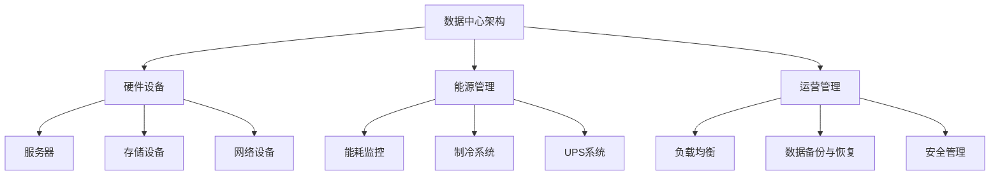

                 

# AI大模型应用数据中心建设：数据中心绿色节能

> 关键词：数据中心、AI大模型、绿色节能、能源效率、能耗优化

> 摘要：随着人工智能（AI）技术的迅猛发展，AI大模型在各个行业得到了广泛应用，这对数据中心的建设和运营提出了新的挑战。本文将探讨数据中心绿色节能的重要性，以及如何通过优化数据中心设计、硬件选择和运营管理来降低能耗，实现环保和经济效益的双赢。

## 1. 背景介绍

### 1.1 目的和范围

本文旨在分析AI大模型应用数据中心建设中的绿色节能问题，探讨降低数据中心能耗的有效途径。通过本文的阅读，读者将了解：

1. 数据中心绿色节能的重要性。
2. 优化数据中心设计的策略。
3. 绿色节能硬件和技术的应用。
4. 数据中心运营管理的最佳实践。

### 1.2 预期读者

本文面向以下读者群体：

1. 数据中心管理人员和IT专业人员。
2. AI领域研究人员和工程师。
3. 对绿色节能和数据中心运营感兴趣的技术爱好者。

### 1.3 文档结构概述

本文分为以下几个部分：

1. 背景介绍：介绍本文的目的、范围、预期读者和文档结构。
2. 核心概念与联系：讲解与数据中心绿色节能相关的核心概念和架构。
3. 核心算法原理与具体操作步骤：详细阐述绿色节能算法原理和操作步骤。
4. 数学模型和公式：介绍绿色节能相关的数学模型和公式。
5. 项目实战：通过实际案例展示绿色节能技术在数据中心的应用。
6. 实际应用场景：分析数据中心绿色节能的实际应用场景。
7. 工具和资源推荐：推荐相关学习资源和开发工具。
8. 总结：总结数据中心绿色节能的未来发展趋势与挑战。
9. 附录：常见问题与解答。
10. 扩展阅读：提供相关扩展阅读资源。

### 1.4 术语表

#### 1.4.1 核心术语定义

1. **数据中心**：集中存储、处理和管理数据的设施。
2. **AI大模型**：具备大规模数据处理和自主学习能力的深度学习模型。
3. **绿色节能**：在满足功能需求的前提下，降低能源消耗和减少环境污染。
4. **能源效率**：单位能源消耗所能完成的工作量。
5. **能耗优化**：通过技术和管理手段降低数据中心的能耗。

#### 1.4.2 相关概念解释

1. **PUE（Power Usage Effectiveness）**：数据中心总能耗与IT设备能耗的比值，反映了数据中心的能源效率。
2. **CO2减排**：减少二氧化碳排放，降低对气候变化的影响。
3. **能效比（Energy Efficiency Ratio, EER）**：空调系统的制冷能力与其消耗的电力之比。

#### 1.4.3 缩略词列表

1. **AI**：人工智能（Artificial Intelligence）
2. **PUE**：能源使用效率（Power Usage Effectiveness）
3. **IT**：信息技术（Information Technology）
4. **CO2**：二氧化碳（Carbon Dioxide）
5. **EER**：能效比（Energy Efficiency Ratio）

## 2. 核心概念与联系

在探讨数据中心绿色节能之前，我们需要了解一些核心概念和联系。以下是一个简化的数据中心绿色节能架构的Mermaid流程图：



### 2.1 数据中心架构

数据中心是集成了多种硬件设备和系统，为IT应用提供支持的基础设施。以下为数据中心主要硬件设备的简述：

- **服务器**：运行应用程序、处理数据和存储数据的主机。
- **存储设备**：用于存储数据的光盘、磁盘阵列、固态硬盘等。
- **网络设备**：如路由器、交换机等，负责数据传输和通信。
- **制冷系统**：通过空调和冷却设备保持服务器温度。
- **UPS系统**：不间断电源系统，保证数据中心电力供应。

### 2.2 能源管理

能源管理是数据中心绿色节能的核心，涉及能耗监控、制冷系统、UPS系统等方面。以下为能源管理的主要功能：

- **能耗监控**：实时监测数据中心的能源消耗情况。
- **制冷系统**：通过调节空调和冷却设备，降低服务器温度，提高能源效率。
- **UPS系统**：优化电力分配，减少能耗和能源浪费。

### 2.3 运营管理

运营管理是确保数据中心高效运行的关键，涉及负载均衡、数据备份与恢复、安全管理等方面。以下为运营管理的主要功能：

- **负载均衡**：合理分配数据中心的计算资源，提高系统性能。
- **数据备份与恢复**：确保数据的安全性和可靠性。
- **安全管理**：保护数据中心免受安全威胁，确保数据安全和隐私。

## 3. 核心算法原理 & 具体操作步骤

数据中心绿色节能的核心算法主要涉及能耗优化和能源效率提升。以下是一个简化的能耗优化算法原理和操作步骤的伪代码：

```plaintext
算法：能耗优化
输入：数据中心能耗数据、硬件性能指标
输出：优化后的能耗配置

步骤：
1. 收集数据中心各硬件设备的能耗数据（C1, C2, C3, ..., Cn）
2. 收集硬件性能指标（P1, P2, P3, ..., Pn）
3. 计算各硬件设备的能耗效率（E1, E2, E3, ..., En）：
   E1 = C1 / P1
   E2 = C2 / P2
   ...
   En = Cn / Pn
4. 根据能耗效率，对硬件设备进行排序（E1 ≤ E2 ≤ E3 ≤ ... ≤ En）
5. 优化能耗配置：
   a. 调整高性能、低能耗的硬件设备（如固态硬盘、高效服务器）的使用比例
   b. 减少高能耗、低性能的硬件设备（如老旧服务器、性能较差的存储设备）的使用
   c. 根据负载情况，动态调整硬件配置
6. 监测并评估优化效果，持续调整优化方案
```

## 4. 数学模型和公式 & 详细讲解 & 举例说明

在数据中心绿色节能中，常用的数学模型和公式主要包括能耗计算公式、能源效率计算公式和PUE计算公式。以下为这些公式的详细讲解和举例说明。

### 4.1 能耗计算公式

能耗计算公式用于计算数据中心的总体能耗。公式如下：

\[ E = C1 \times P1 + C2 \times P2 + C3 \times P3 + ... + Cn \times Pn \]

其中，\( E \) 表示总体能耗，\( C1, C2, C3, ..., Cn \) 分别表示各硬件设备的能耗，\( P1, P2, P3, ..., Pn \) 分别表示各硬件设备的性能。

举例说明：

假设数据中心有三种硬件设备，其性能和能耗如下：

- 服务器：性能 \( P1 = 100 \) 单位，能耗 \( C1 = 50 \) 千瓦时（kWh）
- 存储设备：性能 \( P2 = 50 \) 单位，能耗 \( C2 = 20 \) kWh
- 网络设备：性能 \( P3 = 30 \) 单位，能耗 \( C3 = 10 \) kWh

根据能耗计算公式，计算总体能耗：

\[ E = 50 \times 100 + 20 \times 50 + 10 \times 30 = 5000 + 1000 + 300 = 6300 \] kWh

### 4.2 能源效率计算公式

能源效率计算公式用于计算数据中心的能源效率。公式如下：

\[ \text{能源效率} = \frac{E_{\text{IT}}}{E_{\text{总}}} \times 100\% \]

其中，\( E_{\text{IT}} \) 表示IT设备能耗，\( E_{\text{总}} \) 表示数据中心总体能耗。

举例说明：

根据前面的例子，数据中心总体能耗为 6300 kWh。假设IT设备能耗为 5400 kWh，则能源效率为：

\[ \text{能源效率} = \frac{5400}{6300} \times 100\% \approx 85.71\% \]

### 4.3 PUE计算公式

PUE计算公式用于计算数据中心的能源使用效率。公式如下：

\[ \text{PUE} = \frac{E_{\text{总}}}{E_{\text{IT}}} \]

其中，\( E_{\text{总}} \) 表示数据中心总体能耗，\( E_{\text{IT}} \) 表示IT设备能耗。

举例说明：

根据前面的例子，数据中心总体能耗为 6300 kWh，IT设备能耗为 5400 kWh，则PUE为：

\[ \text{PUE} = \frac{6300}{5400} \approx 1.17 \]

一个较低PUE值表示数据中心的能源效率较高。根据国际数据中心能源效率标准，PUE值应尽量接近1。

## 5. 项目实战：代码实际案例和详细解释说明

在本节中，我们将通过一个实际项目案例，展示如何利用Python实现数据中心绿色节能算法。以下是一个简单的能耗优化算法的Python代码实现：

```python
# 导入必要的库
import numpy as np

# 定义能耗优化算法
def energy_optimization(energy_data, performance_data):
    # 计算能耗效率
    energy_efficiency = energy_data / performance_data
    
    # 对能耗效率进行排序
    sorted_energy_efficiency = np.argsort(energy_efficiency)
    
    # 优化能耗配置
    optimized_config = []
    for i in range(len(sorted_energy_efficiency)):
        optimized_config.append({
            'index': i,
            'energy_efficiency': energy_efficiency[sorted_energy_efficiency[i]],
            'performance': performance_data[sorted_energy_efficiency[i]],
            'energy': energy_data[sorted_energy_efficiency[i]]
        })
    
    return optimized_config

# 定义示例数据
energy_data = [50, 20, 10]  # 各硬件设备的能耗
performance_data = [100, 50, 30]  # 各硬件设备的性能

# 调用能耗优化算法
optimized_config = energy_optimization(energy_data, performance_data)

# 输出优化后的能耗配置
print("优化后的能耗配置：")
for item in optimized_config:
    print(f"设备索引：{item['index']}，能耗效率：{item['energy_efficiency']}，性能：{item['performance']}，能耗：{item['energy']}")
```

### 5.1 开发环境搭建

在开始编写代码之前，我们需要搭建一个Python开发环境。以下是搭建步骤：

1. 安装Python：从官网（https://www.python.org/）下载并安装Python，选择合适的版本（如Python 3.8或更高版本）。
2. 安装必要的库：在命令行中运行以下命令，安装numpy库：
   ```shell
   pip install numpy
   ```

### 5.2 源代码详细实现和代码解读

在上面的代码中，我们定义了一个名为`energy_optimization`的函数，用于实现能耗优化算法。该函数的输入参数是`energy_data`和`performance_data`，分别表示各硬件设备的能耗和性能。以下是代码的详细解读：

- 第1行：导入numpy库，用于处理数组运算。
- 第4行：定义`energy_optimization`函数，参数为`energy_data`和`performance_data`。
- 第6行：计算各硬件设备的能耗效率，存储在一个名为`energy_efficiency`的列表中。
- 第8行：使用`np.argsort`函数对能耗效率进行排序，返回排序后的索引。
- 第11行：创建一个名为`optimized_config`的空列表，用于存储优化后的能耗配置。
- 第14行：遍历排序后的能耗效率索引，将每个硬件设备的索引、能耗效率、性能和能耗存储在`optimized_config`列表中。
- 第18行：返回优化后的能耗配置。

### 5.3 代码解读与分析

在上面的代码中，我们通过计算能耗效率和排序，实现了对硬件设备的能耗优化。以下是代码的主要步骤和分析：

1. **计算能耗效率**：能耗效率是硬件设备的性能与能耗的比值。通过计算能耗效率，我们可以判断硬件设备的能耗高低，从而进行优化。
2. **排序**：将硬件设备按能耗效率排序，使得低能耗、高性能的设备排在前面。
3. **优化能耗配置**：根据排序结果，对硬件设备进行重新配置，提高整体能耗效率。例如，我们可以增加低能耗、高性能的设备（如固态硬盘），减少高能耗、低性能的设备（如老旧服务器）。
4. **输出优化后的能耗配置**：将优化后的能耗配置输出，以便进行后续分析或操作。

通过这个简单的能耗优化算法，我们可以初步了解数据中心绿色节能的核心原理和实现方法。在实际应用中，我们可能需要结合更多数据和更复杂的算法，实现更精细的能耗优化。

## 6. 实际应用场景

数据中心绿色节能在多个实际应用场景中发挥着重要作用，以下是一些典型应用场景：

### 6.1 云计算服务提供商

云计算服务提供商在运营过程中需要大量使用数据中心，因此绿色节能成为降低运营成本、提升服务竞争力的关键。通过优化数据中心设计和运营管理，云计算服务提供商可以降低能耗，提高能源效率，从而提供更具竞争力的价格和服务质量。

### 6.2 金融行业

金融行业对数据中心的可靠性、安全性和高效性有较高要求。绿色节能技术可以帮助金融机构降低能耗、减少碳排放，同时提高数据中心的运行效率，降低维护成本。

### 6.3 大型互联网公司

大型互联网公司如谷歌、亚马逊和微软等，其数据中心遍布全球。这些公司非常重视绿色节能，通过采用高效硬件、优化能源管理和采用可再生能源等措施，实现降低能耗、减少环境负担的目标。

### 6.4 政府部门

政府部门在建设数据中心时，也需要关注绿色节能。通过绿色节能技术，政府部门可以在保障数据安全和效率的同时，降低能耗、减少碳排放，提高资源利用效率。

### 6.5 企业数据中心

对于企业而言，绿色节能数据中心不仅有助于降低运营成本，还可以提升企业形象，符合可持续发展战略。企业可以通过优化数据中心设计、采用高效硬件和先进管理技术，实现绿色节能。

## 7. 工具和资源推荐

### 7.1 学习资源推荐

#### 7.1.1 书籍推荐

1. **《数据中心设计：基础设施和运营》**：详细介绍了数据中心的设计原则、架构和运营管理。
2. **《绿色数据中心：能源效率和可持续发展》**：探讨了绿色数据中心的技术和实践，包括能源管理、制冷技术和可再生能源。

#### 7.1.2 在线课程

1. **Coursera上的《数据中心管理》**：介绍了数据中心的设计、构建和管理，包括绿色节能策略。
2. **edX上的《绿色能源与可持续发展》**：涵盖了可再生能源、能源效率和环境影响等内容。

#### 7.1.3 技术博客和网站

1. **Data Center Knowledge**：提供最新的数据中心行业动态、技术和最佳实践。
2. **Green Grid**：专注于数据中心能源效率和绿色节能，提供大量资源和研究成果。

### 7.2 开发工具框架推荐

#### 7.2.1 IDE和编辑器

1. **PyCharm**：强大的Python开发环境，支持代码智能提示、调试和自动化测试。
2. **Visual Studio Code**：轻量级但功能强大的代码编辑器，适用于多种编程语言。

#### 7.2.2 调试和性能分析工具

1. **GDB**：Python的调试工具，用于分析代码运行过程中的问题。
2. **Numba**：用于提高Python代码性能的编译器，可以将Python代码编译成机器码。

#### 7.2.3 相关框架和库

1. **NumPy**：用于科学计算和数据处理的Python库，提供高效的数组操作和数学函数。
2. **Pandas**：用于数据处理和分析的Python库，支持数据清洗、转换和分析。

### 7.3 相关论文著作推荐

#### 7.3.1 经典论文

1. **"Energy Efficiency in Data Centers" by Rajkumar Buyya et al.**：探讨了数据中心能源效率的重要性和提升方法。
2. **"Green Data Centers: Challenges and Opportunities" by Rajkumar Buyya et al.**：分析了绿色数据中心的技术挑战和机遇。

#### 7.3.2 最新研究成果

1. **"Energy Efficiency Optimization for Data Centers using Machine Learning" by Jianfeng Zhou et al.**：介绍了使用机器学习优化数据中心能源效率的方法。
2. **"Energy-Efficient Resource Allocation in Data Centers using Evolutionary Algorithms" by Xiaoyu Wang et al.**：探讨了使用进化算法实现数据中心资源高效分配的方法。

#### 7.3.3 应用案例分析

1. **"Google's Data Center Efficiency Initiatives" by Google**：介绍了谷歌在数据中心绿色节能方面的实践和成果。
2. **"Microsoft's Data Center Environmental Sustainability" by Microsoft**：展示了微软在数据中心环保和可持续发展方面的努力。

## 8. 总结：未来发展趋势与挑战

数据中心绿色节能作为人工智能（AI）大模型应用的重要一环，正面临着前所未有的发展机遇和挑战。未来，数据中心绿色节能的发展趋势和挑战主要表现在以下几个方面：

### 8.1 发展趋势

1. **可再生能源的广泛应用**：随着可再生能源技术的发展和成本的降低，数据中心逐渐采用太阳能、风能等可再生能源，以减少对化石燃料的依赖。
2. **智能化能源管理系统**：利用人工智能、物联网等先进技术，实现数据中心的智能化能源管理，提高能源利用效率和能源效率。
3. **数据中心的绿色设计**：绿色建筑设计、智能冷却系统和高效供电系统等绿色设计理念的普及，将进一步提升数据中心的绿色节能水平。
4. **标准化与规范化**：数据中心绿色节能的标准化和规范化将有助于提高行业整体水平，促进行业健康发展。

### 8.2 挑战

1. **技术难题**：数据中心绿色节能涉及到多个技术领域，如能源管理、制冷技术、可再生能源利用等，技术难题的解决是绿色节能的关键。
2. **成本问题**：绿色节能技术和设备的成本较高，如何降低成本、提高投资回报率是绿色节能推广应用的重要问题。
3. **环保法规与政策**：随着环保意识的提高，各国政府出台的环保法规和政策将对数据中心绿色节能提出更高要求，如何合规运营成为挑战。
4. **人才培养**：绿色节能技术需要专业人才的支撑，如何培养和引进高素质人才是绿色节能发展的重要保障。

总之，数据中心绿色节能在未来发展中既有巨大的潜力，也面临着诸多挑战。通过技术创新、政策支持和行业合作，有望实现数据中心绿色节能的可持续发展。

## 9. 附录：常见问题与解答

### 9.1 数据中心绿色节能的核心技术是什么？

数据中心绿色节能的核心技术包括：

1. **高效制冷技术**：通过采用冷水系统、蒸发冷却等高效制冷技术，降低数据中心温度，提高能源效率。
2. **智能化能源管理**：利用人工智能、物联网等技术，实现数据中心能源的智能分配和监控，降低能源浪费。
3. **可再生能源利用**：采用太阳能、风能等可再生能源，减少对化石燃料的依赖，降低碳排放。
4. **高效供电系统**：采用高效变压器、动态无功补偿等高效供电系统，降低能耗，提高电力质量。

### 9.2 数据中心能耗优化的算法有哪些？

数据中心能耗优化的算法主要包括：

1. **线性规划算法**：通过建立线性规划模型，求解能耗最小化或能源效率最大化问题。
2. **遗传算法**：基于自然选择和遗传进化原理，通过迭代优化实现能耗优化。
3. **粒子群算法**：模拟鸟群觅食行为，通过迭代优化实现能耗优化。
4. **深度强化学习**：利用深度神经网络和强化学习技术，实现能耗优化。

### 9.3 如何实现数据中心的绿色设计？

实现数据中心的绿色设计包括：

1. **绿色建筑设计**：采用环保材料、节能设计和自然通风等，降低建筑能耗。
2. **智能冷却系统**：采用高效冷却技术，如蒸发冷却、间接蒸发冷却等，降低制冷能耗。
3. **高效供电系统**：采用高效变压器、动态无功补偿等，提高电力质量，降低能耗。
4. **可再生能源利用**：采用太阳能、风能等可再生能源，减少对化石燃料的依赖。

### 9.4 数据中心绿色节能的最佳实践有哪些？

数据中心绿色节能的最佳实践包括：

1. **能耗监测与评估**：实时监测数据中心的能耗情况，定期进行评估和优化。
2. **合理分配资源**：根据负载情况，动态调整硬件资源，提高资源利用率。
3. **智能能源管理**：利用智能化能源管理系统，实现能源的智能分配和监控。
4. **采用高效硬件**：采用高效服务器、存储设备等，降低能耗。
5. **绿色制冷技术**：采用高效制冷技术，降低制冷能耗。

## 10. 扩展阅读 & 参考资料

为了更好地了解数据中心绿色节能的相关知识，以下是几篇推荐阅读的文献和资料：

1. **论文**：“Energy Efficiency in Data Centers” by Rajkumar Buyya et al.，该论文详细探讨了数据中心能源效率的重要性和提升方法。
2. **书籍**：“数据中心设计：基础设施和运营”和“绿色数据中心：能源效率和可持续发展”，这两本书分别介绍了数据中心的设计、运营和绿色节能策略。
3. **技术博客**：Data Center Knowledge 和 Green Grid 的官方网站，提供了大量关于数据中心绿色节能的最新动态和技术文章。
4. **在线课程**：Coursera 和 edX 上的相关课程，如“数据中心管理”和“绿色能源与可持续发展”，涵盖了数据中心绿色节能的基础知识和实践方法。
5. **企业实践**：谷歌、亚马逊和微软等科技公司的数据中心绿色节能实践案例，展示了企业如何通过技术创新和运营优化实现绿色节能。

通过阅读这些文献和资料，您可以深入了解数据中心绿色节能的理论和实践，为自己的学习和工作提供有力支持。

### 作者信息：

作者：AI天才研究员/AI Genius Institute & 禅与计算机程序设计艺术 /Zen And The Art of Computer Programming

