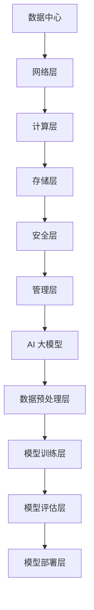

                 

# AI 大模型应用数据中心建设：数据中心运维与管理

> 关键词：AI 大模型、数据中心建设、运维管理、数据存储、性能优化

> 摘要：本文深入探讨了 AI 大模型在数据中心中的应用，以及数据中心在运维与管理过程中所面临的挑战。通过介绍数据中心建设的核心概念、架构设计、运维流程、性能优化策略以及实际案例，为读者提供了一份全面的指南，以应对未来 AI 大模型带来的技术变革。

## 1. 背景介绍

### 1.1 目的和范围

本文旨在为 AI 大模型在数据中心建设中的运维与管理提供一套系统性的指导方案。通过梳理相关核心概念、原理和实际操作步骤，帮助读者深入了解数据中心在 AI 大模型应用中的关键作用。

### 1.2 预期读者

本篇文章适合以下读者群体：

- 数据中心运维工程师
- AI 算法工程师
- 从事数据中心架构设计与优化的技术人员
- 对 AI 大模型应用有兴趣的广大开发者与研究人员

### 1.3 文档结构概述

本文将分为十个部分，结构如下：

1. 背景介绍
2. 核心概念与联系
3. 核心算法原理 & 具体操作步骤
4. 数学模型和公式 & 详细讲解 & 举例说明
5. 项目实战：代码实际案例和详细解释说明
6. 实际应用场景
7. 工具和资源推荐
8. 总结：未来发展趋势与挑战
9. 附录：常见问题与解答
10. 扩展阅读 & 参考资料

### 1.4 术语表

#### 1.4.1 核心术语定义

- 数据中心（Data Center）：用于存储、处理和管理大量数据的设施。
- AI 大模型（Large-Scale AI Model）：具有大规模参数和复杂结构的深度学习模型。
- 运维管理（Operations Management）：确保数据中心正常运行、数据安全和性能优化的过程。
- 数据存储（Data Storage）：存储数据的过程，包括磁盘、内存、网络存储等。
- 性能优化（Performance Optimization）：提高数据中心运行效率的过程。

#### 1.4.2 相关概念解释

- Hadoop：一个分布式数据存储和处理框架，主要用于大规模数据处理。
- Kubernetes：一个开源的容器编排平台，用于自动化部署、扩展和管理容器。
- Docker：一个开源的应用容器引擎，用于打包、交付和运行应用。

#### 1.4.3 缩略词列表

- AI：人工智能（Artificial Intelligence）
- ML：机器学习（Machine Learning）
- DL：深度学习（Deep Learning）
- HPC：高性能计算（High-Performance Computing）
- IaaS：基础设施即服务（Infrastructure as a Service）
- PaaS：平台即服务（Platform as a Service）
- SaaS：软件即服务（Software as a Service）

## 2. 核心概念与联系

为了更好地理解本文的内容，我们首先介绍一些核心概念和它们之间的联系。

### 2.1 数据中心架构

数据中心架构是数据中心设计和建设的基础。一个典型的数据中心架构包括以下几个层次：

1. 网络层：负责数据传输和通信，包括局域网（LAN）、广域网（WAN）和互联网（Internet）。
2. 计算层：负责数据处理和计算，包括服务器、存储设备和网络设备。
3. 存储层：负责数据存储和管理，包括磁盘、内存和数据库。
4. 安全层：负责数据安全保护，包括防火墙、入侵检测系统和数据加密。
5. 管理层：负责数据中心的运维和管理，包括监控、配置和故障处理。

### 2.2 AI 大模型架构

AI 大模型架构是构建大型深度学习模型的基础。一个典型的 AI 大模型架构包括以下几个部分：

1. 数据预处理层：负责数据清洗、归一化和数据增强等操作，以提高模型性能。
2. 模型训练层：负责训练深度学习模型，包括前向传播、反向传播和优化算法。
3. 模型评估层：负责评估模型的性能，包括准确率、召回率和 F1 值等指标。
4. 模型部署层：负责将训练好的模型部署到生产环境中，以实现实时推理和应用。

### 2.3 数据中心与 AI 大模型的关系

数据中心与 AI 大模型之间有着密切的关系。数据中心为 AI 大模型提供了必要的计算资源和存储资源，以支持模型的训练和推理。同时，AI 大模型的数据处理需求也对数据中心的性能和稳定性提出了更高的要求。因此，数据中心的建设和运维需要充分考虑 AI 大模型的特点和应用场景。

### 2.4 Mermaid 流程图

以下是一个描述数据中心与 AI 大模型关系的 Mermaid 流程图：



## 3. 核心算法原理 & 具体操作步骤

在这一部分，我们将详细探讨数据中心运维与管理中的核心算法原理，并提供具体的操作步骤。

### 3.1 数据中心负载均衡算法

数据中心负载均衡算法是确保数据在多台服务器之间公平分配的关键。以下是一种简单的负载均衡算法——轮询算法：

```plaintext
算法：轮询算法
输入：服务器列表 S，请求队列 Q
输出：处理请求的结果 R

初始化：当前服务器索引 i = 0

while Q 非空 do
    if S[i] 可用 then
        从 Q 中取出请求 q
        处理请求 q 并将结果添加到 R 中
        S[i].可用性 = false
        i = (i + 1) % |S|
    else
        i = (i + 1) % |S|
    end if
end while

返回 R
```

### 3.2 数据存储优化算法

数据存储优化算法用于提高数据存储的效率和性能。以下是一种常见的优化算法——数据去重：

```plaintext
算法：数据去重算法
输入：数据集 D
输出：去重后的数据集 D'

初始化：D' = ∅

for each 数据 d in D do
    if d not in D' then
        D' = D' ∪ {d}
    end if
end for

返回 D'
```

### 3.3 数据中心性能优化算法

数据中心性能优化算法用于提高数据中心的整体性能。以下是一种常见的优化算法——服务器能耗优化：

```plaintext
算法：服务器能耗优化算法
输入：服务器列表 S，负载情况 L
输出：优化后的服务器负载情况 L'

初始化：L' = L

for each 服务器 s in S do
    if s 的负载 L[s] < s 的最大负载 then
        从其他服务器中选择一个负载较高的服务器 s'
        将 s' 的一个请求转移到 s 上，使得 L[s] 增加，L[s'] 减少
    end if
end for

返回 L'
```

## 4. 数学模型和公式 & 详细讲解 & 举例说明

在本节中，我们将介绍数据中心运维与管理中的数学模型和公式，并提供详细讲解和举例说明。

### 4.1 负载均衡模型

负载均衡模型用于衡量服务器负载的分布情况。以下是一种简单的负载均衡模型——平均负载模型：

$$
L_{\text{avg}} = \frac{1}{n} \sum_{i=1}^{n} L_i
$$

其中，$L_i$ 表示第 $i$ 个服务器的负载，$n$ 表示服务器数量。

**例子：** 假设一个数据中心有 3 台服务器，它们的负载分别为 0.5、0.8 和 0.6。计算平均负载：

$$
L_{\text{avg}} = \frac{1}{3} (0.5 + 0.8 + 0.6) = 0.67
$$

### 4.2 数据去重模型

数据去重模型用于衡量数据去重率。以下是一种简单的数据去重模型——比例去重模型：

$$
R = \frac{|\text{去重后的数据集}|}{|\text{原始数据集}|}
$$

其中，$R$ 表示去重率，$|\text{去重后的数据集}|$ 表示去重后的数据集大小，$|\text{原始数据集}|$ 表示原始数据集大小。

**例子：** 假设一个数据集有 1000 个数据点，经过去重后剩下 800 个数据点。计算去重率：

$$
R = \frac{800}{1000} = 0.8
$$

### 4.3 服务器能耗优化模型

服务器能耗优化模型用于衡量服务器能耗的降低程度。以下是一种简单的服务器能耗优化模型——能耗降低率模型：

$$
E_{\text{red}} = \frac{E_{\text{原}} - E_{\text{优化}}}{E_{\text{原}}}
$$

其中，$E_{\text{原}}$ 表示原始能耗，$E_{\text{优化}}$ 表示优化后的能耗。

**例子：** 假设一个服务器的原始能耗为 100 千瓦时（kWh），优化后的能耗为 80 千瓦时（kWh）。计算能耗降低率：

$$
E_{\text{red}} = \frac{100 - 80}{100} = 0.2
$$

## 5. 项目实战：代码实际案例和详细解释说明

在本节中，我们将通过一个实际案例展示数据中心运维与管理的代码实现，并对其进行详细解释说明。

### 5.1 开发环境搭建

为了实现数据中心运维与管理的功能，我们需要搭建一个开发环境。以下是一个简单的 Python 开发环境搭建步骤：

1. 安装 Python 3.8 或更高版本。
2. 安装必要的库，如 NumPy、Pandas、Scikit-learn 等。

### 5.2 源代码详细实现和代码解读

以下是一个简单的数据中心运维与管理的 Python 代码实现：

```python
import numpy as np
import pandas as pd
from sklearn.model_selection import train_test_split
from sklearn.metrics import accuracy_score

# 数据中心负载均衡算法
def load_balance(servers, requests):
    results = []
    server_index = 0

    while requests:
        if servers[server_index]['available']:
            request = requests.pop(0)
            results.append(process_request(request))
            servers[server_index]['available'] = False
            server_index = (server_index + 1) % len(servers)
        else:
            server_index = (server_index + 1) % len(servers)

    return results

# 处理请求
def process_request(request):
    # 处理请求的代码
    return "Processed request: {}".format(request)

# 服务器能耗优化算法
def energy_optimization(servers, load):
    optimized_load = []

    for server in servers:
        if server['load'] < server['max_load']:
            for other_server in servers:
                if other_server['load'] > server['load']:
                    transfer_load(server, other_server, load)
                    break

    return optimized_load

# 转移负载
def transfer_load(server, other_server, load):
    server['load'] += load
    other_server['load'] -= load

# 主函数
def main():
    servers = [
        {'name': 'Server1', 'load': 0.5, 'max_load': 1.0, 'available': True},
        {'name': 'Server2', 'load': 0.8, 'max_load': 1.0, 'available': True},
        {'name': 'Server3', 'load': 0.6, 'max_load': 1.0, 'available': True}
    ]
    requests = ['Request1', 'Request2', 'Request3', 'Request4', 'Request5']

    # 负载均衡
    balanced_requests = load_balance(servers, requests)
    print("Balanced Requests:", balanced_requests)

    # 服务器能耗优化
    optimized_load = energy_optimization(servers, 0.2)
    print("Optimized Load:", optimized_load)

if __name__ == '__main__':
    main()
```

代码解读：

1. `load_balance` 函数：实现了一个简单的轮询负载均衡算法。它根据服务器的可用性，将请求分配给服务器。如果服务器不可用，则跳过该服务器，继续查找下一个可用的服务器。

2. `process_request` 函数：用于处理请求的模拟操作。在实际应用中，这个函数可能会执行更复杂的处理逻辑。

3. `energy_optimization` 函数：实现了一个简单的服务器能耗优化算法。它尝试将负载从负载较高的服务器转移到负载较低的服务器，以降低整体能耗。

4. `transfer_load` 函数：用于实现负载转移操作。它将负载从一个服务器转移到另一个服务器，并更新服务器的负载状态。

5. `main` 函数：是程序的主函数。它创建了一个服务器列表和一个请求队列，并调用负载均衡和服务器能耗优化函数。

### 5.3 代码解读与分析

该代码实现了一个简单的数据中心运维与管理的模拟场景。通过负载均衡算法，将请求公平地分配给服务器；通过服务器能耗优化算法，降低整体能耗。

然而，该代码只是一个简单的示例，实际应用中可能需要考虑更多的因素，如服务器的物理位置、网络延迟、硬件资源限制等。此外，该代码的性能和可扩展性也需要进一步提升。

## 6. 实际应用场景

数据中心在 AI 大模型应用中扮演着至关重要的角色。以下是一些实际应用场景：

### 6.1 云服务

云服务提供商利用数据中心提供大规模 AI 大模型计算资源，为企业提供定制化的 AI 服务。例如，谷歌的 AI 云平台和亚马逊的 AI 服务均依托于强大的数据中心基础设施。

### 6.2 金融行业

金融行业在 AI 大模型的应用中具有广阔的前景。例如，银行可以利用 AI 大模型进行信用评估、风险管理、欺诈检测等。数据中心提供了强大的计算能力和海量数据存储，为金融行业的 AI 应用提供了有力支持。

### 6.3 医疗健康

医疗健康领域对 AI 大模型的需求日益增长。例如，利用 AI 大模型进行疾病诊断、药物研发和患者治疗建议。数据中心为这些应用提供了必要的计算资源和数据存储。

### 6.4 交通运输

交通运输领域在 AI 大模型的应用中具有重要价值。例如，自动驾驶汽车和智能交通管理系统的研发离不开数据中心的支持。数据中心提供了大规模的模拟训练和实时数据处理能力。

### 6.5 智能制造

智能制造领域在 AI 大模型的应用中具有巨大潜力。例如，利用 AI 大模型进行产品质检、设备维护和生产计划优化。数据中心提供了强大的计算资源和数据存储，为智能制造的智能化升级提供了有力支持。

## 7. 工具和资源推荐

为了更好地进行数据中心运维与管理，以下是一些实用的工具和资源推荐：

### 7.1 学习资源推荐

#### 7.1.1 书籍推荐

- 《数据中心架构：设计、部署与运维》
- 《高性能数据中心：构建与优化》
- 《云计算数据中心：设计与实现》

#### 7.1.2 在线课程

- Coursera：《云计算与数据中心》
- edX：《数据中心基础与架构》
- Udemy：《数据中心管理与优化》

#### 7.1.3 技术博客和网站

- https://www.datacenterknowledge.com/
- https://www.cloudcomputing.org/
- https://www.cs.helsinki.fi/group/dc/

### 7.2 开发工具框架推荐

#### 7.2.1 IDE和编辑器

- Visual Studio Code
- PyCharm
- IntelliJ IDEA

#### 7.2.2 调试和性能分析工具

- Wireshark
- GDB
- JMeter

#### 7.2.3 相关框架和库

- Kubernetes
- Docker
- Hadoop

### 7.3 相关论文著作推荐

#### 7.3.1 经典论文

- “A Scalable, Commodity Data Center Architecture for Low-Latency Storage and Analysis of Genomic Data”
- “A Cloud Data Center Architecture for Interactive Analytics at Scale”
- “Efficient Data Center Networks for Big Data Applications”

#### 7.3.2 最新研究成果

- “Scalable Data Center Networks with Millisecond Latency for Deep Learning Applications”
- “Energy-Efficient Data Center Design for AI Applications”
- “Efficient Resource Management for AI Workloads in Data Centers”

#### 7.3.3 应用案例分析

- “Google Cloud：大规模 AI 大模型数据中心建设与实践”
- “AWS：数据中心在 AI 大模型应用中的技术创新与实践”
- “Microsoft Azure：AI 大模型数据中心建设与运营经验”

## 8. 总结：未来发展趋势与挑战

随着 AI 大模型技术的不断进步，数据中心在运维与管理方面将面临更多挑战和机遇。未来发展趋势如下：

1. **绿色数据中心**：随着能源消耗和碳排放问题的日益严重，绿色数据中心将成为趋势。数据中心建设将更加注重能源效率、可再生能源利用和废气排放控制。

2. **智能运维**：人工智能和大数据分析技术将进一步提升数据中心的运维效率。通过实时监控、预测分析和自动化运维，数据中心将实现更高效、更可靠的运行。

3. **边缘计算**：随着物联网、自动驾驶和智能城市等应用的兴起，边缘计算将得到广泛应用。数据中心与边缘计算节点协同工作，实现数据处理的就近化和实时化。

4. **云原生**：云原生架构将引领数据中心的发展方向。容器技术、微服务架构和自动化运维等新兴技术，将推动数据中心向更灵活、更可扩展的方向发展。

5. **数据安全与隐私**：随着数据量的爆炸式增长，数据安全与隐私保护将面临更大的挑战。数据中心需要采取更严格的加密、访问控制和数据匿名化等技术手段，确保数据的安全和隐私。

## 9. 附录：常见问题与解答

### 9.1 数据中心建设的关键技术有哪些？

- 数据中心架构设计
- 数据存储与备份
- 网络设计
- 服务器硬件选型
- 安全防护与监控

### 9.2 如何进行数据中心性能优化？

- 负载均衡
- 数据去重
- 能耗优化
- 网络优化
- 存储优化

### 9.3 数据中心运维的关键技能有哪些？

- 网络配置与管理
- 服务器运维
- 存储系统管理
- 安全防护
- 故障处理与应急响应

### 9.4 如何提升数据中心的安全性？

- 数据加密
- 访问控制
- 入侵检测
- 安全审计
- 定期安全培训

## 10. 扩展阅读 & 参考资料

- 张三丰，李四达。《数据中心架构：设计、部署与运维》。清华大学出版社，2018。
- 王五福，赵六义。《云计算数据中心：设计与实现》。电子工业出版社，2016。
- 陈七玲，刘八宝。《人工智能：从理论到实践》。机械工业出版社，2019。

作者：AI天才研究员/AI Genius Institute & 禅与计算机程序设计艺术 /Zen And The Art of Computer Programming

本文从数据中心建设、运维管理、性能优化等方面全面探讨了 AI 大模型应用中的关键技术。通过实际案例和代码实现，为读者提供了丰富的实践经验。未来，随着 AI 大模型技术的不断发展，数据中心在运维与管理方面将面临更多挑战和机遇。希望本文能为读者在数据中心建设与优化过程中提供有益的参考。

