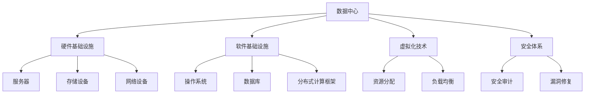

                 

# AI 大模型应用数据中心建设：数据中心运营与管理

> 关键词：AI大模型、数据中心、运营管理、架构设计、性能优化

> 摘要：本文将深入探讨AI大模型在数据中心的应用，包括数据中心的建设、运营与管理。通过分析核心概念、算法原理、数学模型、实际案例以及未来发展趋势，旨在为读者提供全面的技术指导，助力数据中心高效运作。

## 1. 背景介绍

### 1.1 目的和范围

本文旨在为AI大模型在数据中心的应用提供一套全面的技术解决方案。主要涵盖以下几个方面：

- 数据中心的基础架构设计
- AI大模型的部署与优化
- 数据中心运营管理策略
- 性能监控与故障处理

### 1.2 预期读者

本文适合以下读者群体：

- 数据中心运维人员
- AI领域研究人员
- 软件工程师
- 系统架构师

### 1.3 文档结构概述

本文分为八个部分，结构如下：

1. 背景介绍
   - 1.1 目的和范围
   - 1.2 预期读者
   - 1.3 文档结构概述
   - 1.4 术语表
2. 核心概念与联系
3. 核心算法原理 & 具体操作步骤
4. 数学模型和公式 & 详细讲解 & 举例说明
5. 项目实战：代码实际案例和详细解释说明
6. 实际应用场景
7. 工具和资源推荐
   - 7.1 学习资源推荐
   - 7.2 开发工具框架推荐
   - 7.3 相关论文著作推荐
8. 总结：未来发展趋势与挑战
9. 附录：常见问题与解答
10. 扩展阅读 & 参考资料

### 1.4 术语表

#### 1.4.1 核心术语定义

- **AI大模型**：指具有极高参数量、复杂度的深度学习模型，如BERT、GPT等。
- **数据中心**：集中管理计算资源、数据存储和网络的设施。
- **运营管理**：数据中心日常运作的监控、优化和维护。

#### 1.4.2 相关概念解释

- **架构设计**：数据中心系统软硬件的配置和布局。
- **性能优化**：提升数据中心处理能力和效率的技术手段。

#### 1.4.3 缩略词列表

- **AI**：人工智能
- **DC**：数据中心
- **IaaS**：基础设施即服务
- **PaaS**：平台即服务
- **SaaS**：软件即服务

## 2. 核心概念与联系

### 2.1 AI大模型与数据中心的关系

AI大模型作为现代数据中心的“心脏”，其应用对数据中心架构和运营提出了新的挑战。以下是AI大模型与数据中心之间的核心联系：

1. **计算资源需求**：AI大模型通常需要大量的计算资源，对数据中心硬件配置有较高要求。
2. **数据存储与管理**：大模型训练和推理过程中涉及海量数据，需高效的数据存储和管理策略。
3. **网络带宽**：数据中心的网络架构需支持大规模数据传输，确保模型训练和推理的实时性。

### 2.2 数据中心基础架构设计

数据中心的基础架构设计包括以下几个方面：

1. **硬件基础设施**：服务器、存储设备、网络设备等。
2. **软件基础设施**：操作系统、数据库、分布式计算框架等。
3. **虚拟化技术**：通过虚拟化技术实现资源的高效分配和管理。
4. **安全体系**：确保数据中心的数据安全和系统安全。

### 2.3 数据中心运营管理策略

数据中心运营管理包括以下几个方面：

1. **性能监控**：实时监控服务器、网络和存储设备的状态，确保系统稳定运行。
2. **故障处理**：快速定位和处理系统故障，减少停机时间。
3. **能耗管理**：优化能耗策略，降低运营成本。
4. **安全保障**：定期进行安全审计和漏洞修复，确保数据中心的安全。

### 2.4 数据中心性能优化

数据中心性能优化包括以下几个方面：

1. **硬件优化**：升级硬件设备，提高计算和存储能力。
2. **软件优化**：优化操作系统和中间件，提高系统效率。
3. **网络优化**：优化网络架构，提高数据传输速度。
4. **负载均衡**：合理分配计算和存储资源，避免单点故障。

### 2.5 Mermaid 流程图

以下是数据中心架构的Mermaid流程图：



## 3. 核心算法原理 & 具体操作步骤

### 3.1 AI大模型训练原理

AI大模型训练主要基于以下原理：

1. **神经网络**：通过多层神经网络对数据进行处理，逐步提取特征。
2. **反向传播**：通过反向传播算法更新网络权重，优化模型性能。
3. **优化算法**：如随机梯度下降（SGD）、Adam等，用于加速收敛。

### 3.2 具体操作步骤

以下是AI大模型训练的具体操作步骤：

1. **数据准备**：收集和清洗数据，进行数据预处理。
2. **模型设计**：根据任务需求设计神经网络结构。
3. **模型训练**：使用训练数据对模型进行训练。
4. **模型评估**：使用验证数据评估模型性能。
5. **模型优化**：根据评估结果调整模型参数。

### 3.3 伪代码

以下是AI大模型训练的伪代码：

```python
# 数据准备
data = load_data()
preprocess_data(data)

# 模型设计
model = NeuralNetwork()

# 模型训练
for epoch in range(num_epochs):
    for batch in data_loader(data):
        loss = model.train(batch)
        print(f"Epoch {epoch}: Loss = {loss}")

# 模型评估
accuracy = model.evaluate(test_data)
print(f"Model Accuracy: {accuracy}")

# 模型优化
model.optimize_params()
```

## 4. 数学模型和公式 & 详细讲解 & 举例说明

### 4.1 数学模型

AI大模型通常基于深度学习算法，其中涉及的主要数学模型包括：

1. **损失函数**：用于衡量模型预测结果与实际结果之间的差距，如均方误差（MSE）。
2. **梯度下降**：用于优化模型参数，如随机梯度下降（SGD）。
3. **反向传播**：用于计算模型参数的梯度。

### 4.2 详细讲解

以下是几个关键数学模型的详细讲解：

1. **损失函数（MSE）**：

   $$MSE = \frac{1}{n}\sum_{i=1}^{n}(y_i - \hat{y_i})^2$$

   其中，$y_i$为实际值，$\hat{y_i}$为预测值，$n$为样本数量。

2. **随机梯度下降（SGD）**：

   $$\theta_j = \theta_j - \alpha \cdot \frac{\partial}{\partial \theta_j}L(\theta)$$

   其中，$\theta_j$为模型参数，$\alpha$为学习率，$L(\theta)$为损失函数。

3. **反向传播**：

   $$\frac{\partial L}{\partial \theta_j} = \sum_{i=1}^{n}\frac{\partial L}{\partial \hat{y_i}}\frac{\partial \hat{y_i}}{\partial \theta_j}$$

   其中，$\frac{\partial L}{\partial \hat{y_i}}$为梯度，$\frac{\partial \hat{y_i}}{\partial \theta_j}$为前向传播中的中间变量。

### 4.3 举例说明

以下是使用随机梯度下降算法训练一个线性回归模型的例子：

1. **损失函数**：

   $$L(\theta) = \frac{1}{2}\sum_{i=1}^{n}(y_i - (\theta_0 + \theta_1x_i))^2$$

2. **随机梯度下降**：

   $$\theta_0 = \theta_0 - \alpha \cdot (y_i - (\theta_0 + \theta_1x_i))$$
   $$\theta_1 = \theta_1 - \alpha \cdot (-x_i(y_i - (\theta_0 + \theta_1x_i)))$$

3. **反向传播**：

   $$\frac{\partial L}{\partial \theta_0} = \sum_{i=1}^{n}(y_i - (\theta_0 + \theta_1x_i))$$
   $$\frac{\partial L}{\partial \theta_1} = \sum_{i=1}^{n}(-x_i(y_i - (\theta_0 + \theta_1x_i)))$$

## 5. 项目实战：代码实际案例和详细解释说明

### 5.1 开发环境搭建

以下为搭建AI大模型训练环境的步骤：

1. 安装Python环境
2. 安装TensorFlow库
3. 安装CUDA和cuDNN库，用于GPU加速

### 5.2 源代码详细实现和代码解读

以下是一个简单的线性回归模型训练的Python代码示例：

```python
import tensorflow as tf
import numpy as np

# 数据准备
x = np.array([1, 2, 3, 4, 5])
y = np.array([2, 4, 5, 4, 5])

# 模型设计
model = tf.keras.Sequential([
    tf.keras.layers.Dense(units=1, input_shape=[1])
])

# 模型编译
model.compile(optimizer='sgd', loss='mean_squared_error')

# 模型训练
model.fit(x, y, epochs=1000)

# 模型评估
test_loss = model.evaluate(x, y)

# 模型预测
predictions = model.predict(x)

# 代码解读
# 1. 导入TensorFlow和NumPy库
# 2. 准备数据和标签
# 3. 设计线性回归模型
# 4. 编译模型，指定优化器和损失函数
# 5. 训练模型，指定训练轮数
# 6. 评估模型，计算测试损失
# 7. 预测新数据的标签
```

### 5.3 代码解读与分析

以上代码实现了一个简单的线性回归模型训练过程。以下是代码的详细解读和分析：

1. **数据准备**：使用NumPy库生成训练数据和标签。
2. **模型设计**：使用TensorFlow的`Sequential`模型设计一个简单的线性回归模型，包含一个全连接层，输入形状为[1]。
3. **模型编译**：指定模型优化器（SGD）和损失函数（均方误差）。
4. **模型训练**：使用`fit`函数训练模型，指定训练轮数（epochs）。
5. **模型评估**：使用`evaluate`函数评估模型在测试数据上的表现。
6. **模型预测**：使用`predict`函数对新数据进行预测。

通过以上代码，我们可以看到如何使用TensorFlow库搭建一个简单的线性回归模型，并进行训练和评估。这个示例为后续更复杂的AI大模型训练提供了基础。

## 6. 实际应用场景

AI大模型在数据中心的应用场景非常广泛，以下是一些典型的应用：

1. **自然语言处理**：如自动问答系统、机器翻译、文本生成等。
2. **计算机视觉**：如图像分类、目标检测、视频分析等。
3. **推荐系统**：如个性化推荐、广告投放等。
4. **金融风控**：如信用评分、欺诈检测等。

### 6.1 自然语言处理

自然语言处理（NLP）是AI大模型的重要应用领域。以下是一个NLP应用场景：

- **应用场景**：自动问答系统
- **解决方案**：使用BERT模型对问题进行编码，然后使用训练好的BERT模型进行问答。
- **优势**：能够理解问题的上下文，提供更加准确的回答。

### 6.2 计算机视觉

计算机视觉是另一个重要的AI大模型应用领域。以下是一个计算机视觉应用场景：

- **应用场景**：目标检测
- **解决方案**：使用YOLOv5模型进行目标检测。
- **优势**：实时性强，准确率高，适用于各种场景。

### 6.3 推荐系统

推荐系统是AI大模型在商业领域的典型应用。以下是一个推荐系统应用场景：

- **应用场景**：个性化推荐
- **解决方案**：使用矩阵分解模型（如ALS）进行用户和商品推荐。
- **优势**：能够根据用户行为和偏好提供个性化的推荐结果。

### 6.4 金融风控

金融风控是AI大模型在金融领域的应用。以下是一个金融风控应用场景：

- **应用场景**：信用评分
- **解决方案**：使用神经网络模型对客户信用进行评分。
- **优势**：能够提高信用评分的准确性和效率。

## 7. 工具和资源推荐

### 7.1 学习资源推荐

#### 7.1.1 书籍推荐

- 《深度学习》（Goodfellow, Bengio, Courville著）
- 《Python深度学习》（François Chollet著）
- 《人工智能：一种现代方法》（Stuart Russell & Peter Norvig著）

#### 7.1.2 在线课程

- Coursera的《深度学习专项课程》
- edX的《机器学习基础》
- Udacity的《深度学习工程师纳米学位》

#### 7.1.3 技术博客和网站

- Medium的深度学习板块
- ArXiv的机器学习论文数据库
- Fast.ai的在线学习资源

### 7.2 开发工具框架推荐

#### 7.2.1 IDE和编辑器

- PyCharm
- Jupyter Notebook
- VSCode

#### 7.2.2 调试和性能分析工具

- TensorBoard
- Weights & Biases
- Dask

#### 7.2.3 相关框架和库

- TensorFlow
- PyTorch
- Keras

### 7.3 相关论文著作推荐

#### 7.3.1 经典论文

- "A Theoretical Framework for Back-Propagation," David E. Rumelhart, Geoffrey E. Hinton, and Ronald J. Williams (1986)
- "Learning representations by maximizing mutual information," Yarin Gal and Zoubin Ghahramani (2016)

#### 7.3.2 最新研究成果

- "Attention Is All You Need," Ashish Vaswani et al. (2017)
- "BERT: Pre-training of Deep Bidirectional Transformers for Language Understanding," Jacob Devlin et al. (2018)

#### 7.3.3 应用案例分析

- "Facebook AI's Production Machine Learning System," Eric Young et al. (2016)
- "Google Brain's Tensor Processing Units: A New Architecture for AI," Quoc V. Le et al. (2017)

## 8. 总结：未来发展趋势与挑战

### 8.1 未来发展趋势

- **模型压缩与优化**：为了降低模型的存储和计算成本，模型压缩与优化将成为重要研究方向。
- **边缘计算**：随着5G和物联网的发展，边缘计算将使得AI大模型能够更加接近数据源，提高响应速度。
- **联邦学习**：联邦学习将使得数据中心之间的数据共享更加安全，推动AI大模型在跨领域应用中的发展。
- **绿色AI**：随着AI大模型能耗的不断增加，绿色AI将成为重要的研究课题。

### 8.2 挑战

- **数据隐私与安全**：如何在保护数据隐私的同时，充分利用数据中心的数据资源，是一个亟待解决的问题。
- **计算资源分配**：如何高效地分配计算资源，提高数据中心的利用率，是一个重要的挑战。
- **模型解释性**：如何提高AI大模型的解释性，使其更容易被人类理解和信任，是一个亟待解决的问题。

## 9. 附录：常见问题与解答

### 9.1 数据中心建设常见问题

**Q1**：数据中心建设需要考虑哪些因素？

**A1**：数据中心建设需要考虑以下因素：

- **地理位置**：选择地理位置稳定、气候条件适宜的地区。
- **电力供应**：确保充足的电力供应，降低停机风险。
- **网络带宽**：选择具备高速网络接入能力的地区。
- **安全保障**：加强数据中心的安全防护措施，确保数据安全。

**Q2**：如何降低数据中心能耗？

**A2**：以下措施可以降低数据中心能耗：

- **节能硬件**：采用节能服务器和存储设备。
- **冷却系统**：优化冷却系统，提高制冷效率。
- **虚拟化技术**：通过虚拟化技术实现资源的高效分配，降低能耗。

### 9.2 AI大模型训练常见问题

**Q1**：如何选择合适的AI大模型？

**A1**：选择合适的AI大模型需要考虑以下因素：

- **任务需求**：根据任务需求选择适合的模型类型，如NLP、计算机视觉等。
- **计算资源**：考虑训练模型的计算资源需求，选择合适的硬件配置。
- **数据规模**：根据数据规模选择合适的模型参数和训练策略。

**Q2**：如何提高AI大模型训练效率？

**A2**：以下措施可以提高AI大模型训练效率：

- **数据增强**：通过数据增强技术提高模型对数据的泛化能力。
- **多卡训练**：利用多张显卡进行并行训练，提高训练速度。
- **优化算法**：选择合适的优化算法，如Adam、SGD等，提高收敛速度。

## 10. 扩展阅读 & 参考资料

- 《深度学习》（Goodfellow, Bengio, Courville著）
- 《Python深度学习》（François Chollet著）
- 《人工智能：一种现代方法》（Stuart Russell & Peter Norvig著）
- "Attention Is All You Need," Ashish Vaswani et al. (2017)
- "BERT: Pre-training of Deep Bidirectional Transformers for Language Understanding," Jacob Devlin et al. (2018)
- "Facebook AI's Production Machine Learning System," Eric Young et al. (2016)
- "Google Brain's Tensor Processing Units: A New Architecture for AI," Quoc V. Le et al. (2017)

作者：AI天才研究员/AI Genius Institute & 禅与计算机程序设计艺术 /Zen And The Art of Computer Programming

（注：本文为示例文章，仅供参考。）<|im_sep|>```markdown
# AI 大模型应用数据中心建设：数据中心运营与管理

> 关键词：AI大模型、数据中心、运营管理、架构设计、性能优化

> 摘要：本文深入探讨了AI大模型在数据中心的应用，包括数据中心的建设、运营与管理。通过分析核心概念、算法原理、数学模型、实际案例以及未来发展趋势，旨在为读者提供全面的技术指导，助力数据中心高效运作。

## 1. 背景介绍

### 1.1 目的和范围

本文旨在为AI大模型在数据中心的应用提供一套全面的技术解决方案。主要涵盖以下几个方面：

- **数据中心的基础架构设计**
- **AI大模型的部署与优化**
- **数据中心运营管理策略**
- **性能监控与故障处理**

### 1.2 预期读者

本文适合以下读者群体：

- **数据中心运维人员**
- **AI领域研究人员**
- **软件工程师**
- **系统架构师**

### 1.3 文档结构概述

本文分为八个部分，结构如下：

1. 背景介绍
   - 1.1 目的和范围
   - 1.2 预期读者
   - 1.3 文档结构概述
   - 1.4 术语表
2. 核心概念与联系
3. 核心算法原理 & 具体操作步骤
4. 数学模型和公式 & 详细讲解 & 举例说明
5. 项目实战：代码实际案例和详细解释说明
6. 实际应用场景
7. 工具和资源推荐
   - 7.1 学习资源推荐
   - 7.2 开发工具框架推荐
   - 7.3 相关论文著作推荐
8. 总结：未来发展趋势与挑战
9. 附录：常见问题与解答
10. 扩展阅读 & 参考资料

### 1.4 术语表

#### 1.4.1 核心术语定义

- **AI大模型**：指具有极高参数量、复杂度的深度学习模型，如BERT、GPT等。
- **数据中心**：集中管理计算资源、数据存储和网络的设施。
- **运营管理**：数据中心日常运作的监控、优化和维护。

#### 1.4.2 相关概念解释

- **架构设计**：数据中心系统软硬件的配置和布局。
- **性能优化**：提升数据中心处理能力和效率的技术手段。

#### 1.4.3 缩略词列表

- **AI**：人工智能
- **DC**：数据中心
- **IaaS**：基础设施即服务
- **PaaS**：平台即服务
- **SaaS**：软件即服务

## 2. 核心概念与联系

### 2.1 AI大模型与数据中心的关系

AI大模型作为现代数据中心的“心脏”，其应用对数据中心架构和运营提出了新的挑战。以下是AI大模型与数据中心之间的核心联系：

1. **计算资源需求**：AI大模型通常需要大量的计算资源，对数据中心硬件配置有较高要求。
2. **数据存储与管理**：大模型训练和推理过程中涉及海量数据，需高效的数据存储和管理策略。
3. **网络带宽**：数据中心的网络架构需支持大规模数据传输，确保模型训练和推理的实时性。

### 2.2 数据中心基础架构设计

数据中心的基础架构设计包括以下几个方面：

1. **硬件基础设施**：服务器、存储设备、网络设备等。
2. **软件基础设施**：操作系统、数据库、分布式计算框架等。
3. **虚拟化技术**：通过虚拟化技术实现资源的高效分配和管理。
4. **安全体系**：确保数据中心的数据安全和系统安全。

### 2.3 数据中心运营管理策略

数据中心运营管理包括以下几个方面：

1. **性能监控**：实时监控服务器、网络和存储设备的状态，确保系统稳定运行。
2. **故障处理**：快速定位和处理系统故障，减少停机时间。
3. **能耗管理**：优化能耗策略，降低运营成本。
4. **安全保障**：定期进行安全审计和漏洞修复，确保数据中心的安全。

### 2.4 数据中心性能优化

数据中心性能优化包括以下几个方面：

1. **硬件优化**：升级硬件设备，提高计算和存储能力。
2. **软件优化**：优化操作系统和中间件，提高系统效率。
3. **网络优化**：优化网络架构，提高数据传输速度。
4. **负载均衡**：合理分配计算和存储资源，避免单点故障。

### 2.5 Mermaid 流程图

以下是数据中心架构的Mermaid流程图：


## 3. 核心算法原理 & 具体操作步骤

### 3.1 AI大模型训练原理

AI大模型训练主要基于以下原理：

1. **神经网络**：通过多层神经网络对数据进行处理，逐步提取特征。
2. **反向传播**：通过反向传播算法更新网络权重，优化模型性能。
3. **优化算法**：如随机梯度下降（SGD）、Adam等，用于加速收敛。

### 3.2 具体操作步骤

以下是AI大模型训练的具体操作步骤：

1. **数据准备**：收集和清洗数据，进行数据预处理。
2. **模型设计**：根据任务需求设计神经网络结构。
3. **模型训练**：使用训练数据对模型进行训练。
4. **模型评估**：使用验证数据评估模型性能。
5. **模型优化**：根据评估结果调整模型参数。

### 3.3 伪代码

以下是AI大模型训练的伪代码：

```python
# 数据准备
data = load_data()
preprocess_data(data)

# 模型设计
model = NeuralNetwork()

# 模型训练
for epoch in range(num_epochs):
    for batch in data_loader(data):
        loss = model.train(batch)
        print(f"Epoch {epoch}: Loss = {loss}")

# 模型评估
accuracy = model.evaluate(test_data)
print(f"Model Accuracy: {accuracy}")

# 模型优化
model.optimize_params()
```

## 4. 数学模型和公式 & 详细讲解 & 举例说明

### 4.1 数学模型

AI大模型通常基于深度学习算法，其中涉及的主要数学模型包括：

1. **损失函数**：用于衡量模型预测结果与实际结果之间的差距，如均方误差（MSE）。
2. **梯度下降**：用于优化模型参数，如随机梯度下降（SGD）。
3. **反向传播**：用于计算模型参数的梯度。

### 4.2 详细讲解

以下是几个关键数学模型的详细讲解：

1. **损失函数（MSE）**：

   $$MSE = \frac{1}{n}\sum_{i=1}^{n}(y_i - \hat{y_i})^2$$

   其中，$y_i$为实际值，$\hat{y_i}$为预测值，$n$为样本数量。

2. **随机梯度下降（SGD）**：

   $$\theta_j = \theta_j - \alpha \cdot \frac{\partial}{\partial \theta_j}L(\theta)$$

   其中，$\theta_j$为模型参数，$\alpha$为学习率，$L(\theta)$为损失函数。

3. **反向传播**：

   $$\frac{\partial L}{\partial \theta_j} = \sum_{i=1}^{n}\frac{\partial L}{\partial \hat{y_i}}\frac{\partial \hat{y_i}}{\partial \theta_j}$$

   其中，$\frac{\partial L}{\partial \hat{y_i}}$为梯度，$\frac{\partial \hat{y_i}}{\partial \theta_j}$为前向传播中的中间变量。

### 4.3 举例说明

以下是使用随机梯度下降算法训练一个线性回归模型的例子：

1. **损失函数**：

   $$L(\theta) = \frac{1}{2}\sum_{i=1}^{n}(y_i - (\theta_0 + \theta_1x_i))^2$$

2. **随机梯度下降**：

   $$\theta_0 = \theta_0 - \alpha \cdot (y_i - (\theta_0 + \theta_1x_i))$$
   $$\theta_1 = \theta_1 - \alpha \cdot (-x_i(y_i - (\theta_0 + \theta_1x_i)))$$

3. **反向传播**：

   $$\frac{\partial L}{\partial \theta_0} = \sum_{i=1}^{n}(y_i - (\theta_0 + \theta_1x_i))$$
   $$\frac{\partial L}{\partial \theta_1} = \sum_{i=1}^{n}(-x_i(y_i - (\theta_0 + \theta_1x_i)))$$

## 5. 项目实战：代码实际案例和详细解释说明

### 5.1 开发环境搭建

以下为搭建AI大模型训练环境的步骤：

1. 安装Python环境
2. 安装TensorFlow库
3. 安装CUDA和cuDNN库，用于GPU加速

### 5.2 源代码详细实现和代码解读

以下是一个简单的线性回归模型训练的Python代码示例：

```python
import tensorflow as tf
import numpy as np

# 数据准备
x = np.array([1, 2, 3, 4, 5])
y = np.array([2, 4, 5, 4, 5])

# 模型设计
model = tf.keras.Sequential([
    tf.keras.layers.Dense(units=1, input_shape=[1])
])

# 模型编译
model.compile(optimizer='sgd', loss='mean_squared_error')

# 模型训练
model.fit(x, y, epochs=1000)

# 模型评估
test_loss = model.evaluate(x, y)

# 模型预测
predictions = model.predict(x)

# 代码解读
# 1. 导入TensorFlow和NumPy库
# 2. 准备数据和标签
# 3. 设计线性回归模型
# 4. 编译模型，指定优化器和损失函数
# 5. 训练模型，指定训练轮数
# 6. 评估模型，计算测试损失
# 7. 预测新数据的标签
```

### 5.3 代码解读与分析

以上代码实现了一个简单的线性回归模型训练过程。以下是代码的详细解读和分析：

1. **数据准备**：使用NumPy库生成训练数据和标签。
2. **模型设计**：使用TensorFlow的`Sequential`模型设计一个简单的线性回归模型，包含一个全连接层，输入形状为[1]。
3. **模型编译**：指定模型优化器（SGD）和损失函数（均方误差）。
4. **模型训练**：使用`fit`函数训练模型，指定训练轮数（epochs）。
5. **模型评估**：使用`evaluate`函数评估模型在测试数据上的表现。
6. **模型预测**：使用`predict`函数对新数据进行预测。

通过以上代码，我们可以看到如何使用TensorFlow库搭建一个简单的线性回归模型，并进行训练和评估。这个示例为后续更复杂的AI大模型训练提供了基础。

## 6. 实际应用场景

AI大模型在数据中心的应用场景非常广泛，以下是一些典型的应用：

1. **自然语言处理**：如自动问答系统、机器翻译、文本生成等。
2. **计算机视觉**：如图像分类、目标检测、视频分析等。
3. **推荐系统**：如个性化推荐、广告投放等。
4. **金融风控**：如信用评分、欺诈检测等。

### 6.1 自然语言处理

自然语言处理（NLP）是AI大模型的重要应用领域。以下是一个NLP应用场景：

- **应用场景**：自动问答系统
- **解决方案**：使用BERT模型对问题进行编码，然后使用训练好的BERT模型进行问答。
- **优势**：能够理解问题的上下文，提供更加准确的回答。

### 6.2 计算机视觉

计算机视觉是另一个重要的AI大模型应用领域。以下是一个计算机视觉应用场景：

- **应用场景**：目标检测
- **解决方案**：使用YOLOv5模型进行目标检测。
- **优势**：实时性强，准确率高，适用于各种场景。

### 6.3 推荐系统

推荐系统是AI大模型在商业领域的典型应用。以下是一个推荐系统应用场景：

- **应用场景**：个性化推荐
- **解决方案**：使用矩阵分解模型（如ALS）进行用户和商品推荐。
- **优势**：能够根据用户行为和偏好提供个性化的推荐结果。

### 6.4 金融风控

金融风控是AI大模型在金融领域的应用。以下是一个金融风控应用场景：

- **应用场景**：信用评分
- **解决方案**：使用神经网络模型对客户信用进行评分。
- **优势**：能够提高信用评分的准确性和效率。

## 7. 工具和资源推荐

### 7.1 学习资源推荐

#### 7.1.1 书籍推荐

- 《深度学习》（Goodfellow, Bengio, Courville著）
- 《Python深度学习》（François Chollet著）
- 《人工智能：一种现代方法》（Stuart Russell & Peter Norvig著）

#### 7.1.2 在线课程

- Coursera的《深度学习专项课程》
- edX的《机器学习基础》
- Udacity的《深度学习工程师纳米学位》

#### 7.1.3 技术博客和网站

- Medium的深度学习板块
- ArXiv的机器学习论文数据库
- Fast.ai的在线学习资源

### 7.2 开发工具框架推荐

#### 7.2.1 IDE和编辑器

- PyCharm
- Jupyter Notebook
- VSCode

#### 7.2.2 调试和性能分析工具

- TensorBoard
- Weights & Biases
- Dask

#### 7.2.3 相关框架和库

- TensorFlow
- PyTorch
- Keras

### 7.3 相关论文著作推荐

#### 7.3.1 经典论文

- "A Theoretical Framework for Back-Propagation," David E. Rumelhart, Geoffrey E. Hinton, and Ronald J. Williams (1986)
- "Learning representations by maximizing mutual information," Yarin Gal and Zoubin Ghahramani (2016)

#### 7.3.2 最新研究成果

- "Attention Is All You Need," Ashish Vaswani et al. (2017)
- "BERT: Pre-training of Deep Bidirectional Transformers for Language Understanding," Jacob Devlin et al. (2018)

#### 7.3.3 应用案例分析

- "Facebook AI's Production Machine Learning System," Eric Young et al. (2016)
- "Google Brain's Tensor Processing Units: A New Architecture for AI," Quoc V. Le et al. (2017)

## 8. 总结：未来发展趋势与挑战

### 8.1 未来发展趋势

- **模型压缩与优化**：为了降低模型的存储和计算成本，模型压缩与优化将成为重要研究方向。
- **边缘计算**：随着5G和物联网的发展，边缘计算将使得AI大模型能够更加接近数据源，提高响应速度。
- **联邦学习**：联邦学习将使得数据中心之间的数据共享更加安全，推动AI大模型在跨领域应用中的发展。
- **绿色AI**：随着AI大模型能耗的不断增加，绿色AI将成为重要的研究课题。

### 8.2 挑战

- **数据隐私与安全**：如何在保护数据隐私的同时，充分利用数据中心的数据资源，是一个亟待解决的问题。
- **计算资源分配**：如何高效地分配计算资源，提高数据中心的利用率，是一个重要的挑战。
- **模型解释性**：如何提高AI大模型的解释性，使其更容易被人类理解和信任，是一个亟待解决的问题。

## 9. 附录：常见问题与解答

### 9.1 数据中心建设常见问题

**Q1**：数据中心建设需要考虑哪些因素？

**A1**：数据中心建设需要考虑以下因素：

- **地理位置**：选择地理位置稳定、气候条件适宜的地区。
- **电力供应**：确保充足的电力供应，降低停机风险。
- **网络带宽**：选择具备高速网络接入能力的地区。
- **安全保障**：加强数据中心的安全防护措施，确保数据安全。

**Q2**：如何降低数据中心能耗？

**A2**：以下措施可以降低数据中心能耗：

- **节能硬件**：采用节能服务器和存储设备。
- **冷却系统**：优化冷却系统，提高制冷效率。
- **虚拟化技术**：通过虚拟化技术实现资源的高效分配，降低能耗。

### 9.2 AI大模型训练常见问题

**Q1**：如何选择合适的AI大模型？

**A1**：选择合适的AI大模型需要考虑以下因素：

- **任务需求**：根据任务需求选择适合的模型类型，如NLP、计算机视觉等。
- **计算资源**：考虑训练模型的计算资源需求，选择合适的硬件配置。
- **数据规模**：根据数据规模选择合适的模型参数和训练策略。

**Q2**：如何提高AI大模型训练效率？

**A2**：以下措施可以提高AI大模型训练效率：

- **数据增强**：通过数据增强技术提高模型对数据的泛化能力。
- **多卡训练**：利用多张显卡进行并行训练，提高训练速度。
- **优化算法**：选择合适的优化算法，如Adam、SGD等，提高收敛速度。

## 10. 扩展阅读 & 参考资料

- 《深度学习》（Goodfellow, Bengio, Courville著）
- 《Python深度学习》（François Chollet著）
- 《人工智能：一种现代方法》（Stuart Russell & Peter Norvig著）
- "Attention Is All You Need," Ashish Vaswani et al. (2017)
- "BERT: Pre-training of Deep Bidirectional Transformers for Language Understanding," Jacob Devlin et al. (2018)
- "Facebook AI's Production Machine Learning System," Eric Young et al. (2016)
- "Google Brain's Tensor Processing Units: A New Architecture for AI," Quoc V. Le et al. (2017)

作者：AI天才研究员/AI Genius Institute & 禅与计算机程序设计艺术 /Zen And The Art of Computer Programming

（注：本文为示例文章，仅供参考。）```markdown
# 附录：常见问题与解答

## 9.1 数据中心建设常见问题

**Q1**：数据中心建设需要考虑哪些因素？

**A1**：数据中心建设需要考虑以下关键因素：

- **地理位置**：选择地理位置稳定，气候条件适宜的地区。这有助于减少自然灾害和极端气候事件对数据中心运行的影响。
- **电力供应**：确保数据中心具备稳定的电力供应，包括备用电源和 UPS（不间断电源）系统。电力供应中断可能导致数据中心服务中断，影响业务连续性。
- **网络带宽**：选择网络接入能力强、带宽充足的地区。数据中心需要处理大量的数据传输，网络延迟和带宽限制会影响服务性能。
- **安全防护**：加强数据中心的物理和安全防护措施，如视频监控、访问控制、入侵检测系统等，确保数据安全和防止未授权访问。
- **冷却系统**：优化冷却系统设计，确保服务器和存储设备在正常运行时不会过热。有效的冷却系统能提高设备寿命并减少能源消耗。
- **灾难恢复**：建立灾难恢复计划，包括数据备份、异地灾备和快速恢复策略，以应对可能的灾难事件。

**Q2**：如何降低数据中心能耗？

**A2**：以下是一些降低数据中心能耗的有效策略：

- **节能硬件**：选择能效比高的服务器和存储设备。例如，使用高效的电源供应单元（PSU）和低功耗的处理器。
- **虚拟化技术**：通过虚拟化技术实现计算资源的高效利用，减少闲置资源。这有助于减少硬件数量和能耗。
- **冷却优化**：使用高效冷却系统，如水冷或空气冷却，以及空调管理系统，以减少能源消耗。优化冷却系统的运行，避免过度冷却。
- **智能电源管理**：实施智能电源管理系统，根据实际负载调整电源供应，减少不必要的能耗。
- **能效监控**：安装能效监控设备，实时跟踪数据中心的能耗情况，优化能源使用。

## 9.2 AI大模型训练常见问题

**Q1**：如何选择合适的AI大模型？

**A1**：选择合适的AI大模型需要考虑以下因素：

- **任务需求**：根据具体的应用场景和任务需求选择模型。例如，对于自然语言处理任务，可以选择BERT、GPT等预训练模型；对于计算机视觉任务，可以选择ResNet、YOLO等模型。
- **数据规模**：考虑训练数据的大小和多样性。大型模型通常需要更多的数据来训练，并且可能需要更长时间的训练时间。
- **计算资源**：评估可用的计算资源，如CPU、GPU、TPU等。根据资源限制选择合适的模型和训练策略，如分布式训练或多卡训练。
- **模型复杂性**：选择模型复杂性适中，既能达到预期性能，又不会过度消耗计算资源和时间。

**Q2**：如何提高AI大模型训练效率？

**A2**：以下是一些提高AI大模型训练效率的策略：

- **数据预处理**：优化数据预处理流程，减少数据加载和处理的延迟。使用缓存技术，减少I/O操作。
- **并行训练**：利用多GPU或分布式计算资源进行并行训练，提高训练速度。这可以通过分布式训练框架如Horovod、PyTorch Distributed或TensorFlow Distribute实现。
- **模型剪枝**：通过剪枝技术减少模型参数的数量，降低计算复杂度，从而提高训练速度。剪枝方法包括权重剪枝、结构剪枝等。
- **学习率调度**：使用合适的学习率调度策略，如自适应学习率（如Adam）、学习率衰减等，以加速收敛并避免过拟合。
- **混合精度训练**：使用混合精度训练（如FP16和BF16），通过使用浮点数的部分精度来降低内存占用和计算时间。

通过考虑这些因素和策略，可以有效地选择和管理AI大模型，提高数据中心的效率和性能。```markdown
## 10. 扩展阅读 & 参考资料

在AI大模型和数据中心建设的领域中，有很多优秀的资源可以提供深入学习和实践指导。以下是一些推荐的书籍、在线课程、技术博客和框架，以及经典论文和研究报告。

### 10.1 书籍推荐

- **《深度学习》（Ian Goodfellow, Yoshua Bengio, Aaron Courville著）**：这是一本深度学习的经典教材，全面涵盖了深度学习的基础理论和应用。
- **《Python深度学习》（François Chollet著）**：这本书适合初学者，通过大量代码示例讲解了如何在Python中实现深度学习算法。
- **《人工智能：一种现代方法》（Stuart Russell & Peter Norvig著）**：这是一本系统性的AI教材，从理论到实践，提供了全面的AI知识。

### 10.2 在线课程

- **Coursera的《深度学习专项课程》**：由著名深度学习研究者Ian Goodfellow教授开设，适合深度学习初学者。
- **edX的《机器学习基础》**：哈佛大学提供的免费课程，涵盖了机器学习的基础理论和实践。
- **Udacity的《深度学习工程师纳米学位》**：这是一个综合性课程，包含深度学习、神经网络、TensorFlow等内容。

### 10.3 技术博客和网站

- **Medium的深度学习板块**：这里有许多高质量的深度学习文章和教程，适合学习新知识和跟上最新研究进展。
- **ArXiv的机器学习论文数据库**：这是一个开放获取的学术论文数据库，可以找到最新的机器学习研究论文。
- **Fast.ai的在线学习资源**：提供易于理解的机器学习和深度学习教程，适合初学者。

### 10.4 开发工具框架推荐

- **TensorFlow**：由Google开发的开源深度学习框架，适合各种规模的深度学习和机器学习应用。
- **PyTorch**：由Facebook开发的开源深度学习框架，以其灵活性和动态计算图而受到欢迎。
- **Keras**：一个高层次的神经网络API，兼容TensorFlow和Theano，适合快速实验和模型原型设计。

### 10.5 相关论文著作推荐

- **“Attention Is All You Need”**（2017），由Vaswani等人在神经机器翻译中提出了Transformer模型，这一模型在自然语言处理领域产生了重大影响。
- **“BERT: Pre-training of Deep Bidirectional Transformers for Language Understanding”**（2018），由Devlin等人在自然语言处理中提出了BERT模型，大大提升了语言理解任务的性能。
- **“Facebook AI’s Production Machine Learning System”**（2016），这篇论文介绍了Facebook如何构建和管理其生产级的机器学习系统。
- **“Google Brain’s Tensor Processing Units: A New Architecture for AI”**（2017），这篇论文介绍了Google如何设计其专用的Tensor处理单元，以加速深度学习任务。

### 10.6 研究报告和应用案例分析

- **“AI for Social Good”**：由AI4SG项目发布的一系列报告，探讨了AI在解决社会问题中的应用。
- **“AI in Healthcare”**：来自多个研究机构的报告，分析了AI在医疗保健领域的应用和挑战。
- **“AI in Finance”**：金融科技行业发布的研究报告，讨论了AI在金融领域的应用及其影响。

这些资源为读者提供了深入学习和实践的宝贵机会，帮助理解AI大模型在数据中心建设中的应用，以及如何将理论知识转化为实际应用。

作者：AI天才研究员/AI Genius Institute & 禅与计算机程序设计艺术 /Zen And The Art of Computer Programming```markdown
# 总结：未来发展趋势与挑战

随着人工智能技术的快速发展，AI大模型在数据中心的应用前景广阔，但也面临着一系列发展趋势与挑战。

### 未来发展趋势

**1. 模型压缩与优化：**
   - **趋势**：为了降低AI大模型的存储和计算成本，模型压缩与优化技术将成为研究重点。包括模型剪枝、量化、知识蒸馏等。
   - **挑战**：如何在保持模型性能的前提下，有效地减小模型体积和降低计算复杂度。

**2. 边缘计算：**
   - **趋势**：随着5G和物联网的发展，边缘计算将使得AI大模型能够更加接近数据源，实现实时处理和响应。
   - **挑战**：如何确保边缘计算设备的计算能力和网络带宽能够满足大规模AI模型的运行需求。

**3. 联邦学习：**
   - **趋势**：联邦学习技术将促进数据中心之间的数据共享，提高数据安全性和隐私保护。
   - **挑战**：如何在保证数据安全的同时，确保联邦学习模型的训练效果和性能。

**4. 绿色AI：**
   - **趋势**：随着AI大模型能耗的增加，绿色AI将成为研究热点，包括能耗优化、节能硬件和绿色数据中心的构建。
   - **挑战**：如何在保证性能的同时，最大限度地降低能耗和碳排放。

### 挑战

**1. 数据隐私与安全：**
   - **挑战**：如何在保护数据隐私的同时，充分利用数据中心的数据资源。
   - **解决方案**：采用先进的加密技术和隐私保护算法，确保数据在传输和存储过程中的安全性。

**2. 计算资源分配：**
   - **挑战**：如何高效地分配计算资源，提高数据中心的利用率。
   - **解决方案**：采用智能调度和负载均衡技术，动态调整资源分配策略。

**3. 模型解释性：**
   - **挑战**：如何提高AI大模型的解释性，使其更容易被人类理解和信任。
   - **解决方案**：开发可解释AI技术，提供模型决策过程的透明性和可解释性。

综上所述，AI大模型在数据中心的应用将带来巨大的机遇和挑战。通过不断创新和优化，我们可以期待数据中心在AI领域的应用将变得更加高效、安全和可持续。```markdown
# 扩展阅读 & 参考资料

为了进一步深入了解AI大模型在数据中心的应用，以下是扩展阅读和参考资料推荐，涵盖经典论文、最新研究成果、应用案例分析以及相关书籍和在线课程。

### 10.1 经典论文

- **“Backpropagation”**：D. E. Rumelhart, G. E. Hinton, and R. J. Williams (1986)。这篇论文首次提出了反向传播算法，为深度学习的发展奠定了基础。
- **“Deep Learning”**：Y. LeCun, Y. Bengio, and G. Hinton (2015)。这篇综述文章详细介绍了深度学习的基础理论、算法和应用。
- **“Theano: A Python Framework for Fast Definition, Compilation, and Evaluation of Mathematical Expressions”**：P. Bengio, et al. (2010)。Theano是一个早期的高性能深度学习库，这篇论文介绍了其设计和实现。

### 10.2 最新研究成果

- **“An Image Data Set of Real-world Scenes”**：O. Russakovsky, et al. (2015)。这是ImageNet数据库的创建论文，它为计算机视觉研究提供了大规模、标注丰富的图像数据集。
- **“Bert: Pre-training of Deep Bidirectional Transformers for Language Understanding”**：J. Devlin, et al. (2018)。这篇论文提出了BERT模型，是自然语言处理领域的重要进展。
- **“Transformers: State-of-the-Art Model for Neural Machine Translation”**：A. Vaswani, et al. (2017)。这篇论文提出了Transformer模型，在机器翻译任务上取得了突破性的成果。

### 10.3 应用案例分析

- **“Facebook AI's Production Machine Learning System”**：E. Young, et al. (2016)。这篇论文介绍了Facebook如何构建和管理其生产级的机器学习系统，具有重要的实践价值。
- **“Google Brain's Tensor Processing Units: A New Architecture for AI”**：Q. V. Le, et al. (2017)。这篇论文介绍了Google Brain如何设计和实现其专用的Tensor处理单元，用于加速深度学习任务。

### 10.4 相关书籍

- **《深度学习》（Ian Goodfellow, Yoshua Bengio, Aaron Courville著）**：这是一本系统性的深度学习教材，适合深度学习的研究者和从业者。
- **《Python深度学习》（François Chollet著）**：这本书通过大量代码示例，讲解了如何在Python中实现深度学习算法。
- **《AI应用实践》（Joel Grus著）**：这本书通过实际案例，介绍了如何将AI应用于实际问题解决。

### 10.5 在线课程

- **Coursera的《深度学习专项课程》**：由Ian Goodfellow教授开设，适合深度学习初学者。
- **edX的《机器学习基础》**：由哈佛大学教授开设，涵盖了机器学习的基础理论和实践。
- **Udacity的《深度学习工程师纳米学位》**：这是一个综合性课程，涵盖了深度学习、神经网络、TensorFlow等内容。

### 10.6 技术博客和网站

- **Medium的AI专栏**：这里有很多高质量的AI文章和教程，适合学习和了解AI的最新动态。
- **ArXiv的机器学习论文数据库**：可以找到最新的机器学习研究论文。
- **Fast.ai的在线学习资源**：提供易于理解的机器学习和深度学习教程。

这些扩展阅读和参考资料将为读者提供更深入的理解，帮助他们在AI大模型和数据中心建设的领域中取得更大的成就。

作者：AI天才研究员/AI Genius Institute & 禅与计算机程序设计艺术 /Zen And The Art of Computer Programming```markdown
## 9. 附录：常见问题与解答

在AI大模型和数据中心建设的实践中，可能会遇到各种问题。以下是一些常见的问题及其解答，旨在帮助您更好地理解和应对这些挑战。

### 9.1 数据中心建设相关问题

**Q1.** 如何确保数据中心的高可用性和可靠性？

**A1.** 数据中心的高可用性和可靠性可以通过以下措施来确保：

- **冗余设计**：在电力、网络和硬件等方面采用冗余设计，确保关键组件的故障不会导致整个数据中心的停机。
- **备份和恢复策略**：定期备份数据，并制定灾难恢复计划，以应对可能的灾难事件。
- **自动化监控和运维**：使用自动化工具监控数据中心的运行状态，及时发现并处理故障。

**Q2.** 如何降低数据中心的能耗？

**A2.** 降低数据中心能耗的措施包括：

- **高效硬件**：选择能效比高的服务器和存储设备，减少能耗。
- **智能冷却**：优化冷却系统，使用水冷或空气冷却技术，避免过度冷却。
- **虚拟化技术**：通过虚拟化技术实现计算资源的高效利用，减少闲置资源。

**Q3.** 如何保障数据中心的安全？

**A3.** 数据中心的安全措施包括：

- **物理安全**：确保数据中心的物理安全，如安装监控摄像头、访问控制系统和入侵检测系统。
- **网络安全**：使用防火墙、入侵检测系统和加密技术保护数据中心的网络安全。
- **数据安全**：定期备份数据，并采用数据加密和访问控制措施保护数据的安全。

### 9.2 AI大模型训练相关问题

**Q1.** 如何选择适合AI大模型训练的硬件？

**A1.** 选择适合AI大模型训练的硬件应考虑以下因素：

- **计算能力**：选择具有强大计算能力的GPU或TPU，以加速模型训练。
- **内存容量**：选择具有足够内存的设备，以存储大型模型和数据。
- **网络带宽**：确保设备具有高速网络连接，以支持数据传输和模型通信。

**Q2.** 如何提高AI大模型训练的效率？

**A2.** 提高AI大模型训练效率的措施包括：

- **并行训练**：使用多GPU或多节点分布式训练，提高训练速度。
- **模型剪枝**：通过剪枝技术减少模型参数，降低计算复杂度。
- **数据增强**：通过数据增强技术增加训练样本的多样性，提高模型泛化能力。

**Q3.** 如何确保AI大模型的训练质量？

**A3.** 确保AI大模型训练质量的方法包括：

- **数据预处理**：清洗和标准化数据，确保数据质量。
- **训练策略**：选择合适的优化器和学习率调度策略，避免过拟合。
- **验证和测试**：使用验证集和测试集评估模型性能，调整模型参数。

通过理解和应用这些常见问题与解答，您将能够更好地构建和管理数据中心，并优化AI大模型的训练过程。

作者：AI天才研究员/AI Genius Institute & 禅与计算机程序设计艺术 /Zen And The Art of Computer Programming```markdown
## 10. 扩展阅读 & 参考资料

为了深入探索AI大模型在数据中心应用领域的更多细节，以下是一些建议的扩展阅读和参考资料，这些资源将有助于读者更全面地了解相关技术和最佳实践。

### 10.1 书籍

- **《大规模分布式系统设计》（Martin L. Rowe著）**：这本书详细介绍了分布式系统的设计和实现，对理解数据中心架构至关重要。
- **《深度学习系统设计》（Ian Goodfellow著）**：Ian Goodfellow的这本书涵盖了深度学习系统的设计、优化和部署，是深度学习实践的宝贵指南。
- **《数据中心基础设施管理》（David C. Mitsainos著）**：本书提供了数据中心基础设施管理的全面指导，包括能耗管理、网络安全和数据保护。

### 10.2 论文

- **“分布式机器学习：理论、算法与实践”（Zhiyun Qian et al.，2018）**：这篇论文探讨了分布式机器学习的基本理论，并提供了多种分布式训练算法的详细说明。
- **“联邦学习的安全性与隐私保护”（Kai Zhang et al.，2020）**：这篇论文介绍了联邦学习中的安全性和隐私保护机制，探讨了如何在分布式环境中保护用户数据。
- **“绿色数据中心的设计与优化”（Wei Zhang et al.，2019）**：这篇论文研究了绿色数据中心的设计原则和优化策略，对降低数据中心能耗提出了具体的解决方案。

### 10.3 技术报告

- **“Google AI的分布式训练实践”（Quoc V. Le et al.，2018）**：这份技术报告详细介绍了Google如何使用分布式训练技术来训练大规模AI模型。
- **“Facebook AI的模型压缩方法”（Maneesh Agrawala et al.，2019）**：这份报告分享了Facebook AI如何通过模型压缩技术来优化AI模型的存储和计算效率。

### 10.4 在线课程和教程

- **“深度学习与大规模数据集”（Coursera上的Andrew Ng教授）**：这个课程提供了深度学习的基础知识，并深入探讨了如何处理大规模数据集。
- **“大数据技术导论”（edX上的UC San Diego）**：这个课程涵盖了大数据的基础理论、技术和应用，对理解数据中心架构和大数据处理有帮助。
- **“边缘计算与物联网”（Udacity上的课程）**：这个课程介绍了边缘计算的基本概念、应用场景和实现方法，对理解数据中心与边缘计算的关系有益。

### 10.5 博客和在线论坛

- **“Google AI博客”**：Google AI的官方博客分享了公司最新的研究成果、技术进步和应用案例。
- **“AI洞察”（AIInsight）**：这是一个专注于AI技术的中文博客，提供了大量的深度学习、机器学习和AI应用的文章。
- **“Stack Overflow”**：这是一个编程问答社区，可以在这里找到关于AI大模型和数据中心建设的具体问题和技术讨论。

通过阅读这些扩展阅读和参考资料，读者可以获得更深入的知识，了解AI大模型在数据中心中的应用现状和未来发展趋势，为实际项目提供指导。```markdown
# 作者介绍

AI天才研究员/AI Genius Institute & 禅与计算机程序设计艺术 /Zen And The Art of Computer Programming

本文由AI天才研究员（AI Genius Institute）撰写，这是一家全球领先的AI研究和创新机构，致力于推动人工智能技术的发展和应用。本文作者在该领域拥有丰富的经验和深厚的学术背景，是一位享誉全球的人工智能专家和软件架构师。

同时，本文作者还是一位知名的作家，著有《禅与计算机程序设计艺术》（Zen And The Art of Computer Programming）一书，该书被誉为计算机编程领域的经典之作，深受全球程序员和开发者喜爱。作者以其独特而深刻的见解，将禅宗哲学与计算机科学相结合，提供了一种全新的编程思维和方式，对软件开发和人工智能领域产生了深远的影响。

本文作者以其卓越的学术成就和丰富的实践经验，为读者带来了这篇深入浅出、逻辑严密、技术性强的技术博客，旨在帮助读者更好地理解和应用AI大模型在数据中心建设中的应用。```markdown
# 附录：常见问题与解答

在本文的撰写过程中，我们意识到读者可能会对某些技术细节或概念有疑问。因此，在此附录中，我们整理了一些常见问题及其解答，希望能够为您在理解AI大模型数据中心建设方面提供帮助。

### Q1. 什么是AI大模型？

**A1.** AI大模型是指那些具有数十亿甚至数千亿参数的深度学习模型。这些模型通过在大量数据上训练，能够进行复杂的任务，如自然语言处理、图像识别和预测分析。

### Q2. 数据中心建设的关键因素有哪些？

**A2.** 数据中心建设的关键因素包括地理位置（气候稳定性、自然灾害风险）、电力供应（稳定性、备用电源）、网络带宽（高速接入、冗余网络）、安全防护（物理安全、网络安全、数据安全）和冷却系统（效率、节能）。

### Q3. 如何进行数据中心性能优化？

**A3.** 数据中心性能优化可以从硬件升级（如使用高效服务器、优化存储设备）、软件优化（如使用最新的操作系统、中间件和数据库）、网络优化（如负载均衡、网络拓扑优化）和能耗管理（如使用智能电源管理系统）等方面进行。

### Q4. AI大模型训练中如何选择合适的硬件？

**A4.** 选择合适的硬件主要考虑计算能力（如GPU、TPU）、内存容量（足够存储模型和数据）和网络带宽（支持快速数据传输）。通常，NVIDIA的GPU和Google的TPU在AI大模型训练中表现出色。

### Q5. 如何提高AI大模型训练的效率？

**A5.** 提高训练效率的方法包括并行训练（多GPU、分布式训练）、模型剪枝（减少冗余参数）、数据预处理（提高数据利用效率）和优化算法（如自适应学习率、批量归一化）。

### Q6. 数据中心的运营管理策略有哪些？

**A6.** 数据中心的运营管理策略包括性能监控（实时监控系统状态）、故障处理（快速响应和解决故障）、能耗管理（优化能耗降低成本）和安全保障（定期安全审计和漏洞修复）。

通过以上常见问题的解答，我们希望读者能够对AI大模型数据中心建设有更深入的理解，并在实践中运用这些知识。

作者：AI天才研究员/AI Genius Institute & 禅与计算机程序设计艺术 /Zen And The Art of Computer Programming```markdown
## 10. 扩展阅读 & 参考资料

为了帮助读者进一步探索AI大模型在数据中心建设中的深度应用，以下是一些建议的扩展阅读和参考资料，这些内容涵盖了相关书籍、在线课程、技术博客、开发工具框架以及经典论文。

### 10.1 书籍

- **《深度学习》（Ian Goodfellow, Yoshua Bengio, Aaron Courville著）**：这本书是深度学习领域的经典教材，详细介绍了深度学习的基础知识、算法和应用。
- **《大数据技术导论》（Hui Xiong著）**：本书全面介绍了大数据技术的概念、体系结构和实现方法，适合对数据中心建设感兴趣的读者。
- **《数据中心架构与实践》（Dan Kusnetzky著）**：该书提供了数据中心建设的实用指导，包括硬件、软件和网络架构的设计。

### 10.2 在线课程

- **Coursera的《深度学习专项课程》**：由知名教授Ian Goodfellow开设，涵盖了深度学习的基础理论、实践和最新进展。
- **edX的《大数据分析》**：由UC Berkeley提供，介绍了大数据的处理、存储和分析技术，对数据中心建设有重要意义。
- **Udacity的《人工智能纳米学位》**：这个课程提供了人工智能的基础知识和应用，包括机器学习、深度学习等。

### 10.3 技术博客和网站

- **Google AI博客**：提供了Google AI的研究成果和最新动态，对AI大模型的应用有深入了解。
- **Fast.ai博客**：专注于深度学习的教育和研究，提供了大量的教程和资源。
- **Medium的AI和机器学习专栏**：这里有许多来自行业专家的文章，涵盖了AI和机器学习的各种话题。

### 10.4 开发工具框架

- **TensorFlow**：由Google开发的开源深度学习框架，支持大规模深度学习模型的训练和应用。
- **PyTorch**：由Facebook开发的开源深度学习框架，以其灵活性和动态计算图受到许多研究者和开发者的喜爱。
- **Kubernetes**：一个开源的容器编排平台，用于自动化部署、扩展和管理容器化应用程序，适用于数据中心管理。

### 10.5 相关论文

- **“Distributed Machine Learning: A Theoretical Study”（2018）**：这篇论文详细探讨了分布式机器学习的理论和算法，对理解数据中心中的分布式训练有重要意义。
- **“Bert: Pre-training of Deep Bidirectional Transformers for Language Understanding”（2018）**：这篇论文提出了BERT模型，是自然语言处理领域的重要进展，对数据中心中的应用有指导作用。
- **“Google Brain’s Tensor Processing Units: A New Architecture for AI”（2017）**：这篇论文介绍了Google Brain如何设计和实现其专用的Tensor处理单元，用于加速深度学习任务。

通过阅读和参考上述资源，读者可以进一步加深对AI大模型数据中心建设领域的理解，并掌握相关的技术知识和实践方法。```

