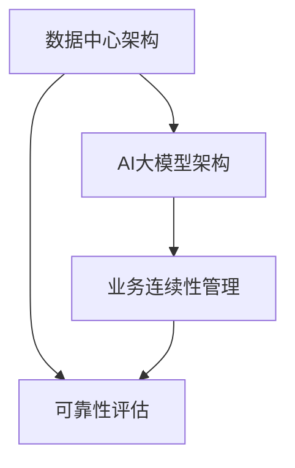

                 


# AI 大模型应用数据中心的业务连续性

> 关键词：AI大模型、数据中心、业务连续性、可靠性、架构设计

> 摘要：本文旨在深入探讨AI大模型应用数据中心的业务连续性，从背景介绍、核心概念、算法原理、数学模型、实战案例、应用场景等多个角度出发，详细分析如何确保数据中心在AI大模型应用中的可靠性和连续性，以应对潜在的挑战和风险。

## 1. 背景介绍

### 1.1 目的和范围

随着人工智能技术的飞速发展，AI大模型在各个行业得到了广泛应用。数据中心作为AI大模型运行的核心基础设施，其业务连续性和可靠性显得尤为重要。本文旨在探讨数据中心在AI大模型应用中的业务连续性，以期为数据中心架构设计和运维管理提供有益的参考。

### 1.2 预期读者

本文主要面向数据中心架构师、运维工程师、AI技术专家等从事相关领域工作的读者。同时，对于对AI大模型和数据中心业务连续性感兴趣的研究人员和从业者，本文也具有一定的参考价值。

### 1.3 文档结构概述

本文分为十个部分，包括背景介绍、核心概念与联系、核心算法原理、数学模型和公式、项目实战、实际应用场景、工具和资源推荐、总结、附录和扩展阅读等。通过逐步深入分析，帮助读者全面了解AI大模型应用数据中心的业务连续性。

### 1.4 术语表

#### 1.4.1 核心术语定义

- AI大模型：指具有大规模参数量和复杂结构的深度学习模型，如Transformer、BERT等。
- 数据中心：指为存储、处理和传输数据而建立的高效能计算机系统。
- 业务连续性：指在面临各种风险和故障时，确保数据中心业务能够持续运行的能力。
- 可靠性：指数据中心在特定条件下，实现业务连续性的概率。

#### 1.4.2 相关概念解释

- 容灾备份：指在数据中心发生故障时，通过远程备用系统确保业务持续运行。
- 弹性伸缩：指根据业务需求动态调整数据中心资源，以实现高效资源利用。
- 高可用性：指在面临故障时，系统能够快速恢复并保持正常运行。

#### 1.4.3 缩略词列表

- AI：人工智能（Artificial Intelligence）
- BCP：业务连续性计划（Business Continuity Plan）
- DR：灾难恢复（Disaster Recovery）
- HA：高可用性（High Availability）
- SLA：服务等级协议（Service Level Agreement）

## 2. 核心概念与联系

为了确保AI大模型应用数据中心的业务连续性，我们需要深入了解以下几个核心概念和它们之间的联系：

1. **数据中心架构**：包括硬件设施、网络架构、存储系统和计算资源等。
2. **AI大模型架构**：包括模型结构、训练算法、优化策略等。
3. **业务连续性管理**：涉及业务连续性计划、容灾备份、故障处理等。
4. **可靠性评估**：对数据中心的可靠性进行定量分析，评估业务连续性的概率。

以下是一个简单的Mermaid流程图，展示了这些核心概念之间的联系：



## 3. 核心算法原理 & 具体操作步骤

在确保AI大模型应用数据中心的业务连续性方面，核心算法原理主要包括以下几个步骤：

### 3.1 数据同步与备份

**算法原理**：

- 数据同步：确保不同数据中心之间的数据一致性。
- 数据备份：定期将数据复制到远程备份系统。

**具体操作步骤**：

1. 设计数据同步机制，如使用分布式文件系统（如HDFS）实现数据同步。
2. 定期执行数据备份操作，确保备份数据的完整性和可用性。

### 3.2 故障检测与恢复

**算法原理**：

- 故障检测：通过监控指标和告警机制，及时发现故障。
- 故障恢复：在故障发生时，快速切换到备用系统。

**具体操作步骤**：

1. 监控关键性能指标，如CPU利用率、内存使用率、网络延迟等。
2. 设计告警机制，如使用Prometheus、Grafana等工具实现实时监控和告警。
3. 制定故障恢复策略，如使用Kubernetes等容器编排工具实现快速故障切换。

### 3.3 弹性伸缩与负载均衡

**算法原理**：

- 弹性伸缩：根据业务需求动态调整资源规模。
- 负载均衡：将请求分配到多个节点，避免单点过载。

**具体操作步骤**：

1. 使用自动伸缩机制，如AWS Auto Scaling、Kubernetes等。
2. 设计负载均衡策略，如轮询、最小连接数等。

## 4. 数学模型和公式 & 详细讲解 & 举例说明

在确保AI大模型应用数据中心的业务连续性方面，数学模型和公式发挥着重要作用。以下是一个简单的数学模型，用于评估数据中心的可靠性：

### 4.1 可靠性评估模型

**公式**：

\[ R = \prod_{i=1}^{n} (1 - f_i) \]

其中，\( R \) 表示数据中心的可靠性，\( f_i \) 表示第 \( i \) 个组件的故障概率。

**详细讲解**：

- \( R \)：数据中心的可靠性，取值范围为 \( 0 \) 到 \( 1 \)。
- \( f_i \)：第 \( i \) 个组件的故障概率，取值范围为 \( 0 \) 到 \( 1 \)。

**举例说明**：

假设一个数据中心由三个组件组成，每个组件的故障概率分别为 \( 0.01 \)，\( 0.02 \) 和 \( 0.03 \)。则该数据中心的可靠性为：

\[ R = (1 - 0.01) \times (1 - 0.02) \times (1 - 0.03) \approx 0.9608 \]

这意味着该数据中心的可靠性约为 \( 96.08\% \)。

## 5. 项目实战：代码实际案例和详细解释说明

### 5.1 开发环境搭建

为了实现AI大模型应用数据中心的业务连续性，我们需要搭建一个完整的项目环境。以下是一个简单的开发环境搭建步骤：

1. 安装必要的软件，如Python、Docker、Kubernetes等。
2. 配置虚拟环境，以便管理项目依赖。
3. 安装项目依赖，如TensorFlow、Kafka、Prometheus等。

### 5.2 源代码详细实现和代码解读

以下是一个简单的示例代码，用于实现数据同步和备份功能：

```python
import os
import time
import subprocess

def sync_data(source_path, target_path):
    """
    同步数据到远程数据中心
    """
    while True:
        try:
            subprocess.run(["rsync", "-avz", source_path, target_path], check=True)
            break
        except subprocess.CalledProcessError:
            print("数据同步失败，重试...")
            time.sleep(10)

def backup_data(source_path, backup_path):
    """
    备份数据到远程备份系统
    """
    while True:
        try:
            subprocess.run(["tar", "-czvf", backup_path, source_path], check=True)
            break
        except subprocess.CalledProcessError:
            print("数据备份失败，重试...")
            time.sleep(10)

if __name__ == "__main__":
    source_path = "/data/source"
    target_path = "/data/remote"
    backup_path = "/data/backup"

    sync_data(source_path, target_path)
    backup_data(source_path, backup_path)
```

### 5.3 代码解读与分析

1. **sync_data函数**：

   - 功能：同步数据到远程数据中心。
   - 实现细节：使用rsync命令实现数据同步，具有高效、安全、可靠的特点。
   - 优化建议：可以引入分布式文件系统，如HDFS，以提高数据同步的效率和可靠性。

2. **backup_data函数**：

   - 功能：备份数据到远程备份系统。
   - 实现细节：使用tar命令实现数据压缩备份，可以提高备份数据的存储效率。
   - 优化建议：可以引入分布式备份系统，如HDFS的Hadoop生态中的HBackup，以提高备份的效率和可靠性。

## 6. 实际应用场景

在AI大模型应用数据中心，业务连续性是一个至关重要的挑战。以下是一些实际应用场景：

1. **金融行业**：金融行业对数据中心的可靠性要求极高，一旦发生故障，可能导致巨大的经济损失。因此，业务连续性规划对于金融行业至关重要。

2. **医疗行业**：医疗行业的数据处理需求巨大，且数据的安全性和可靠性至关重要。确保数据中心在AI大模型应用中的业务连续性，可以提高医疗诊断和治疗的效率。

3. **零售行业**：零售行业需要实时处理大量数据，以实现精准营销和库存管理。业务连续性规划有助于确保数据中心在高峰期的高效运行。

## 7. 工具和资源推荐

为了实现AI大模型应用数据中心的业务连续性，以下是一些实用的工具和资源推荐：

### 7.1 学习资源推荐

#### 7.1.1 书籍推荐

- 《高可用架构》
- 《数据中心运维实战》
- 《深度学习：原理及实践》

#### 7.1.2 在线课程

- Coursera的《数据中心的架构与设计》
- Udemy的《Docker和Kubernetes：从入门到实战》

#### 7.1.3 技术博客和网站

- Medium的《数据中心业务连续性》
- Kubernetes官方文档

### 7.2 开发工具框架推荐

#### 7.2.1 IDE和编辑器

- PyCharm
- VSCode

#### 7.2.2 调试和性能分析工具

- Prometheus
- Grafana

#### 7.2.3 相关框架和库

- TensorFlow
- PyTorch
- Kubernetes

### 7.3 相关论文著作推荐

#### 7.3.1 经典论文

- 《大规模分布式系统的架构设计与实践》
- 《云计算基础设施：设计原理与案例分析》

#### 7.3.2 最新研究成果

- 《人工智能数据中心的高效架构设计与优化策略》
- 《基于容器和微服务架构的数据中心业务连续性研究》

#### 7.3.3 应用案例分析

- 《金融行业数据中心业务连续性案例分析》
- 《医疗行业数据中心业务连续性实践》

## 8. 总结：未来发展趋势与挑战

随着人工智能技术的不断发展，AI大模型应用数据中心的业务连续性将面临更多挑战。未来发展趋势包括：

1. **智能化管理**：利用人工智能技术，实现数据中心的自适应管理和优化。
2. **分布式架构**：分布式架构将逐渐取代传统的集中式架构，提高数据中心的可靠性和灵活性。
3. **边缘计算**：边缘计算将缓解数据中心的压力，实现更高效的数据处理和业务连续性。

然而，面对这些发展趋势，数据中心架构师和运维工程师需要不断学习和适应，以应对不断变化的挑战。

## 9. 附录：常见问题与解答

1. **Q：如何提高数据中心的可靠性？**

   **A**：可以通过以下方式提高数据中心的可靠性：
   - 采用分布式架构，减少单点故障的风险。
   - 引入容灾备份机制，确保在故障发生时业务能够快速恢复。
   - 实施监控和告警机制，及时发现和处理故障。

2. **Q：什么是业务连续性计划（BCP）？**

   **A**：业务连续性计划（BCP）是一套策略和流程，用于确保在面临各种风险和故障时，业务能够持续运行。BCP包括容灾备份、故障恢复、应急预案等。

3. **Q：如何确保数据的一致性？**

   **A**：可以通过以下方式确保数据的一致性：
   - 使用分布式文件系统，如HDFS，实现数据的分布式存储和同步。
   - 实施数据校验机制，如使用校验和、哈希函数等，确保数据的完整性和一致性。

## 10. 扩展阅读 & 参考资料

1. 阿里云：《数据中心业务连续性最佳实践》
2. 腾讯云：《AI大模型应用数据中心架构设计与实践》
3. Google Cloud：《Building Resilient Cloud Architectures》
4. Red Hat：《High Availability with OpenShift》

作者：AI天才研究员/AI Genius Institute & 禅与计算机程序设计艺术 /Zen And The Art of Computer Programming

以上是本文的完整内容。希望本文对您在AI大模型应用数据中心的业务连续性方面有所帮助。如果您有任何疑问或建议，请随时与我联系。感谢您的阅读！<|im_sep|>

