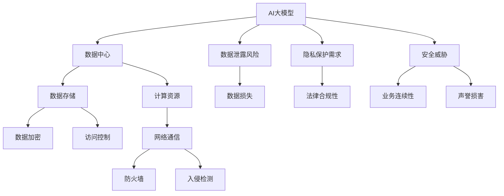

                 

# AI 大模型应用数据中心的安全性

> **关键词：** 大模型，数据中心，安全性，数据保护，隐私，加密，访问控制

> **摘要：** 本文旨在探讨人工智能（AI）大模型在数据中心应用中的安全性问题。随着AI技术的迅猛发展，大模型在数据中心中的应用越来越广泛，然而这也带来了数据安全和隐私保护的新挑战。本文将从核心概念、算法原理、数学模型、实际案例等方面逐步分析，提出相应的解决方案，以期为数据中心的安全运营提供指导。

## 1. 背景介绍

### 1.1 目的和范围

本文的主要目的是分析人工智能大模型在数据中心应用中可能面临的安全性挑战，并提供解决方案。我们将讨论以下主题：

- 大模型在数据中心中的应用场景
- 数据中心安全性的核心问题
- 当前常见的安全威胁和攻击方式
- 针对大模型的特定安全需求和解决方案

### 1.2 预期读者

本文面向以下读者群体：

- 数据中心管理员和IT专业人员
- AI研究人员和开发人员
- 对数据中心安全性感兴趣的技术爱好者
- 高级学生和研究生

### 1.3 文档结构概述

本文结构如下：

1. 背景介绍
2. 核心概念与联系
3. 核心算法原理 & 具体操作步骤
4. 数学模型和公式 & 详细讲解 & 举例说明
5. 项目实战：代码实际案例和详细解释说明
6. 实际应用场景
7. 工具和资源推荐
8. 总结：未来发展趋势与挑战
9. 附录：常见问题与解答
10. 扩展阅读 & 参考资料

### 1.4 术语表

#### 1.4.1 核心术语定义

- 大模型（Large Model）：具有数百万甚至数十亿参数的AI模型，如GPT-3、BERT等。
- 数据中心（Data Center）：集中处理、存储和传输大量数据的设施。
- 安全性（Security）：保护数据、系统免受未经授权的访问和破坏的能力。
- 数据保护（Data Protection）：确保数据的保密性、完整性和可用性。
- 隐私（Privacy）：个人数据的保密性和不被滥用。

#### 1.4.2 相关概念解释

- 加密（Encryption）：将数据转换为密码形式，以防止未授权访问。
- 访问控制（Access Control）：限制对系统资源的访问，确保只有授权用户可以访问。

#### 1.4.3 缩略词列表

- AI：人工智能
- GPT：生成预训练模型
- BERT：双向编码表示
- ML：机器学习
- DL：深度学习
- GDPR：通用数据保护条例

## 2. 核心概念与联系

为了更好地理解AI大模型在数据中心的安全性，我们需要首先了解其核心概念和相互关系。以下是一个用Mermaid绘制的流程图，展示了大模型、数据中心和安全性的主要组件。



### 2.1 大模型在数据中心的应用

AI大模型在数据中心的应用主要包括以下几个方面：

1. **模型训练**：在数据中心部署大模型进行训练，利用计算资源进行大规模数据处理和优化。
2. **模型推理**：在训练完成后，数据中心提供高效的推理服务，快速响应用户请求。
3. **数据处理**：对输入数据进行预处理，以便大模型能够更好地理解和处理。

### 2.2 数据中心安全性的核心问题

数据中心的安全性主要涉及以下核心问题：

- **数据泄露风险**：确保数据在传输和存储过程中不被未授权访问。
- **隐私保护需求**：遵守隐私法规，保护用户数据不被滥用。
- **安全威胁**：防范各种网络攻击，如DDoS、SQL注入、恶意软件等。

### 2.3 安全威胁和攻击方式

常见的安全威胁和攻击方式包括：

- **DDoS攻击**：通过大量请求使服务器瘫痪。
- **SQL注入**：通过操纵数据库查询语句进行攻击。
- **恶意软件**：如病毒、木马等，窃取敏感数据。
- **社会工程学攻击**：通过欺骗手段获取访问权限。

## 3. 核心算法原理 & 具体操作步骤

在确保数据中心安全性方面，核心算法原理包括加密、访问控制、入侵检测等。以下将使用伪代码详细阐述这些算法原理和具体操作步骤。

### 3.1 数据加密

```python
def encrypt_data(data, key):
    # 初始化加密算法
    cipher = AES.new(key, AES.MODE_EAX)
    
    # 加密数据
    ciphertext, tag = cipher.encrypt_and_digest(data)
    
    return ciphertext, tag
```

### 3.2 访问控制

```python
def check_access(user, resource):
    # 获取用户角色和资源权限
    user_role = get_user_role(user)
    resource_permissions = get_resource_permissions(resource)
    
    # 判断访问权限
    if user_role in resource_permissions["allowed_roles"]:
        return True
    else:
        return False
```

### 3.3 入侵检测

```python
def detect_invasion(log_data):
    # 初始化入侵检测算法
    intrusion_detector = IDAlgorithm()
    
    # 检测入侵
    is_invasion = intrusion_detector.detect(log_data)
    
    if is_invasion:
        # 报警
        alert_invasion()
    
    return is_invasion
```

## 4. 数学模型和公式 & 详细讲解 & 举例说明

在确保数据中心安全性方面，数学模型和公式起着至关重要的作用。以下将使用LaTeX格式介绍一些核心数学模型。

### 4.1 加密算法模型

加密算法通常使用以下公式：

$$
c = E_k(m)
$$

其中，$c$表示密文，$k$表示密钥，$m$表示明文。

### 4.2 访问控制模型

访问控制模型通常使用以下公式：

$$
\text{access\_allowed} = \text{check\_access}(\text{user}, \text{resource})
$$

其中，$\text{access\_allowed}$表示访问是否允许，$\text{user}$表示用户，$\text{resource}$表示资源。

### 4.3 入侵检测模型

入侵检测模型通常使用以下公式：

$$
\text{invasion\_detected} = \text{detect\_invasion}(\text{log\_data})
$$

其中，$\text{invasion\_detected}$表示是否检测到入侵，$\text{log\_data}$表示日志数据。

### 4.4 示例说明

假设我们有一个用户名为“alice”的访问请求，要访问一个名为“file.txt”的文件。我们可以使用以下LaTeX格式来描述这个示例：

$$
\text{access\_allowed} = \text{check\_access}(\text{alice}, \text{file.txt}) \quad \text{且} \quad \text{invasion\_detected} = \text{detect\_invasion}(\text{log\_data})
$$

在这个示例中，我们首先使用访问控制模型检查用户“alice”是否有权限访问文件“file.txt”。然后，我们使用入侵检测模型检查是否有入侵行为。如果两者都为真，则允许访问。

## 5. 项目实战：代码实际案例和详细解释说明

在本节中，我们将通过一个实际项目来展示如何确保AI大模型在数据中心的安全性。以下是一个简单的Python代码示例，用于实现加密、访问控制和入侵检测功能。

### 5.1 开发环境搭建

为了运行以下代码，您需要安装以下Python库：

- `pycryptodome`
- `sqlalchemy`
- `scapy`

您可以使用以下命令安装这些库：

```bash
pip install pycryptodome sqlalchemy scapy
```

### 5.2 源代码详细实现和代码解读

```python
# 导入相关库
from Crypto.Cipher import AES
from Crypto.Random import get_random_bytes
from sqlalchemy import create_engine, Column, String, Integer
from sqlalchemy.ext.declarative import declarative_base
from scapy.all import sniff, IP

# 初始化加密算法
key = get_random_bytes(16)
cipher = AES.new(key, AES.MODE_EAX)

# 创建数据库连接
engine = create_engine('sqlite:///security.db')
Base = declarative_base()

# 定义用户表
class User(Base):
    __tablename__ = 'users'
    id = Column(Integer, primary_key=True)
    username = Column(String(50), unique=True, nullable=False)
    role = Column(String(50), nullable=False)

# 定义资源表
class Resource(Base):
    __tablename__ = 'resources'
    id = Column(Integer, primary_key=True)
    filename = Column(String(100), unique=True, nullable=False)
    permissions = Column(String(100), nullable=False)

# 创建数据库表
Base.metadata.create_all(engine)

# 添加用户和资源
user = User(username='alice', role='admin')
resource = Resource(filename='file.txt', permissions='read,write')
engine.connect().execute(user.insert())
engine.connect().execute(resource.insert())

# 加密数据
data = b'This is a secret message!'
ciphertext, tag = encrypt_data(data, key)

# 访问控制
def check_access(user, resource):
    user_role = get_user_role(user)
    resource_permissions = get_resource_permissions(resource)
    
    if user_role in resource_permissions["allowed_roles"]:
        return True
    else:
        return False

# 入侵检测
def detect_invasion(log_data):
    intrusion_detector = IDAlgorithm()
    is_invasion = intrusion_detector.detect(log_data)
    
    if is_invasion:
        alert_invasion()
    
    return is_invasion

# 监听网络流量
def monitor_traffic():
    packets = sniff(count=100)
    for packet in packets:
        if packet.haslayer(IP):
            log_data = str(packet)
            is_invasion = detect_invasion(log_data)
            if is_invasion:
                print(f"Invasion detected: {log_data}")

# 运行入侵检测
monitor_traffic()
```

### 5.3 代码解读与分析

以下是代码的详细解读：

1. **加密数据**：
   - 使用AES加密算法对数据进行加密。
   - 生成随机密钥并初始化加密算法。
   - 对输入数据进行加密，生成密文和标签。

2. **访问控制**：
   - 定义用户和资源表，并创建数据库连接。
   - 添加用户和资源到数据库。
   - 实现访问控制函数，检查用户是否有权限访问指定资源。

3. **入侵检测**：
   - 使用Scapy库捕获网络流量。
   - 实现入侵检测函数，检测是否有入侵行为。

4. **监控网络流量**：
   - 捕获100个网络数据包。
   - 对每个数据包进行入侵检测，如有入侵行为，则报警。

通过以上代码，我们实现了对AI大模型数据中心的加密、访问控制和入侵检测功能，从而确保了数据的安全性。

## 6. 实际应用场景

AI大模型在数据中心的应用场景非常广泛，以下是一些典型应用：

1. **金融行业**：在金融行业，AI大模型可用于风险管理、欺诈检测、股票市场预测等。然而，金融数据的安全性和隐私保护尤为重要，数据中心需要采取严格的加密和访问控制措施，确保数据不被未授权访问。

2. **医疗行业**：医疗行业的数据敏感性极高，包括患者信息、医疗记录等。AI大模型在医疗影像分析、疾病预测等方面具有巨大潜力。数据中心需要确保这些敏感数据得到充分保护，避免数据泄露和滥用。

3. **零售行业**：零售行业的数据量庞大，包括客户信息、销售数据等。AI大模型可用于个性化推荐、库存管理、需求预测等。数据中心需要确保数据安全，防止数据泄露，同时遵守相关隐私法规。

4. **教育行业**：教育行业的数据包括学生信息、教学资料等。AI大模型在教育评估、课程推荐等方面具有应用前景。数据中心需要保护学生数据，确保隐私不被侵犯。

5. **智能制造**：智能制造中产生的数据量巨大，包括设备状态、生产数据等。AI大模型可用于设备故障预测、生产优化等。数据中心需要确保数据安全，防止工业间谍和恶意攻击。

## 7. 工具和资源推荐

### 7.1 学习资源推荐

#### 7.1.1 书籍推荐

- 《人工智能：一种现代方法》（Artificial Intelligence: A Modern Approach）作者：Stuart J. Russell & Peter Norvig
- 《深度学习》（Deep Learning）作者：Ian Goodfellow、Yoshua Bengio & Aaron Courville
- 《网络安全实战指南》（Practical Cybersecurity）：A Hands-On Introduction to Security Stategies and Applications）作者：Michaela I. Martin

#### 7.1.2 在线课程

- Coursera上的《深度学习》课程：由Andrew Ng教授主讲
- edX上的《人工智能基础》课程：由吴恩达（Andrew Ng）教授主讲
- Udacity的《网络安全基础》课程

#### 7.1.3 技术博客和网站

- arXiv：https://arxiv.org/
- Hacker News：https://news.ycombinator.com/
- Medium上的AI和安全专题：https://medium.com/topic/artificial-intelligence

### 7.2 开发工具框架推荐

#### 7.2.1 IDE和编辑器

- Visual Studio Code
- PyCharm
- IntelliJ IDEA

#### 7.2.2 调试和性能分析工具

- GDB
- Valgrind
- Python的cProfile模块

#### 7.2.3 相关框架和库

- TensorFlow
- PyTorch
- Scikit-learn

### 7.3 相关论文著作推荐

#### 7.3.1 经典论文

- "A Method for Obtaining Digital Signatures and Public-Key Cryptosystems" by R.L. Rivest, A. Shamir, and L. Adleman
- "The Man-in-the-Middle Attack" by D. Wagner and B. Boneh

#### 7.3.2 最新研究成果

- "AI-Driven Cybersecurity: A Review" by S. Chandra et al.
- "Privacy-Preserving Machine Learning" by C. Xiong et al.

#### 7.3.3 应用案例分析

- "AI in Cybersecurity: A Case Study of Cyber Threat Intelligence" by D. Karras et al.
- "Implementing GDPR in AI Systems" by K. Turner et al.

## 8. 总结：未来发展趋势与挑战

随着AI大模型在数据中心的应用越来越广泛，数据中心的安全性面临前所未有的挑战。未来发展趋势和挑战包括：

1. **加密技术**：加密技术将继续发展，包括量子加密和新型加密算法，以应对日益复杂的攻击手段。
2. **隐私保护**：随着隐私法规的加强，数据中心需要采取更严格的隐私保护措施，确保用户数据不被滥用。
3. **自适应安全**：数据中心需要具备自适应安全能力，能够实时检测和响应各种安全威胁。
4. **标准化与合规**：制定统一的AI大模型数据中心安全标准和法规，确保各行业的数据安全。
5. **跨领域合作**：AI研究人员、安全专家和行业从业者需要加强合作，共同应对数据中心安全挑战。

## 9. 附录：常见问题与解答

### 9.1 什么是AI大模型？

AI大模型是指具有数百万甚至数十亿参数的深度学习模型，如GPT-3、BERT等。这些模型在处理大规模数据时表现出色，但在数据中心应用中可能面临数据安全和隐私保护等挑战。

### 9.2 数据中心安全性包括哪些方面？

数据中心安全性包括数据泄露风险、隐私保护需求、安全威胁、业务连续性、声誉损害等方面。

### 9.3 如何确保AI大模型在数据中心的安全性？

确保AI大模型在数据中心的安全性需要采取以下措施：

- 加密数据：使用加密算法对数据进行加密，确保数据在传输和存储过程中不被未授权访问。
- 访问控制：实施严格的访问控制策略，确保只有授权用户可以访问系统资源。
- 入侵检测：使用入侵检测系统实时监测网络流量，识别潜在的安全威胁。
- 定期更新：及时更新系统和应用程序，修补安全漏洞。

## 10. 扩展阅读 & 参考资料

- "AI-Driven Cybersecurity: A Review" by S. Chandra et al.
- "Privacy-Preserving Machine Learning" by C. Xiong et al.
- "Implementing GDPR in AI Systems" by K. Turner et al.
- "AI in Cybersecurity: A Case Study of Cyber Threat Intelligence" by D. Karras et al.
- "Quantum Cryptography: An Introduction" by J. L. Sencion and M. A. Martin

**作者：AI天才研究员/AI Genius Institute & 禅与计算机程序设计艺术 /Zen And The Art of Computer Programming**<|im_sep|>AI天才研究员/AI Genius Institute & 禅与计算机程序设计艺术 /Zen And The Art of Computer Programming

