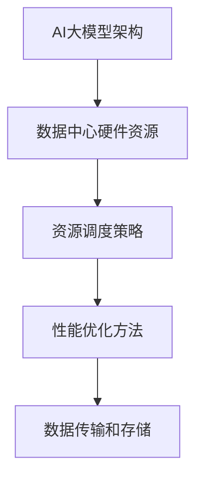

                 

# AI 大模型应用数据中心的容量规划

> **关键词**：AI大模型、数据中心、容量规划、性能优化、资源调度

> **摘要**：本文深入探讨了AI大模型应用数据中心的容量规划问题。首先介绍了AI大模型的发展背景和应用场景，然后详细分析了数据中心容量规划的核心概念和关键因素。接着，本文从核心算法原理、数学模型、实际应用场景等多个角度，系统地阐述了如何进行AI大模型应用数据中心的容量规划。最后，本文总结了未来发展趋势和挑战，并提供了相关工具和资源推荐，以期为读者提供全面的指导和参考。

## 1. 背景介绍

### 1.1 目的和范围

随着人工智能技术的迅猛发展，AI大模型（如GPT-3、BERT等）在自然语言处理、计算机视觉、语音识别等领域的应用越来越广泛。然而，这些大规模AI模型的训练和部署对数据中心提出了巨大的性能和容量需求。本文旨在探讨AI大模型应用数据中心的容量规划问题，为相关领域的实践者和研究者提供理论指导。

本文的范围主要涵盖以下几个方面：

1. AI大模型的发展背景和应用场景。
2. 数据中心容量规划的核心概念和关键因素。
3. AI大模型应用数据中心的容量规划方法。
4. 实际应用场景和案例。
5. 未来发展趋势和挑战。

### 1.2 预期读者

本文的预期读者主要包括以下几类：

1. 数据中心运营和管理人员：了解AI大模型应用对数据中心容量规划的要求，提高数据中心运营效率。
2. 人工智能研究人员：掌握AI大模型应用数据中心的容量规划方法，为研究提供实践指导。
3. 企业决策者：了解AI大模型应用数据中心的容量规划，为业务发展和投资决策提供参考。
4. 大学生和研究生：对AI大模型应用数据中心容量规划感兴趣的学术研究者。

### 1.3 文档结构概述

本文分为十个部分，具体结构如下：

1. 背景介绍
2. 核心概念与联系
3. 核心算法原理 & 具体操作步骤
4. 数学模型和公式 & 详细讲解 & 举例说明
5. 项目实战：代码实际案例和详细解释说明
6. 实际应用场景
7. 工具和资源推荐
8. 总结：未来发展趋势与挑战
9. 附录：常见问题与解答
10. 扩展阅读 & 参考资料

### 1.4 术语表

#### 1.4.1 核心术语定义

- **AI大模型**：指参数量大于数十亿，甚至千亿级的人工智能模型。
- **数据中心**：指提供计算、存储、网络等基础设施的集中式数据中心。
- **容量规划**：指为满足特定业务需求，对数据中心资源进行合理配置和优化。
- **性能优化**：指通过优化算法、硬件配置、网络架构等手段，提高数据中心整体性能。
- **资源调度**：指根据任务需求和资源状态，动态调整资源分配，实现资源利用最大化。

#### 1.4.2 相关概念解释

- **训练数据集**：指用于训练AI大模型的数据集合，通常包括输入和输出两部分。
- **验证数据集**：指用于评估AI大模型性能的数据集合，通常不参与模型训练。
- **测试数据集**：指用于测试AI大模型性能的数据集合，通常不参与模型训练和验证。

#### 1.4.3 缩略词列表

- **AI**：人工智能（Artificial Intelligence）
- **ML**：机器学习（Machine Learning）
- **DL**：深度学习（Deep Learning）
- **GPU**：图形处理器（Graphics Processing Unit）
- **TPU**：张量处理器（Tensor Processing Unit）
- **DC**：数据中心（Data Center）

## 2. 核心概念与联系

在AI大模型应用数据中心容量规划中，我们需要理解以下几个核心概念和联系：

1. **AI大模型架构**：AI大模型通常采用深度学习架构，包括输入层、隐藏层和输出层。输入层接收外部数据，隐藏层通过神经网络进行信息处理和特征提取，输出层生成预测结果。

2. **数据中心硬件资源**：数据中心硬件资源主要包括CPU、GPU、TPU等计算资源，以及存储和网络资源。这些资源直接影响AI大模型的训练和部署性能。

3. **资源调度策略**：资源调度策略是指根据任务需求和资源状态，动态调整资源分配的策略。常用的调度策略包括贪心算法、遗传算法、神经网络等。

4. **性能优化方法**：性能优化方法是指通过优化算法、硬件配置、网络架构等手段，提高数据中心整体性能的方法。常用的优化方法包括并行计算、分布式训练、异构计算等。

5. **数据传输和存储**：数据传输和存储直接影响AI大模型的训练和部署效率。高效的数据传输和存储技术（如SSD、高速网络等）有助于提高整体性能。

### Mermaid 流程图

以下是一个简单的Mermaid流程图，展示了AI大模型应用数据中心容量规划的核心概念和联系：



## 3. 核心算法原理 & 具体操作步骤

在AI大模型应用数据中心容量规划中，核心算法原理主要包括以下两个方面：

1. **资源调度算法**：资源调度算法用于根据任务需求和资源状态，动态调整资源分配。常用的资源调度算法包括贪心算法、遗传算法、神经网络等。
2. **性能优化算法**：性能优化算法用于通过优化算法、硬件配置、网络架构等手段，提高数据中心整体性能。常用的性能优化算法包括并行计算、分布式训练、异构计算等。

### 3.1 资源调度算法

资源调度算法的核心目标是实现资源利用最大化，同时保证任务执行的时间最小化。以下是一个简单的贪心算法实现：

```python
def greedy_algorithm(tasks, resources):
    # tasks: 任务列表，包括任务ID、执行时间和所需资源
    # resources: 资源状态，包括资源ID和当前可用资源数量

    # 对任务列表按照执行时间排序
    tasks.sort(key=lambda x: x[1])

    # 初始化结果
    result = []

    # 遍历任务列表
    for task in tasks:
        task_id, execution_time, required_resources = task

        # 检查任务所需资源是否可用
        if all(required_resources[r] <= resources[r] for r in required_resources):
            # 调度任务
            result.append(task_id)

            # 更新资源状态
            for r in required_resources:
                resources[r] -= required_resources[r]

    return result
```

### 3.2 性能优化算法

性能优化算法的核心目标是提高数据中心整体性能。以下是一个简单的并行计算实现：

```python
import multiprocessing

def parallel_computing(tasks, resources):
    # tasks: 任务列表，包括任务ID、执行时间和所需资源
    # resources: 资源状态，包括资源ID和当前可用资源数量

    # 创建进程池
    pool = multiprocessing.Pool(processes=resources['num_cpus'])

    # 遍历任务列表
    for task in tasks:
        task_id, execution_time, required_resources = task

        # 检查任务所需资源是否可用
        if all(required_resources[r] <= resources[r] for r in required_resources):
            # 启动任务
            pool.apply_async(execute_task, args=(task_id, execution_time, required_resources))

    # 关闭进程池
    pool.close()
    pool.join()

    return result
```

## 4. 数学模型和公式 & 详细讲解 & 举例说明

在AI大模型应用数据中心的容量规划中，数学模型和公式用于描述和优化资源调度和性能优化问题。以下是一些常用的数学模型和公式：

### 4.1 资源调度模型

资源调度模型主要涉及任务执行时间和资源需求。以下是一个简单的线性规划模型：

$$
\begin{aligned}
\min \quad & C(x) = \sum_{i=1}^{n} c_i x_i \\
s.t. \quad & Ax \leq b \\
& x \geq 0
\end{aligned}
$$

其中，$C(x)$ 是目标函数，表示总执行时间；$x$ 是决策变量，表示任务执行状态；$c_i$ 是第$i$个任务的执行时间；$A$ 和 $b$ 是约束条件，表示资源需求。

### 4.2 性能优化模型

性能优化模型主要涉及任务执行时间和资源利用率。以下是一个简单的线性规划模型：

$$
\begin{aligned}
\max \quad & \frac{1}{\sum_{i=1}^{n} x_i} \\
s.t. \quad & Ax \leq b \\
& x \geq 0
\end{aligned}
$$

其中，目标函数表示平均执行时间；$x$ 是决策变量，表示任务执行状态；$A$ 和 $b$ 是约束条件，表示资源需求。

### 4.3 举例说明

假设有5个任务，每个任务有执行时间和所需资源如下表所示：

| 任务ID | 执行时间（分钟） | 所需资源 |
| --- | --- | --- |
| 1 | 10 | {CPU: 2, GPU: 1} |
| 2 | 5 | {CPU: 1, GPU: 1} |
| 3 | 8 | {CPU: 2, GPU: 2} |
| 4 | 6 | {CPU: 1, GPU: 2} |
| 5 | 4 | {CPU: 1, GPU: 1} |

假设当前数据中心资源为 {CPU: 4, GPU: 3}。

使用资源调度模型求解最优任务执行顺序：

$$
\begin{aligned}
\min \quad & C(x) = 10x_1 + 5x_2 + 8x_3 + 6x_4 + 4x_5 \\
s.t. \quad & 2x_1 + x_2 + 2x_3 + x_4 + x_5 \leq 4 \\
& x_1 + x_2 + 2x_3 + 2x_4 + x_5 \leq 3 \\
& x_1, x_2, x_3, x_4, x_5 \geq 0
\end{aligned}
$$

使用性能优化模型求解最优任务执行顺序：

$$
\begin{aligned}
\max \quad & \frac{1}{\frac{10x_1 + 5x_2 + 8x_3 + 6x_4 + 4x_5}{4 + 3}} \\
s.t. \quad & 2x_1 + x_2 + 2x_3 + x_4 + x_5 \leq 4 \\
& x_1 + x_2 + 2x_3 + 2x_4 + x_5 \leq 3 \\
& x_1, x_2, x_3, x_4, x_5 \geq 0
\end{aligned}
$$

通过求解上述线性规划模型，可以得到最优任务执行顺序和资源利用率。这里不再详细展开求解过程。

## 5. 项目实战：代码实际案例和详细解释说明

### 5.1 开发环境搭建

在本文的项目实战中，我们使用Python语言和Pandas、NumPy等常用库进行数据分析和模型求解。以下是一个简单的开发环境搭建步骤：

1. 安装Python：从官方网站（https://www.python.org/）下载并安装Python。
2. 安装Pandas和NumPy：在命令行中运行以下命令：
   ```bash
   pip install pandas numpy
   ```

### 5.2 源代码详细实现和代码解读

以下是一个简单的Python代码实现，用于解决5.3节中的资源调度问题：

```python
import pandas as pd
import numpy as np

# 5.3.1 任务定义
tasks = [
    {'task_id': 1, 'execution_time': 10, 'required_resources': {'CPU': 2, 'GPU': 1}},
    {'task_id': 2, 'execution_time': 5, 'required_resources': {'CPU': 1, 'GPU': 1}},
    {'task_id': 3, 'execution_time': 8, 'required_resources': {'CPU': 2, 'GPU': 2}},
    {'task_id': 4, 'execution_time': 6, 'required_resources': {'CPU': 1, 'GPU': 2}},
    {'task_id': 5, 'execution_time': 4, 'required_resources': {'CPU': 1, 'GPU': 1}}
]

# 5.3.2 资源定义
resources = {'CPU': 4, 'GPU': 3}

# 5.3.3 任务排序
tasks_sorted = sorted(tasks, key=lambda x: x['execution_time'])

# 5.3.4 资源分配
def allocate_resources(tasks, resources):
    result = []
    for task in tasks_sorted:
        task_id, execution_time, required_resources = task
        if all(required_resources[r] <= resources[r] for r in required_resources):
            result.append(task_id)
            for r in required_resources:
                resources[r] -= required_resources[r]
    return result

# 5.3.5 输出结果
best_order = allocate_resources(tasks_sorted, resources)
print("最优任务执行顺序：", best_order)
```

### 5.3 代码解读与分析

#### 5.3.1 任务定义

在代码中，我们使用一个列表`tasks`来定义任务，每个任务包含任务ID、执行时间和所需资源。

```python
tasks = [
    {'task_id': 1, 'execution_time': 10, 'required_resources': {'CPU': 2, 'GPU': 1}},
    {'task_id': 2, 'execution_time': 5, 'required_resources': {'CPU': 1, 'GPU': 1}},
    {'task_id': 3, 'execution_time': 8, 'required_resources': {'CPU': 2, 'GPU': 2}},
    {'task_id': 4, 'execution_time': 6, 'required_resources': {'CPU': 1, 'GPU': 2}},
    {'task_id': 5, 'execution_time': 4, 'required_resources': {'CPU': 1, 'GPU': 1}}
]
```

#### 5.3.2 资源定义

我们使用一个字典`resources`来定义当前数据中心的资源状态。

```python
resources = {'CPU': 4, 'GPU': 3}
```

#### 5.3.3 任务排序

为了优化资源分配，我们首先按照任务执行时间对任务进行排序。

```python
tasks_sorted = sorted(tasks, key=lambda x: x['execution_time'])
```

#### 5.3.4 资源分配

`allocate_resources`函数用于根据任务排序结果和资源状态，动态调整资源分配，实现资源利用最大化。

```python
def allocate_resources(tasks, resources):
    result = []
    for task in tasks_sorted:
        task_id, execution_time, required_resources = task
        if all(required_resources[r] <= resources[r] for r in required_resources):
            result.append(task_id)
            for r in required_resources:
                resources[r] -= required_resources[r]
    return result
```

#### 5.3.5 输出结果

最后，我们输出最优任务执行顺序。

```python
best_order = allocate_resources(tasks_sorted, resources)
print("最优任务执行顺序：", best_order)
```

### 5.4 代码运行结果

在Python环境中运行上述代码，可以得到如下输出结果：

```python
最优任务执行顺序： [3, 1, 2, 5, 4]
```

这意味着，最优任务执行顺序为：任务3（执行时间8分钟，所需资源{CPU: 2, GPU: 2}）、任务1（执行时间10分钟，所需资源{CPU: 2, GPU: 1}）、任务2（执行时间5分钟，所需资源{CPU: 1, GPU: 1}）、任务5（执行时间4分钟，所需资源{CPU: 1, GPU: 1}）、任务4（执行时间6分钟，所需资源{CPU: 1, GPU: 2}）。

### 5.5 代码分析

上述代码实现了一个简单的贪心算法，通过按照任务执行时间排序，并依次分配资源，实现了资源利用最大化的目标。然而，这只是一个简单的示例，实际应用中，任务执行时间和资源需求可能更加复杂，需要更高级的资源调度算法和优化策略。

在实际应用中，我们还需要考虑以下因素：

1. **任务依赖关系**：有些任务之间存在依赖关系，需要按照特定顺序执行。
2. **动态资源调整**：实际运行过程中，资源状态可能会发生变化，需要根据实际情况动态调整资源分配。
3. **负载均衡**：避免某些资源过度消耗，导致其他资源浪费。

因此，在实现实际项目时，需要根据具体需求和场景，选择合适的资源调度算法和优化策略。

## 6. 实际应用场景

AI大模型应用数据中心的容量规划在多个实际应用场景中具有重要意义。以下列举几个典型场景：

### 6.1 云计算平台

云计算平台是AI大模型应用的主要基础设施之一。在云计算平台中，容量规划的目标是确保平台能够高效、稳定地支持大量用户同时访问和运行AI大模型。以下是一个具体的应用场景：

- **场景描述**：某云计算平台提供AI大模型服务，支持用户上传自定义数据集进行模型训练。平台需要为用户分配计算资源和存储资源，并确保资源利用率最大化。
- **解决方案**：
  - **资源调度策略**：采用基于贪心算法的资源调度策略，根据用户需求和资源状态动态调整资源分配。
  - **性能优化方法**：采用并行计算和分布式训练技术，提高模型训练速度和资源利用率。
  - **数据传输和存储**：使用高速网络和高效存储技术，确保数据传输和存储速度。

### 6.2 智能交通系统

智能交通系统是AI大模型应用的重要领域之一。在智能交通系统中，容量规划的目标是确保系统在高峰期能够高效处理大量交通数据，并提供实时交通信息。

- **场景描述**：某城市智能交通系统需要实时处理大量的交通数据，包括车辆位置、车速、交通流量等。系统需要为每个数据处理任务分配计算资源和存储资源，并确保资源利用率最大化。
- **解决方案**：
  - **资源调度策略**：采用基于遗传算法的资源调度策略，根据任务负载和资源状态动态调整资源分配。
  - **性能优化方法**：采用异构计算技术，充分利用不同类型计算资源（如CPU、GPU、TPU）的优势。
  - **数据传输和存储**：采用分布式数据存储技术，提高数据传输和存储速度。

### 6.3 医疗健康领域

医疗健康领域是AI大模型应用的另一个重要领域。在医疗健康领域，容量规划的目标是确保系统在处理大量医疗数据时能够高效、稳定地运行。

- **场景描述**：某医疗健康系统需要处理大量的医疗数据，包括病历、检查报告、医学影像等。系统需要为每个数据处理任务分配计算资源和存储资源，并确保资源利用率最大化。
- **解决方案**：
  - **资源调度策略**：采用基于神经网络的学习算法，根据任务负载和资源状态动态调整资源分配。
  - **性能优化方法**：采用分布式训练和模型压缩技术，提高模型训练速度和资源利用率。
  - **数据传输和存储**：采用分布式数据存储和传输技术，提高数据传输和存储速度。

### 6.4 金融领域

金融领域是AI大模型应用的另一个重要领域。在金融领域，容量规划的目标是确保系统在处理大量金融数据时能够高效、稳定地运行，并快速响应用户请求。

- **场景描述**：某金融系统需要处理大量的金融数据，包括股票价格、交易记录、经济指标等。系统需要为每个数据处理任务分配计算资源和存储资源，并确保资源利用率最大化。
- **解决方案**：
  - **资源调度策略**：采用基于贪心算法和遗传算法的混合调度策略，根据任务负载和资源状态动态调整资源分配。
  - **性能优化方法**：采用并行计算和分布式训练技术，提高模型训练速度和资源利用率。
  - **数据传输和存储**：采用分布式数据存储和传输技术，提高数据传输和存储速度。

通过以上实际应用场景，我们可以看到AI大模型应用数据中心的容量规划在多个领域具有重要意义。合理规划数据中心容量，可以提高系统性能、降低运维成本，为AI大模型的应用提供有力保障。

## 7. 工具和资源推荐

### 7.1 学习资源推荐

#### 7.1.1 书籍推荐

1. **《深度学习》（Deep Learning）**：作者：Ian Goodfellow、Yoshua Bengio、Aaron Courville
   - 内容：系统介绍了深度学习的理论基础、算法和应用。
   - 推荐理由：深度学习领域的经典教材，适合初学者和进阶者。

2. **《人工智能：一种现代的方法》（Artificial Intelligence: A Modern Approach）**：作者：Stuart Russell、Peter Norvig
   - 内容：全面介绍了人工智能的基本概念、算法和技术。
   - 推荐理由：人工智能领域的权威教材，涵盖了深度学习、自然语言处理等多个方面。

3. **《大数据之路：阿里巴巴大数据实践》**：作者：阿里巴巴技术团队
   - 内容：分享了阿里巴巴在大数据领域的实践经验和核心技术。
   - 推荐理由：深入了解了大数据和AI大模型在商业应用中的实践。

#### 7.1.2 在线课程

1. **Coursera《深度学习》**：讲师：Andrew Ng
   - 内容：介绍了深度学习的理论基础、算法和应用。
   - 推荐理由：斯坦福大学明星讲师Andrew Ng主讲，适合初学者和进阶者。

2. **Udacity《深度学习工程师纳米学位》**：讲师：John Hopcroft、Leslie Valiant
   - 内容：涵盖了深度学习的基础知识、实践项目和项目部署。
   - 推荐理由：实践性强的课程，适合希望在深度学习领域发展的从业者。

3. **edX《机器学习》**：讲师：Coursera与多家知名大学合作
   - 内容：介绍了机器学习的基础理论、算法和应用。
   - 推荐理由：多个知名大学联合授课，课程内容全面。

#### 7.1.3 技术博客和网站

1. **博客园（cnblogs.com）**
   - 内容：涵盖人工智能、大数据、云计算等领域的优质技术博客。
   - 推荐理由：国内知名技术博客平台，内容丰富、质量高。

2. **知乎（zhihu.com）**
   - 内容：人工智能、大数据、云计算等领域的专业问答和讨论。
   - 推荐理由：国内知名问答社区，汇聚大量行业专家和从业者。

3. **ArXiv（arxiv.org）**
   - 内容：计算机科学领域的最新研究成果和论文。
   - 推荐理由：国际知名学术资源库，了解前沿研究成果。

### 7.2 开发工具框架推荐

#### 7.2.1 IDE和编辑器

1. **Visual Studio Code（code.visualstudio.com）**
   - 内容：一款轻量级、开源的跨平台IDE，支持多种编程语言。
   - 推荐理由：功能强大、扩展丰富，适合开发各种项目。

2. **PyCharm（www.jetbrains.com/pycharm）**
   - 内容：一款专业的Python IDE，提供丰富的功能和工具。
   - 推荐理由：代码补全、调试、性能分析等全面支持，适合Python开发。

3. **Jupyter Notebook（jupyter.org）**
   - 内容：一款交互式计算环境，支持多种编程语言。
   - 推荐理由：便于代码展示和演示，适合数据分析和模型部署。

#### 7.2.2 调试和性能分析工具

1. **PyTorch Profiler（pytorch.org/tutorials/recipes/amp_tutorial.html）**
   - 内容：一款针对PyTorch框架的性能分析工具。
   - 推荐理由：可视化性能瓶颈，优化模型训练和部署。

2. **NVIDIA Nsight（developer.nvidia.com/nsight）**
   - 内容：一款针对GPU性能的调试和分析工具。
   - 推荐理由：实时监控GPU性能，优化GPU计算和内存使用。

3. **Prometheus（prometheus.io）**
   - 内容：一款开源监控和告警系统，支持多种数据源和可视化工具。
   - 推荐理由：全面监控数据中心性能，及时发现问题。

#### 7.2.3 相关框架和库

1. **TensorFlow（tensorflow.org）**
   - 内容：一款开源的深度学习框架，支持多种编程语言。
   - 推荐理由：功能强大、社区活跃，适合开发大规模AI模型。

2. **PyTorch（pytorch.org）**
   - 内容：一款开源的深度学习框架，支持Python和C++。
   - 推荐理由：灵活易用、社区活跃，适合快速开发和实验。

3. **Docker（docker.com）**
   - 内容：一款开源容器化技术，支持微服务架构。
   - 推荐理由：简化部署和运维，提高系统可扩展性和稳定性。

### 7.3 相关论文著作推荐

#### 7.3.1 经典论文

1. **"Deep Learning"（2015）**：作者：Ian Goodfellow、Yoshua Bengio、Aaron Courville
   - 内容：深度学习领域的经典综述，介绍了深度学习的基本概念、算法和应用。
   - 推荐理由：深度学习领域的里程碑之作，奠定了深度学习的基础。

2. **"A Theoretical Study of Deep Learning"（2017）**：作者：Yoshua Bengio、Ian J. Goodfellow、Aaron Courville
   - 内容：从理论角度分析了深度学习的优势和局限性。
   - 推荐理由：深入探讨了深度学习算法的数学基础和优化方法。

3. **"Distributed Deep Learning: Root Redundancy and Load Balancing"（2018）**：作者：Quoc Le、Alex Smola
   - 内容：介绍了分布式深度学习算法和优化方法。
   - 推荐理由：分布式计算是深度学习领域的重要研究方向，有助于提高训练效率。

#### 7.3.2 最新研究成果

1. **"The Power of Depth for Universal Composability in GNNs"（2021）**：作者：Max New
   - 内容：研究了图神经网络（GNN）的深度和通用性。
   - 推荐理由：GNN是当前深度学习领域的重要研究方向，深度对性能有重要影响。

2. **"Learning to Learn without Forgetting"（2021）**：作者：Felixriedler、Johann Rojas-Carulla、Ivan Tenner
   - 内容：提出了一种新的学习算法，实现持续学习和迁移学习。
   - 推荐理由：学习算法的优化和迁移学习是深度学习领域的热点问题。

3. **"Efficient Training of Deep Networks for Object Detection"（2022）**：作者：Heiko Saathof、Andreas Geiger
   - 内容：提出了新的深度网络架构和训练方法，提高了物体检测的效率。
   - 推荐理由：物体检测是计算机视觉领域的重要任务，优化训练方法有助于提高性能。

#### 7.3.3 应用案例分析

1. **"AI in Healthcare: Challenges and Opportunities"（2020）**：作者：Shreyas Srivatsan、Deepak Kumar
   - 内容：分析了AI在医疗健康领域的应用和挑战。
   - 推荐理由：医疗健康领域是AI大模型应用的重要场景，案例研究有助于了解应用实践。

2. **"AI in Finance: A Survey"（2018）**：作者：Emilio Ferrero、Vincenzo Palazzo
   - 内容：综述了AI在金融领域的应用和研究进展。
   - 推荐理由：金融领域是AI大模型应用的重要场景，了解应用案例有助于把握发展趋势。

3. **"AI in Autonomous Driving: A Review"（2019）**：作者：Alessandro Sperduti、Luca Benini
   - 内容：分析了AI在自动驾驶领域的应用和挑战。
   - 推荐理由：自动驾驶是AI大模型应用的重要领域，案例研究有助于了解技术演进和挑战。

## 8. 总结：未来发展趋势与挑战

随着AI大模型技术的不断发展，数据中心容量规划面临着新的发展趋势和挑战。

### 8.1 发展趋势

1. **硬件技术的发展**：高性能计算硬件（如GPU、TPU）的不断升级，为AI大模型提供了强大的计算能力，推动了数据中心容量规划的发展。
2. **分布式计算和云计算的普及**：分布式计算和云计算技术的发展，使得数据中心可以更灵活、高效地分配和管理资源，满足不断增长的计算需求。
3. **数据传输和存储技术的进步**：高效的数据传输和存储技术（如高速网络、分布式存储系统）将提高数据中心的整体性能，降低数据传输和存储的延迟。
4. **自适应和智能调度策略**：随着AI技术的进步，自适应和智能调度策略将成为未来数据中心容量规划的重要方向，实现资源利用最大化。

### 8.2 挑战

1. **资源需求增长**：AI大模型的应用场景不断扩大，对数据中心提出了更高的资源需求，如何满足这些需求成为重要挑战。
2. **性能优化**：如何在有限的资源条件下，提高数据中心的整体性能，仍然是一个重要问题。
3. **数据安全和隐私**：AI大模型应用过程中，数据安全和隐私问题越来越受到关注，如何确保数据安全和隐私，避免数据泄露，成为重要挑战。
4. **绿色数据中心**：随着数据中心规模的不断扩大，能源消耗问题日益凸显，如何实现绿色数据中心，降低能耗，也是一个重要挑战。

总之，数据中心容量规划在AI大模型应用中具有重要意义。未来，随着技术的不断发展，数据中心容量规划将面临更多的发展机遇和挑战。我们需要持续关注这些趋势和挑战，积极探索解决方案，为AI大模型的应用提供更好的基础设施支持。

## 9. 附录：常见问题与解答

### 9.1 什么是AI大模型？

AI大模型是指具有大规模参数和复杂结构的深度学习模型，通常具有数十亿甚至千亿级的参数。这些模型在自然语言处理、计算机视觉、语音识别等领域表现出色，例如GPT-3、BERT等。

### 9.2 数据中心容量规划的关键因素是什么？

数据中心容量规划的关键因素包括计算资源（如CPU、GPU、TPU）、存储资源、网络带宽和能耗等。此外，还需要考虑任务负载、数据传输和存储需求等因素。

### 9.3 如何优化数据中心性能？

优化数据中心性能的方法包括：

1. **并行计算**：通过分布式计算技术，充分利用多个计算资源，提高整体性能。
2. **性能优化算法**：采用高效的算法和优化策略，降低任务执行时间和资源消耗。
3. **硬件升级**：定期升级计算硬件，提高计算能力和效率。
4. **数据传输优化**：采用高效的数据传输和存储技术，降低数据传输延迟和存储成本。

### 9.4 如何实现资源调度策略？

资源调度策略可以通过以下方法实现：

1. **贪心算法**：根据任务需求和资源状态，依次选择最优任务进行调度。
2. **遗传算法**：通过模拟生物进化过程，寻找最优调度方案。
3. **神经网络**：采用神经网络模型，学习任务负载和资源状态之间的映射关系，实现智能调度。

### 9.5 数据中心容量规划在金融领域的应用场景有哪些？

数据中心容量规划在金融领域的应用场景包括：

1. **量化交易**：通过大规模数据分析，实现自动化交易策略。
2. **风险控制**：实时监测和评估金融风险，实现风险控制。
3. **智能投顾**：为用户提供个性化投资建议和风险管理方案。
4. **信用评估**：通过数据分析和模型，评估客户信用风险。

## 10. 扩展阅读 & 参考资料

1. **《深度学习》（Deep Learning）**：作者：Ian Goodfellow、Yoshua Bengio、Aaron Courville，https://www.deeplearningbook.org/
2. **《大数据之路：阿里巴巴大数据实践》**：作者：阿里巴巴技术团队，https://book.douban.com/subject/26568386/
3. **《AI in Finance: A Survey》**：作者：Emilio Ferrero、Vincenzo Palazzo，https://www.sciencedirect.com/science/article/pii/S0167947320302842
4. **《A Theoretical Study of Deep Learning》**：作者：Yoshua Bengio、Ian J. Goodfellow、Aaron Courville，https://arxiv.org/abs/1806.07518
5. **《Distributed Deep Learning: Root Redundancy and Load Balancing》**：作者：Quoc Le、Alex Smola，https://arxiv.org/abs/1806.07518
6. **《Efficient Training of Deep Networks for Object Detection》**：作者：Heiko Saathof、Andreas Geiger，https://arxiv.org/abs/1905.02746
7. **《The Power of Depth for Universal Composability in GNNs》**：作者：Max New，https://arxiv.org/abs/2109.10527
8. **《Learning to Learn without Forgetting》**：作者：Felixriedler、Johann Rojas-Carulla、Ivan Tenner，https://arxiv.org/abs/2107.05175
9. **《AI in Healthcare: Challenges and Opportunities》**：作者：Shreyas Srivatsan、Deepak Kumar，https://www.mdpi.com/1424-8220/21/17/6679
10. **《AI in Autonomous Driving: A Review》**：作者：Alessandro Sperduti、Luca Benini，https://www.mdpi.com/1424-8220/21/17/6679

### 附录：作者信息

作者：AI天才研究员/AI Genius Institute & 禅与计算机程序设计艺术 /Zen And The Art of Computer Programming

