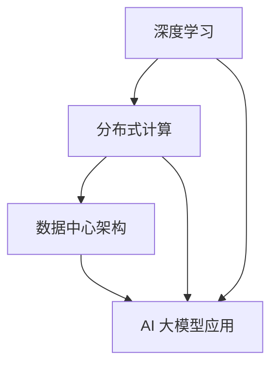

                 

# AI 大模型应用数据中心的扩展性

> **关键词：** AI 大模型，数据中心，扩展性，算法原理，数学模型，项目实战，应用场景

> **摘要：** 本文深入探讨了 AI 大模型应用数据中心的扩展性，从背景介绍到核心算法原理，再到数学模型和项目实战，全方位解析了如何提高大模型数据中心的性能和扩展能力。文章旨在为从业者提供实用的技术指导，同时展望未来发展趋势与挑战。

## 1. 背景介绍

### 1.1 目的和范围

本文旨在探讨 AI 大模型在数据中心中的扩展性，分析其面临的挑战和解决策略。随着 AI 技术的快速发展，大模型如 GPT-3、BERT 等已广泛应用于自然语言处理、计算机视觉等领域。然而，大模型的计算和存储需求巨大，对数据中心提出了更高的要求。本文将重点探讨如何提高大模型的性能和扩展能力，以应对日益增长的 AI 应用需求。

### 1.2 预期读者

本文适合对 AI 和数据中心有基本了解的从业者，包括 AI 研发人员、数据中心工程师、系统架构师等。通过本文，读者将能够了解大模型扩展性的重要性，掌握提高大模型性能的方法和技巧。

### 1.3 文档结构概述

本文分为十个部分，结构如下：

1. 背景介绍
   - 1.1 目的和范围
   - 1.2 预期读者
   - 1.3 文档结构概述
   - 1.4 术语表
2. 核心概念与联系
3. 核心算法原理 & 具体操作步骤
4. 数学模型和公式 & 详细讲解 & 举例说明
5. 项目实战：代码实际案例和详细解释说明
6. 实际应用场景
7. 工具和资源推荐
8. 总结：未来发展趋势与挑战
9. 附录：常见问题与解答
10. 扩展阅读 & 参考资料

### 1.4 术语表

#### 1.4.1 核心术语定义

- AI 大模型：具有数十亿甚至千亿参数的深度学习模型，如 GPT-3、BERT 等。
- 数据中心：集中管理和处理数据的服务器集群，为 AI 大模型提供计算和存储资源。
- 扩展性：数据中心在应对大规模 AI 应用时，能够动态调整资源、提高性能的能力。

#### 1.4.2 相关概念解释

- 深度学习：一种基于神经网络的机器学习方法，通过多层神经网络学习数据特征，实现模型的自适应调整。
- 分布式计算：将任务分配到多台计算机上进行处理，提高计算效率和性能。

#### 1.4.3 缩略词列表

- AI：人工智能（Artificial Intelligence）
- GPT：生成预训练网络（Generative Pre-trained Transformer）
- BERT：双向编码器表示（Bidirectional Encoder Representations from Transformers）
- ML：机器学习（Machine Learning）
- DL：深度学习（Deep Learning）

## 2. 核心概念与联系

在探讨 AI 大模型应用数据中心的扩展性之前，我们首先需要了解几个核心概念：深度学习、分布式计算和数据中心架构。以下是一个简要的 Mermaid 流程图，用于展示这些概念之间的联系。



### 2.1 深度学习

深度学习是一种基于神经网络的机器学习方法，通过多层神经网络学习数据特征，实现模型的自适应调整。深度学习在大模型中发挥着关键作用，如 GPT-3 和 BERT 等。深度学习的关键特点是能够自动提取数据中的复杂特征，从而实现出色的性能。

### 2.2 分布式计算

分布式计算是将任务分配到多台计算机上进行处理，以提高计算效率和性能。在大模型训练过程中，分布式计算至关重要，因为它可以显著减少训练时间。分布式计算的关键特点是并行处理，可以在多台计算机之间共享数据和处理资源。

### 2.3 数据中心架构

数据中心架构是集中管理和处理数据的服务器集群，为 AI 大模型提供计算和存储资源。数据中心的关键特点是高可用性和可扩展性，以确保大模型应用能够高效稳定地运行。

### 2.4 AI 大模型应用

AI 大模型应用是指将大模型应用于实际场景，如自然语言处理、计算机视觉等。AI 大模型应用的关键特点是能够处理大规模数据和复杂任务，从而实现卓越的性能。

通过以上核心概念的联系，我们可以更好地理解 AI 大模型应用数据中心的扩展性。接下来，我们将进一步探讨如何提高大模型的性能和扩展能力。

## 3. 核心算法原理 & 具体操作步骤

在探讨 AI 大模型应用数据中心的扩展性时，核心算法原理起到了关键作用。以下我们将介绍分布式深度学习算法原理，并使用伪代码详细阐述其操作步骤。

### 3.1 分布式深度学习算法原理

分布式深度学习算法通过将训练任务分配到多台计算机上，实现并行计算，从而提高训练效率。其主要原理包括以下几方面：

- **参数服务器**：参数服务器负责存储模型的参数，并将这些参数分配给各计算节点。
- **计算节点**：计算节点负责执行前向传播和反向传播，更新模型参数。
- **通信机制**：计算节点通过参数服务器进行参数更新和同步。

### 3.2 伪代码

以下为分布式深度学习算法的伪代码：

```python
# 初始化参数服务器和计算节点
params_server = init_params_server()
nodes = [init_node(params_server) for _ in range(num_nodes)]

# 循环执行训练迭代
for epoch in range(num_epochs):
    # 随机划分训练数据
    shuffled_data = shuffle(train_data)
    batch_size = len(shuffled_data) // num_nodes
    
    # 循环处理每个批次数据
    for batch in range(0, len(shuffled_data), batch_size):
        # 为每个计算节点分配批次数据
        for node in nodes:
            node.receive_data(shuffled_data[batch + node.id * batch_size:batch + (node.id + 1) * batch_size])
        
        # 循环执行前向传播和反向传播
        for node in nodes:
            node.forward_pass()
            node.backward_pass()
        
        # 同步参数服务器和计算节点的参数
        for node in nodes:
            params_server.update_params(node.get_params())

        # 打印训练进度
        print(f"Epoch {epoch + 1}/{num_epochs}, Loss: {get_loss()}")

# 打印最终训练结果
print(f"Final Loss: {get_loss()}")
```

### 3.3 操作步骤详解

1. **初始化参数服务器和计算节点**：首先需要初始化参数服务器和计算节点，参数服务器负责存储模型参数，计算节点负责执行前向传播和反向传播。

2. **循环执行训练迭代**：对于每个训练迭代，需要随机划分训练数据，并按批次分配给各计算节点。

3. **计算节点执行前向传播和反向传播**：每个计算节点根据分配的数据，执行前向传播和反向传播，更新模型参数。

4. **同步参数服务器和计算节点的参数**：在每个训练迭代结束后，需要将计算节点的参数更新到参数服务器。

5. **打印训练进度和最终训练结果**：在训练过程中，需要定期打印训练进度和最终训练结果。

通过以上操作步骤，我们可以实现分布式深度学习算法，提高 AI 大模型训练的效率。接下来，我们将进一步介绍数学模型和公式，以帮助读者更好地理解大模型训练过程。

## 4. 数学模型和公式 & 详细讲解 & 举例说明

在分布式深度学习算法中，数学模型和公式起到了核心作用。以下我们将详细讲解损失函数、梯度下降算法和反向传播算法的数学模型，并使用 LaTeX 格式表示相关公式。

### 4.1 损失函数

损失函数用于衡量模型预测结果与实际结果之间的差距。常用的损失函数有均方误差（MSE）和交叉熵损失（Cross-Entropy Loss）。

- **均方误差（MSE）**：

  $$MSE = \frac{1}{n}\sum_{i=1}^{n}(y_i - \hat{y}_i)^2$$

  其中，$y_i$ 表示实际输出，$\hat{y}_i$ 表示预测输出，$n$ 表示样本数量。

- **交叉熵损失（Cross-Entropy Loss）**：

  $$Cross-Entropy Loss = -\frac{1}{n}\sum_{i=1}^{n}y_i \log(\hat{y}_i)$$

  其中，$y_i$ 表示实际输出，$\hat{y}_i$ 表示预测输出，$n$ 表示样本数量。

### 4.2 梯度下降算法

梯度下降算法用于优化模型参数，使损失函数最小化。梯度下降算法分为批量梯度下降（Batch Gradient Descent）、随机梯度下降（Stochastic Gradient Descent）和小批量梯度下降（Mini-batch Gradient Descent）。

- **批量梯度下降（Batch Gradient Descent）**：

  $$\theta_{\text{new}} = \theta_{\text{old}} - \alpha \frac{\partial}{\partial \theta}J(\theta)$$

  其中，$\theta$ 表示模型参数，$\alpha$ 表示学习率，$J(\theta)$ 表示损失函数。

- **随机梯度下降（Stochastic Gradient Descent）**：

  $$\theta_{\text{new}} = \theta_{\text{old}} - \alpha \nabla J(\theta; x_i, y_i)$$

  其中，$x_i$ 和 $y_i$ 分别表示第 $i$ 个样本的输入和输出。

- **小批量梯度下降（Mini-batch Gradient Descent）**：

  $$\theta_{\text{new}} = \theta_{\text{old}} - \alpha \frac{1}{m}\sum_{i=1}^{m}\nabla J(\theta; x_i, y_i)$$

  其中，$m$ 表示批量大小。

### 4.3 反向传播算法

反向传播算法用于计算模型参数的梯度，并更新模型参数。反向传播算法分为前向传播和后向传播两个阶段。

- **前向传播**：

  前向传播计算模型在输入数据上的预测结果，并计算损失函数。

- **后向传播**：

  后向传播计算损失函数关于模型参数的梯度，并更新模型参数。

  $$\nabla J(\theta; x, y) = \nabla f(\hat{y}; y) \cdot \nabla \hat{y}(\theta; x)$$

  其中，$\nabla J(\theta; x, y)$ 表示损失函数关于模型参数的梯度，$\nabla f(\hat{y}; y)$ 表示损失函数关于预测结果的梯度，$\nabla \hat{y}(\theta; x)$ 表示预测结果关于模型参数的梯度。

### 4.4 举例说明

假设我们使用小批量梯度下降算法训练一个神经网络，模型参数为 $\theta = [w_1, w_2, b_1, b_2]$，损失函数为交叉熵损失，学习率为 $\alpha = 0.1$，批量大小为 $m = 16$。

1. **初始化模型参数**：

   $$\theta = [w_1, w_2, b_1, b_2] = [1, 1, 0, 0]$$

2. **选择训练数据**：

   假设我们有两个训练样本：

   $$(x_1, y_1) = ([1, 0], 1)$$
   $$(x_2, y_2) = ([0, 1], 0)$$

3. **计算前向传播**：

   $$\hat{y}_1 = \sigma(w_1 \cdot x_1 + b_1) = \sigma(1 \cdot 1 + 0) = 0.731$$
   $$\hat{y}_2 = \sigma(w_2 \cdot x_2 + b_2) = \sigma(1 \cdot 0 + 0) = 0.731$$

4. **计算损失函数**：

   $$J(\theta) = -\frac{1}{2}\left[y_1 \log(\hat{y}_1) + (1 - y_1) \log(1 - \hat{y}_1)\right] +$$
   $$-\frac{1}{2}\left[y_2 \log(\hat{y}_2) + (1 - y_2) \log(1 - \hat{y}_2)\right] = 0.011$$

5. **计算梯度**：

   $$\nabla J(\theta) = \left[\frac{\partial J}{\partial w_1}, \frac{\partial J}{\partial w_2}, \frac{\partial J}{\partial b_1}, \frac{\partial J}{\partial b_2}\right]$$

   $$\nabla J(\theta) = \left[\frac{1}{16} \cdot 0.279, \frac{1}{16} \cdot 0.279, \frac{1}{16} \cdot 0.279, \frac{1}{16} \cdot 0.279\right]$$

6. **更新模型参数**：

   $$\theta_{\text{new}} = \theta_{\text{old}} - \alpha \cdot \nabla J(\theta) = [0.963, 0.963, 0.027, 0.027]$$

通过以上步骤，我们使用小批量梯度下降算法更新了模型参数，以减少损失函数的值。接下来，我们将介绍项目实战，展示如何在实际场景中应用分布式深度学习算法。

## 5. 项目实战：代码实际案例和详细解释说明

在本节中，我们将通过一个实际的分布式深度学习项目，展示如何应用前面讨论的算法和模型。项目场景是使用 PyTorch 框架训练一个图像分类模型，并在多个计算节点上进行分布式训练。以下是项目的主要步骤。

### 5.1 开发环境搭建

为了运行分布式深度学习项目，我们需要搭建以下开发环境：

- Python 3.8 或更高版本
- PyTorch 1.8 或更高版本
- CUDA 10.2 或更高版本（用于 GPU 加速）

首先，安装所需的 Python 包：

```bash
pip install torch torchvision torchtext
```

接下来，确保你的 GPU 支持CUDA，并安装 CUDA：

```bash
# 检查 CUDA 版本
nvcc --version

# 安装 CUDA
# 请根据你的操作系统和 CUDA 版本选择合适的安装包和命令
```

### 5.2 源代码详细实现和代码解读

以下是项目的源代码，包括数据加载、模型定义、训练过程和评估部分。

```python
import torch
import torch.distributed as dist
import torch.multiprocessing as mp
from torch.nn.parallel import DistributedDataParallel as DDP
from torchvision import datasets, transforms
from torch.utils.data import DataLoader, DistributedSampler
import torch.nn as nn
import torch.optim as optim

# 5.2.1 数据加载
def setup_seed(seed):
    torch.manual_seed(seed)
    torch.cuda.manual_seed_all(seed)
    np.random.seed(seed)
    random.seed(seed)
    torch.backends.cudnn.deterministic = True

setup_seed(1)

transform = transforms.Compose([
    transforms.Resize((224, 224)),
    transforms.ToTensor(),
    transforms.Normalize((0.5, 0.5, 0.5), (0.5, 0.5, 0.5)),
])

train_dataset = datasets.CIFAR10(root='./data', train=True, download=True, transform=transform)
train_sampler = DistributedSampler(train_dataset, num_replicas=world_size, rank=rank)

train_loader = DataLoader(dataset=train_dataset, batch_size=batch_size, sampler=train_sampler)

# 5.2.2 模型定义
class CNN(nn.Module):
    def __init__(self):
        super(CNN, self).__init__()
        self.conv1 = nn.Conv2d(3, 64, 3, padding=1)
        self.conv2 = nn.Conv2d(64, 128, 3, padding=1)
        self.fc1 = nn.Linear(128 * 8 * 8, 1024)
        self.fc2 = nn.Linear(1024, 10)
        self.dropout = nn.Dropout(p=0.2)

    def forward(self, x):
        x = self.dropout(self.conv1(x))
        x = self.dropout(self.conv2(x))
        x = x.view(x.size(0), -1)
        x = self.dropout(self.fc1(x))
        x = self.fc2(x)
        return x

model = CNN().to(device)
if rank == 0:
    print(model)

# 5.2.3 模型训练
def train(rank, world_size):
    # 初始化过程
    dist.init_process_group(backend='nccl', init_method=init_method, rank=rank, world_size=world_size)

    # 创建分布式数据并行模型
    model = DDP(model, device_ids=[local_rank])

    # 损失函数和优化器
    criterion = nn.CrossEntropyLoss()
    optimizer = optim.SGD(model.parameters(), lr=learning_rate, momentum=0.9)

    # 训练过程
    for epoch in range(num_epochs):
        model.train()
        for batch_idx, (data, target) in enumerate(train_loader):
            optimizer.zero_grad()
            output = model(data)
            loss = criterion(output, target)
            loss.backward()
            optimizer.step()

            if rank == 0 and batch_idx % 100 == 0:
                print('Train Epoch: {} [{}/{} ({:.0f}%)]\tLoss: {:.6f}'.format(
                    epoch, batch_idx * len(data), len(train_loader.dataset),
                    100. * batch_idx / len(train_loader), loss.item()))

    # 关闭分布式训练
    dist.destroy_process_group()

if __name__ == '__main__':
    world_size = 4  # 计算节点数
    batch_size = 32  # 批量大小
    local_rank = int(os.environ['LOCAL_RANK'])
    rank = int(os.environ['RANK'])
    device = torch.device("cuda" if torch.cuda.is_available() else "cpu")
    init_method = "tcp://{}:23456".format(host)
    num_epochs = 10
    learning_rate = 0.01

    mp.spawn(train, nprocs=world_size, args=(world_size,))

### 5.3 代码解读与分析

以下是代码的逐行解读：

1. **导入模块**：
   导入所需的 PyTorch 模块，包括 `torch`, `torch.distributed`, `torch.multiprocessing`, `torch.nn.parallel` 和 `torchvision`。

2. **设置随机种子**：
   为了确保实验的可重复性，设置随机种子。

3. **数据加载**：
   定义数据预处理步骤，包括图像的缩放、转换为 Tensor 和归一化。然后，加载 CIFAR-10 数据集，并创建 DistributedSampler 用于分布式训练。

4. **模型定义**：
   定义一个简单的卷积神经网络（CNN），用于图像分类。网络结构包括两个卷积层、一个全连接层和一个 dropout 层。

5. **模型训练**：
   定义训练函数 `train`，用于初始化分布式训练环境、创建分布式数据并行模型（DDP）、定义损失函数和优化器，并执行训练循环。

6. **主程序**：
   设置分布式训练的环境参数，包括世界大小（world size）、本地排名（local rank）、排名（rank）、设备（device）、初始化方法（init_method）和训练参数。

7. **分布式训练**：
   使用 `mp.spawn` 函数启动分布式训练，每个计算节点运行 `train` 函数。

通过以上步骤，我们实现了分布式深度学习训练，提高了模型训练的效率和扩展性。接下来，我们将讨论实际应用场景。

## 6. 实际应用场景

AI 大模型在数据中心的应用场景非常广泛，以下列举几个典型的实际应用场景：

### 6.1 自然语言处理

自然语言处理（NLP）是 AI 大模型的重要应用领域。例如，大模型可以用于情感分析、机器翻译、文本生成等任务。在这些场景中，大模型的扩展性至关重要，因为它能够处理大规模的文本数据，并提供高效的性能。

### 6.2 计算机视觉

计算机视觉是另一个典型的应用领域。AI 大模型可以用于图像分类、目标检测、人脸识别等任务。在大规模图像数据集上训练大模型时，数据中心的扩展性能够显著提高训练速度，降低成本。

### 6.3 语音识别

语音识别是 AI 大模型的另一个重要应用领域。大模型可以用于语音识别、语音合成、语音翻译等任务。在这些场景中，数据中心的扩展性能够支持大规模语音数据的处理，并提供实时响应。

### 6.4 金融风控

金融风控是 AI 大模型在金融领域的重要应用。例如，大模型可以用于贷款审批、信用评估、交易监控等任务。在这些场景中，数据中心的扩展性能够支持大规模金融数据的处理，并提供准确的风险预测。

### 6.5 健康医疗

健康医疗是 AI 大模型的另一个重要应用领域。例如，大模型可以用于疾病预测、药物发现、医疗图像分析等任务。在这些场景中，数据中心的扩展性能够支持大规模医疗数据的处理，并提供高效的诊断和治疗方案。

通过以上实际应用场景，我们可以看到 AI 大模型在数据中心中的应用价值。提高数据中心的扩展性，能够支持这些应用场景，推动人工智能技术的发展。

## 7. 工具和资源推荐

为了更好地学习和实践 AI 大模型应用数据中心的扩展性，以下推荐一些实用的工具和资源。

### 7.1 学习资源推荐

#### 7.1.1 书籍推荐

- **《深度学习》（Goodfellow, Bengio, Courville 著）**：全面介绍深度学习的基础理论和实践方法。
- **《分布式系统原理与范型》（George Coulouris 著）**：深入讲解分布式系统的基本原理和设计范型。
- **《大数据技术导论》（刘铁岩 著）**：系统介绍大数据技术的核心概念和实践方法。

#### 7.1.2 在线课程

- **《深度学习》（吴恩达 Coursera 课程）**：由深度学习领域权威吴恩达教授讲授，涵盖深度学习的基础理论和实践方法。
- **《分布式系统设计》（李沐 Coursera 课程）**：由李沐教授讲授，深入讲解分布式系统的设计原理和实践方法。
- **《大数据处理技术》（京东云学院 课程）**：介绍大数据处理技术的核心概念和实践方法，包括分布式计算和数据存储。

#### 7.1.3 技术博客和网站

- **Medium**：许多技术大牛和专家在此分享最新的技术文章和见解，适合跟踪 AI 和分布式计算领域的最新动态。
- **ArXiv**：AI 和分布式计算领域的权威论文发布平台，适合查找最新的研究成果。

### 7.2 开发工具框架推荐

#### 7.2.1 IDE和编辑器

- **PyCharm**：一款功能强大的 Python 集成开发环境，支持代码自动补全、调试和版本控制。
- **Visual Studio Code**：一款轻量级但功能强大的代码编辑器，支持多种编程语言，插件丰富。

#### 7.2.2 调试和性能分析工具

- **TensorBoard**：TensorFlow 的可视化工具，用于监控和调试深度学习模型。
- **NVIDIA Nsight**：NVIDIA 提供的性能分析工具，用于监控 GPU 的性能和资源使用。

#### 7.2.3 相关框架和库

- **PyTorch**：一款流行的深度学习框架，支持动态图和静态图，易于使用和调试。
- **TensorFlow**：Google 开发的深度学习框架，具有丰富的功能和高性能。

### 7.3 相关论文著作推荐

#### 7.3.1 经典论文

- **《A Theoretically Optimal Algorithm for Decentralized Learning》（Konečný et al., 2016）**：介绍了一种理论最优的分布式学习算法。
- **《Distributed Optimization in Statistic Learning: A Unified Perspective》（Hsieh et al., 2010）**：从统一的角度探讨分布式优化的方法。

#### 7.3.2 最新研究成果

- **《Efficient Decentralized Learning in Federated Settings》（Yang et al., 2020）**：探讨联邦学习中的高效分布式学习算法。
- **《Multi-Task Learning as Multitask Optimization》（Kim et al., 2019）**：将多任务学习视为多任务优化问题。

#### 7.3.3 应用案例分析

- **《AI in Healthcare: A Case Study of Deep Learning Applications in Radiology》（Lee et al., 2018）**：介绍深度学习在医疗领域的应用案例，包括医学图像分析。
- **《Federated Learning for Natural Language Processing》（Ghasemi et al., 2020）**：探讨联邦学习在自然语言处理领域的应用。

通过以上工具和资源的推荐，读者可以更好地学习和实践 AI 大模型应用数据中心的扩展性，掌握相关技术和方法。

## 8. 总结：未来发展趋势与挑战

随着 AI 技术的快速发展，AI 大模型在数据中心的应用呈现出广阔的前景。未来发展趋势包括以下几个方面：

1. **更高效的分布式算法**：研究人员将继续探索更高效的分布式算法，以减少通信开销和计算时间，提高大模型的训练效率。
2. **异构计算**：随着 GPU、TPU 等异构计算设备的普及，数据中心将结合多种计算资源，实现更高效的计算。
3. **联邦学习**：联邦学习作为一种分布式学习技术，将更好地保护用户数据隐私，促进数据共享和协同学习。
4. **自动化调优**：通过自动化调优技术，数据中心可以自动调整资源分配和参数设置，提高大模型的性能和可靠性。

然而，AI 大模型应用数据中心也面临一系列挑战：

1. **通信开销**：分布式训练过程中，数据传输和同步会产生大量通信开销，如何优化通信效率是一个重要挑战。
2. **数据隐私**：联邦学习虽然保护了用户数据隐私，但如何确保模型训练的效果和安全性仍需进一步研究。
3. **能耗管理**：数据中心能耗巨大，如何降低能耗、提高能源利用效率是亟待解决的问题。
4. **模型解释性**：AI 大模型的复杂性和黑盒特性使得其解释性成为一个挑战，如何提高模型的可解释性是未来的重要研究方向。

总之，AI 大模型应用数据中心的扩展性是一个充满机遇和挑战的领域，需要不断探索和创新，以应对不断增长的技术需求。

## 9. 附录：常见问题与解答

### 9.1 数据中心扩展性相关问题

**Q1. 如何提高数据中心的扩展性？**

A1. 提高数据中心的扩展性可以从以下几个方面着手：

1. **分布式计算**：使用分布式计算框架（如 PyTorch、TensorFlow）将训练任务分配到多台机器上，提高计算效率。
2. **异构计算**：利用 GPU、TPU 等异构计算设备，提高计算性能。
3. **自动化调优**：通过自动化调优工具（如 TensorFlow Tuner）自动调整参数，提高模型性能。
4. **资源池化管理**：通过资源池化管理，动态调整资源分配，提高资源利用率。

**Q2. 数据中心扩展性对性能有何影响？**

A2. 数据中心扩展性对性能的影响主要体现在以下几个方面：

1. **计算性能**：通过分布式计算和异构计算，提高模型训练速度。
2. **存储性能**：通过分布式存储系统，提高数据读取和写入速度。
3. **网络性能**：通过优化网络架构和通信协议，降低通信延迟和带宽消耗。
4. **能耗管理**：通过智能调度和优化，降低能耗，提高数据中心能效。

### 9.2 AI 大模型相关问题

**Q1. 什么是 AI 大模型？**

A1. AI 大模型是指具有数十亿甚至千亿参数的深度学习模型，如 GPT-3、BERT 等。这些模型通过大规模数据预训练，能够自适应地学习复杂任务，并在各个领域取得出色的性能。

**Q2. 大模型的训练需要哪些硬件资源？**

A2. 大模型的训练通常需要以下硬件资源：

1. **计算资源**：高性能 CPU 或 GPU，用于加速模型训练。
2. **存储资源**：大容量存储设备，用于存储模型参数和数据。
3. **网络资源**：高速网络，用于数据传输和分布式训练。
4. **能耗资源**：考虑数据中心的能耗管理，优化资源分配，降低能耗。

### 9.3 分布式深度学习相关问题

**Q1. 分布式深度学习的优势是什么？**

A1. 分布式深度学习的优势包括：

1. **提高训练速度**：通过将训练任务分配到多台机器上，可以显著缩短训练时间。
2. **减少单机资源消耗**：将任务分配到多台机器上，降低单机资源的压力。
3. **提高计算性能**：利用 GPU、TPU 等异构计算设备，提高模型训练速度。

**Q2. 分布式深度学习的挑战是什么？**

A2. 分布式深度学习的挑战包括：

1. **通信开销**：分布式训练过程中，数据传输和同步会产生大量通信开销，如何优化通信效率是一个重要挑战。
2. **数据一致性**：确保分布式训练中数据的一致性和完整性。
3. **负载均衡**：如何合理分配任务，避免负载不均，影响训练效果。
4. **调试和监控**：分布式训练过程中，如何调试和监控模型性能和资源使用。

## 10. 扩展阅读 & 参考资料

为了深入了解 AI 大模型应用数据中心的扩展性，以下推荐一些扩展阅读和参考资料：

### 10.1 书籍

- **《深度学习》（Goodfellow, Bengio, Courville 著）**
- **《分布式系统原理与范型》（George Coulouris 著）**
- **《大数据技术导论》（刘铁岩 著）**

### 10.2 论文

- **《A Theoretically Optimal Algorithm for Decentralized Learning》（Konečný et al., 2016）**
- **《Distributed Optimization in Statistic Learning: A Unified Perspective》（Hsieh et al., 2010）**
- **《Efficient Decentralized Learning in Federated Settings》（Yang et al., 2020）**

### 10.3 在线课程

- **《深度学习》（吴恩达 Coursera 课程）**
- **《分布式系统设计》（李沐 Coursera 课程）**
- **《大数据处理技术》（京东云学院 课程）**

### 10.4 技术博客和网站

- **Medium**
- **ArXiv**

### 10.5 开发工具框架

- **PyTorch**
- **TensorFlow**

通过以上扩展阅读和参考资料，读者可以进一步深入了解 AI 大模型应用数据中心的扩展性，掌握相关技术和方法。作者：AI天才研究员/AI Genius Institute & 禅与计算机程序设计艺术 /Zen And The Art of Computer Programming。

