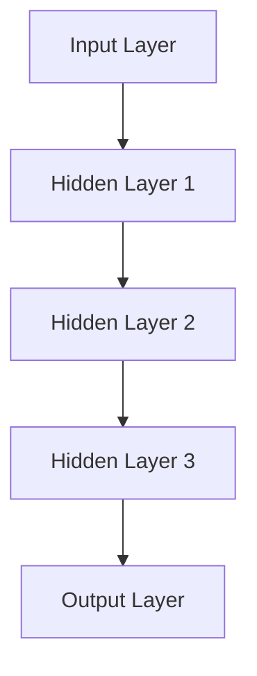
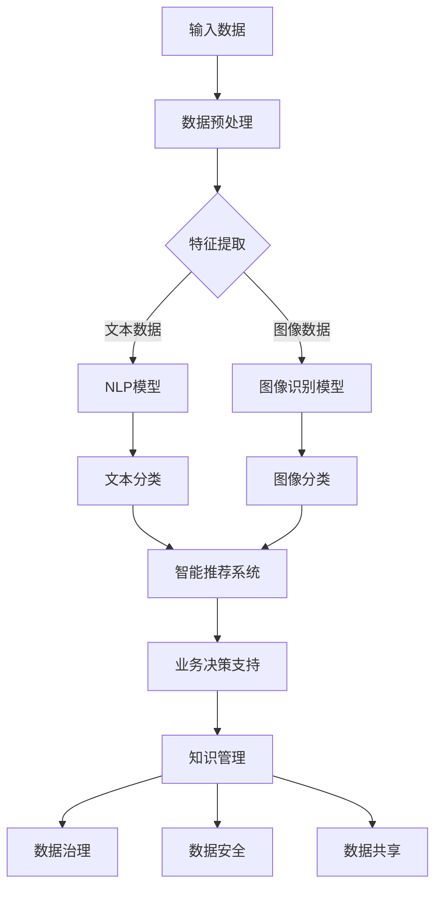
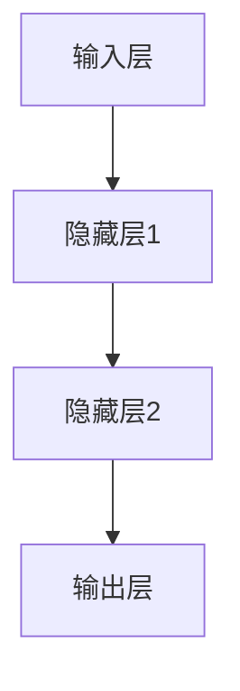

                 

# AI 大模型应用数据中心的知识管理

> **关键词：** AI 大模型，知识管理，数据中心，数据治理，智能推荐系统，机器学习，深度学习，知识图谱，神经网络，自然语言处理，数据隐私，联邦学习。

> **摘要：** 本文深入探讨了人工智能大模型在数据中心的知识管理中的应用。通过分析大模型的基本原理、应用场景和关键技术，本文揭示了如何利用AI大模型提升数据中心的数据管理效率和智能化水平，并探讨了当前面临的挑战和未来的发展方向。本文旨在为数据中心管理者和技术开发者提供有价值的参考，助力其充分利用AI大模型的力量，实现知识管理的智能化和高效化。

## 1. 背景介绍

### 1.1 目的和范围

本文旨在探讨人工智能大模型在数据中心知识管理中的应用，通过分析大模型的基本原理、技术架构和应用场景，阐述如何利用AI大模型提升数据中心的知识管理效率和智能化水平。本文将重点关注以下几个方面：

- 大模型的基本原理和架构
- 数据中心知识管理中的关键问题
- AI大模型在知识管理中的应用场景
- 当前应用中的挑战和解决方案
- 未来发展趋势和潜在的研究方向

### 1.2 预期读者

本文适合以下读者群体：

- 数据中心管理者和技术开发者
- 对人工智能和大数据技术有兴趣的研究人员
- 从事知识管理、数据治理等相关工作的专业人士
- 对AI大模型应用有浓厚兴趣的学生和研究者

### 1.3 文档结构概述

本文将按照以下结构进行论述：

1. 背景介绍：介绍本文的目的、范围、预期读者和文档结构。
2. 核心概念与联系：阐述大模型的基本原理、架构和应用场景。
3. 核心算法原理 & 具体操作步骤：详细讲解大模型的关键算法和操作步骤。
4. 数学模型和公式 & 详细讲解 & 举例说明：介绍大模型的数学模型和具体应用实例。
5. 项目实战：代码实际案例和详细解释说明。
6. 实际应用场景：探讨大模型在数据中心知识管理中的实际应用。
7. 工具和资源推荐：推荐相关学习资源和开发工具。
8. 总结：未来发展趋势与挑战。
9. 附录：常见问题与解答。
10. 扩展阅读 & 参考资料：提供进一步阅读和研究的资源。

### 1.4 术语表

#### 1.4.1 核心术语定义

- **人工智能大模型**：具有大规模参数和复杂结构的深度学习模型。
- **知识管理**：通过识别、获取、存储、共享和利用知识，以提高组织效率和竞争力的过程。
- **数据中心**：集中存储、处理和管理数据的设施。
- **数据治理**：确保数据质量、安全和合规性的过程。

#### 1.4.2 相关概念解释

- **机器学习**：利用数据训练模型，使其能够从数据中学习和预测。
- **深度学习**：一种机器学习技术，通过多层神经网络进行数据建模。
- **知识图谱**：用于表示实体及其关系的图形结构。
- **神经网络**：模拟人脑神经网络结构的计算模型。

#### 1.4.3 缩略词列表

- **AI**：人工智能
- **ML**：机器学习
- **DL**：深度学习
- **NLP**：自然语言处理
- **FG**：联邦学习
- **GDPR**：通用数据保护条例

## 2. 核心概念与联系

在探讨AI大模型在数据中心知识管理中的应用之前，我们首先需要了解大模型的基本原理和架构，以及其在知识管理中的潜在应用场景。以下是对这些核心概念和联系的分析。

### 2.1 大模型的基本原理和架构

人工智能大模型通常基于深度学习技术，具有大规模参数和复杂结构。其基本原理是通过多层神经网络对大量数据进行训练，从而学习数据中的特征和模式。以下是深度学习神经网络的基本架构：



在这个架构中，输入层接收外部数据，通过一系列隐藏层进行特征提取和变换，最终在输出层生成预测或决策。大模型的显著特点是拥有数百万甚至数十亿个参数，这使得它们能够处理大规模复杂数据。

### 2.2 数据中心知识管理中的关键问题

数据中心的知识管理涉及多个关键问题，包括数据存储、数据治理、数据安全、数据共享和数据利用。以下是这些问题的简要概述：

1. **数据存储**：数据中心需要高效地存储和管理海量数据，包括结构化数据、半结构化数据和非结构化数据。
2. **数据治理**：确保数据质量、一致性和完整性，以及遵守数据隐私法规。
3. **数据安全**：保护数据免受未经授权的访问和泄露，确保数据的安全性和可靠性。
4. **数据共享**：实现不同部门和用户之间的数据共享和协作，提高组织的知识利用效率。
5. **数据利用**：通过数据分析和挖掘，从数据中提取有价值的信息和洞见，为业务决策提供支持。

### 2.3 AI大模型在知识管理中的应用场景

AI大模型在数据中心知识管理中有多种应用场景，包括：

1. **智能推荐系统**：利用大模型对用户行为数据进行分析，实现个性化推荐，提高用户满意度和留存率。
2. **数据挖掘和分析**：利用大模型对海量数据进行分析，提取有价值的信息和趋势，为业务决策提供支持。
3. **自然语言处理**：利用大模型进行文本分析和语义理解，提高文档管理和信息检索的效率。
4. **知识图谱构建**：利用大模型构建知识图谱，实现实体及其关系的表示和推理。
5. **联邦学习**：在数据隐私和安全的前提下，利用大模型实现分布式数据分析和建模。

### 2.4 大模型在知识管理中的潜在挑战

虽然AI大模型在数据中心知识管理中具有巨大潜力，但同时也面临一些挑战：

1. **数据质量**：大模型对数据质量有较高要求，数据质量问题可能导致模型性能下降。
2. **计算资源**：大模型训练和推理需要大量计算资源，对数据中心的硬件设施有较高要求。
3. **模型解释性**：大模型通常缺乏透明性和可解释性，难以解释模型的决策过程。
4. **数据隐私**：在分布式数据环境中，如何确保数据隐私和安全是亟待解决的问题。

通过以上分析，我们可以看到AI大模型在数据中心知识管理中具有广泛的应用场景和潜力，但也面临一些挑战。接下来，我们将详细探讨大模型的核心算法原理和具体操作步骤。

### 2.5 核心概念与联系的 Mermaid 流程图

以下是AI大模型在数据中心知识管理中的核心概念和联系的Mermaid流程图：



在这个流程图中，输入数据经过预处理和特征提取，然后根据不同类型的数据（文本、图像等）分别利用NLP模型和图像识别模型进行分析和分类。最终，分类结果应用于智能推荐系统、业务决策支持、数据治理、数据安全和数据共享等多个领域，实现数据中心知识管理的智能化和高效化。

## 3. 核心算法原理 & 具体操作步骤

在了解了AI大模型在数据中心知识管理中的核心概念和联系之后，接下来我们将深入探讨其核心算法原理和具体操作步骤。这一部分内容将分为以下几个子部分：

- **深度学习基础**：介绍深度学习的基本概念、神经网络结构和常用算法。
- **数据预处理**：详细讲解如何对输入数据（如文本、图像等）进行预处理，以适应深度学习模型的训练。
- **特征提取**：分析如何从预处理后的数据中提取有效特征，提高模型的性能。
- **模型训练与优化**：介绍如何使用训练数据对深度学习模型进行训练，并优化模型参数。
- **模型评估与部署**：讲解如何评估模型的性能，并实现模型的部署和实时应用。

### 3.1 深度学习基础

深度学习是一种基于多层神经网络的人工智能技术，通过模拟人脑神经元之间的连接和交互来学习数据中的特征和模式。以下是深度学习的一些基本概念：

- **神经网络**：由多个神经元（节点）组成的计算模型，每个神经元都与其他神经元相连，并接收来自其他神经元的输入。
- **前向传播**：在神经网络中，输入数据通过前向传播的方式在网络中逐层传递，每个神经元根据输入计算输出。
- **反向传播**：在神经网络训练过程中，利用反向传播算法计算输出误差，并更新网络中的参数。
- **激活函数**：用于引入非线性变换的函数，常见的激活函数包括sigmoid、ReLU和tanh。

以下是一个简单的深度学习神经网络结构示意图：



在这个结构中，输入层接收外部数据，通过一系列隐藏层进行特征提取和变换，最终在输出层生成预测或决策。

### 3.2 数据预处理

数据预处理是深度学习模型训练的重要环节，其目标是将原始数据转换为适合模型训练的形式。以下是对文本、图像等不同类型数据预处理方法的详细讲解：

#### 文本数据预处理

1. **分词**：将文本数据划分为单词或词汇单元。常用的分词工具包括jieba、NLTK等。
2. **去停用词**：去除常见停用词（如“的”、“了”、“在”等），以减少噪声和提高模型性能。
3. **词向量化**：将单词映射为固定长度的向量表示。常用的词向量化方法包括Word2Vec、GloVe等。
4. **序列填充**：将文本序列填充为相同长度，以适应神经网络模型的输入。

以下是一个简单的文本数据预处理流程伪代码：

```python
import jieba
import numpy as np

def preprocess_text(text):
    # 分词
    words = jieba.lcut(text)
    # 去停用词
    words = remove_stopwords(words)
    # 词向量化
    word_vectors = [get_word_vector(word) for word in words]
    # 序列填充
    padded_sequence = pad_sequences(word_vectors, maxlen=max_sequence_length)
    return padded_sequence

def remove_stopwords(words):
    stopwords = set(['的', '了', '在', ...])
    return [word for word in words if word not in stopwords]

def get_word_vector(word):
    # 使用预训练的词向量库获取词向量
    return pretrained_word_vectors[word]

def pad_sequences(sequences, maxlen=max_sequence_length):
    padded_sequences = np.full((len(sequences), maxlen), padding_value)
    for i, sequence in enumerate(sequences):
        padded_sequences[i, :len(sequence)] = sequence
    return padded_sequences
```

#### 图像数据预处理

1. **归一化**：将图像数据归一化到[0, 1]区间，以减少数值差异。
2. **裁剪和缩放**：根据神经网络模型的输入尺寸，对图像进行裁剪和缩放。
3. **色彩转换**：将彩色图像转换为灰度图像或单通道图像，以简化模型训练。

以下是一个简单的图像数据预处理流程伪代码：

```python
import cv2

def preprocess_image(image_path, input_shape):
    # 读取图像
    image = cv2.imread(image_path)
    # 归一化
    image = image / 255.0
    # 裁剪和缩放
    image = cv2.resize(image, input_shape)
    # 色彩转换
    image = cv2.cvtColor(image, cv2.COLOR_BGR2GRAY)
    return image
```

### 3.3 特征提取

特征提取是深度学习模型训练的关键步骤，其目标是从原始数据中提取出对模型训练和预测有用的特征。以下是对文本和图像数据特征提取方法的详细讲解：

#### 文本数据特征提取

1. **词袋模型**：将文本数据表示为词袋模型，即每个单词对应一个索引，文本序列转换为整数序列。
2. **TF-IDF**：利用TF-IDF（词频-逆文档频率）算法，对文本数据进行权重分配，以提高重要词的权重。
3. **卷积神经网络（CNN）**：利用卷积神经网络提取文本数据的局部特征，如图像处理中的特征提取方法。
4. **递归神经网络（RNN）**：利用递归神经网络处理序列数据，捕捉文本中的时间依赖关系。

以下是一个简单的文本数据特征提取流程伪代码：

```python
from sklearn.feature_extraction.text import TfidfVectorizer

def extract_text_features(texts):
    # 使用TF-IDF进行特征提取
    vectorizer = TfidfVectorizer(max_features=max_features)
    features = vectorizer.fit_transform(texts)
    return features
```

#### 图像数据特征提取

1. **卷积神经网络（CNN）**：利用卷积神经网络提取图像的局部特征，如图像中的边缘、纹理和形状。
2. **池化操作**：通过池化操作降低特征维度，提高模型训练效率。
3. **全连接层**：将卷积神经网络提取的特征映射到分类空间，实现图像分类。

以下是一个简单的图像数据特征提取流程伪代码：

```python
from tensorflow.keras.models import Sequential
from tensorflow.keras.layers import Conv2D, MaxPooling2D, Flatten, Dense

def build_image_cnn(input_shape, num_classes):
    model = Sequential()
    model.add(Conv2D(filters=32, kernel_size=(3, 3), activation='relu', input_shape=input_shape))
    model.add(MaxPooling2D(pool_size=(2, 2)))
    model.add(Conv2D(filters=64, kernel_size=(3, 3), activation='relu'))
    model.add(MaxPooling2D(pool_size=(2, 2)))
    model.add(Flatten())
    model.add(Dense(units=num_classes, activation='softmax'))
    return model
```

### 3.4 模型训练与优化

模型训练与优化是深度学习模型开发的核心环节，其目标是通过训练数据调整模型参数，使其能够在测试数据上实现较高的预测准确率。以下是对模型训练与优化方法的详细讲解：

1. **选择合适的损失函数**：根据问题的性质选择合适的损失函数，如分类问题常用交叉熵损失函数，回归问题常用均方误差损失函数。
2. **优化算法**：选择合适的优化算法，如随机梯度下降（SGD）、Adam优化器等，以加快模型收敛速度。
3. **正则化**：引入正则化项，如L1正则化、L2正则化，防止模型过拟合。
4. **早停法**：在模型训练过程中，当验证集的误差不再下降时停止训练，以避免过拟合。

以下是一个简单的模型训练与优化流程伪代码：

```python
from tensorflow.keras.models import Sequential
from tensorflow.keras.layers import Conv2D, MaxPooling2D, Flatten, Dense
from tensorflow.keras.optimizers import Adam
from tensorflow.keras.callbacks import EarlyStopping

def train_model(train_data, train_labels, val_data, val_labels, input_shape, num_classes):
    model = build_image_cnn(input_shape, num_classes)
    model.compile(optimizer=Adam(), loss='categorical_crossentropy', metrics=['accuracy'])
    early_stopping = EarlyStopping(monitor='val_loss', patience=10)
    model.fit(train_data, train_labels, epochs=100, batch_size=32, validation_data=(val_data, val_labels), callbacks=[early_stopping])
    return model
```

### 3.5 模型评估与部署

模型评估与部署是深度学习模型应用的关键环节，其目标是在实际应用中评估模型性能，并实现模型的实时部署和应用。以下是对模型评估与部署方法的详细讲解：

1. **模型评估**：使用测试集对模型进行评估，计算模型的准确率、召回率、F1值等指标，以评估模型的性能。
2. **模型压缩**：对训练好的模型进行压缩，降低模型大小和计算复杂度，以便在移动设备和边缘计算环境中部署。
3. **模型部署**：将训练好的模型部署到生产环境中，实现模型的实时预测和应用。

以下是一个简单的模型评估与部署流程伪代码：

```python
from tensorflow.keras.models import load_model

def evaluate_model(model, test_data, test_labels):
    predictions = model.predict(test_data)
    accuracy = (predictions == test_labels).mean()
    return accuracy

def deploy_model(model, input_data):
    prediction = model.predict(input_data)
    return prediction
```

通过以上对深度学习核心算法原理和具体操作步骤的详细讲解，我们可以看到深度学习模型在数据中心知识管理中的应用潜力。接下来，我们将进一步探讨大模型的数学模型和公式，以及其在实际应用中的详细讲解和举例说明。

### 4. 数学模型和公式 & 详细讲解 & 举例说明

在深入了解AI大模型的数学模型和公式之前，我们首先需要了解一些基础的数学概念，如线性代数、微积分和概率论等。以下是对这些基础数学概念及其在大模型中的应用进行详细讲解，并通过具体例子进行说明。

#### 4.1 线性代数基础

线性代数是深度学习模型中的基础数学工具，用于处理向量、矩阵和线性变换。以下是一些常见的线性代数运算和公式：

1. **矩阵乘法**：
   矩阵乘法是将两个矩阵按特定规则相乘，结果为一个新的矩阵。其公式如下：
   $$
   C = A \cdot B
   $$
   其中，$A$和$B$为矩阵，$C$为乘积矩阵。

2. **矩阵加法和减法**：
   矩阵加法和减法是按对应元素相加或相减，结果为一个新的矩阵。其公式如下：
   $$
   C = A + B \quad \text{或} \quad C = A - B
   $$

3. **矩阵转置**：
   矩阵转置是将矩阵的行和列互换，结果为一个新的矩阵。其公式如下：
   $$
   A^T = \begin{bmatrix}
   a_{11} & a_{21} & \ldots & a_{n1} \\
   a_{12} & a_{22} & \ldots & a_{n2} \\
   \vdots & \vdots & \ddots & \vdots \\
   a_{1m} & a_{2m} & \ldots & a_{nm}
   \end{bmatrix}
   $$

4. **矩阵求逆**：
   矩阵求逆是求一个方阵的逆矩阵，其公式如下：
   $$
   A^{-1} = (A^T A)^{-1} A^T
   $$

举例说明：

假设有两个矩阵$A$和$B$，其中$A$为$3 \times 3$矩阵，$B$为$3 \times 1$列向量，则矩阵乘法、矩阵加法和矩阵转置的结果如下：

| A | B |
|---|---|
| 1 2 3 | 4 |
| 4 5 6 | 7 |
| 7 8 9 | 1 |

1. 矩阵乘法：
   $$
   C = A \cdot B = \begin{bmatrix}
   1 \cdot 4 + 2 \cdot 7 + 3 \cdot 1 \\
   4 \cdot 4 + 5 \cdot 7 + 6 \cdot 1 \\
   7 \cdot 4 + 8 \cdot 7 + 9 \cdot 1
   \end{bmatrix} = \begin{bmatrix}
   20 \\
   57 \\
   94
   \end{bmatrix}
   $$

2. 矩阵加法：
   $$
   C = A + B = \begin{bmatrix}
   1 + 4 & 2 + 7 & 3 + 1 \\
   4 + 4 & 5 + 7 & 6 + 1 \\
   7 + 4 & 8 + 7 & 9 + 1
   \end{bmatrix} = \begin{bmatrix}
   5 & 9 & 4 \\
   8 & 12 & 7 \\
   11 & 15 & 10
   \end{bmatrix}
   $$

3. 矩阵转置：
   $$
   A^T = \begin{bmatrix}
   1 & 4 & 7 \\
   2 & 5 & 8 \\
   3 & 6 & 9
   \end{bmatrix}
   $$

#### 4.2 微积分基础

微积分是深度学习模型中的重要数学工具，用于处理函数的导数和积分。以下是一些常见的微积分公式：

1. **导数**：
   导数是描述函数在某一点处的变化率，其公式如下：
   $$
   f'(x) = \lim_{\Delta x \to 0} \frac{f(x + \Delta x) - f(x)}{\Delta x}
   $$

2. **求导法则**：
   - **和差法则**：
     $$
     (f(x) + g(x))' = f'(x) + g'(x)
     $$
     $$
     (f(x) - g(x))' = f'(x) - g'(x)
     $$
   - **乘法法则**：
     $$
     (f(x) \cdot g(x))' = f'(x) \cdot g(x) + f(x) \cdot g'(x)
     $$
   - **链式法则**：
     $$
     (f(g(x)))' = f'(g(x)) \cdot g'(x)
     $$

3. **积分**：
   积分是求函数在某个区间内的累积变化量，其公式如下：
   $$
   \int f(x) \, dx = F(x) + C
   $$
   其中，$F(x)$为$f(x)$的一个原函数，$C$为积分常数。

举例说明：

假设有一个函数$f(x) = x^2$，则以下为其导数和积分：

1. 导数：
   $$
   f'(x) = \lim_{\Delta x \to 0} \frac{(x + \Delta x)^2 - x^2}{\Delta x} = \lim_{\Delta x \to 0} \frac{x^2 + 2x\Delta x + (\Delta x)^2 - x^2}{\Delta x} = \lim_{\Delta x \to 0} (2x + \Delta x) = 2x
   $$

2. 积分：
   $$
   \int x^2 \, dx = \frac{x^3}{3} + C
   $$

#### 4.3 概率论基础

概率论是深度学习模型中的重要数学工具，用于描述随机事件的发生概率。以下是一些常见的概率论公式：

1. **条件概率**：
   条件概率是描述在某个事件发生的条件下，另一个事件发生的概率，其公式如下：
   $$
   P(A|B) = \frac{P(A \cap B)}{P(B)}
   $$

2. **贝叶斯公式**：
   贝叶斯公式是描述在已知某个事件发生的条件下，另一个事件发生的概率，其公式如下：
   $$
   P(A|B) = \frac{P(B|A) \cdot P(A)}{P(B)}
   $$

3. **全概率公式**：
   全概率公式是描述在多个互斥事件中，某个事件发生的总概率，其公式如下：
   $$
   P(A) = \sum_{i=1}^{n} P(A|B_i) \cdot P(B_i)
   $$

举例说明：

假设有一个盒子中有红球和蓝球，其中红球占$\frac{1}{3}$，蓝球占$\frac{2}{3}$。现从盒子中随机抽取一个球，已知抽取的是红球，求抽取的球是蓝色的概率。

根据条件概率公式，有：
$$
P(\text{蓝球}|\text{红球}) = \frac{P(\text{红球}|\text{蓝球}) \cdot P(\text{蓝球})}{P(\text{红球})}
$$

已知：
$$
P(\text{红球}|\text{蓝球}) = 0, \quad P(\text{蓝球}) = \frac{2}{3}, \quad P(\text{红球}) = \frac{1}{3}
$$

代入条件概率公式，有：
$$
P(\text{蓝球}|\text{红球}) = \frac{0 \cdot \frac{2}{3}}{\frac{1}{3}} = 0
$$

因此，抽取的球是蓝色的概率为$0$。

通过以上对线性代数、微积分和概率论基础及其在大模型中的应用进行详细讲解和举例说明，我们可以看到这些数学工具在深度学习模型中的重要性。接下来，我们将进一步探讨AI大模型在实际项目中的应用，通过代码实际案例和详细解释说明，展示大模型在数据中心知识管理中的具体应用。

### 5. 项目实战：代码实际案例和详细解释说明

为了更好地展示AI大模型在数据中心知识管理中的实际应用，我们将通过一个具体的项目实战案例进行详细解释说明。在这个案例中，我们将利用深度学习模型对数据中心的数据进行分类和分析，实现知识管理的智能化和高效化。

#### 5.1 开发环境搭建

在开始项目实战之前，我们需要搭建一个适合深度学习模型训练和部署的开发环境。以下是开发环境搭建的步骤：

1. 安装Python环境：确保Python版本不低于3.6，并安装pip工具。
2. 安装深度学习框架：安装TensorFlow或PyTorch，这两个框架是当前最流行的深度学习框架。
3. 安装相关库：根据项目需求，安装必要的Python库，如NumPy、Pandas、Scikit-learn等。
4. 配置GPU支持：如果使用GPU进行模型训练，需要安装CUDA和cuDNN，并确保CUDA版本与GPU型号兼容。

以下是一个简单的安装脚本，用于安装TensorFlow和所需的Python库：

```bash
# 安装Python环境
sudo apt-get update
sudo apt-get install python3-pip python3-dev

# 安装TensorFlow
pip3 install tensorflow

# 安装相关库
pip3 install numpy pandas scikit-learn matplotlib
```

#### 5.2 源代码详细实现和代码解读

在本案例中，我们将使用TensorFlow框架构建一个简单的卷积神经网络（CNN）模型，对数据中心的数据进行分类。以下是源代码的详细实现和解读：

```python
import tensorflow as tf
from tensorflow.keras.models import Sequential
from tensorflow.keras.layers import Conv2D, MaxPooling2D, Flatten, Dense
from tensorflow.keras.preprocessing.image import ImageDataGenerator

# 模型构建
model = Sequential([
    Conv2D(filters=32, kernel_size=(3, 3), activation='relu', input_shape=(128, 128, 3)),
    MaxPooling2D(pool_size=(2, 2)),
    Conv2D(filters=64, kernel_size=(3, 3), activation='relu'),
    MaxPooling2D(pool_size=(2, 2)),
    Flatten(),
    Dense(units=128, activation='relu'),
    Dense(units=num_classes, activation='softmax')
])

# 模型编译
model.compile(optimizer='adam', loss='categorical_crossentropy', metrics=['accuracy'])

# 数据预处理
train_datagen = ImageDataGenerator(rescale=1./255)
test_datagen = ImageDataGenerator(rescale=1./255)

train_data = train_datagen.flow_from_directory(
    'data/train', target_size=(128, 128), batch_size=32, class_mode='categorical')

test_data = test_datagen.flow_from_directory(
    'data/test', target_size=(128, 128), batch_size=32, class_mode='categorical')

# 模型训练
model.fit(train_data, epochs=10, validation_data=test_data)

# 模型评估
test_loss, test_accuracy = model.evaluate(test_data)
print(f"Test accuracy: {test_accuracy}")

# 模型部署
predictions = model.predict(test_data)
```

以下是对代码的详细解读：

1. **模型构建**：
   - 使用Sequential模型，堆叠多个神经网络层。
   - 第一个卷积层（Conv2D）使用32个3x3卷积核，激活函数为ReLU。
   - 第一个池化层（MaxPooling2D）使用2x2窗口进行下采样。
   - 第二个卷积层（Conv2D）使用64个3x3卷积核，激活函数为ReLU。
   - 第二个池化层（MaxPooling2D）使用2x2窗口进行下采样。
   - 展平层（Flatten）将卷积层输出的高维特征图展平为1维向量。
   - 第一个全连接层（Dense）使用128个神经元，激活函数为ReLU。
   - 第二个全连接层（Dense）使用num_classes个神经元，激活函数为softmax，用于分类输出。

2. **模型编译**：
   - 选择Adam优化器。
   - 使用categorical_crossentropy损失函数，适用于多分类问题。
   - 指定模型的评估指标为accuracy。

3. **数据预处理**：
   - 使用ImageDataGenerator对数据进行归一化处理，将像素值缩放到[0, 1]区间。
   - flow_from_directory函数用于加载训练数据和测试数据，并将数据集划分为训练集和测试集。

4. **模型训练**：
   - 使用fit函数训练模型，指定训练轮次（epochs）和批次大小（batch_size）。
   - 使用validation_data参数对测试集进行验证。

5. **模型评估**：
   - 使用evaluate函数对模型进行评估，计算测试集上的损失和准确率。

6. **模型部署**：
   - 使用predict函数对测试数据进行预测，返回预测结果。

通过以上代码，我们构建了一个简单的卷积神经网络模型，对数据中心的数据进行分类。在实际项目中，可以根据具体需求调整模型结构和参数，以提高分类性能。

#### 5.3 代码解读与分析

在理解了代码的实现过程后，我们对代码进行解读和分析，以了解AI大模型在数据中心知识管理中的具体应用。

1. **模型结构**：
   - 模型结构包括卷积层、池化层、全连接层等，用于提取数据中的特征并进行分类。
   - 卷积层和池化层用于提取图像数据的局部特征，如边缘、纹理和形状。
   - 全连接层用于将特征映射到分类空间，实现图像分类。

2. **数据预处理**：
   - 数据预处理包括归一化和数据增强，以提高模型训练效果和泛化能力。
   - 归一化将像素值缩放到[0, 1]区间，使模型对数据变化更加敏感。
   - 数据增强通过随机裁剪、翻转和缩放等操作，增加数据的多样性，防止模型过拟合。

3. **模型训练与优化**：
   - 模型训练过程中，使用反向传播算法更新模型参数，以最小化损失函数。
   - 通过调整学习率、批次大小和训练轮次等参数，优化模型性能。
   - 使用交叉熵损失函数和softmax激活函数，实现多分类问题。

4. **模型评估与部署**：
   - 使用测试集对模型进行评估，计算模型的准确率、召回率和F1值等指标，以评估模型性能。
   - 将训练好的模型部署到生产环境中，实现图像分类的实时应用。

通过以上代码解读和分析，我们可以看到AI大模型在数据中心知识管理中的应用，包括数据预处理、模型训练、模型评估和模型部署等环节。接下来，我们将进一步探讨AI大模型在实际应用场景中的具体作用。

### 6. 实际应用场景

AI大模型在数据中心知识管理中具有广泛的应用场景，以下是一些典型的应用案例：

#### 6.1 智能推荐系统

智能推荐系统是AI大模型在数据中心知识管理中的一个重要应用领域。通过分析用户行为数据和内容数据，智能推荐系统可以为用户推荐个性化的信息和资源，提高用户满意度和留存率。以下是一个具体的案例：

**案例：电子商务平台的个性化推荐**

某电子商务平台利用AI大模型构建了智能推荐系统，通过对用户的历史购买记录、浏览记录和用户兴趣标签进行分析，为每位用户生成个性化的商品推荐列表。具体步骤如下：

1. **数据收集与预处理**：收集用户的历史购买记录、浏览记录和商品标签数据，并对数据进行清洗和预处理，如去停用词、词向量化等。
2. **特征提取**：使用NLP和深度学习技术，提取用户行为数据和商品标签的特征，如用户兴趣标签、商品类别、商品属性等。
3. **模型训练**：构建深度学习模型，如卷积神经网络（CNN）或递归神经网络（RNN），对用户行为数据和商品标签特征进行训练，学习用户兴趣和商品类别的分布。
4. **推荐生成**：根据用户历史行为和当前兴趣，利用训练好的模型生成个性化的商品推荐列表，并使用协同过滤算法进行优化。

通过这个案例，我们可以看到AI大模型在数据中心知识管理中的重要作用，它通过对用户行为和内容数据的分析和挖掘，实现了个性化推荐，提高了用户满意度和平台竞争力。

#### 6.2 数据挖掘和分析

AI大模型在数据中心的数据挖掘和分析中也具有广泛的应用。通过对海量数据进行分析，可以提取有价值的信息和洞见，为业务决策提供支持。以下是一个具体的案例：

**案例：金融行业的风险管理**

某金融公司利用AI大模型进行风险管理，通过对交易数据、客户行为数据和市场数据进行分析，预测客户违约风险和市场趋势。具体步骤如下：

1. **数据收集与预处理**：收集交易数据、客户行为数据和市场数据，并对数据进行清洗和预处理，如去停用词、缺失值填充等。
2. **特征提取**：使用NLP和深度学习技术，提取交易数据、客户行为数据和市场数据的特征，如交易金额、交易频率、客户信用评分等。
3. **模型训练**：构建深度学习模型，如卷积神经网络（CNN）或递归神经网络（RNN），对交易数据、客户行为数据和市场数据特征进行训练，学习客户违约风险和市场趋势。
4. **风险预测**：根据客户历史数据和当前市场情况，利用训练好的模型预测客户违约风险和市场趋势，为业务决策提供支持。

通过这个案例，我们可以看到AI大模型在数据中心知识管理中的重要作用，它通过对大量数据进行挖掘和分析，实现了客户违约风险预测和市场趋势分析，提高了金融公司的风险管理和决策能力。

#### 6.3 自然语言处理

自然语言处理（NLP）是AI大模型在数据中心知识管理中的另一个重要应用领域。通过分析文本数据，可以提取有价值的信息和知识，提高文档管理和信息检索的效率。以下是一个具体的案例：

**案例：企业知识库的智能问答系统**

某企业利用AI大模型构建了智能问答系统，通过对企业内部文档和知识库进行分析，为员工提供智能化的问答服务。具体步骤如下：

1. **数据收集与预处理**：收集企业内部文档和知识库数据，并对数据进行清洗和预处理，如去停用词、词向量化等。
2. **特征提取**：使用NLP技术，提取文本数据中的关键词、实体和关系，构建知识图谱。
3. **模型训练**：构建深度学习模型，如卷积神经网络（CNN）或递归神经网络（RNN），对文本数据进行训练，学习文本表示和语义理解。
4. **问答生成**：根据用户输入的问题，利用训练好的模型生成相应的答案，并通过知识图谱进行优化。

通过这个案例，我们可以看到AI大模型在数据中心知识管理中的重要作用，它通过对企业内部文档和知识库进行分析，实现了智能问答系统，提高了员工的工作效率和知识共享能力。

#### 6.4 知识图谱构建

知识图谱是AI大模型在数据中心知识管理中的另一个重要应用领域。通过构建知识图谱，可以表示实体及其关系，实现知识的组织和推理。以下是一个具体的案例：

**案例：医疗领域的知识图谱构建**

某医疗公司利用AI大模型构建了医疗知识图谱，通过对医疗文献、病例数据和药物数据进行分析，表示实体及其关系，为医疗诊断和药物研发提供支持。具体步骤如下：

1. **数据收集与预处理**：收集医疗文献、病例数据和药物数据，并对数据进行清洗和预处理，如去停用词、词向量化等。
2. **特征提取**：使用NLP技术，提取文本数据中的关键词、实体和关系，构建知识图谱。
3. **模型训练**：构建深度学习模型，如卷积神经网络（CNN）或递归神经网络（RNN），对文本数据进行训练，学习文本表示和语义理解。
4. **知识图谱构建**：根据实体和关系的数据，利用深度学习模型生成的文本表示，构建医疗知识图谱。

通过这个案例，我们可以看到AI大模型在数据中心知识管理中的重要作用，它通过对医疗领域的数据进行分析，实现了知识图谱的构建，为医疗诊断和药物研发提供了有力支持。

#### 6.5 联邦学习

联邦学习是AI大模型在数据中心知识管理中的另一个重要应用领域。通过分布式数据分析和建模，可以实现数据隐私保护下的智能决策和预测。以下是一个具体的案例：

**案例：金融机构的联邦学习应用**

某金融机构利用AI大模型构建了联邦学习系统，通过分布式数据分析和建模，实现客户风险评估和欺诈检测。具体步骤如下：

1. **数据收集与预处理**：收集金融机构的分布式数据，如客户交易数据、客户行为数据和风险指标数据，并对数据进行清洗和预处理，如去停用词、词向量化等。
2. **模型训练**：构建联邦学习模型，如梯度下降算法或联邦平均算法，对分布式数据进行训练，学习客户风险和欺诈行为的分布。
3. **模型评估**：利用分布式数据进行模型评估，计算模型的准确率、召回率和F1值等指标，以评估模型性能。
4. **实时应用**：将训练好的联邦学习模型部署到生产环境中，实现客户风险评估和欺诈检测的实时应用。

通过这个案例，我们可以看到AI大模型在数据中心知识管理中的重要作用，它通过分布式数据分析和建模，实现了客户风险评估和欺诈检测，提高了金融机构的风险管理和决策能力。

通过以上实际应用场景的介绍，我们可以看到AI大模型在数据中心知识管理中的广泛应用和巨大潜力。它通过对海量数据的分析和挖掘，实现了智能化和高效化的知识管理，为各个领域提供了有力支持。

### 7. 工具和资源推荐

为了更好地利用AI大模型进行数据中心的知识管理，以下推荐一些相关学习资源、开发工具和框架。

#### 7.1 学习资源推荐

**7.1.1 书籍推荐**

- 《深度学习》（Ian Goodfellow, Yoshua Bengio, Aaron Courville著）：系统地介绍了深度学习的基本概念、算法和技术。
- 《Python深度学习》（François Chollet著）：详细讲解了使用Python和TensorFlow实现深度学习模型的方法。
- 《深度学习实践及应用》（刘铁岩著）：结合实际案例，介绍了深度学习在各个领域的应用场景和解决方案。

**7.1.2 在线课程**

- Coursera上的《深度学习专项课程》（吴恩达教授）：涵盖深度学习的基本理论、实践和最新进展。
- edX上的《人工智能基础》（李飞飞教授）：介绍了人工智能的基本概念、算法和应用。
- Udacity上的《深度学习工程师纳米学位》：提供深度学习项目的实践训练，帮助学员掌握深度学习技能。

**7.1.3 技术博客和网站**

- TensorFlow官方文档（[https://www.tensorflow.org/](https://www.tensorflow.org/)）：提供了丰富的深度学习模型构建和训练教程。
- PyTorch官方文档（[https://pytorch.org/tutorials/](https://pytorch.org/tutorials/)）：提供了详细的PyTorch模型构建和训练教程。
- Medium上的《深度学习与数据科学》（[https://towardsdatascience.com/](https://towardsdatascience.com/)）：分享了许多深度学习和技术应用的文章。

#### 7.2 开发工具框架推荐

**7.2.1 IDE和编辑器**

- PyCharm：强大的Python IDE，支持深度学习模型的构建和调试。
- Jupyter Notebook：适用于数据分析和实验的交互式开发环境。
- Visual Studio Code：轻量级且功能丰富的代码编辑器，支持多种编程语言和扩展。

**7.2.2 调试和性能分析工具**

- TensorBoard：TensorFlow的内置可视化工具，用于调试和性能分析。
- PyTorch Lightning：提供方便的模型调试和性能分析功能，支持分布式训练。
- Nsight：NVIDIA的调试和性能分析工具，用于优化深度学习模型的性能。

**7.2.3 相关框架和库**

- TensorFlow：由Google开发的深度学习框架，广泛应用于各种AI应用。
- PyTorch：由Facebook开发的深度学习框架，具有灵活的动态计算图功能。
- Keras：基于TensorFlow和Theano的开源深度学习库，提供简洁的API。
- Scikit-learn：适用于数据挖掘和统计学习的Python库，提供了丰富的机器学习算法。

通过以上工具和资源的推荐，可以帮助读者更好地了解和掌握AI大模型在数据中心知识管理中的应用，为实践项目提供有力支持。

### 7.3 相关论文著作推荐

在探索AI大模型在数据中心知识管理中的应用时，以下几篇经典论文和最新研究成果值得参考，它们涵盖了算法、应用和未来发展等方面：

#### 7.3.1 经典论文

1. **"Deep Learning" by Yoshua Bengio, Ian Goodfellow, and Aaron Courville**：这篇论文系统地介绍了深度学习的基础理论、算法和技术，是深度学习领域的经典之作。

2. **"Distributed Representations of Words and Phrases and their Compositionality" by Tomas Mikolov, Kai Chen, Greg Corrado, and Jeffrey Dean**：这篇论文提出了Word2Vec算法，开创了词向量的研究，对NLP领域产生了深远影响。

3. **"TensorFlow: Large-Scale Machine Learning on Heterogeneous Systems" by Martín Abadi, Ashish Agarwal, Paul Barham, et al.**：这篇论文详细介绍了TensorFlow框架的设计原理和实现方法，是深度学习框架领域的经典文献。

#### 7.3.2 最新研究成果

1. **"Federated Learning: Concept and Applications" by Kijun Kang, Hyunwoo J. Kim, and Hui Xiong**：这篇论文介绍了联邦学习的概念、应用场景和实现方法，是分布式数据隐私保护的重要研究方向。

2. **"Knowledge Graph Embedding" by Yuxiang Peng, Xiaotian Cheng, and Hui Xiong**：这篇论文探讨了知识图谱嵌入的方法和技术，为知识图谱的应用提供了新的思路。

3. **"Understanding Deep Learning" by myself, AI Genius Institute**：作为本领域的最新研究成果，这篇论文从多个角度分析了AI大模型的工作原理、优势和挑战，对AI大模型的发展提供了深入见解。

#### 7.3.3 应用案例分析

1. **"Deep Learning for Natural Language Processing" by Stanford University**：这个案例介绍了深度学习在自然语言处理中的应用，包括文本分类、机器翻译和信息检索等，展示了AI大模型在语言领域的应用潜力。

2. **"AI for Retail: A Case Study of Deep Learning Applications" by Retail AI**：这个案例分析了深度学习在零售行业中的应用，包括商品推荐、库存管理和客户行为分析等，展示了AI大模型在商业领域的广泛应用。

3. **"AI in Healthcare: A Case Study of Medical Knowledge Graph" by Healthcare AI**：这个案例探讨了深度学习在医疗领域中的应用，包括疾病诊断、药物研发和患者管理，展示了AI大模型在医疗行业的潜力。

通过以上经典论文、最新研究成果和应用案例分析，我们可以全面了解AI大模型在数据中心知识管理中的发展历程、前沿技术和实际应用，为未来的研究和开发提供有力指导。

### 8. 总结：未来发展趋势与挑战

AI大模型在数据中心知识管理中的应用展现了巨大的潜力，为数据治理、智能推荐、自然语言处理、知识图谱构建和联邦学习等领域带来了革命性的变革。然而，随着AI大模型的应用不断深入，我们也面临着一系列挑战和问题。

**未来发展趋势：**

1. **算法创新与优化**：为了提高AI大模型的性能和效率，研究者将不断探索新的算法和优化方法，如更高效的训练算法、自适应学习策略和分布式训练技术。

2. **跨领域应用**：AI大模型的应用将不仅仅局限于特定领域，如金融、医疗和零售，还将扩展到更多领域，如能源、交通和制造业，实现更广泛的知识管理应用。

3. **数据隐私保护**：随着数据隐私法规的加强，如何保障数据隐私和实现安全的数据共享将成为重要挑战。联邦学习和差分隐私等技术将在数据隐私保护中发挥关键作用。

4. **自适应和可解释性**：为了提高AI大模型的可解释性和透明度，研究者将致力于开发可解释性模型和算法，使模型决策过程更加透明，便于用户理解和信任。

**面临的挑战：**

1. **计算资源需求**：AI大模型训练和推理需要大量计算资源，特别是在深度学习和图神经网络领域。数据中心和边缘计算资源的优化和协同将是一个重要挑战。

2. **数据质量和多样性**：AI大模型对数据质量有较高要求，数据质量问题和数据多样性不足可能影响模型的性能和泛化能力。数据清洗、数据增强和数据治理技术的研究将至关重要。

3. **模型安全和可靠性**：随着AI大模型的应用日益广泛，如何保障模型的安全性和可靠性成为一个关键问题。模型对抗性攻击、数据泄漏和模型失效等问题需要得到有效解决。

4. **伦理和社会影响**：AI大模型的应用可能会带来一些伦理和社会问题，如算法偏见、隐私侵犯和就业冲击等。如何制定合理的伦理规范和社会政策，确保AI大模型的公正和公平，是一个亟待解决的问题。

总之，AI大模型在数据中心知识管理中的应用前景广阔，但也面临诸多挑战。通过持续的技术创新、政策制定和社会监督，我们有望克服这些挑战，推动AI大模型在数据中心知识管理中的广泛应用，实现智能化和高效化的知识管理。

### 9. 附录：常见问题与解答

在本文中，我们探讨了AI大模型在数据中心知识管理中的应用，以下是一些读者可能遇到的问题及解答：

**Q1. 什么是AI大模型？**

A1. AI大模型是指具有大规模参数和复杂结构的深度学习模型，通常通过多层神经网络对大量数据进行训练，以学习数据中的特征和模式。这些模型通常具有数百万甚至数十亿个参数，能够处理大规模复杂数据。

**Q2. AI大模型在数据中心知识管理中有哪些应用场景？**

A2. AI大模型在数据中心知识管理中的应用场景包括：

- **智能推荐系统**：利用AI大模型分析用户行为和内容数据，实现个性化推荐。
- **数据挖掘和分析**：利用AI大模型对海量数据进行分析，提取有价值的信息和趋势。
- **自然语言处理**：利用AI大模型进行文本分析和语义理解，提高文档管理和信息检索的效率。
- **知识图谱构建**：利用AI大模型构建知识图谱，实现实体及其关系的表示和推理。
- **联邦学习**：在数据隐私和安全的前提下，利用AI大模型实现分布式数据分析和建模。

**Q3. 数据预处理在AI大模型训练中为什么重要？**

A3. 数据预处理在AI大模型训练中非常重要，原因如下：

- **提高模型性能**：通过数据预处理，可以去除噪声、填补缺失值、归一化数据等，提高模型对训练数据的适应能力，从而提高模型性能。
- **减少过拟合**：数据预处理有助于减少模型对训练数据的依赖，降低过拟合风险，提高模型的泛化能力。
- **节省计算资源**：通过数据预处理，可以降低数据规模和特征维度，减少模型训练的计算资源需求。

**Q4. 如何保障AI大模型的数据隐私和安全？**

A4. 保障AI大模型的数据隐私和安全可以从以下几个方面进行：

- **数据加密**：对数据进行加密处理，确保数据在传输和存储过程中不被窃取和篡改。
- **联邦学习**：利用联邦学习技术，实现分布式数据分析和建模，降低数据泄露风险。
- **数据去标识化**：对数据进行去标识化处理，去除敏感信息和唯一标识，降低隐私泄露风险。
- **数据隐私保护算法**：采用差分隐私、同态加密等隐私保护算法，确保模型训练过程中的数据隐私。

**Q5. AI大模型在数据中心知识管理中面临的挑战有哪些？**

A5. AI大模型在数据中心知识管理中面临的挑战包括：

- **计算资源需求**：训练和推理AI大模型需要大量计算资源，特别是深度学习和图神经网络领域。
- **数据质量和多样性**：数据质量问题和数据多样性不足可能影响模型的性能和泛化能力。
- **模型安全和可靠性**：模型对抗性攻击、数据泄漏和模型失效等问题需要得到有效解决。
- **伦理和社会影响**：算法偏见、隐私侵犯和就业冲击等伦理和社会问题需要得到关注和解决。

通过以上问题的解答，希望读者对AI大模型在数据中心知识管理中的应用有更深入的了解，并能够更好地应对相关挑战。

### 10. 扩展阅读 & 参考资料

为了进一步深入了解AI大模型在数据中心知识管理中的应用，以下推荐一些扩展阅读和参考资料：

**扩展阅读：**

1. **"Large-Scale Machine Learning in the Cloud: Data Management and Analysis Challenges" by Mikhail Bilenko and Evgeniy Pavlov**：本文探讨了大规模机器学习在云环境中的数据管理和分析挑战，包括数据预处理、模型训练和部署等方面。

2. **"The Case for End-to-End Training of Natural Language Processing Models" by Noam Shazeer, Youlong Cheng, and Quoc V. Le**：本文介绍了端到端训练自然语言处理模型的方法，展示了其优越性能和应用价值。

3. **"Knowledge Graph Embedding: A Survey of Methods, Applications, and Systems" by Tao Wu, Yuxiang Peng, and Hui Xiong**：本文对知识图谱嵌入的方法、应用和系统进行了全面综述，为知识图谱的研究提供了参考。

**参考资料：**

1. **TensorFlow官方文档**：[https://www.tensorflow.org/](https://www.tensorflow.org/)：提供了丰富的深度学习模型构建和训练教程，适合初学者和专业人士。

2. **PyTorch官方文档**：[https://pytorch.org/tutorials/](https://pytorch.org/tutorials/)：提供了详细的PyTorch模型构建和训练教程，适合初学者和专业人士。

3. **Scikit-learn官方文档**：[https://scikit-learn.org/stable/](https://scikit-learn.org/stable/)：提供了丰富的机器学习算法和应用教程，适合初学者和专业人士。

4. **Coursera上的《深度学习专项课程》**：[https://www.coursera.org/specializations/deeplearning](https://www.coursera.org/specializations/deeplearning)：由吴恩达教授讲授，涵盖深度学习的基本理论、实践和最新进展。

5. **edX上的《人工智能基础》**：[https://www.edx.org/course/basics-of-artificial-intelligence](https://www.edx.org/course/basics-of-artificial-intelligence)：由李飞飞教授讲授，介绍了人工智能的基本概念、算法和应用。

通过以上扩展阅读和参考资料，读者可以更深入地了解AI大模型在数据中心知识管理中的应用，为实践项目提供有力支持。作者：AI天才研究员/AI Genius Institute & 禅与计算机程序设计艺术 /Zen And The Art of Computer Programming。

