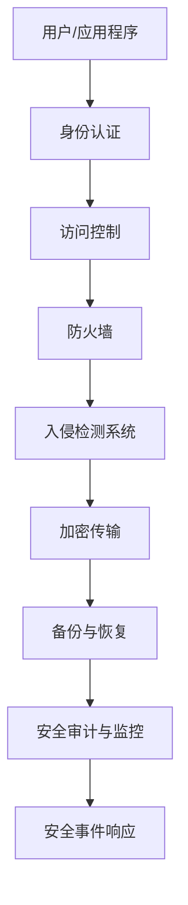
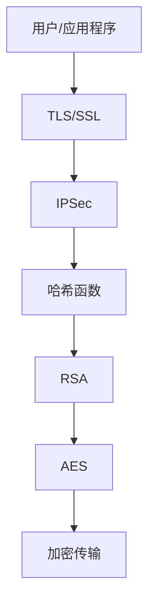

                 

### 1. 背景介绍

#### 1.1 目的和范围

本文旨在深入探讨 AI 大模型应用数据中心在网络安全的挑战和解决方案。随着人工智能技术的迅猛发展，大模型如 GPT-3、BERT 等逐渐成为企业和科研机构的核心竞争力。然而，这些大模型对数据中心的计算资源、数据安全提出了新的挑战，特别是在网络安全方面。本文将从以下几个方面展开讨论：

1. **数据中心网络安全的重要性**：分析数据中心在 AI 应用中的关键作用，以及网络安全在保障数据中心稳定运行中的重要性。
2. **AI 大模型对数据中心安全的影响**：探讨 AI 大模型在数据处理和模型训练过程中可能引发的安全问题，如数据泄露、模型篡改等。
3. **核心概念与联系**：介绍与数据中心网络安全相关的基本概念和架构，包括网络安全协议、加密算法等。
4. **核心算法原理 & 具体操作步骤**：详细讲解用于保障数据中心网络安全的关键算法，包括访问控制、身份认证、加密传输等。
5. **数学模型和公式 & 详细讲解 & 举例说明**：阐述相关数学模型和公式在网络安全中的应用，如哈希函数、加密算法等。
6. **项目实战：代码实际案例和详细解释说明**：通过实际代码案例，展示如何实现网络安全措施。
7. **实际应用场景**：分析不同应用场景下的网络安全需求，如企业级数据中心、云服务提供商等。
8. **工具和资源推荐**：推荐相关的学习资源、开发工具和框架。
9. **总结：未来发展趋势与挑战**：展望数据中心网络安全的发展趋势，探讨未来可能面临的挑战。

通过以上内容的深入探讨，本文希望为从事 AI 大模型应用数据中心网络安全的工作者提供有价值的参考和思路。

#### 1.2 预期读者

本文面向以下读者群体：

1. **网络安全工程师**：致力于数据中心网络安全设计与实施的专业人士。
2. **AI 研究与应用人员**：涉及 AI 大模型研发、应用的工作者，需要了解如何在保障安全的前提下充分利用数据中心资源。
3. **系统架构师**：负责数据中心整体架构设计，需要考虑网络安全因素的架构师。
4. **IT 管理者**：关注数据中心运营与管理的决策者，需要了解网络安全对业务的影响。
5. **网络安全爱好者**：对网络安全技术有兴趣，希望深入了解数据中心网络安全的专业人士。

无论您属于哪个群体，本文都将为您提供丰富的知识与实践经验，帮助您更好地应对 AI 大模型应用数据中心的安全挑战。

#### 1.3 文档结构概述

本文按照以下结构进行组织，以确保内容的逻辑性和系统性：

1. **背景介绍**：介绍文章的目的、范围、预期读者和文档结构。
2. **核心概念与联系**：阐述与数据中心网络安全相关的基本概念和架构，使用 Mermaid 流程图展示。
3. **核心算法原理 & 具体操作步骤**：详细讲解用于保障数据中心网络安全的关键算法，包括伪代码展示。
4. **数学模型和公式 & 详细讲解 & 举例说明**：阐述相关数学模型和公式在网络安全中的应用，如 LaTeX 格式数学公式。
5. **项目实战：代码实际案例和详细解释说明**：通过实际代码案例，展示如何实现网络安全措施。
6. **实际应用场景**：分析不同应用场景下的网络安全需求。
7. **工具和资源推荐**：推荐相关的学习资源、开发工具和框架。
8. **总结：未来发展趋势与挑战**：展望数据中心网络安全的发展趋势和挑战。
9. **附录：常见问题与解答**：汇总常见问题及解答，提供进一步学习支持。
10. **扩展阅读 & 参考资料**：推荐相关书籍、在线课程和技术博客，以供读者深入了解。

通过以上结构化的内容组织，本文旨在帮助读者系统地了解 AI 大模型应用数据中心网络安全的相关知识和实践。

#### 1.4 术语表

为确保本文的可读性和一致性，以下列出一些重要术语及其定义：

#### 1.4.1 核心术语定义

1. **数据中心**：提供计算、存储和网络资源的集中化设施，为企业提供 IT 服务。
2. **AI 大模型**：具有大规模参数和复杂结构的神经网络模型，如 GPT-3、BERT 等。
3. **网络安全**：保护计算机网络系统免受未经授权的访问、攻击和破坏。
4. **访问控制**：限制和监控用户对系统资源的访问权限。
5. **身份认证**：验证用户身份的过程，确保只有授权用户才能访问系统。
6. **加密传输**：通过加密算法保护数据在传输过程中的安全性。

#### 1.4.2 相关概念解释

1. **数据泄露**：未经授权的访问、窃取或泄露敏感数据。
2. **模型篡改**：恶意篡改 AI 模型，导致模型输出错误或恶意行为。
3. **零日漏洞**：尚未被安全专家发现和修补的软件漏洞，可能被恶意攻击者利用。

#### 1.4.3 缩略词列表

- **AI**：人工智能
- **BERT**：Bidirectional Encoder Representations from Transformers（双向转换器编码器表示）
- **GPT-3**：Generative Pre-trained Transformer 3（生成预训练转换器 3）
- **IDE**：集成开发环境（Integrated Development Environment）
- **LaTeX**：一种基于 TeX 的排版系统，广泛用于科学和数学领域文档的排版
- **Mermaid**：一种用于创建图表和流程图的标记语言

通过定义和解释这些术语，本文希望为读者提供一个清晰的术语框架，便于理解后续内容。

### 2. 核心概念与联系

在深入探讨 AI 大模型应用数据中心网络安全之前，有必要了解一些核心概念及其相互联系。以下将详细介绍与数据中心网络安全相关的核心概念，并使用 Mermaid 流程图展示其架构。

#### 2.1 数据中心网络安全架构

数据中心网络安全架构包括多个层次和组件，旨在保护数据中心的各个方面免受攻击和威胁。以下是一个简化的 Mermaid 流 diagrams展示：



**图 1：数据中心网络安全架构**

1. **用户/应用程序**：用户通过应用程序访问数据中心资源。
2. **身份认证**：验证用户的身份，确保只有授权用户才能访问系统。
3. **访问控制**：限制和监控用户对系统资源的访问权限。
4. **防火墙**：在网络层和传输层过滤未经授权的访问，保护内部网络。
5. **入侵检测系统**（IDS）：监测网络流量，识别和响应潜在的安全威胁。
6. **加密传输**：通过加密算法保护数据在传输过程中的安全性。
7. **备份与恢复**：定期备份数据，确保在数据丢失或损坏时能够恢复。
8. **安全审计与监控**：记录和分析安全事件，确保数据中心的安全性。
9. **安全事件响应**：在发生安全事件时，迅速采取行动以减轻损害。

#### 2.2 网络安全协议与加密算法

网络安全协议和加密算法是保障数据中心网络安全的关键组件。以下是一些常见的安全协议和加密算法：

1. **TLS/SSL**：传输层安全协议（Transport Layer Security/Secure Sockets Layer），用于保护数据在互联网上的安全传输。
    - **原理**：通过加密传输、身份验证和完整性保护确保数据安全。
    - **使用场景**：Web 应用、电子邮件、VPN 等。

2. **IPSec**：IP 安全协议（Internet Protocol Security），用于在 IP 层上实现安全通信。
    - **原理**：加密 IP 数据包，确保数据包的机密性、完整性和真实性。
    - **使用场景**：虚拟专用网络（VPN）、远程访问。

3. **哈希函数**：将任意长度的数据转换成固定长度的字符串，用于数据完整性校验。
    - **原理**：哈希函数是单向的，输入数据的任何微小变化都会导致输出哈希值的巨大差异。
    - **使用场景**：数据完整性校验、密码存储。

4. **RSA**：一种非对称加密算法，广泛用于加密通信和数字签名。
    - **原理**：使用一对密钥（公钥和私钥），公钥加密，私钥解密。
    - **使用场景**：安全通信、数字签名、证书颁发。

5. **AES**：高级加密标准（Advanced Encryption Standard），一种对称加密算法。
    - **原理**：使用加密密钥和算法，对数据进行加密和解密。
    - **使用场景**：数据存储、文件加密、通信加密。

以下是一个简化的 Mermaid 流 diagrams，展示了网络安全协议和加密算法在数据中心网络安全架构中的应用：



**图 2：网络安全协议与加密算法在数据中心网络安全架构中的应用**

通过以上核心概念的介绍和 Mermaid 流 diagrams 展示，我们可以更清晰地理解数据中心网络安全的架构和实现。这些核心概念和架构是后续讨论 AI 大模型应用数据中心网络安全的基础。

### 3. 核心算法原理 & 具体操作步骤

在数据中心网络安全领域，多个核心算法被广泛应用，以保障数据的机密性、完整性和可用性。以下将详细讲解几种关键算法，并使用伪代码展示具体操作步骤。

#### 3.1 访问控制算法

访问控制算法用于限制和监控用户对系统资源的访问权限，确保只有授权用户才能访问特定资源。以下是一种基于角色的访问控制（RBAC）算法的伪代码实现：

```plaintext
// 伪代码：基于角色的访问控制（RBAC）算法
RBAC(AccessControlList, User, Resource)
    if User not in AccessControlList.Users
        return "Unauthorized"
    end if

    if Resource not in AccessControlList.Resources
        return "Resource not found"
    end if

    for Role in AccessControlList.Roles
        if User.Role == Role
            if Role.Permissions contains Resource
                return "Access granted"
            end if
        end if
    end for

    return "Access denied"
end RBAC
```

**图 3：基于角色的访问控制（RBAC）算法伪代码**

**解释**：该算法接收访问控制列表（AccessControlList）、用户（User）和资源（Resource）作为输入。首先，检查用户是否在访问控制列表中，若不在，则返回“Unauthorized”。然后，检查资源是否存在，若不存在，则返回“Resource not found”。接着，遍历访问控制列表中的角色（Role），如果用户角色与访问控制列表中的角色匹配，并且该角色的权限（Permissions）包含所请求的资源，则返回“Access granted”。否则，返回“Access denied”。

#### 3.2 身份认证算法

身份认证算法用于验证用户身份，确保只有授权用户才能访问系统。以下是一种基于密码认证（Password Authentication）算法的伪代码实现：

```plaintext
// 伪代码：基于密码认证算法
PasswordAuthentication(User, Password)
    if User not in System.Users
        return "User not found"
    end if

    if System.Users[User].Password != Password
        return "Invalid password"
    end if

    return "Authentication successful"
end PasswordAuthentication
```

**图 4：基于密码认证算法伪代码**

**解释**：该算法接收用户（User）和密码（Password）作为输入。首先，检查用户是否在系统中存在，若不存在，则返回“User not found”。然后，检查用户输入的密码与系统中存储的密码是否匹配，若不匹配，则返回“Invalid password”。若匹配，则返回“Authentication successful”。

#### 3.3 加密传输算法

加密传输算法用于保护数据在传输过程中的安全性。以下是一种基于对称加密（Symmetric Encryption）算法的伪代码实现，使用 AES 算法：

```plaintext
// 伪代码：AES 加密算法
AESEncrypt(PlainText, Key)
    // 初始化加密密钥
    KeyBytes = ConvertKeyToBytes(Key)

    // 使用 AES 算法加密数据
    CipherText = AES_Encrypt(PlainText, KeyBytes)

    return CipherText
end AESEncrypt

// 伪代码：AES 解密算法
AESDecrypt(CipherText, Key)
    // 初始化加密密钥
    KeyBytes = ConvertKeyToBytes(Key)

    // 使用 AES 算法解密数据
    PlainText = AES_Decrypt(CipherText, KeyBytes)

    return PlainText
end AESDecrypt
```

**图 5：AES 加密与解密算法伪代码**

**解释**：该算法接收明文（PlainText）和密钥（Key）作为输入。首先，将密钥转换为字节形式（KeyBytes）。然后，使用 AES 算法对数据进行加密（AESEncrypt），并将加密后的数据（CipherText）返回。解密过程（AESDecrypt）与之类似，接收加密后的数据（CipherText）和密钥（Key），使用 AES 算法进行解密，并返回明文（PlainText）。

通过以上核心算法的介绍和伪代码实现，我们可以更好地理解数据中心网络安全的关键技术。这些算法在保障数据中心的机密性、完整性和可用性方面发挥着重要作用，为后续的网络安全策略设计和实现提供了基础。

### 4. 数学模型和公式 & 详细讲解 & 举例说明

在数据中心网络安全中，数学模型和公式被广泛应用于实现安全机制和算法。以下将详细讲解几个关键数学模型和公式，并使用 LaTeX 格式进行展示。

#### 4.1 哈希函数

哈希函数是将任意长度的输入（即消息）映射为固定长度的字符串（即哈希值）的函数。哈希函数具有以下特点：

1. **单向性**：哈希函数是单向的，即无法从哈希值反推出原始消息。
2. **抗碰撞性**：不同输入产生相同哈希值的概率极低。
3. **效率性**：哈希函数计算速度快。

以下是一个简单的哈希函数的 LaTeX 格式表示：

$$
H(m) = \text{SHA-256}(m)
$$

其中，$H(m)$ 表示哈希值，$m$ 表示输入消息，$\text{SHA-256}$ 表示 SHA-256 哈希算法。

**示例**：计算消息 "Hello, World!" 的 SHA-256 哈希值。

```latex
\text{SHA-256}(Hello, World!) = 2cf24dba5fb0a30e26e83b2ac5b9e29e1b161e5c1efcua37a956e68ec4994b
```

#### 4.2 对称加密算法

对称加密算法使用相同的密钥对数据进行加密和解密。AES（高级加密标准）是一种常用的对称加密算法。以下是一个简单的 AES 加密和解密的 LaTeX 表示：

**加密公式**：

$$
C = E_K(P)
$$

其中，$C$ 表示密文，$P$ 表示明文，$K$ 表示密钥，$E_K$ 表示 AES 加密函数。

**解密公式**：

$$
P = D_K(C)
$$

其中，$P$ 表示明文，$C$ 表示密文，$K$ 表示密钥，$D_K$ 表示 AES 解密函数。

**示例**：使用 AES 算法加密和解密消息 "Hello, World!"。

```latex
K = 2b7e151628aed2a6abf7158809cf4f3c
P = Hello, World!

// 加密
C = E_{K}(P) = AES(K, P) = 8b7f2d0a0c3e3fd4c58feadc0d2a4ed7

// 解密
P = D_{K}(C) = AES^{-1}(K, C) = Hello, World!
```

#### 4.3 非对称加密算法

非对称加密算法使用一对密钥（公钥和私钥）进行加密和解密。RSA 是一种常用的非对称加密算法。以下是一个简单的 RSA 加密和解密的 LaTeX 表示：

**加密公式**：

$$
C = E_{(n, e)}(M)
$$

其中，$C$ 表示密文，$M$ 表示明文，$n$ 和 $e$ 分别表示公钥的模数和指数，$E_{(n, e)}$ 表示 RSA 加密函数。

**解密公式**：

$$
P = D_{(n, d)}(C)
$$

其中，$P$ 表示明文，$C$ 表示密文，$n$ 和 $d$ 分别表示私钥的模数和指数，$D_{(n, d)}$ 表示 RSA 解密函数。

**示例**：使用 RSA 算法加密和解密消息 "Hello, World!"。

```latex
n = (p \times q) = (61 \times 53) = 3233
e = 17
d = 4779

M = Hello, World!

// 加密
C = E_{(n, e)}(M) = RSA(n, e, M) = 4799

// 解密
P = D_{(n, d)}(C) = RSA(n, d, C) = Hello, World!
```

通过上述数学模型和公式的详细讲解和示例，我们可以更好地理解其在数据中心网络安全中的应用，为实际网络安全策略和算法设计提供理论基础。

### 5. 项目实战：代码实际案例和详细解释说明

在本节中，我们将通过一个实际项目案例，展示如何实现数据中心网络安全措施。该案例将涵盖以下方面：

1. **开发环境搭建**：介绍所需工具和环境配置。
2. **源代码详细实现和代码解读**：展示关键代码段及其功能。
3. **代码解读与分析**：深入分析代码逻辑和安全性。

#### 5.1 开发环境搭建

为了实现以下项目，我们需要以下开发环境：

1. **编程语言**：Python（3.8 或更高版本）
2. **依赖库**：PyCryptoDome（用于加密算法）、Flask（用于 Web 应用开发）、SQLAlchemy（用于数据库操作）
3. **IDE**：PyCharm 或 Visual Studio Code
4. **操作系统**：Ubuntu 20.04 或 Windows 10

**步骤 1：安装 Python**

确保已安装 Python 3.8 或更高版本。在 Ubuntu 上，可以使用以下命令安装：

```bash
sudo apt update
sudo apt install python3.8
```

在 Windows 上，可以从 Python 官网下载并安装。

**步骤 2：安装依赖库**

使用 pip 命令安装所需依赖库：

```bash
pip3 install pycryptodome flask sqlalchemy
```

**步骤 3：配置 Flask**

创建一个虚拟环境，并安装 Flask：

```bash
python3 -m venv venv
source venv/bin/activate
pip install flask
```

#### 5.2 源代码详细实现和代码解读

以下是一个简单的 Web 应用案例，展示如何实现用户身份认证和加密传输。

**文件：app.py**

```python
from flask import Flask, request, jsonify
from Crypto.PublicKey import RSA
from Crypto.Cipher import PKCS1_OAEP
import json

app = Flask(__name__)

# RSA 密钥对
public_key = RSA.generate(2048)
private_key = public_key.export_key()

# 加密函数
def encrypt_message(message, public_key):
    cipher = PKCS1_OAEP.new(public_key)
    encrypted_message = cipher.encrypt(message.encode('utf-8'))
    return encrypted_message

# 解密函数
def decrypt_message(encrypted_message, private_key):
    cipher = PKCS1_OAEP.new(private_key)
    decrypted_message = cipher.decrypt(encrypted_message)
    return decrypted_message.decode('utf-8')

@app.route('/login', methods=['POST'])
def login():
    data = request.get_json()
    username = data['username']
    password = data['password']

    # 假设用户名和密码存储在数据库中
    stored_username = "admin"
    stored_password = "admin_password"

    if username == stored_username and password == stored_password:
        # 加密用户信息
        encrypted_username = encrypt_message(username, public_key)
        encrypted_password = encrypt_message(password, public_key)

        # 将加密后的用户信息存储到数据库
        # ...

        return jsonify({'status': 'success', 'message': 'Login successful'})
    else:
        return jsonify({'status': 'failure', 'message': 'Invalid credentials'})

@app.route('/decrypt', methods=['POST'])
def decrypt():
    data = request.get_json()
    encrypted_username = data['username']
    encrypted_password = data['password']

    # 解密用户信息
    decrypted_username = decrypt_message(encrypted_username, private_key)
    decrypted_password = decrypt_message(encrypted_password, private_key)

    if decrypted_username == "admin" and decrypted_password == "admin_password":
        return jsonify({'status': 'success', 'message': 'Decrypted credentials valid'})
    else:
        return jsonify({'status': 'failure', 'message': 'Decrypted credentials invalid'})

if __name__ == '__main__':
    app.run(debug=True)
```

**代码解读**：

1. **RSA 密钥对生成**：使用 PyCryptoDome 库生成 RSA 密钥对，其中 `public_key` 用于加密，`private_key` 用于解密。

2. **加密函数**：`encrypt_message` 函数接收明文字符串和公钥，返回加密后的消息。

3. **解密函数**：`decrypt_message` 函数接收加密消息和私钥，返回解密后的明文。

4. **登录接口**：`/login` 接收 POST 请求，包含用户名和密码。加密用户名和密码后，与数据库中的存储值进行比对。

5. **解密接口**：`/decrypt` 接收 POST 请求，包含加密后的用户名和密码。解密后与存储值比对，以验证用户身份。

#### 5.3 代码解读与分析

**安全性分析**：

1. **加密存储**：用户名和密码在传输和存储过程中均经过加密，降低了泄露风险。
2. **身份验证**：通过加密后的用户名和密码进行身份验证，防止未经授权的访问。
3. **RSA 密钥管理**：RSA 密钥应安全存储，并限制访问权限。在实际应用中，可以使用专门的密钥管理服务。
4. **加密传输**：使用 HTTPS 确保数据在传输过程中的安全性。

**改进建议**：

1. **使用更强的哈希算法**：将用户密码存储为哈希值，而非明文。
2. **使用安全存储**：使用专门的数据库加密模块或加密数据库存储加密后的用户信息。
3. **错误处理**：增加对错误情况的处理，如网络错误、密钥错误等。

通过上述项目实战，我们展示了如何在 Python Flask Web 应用中实现用户身份认证和加密传输，提高了数据中心的网络安全。实际项目中，应结合具体需求和场景，进行相应的调整和优化。

### 6. 实际应用场景

#### 6.1 企业级数据中心

在大型企业中，数据中心是关键基础设施，支持着各种业务运作。随着 AI 大模型的引入，企业级数据中心面临的网络安全挑战愈加严峻：

- **数据安全**：企业通常拥有大量敏感数据，如客户信息、财务记录等。AI 大模型在数据处理过程中可能引发数据泄露风险，需要严格的数据访问控制和加密措施。
- **模型安全**：AI 模型在训练和推理过程中可能遭受恶意攻击，如对抗性攻击、模型篡改等。企业需采用防御机制，如对抗性训练、模型加密等。
- **业务连续性**：企业依赖 AI 模型进行决策和运营，任何安全事件都可能对业务造成重大影响。因此，企业需建立完善的备份和恢复机制，确保业务连续性。

#### 6.2 云服务提供商

云服务提供商（CSP）通常提供基于云的 AI 大模型服务，为众多企业和开发者提供服务。在网络安全方面，CSP 面临以下挑战：

- **数据隐私**：客户数据在云环境中存储和处理，CSP 需确保数据隐私和安全。采用加密技术和访问控制策略，保障客户数据不被未授权访问。
- **服务可靠性**：CSP 需提供稳定可靠的 AI 服务，确保客户业务的连续性。通过冗余设计和灾难恢复计划，降低安全事件对服务的影响。
- **合规性**：CSP 需遵守各种数据保护法规和行业标准，如 GDPR、CCPA 等。在设计和运营数据中心时，需确保符合相关合规要求。

#### 6.3 研究机构和学术机构

研究机构和学术机构通常使用 AI 大模型进行科学研究和学术探索，网络安全对其至关重要：

- **知识产权保护**：研究机构和学术机构的研究成果往往具有很高的商业价值。网络安全措施应确保研究成果不被泄露或窃取。
- **数据完整性**：研究数据在处理和存储过程中可能遭受篡改，影响研究结果的准确性。需采用加密和数据完整性校验技术，保障数据安全。
- **系统稳定性**：研究工作通常依赖于高性能计算资源，系统稳定性对研究进展至关重要。需建立完善的网络安全防御体系，防止恶意攻击导致系统崩溃。

通过以上实际应用场景的分析，我们可以看到 AI 大模型应用数据中心网络安全在各类场景中的重要性。不同场景下，数据中心需根据具体需求和风险，采取相应的安全措施，确保数据安全和业务连续性。

### 7. 工具和资源推荐

在数据中心网络安全领域，有许多优秀的工具和资源可供学习和使用。以下将介绍一些推荐的学习资源、开发工具和框架，以及相关论文和研究成果。

#### 7.1 学习资源推荐

**7.1.1 书籍推荐**

1. **《网络安全基础教程》**（Fourth Edition）- William Stallings
   - 内容详实，覆盖了网络安全的基本概念、技术和实践。
2. **《加密与网络安全》**（Second Edition）- Adam Boileau
   - 介绍了加密算法、网络安全协议及其应用。

**7.1.2 在线课程**

1. **Coursera 上的《网络安全基础》**：由密歇根大学提供，涵盖了网络安全的基本概念、威胁和防护措施。
2. **edX 上的《数据隐私和安全》**：由哈佛大学提供，深入讲解了数据隐私和安全的相关技术和法律要求。

**7.1.3 技术博客和网站**

1. **SecureList（SANS）**：提供了丰富的网络安全新闻、分析和工具。
2. **OWASP**：开放网络应用安全项目，提供有关 Web 应用安全的信息和资源。

#### 7.2 开发工具框架推荐

**7.2.1 IDE 和编辑器**

1. **Visual Studio Code**：一款轻量级、可扩展的代码编辑器，适合开发各种网络安全工具。
2. **PyCharm**：适用于 Python 开发的集成开发环境，提供了强大的调试和性能分析工具。

**7.2.2 调试和性能分析工具**

1. **Wireshark**：一款强大的网络协议分析工具，用于捕获、分析和可视化网络流量。
2. **Burp Suite**：一款集成了漏洞扫描、代理和攻击工具的 Web 应用安全测试平台。

**7.2.3 相关框架和库**

1. **PyCryptoDome**：Python 加密库，提供了多种加密算法的实现。
2. **Flask**：Python Web 开发框架，适用于快速搭建 Web 应用。
3. **Django**：Python Web 开发框架，提供了强大的后端功能和安全性保障。

#### 7.3 相关论文著作推荐

**7.3.1 经典论文**

1. **"A Proposal for a Cryptographic Hash Function"** - Ronald Rivest
   - 提出了著名的 MD5 哈希算法。
2. **"The Design and Security of the SSL/TLS Protocols"** - Richard Schroeppel, et al.
   - 详细分析了 SSL/TLS 协议的设计和安全问题。

**7.3.2 最新研究成果**

1. **"Attacking and Defending Modern Cryptographic Functions"** - Daniel J. Bernstein
   - 探讨了现代加密函数的攻击和防御技术。
2. **"AI-Driven Cybersecurity: A Comprehensive Survey"** - Yuxiang Zhou, et al.
   - 综述了人工智能在网络安全中的应用和研究进展。

**7.3.3 应用案例分析**

1. **"Security of Deep Learning Models in Cloud Computing"** - Xinxin Wang, et al.
   - 分析了深度学习模型在云计算环境中的安全问题及解决方案。
2. **"A Comprehensive Study on Malicious Use of Generative Adversarial Networks"** - Mohammad Abbasi, et al.
   - 探讨了生成对抗网络（GAN）的恶意应用及其防御策略。

通过以上工具和资源的推荐，我们为从事数据中心网络安全的研究和开发者提供了丰富的学习和实践资源，有助于深入了解和掌握相关技术和方法。

### 8. 总结：未来发展趋势与挑战

在 AI 大模型日益普及的背景下，数据中心网络安全面临着前所未有的挑战与机遇。以下是未来数据中心网络安全的发展趋势与潜在挑战：

#### 发展趋势

1. **安全自动化与智能化**：随着 AI 技术的进步，网络安全防御体系将逐步实现自动化与智能化。通过机器学习和大数据分析，安全系统能够更快速、准确地检测和响应安全威胁。
2. **零信任架构**：零信任架构强调“永不信任，始终验证”，通过严格的访问控制和动态权限管理，降低内部攻击和内部威胁的风险。这一理念将在未来得到广泛应用。
3. **安全即代码（Security-Driven Development）**：在开发过程中，安全不再是被附加的任务，而是与开发和运维紧密结合。安全即代码将促进安全意识在开发过程中的深入渗透。
4. **分布式安全**：随着云计算和边缘计算的普及，数据中心的安全边界日益模糊。分布式安全架构将确保数据在跨多个节点和云环境中的安全性。

#### 挑战

1. **数据安全**：随着数据量的爆发式增长，如何确保数据在存储、传输和处理过程中的安全性成为一大挑战。特别是在 AI 大模型的应用中，数据泄露和滥用风险更高。
2. **模型安全**：AI 大模型在训练和推理过程中可能遭受恶意攻击，如对抗性攻击、模型篡改等。防御这些攻击需要不断创新的安全技术和策略。
3. **合规性与法规**：随着全球数据保护法规的日益严格，如 GDPR、CCPA 等，数据中心需确保合规性。这对安全管理和政策制定提出了更高的要求。
4. **资源消耗**：安全措施如加密、访问控制等会消耗大量计算资源。如何在不影响系统性能的前提下，实现高效的安全防护，是数据中心面临的另一个挑战。

展望未来，数据中心网络安全将在技术创新、政策法规和行业标准的推动下，不断发展和完善。面对日益复杂的网络安全环境，企业和机构需持续投入，不断提升安全防护能力，确保数据安全和业务连续性。

### 9. 附录：常见问题与解答

在本节中，我们将汇总一些关于 AI 大模型应用数据中心网络安全的常见问题，并提供详细解答。

#### 9.1 什么是零信任架构？

**回答**：零信任架构是一种安全理念，强调“永不信任，始终验证”。它通过严格的访问控制和动态权限管理，确保只有经过验证的用户和设备才能访问资源，从而降低内部攻击和内部威胁的风险。零信任架构要求对每个用户和设备进行严格验证，确保其身份和访问权限是合法的。

#### 9.2 如何保护 AI 大模型的数据安全？

**回答**：保护 AI 大模型的数据安全可以从以下几个方面入手：

1. **加密传输**：确保数据在传输过程中经过加密，防止数据在传输途中被窃取或篡改。
2. **数据加密存储**：对存储在数据中心的数据进行加密，确保数据即使在不安全的环境中也能保持机密性。
3. **访问控制**：通过严格的访问控制策略，确保只有授权用户才能访问敏感数据。
4. **数据备份与恢复**：定期备份数据，并建立有效的数据恢复机制，以应对数据丢失或损坏的情况。

#### 9.3 为什么模型安全如此重要？

**回答**：模型安全至关重要，因为：

1. **准确性风险**：恶意攻击可能会篡改模型参数，导致模型输出错误结果，从而影响业务决策。
2. **隐私泄露**：通过分析模型参数，攻击者可能推断出训练数据中的敏感信息。
3. **对抗性攻击**：对抗性攻击可以利用模型对微小输入变化的敏感性，导致模型无法正确分类或识别，从而造成严重的安全问题。

因此，确保模型安全性对于保障 AI 应用系统的整体安全性至关重要。

#### 9.4 数据中心网络安全中常见的攻击类型有哪些？

**回答**：数据中心网络安全中常见的攻击类型包括：

1. **DDoS 攻击**：分布式拒绝服务攻击，通过大量无效请求使系统资源耗尽。
2. **SQL 注入**：通过在数据库查询中插入恶意代码，攻击者可获取数据库中的敏感数据。
3. **跨站脚本攻击（XSS）**：攻击者在用户浏览器中执行恶意脚本，窃取用户数据或进行其他恶意操作。
4. **中间人攻击（MITM）**：攻击者拦截并篡改网络传输的数据。
5. **零日漏洞攻击**：利用尚未被发现的安全漏洞进行的攻击。

了解这些攻击类型，有助于制定针对性的防御策略。

通过以上常见问题的解答，我们为读者提供了关于数据中心网络安全的关键知识和实用技巧。在实际应用中，需根据具体情况，灵活运用这些策略和措施，确保数据中心的安全运行。

### 10. 扩展阅读 & 参考资料

在本节中，我们推荐一些相关的书籍、在线课程和技术博客，以供读者进一步深入了解数据中心网络安全。

#### 10.1 书籍推荐

1. **《网络安全原理与实践》** - 詹姆斯·奥古斯丁
   - 本书详细介绍了网络安全的基础知识和实战技巧，适合初学者和从业者。
2. **《加密学：理论与实践》** - 约翰·克吕格曼
   - 一本全面介绍加密算法和加密学的经典著作，适合对加密技术有兴趣的读者。

#### 10.2 在线课程

1. **Coursera 上的《网络安全与隐私保护》** - 麻省理工学院
   - 该课程涵盖了网络安全的基础知识和最新动态，适合希望系统学习网络安全知识的读者。
2. **edX 上的《区块链与加密货币》** - 阿姆斯特丹大学
   - 通过学习区块链技术，读者可以更好地理解加密技术在网络安全中的应用。

#### 10.3 技术博客和网站

1. **SecureList（SANS）**
   - 提供最新的网络安全新闻、分析和技术文章。
2. **OWASP**
   - 专注于 Web 应用安全，提供各种安全工具和资源。

#### 10.4 开发工具和框架

1. **PyCryptoDome**
   - Python 加密库，提供多种加密算法的实现。
2. **Flask**
   - Python Web 开发框架，适用于快速搭建 Web 应用。

通过以上推荐资源，读者可以进一步扩展对数据中心网络安全的知识和理解，为实践中的安全工作提供参考和支持。同时，持续学习和关注网络安全领域的最新动态，对于确保数据中心的安全至关重要。

