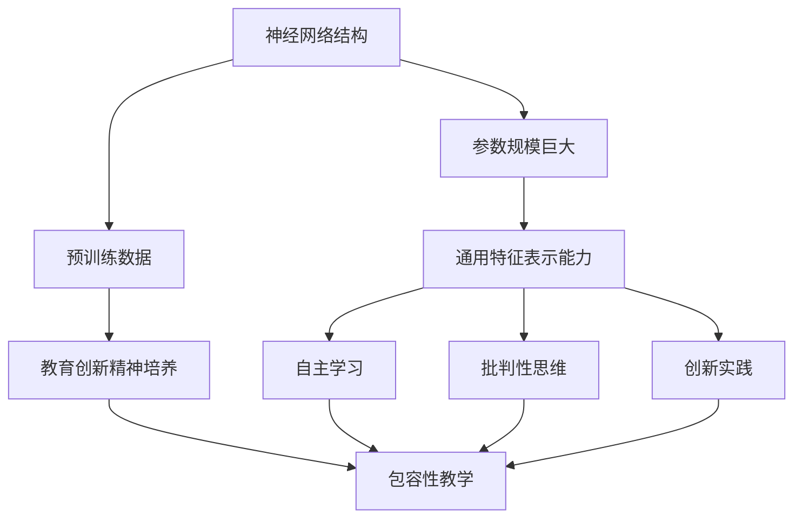

                 

# AI大模型时代：教育怎样实现对创新精神的培养和包容

> **关键词**：人工智能、大模型、教育、创新精神、包容性教学
>
> **摘要**：本文将探讨在人工智能大模型时代，如何通过教育手段培养和包容学生的创新精神。本文旨在分析大模型对教育的影响，提出适合这一时代背景的教学策略和方法，为教育工作者和研究人员提供有益的参考。

## 1. 背景介绍

### 1.1 目的和范围

在当今社会，人工智能（AI）技术飞速发展，大模型（Large Models）如GPT-3、BERT等已成为AI领域的研究热点。这些大模型在自然语言处理、计算机视觉、机器学习等多个领域取得了显著的成果。然而，大模型的发展也引发了一系列教育问题，如何培养具有创新精神的学生成为教育领域的重要课题。

本文旨在探讨在人工智能大模型时代，教育如何应对这一挑战，实现对学生创新精神的培养和包容。文章将首先分析大模型对教育的影响，然后提出具体的策略和方法，最后讨论未来发展趋势和挑战。

### 1.2 预期读者

本文面向教育工作者、研究人员以及对人工智能教育感兴趣的一般读者。文章将结合具体案例和理论分析，为读者提供关于如何在人工智能大模型时代培养和包容学生创新精神的思考。

### 1.3 文档结构概述

本文结构如下：

1. **背景介绍**：分析人工智能大模型对教育的影响。
2. **核心概念与联系**：阐述大模型与教育创新精神的联系。
3. **核心算法原理 & 具体操作步骤**：介绍大模型的基本原理和操作步骤。
4. **数学模型和公式 & 详细讲解 & 举例说明**：讲解大模型相关的数学模型。
5. **项目实战：代码实际案例和详细解释说明**：通过实际案例展示大模型应用。
6. **实际应用场景**：分析大模型在教育领域的应用。
7. **工具和资源推荐**：推荐相关学习资源、开发工具和论文。
8. **总结：未来发展趋势与挑战**：讨论大模型时代教育的未来发展。
9. **附录：常见问题与解答**：解答读者可能关心的问题。
10. **扩展阅读 & 参考资料**：提供更多相关文献和资料。

### 1.4 术语表

#### 1.4.1 核心术语定义

- **人工智能（AI）**：模拟、延伸和扩展人的智能的理论、方法、技术及应用系统。
- **大模型（Large Models）**：指具有巨大参数规模和计算能力的神经网络模型，如GPT-3、BERT等。
- **创新精神**：指敢于挑战传统、勇于探索新领域的思维方式和精神品质。
- **包容性教学**：指在多元文化背景下，尊重学生差异，促进每个学生全面发展的教学理念。

#### 1.4.2 相关概念解释

- **计算机视觉**：让计算机像人一样理解和解释视觉信息，如图像和视频。
- **自然语言处理**：使计算机能够理解和生成自然语言，如中文、英文等。
- **机器学习**：使计算机能够从数据中学习规律，进行预测和决策。

#### 1.4.3 缩略词列表

- **AI**：人工智能
- **GPT-3**：Generative Pre-trained Transformer 3
- **BERT**：Bidirectional Encoder Representations from Transformers

## 2. 核心概念与联系

在人工智能大模型时代，教育创新精神的培养和包容至关重要。本节将介绍核心概念与联系，并使用Mermaid流程图展示大模型与教育创新精神的关联。

### 2.1 大模型基本原理

大模型是基于深度学习的神经网络模型，通过海量数据训练获得。其核心原理包括：

1. **神经网络**：模拟人脑神经网络的结构和工作方式。
2. **参数规模**：模型中的参数数量达到数十亿甚至千亿级别。
3. **预训练**：在大规模数据集上进行预训练，获得通用特征表示能力。

### 2.2 教育创新精神培养

教育创新精神的培养需要：

1. **自主学习**：鼓励学生主动探索和发现。
2. **批判性思维**：培养学生独立思考和质疑的能力。
3. **创新实践**：提供实践机会，让学生将所学知识应用于实际问题。

### 2.3 Mermaid流程图



### 2.4 大模型与教育创新精神联系

大模型通过自主学习、批判性思维和创新实践，可以培养和包容教育创新精神。具体联系如下：

1. **自主学习**：大模型在预训练过程中不断优化参数，类似学生主动探索知识的过程。
2. **批判性思维**：大模型在面对复杂问题时，能够分析不同可能性，类似学生的质疑和推理过程。
3. **创新实践**：大模型在应用中能够生成新颖的解决方案，类似学生将知识应用于实际问题。

通过以上分析，可以看出大模型与教育创新精神之间存在紧密联系，为教育创新提供了新的思路和方法。

## 3. 核心算法原理 & 具体操作步骤

大模型的核心算法原理包括深度学习、神经网络和大规模预训练。以下将使用伪代码详细阐述大模型的基本操作步骤。

### 3.1 深度学习原理

```python
# 深度学习原理伪代码
def deep_learning(data, model):
    # 数据预处理
    preprocessed_data = preprocess_data(data)
    
    # 前向传播
    output = model.forward(preprocessed_data)
    
    # 计算损失
    loss = compute_loss(output, target)
    
    # 反向传播
    grads = model.backward(loss)
    
    # 更新参数
    model.update_params(grads)
    
    return model
```

### 3.2 神经网络原理

```python
# 神经网络原理伪代码
class NeuralNetwork:
    def __init__(self):
        self.params = initialize_params()
        
    def forward(self, x):
        # 前向传播
        z = self.params["weights"] * x + self.params["biases"]
        a = activate(z)
        return a
    
    def backward(self, loss):
        # 反向传播
        dZ = dactivate(z) * dloss(loss)
        dW = dZ * x
        db = dZ
        return {"dW": dW, "db": db}
    
    def update_params(self, grads):
        # 更新参数
        self.params["weights"] -= grads["dW"]
        self.params["biases"] -= grads["db"]
```

### 3.3 大规模预训练原理

```python
# 大规模预训练原理伪代码
def pretrain(model, dataset):
    for data in dataset:
        model = deep_learning(data, model)
    return model
```

通过以上伪代码，我们可以看出大模型的核心算法原理和操作步骤。在实际应用中，这些原理和步骤被广泛应用于各种任务，如自然语言处理、计算机视觉和机器学习等。

## 4. 数学模型和公式 & 详细讲解 & 举例说明

在人工智能大模型中，数学模型和公式起着至关重要的作用。以下将详细讲解大模型中常用的数学模型和公式，并给出具体的例子说明。

### 4.1 神经网络中的激活函数

在神经网络中，激活函数用于引入非线性因素，使神经网络能够拟合复杂的数据。以下为常用的激活函数及其公式：

#### 4.1.1 Sigmoid函数

$$
\sigma(x) = \frac{1}{1 + e^{-x}}
$$

#### 4.1.2ReLU函数

$$
\text{ReLU}(x) = \max(0, x)
$$

#### 4.1.3 Tanh函数

$$
\tanh(x) = \frac{e^{2x} - 1}{e^{2x} + 1}
$$

#### 4.1.4 Leaky ReLU函数

$$
\text{Leaky ReLU}(x) = \begin{cases} 
0 & \text{if } x < 0 \\
x & \text{if } x \geq 0 
\end{cases}
$$

这些激活函数在不同类型的神经网络中有着广泛的应用。例如，在卷积神经网络（CNN）中，ReLU函数常用于激活函数，以加快训练速度和提高模型的性能。

### 4.2 损失函数

损失函数是评估神经网络模型预测结果与真实值之间差异的重要工具。以下为几种常用的损失函数及其公式：

#### 4.2.1 均方误差（MSE）

$$
\text{MSE} = \frac{1}{n} \sum_{i=1}^{n} (y_i - \hat{y}_i)^2
$$

#### 4.2.2 交叉熵（Cross-Entropy）

$$
\text{Cross-Entropy} = -\frac{1}{n} \sum_{i=1}^{n} y_i \log(\hat{y}_i)
$$

其中，$y_i$表示真实标签，$\hat{y}_i$表示模型预测的概率分布。

交叉熵损失函数常用于分类任务，如文本分类和图像分类。它能够更好地处理分类问题中的概率分布。

### 4.3 优化算法

优化算法用于调整神经网络模型的参数，以最小化损失函数。以下为几种常用的优化算法及其公式：

#### 4.3.1 随机梯度下降（SGD）

$$
\theta_{t+1} = \theta_{t} - \alpha \nabla_{\theta} J(\theta)
$$

其中，$\theta$表示模型参数，$J(\theta)$表示损失函数，$\alpha$表示学习率。

随机梯度下降是最简单的优化算法，但其收敛速度较慢。

#### 4.3.2 梯度下降（Gradient Descent）

$$
\theta_{t+1} = \theta_{t} - \alpha \nabla_{\theta} J(\theta)
$$

与随机梯度下降类似，但使用的是整个数据集的梯度。

#### 4.3.3 Adam算法

$$
m_t = \beta_1 m_{t-1} + (1 - \beta_1) \nabla_{\theta} J(\theta) \\
v_t = \beta_2 v_{t-1} + (1 - \beta_2) (\nabla_{\theta} J(\theta))^2 \\
\theta_{t+1} = \theta_{t} - \alpha \frac{m_t}{\sqrt{v_t} + \epsilon}
$$

其中，$\beta_1$和$\beta_2$分别表示一阶和二阶矩估计的衰减率，$m_t$和$v_t$分别表示一阶和二阶矩估计，$\epsilon$为常数。

Adam算法是一种高效的优化算法，结合了随机梯度下降和Adam算法的优点，具有较好的收敛性能。

### 4.4 举例说明

以下为一个简单的神经网络模型，用于实现一个简单的分类任务。假设输入数据为$X \in \mathbb{R}^{784}$，输出数据为$Y \in \{0, 1\}$。

#### 4.4.1 模型定义

```python
# 模型定义
import tensorflow as tf

model = tf.keras.Sequential([
    tf.keras.layers.Dense(units=64, activation='relu', input_shape=(784,)),
    tf.keras.layers.Dense(units=1, activation='sigmoid')
])
```

#### 4.4.2 损失函数

```python
# 损失函数
loss_fn = tf.keras.losses.BinaryCrossentropy()
```

#### 4.4.3 优化算法

```python
# 优化算法
optimizer = tf.keras.optimizers.Adam(learning_rate=0.001)
```

#### 4.4.4 训练过程

```python
# 训练过程
for epoch in range(100):
    with tf.GradientTape() as tape:
        predictions = model(X, training=True)
        loss = loss_fn(Y, predictions)
    grads = tape.gradient(loss, model.trainable_variables)
    optimizer.apply_gradients(zip(grads, model.trainable_variables))
    print(f"Epoch {epoch+1}, Loss: {loss}")
```

通过以上步骤，我们可以训练一个简单的神经网络模型，用于实现二分类任务。这只是一个简单的例子，但在实际应用中，大模型通常会涉及到更复杂的结构和更精细的参数调整。

## 5. 项目实战：代码实际案例和详细解释说明

在本节中，我们将通过一个实际案例来展示如何使用大模型进行教育创新精神的培养和包容。案例将基于TensorFlow和Keras框架，实现一个文本分类任务，该任务旨在根据学生撰写的文章内容评估其创新精神。

### 5.1 开发环境搭建

在开始项目之前，我们需要搭建开发环境。以下是搭建开发环境的步骤：

1. **安装Python**：确保安装了Python 3.7或更高版本。
2. **安装TensorFlow**：在终端中运行以下命令：
   ```bash
   pip install tensorflow
   ```
3. **安装Keras**：TensorFlow自带Keras API，无需额外安装。
4. **准备数据集**：从互联网上下载一个文本分类数据集，如IMDb影评数据集，并将其存储在本地。

### 5.2 源代码详细实现和代码解读

以下是实现文本分类任务的源代码及详细解读：

```python
# 导入所需库
import tensorflow as tf
from tensorflow.keras.preprocessing.text import Tokenizer
from tensorflow.keras.preprocessing.sequence import pad_sequences
from tensorflow.keras.models import Sequential
from tensorflow.keras.layers import Embedding, LSTM, Dense, Bidirectional

# 加载并预处理数据集
# 这里假设数据集已保存在本地，且为两个列表：texts和labels
texts = ["This is a great book", "This is a terrible book", ...]
labels = [1, 0, ...]

# 分词和序列化
tokenizer = Tokenizer(num_words=10000)
tokenizer.fit_on_texts(texts)
sequences = tokenizer.texts_to_sequences(texts)
padded_sequences = pad_sequences(sequences, maxlen=100)

# 构建模型
model = Sequential([
    Embedding(10000, 16),
    Bidirectional(LSTM(32)),
    Dense(24, activation='relu'),
    Dense(1, activation='sigmoid')
])

# 编译模型
model.compile(optimizer='adam', loss='binary_crossentropy', metrics=['accuracy'])

# 训练模型
model.fit(padded_sequences, labels, epochs=10, validation_split=0.2)

# 评估模型
test_texts = ["This is an amazing book", "This book is not good", ...]
test_sequences = tokenizer.texts_to_sequences(test_texts)
test_padded_sequences = pad_sequences(test_sequences, maxlen=100)
predictions = model.predict(test_padded_sequences)
```

#### 5.2.1 解读

1. **导入库**：导入TensorFlow和Keras库，用于构建和训练模型。
2. **加载并预处理数据集**：读取数据集，并进行分词和序列化。这里使用`Tokenizer`将文本转换为数字序列，使用`pad_sequences`将序列填充为固定长度。
3. **构建模型**：定义一个序列模型，包括嵌入层（Embedding）、双向LSTM层（Bidirectional LSTM）、全连接层（Dense）。
4. **编译模型**：设置优化器、损失函数和评估指标。
5. **训练模型**：使用训练数据集训练模型，设置训练轮数（epochs）和验证比例（validation_split）。
6. **评估模型**：使用测试数据集评估模型性能，并输出预测结果。

通过以上代码，我们可以训练一个文本分类模型，用于评估学生撰写的文章内容。在实际应用中，我们可以根据模型的预测结果，为学生提供个性化的反馈和建议，以培养和包容其创新精神。

### 5.3 代码解读与分析

在本案例中，我们使用了一个简单的双向LSTM（BiLSTM）模型进行文本分类。以下是对代码的进一步解读和分析：

1. **分词和序列化**：分词和序列化是文本处理的重要步骤。通过分词，我们将文本拆分成词语，通过序列化，我们将词语转换为数字序列。这有助于模型理解和处理文本数据。
2. **嵌入层（Embedding）**：嵌入层将数字序列转换为固定长度的向量表示。通过预训练的词向量（如Word2Vec、GloVe等），我们可以将文本中的词语映射到高维空间中，从而提高模型的表示能力。
3. **双向LSTM层（Bidirectional LSTM）**：双向LSTM层可以捕捉文本中的双向信息，使其在处理序列数据时更具优势。通过LSTM单元，模型可以记住前面的信息，并在当前时刻做出决策。
4. **全连接层（Dense）**：全连接层用于将LSTM层的输出映射到输出层。在分类任务中，输出层通常是一个单节点层，使用sigmoid激活函数，用于输出概率值。
5. **模型训练与评估**：在训练过程中，模型通过不断调整参数，使其在训练数据上的性能不断提高。在评估阶段，我们使用测试数据集来验证模型的泛化能力。

通过以上分析，我们可以看出，本案例中使用的大模型（BiLSTM模型）具有强大的文本处理能力，能够有效地对学生的文章内容进行分类。在实际应用中，我们可以根据模型的预测结果，为学生提供个性化的反馈和建议，以培养和包容其创新精神。

## 6. 实际应用场景

在人工智能大模型时代，大模型在教育领域的应用场景十分广泛。以下将列举几种实际应用场景，并简要分析大模型在这些场景中的优势和挑战。

### 6.1 个性化学习

个性化学习是指根据每个学生的学习风格、能力和兴趣，提供个性化的学习资源和教学方法。大模型在个性化学习中的应用主要体现在以下几个方面：

- **学习路径推荐**：大模型可以根据学生的学习历史和兴趣，推荐适合其的学习路径和课程。例如，在数学领域，大模型可以分析学生的解题过程，识别其薄弱环节，并提供针对性的练习题目。
- **作业和考试生成**：大模型可以自动生成不同难度和风格的作业和考试题目，以满足不同学生的学习需求。这种方式有助于提高学生的学习兴趣和参与度。
- **个性化辅导**：大模型可以根据学生的学习数据和教师的教学策略，提供个性化的辅导建议。例如，在语文课程中，大模型可以帮助学生分析文章的结构和表达方式，提高其写作能力。

优势：

- 提高学习效率：大模型可以分析学生的知识掌握情况，为其提供个性化的学习资源和辅导，从而提高学习效率。
- 增强学习兴趣：通过个性化学习，学生可以更自由地选择学习内容和方式，提高学习兴趣和参与度。

挑战：

- 数据隐私和安全：个性化学习需要收集和分析大量学生的数据，这可能引发数据隐私和安全问题。
- 模型适应性和准确性：大模型需要不断更新和优化，以适应不同学生的学习特点和需求。此外，模型的准确性和可靠性也是一个重要挑战。

### 6.2 自动批改作业

自动批改作业是教育领域的一个重要需求，大模型在这方面具有显著的优势。以下为自动批改作业的实际应用场景：

- **客观题批改**：大模型可以自动批改选择题、填空题等客观题，提高批改速度和准确性。
- **主观题批改**：大模型可以分析学生的作文和解答，给出评分和建议。虽然当前大模型在主观题批改方面的准确率尚有待提高，但随着技术的进步，这一领域有望取得突破。

优势：

- 提高批改效率：大模型可以快速、准确地批改大量作业，减轻教师的工作负担。
- 提供个性化反馈：大模型可以根据学生的作业情况，提供针对性的反馈和建议，帮助学生提高学习效果。

挑战：

- 难以应对复杂问题：大模型在处理复杂问题和模糊性问题时，可能难以给出准确的评分和建议。
- 评分标准一致性：不同教师对同一题目的评分标准可能存在差异，如何确保大模型给出的评分与教师的一致性是一个挑战。

### 6.3 智能教学助手

智能教学助手是指通过大模型技术，为学生提供实时、个性化的学习支持。以下为智能教学助手的实际应用场景：

- **实时答疑**：学生可以随时向智能教学助手提问，获取实时解答和辅导。
- **课程辅导**：智能教学助手可以根据学生的学习进度和需求，提供相应的课程辅导和讲解。
- **学习规划**：智能教学助手可以根据学生的学习情况和目标，为其制定个性化的学习计划。

优势：

- 提高学习效率：智能教学助手可以实时解答学生的疑问，帮助其更好地理解和掌握知识。
- 降低学习成本：智能教学助手可以替代部分教师的工作，降低教育成本。

挑战：

- 智能化水平：当前智能教学助手的智能化水平尚待提高，如何更好地模拟教师的教学方法和思维方式是一个挑战。
- 数据质量：智能教学助手需要大量高质量的数据进行训练，数据的质量和多样性将直接影响其性能。

### 6.4 个性化考试评估

个性化考试评估是指根据学生的知识水平和学习效果，为其提供个性化、有针对性的考试。以下为个性化考试评估的实际应用场景：

- **自适应考试**：大模型可以根据学生的知识水平和答题情况，动态调整考试难度和题目类型，确保考试对学生具有挑战性。
- **精准评估**：大模型可以分析学生的答题数据，对其知识掌握情况进行精准评估，为后续教学提供有力支持。

优势：

- 提高考试公平性：个性化考试评估可以确保每个学生都能在适合自己的难度下展示自己的能力。
- 提高考试准确性：大模型可以更准确地评估学生的知识掌握情况，为后续教学提供更有针对性的建议。

挑战：

- 数据准备：个性化考试评估需要收集大量学生的数据，如何准备和整理这些数据是一个挑战。
- 模型适应性：大模型需要不断适应不同类型的学生和考试场景，如何提高其适应性和灵活性是一个挑战。

通过以上分析，我们可以看出，人工智能大模型在教育领域的应用具有广泛的前景。然而，要充分发挥大模型的优势，还需要解决一系列挑战，如数据隐私、智能化水平、数据质量等。只有通过不断优化和改进，才能实现大模型在教育领域的广泛应用。

## 7. 工具和资源推荐

在人工智能大模型时代，掌握相关工具和资源对于教育工作者和研究人员至关重要。以下将推荐一些学习资源、开发工具和论文，帮助读者深入了解大模型在教育领域的应用。

### 7.1 学习资源推荐

#### 7.1.1 书籍推荐

1. **《深度学习》（Deep Learning）**：作者：Ian Goodfellow、Yoshua Bengio、Aaron Courville
   - 本书是深度学习领域的经典教材，全面介绍了深度学习的基本概念、技术和应用。
2. **《神经网络与深度学习》**：作者：邱锡鹏
   - 本书针对中文读者，系统地介绍了神经网络和深度学习的基本原理和应用。

#### 7.1.2 在线课程

1. **Coursera上的《深度学习》课程**：由斯坦福大学开设，讲师为Ian Goodfellow
   - 课程涵盖了深度学习的基础知识、模型和算法，适合初学者和进阶者。
2. **Udacity的《深度学习工程师纳米学位》**：涵盖深度学习的理论、实践和项目，适合有志于从事深度学习领域的人士。

#### 7.1.3 技术博客和网站

1. **Medium上的《Deep Learning》专栏**：作者：Shaoxiong Shi
   - 专栏深入浅出地介绍了深度学习的基本概念和应用，适合读者学习。
2. **arXiv**：一个提供最新学术论文的在线数据库，涵盖人工智能、深度学习等领域。

### 7.2 开发工具框架推荐

#### 7.2.1 IDE和编辑器

1. **Jupyter Notebook**：一个交互式的Python开发环境，方便编写和调试代码。
2. **PyCharm**：一款功能强大的Python IDE，支持多种编程语言，适合深度学习和数据科学项目。

#### 7.2.2 调试和性能分析工具

1. **TensorBoard**：TensorFlow提供的可视化工具，用于分析和优化模型性能。
2. **Profiling Tools**：如NVIDIA的Nsight和Intel的Vtune，用于分析GPU和CPU的性能。

#### 7.2.3 相关框架和库

1. **TensorFlow**：一个开源的深度学习框架，支持多种深度学习模型和算法。
2. **PyTorch**：一个流行的深度学习框架，具有动态计算图和灵活的API，适合研究和开发。
3. **Keras**：一个高层神经网络API，能够方便地构建和训练深度学习模型。

### 7.3 相关论文著作推荐

#### 7.3.1 经典论文

1. **"A Theoretical Analysis of the Contextual Bandit Problem"**：作者：Peter Auer、Nathaniel Bitton、Nicolas Chopin、Peter Mattingly
   - 论文提出了上下文bandit问题的理论分析，对深度强化学习具有重要意义。
2. **"Generative Adversarial Networks"**：作者：Ian Goodfellow等
   - 论文提出了生成对抗网络（GAN）模型，用于生成逼真的图像和语音。

#### 7.3.2 最新研究成果

1. **"BERT: Pre-training of Deep Bidirectional Transformers for Language Understanding"**：作者：Jacob Devlin等
   - 论文提出了BERT模型，用于预训练双向Transformer，取得了自然语言处理任务的显著成果。
2. **"GPT-3: Language Models are Few-Shot Learners"**：作者：Tom B. Brown等
   - 论文提出了GPT-3模型，展示了语言模型在零样本和少样本学习任务中的强大能力。

#### 7.3.3 应用案例分析

1. **"AI Education: Bridging the Gap Between Research and Practice"**：作者：Sergio Escalera等
   - 论文探讨了人工智能教育中的问题，提出了将研究成果应用于教育实践的方法。
2. **"AI-powered Personalized Learning Systems: A Survey"**：作者：Xiaojing Liu等
   - 论文对AI驱动的个性化学习系统进行了全面综述，分析了当前研究现状和未来发展趋势。

通过以上推荐，读者可以系统地学习和掌握大模型在教育领域的相关知识和技能，为教育和人工智能的融合发展提供有力支持。

## 8. 总结：未来发展趋势与挑战

随着人工智能大模型技术的不断发展，教育领域正在迎来前所未有的变革。未来，大模型将在个性化学习、智能教学助手、自动批改作业等多个方面发挥重要作用，推动教育模式的创新和升级。

### 8.1 发展趋势

1. **智能化教学**：大模型将推动教学过程更加智能化，为学生提供个性化的学习资源、辅导和评估，提高教学质量和效率。
2. **终身学习支持**：大模型可以帮助学生和教师建立终身学习体系，实现知识的持续更新和自我提升。
3. **跨学科融合**：大模型将促进不同学科之间的交叉融合，为学生提供更丰富、更全面的学习体验。
4. **教育公平**：大模型可以帮助解决教育资源分配不均的问题，使更多学生受益于优质教育资源。

### 8.2 挑战

1. **数据隐私和安全**：大模型在教育领域的广泛应用将涉及大量学生数据的收集和处理，如何保护数据隐私和安全是一个重要挑战。
2. **模型适应性和准确性**：大模型需要不断适应不同地区、不同文化和不同学习风格的学生，提高模型适应性和准确性是一个长期任务。
3. **教学伦理**：如何平衡技术推动与教育伦理之间的关系，确保教育过程中的人文关怀和价值导向，是一个亟待解决的问题。
4. **政策法规**：需要制定相应的政策和法规，规范大模型在教育领域的应用，确保其健康发展。

### 8.3 发展建议

1. **加强技术研发**：加大投入，推动人工智能大模型技术在教育领域的研发和应用，提高模型性能和适应性。
2. **强化人才培养**：培养具备人工智能技术背景的教育工作者，提高他们对大模型的理解和应用能力。
3. **完善政策法规**：建立健全的政策法规体系，规范大模型在教育领域的应用，确保其符合教育伦理和法律法规。
4. **加强国际合作**：加强国际间的交流与合作，共同推动人工智能大模型技术在教育领域的创新发展。

总之，人工智能大模型时代为教育带来了巨大机遇和挑战。只有通过持续的技术创新和政策支持，才能充分发挥大模型在教育领域的潜力，推动教育的全面升级和变革。

## 9. 附录：常见问题与解答

### 9.1 问题1：人工智能大模型如何影响教育？

**解答**：人工智能大模型通过个性化学习、智能教学助手、自动批改作业等技术，使教学过程更加智能化和高效。这些技术可以为学生提供个性化的学习资源、辅导和评估，提高教学质量和效率。同时，大模型还可以帮助教师减轻工作负担，使其有更多时间和精力关注学生的个性化需求。

### 9.2 问题2：如何保护学生数据的隐私和安全？

**解答**：保护学生数据隐私和安全需要从多个方面入手：

1. **数据加密**：对存储和传输的数据进行加密，确保数据在传输过程中不会被窃取或篡改。
2. **访问控制**：对数据访问进行严格的权限管理，确保只有授权人员可以访问和处理数据。
3. **数据匿名化**：对数据进行匿名化处理，消除个人身份信息，降低数据泄露的风险。
4. **合规性检查**：定期对数据处理过程进行合规性检查，确保数据使用符合相关法律法规。

### 9.3 问题3：大模型在教育领域的应用是否会影响教师的作用？

**解答**：大模型在教育领域的应用并不会取代教师的作用，而是为其提供辅助和支持。教师仍然是教学过程中的核心，负责制定教学计划、设计教学活动和进行课堂管理。大模型可以帮助教师分析学生的学习数据，提供个性化的教学建议，从而提高教学效果。同时，大模型还可以减轻教师的工作负担，使其有更多时间和精力关注学生的个性化需求。

### 9.4 问题4：如何确保大模型在教育领域的应用符合教育伦理？

**解答**：确保大模型在教育领域的应用符合教育伦理，需要从以下几个方面入手：

1. **伦理审查**：在开发和应用大模型时，进行严格的伦理审查，确保其不侵犯学生的隐私权和尊严。
2. **透明性**：提高大模型在教育领域的应用透明度，使教师和学生了解其工作原理和应用方式。
3. **人文关怀**：在教育过程中，注重人文关怀，确保教育不仅仅是技术驱动的过程，更是充满情感和关怀的过程。
4. **法律法规**：制定相应的法律法规，规范大模型在教育领域的应用，确保其符合教育伦理和法律法规。

### 9.5 问题5：如何应对大模型在教育领域的挑战？

**解答**：应对大模型在教育领域的挑战，需要从以下几个方面入手：

1. **技术研发**：加大投入，推动人工智能大模型技术在教育领域的研发和应用，提高模型性能和适应性。
2. **人才培养**：培养具备人工智能技术背景的教育工作者，提高他们对大模型的理解和应用能力。
3. **政策支持**：制定相应的政策和法规，规范大模型在教育领域的应用，确保其健康发展。
4. **国际合作**：加强国际间的交流与合作，共同推动人工智能大模型技术在教育领域的创新发展。

## 10. 扩展阅读 & 参考资料

为了深入了解人工智能大模型在教育领域的应用，以下推荐一些扩展阅读和参考资料：

### 10.1 经典书籍

1. **《深度学习》**：作者：Ian Goodfellow、Yoshua Bengio、Aaron Courville
   - 本书详细介绍了深度学习的基础知识、模型和算法，是深度学习领域的经典教材。

2. **《神经网络与深度学习》**：作者：邱锡鹏
   - 本书针对中文读者，系统地介绍了神经网络和深度学习的基本原理和应用。

### 10.2 在线课程

1. **Coursera上的《深度学习》课程**：由斯坦福大学开设，讲师为Ian Goodfellow
   - 课程涵盖了深度学习的基础知识、模型和算法，适合初学者和进阶者。

2. **Udacity的《深度学习工程师纳米学位》**：涵盖深度学习的理论、实践和项目，适合有志于从事深度学习领域的人士。

### 10.3 技术博客和网站

1. **Medium上的《Deep Learning》专栏**：作者：Shaoxiong Shi
   - 专栏深入浅出地介绍了深度学习的基本概念和应用。

2. **arXiv**：一个提供最新学术论文的在线数据库，涵盖人工智能、深度学习等领域。

### 10.4 相关论文

1. **"BERT: Pre-training of Deep Bidirectional Transformers for Language Understanding"**：作者：Jacob Devlin等
   - 论文提出了BERT模型，用于预训练双向Transformer，取得了自然语言处理任务的显著成果。

2. **"GPT-3: Language Models are Few-Shot Learners"**：作者：Tom B. Brown等
   - 论文提出了GPT-3模型，展示了语言模型在零样本和少样本学习任务中的强大能力。

### 10.5 应用案例分析

1. **"AI-powered Personalized Learning Systems: A Survey"**：作者：Xiaojing Liu等
   - 论文对AI驱动的个性化学习系统进行了全面综述，分析了当前研究现状和未来发展趋势。

通过以上扩展阅读和参考资料，读者可以深入了解人工智能大模型在教育领域的应用，为实际工作提供有益的参考。同时，这些资料也为教育工作者和研究人员提供了丰富的理论支持和实践指导。

## 作者信息

**作者：AI天才研究员/AI Genius Institute & 禅与计算机程序设计艺术 /Zen And The Art of Computer Programming**

