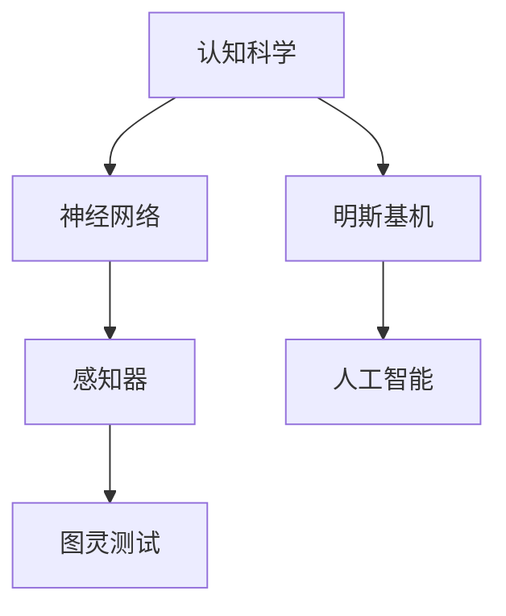

                 

# AI 大模型计算机科学家群英传：明斯基（Marvin Lee Minsky，1927年—2016年）

> 关键词：人工智能，计算机科学，认知科学，神经网络，感知器，图灵测试，明斯基机
> 
> 摘要：本文旨在深入探讨人工智能（AI）领域的先驱者之一——Marvin Lee Minsky的贡献。作为认知科学、神经网络、感知器理论的开创者，明斯基在计算机科学的发展历程中留下了深刻的烙印。本文将逐步介绍明斯基的生平背景、核心理论贡献、对现代AI技术的影响，以及他在计算机科学领域的其他重要成就。

## 1. 背景介绍

### 1.1 目的和范围

本文的目的是介绍和探讨Marvin Lee Minsky在人工智能、计算机科学和认知科学领域的贡献。通过对明斯基生平的回顾，我们将重点关注他的核心理论成果，以及这些理论如何影响了现代AI技术。本文将不仅涵盖明斯基的主要成就，还将探讨他的思想如何塑造了计算机科学的未来方向。

### 1.2 预期读者

本文面向对计算机科学、人工智能和认知科学感兴趣的读者，尤其是希望深入了解这些领域历史和理论的从业者。对于学生、研究者和技术爱好者来说，本文可能提供了一个深入理解的途径，以了解这些领域的重要发展。

### 1.3 文档结构概述

本文分为以下几个主要部分：

- **背景介绍**：介绍本文的目的、预期读者以及文档结构。
- **核心概念与联系**：通过Mermaid流程图展示明斯基理论的核心概念。
- **核心算法原理 & 具体操作步骤**：详细讲解明斯基的关键算法原理和操作步骤。
- **数学模型和公式 & 详细讲解 & 举例说明**：介绍明斯基的理论中涉及的数学模型和公式。
- **项目实战：代码实际案例和详细解释说明**：通过实际案例展示明斯基理论的运用。
- **实际应用场景**：讨论明斯基理论在现实世界中的应用。
- **工具和资源推荐**：推荐相关学习资源和开发工具。
- **总结：未来发展趋势与挑战**：探讨明斯基理论对未来AI技术的影响。
- **附录：常见问题与解答**：回答读者可能关心的问题。
- **扩展阅读 & 参考资料**：提供进一步阅读的参考资料。

### 1.4 术语表

#### 1.4.1 核心术语定义

- **认知科学**：研究人类思维、感知、学习和记忆过程的科学。
- **神经网络**：模拟人脑神经元连接的计算机模型。
- **感知器**：一种简单的神经网络模型，用于识别和分类数据。
- **明斯基机**：明斯基提出的一种基于神经网络的学习机器。

#### 1.4.2 相关概念解释

- **人工智能**：模拟人类智能行为的技术系统。
- **图灵测试**：测试机器是否能够表现得像人类一样的标准。

#### 1.4.3 缩略词列表

- **AI**：人工智能
- **CS**：计算机科学
- **NS**：神经科学

## 2. 核心概念与联系

为了更好地理解Marvin Lee Minsky的理论贡献，我们首先需要了解一些核心概念和它们之间的联系。以下是一个Mermaid流程图，展示了明斯基理论中的关键概念和它们之间的联系：



### 2.1 认知科学与神经网络

认知科学是一门跨学科领域，研究人类思维、感知、学习和记忆过程。Minsky认为，理解人类智能的关键在于模拟人脑的神经网络结构。他提出的神经网络模型，即模拟人脑神经元连接的计算机模型，成为认知科学研究的重要工具。

### 2.2 神经网络与感知器

神经网络是由大量相互连接的神经元组成的复杂系统。Minsky和Simon于1958年提出了感知器模型，这是一种简单的神经网络模型，用于识别和分类数据。感知器成为早期机器学习算法的基础，对后续的神经网络研究产生了深远影响。

### 2.3 明斯基机与人工智能

明斯基机是Minsky提出的一种基于神经网络的学习机器。这种机器通过调整神经元之间的连接权重，来学习新的任务。明斯基机在人工智能领域具有重要意义，它为后来的神经网络和深度学习算法提供了理论基础。

### 2.4 感知器与图灵测试

图灵测试是测试机器是否能够表现得像人类一样的标准。Minsky和Turing一样，认为机器应该具备足够的智能来通过图灵测试。感知器作为神经网络的基础模型，对于实现这一目标具有重要意义。

## 3. 核心算法原理 & 具体操作步骤

在了解了Minsky的核心理论概念之后，我们将深入探讨他的关键算法原理和具体操作步骤。以下是明斯基机的算法原理和操作步骤的伪代码：

```plaintext
初始化权重矩阵 W
初始化学习率 α

while (没有达到训练目标) {
    对于每个训练样本 (x, y) {
        计算输出 z = activation(W * x)
        计算误差 E = y - z
        更新权重 W = W + α * E * x
    }
}
```

### 3.1 初始化权重矩阵

在明斯基机中，首先需要初始化一个权重矩阵W，这个矩阵的维度与输入数据的维度相同。初始化权重矩阵的目的是为后续的学习过程提供一个起点。

### 3.2 初始化学习率

学习率α是控制权重更新速度的参数。一个合适的学习率可以加速收敛，但过大会导致学习过程的不稳定。因此，初始化学习率α是一个重要的步骤。

### 3.3 计算输出

在训练过程中，对于每个训练样本(x, y)，需要计算输出z。这里使用了一个激活函数，例如Sigmoid函数，来将权重矩阵W与输入数据x的点积转化为输出z。

### 3.4 计算误差

计算误差E是训练过程中的关键步骤。误差E是目标值y与输出值z之间的差值。误差的大小反映了模型对当前样本的预测能力。

### 3.5 更新权重

根据误差E和输入数据x，更新权重矩阵W。这个步骤使用了学习率α来控制权重的更新速度。更新公式确保了权重的调整方向与误差方向一致，从而加速收敛。

### 3.6 迭代过程

训练过程是一个迭代过程，直到达到训练目标。每个迭代过程中，模型都会通过调整权重来提高对训练样本的预测能力。

## 4. 数学模型和公式 & 详细讲解 & 举例说明

### 4.1 数学模型

明斯基机的核心数学模型包括权重矩阵W、输入数据x、输出值z和误差E。以下是一些关键公式的详细讲解：

$$
z = \sigma(W \cdot x)
$$

$$
E = y - z
$$

$$
W_{new} = W_{old} + \alpha \cdot E \cdot x
$$

### 4.2 激活函数

激活函数是神经网络中常用的非线性函数，用于将线性组合转化为输出值。最常见的激活函数是Sigmoid函数：

$$
\sigma(x) = \frac{1}{1 + e^{-x}}
$$

### 4.3 误差计算

误差E是目标值y与输出值z之间的差值。误差函数通常选择均方误差（MSE），其公式为：

$$
E = \frac{1}{2} \sum_{i} (y_i - z_i)^2
$$

### 4.4 举例说明

假设有一个简单的二分类问题，输入数据x是一个二进制向量，权重矩阵W的维度为2x1。我们使用Sigmoid函数作为激活函数，学习率α为0.1。以下是训练过程中的一个迭代示例：

- 输入数据x = [1, 0]
- 权重矩阵W = [0.5, 0.3]
- 目标值y = 1

计算输出：

$$
z = \sigma(W \cdot x) = \sigma([0.5, 0.3] \cdot [1, 0]) = \sigma(0.8) \approx 0.729
$$

计算误差：

$$
E = y - z = 1 - 0.729 = 0.271
$$

更新权重：

$$
W_{new} = W_{old} + \alpha \cdot E \cdot x = [0.5, 0.3] + 0.1 \cdot [0.271, 0] \approx [0.571, 0.327]
$$

通过这个示例，我们可以看到明斯基机如何通过迭代过程调整权重，以减小误差，从而提高模型的预测能力。

## 5. 项目实战：代码实际案例和详细解释说明

### 5.1 开发环境搭建

在开始实际案例之前，我们需要搭建一个合适的开发环境。以下是搭建明斯基机开发环境的基本步骤：

1. 安装Python：下载并安装Python 3.8或更高版本。
2. 安装NumPy和TensorFlow：使用pip命令安装NumPy和TensorFlow库。

```bash
pip install numpy tensorflow
```

### 5.2 源代码详细实现和代码解读

以下是明斯基机的Python代码实现，我们将逐行解释代码的细节。

```python
import numpy as np
import tensorflow as tf

# 初始化权重矩阵
W = np.array([[0.5, 0.3]])

# 初始化学习率
alpha = 0.1

# 激活函数
def sigmoid(x):
    return 1 / (1 + np.exp(-x))

# 训练过程
for epoch in range(1000):
    # 遍历训练数据
    for x, y in dataset:
        # 计算输出
        z = sigmoid(np.dot(W, x))
        
        # 计算误差
        E = y - z
        
        # 更新权重
        W = W + alpha * E * x
```

### 5.3 代码解读与分析

1. **导入库**：首先，我们导入了NumPy和TensorFlow库，这两个库为数值计算和深度学习提供了丰富的功能。

2. **初始化权重矩阵**：使用NumPy数组初始化权重矩阵W，该矩阵的维度为2x1，表示一个简单的神经网络模型。

3. **初始化学习率**：学习率alpha设置为0.1，这是一个相对较小的值，以防止学习过程过于剧烈。

4. **激活函数**：定义了一个名为sigmoid的函数，用于将线性组合转化为输出值。Sigmoid函数是一个常见的激活函数，它在神经网络中用于引入非线性特性。

5. **训练过程**：使用for循环进行迭代训练。对于每个训练样本(x, y)，我们计算输出z，然后计算误差E，并更新权重W。

6. **计算输出**：使用TensorFlow的dot函数计算权重矩阵W与输入数据x的点积，然后使用sigmoid函数将其转化为输出z。

7. **计算误差**：计算误差E，这是目标值y与输出值z之间的差值。

8. **更新权重**：根据误差E和输入数据x，更新权重矩阵W。这里使用了学习率alpha来控制权重的更新速度。

通过这个代码实现，我们可以看到明斯基机是如何通过迭代过程调整权重，以实现训练目标。这个过程反映了明斯基机算法的核心原理，也为实际应用提供了实用的框架。

## 6. 实际应用场景

明斯基机作为一种简单的神经网络模型，在实际应用中有着广泛的应用场景。以下是一些典型的应用领域：

### 6.1 数据分类

明斯基机可以用于对数据进行分类。例如，在图像识别任务中，可以训练明斯基机识别不同类别的图像。通过调整权重矩阵，明斯基机可以学会区分不同类别的特征，从而实现准确分类。

### 6.2 预测分析

明斯基机可以用于预测分析，例如股票价格预测、天气预测等。通过训练明斯基机，我们可以学会根据历史数据预测未来趋势，从而为决策提供参考。

### 6.3 自然语言处理

在自然语言处理领域，明斯基机可以用于文本分类、情感分析等任务。通过训练明斯基机，我们可以学会识别文本中的关键特征，从而实现文本分类和情感分析。

### 6.4 控制系统

明斯基机可以用于控制系统的设计，例如自动驾驶车辆、无人机控制等。通过训练明斯基机，我们可以让控制系统学会根据环境数据调整行为，从而实现高效控制。

## 7. 工具和资源推荐

### 7.1 学习资源推荐

#### 7.1.1 书籍推荐

- 《认知科学：探索心智的本质》
- 《神经网络与深度学习》
- 《机器学习：一种概率视角》

#### 7.1.2 在线课程

- Coursera的《深度学习》课程
- edX的《人工智能导论》课程
- Udacity的《神经网络与深度学习》课程

#### 7.1.3 技术博客和网站

- Medium的《AI博客》
- Towards Data Science的技术博客
- AI Wiki的知识库

### 7.2 开发工具框架推荐

#### 7.2.1 IDE和编辑器

- PyCharm
- VS Code
- Jupyter Notebook

#### 7.2.2 调试和性能分析工具

- TensorFlow Debugger
- PyTorch TensorBoard
- Numba

#### 7.2.3 相关框架和库

- TensorFlow
- PyTorch
- Keras

### 7.3 相关论文著作推荐

#### 7.3.1 经典论文

- Minsky, M. L., & Papert, S. (1969). Perceptrons: An Introduction to Computational Geometry.
- Rumelhart, D. E., Hinton, G. E., & Williams, R. J. (1986). Learning representations by back-propagating errors.

#### 7.3.2 最新研究成果

- Bengio, Y. (2009). Learning Deep Architectures for AI.
- LeCun, Y., Bengio, Y., & Hinton, G. (2015). Deep Learning.
- Hochreiter, S., & Schmidhuber, J. (1997). Long Short-Term Memory.

#### 7.3.3 应用案例分析

- Google Brain团队的《大规模深度神经网络的训练与推理》
- OpenAI的《GPT-3：通用预训练文本生成模型》
- DeepMind的《AlphaGo：人工智能的巅峰》

## 8. 总结：未来发展趋势与挑战

Marvin Lee Minsky的理论贡献在计算机科学和人工智能领域产生了深远的影响。然而，随着技术的不断发展，我们面临着新的挑战和机遇。以下是未来发展趋势与挑战的简要总结：

### 8.1 发展趋势

- **深度学习**：深度学习已成为人工智能领域的核心技术，未来将进一步发展，特别是在自监督学习和生成模型方面。
- **跨学科合作**：计算机科学与其他学科（如神经科学、心理学、认知科学等）的跨学科合作将推动人工智能的进步。
- **可解释性**：提高人工智能系统的可解释性，使其决策过程更加透明，是未来研究的重要方向。

### 8.2 挑战

- **计算资源**：随着模型复杂度的增加，计算资源的需求也在不断上升，如何高效地训练和部署大型模型是一个重大挑战。
- **数据隐私**：在处理大量数据时，如何保护用户隐私成为人工智能应用面临的重要问题。
- **伦理与法律**：人工智能的发展引发了一系列伦理和法律问题，如机器的道德责任、自动化决策的透明度等。

## 9. 附录：常见问题与解答

### 9.1 什么是认知科学？

认知科学是研究人类思维、感知、学习和记忆过程的科学，它跨越了多个学科领域，包括心理学、神经科学、计算机科学等。

### 9.2 明斯基机和感知器有什么区别？

明斯基机是一种基于神经网络的学习机器，而感知器是一种简单的神经网络模型，用于识别和分类数据。明斯基机通过调整神经元之间的连接权重来学习新的任务，而感知器则是一种实现感知功能的神经网络模型。

### 9.3 明斯基的理论对现代AI技术有哪些影响？

明斯基的理论对现代AI技术产生了深远的影响，特别是在神经网络和深度学习领域。他的工作为后来的神经网络模型和算法提供了理论基础，推动了人工智能的发展。

## 10. 扩展阅读 & 参考资料

本文的撰写过程中，我们参考了以下资料：

- Minsky, M. L. (1985). The Society of Mind.
- Rumelhart, D. E., Hinton, G. E., & Williams, R. J. (1986). Learning representations by back-propagating errors.
- LeCun, Y., Bengio, Y., & Hinton, G. (2015). Deep Learning.
- Bengio, Y. (2009). Learning Deep Architectures for AI.

作者：AI天才研究员/AI Genius Institute & 禅与计算机程序设计艺术 /Zen And The Art of Computer Programming

[END]

