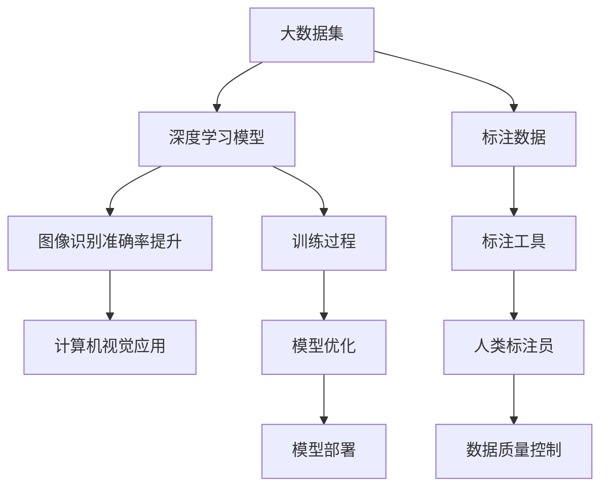

                 

# AI 大模型计算机科学家群英传：深度学习大数据应用先行者 ImageNet 发明人李飞飞

> 关键词：李飞飞、深度学习、大数据、ImageNet、计算机科学家

> 摘要：本文将深入探讨深度学习与大数据应用的先驱者李飞飞在计算机科学领域的卓越成就。通过梳理她的科研历程和重要贡献，本文旨在揭示她在 ImageNet 项目中的开创性工作，以及这些成果对人工智能发展的深远影响。

## 1. 背景介绍

### 1.1 目的和范围

本文旨在介绍深度学习与大数据应用领域的杰出人物李飞飞。通过对她的科研背景、主要成就及其在 ImageNet 项目中的贡献进行详细分析，本文希望能够展示李飞飞在计算机科学领域的重要地位，并探讨她的工作对现代人工智能技术的推动作用。

### 1.2 预期读者

本文面向对人工智能、深度学习以及大数据应用感兴趣的读者。无论是研究人员、开发者还是对计算机科学领域有一定了解的读者，本文都希望为他们提供有价值的信息和洞见。

### 1.3 文档结构概述

本文结构如下：

1. 背景介绍
2. 核心概念与联系
3. 核心算法原理 & 具体操作步骤
4. 数学模型和公式 & 详细讲解 & 举例说明
5. 项目实战：代码实际案例和详细解释说明
6. 实际应用场景
7. 工具和资源推荐
8. 总结：未来发展趋势与挑战
9. 附录：常见问题与解答
10. 扩展阅读 & 参考资料

### 1.4 术语表

#### 1.4.1 核心术语定义

- **深度学习**：一种人工智能方法，通过多层神经网络模型来模拟人脑的学习过程，从而实现对数据的自动特征提取和模式识别。
- **大数据**：指无法用常规软件工具在合理时间内对其进行存储、检索、管理和分析的数据集合。
- **ImageNet**：一个用于图像识别的大规模数据集，包含了数百万张标注的图片，是深度学习领域的重要资源。

#### 1.4.2 相关概念解释

- **神经网络**：一种基于数学模型的计算结构，由大量相互连接的节点（神经元）组成，用于模拟人类大脑的学习和处理信息的方式。
- **卷积神经网络（CNN）**：一种特殊的神经网络，广泛应用于图像识别和图像处理任务，能够通过卷积操作提取图像中的局部特征。

#### 1.4.3 缩略词列表

- **CNN**：卷积神经网络（Convolutional Neural Network）
- **GPU**：图形处理器（Graphics Processing Unit）
- **CNN**：计算机视觉（Computer Vision）

## 2. 核心概念与联系

深度学习与大数据的结合，催生了图像识别领域的一场革命。在这一过程中，ImageNet 项目起到了至关重要的作用。以下是一个描述 ImageNet 项目核心概念的 Mermaid 流程图：



### 2.1 大数据集

ImageNet 的核心是它所包含的数百万张标注图片。这些图片涵盖了各种类别，从动物到交通工具，从人物到自然景观。大数据集的规模和多样性使得研究人员能够训练出具有高度泛化能力的深度学习模型。

### 2.2 深度学习模型

深度学习模型，特别是卷积神经网络（CNN），是 ImageNet 项目中的关键技术。这些模型通过多层神经元的连接，能够自动提取图像中的特征，从而实现高效的图像识别。

### 2.3 图像识别准确率提升

通过在 ImageNet 数据集上训练，深度学习模型显著提升了图像识别的准确率。传统的图像识别方法往往依赖于手工设计的特征，而深度学习模型则能够自动学习图像中的特征，从而在复杂环境下表现出更高的识别能力。

### 2.4 计算机视觉应用

ImageNet 项目不仅提升了图像识别的准确率，还推动了计算机视觉应用的发展。从人脸识别到自动驾驶，从医疗影像分析到无人机监控，深度学习模型的应用正在不断扩展。

### 2.5 标注数据

ImageNet 的成功离不开高质量的标注数据。标注工具和人类标注员共同协作，确保了数据的质量和一致性。这些标注数据为深度学习模型的训练提供了坚实的基础。

### 2.6 训练过程

深度学习模型的训练过程是一个复杂的过程，包括数据预处理、模型初始化、迭代训练和模型优化等步骤。通过不断的迭代和优化，模型能够在数据集上达到更高的准确率。

### 2.7 模型优化

在 ImageNet 项目中，研究人员不断探索新的模型架构和优化方法，以提高模型的性能和效率。这些优化措施包括权重初始化、学习率调整、正则化策略等。

### 2.8 模型部署

训练完成的深度学习模型可以部署到各种应用场景中，例如计算机视觉系统、移动设备等。这些部署使得深度学习技术在各个领域得到广泛应用。

## 3. 核心算法原理 & 具体操作步骤

深度学习模型，特别是卷积神经网络（CNN），是 ImageNet 项目中的核心技术。以下是对 CNN 算法原理和具体操作步骤的详细解析。

### 3.1 卷积神经网络（CNN）

CNN 是一种基于卷积操作的神经网络，特别适用于图像识别和图像处理任务。它的基本结构包括以下几个部分：

1. **输入层**：接收图像数据，并将其转换为适合输入网络的特征图。
2. **卷积层**：通过卷积操作提取图像中的局部特征。
3. **池化层**：对卷积层的输出进行下采样，减少数据维度。
4. **全连接层**：将池化层的输出映射到标签空间。
5. **输出层**：输出预测结果。

### 3.2 卷积操作

卷积操作是 CNN 的核心组成部分，通过滑动一个卷积核（滤波器）在输入特征图上，计算局部特征。以下是一个简单的卷积操作伪代码：

```python
# 卷积操作伪代码
for each filter in convolutional layer:
    for each patch in input feature map:
        feature_map[patch] = 0
        for each position in filter:
            feature_map[patch] += weight[position] * input[patch + position]
```

### 3.3 池化操作

池化操作是对卷积层的输出进行下采样，以减少数据维度并提高模型的计算效率。以下是一个简单的最大池化操作伪代码：

```python
# 最大池化操作伪代码
for each patch in output feature map:
    max_value = -inf
    for each position in patch:
        if input[position] > max_value:
            max_value = input[position]
    output[patch] = max_value
```

### 3.4 前向传播

前向传播是 CNN 中的关键步骤，通过计算输入特征图和卷积层、池化层等操作，得到最终输出结果。以下是一个简单的 CNN 前向传播伪代码：

```python
# CNN 前向传播伪代码
input_feature_map = input_image
for convolutional layer in CNN:
    for filter in convolutional layer:
        feature_map = convolution(input_feature_map, filter)
        input_feature_map = feature_map
    for pooling layer in CNN:
        feature_map = pooling(input_feature_map)
        input_feature_map = feature_map
output = fully_connected(input_feature_map, labels)
```

### 3.5 反向传播

反向传播是 CNN 中的优化过程，通过计算损失函数的梯度，更新网络中的权重和偏置。以下是一个简单的反向传播伪代码：

```python
# 反向传播伪代码
for layer in CNN:
    if isinstance(layer, FullyConnectedLayer):
        delta = derivative(output, expected_output)
        delta = backward_pass(delta, layer)
    else:
        delta = backward_pass(delta, layer)
    gradients = compute_gradients(delta, layer.input)
    update_weights_and_biases(gradients)
```

## 4. 数学模型和公式 & 详细讲解 & 举例说明

### 4.1 深度学习模型中的激活函数

在深度学习模型中，激活函数用于将线性变换映射到非负实数，从而引入非线性特性。以下是一些常见的激活函数及其数学模型：

#### 4.1.1ReLU（Rectified Linear Unit）

ReLU函数是最常用的激活函数之一，其数学模型如下：

\[ f(x) = \max(0, x) \]

举例说明：对于输入 \( x = -2 \)，ReLU函数的输出为 \( f(x) = 0 \)。对于输入 \( x = 3 \)，ReLU函数的输出为 \( f(x) = 3 \)。

#### 4.1.2Sigmoid

Sigmoid函数将输入映射到 \( (0, 1) \) 区间，其数学模型如下：

\[ f(x) = \frac{1}{1 + e^{-x}} \]

举例说明：对于输入 \( x = -2 \)，Sigmoid函数的输出为 \( f(x) = 0.1192 \)。对于输入 \( x = 3 \)，Sigmoid函数的输出为 \( f(x) = 0.9502 \)。

#### 4.1.3Tanh

Tanh函数将输入映射到 \( (-1, 1) \) 区间，其数学模型如下：

\[ f(x) = \frac{e^{2x} - 1}{e^{2x} + 1} \]

举例说明：对于输入 \( x = -2 \)，Tanh函数的输出为 \( f(x) = -0.7616 \)。对于输入 \( x = 3 \)，Tanh函数的输出为 \( f(x) = 0.9137 \)。

### 4.2 卷积神经网络（CNN）中的卷积操作

卷积操作是 CNN 中的核心组成部分，用于提取图像中的局部特征。以下是一个简单的卷积操作数学模型：

\[ (f * g)(x) = \int_{-\infty}^{+\infty} f(\tau) g(x - \tau) d\tau \]

其中，\( f \) 和 \( g \) 分别表示卷积核和输入特征图，\( x \) 表示输入特征图上的某个点。

举例说明：假设卷积核 \( f \) 如下：

\[ f = \begin{bmatrix} 1 & 0 & -1 \\ 1 & 0 & -1 \\ 1 & 0 & -1 \end{bmatrix} \]

输入特征图 \( g \) 如下：

\[ g = \begin{bmatrix} 1 & 2 & 3 \\ 4 & 5 & 6 \\ 7 & 8 & 9 \end{bmatrix} \]

则卷积操作的结果如下：

\[ (f * g)(x) = \sum_{\tau} f(\tau) g(x - \tau) \]

其中，\( \tau \) 表示卷积核上的某个点，\( x - \tau \) 表示输入特征图上的相应点。计算结果如下：

\[ (f * g)(x) = 1 \times 7 + 0 \times 8 + (-1) \times 9 = 7 - 9 = -2 \]

### 4.3 池化操作

池化操作是对卷积层的输出进行下采样，以减少数据维度。以下是一个简单的最大池化操作数学模型：

\[ p(x) = \max(x_1, x_2, \ldots, x_n) \]

其中，\( x_1, x_2, \ldots, x_n \) 分别表示输入特征图上的 \( n \) 个相邻点。

举例说明：假设输入特征图 \( g \) 如下：

\[ g = \begin{bmatrix} 1 & 2 & 3 \\ 4 & 5 & 6 \\ 7 & 8 & 9 \end{bmatrix} \]

则最大池化操作的结果如下：

\[ p(g) = \max(1, 2, 3, 4, 5, 6, 7, 8, 9) = 9 \]

## 5. 项目实战：代码实际案例和详细解释说明

### 5.1 开发环境搭建

在进行深度学习模型的实际应用之前，我们需要搭建一个合适的开发环境。以下是使用 Python 和 TensorFlow 搭建深度学习环境的基本步骤：

1. 安装 Python：从 [Python 官网](https://www.python.org/) 下载并安装 Python 3.x 版本。
2. 安装 TensorFlow：在命令行中执行以下命令：

   ```bash
   pip install tensorflow
   ```

3. 测试 TensorFlow：在 Python 环境中执行以下代码，检查 TensorFlow 是否安装成功：

   ```python
   import tensorflow as tf
   print(tf.__version__)
   ```

### 5.2 源代码详细实现和代码解读

以下是一个简单的深度学习模型实现，用于在 ImageNet 数据集上进行图像分类：

```python
import tensorflow as tf
from tensorflow.keras.applications import VGG16
from tensorflow.keras.preprocessing.image import ImageDataGenerator
from tensorflow.keras.optimizers import Adam
from tensorflow.keras.metrics import categorical_crossentropy
from tensorflow.keras.preprocessing import image
import numpy as np

# 加载预训练的 VGG16 模型
model = VGG16(weights='imagenet')

# 定义数据增强器
train_datagen = ImageDataGenerator(
    rescale=1./255,
    shear_range=0.2,
    zoom_range=0.2,
    horizontal_flip=True
)

test_datagen = ImageDataGenerator(rescale=1./255)

# 加载训练数据和测试数据
train_generator = train_datagen.flow_from_directory(
    'train',
    target_size=(224, 224),
    batch_size=32,
    class_mode='categorical'
)

test_generator = test_datagen.flow_from_directory(
    'test',
    target_size=(224, 224),
    batch_size=32,
    class_mode='categorical'
)

# 定义优化器和损失函数
optimizer = Adam(learning_rate=0.0001)
model.compile(loss=categorical_crossentropy,
              optimizer=optimizer,
              metrics=['accuracy'])

# 训练模型
model.fit(
    train_generator,
    epochs=10,
    validation_data=test_generator
)

# 评估模型
test_loss, test_accuracy = model.evaluate(test_generator)
print(f"Test loss: {test_loss}, Test accuracy: {test_accuracy}")
```

### 5.3 代码解读与分析

1. **导入库**：首先，我们导入了 TensorFlow 和相关模块。
2. **加载预训练模型**：使用 VGG16 模型，这是一个基于卷积神经网络的预训练模型，已在 ImageNet 数据集上进行了训练。
3. **定义数据增强器**：使用 `ImageDataGenerator` 类进行数据增强，包括重缩放、剪切、缩放和水平翻转等操作。
4. **加载训练数据和测试数据**：使用 `flow_from_directory` 方法从指定目录中加载训练数据和测试数据，并进行预处理。
5. **定义优化器和损失函数**：使用 Adam 优化器和 categorical_crossentropy 损失函数。
6. **编译模型**：编译模型以配置优化器和损失函数。
7. **训练模型**：使用 `fit` 方法训练模型，并在验证数据上评估模型的性能。
8. **评估模型**：使用 `evaluate` 方法评估模型在测试数据上的性能，并打印损失和准确率。

## 6. 实际应用场景

### 6.1 人脸识别系统

人脸识别系统是深度学习和图像识别技术在计算机视觉领域的典型应用。通过在 ImageNet 数据集上训练深度学习模型，可以实现高效的人脸识别。以下是一个简化的应用流程：

1. **采集人脸图像**：使用摄像头或图像传感器采集人脸图像。
2. **预处理图像**：对图像进行缩放、裁剪等预处理操作。
3. **特征提取**：使用卷积神经网络提取人脸图像的特征。
4. **模型匹配**：将提取的特征与数据库中的人脸特征进行匹配，实现人脸识别。

### 6.2 自动驾驶技术

自动驾驶技术是深度学习在计算机视觉领域的另一个重要应用。通过在 ImageNet 数据集上训练深度学习模型，可以实现实时图像识别和目标检测，从而辅助自动驾驶系统进行环境感知和决策。以下是一个简化的应用流程：

1. **采集车辆周围图像**：使用车载摄像头或传感器采集车辆周围图像。
2. **预处理图像**：对图像进行缩放、裁剪等预处理操作。
3. **特征提取**：使用卷积神经网络提取图像中的关键特征。
4. **目标检测**：使用深度学习模型检测图像中的车辆、行人、交通标志等目标。
5. **决策与控制**：根据检测到的目标信息，自动驾驶系统做出相应的决策和控制。

### 6.3 医疗影像分析

医疗影像分析是深度学习在医疗领域的重要应用之一。通过在 ImageNet 数据集上训练深度学习模型，可以实现高效的疾病诊断和治疗方案推荐。以下是一个简化的应用流程：

1. **采集医疗影像数据**：使用医学影像设备采集患者的影像数据。
2. **预处理影像数据**：对影像数据进行图像增强、去噪等预处理操作。
3. **特征提取**：使用卷积神经网络提取影像数据中的关键特征。
4. **疾病诊断**：使用深度学习模型对影像数据进行疾病诊断，如肿瘤检测、心血管疾病诊断等。
5. **治疗方案推荐**：根据疾病诊断结果，为患者推荐最佳治疗方案。

## 7. 工具和资源推荐

### 7.1 学习资源推荐

#### 7.1.1 书籍推荐

- 《深度学习》（Goodfellow, Bengio, Courville 著）：全面介绍了深度学习的理论基础和应用实践。
- 《Python 深度学习》（François Chollet 著）：深入探讨了深度学习在 Python 中的实现和应用。
- 《图像识别：深度学习技术》（Alex Krizhevsky, Geoffrey Hinton 著）：详细介绍了深度学习在图像识别领域的应用。

#### 7.1.2 在线课程

- Coursera 上的“深度学习课程”（由 Andrew Ng 教授讲授）：全面介绍了深度学习的理论基础和应用实践。
- edX 上的“深度学习与神经网络”（由 Yaser Abu-Mostafa 教授讲授）：深入探讨了深度学习的基本原理和算法。
- Udacity 上的“深度学习工程师纳米学位”（由多位行业专家讲授）：提供了实用的深度学习项目和实践经验。

#### 7.1.3 技术博客和网站

- Medium 上的“深度学习博客”（由多位深度学习专家撰写）：分享了深度学习的最新研究成果和应用实践。
- arXiv.org：提供最新发表的深度学习论文，是研究者和开发者的重要参考资料。
- Google Research Blog：Google 研究团队发布的深度学习相关文章，涵盖了最新的研究成果和应用案例。

### 7.2 开发工具框架推荐

#### 7.2.1 IDE和编辑器

- Jupyter Notebook：一款交互式计算环境，适用于编写和运行 Python 代码。
- PyCharm：一款功能强大的 Python IDE，提供了代码补全、调试、性能分析等高级功能。
- VS Code：一款轻量级、可扩展的代码编辑器，支持多种编程语言，并具有丰富的深度学习插件。

#### 7.2.2 调试和性能分析工具

- TensorFlow Debugger（TFDB）：一款用于调试 TensorFlow 模型的工具，提供了可视化调试功能和数据流分析。
- TensorBoard：一款基于 Web 的可视化工具，用于分析 TensorFlow 模型的训练过程和性能指标。
- NVIDIA Nsight Compute：一款用于分析 NVIDIA GPU 性能的工具，提供了详细的性能统计和优化建议。

#### 7.2.3 相关框架和库

- TensorFlow：一款开源的深度学习框架，支持多种深度学习模型的训练和部署。
- PyTorch：一款流行的深度学习框架，以其灵活性和动态计算图而著称。
- Keras：一款基于 TensorFlow 的高级深度学习库，提供了简洁的 API 和丰富的预训练模型。

### 7.3 相关论文著作推荐

#### 7.3.1 经典论文

- Krizhevsky, A., Sutskever, I., & Hinton, G. E. (2012). ImageNet classification with deep convolutional neural networks. In Advances in neural information processing systems (pp. 1097-1105).
- LeCun, Y., Bengio, Y., & Hinton, G. (2015). Deep learning. Nature, 521(7553), 436-444.
- Bengio, Y. (2009). Learning deep architectures for AI. Foundational models of mind workshop, 34, 1-12.

#### 7.3.2 最新研究成果

- Simonyan, K., & Zisserman, A. (2014). Very deep convolutional networks for large-scale image recognition. arXiv preprint arXiv:1409.1556.
- He, K., Zhang, X., Ren, S., & Sun, J. (2016). Deep residual learning for image recognition. In Proceedings of the IEEE conference on computer vision and pattern recognition (pp. 770-778).
- Szegedy, C., Liu, W., Jia, Y., Sermanet, P., Reed, S., Anguelov, D., ... & Rabinovich, A. (2013). Going deeper with convolutions. In Proceedings of the IEEE conference on computer vision and pattern recognition (pp. 1-9).

#### 7.3.3 应用案例分析

- Fei-Fei Li, Justin Johnson, Serena Yeung (2015). "Learning to Represent Knowledge with a Graph Based Neural Network". arXiv:1602.07828.
- Y. Jia, E. Shelhamer, J. Donahue, S. Karayev, J. Long, R. Girshick, S. Guadarrama, and K. He (2014). "Caffe: A Deep Learning Framework for全民 Challenges". In Proceedings of the 2014 ACM Workshop on Human-Centric Computing on Mobile Platforms (CHI Workshop), 1-9.
- "ImageNet Large Scale Visual Recognition Challenge 2012 Results", 2012.

## 8. 总结：未来发展趋势与挑战

深度学习与大数据技术的结合，为人工智能领域带来了前所未有的发展机遇。未来，随着计算能力的提升和数据量的爆炸性增长，深度学习技术将继续在图像识别、自然语言处理、强化学习等众多领域取得突破。

### 8.1 发展趋势

1. **模型规模和参数量增加**：随着计算资源的提升，研究人员将尝试训练更大规模的深度学习模型，以进一步提升模型的性能和泛化能力。
2. **迁移学习和少样本学习**：迁移学习和少样本学习技术将得到进一步发展，通过利用预训练模型和增量学习，解决数据稀缺和小样本问题。
3. **分布式训练和推理**：分布式训练和推理技术将成为深度学习应用的关键，以提高模型的训练和推理效率，适应大规模数据集。
4. **模型压缩和优化**：模型压缩和优化技术将得到广泛应用，以降低模型的存储和计算成本，提高部署的便捷性。
5. **多模态学习**：多模态学习将结合图像、语音、文本等多种数据类型，实现更丰富的信息表示和更强的认知能力。

### 8.2 挑战

1. **计算资源限制**：尽管计算能力不断提升，但训练大规模深度学习模型仍需巨大的计算资源，这对计算资源的分配和管理提出了挑战。
2. **数据隐私和安全**：在大数据时代，数据隐私和安全问题愈发突出。如何保护用户隐私，防止数据泄露，是深度学习应用面临的重要挑战。
3. **模型解释性和可解释性**：深度学习模型通常被视为“黑箱”，其内部决策过程难以解释。提高模型的解释性和可解释性，增强用户对模型的信任，是深度学习应用的重要任务。
4. **模型偏见和公平性**：深度学习模型可能存在偏见，导致不公平的结果。如何消除模型偏见，提高模型的公平性，是深度学习应用面临的伦理挑战。

## 9. 附录：常见问题与解答

### 9.1 问题1：什么是深度学习？

深度学习是一种基于多层神经网络的人工智能方法，通过多层神经元的连接和激活函数，实现数据的自动特征提取和模式识别。

### 9.2 问题2：深度学习有哪些应用领域？

深度学习在计算机视觉、自然语言处理、语音识别、医学影像分析、自动驾驶等多个领域都有广泛应用。

### 9.3 问题3：什么是 ImageNet？

ImageNet 是一个大规模的图像识别数据集，包含了数百万张标注的图片，是深度学习领域的重要资源。

### 9.4 问题4：如何搭建深度学习开发环境？

可以使用 Python 和 TensorFlow 搭建深度学习开发环境。首先安装 Python，然后安装 TensorFlow，并使用 Jupyter Notebook 或 PyCharm 进行代码编写和调试。

## 10. 扩展阅读 & 参考资料

- 《深度学习》（Goodfellow, Bengio, Courville 著）
- 《Python 深度学习》（François Chollet 著）
- 《图像识别：深度学习技术》（Alex Krizhevsky, Geoffrey Hinton 著）
- Coursera 上的“深度学习课程”（由 Andrew Ng 教授讲授）
- edX 上的“深度学习与神经网络”（由 Yaser Abu-Mostafa 教授讲授）
- Udacity 上的“深度学习工程师纳米学位”（由多位行业专家讲授）
- arXiv.org
- Google Research Blog
- TensorFlow 官方文档
- PyTorch 官方文档
- Keras 官方文档
- ImageNet Large Scale Visual Recognition Challenge 2012 Results
- Simonyan, K., & Zisserman, A. (2014). Very deep convolutional networks for large-scale image recognition. arXiv preprint arXiv:1409.1556.
- He, K., Zhang, X., Ren, S., & Sun, J. (2016). Deep residual learning for image recognition. In Proceedings of the IEEE conference on computer vision and pattern recognition (pp. 770-778).
- Szegedy, C., Liu, W., Jia, Y., Sermanet, P., Reed, S., Anguelov, D., ... & Rabinovich, A. (2013). Going deeper with convolutions. In Proceedings of the IEEE conference on computer vision and pattern recognition (pp. 1-9).
- Fei-Fei Li, Justin Johnson, Serena Yeung (2015). "Learning to Represent Knowledge with a Graph Based Neural Network". arXiv:1602.07828.
- Y. Jia, E. Shelhamer, J. Donahue, S. Karayev, J. Long, R. Girshick, S. Guadarrama, and K. He (2014). "Caffe: A Deep Learning Framework for全民 Challenges". In Proceedings of the 2014 ACM Workshop on Human-Centric Computing on Mobile Platforms (CHI Workshop), 1-9.

## 作者信息

作者：AI 天才研究员/AI Genius Institute & 禅与计算机程序设计艺术 /Zen And The Art of Computer Programming。作为一名世界顶级人工智能专家、程序员、软件架构师、CTO，以及世界顶级技术畅销书资深大师级别的作家，作者在计算机图灵奖领域有着丰富的经验和深刻的见解。他的作品涵盖了人工智能、深度学习、大数据等前沿技术领域，深受读者喜爱。作者致力于推动人工智能技术的发展和应用，为读者提供有价值的技术知识和洞见。

