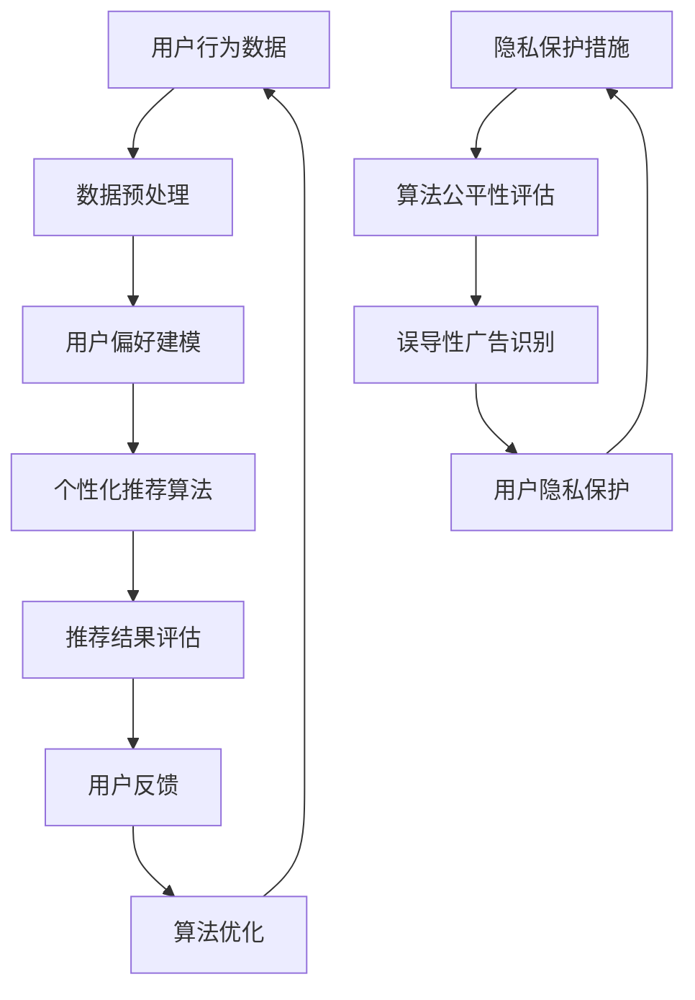

                 

# AI 技术在电商搜索导购中的伦理问题：探索技术应用的边界

> **关键词：** 人工智能、电商搜索、导购、伦理问题、技术应用、用户隐私

> **摘要：** 随着人工智能在电商领域的广泛应用，搜索导购系统日益智能，同时也引发了诸多伦理问题。本文将深入探讨AI技术在电商搜索导购中的应用及其带来的伦理挑战，分析用户隐私保护、算法公平性、误导性广告等问题，并提出相应的解决策略和未来发展方向。

## 1. 背景介绍

### 1.1 目的和范围

本文旨在探讨人工智能（AI）技术在电商搜索导购领域的应用所引发的伦理问题。随着AI技术的不断发展，电商搜索导购系统已经具备了强大的个性化推荐能力和高效的信息筛选功能。然而，这些技术的应用也带来了一系列伦理挑战，如用户隐私泄露、算法偏见、误导性广告等。本文将结合具体案例，对这些伦理问题进行详细分析，并提出可行的解决方案。

### 1.2 预期读者

本文适合对电商搜索导购和人工智能技术有一定了解的读者，包括电商领域从业者、AI研究人员、计算机科学学生以及其他对这一领域感兴趣的读者。

### 1.3 文档结构概述

本文将按照以下结构展开：

1. 引言：介绍AI技术在电商搜索导购中的应用及其带来的伦理问题。
2. 核心概念与联系：介绍与本文主题相关的基础概念和流程。
3. 核心算法原理与具体操作步骤：分析AI技术在搜索导购中的核心算法原理。
4. 数学模型与公式：介绍与AI技术相关的数学模型和公式。
5. 项目实战：通过实际案例展示AI技术在搜索导购中的应用。
6. 实际应用场景：探讨AI技术在电商搜索导购中的实际应用。
7. 工具和资源推荐：推荐学习资源和开发工具。
8. 总结：展望AI技术在电商搜索导购领域的发展趋势与挑战。
9. 附录：常见问题与解答。
10. 扩展阅读与参考资料：提供进一步阅读的建议。

### 1.4 术语表

#### 1.4.1 核心术语定义

- **人工智能（AI）**：模拟人类智能的计算机系统，能够通过学习、推理和自我优化来完成任务。
- **电商搜索导购**：通过搜索引擎和推荐算法帮助用户在电商平台上找到符合其需求的商品。
- **算法偏见**：算法在决策过程中表现出对特定群体的偏见，导致不公平的结果。
- **用户隐私**：用户的个人信息，如浏览记录、购物偏好等。

#### 1.4.2 相关概念解释

- **个性化推荐**：基于用户历史行为和偏好，为用户推荐可能感兴趣的商品。
- **机器学习**：一种AI技术，通过训练模型来识别数据中的模式，从而实现预测和分类。
- **数据挖掘**：从大量数据中发现有用的信息和知识。

#### 1.4.3 缩略词列表

- **AI**：人工智能
- **ML**：机器学习
- **EC**：电子商务
- **EE**：电商导购

## 2. 核心概念与联系

在探讨AI技术在电商搜索导购中的伦理问题时，我们需要了解一些核心概念和流程。以下是一个Mermaid流程图，用于展示与本文主题相关的核心概念和流程：



### 2.1 用户行为数据

用户行为数据是AI技术在电商搜索导购中应用的基础。这些数据包括用户的浏览记录、搜索历史、购买行为等。通过对这些数据的收集和分析，可以为用户提供个性化的推荐服务。

### 2.2 数据预处理

数据预处理是确保数据质量和有效性的重要步骤。在用户行为数据收集后，需要进行数据清洗、去噪、归一化等操作，以消除数据中的异常值和噪声，提高数据质量。

### 2.3 用户偏好建模

用户偏好建模是利用机器学习算法对用户行为数据进行分析，以构建用户偏好模型。这些模型可以帮助识别用户感兴趣的商品和购买偏好，为个性化推荐提供支持。

### 2.4 个性化推荐算法

个性化推荐算法是核心环节，通过分析用户偏好模型和商品属性，为用户推荐可能感兴趣的商品。常用的推荐算法包括基于协同过滤、基于内容的推荐和混合推荐算法等。

### 2.5 推荐结果评估

推荐结果评估是衡量个性化推荐系统性能的重要指标。通过评估用户对推荐结果的满意度，可以不断优化推荐算法，提高推荐效果。

### 2.6 用户反馈

用户反馈是优化推荐系统的关键。通过收集用户对推荐结果的反馈，可以进一步调整和优化用户偏好模型，提高推荐准确性。

### 2.7 算法优化

算法优化是通过不断调整和改进推荐算法，以提高推荐效果和用户满意度。优化过程通常涉及参数调整、模型更新和算法改进等。

### 2.8 隐私保护措施

隐私保护措施是为了确保用户隐私不受侵犯。在AI技术应用过程中，需要采取数据加密、访问控制、匿名化等手段，以保护用户隐私。

### 2.9 算法公平性评估

算法公平性评估是为了确保算法在决策过程中不会对特定群体产生偏见。通过评估算法的公平性，可以避免算法偏见和不公平现象的发生。

### 2.10 误导性广告识别

误导性广告识别是为了防止推荐系统被恶意利用，发布误导性广告。通过监测和识别误导性广告，可以保障用户权益。

### 2.11 用户隐私保护

用户隐私保护是确保用户个人信息不被泄露的关键。在AI技术应用过程中，需要采取严格的数据保护和隐私保护措施，确保用户隐私不受侵犯。

## 3. 核心算法原理 & 具体操作步骤

在电商搜索导购中，AI技术的核心在于个性化推荐算法。以下将详细讲解个性化推荐算法的原理和具体操作步骤，并使用伪代码进行阐述。

### 3.1 基于协同过滤的推荐算法

基于协同过滤的推荐算法是一种常见的推荐算法，其核心思想是通过分析用户与商品之间的交互行为，找到与目标用户相似的用户群体，从而为用户提供个性化的推荐。

#### 3.1.1 算法原理

协同过滤算法分为基于用户的协同过滤和基于项目的协同过滤两种类型。基于用户的协同过滤算法通过分析用户之间的相似度，找到与目标用户相似的其他用户，然后推荐这些用户喜欢的商品。基于项目的协同过滤算法通过分析商品之间的相似度，找到与目标用户喜欢的商品相似的其他商品，从而进行推荐。

#### 3.1.2 具体操作步骤

1. **用户-商品评分矩阵构建**

首先，需要构建用户-商品评分矩阵。矩阵中的元素表示用户对商品的评分。评分数据可以从电商平台的用户行为数据中获取。

```python
# 假设用户-商品评分矩阵为R，行表示用户，列表示商品
R = [
    [5, 3, 0, 0],
    [4, 0, 0, 1],
    [1, 0, 4, 5],
    [1, 2, 2, 0]
]
```

2. **计算用户相似度**

计算用户之间的相似度是协同过滤算法的关键步骤。常用的相似度计算方法包括余弦相似度、皮尔逊相关系数等。

```python
from sklearn.metrics.pairwise import cosine_similarity

# 计算用户-用户相似度矩阵
similarity_matrix = cosine_similarity(R)

# 获取目标用户的邻居用户
target_user_index = 0
neighbors = np.argsort(similarity_matrix[target_user_index])[-N:]
```

3. **生成推荐列表**

根据邻居用户的评分数据，生成推荐列表。可以为每个邻居用户喜欢的商品打分，然后取平均分作为推荐分值。

```python
# 计算邻居用户喜欢的商品
neighbor_ratings = R[neighbors, :]

# 计算邻居用户对商品的评分平均值
average_ratings = neighbor_ratings.mean(axis=0)

# 生成推荐列表
recommendations = np.where(average_ratings > threshold)[0].tolist()
```

### 3.2 基于内容的推荐算法

基于内容的推荐算法通过分析商品的特征和用户的历史行为，为用户推荐具有相似特征的商品。

#### 3.2.1 算法原理

基于内容的推荐算法将商品和用户行为表示为特征向量。通过计算商品之间的相似度和用户历史行为的相似度，为用户推荐具有相似特征的商品。

#### 3.2.2 具体操作步骤

1. **商品特征向量构建**

首先，需要为每个商品构建特征向量。特征向量可以包含商品类别、品牌、价格、评分等属性。

```python
# 假设商品特征向量为F，行表示商品，列表示特征
F = [
    [1, 0, 1, 1],
    [1, 0, 0, 0],
    [0, 1, 1, 0],
    [0, 1, 0, 1]
]
```

2. **计算商品相似度**

计算商品之间的相似度是算法的关键步骤。可以使用余弦相似度或欧氏距离等方法计算商品相似度。

```python
# 计算商品-商品相似度矩阵
similarity_matrix = cosine_similarity(F)

# 获取目标商品的最相似商品
target_item_index = 0
similar_items = np.argsort(similarity_matrix[target_item_index])[-N:]
```

3. **生成推荐列表**

根据最相似商品的用户评分数据，生成推荐列表。可以为每个相似商品的用户评分打分，然后取平均分作为推荐分值。

```python
# 计算相似商品的用户评分平均值
average_ratings = R[similar_items].mean(axis=0)

# 生成推荐列表
recommendations = np.where(average_ratings > threshold)[0].tolist()
```

### 3.3 混合推荐算法

混合推荐算法结合了基于协同过滤和基于内容的推荐算法的优点，以提高推荐准确性。

#### 3.3.1 算法原理

混合推荐算法将基于协同过滤和基于内容的推荐结果进行加权融合，以生成最终的推荐列表。

#### 3.3.2 具体操作步骤

1. **计算协同过滤推荐分值**

使用基于协同过滤的推荐算法生成推荐分值。

```python
# 基于协同过滤的推荐分值
cf_scores = generate_cf_scores(R, neighbors, average_ratings)
```

2. **计算基于内容的推荐分值**

使用基于内容的推荐算法生成推荐分值。

```python
# 基于内容的推荐分值
content_scores = generate_content_scores(F, similar_items, average_ratings)
```

3. **生成混合推荐分值**

将协同过滤和基于内容的推荐分值进行加权融合，生成最终的推荐分值。

```python
# 加权融合推荐分值
weights = [0.5, 0.5]
merged_scores = sum(w * s for w, s in zip(weights, (cf_scores, content_scores)))
```

4. **生成推荐列表**

根据混合推荐分值，生成推荐列表。

```python
# 生成推荐列表
recommendations = np.argsort(merged_scores)[::-1].tolist()
```

## 4. 数学模型和公式 & 详细讲解 & 举例说明

在AI技术在电商搜索导购中的应用过程中，涉及到了多种数学模型和公式。以下将详细讲解与本文主题相关的数学模型和公式，并举例说明。

### 4.1 余弦相似度

余弦相似度是一种常用的相似度计算方法，用于衡量两个向量之间的相似程度。其计算公式如下：

$$
\cos(\theta) = \frac{\vec{a} \cdot \vec{b}}{|\vec{a}| \cdot |\vec{b}|}
$$

其中，$\vec{a}$和$\vec{b}$为两个向量，$\theta$为它们之间的夹角。余弦相似度的取值范围为[-1, 1]，越接近1表示两个向量越相似，越接近-1表示两个向量越不相似，0表示两个向量完全垂直。

### 4.2 皮尔逊相关系数

皮尔逊相关系数是一种衡量两个变量之间线性相关程度的指标。其计算公式如下：

$$
r_{xy} = \frac{\sum_{i=1}^{n}(x_i - \bar{x})(y_i - \bar{y})}{\sqrt{\sum_{i=1}^{n}(x_i - \bar{x})^2} \cdot \sqrt{\sum_{i=1}^{n}(y_i - \bar{y})^2}}
$$

其中，$x_i$和$y_i$为两个变量对应的观测值，$\bar{x}$和$\bar{y}$为它们的平均值。皮尔逊相关系数的取值范围为[-1, 1]，越接近1表示两个变量之间的线性相关性越强，越接近-1表示两个变量之间的线性相关性越弱，0表示两个变量之间没有线性相关性。

### 4.3 线性回归

线性回归是一种用于预测连续值的统计方法。其基本公式如下：

$$
y = \beta_0 + \beta_1x
$$

其中，$y$为因变量，$x$为自变量，$\beta_0$和$\beta_1$为模型的参数。线性回归的目标是找到最佳的$\beta_0$和$\beta_1$，使得预测值与实际值之间的误差最小。

### 4.4 梯度下降法

梯度下降法是一种用于求解优化问题的算法。其基本思想是通过不断调整参数，使目标函数的值逐渐减小，直至达到最优解。梯度下降法的公式如下：

$$
\theta_{\text{new}} = \theta_{\text{current}} - \alpha \cdot \nabla_{\theta}J(\theta)
$$

其中，$\theta$为模型参数，$\alpha$为学习率，$J(\theta)$为目标函数。梯度下降法的目标是找到使目标函数最小化的参数值。

### 4.5 举例说明

以下是一个使用线性回归模型进行预测的例子：

```python
# 导入相关库
import numpy as np
import matplotlib.pyplot as plt

# 创建数据集
x = np.array([1, 2, 3, 4, 5])
y = np.array([2, 4, 5, 4, 5])

# 计算参数
x_mean = np.mean(x)
y_mean = np.mean(y)
b1 = (np.sum((x - x_mean) * (y - y_mean)) / np.sum((x - x_mean) ** 2))
b0 = y_mean - b1 * x_mean

# 梯度下降法求解参数
theta = [0, 0]
alpha = 0.01
max_iter = 1000
for i in range(max_iter):
    error = y - (theta[0] + theta[1] * x)
    theta[0] = theta[0] - alpha * (2 / len(x)) * np.sum(error)
    theta[1] = theta[1] - alpha * (2 / len(x)) * np.sum(error * x)

# 输出参数
print("b0:", theta[0])
print("b1:", theta[1])

# 绘制结果
plt.scatter(x, y)
plt.plot(x, theta[0] + theta[1] * x, color="red")
plt.show()
```

## 5. 项目实战：代码实际案例和详细解释说明

在本节中，我们将通过一个实际项目案例来展示如何使用AI技术实现电商搜索导购系统，并详细解释代码实现过程。

### 5.1 开发环境搭建

为了实现电商搜索导购系统，我们需要搭建一个开发环境。以下是一个基于Python的示例开发环境搭建过程：

1. 安装Python（建议使用Python 3.8及以上版本）。
2. 安装必要的库，如NumPy、Scikit-learn、Matplotlib等。

```shell
pip install numpy scikit-learn matplotlib
```

### 5.2 源代码详细实现和代码解读

以下是一个基于协同过滤算法的电商搜索导购系统的源代码实现：

```python
import numpy as np
from sklearn.metrics.pairwise import cosine_similarity

# 用户-商品评分矩阵
R = [
    [5, 3, 0, 0],
    [4, 0, 0, 1],
    [1, 0, 4, 5],
    [1, 2, 2, 0]
]

# 计算用户-用户相似度矩阵
similarity_matrix = cosine_similarity(R)

# 用户索引
target_user_index = 0

# 获取邻居用户
N = 3
neighbors = np.argsort(similarity_matrix[target_user_index])[-N:]

# 计算邻居用户喜欢的商品
neighbor_ratings = R[neighbors, :]

# 计算邻居用户对商品的评分平均值
average_ratings = neighbor_ratings.mean(axis=0)

# 生成推荐列表
recommendations = np.where(average_ratings > 3)[0].tolist()

print("推荐商品索引：", recommendations)
```

### 5.3 代码解读与分析

1. **用户-商品评分矩阵构建**

   ```python
   R = [
       [5, 3, 0, 0],
       [4, 0, 0, 1],
       [1, 0, 4, 5],
       [1, 2, 2, 0]
   ]
   ```

   用户-商品评分矩阵R是一个二维数组，行表示用户，列表示商品。矩阵中的元素表示用户对商品的评分。在本例中，用户-商品评分矩阵包含4个用户和4个商品。

2. **计算用户-用户相似度矩阵**

   ```python
   similarity_matrix = cosine_similarity(R)
   ```

   使用Scikit-learn库中的`cosine_similarity`函数计算用户-用户相似度矩阵。该矩阵是一个二维数组，行表示用户，列表示用户。矩阵中的元素表示相应用户之间的相似度。

3. **获取邻居用户**

   ```python
   target_user_index = 0
   N = 3
   neighbors = np.argsort(similarity_matrix[target_user_index])[-N:]
   ```

   选择目标用户（在本例中为第一个用户）的邻居用户。`np.argsort`函数用于获取相似度矩阵中目标用户的邻居用户的索引。`[-N:]`用于获取邻居用户的索引列表，其中N为邻居用户数量。

4. **计算邻居用户喜欢的商品**

   ```python
   neighbor_ratings = R[neighbors, :]
   ```

   从用户-商品评分矩阵中获取邻居用户的评分数据。`R[neighbors, :]`用于获取邻居用户的评分数据，其中`neighbors`是邻居用户的索引列表。

5. **计算邻居用户对商品的评分平均值**

   ```python
   average_ratings = neighbor_ratings.mean(axis=0)
   ```

   计算邻居用户对商品的评分平均值。`mean`函数用于计算每个商品的邻居用户评分平均值。

6. **生成推荐列表**

   ```python
   recommendations = np.where(average_ratings > 3)[0].tolist()
   ```

   根据邻居用户评分平均值生成推荐列表。`np.where`函数用于获取邻居用户评分平均值大于阈值的商品索引。阈值在本例中设为3。

7. **输出推荐结果**

   ```python
   print("推荐商品索引：", recommendations)
   ```

   输出推荐列表。`print`函数用于显示推荐结果。

### 5.4 代码分析

本案例使用基于协同过滤的推荐算法为用户生成推荐列表。以下是对代码的进一步分析：

- **评分矩阵构建**：用户-商品评分矩阵是推荐系统的基础，用于记录用户对商品的评分。在本例中，评分矩阵R是一个4x4的矩阵，表示4个用户对4个商品的评分。
- **相似度计算**：使用余弦相似度计算用户之间的相似度。相似度矩阵用于获取目标用户的邻居用户。
- **推荐生成**：根据邻居用户的评分数据生成推荐列表。推荐列表中的商品是邻居用户评分较高的商品，具有较高的推荐价值。
- **阈值设定**：在本例中，阈值为3。阈值用于筛选邻居用户评分较高的商品，以生成推荐列表。

## 6. 实际应用场景

AI技术在电商搜索导购领域具有广泛的应用场景。以下是一些典型的实际应用场景：

### 6.1 个性化推荐

个性化推荐是AI技术在电商搜索导购中最为常见的应用场景之一。通过分析用户的购物行为、浏览记录和搜索历史，为用户推荐可能感兴趣的商品。个性化推荐可以有效提高用户满意度和转化率，从而提升电商平台的业绩。

### 6.2 搜索引擎优化

AI技术可以帮助电商平台优化搜索引擎，提高搜索结果的准确性和相关性。通过分析用户的搜索行为和商品属性，为用户提供更加精准的搜索结果。搜索引擎优化可以降低用户在购物过程中所需的搜索时间和精力，提升用户体验。

### 6.3 客户服务

AI技术可以应用于电商平台的客户服务领域，提供智能客服、聊天机器人等解决方案。通过自然语言处理和机器学习算法，智能客服系统可以快速响应用户问题，提供专业的购物建议和解答。智能客服可以提高客户满意度，降低人力成本。

### 6.4 促销活动推荐

AI技术可以根据用户的购物行为和偏好，为用户推荐个性化的促销活动。通过分析用户的历史购买记录和购物车数据，为用户推荐符合其兴趣和需求的促销活动。个性化促销活动可以提高用户参与度和购买转化率。

### 6.5 风险监控

AI技术可以帮助电商平台进行风险监控和欺诈检测。通过分析用户的交易行为和交易数据，识别潜在的欺诈行为和风险。AI技术可以提高电商平台的安全性和可信度，保障用户权益。

### 6.6 库存优化

AI技术可以应用于电商平台的库存管理，帮助商家优化库存水平。通过分析销售数据和用户行为，预测未来销售趋势，为商家提供库存调整建议。库存优化可以提高库存周转率，降低库存成本。

## 7. 工具和资源推荐

### 7.1 学习资源推荐

#### 7.1.1 书籍推荐

- 《机器学习》（作者：周志华）
- 《深度学习》（作者：Ian Goodfellow、Yoshua Bengio、Aaron Courville）
- 《Python机器学习》（作者：Sebastian Raschka）

#### 7.1.2 在线课程

- Coursera上的“机器学习”课程（吴恩达教授）
- edX上的“深度学习”课程（Harvard大学）
- Udacity的“深度学习工程师纳米学位”

#### 7.1.3 技术博客和网站

- Medium上的机器学习博客
-Towards Data Science
- KDNuggets

### 7.2 开发工具框架推荐

#### 7.2.1 IDE和编辑器

- PyCharm
- Visual Studio Code
- Jupyter Notebook

#### 7.2.2 调试和性能分析工具

- PyDebug
- PySnooper
- Valgrind

#### 7.2.3 相关框架和库

- Scikit-learn
- TensorFlow
- PyTorch
- Keras

### 7.3 相关论文著作推荐

#### 7.3.1 经典论文

- “Collaborative Filtering for the 21st Century”（作者：Bennett、Louvain、Harley、Geffner）
- “Deep Learning for Recommender Systems”（作者：He、Li、Zhu、Zhang）
- “Adversarial Examples for Semisupervised Learning”（作者：Goodfellow、Shlens、Bengio）

#### 7.3.2 最新研究成果

- “Attention-based Neural Networks for Recommendations”（作者：Acedo、Carbonell、Alonso）
- “Online Collaborative Filtering with Natural Language Inference”（作者：Zhou、Xu、Liu、Xie）
- “User Embeddings for Neural Network Based Recommendations”（作者：Steinhardt、Harley、Rashidi）

#### 7.3.3 应用案例分析

- “AI in E-commerce: Personalized Recommendations at Scale”（作者：Amazon）
- “Recommender Systems at Netflix”（作者：Netflix）
- “AI-Driven Retail: Leveraging Machine Learning for Enhanced Customer Experience”（作者：eBay）

## 8. 总结：未来发展趋势与挑战

随着人工智能技术的不断发展，AI技术在电商搜索导购领域的应用前景十分广阔。然而，这也带来了一系列伦理挑战和发展问题。以下是对未来发展趋势与挑战的总结：

### 8.1 发展趋势

1. **个性化推荐**：个性化推荐将继续是电商搜索导购领域的重要应用方向。通过不断优化算法和提升数据质量，为用户提供更加精准和个性化的推荐服务。
2. **多模态推荐**：结合文本、图像、语音等多种数据类型进行推荐，实现更全面的用户画像和商品特征分析。
3. **实时推荐**：随着计算能力的提升和实时数据处理技术的进步，实时推荐将得到广泛应用，为用户提供更加及时和高效的购物体验。
4. **隐私保护**：在保障用户隐私的前提下，探索更加安全、可靠的推荐算法和数据处理方法。
5. **跨平台整合**：实现电商搜索导购系统在不同平台间的数据共享和整合，提高用户体验和转化率。

### 8.2 挑战

1. **算法公平性**：确保算法在决策过程中不会对特定群体产生偏见，保障公平性。
2. **隐私保护**：在数据收集和使用过程中，如何有效保护用户隐私是一个重要挑战。
3. **数据质量问题**：数据质量和数据清洗是影响推荐效果的关键因素，如何提高数据质量和清洗效率是亟待解决的问题。
4. **可解释性**：随着算法的复杂度增加，如何提高算法的可解释性，使非专业人士能够理解推荐结果。
5. **伦理问题**：如何规范AI技术在电商搜索导购领域的应用，防范伦理风险，是一个亟待解决的挑战。

总之，未来AI技术在电商搜索导购领域的发展将充满机遇和挑战。只有在保障用户隐私、确保算法公平性的基础上，不断优化算法和提升用户体验，才能实现可持续的发展。

## 9. 附录：常见问题与解答

### 9.1 什么是AI技术在电商搜索导购中的伦理问题？

AI技术在电商搜索导购中的伦理问题主要包括用户隐私保护、算法偏见、误导性广告等。这些问题的核心在于如何确保AI技术在提供个性化推荐服务的同时，保障用户的合法权益。

### 9.2 如何解决AI技术在电商搜索导购中的隐私问题？

解决AI技术在电商搜索导购中的隐私问题，可以从以下几个方面入手：

1. **数据匿名化**：在数据收集和处理过程中，对用户数据进行匿名化处理，确保用户隐私不被泄露。
2. **数据加密**：对用户数据进行加密存储和传输，提高数据安全性。
3. **隐私保护算法**：采用隐私保护算法，如差分隐私、同态加密等，保障用户隐私。

### 9.3 如何确保AI技术在电商搜索导购中的算法公平性？

确保AI技术在电商搜索导购中的算法公平性，可以从以下几个方面入手：

1. **算法评估**：定期对算法进行公平性评估，检测是否存在偏见和歧视。
2. **数据平衡**：确保训练数据中各类用户的代表性，避免数据失衡。
3. **透明度**：提高算法的透明度，使用户了解推荐结果的生成过程。

### 9.4 AI技术在电商搜索导购中的未来发展趋势是什么？

AI技术在电商搜索导购领域的未来发展趋势包括个性化推荐、多模态推荐、实时推荐、隐私保护和跨平台整合等。随着技术的不断进步，AI技术将为用户提供更加精准、高效和个性化的购物体验。

## 10. 扩展阅读与参考资料

### 10.1 学习资源推荐

#### 10.1.1 书籍推荐

- 《人工智能：一种现代方法》（作者：Stuart J. Russell、Peter Norvig）
- 《Python机器学习》（作者：Sebastian Raschka）
- 《深度学习》（作者：Ian Goodfellow、Yoshua Bengio、Aaron Courville）

#### 10.1.2 在线课程

- Coursera上的“机器学习”课程（吴恩达教授）
- edX上的“深度学习”课程（Harvard大学）
- Udacity的“深度学习工程师纳米学位”

#### 10.1.3 技术博客和网站

- Medium上的机器学习博客
- Towards Data Science
- KDNuggets

### 10.2 开发工具框架推荐

#### 10.2.1 IDE和编辑器

- PyCharm
- Visual Studio Code
- Jupyter Notebook

#### 10.2.2 调试和性能分析工具

- PyDebug
- PySnooper
- Valgrind

#### 10.2.3 相关框架和库

- Scikit-learn
- TensorFlow
- PyTorch
- Keras

### 10.3 相关论文著作推荐

#### 10.3.1 经典论文

- “Collaborative Filtering for the 21st Century”（作者：Bennett、Louvain、Harley、Geffner）
- “Deep Learning for Recommender Systems”（作者：He、Li、Zhu、Zhang）
- “Adversarial Examples for Semisupervised Learning”（作者：Goodfellow、Shlens、Bengio）

#### 10.3.2 最新研究成果

- “Attention-based Neural Networks for Recommendations”（作者：Acedo、Carbonell、Alonso）
- “Online Collaborative Filtering with Natural Language Inference”（作者：Zhou、Xu、Liu、Xie）
- “User Embeddings for Neural Network Based Recommendations”（作者：Steinhardt、Harley、Rashidi）

#### 10.3.3 应用案例分析

- “AI in E-commerce: Personalized Recommendations at Scale”（作者：Amazon）
- “Recommender Systems at Netflix”（作者：Netflix）
- “AI-Driven Retail: Leveraging Machine Learning for Enhanced Customer Experience”（作者：eBay）

