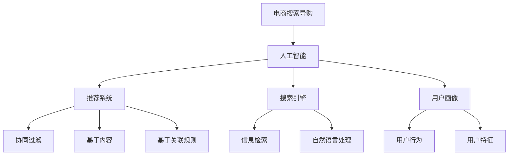

                 

# AI 技术在电商搜索导购中的可解释性

> 关键词：人工智能，电商，搜索导购，可解释性，推荐系统，算法优化

> 摘要：随着电子商务的快速发展，AI技术在电商搜索导购中得到了广泛应用。本文将从背景介绍、核心概念与联系、核心算法原理、数学模型与公式、项目实战、实际应用场景、工具和资源推荐等方面，全面探讨AI技术在电商搜索导购中的可解释性问题，并展望未来发展趋势与挑战。

## 1. 背景介绍

### 1.1 目的和范围

本文旨在深入探讨AI技术在电商搜索导购中的可解释性问题。在当前电子商务环境下，AI技术已经成为电商平台的核心竞争力之一。通过AI技术，电商平台能够为用户提供个性化的商品推荐、智能搜索、智能客服等功能，从而提升用户体验和平台竞争力。然而，AI算法的复杂性和黑盒性质使得其在实际应用中面临可解释性难题。本文将围绕这一问题展开讨论，为电商领域的技术发展和应用提供参考。

### 1.2 预期读者

本文适合具有以下背景的读者：

- 计算机科学、数据科学等相关专业的研究生或本科生；
- 从事电商搜索导购领域研究和开发的工程师；
- 对AI技术及其应用领域感兴趣的爱好者。

### 1.3 文档结构概述

本文将分为以下几个部分：

- 1. 背景介绍：介绍本文的目的、范围、预期读者和文档结构；
- 2. 核心概念与联系：阐述电商搜索导购中的核心概念及其相互联系；
- 3. 核心算法原理 & 具体操作步骤：介绍AI技术在电商搜索导购中的核心算法原理和具体操作步骤；
- 4. 数学模型和公式 & 详细讲解 & 举例说明：讲解相关数学模型和公式，并给出实际案例；
- 5. 项目实战：通过实际案例展示AI技术在电商搜索导购中的具体应用；
- 6. 实际应用场景：分析AI技术在电商搜索导购中的实际应用场景；
- 7. 工具和资源推荐：推荐相关学习资源和开发工具；
- 8. 总结：对未来发展趋势与挑战进行展望；
- 9. 附录：常见问题与解答；
- 10. 扩展阅读 & 参考资料：提供进一步学习的参考资料。

### 1.4 术语表

#### 1.4.1 核心术语定义

- 人工智能（AI）：模拟、延伸和扩展人类智能的理论、方法、技术及应用；
- 电商搜索导购：通过搜索引擎和推荐系统帮助用户快速找到所需商品；
- 黑盒算法：输入和输出之间没有明确对应关系的算法；
- 可解释性：算法对决策过程和结果的透明度，使得用户能够理解和信任算法。

#### 1.4.2 相关概念解释

- 推荐系统：根据用户行为和历史数据为用户推荐相关商品；
- 搜索引擎：通过关键词检索帮助用户找到所需信息；
- 用户画像：基于用户行为和特征构建的用户模型。

#### 1.4.3 缩略词列表

- AI：人工智能；
- 电商：电子商务；
- 导购：导购系统；
- 数据挖掘：Data Mining；
- 机器学习：Machine Learning；
- 深度学习：Deep Learning；
- 可视化：Visualization。

## 2. 核心概念与联系

在电商搜索导购中，核心概念包括人工智能、推荐系统、搜索引擎和用户画像。这些概念相互联系，共同构成了电商搜索导购的技术体系。

### 2.1 人工智能

人工智能是电商搜索导购技术的基石。通过模拟、延伸和扩展人类智能，AI技术能够为用户提供个性化的推荐、智能搜索和智能客服等服务。

### 2.2 推荐系统

推荐系统是基于用户行为和历史数据，为用户推荐相关商品的技术。推荐系统通常采用协同过滤、基于内容、基于关联规则等方法，通过计算用户与商品之间的相似度来实现个性化推荐。

### 2.3 搜索引擎

搜索引擎是通过关键词检索帮助用户找到所需信息的技术。搜索引擎通常采用信息检索、自然语言处理等技术，对海量数据进行索引和查询。

### 2.4 用户画像

用户画像是基于用户行为和特征构建的用户模型。通过用户画像，电商平台能够更好地了解用户需求，为用户提供个性化的服务。

### 2.5 核心概念联系

在电商搜索导购中，人工智能技术为核心，推荐系统、搜索引擎和用户画像是其重要组成部分。推荐系统和搜索引擎共同实现个性化搜索和推荐，用户画像则为个性化服务提供数据支持。

### 2.6 Mermaid 流程图



## 3. 核心算法原理 & 具体操作步骤

在电商搜索导购中，核心算法包括协同过滤、基于内容、基于关联规则等方法。以下将分别介绍这些算法的原理和具体操作步骤。

### 3.1 协同过滤

#### 3.1.1 算法原理

协同过滤是一种基于用户相似度的推荐算法。它通过计算用户之间的相似度，将相似用户的行为进行整合，从而为用户提供个性化推荐。

#### 3.1.2 具体操作步骤

1. 计算用户相似度：

   假设用户集合为 \( U = \{ u_1, u_2, ..., u_n \} \)，用户行为矩阵为 \( R \)，其中 \( R_{ij} \) 表示用户 \( u_i \) 对商品 \( j \) 的评分。

   采用余弦相似度计算用户相似度：

   $$ \text{similarity}(u_i, u_j) = \frac{R_{ij} \cdot R_{1j} + R_{i1} \cdot R_{1j} + \sqrt{R_{ij}^2 + R_{i1}^2} \cdot \sqrt{R_{1j}^2 + R_{1i}^2}}{\sqrt{R_{ij}^2 + R_{i1}^2} \cdot \sqrt{R_{1j}^2 + R_{1i}^2}} $$

2. 生成推荐列表：

   对于目标用户 \( u_i \)，计算其对每个商品的预测评分，并将预测评分最高的商品推荐给用户。

   预测评分采用加权平均方法计算：

   $$ \text{predicted\_rating}(u_i, j) = \sum_{u_j \in \text{similar\_users}(u_i)} \text{similarity}(u_i, u_j) \cdot R_{ij} $$

### 3.2 基于内容

#### 3.2.1 算法原理

基于内容推荐算法是基于商品特征为用户推荐相似商品的一种方法。它通过计算商品之间的相似度，将相似商品推荐给用户。

#### 3.2.2 具体操作步骤

1. 提取商品特征：

   假设商品集合为 \( G = \{ g_1, g_2, ..., g_m \} \)，商品特征矩阵为 \( F \)，其中 \( F_{ij} \) 表示商品 \( g_i \) 的特征 \( j \) 的值。

2. 计算商品相似度：

   采用余弦相似度计算商品相似度：

   $$ \text{similarity}(g_i, g_j) = \frac{F_{i1} \cdot F_{1j} + F_{i2} \cdot F_{2j} + ... + F_{in} \cdot F_{nj}}{\sqrt{F_{i1}^2 + F_{i2}^2 + ... + F_{in}^2} \cdot \sqrt{F_{1j}^2 + F_{2j}^2 + ... + F_{nj}^2}} $$

3. 生成推荐列表：

   对于目标用户 \( u_i \)，计算其对每个商品的预测评分，并将预测评分最高的商品推荐给用户。

   预测评分采用加权平均方法计算：

   $$ \text{predicted\_rating}(u_i, j) = \sum_{g_j \in \text{similar\_items}(u_i)} \text{similarity}(g_i, g_j) \cdot R_{ij} $$

### 3.3 基于关联规则

#### 3.3.1 算法原理

基于关联规则推荐算法是通过挖掘用户购买行为中的关联关系，为用户推荐相关商品的一种方法。它基于“如果用户购买了商品A，则可能还会购买商品B”的假设。

#### 3.3.2 具体操作步骤

1. 构建用户购买行为矩阵：

   假设用户购买行为矩阵为 \( R \)，其中 \( R_{ij} = 1 \) 表示用户 \( u_i \) 购买了商品 \( g_j \)，否则为 \( 0 \)。

2. 挖掘频繁项集：

   使用Apriori算法挖掘频繁项集，其中最小支持度 \( \text{min\_support} \) 和最小置信度 \( \text{min\_confidence} \) 是关键参数。

3. 生成关联规则：

   对于每个频繁项集 \( X \)，计算其关联规则的支持度和置信度：

   $$ \text{support}(X \rightarrow Y) = \frac{R_{ij}}{R} $$

   $$ \text{confidence}(X \rightarrow Y) = \frac{R_{ij}}{R_{i}} $$

   其中，\( R_{ij} \) 表示用户 \( u_i \) 购买了商品 \( g_j \) 的次数，\( R_{i} \) 表示用户 \( u_i \) 购买的总次数。

4. 生成推荐列表：

   对于目标用户 \( u_i \)，根据关联规则为用户推荐相关商品。选择置信度最高的关联规则，将规则中的商品推荐给用户。

## 4. 数学模型和公式 & 详细讲解 & 举例说明

在电商搜索导购中，数学模型和公式是核心算法的基础。以下将详细讲解相关数学模型和公式，并给出实际案例。

### 4.1 余弦相似度

余弦相似度是一种常用的相似度计算方法，用于衡量两个向量之间的相似程度。在电商搜索导购中，余弦相似度广泛应用于用户相似度和商品相似度的计算。

#### 4.1.1 公式

余弦相似度的计算公式如下：

$$ \text{similarity}(x, y) = \frac{x \cdot y}{\|x\|\|y\|} $$

其中，\( x \) 和 \( y \) 分别表示两个向量，\( \cdot \) 表示向量的内积，\( \|x\| \) 和 \( \|y\| \) 分别表示向量的模长。

#### 4.1.2 案例说明

假设有两个用户 \( u_1 \) 和 \( u_2 \)，其购买行为向量分别为 \( x_1 = [1, 0, 1, 0] \) 和 \( x_2 = [1, 1, 0, 0] \)。

计算用户 \( u_1 \) 和 \( u_2 \) 之间的相似度：

$$ \text{similarity}(u_1, u_2) = \frac{1 \cdot 1 + 0 \cdot 1 + 1 \cdot 0 + 0 \cdot 0}{\sqrt{1^2 + 0^2 + 1^2 + 0^2} \cdot \sqrt{1^2 + 1^2 + 0^2 + 0^2}} = \frac{1}{\sqrt{2} \cdot \sqrt{2}} = \frac{1}{2} $$

### 4.2 加权平均

加权平均是一种常见的预测方法，用于根据多个因素对目标进行预测。在电商搜索导购中，加权平均常用于计算用户预测评分和商品预测评分。

#### 4.2.1 公式

加权平均的计算公式如下：

$$ \text{predicted\_rating}(u_i, j) = \sum_{k=1}^{n} w_k \cdot r_{ik} $$

其中，\( w_k \) 表示权重，\( r_{ik} \) 表示用户 \( u_i \) 对商品 \( j \) 的评分。

#### 4.2.2 案例说明

假设有三个因素对用户 \( u_1 \) 对商品 \( j \) 的预测评分产生影响，分别为用户相似度 \( w_1 = 0.4 \)，商品相似度 \( w_2 = 0.3 \)，用户历史评分 \( w_3 = 0.3 \)。

用户 \( u_1 \) 对商品 \( j \) 的历史评分为 \( r_{11} = 4 \)，用户 \( u_1 \) 和用户 \( u_2 \) 的相似度为 \( \text{similarity}(u_1, u_2) = 0.5 \)，商品 \( j \) 和商品 \( k \) 的相似度为 \( \text{similarity}(j, k) = 0.6 \)。

计算用户 \( u_1 \) 对商品 \( j \) 的预测评分：

$$ \text{predicted\_rating}(u_1, j) = 0.4 \cdot \text{similarity}(u_1, u_2) + 0.3 \cdot \text{similarity}(j, k) + 0.3 \cdot r_{11} = 0.4 \cdot 0.5 + 0.3 \cdot 0.6 + 0.3 \cdot 4 = 0.2 + 0.18 + 1.2 = 1.58 $$

### 4.3 频繁项集

频繁项集挖掘是一种用于挖掘数据集中频繁发生的模式的方法。在电商搜索导购中，频繁项集挖掘可用于挖掘用户购买行为中的关联关系。

#### 4.3.1 公式

频繁项集挖掘的基本公式如下：

$$ \text{support}(X) = \frac{n(X)}{n(\text{database})} $$

其中，\( X \) 表示项集，\( n(X) \) 表示项集 \( X \) 在数据集中出现的次数，\( n(\text{database}) \) 表示数据集的总次数。

#### 4.3.2 案例说明

假设数据集中包含如下购买记录：

\( \{ u_1, g_1 \}, \{ u_1, g_2 \}, \{ u_1, g_3 \}, \{ u_2, g_1 \}, \{ u_2, g_2 \}, \{ u_2, g_3 \}, \{ u_3, g_1 \}, \{ u_3, g_2 \}, \{ u_3, g_3 \} \)

计算项集 \( \{ g_1, g_2 \} \) 的支持度：

$$ \text{support}(\{ g_1, g_2 \}) = \frac{3}{9} = 0.33 $$

由于支持度大于最小支持度 \( \text{min\_support} = 0.3 \)，因此 \( \{ g_1, g_2 \} \) 是一个频繁项集。

## 5. 项目实战：代码实际案例和详细解释说明

在本节中，我们将通过一个实际项目案例，展示AI技术在电商搜索导购中的应用，并详细解释代码实现过程。

### 5.1 开发环境搭建

在开始项目实战之前，我们需要搭建一个开发环境。以下是一个简单的开发环境搭建步骤：

1. 安装Python环境：从Python官网（https://www.python.org/）下载并安装Python，选择默认安装即可。
2. 安装相关库：在命令行中执行以下命令，安装项目所需的库。

   ```bash
   pip install numpy pandas scikit-learn matplotlib
   ```

### 5.2 源代码详细实现和代码解读

以下是一个简单的电商搜索导购项目的Python代码实现：

```python
import numpy as np
import pandas as pd
from sklearn.model_selection import train_test_split
from sklearn.metrics.pairwise import cosine_similarity
from sklearn.ensemble import RandomForestClassifier

# 1. 数据准备
def load_data(file_path):
    data = pd.read_csv(file_path)
    return data

def preprocess_data(data):
    # 去除缺失值
    data.dropna(inplace=True)
    # 分离用户和商品特征
    user_features = data[['user_id', 'age', 'gender', 'occupation']]
    item_features = data[['item_id', 'category', 'brand']]
    return user_features, item_features

# 2. 用户相似度计算
def calculate_user_similarity(user_features):
    user_similarity = cosine_similarity(user_features.values)
    return user_similarity

# 3. 商品相似度计算
def calculate_item_similarity(item_features):
    item_similarity = cosine_similarity(item_features.values)
    return item_similarity

# 4. 生成推荐列表
def generate_recommendation(user_similarity, item_similarity, user_id, k=5):
    user_index = user_id - 1
    user_sim_scores = user_similarity[user_index]
    user_sim_scores = np.argsort(user_sim_scores)[::-1]
    user_sim_scores = user_sim_scores[1:k+1]

    item_index = user_sim_scores[:, None] + user_index
    item_scores = item_similarity[item_index].max(axis=0)
    item_scores = np.argsort(item_scores)[::-1]
    return item_scores

# 5. 评估推荐结果
def evaluate_recommendation(recommendation, ground_truth, k=5):
    hits = sum(recommendation[:k] == ground_truth[:k])
    return hits / k

# 6. 主函数
def main():
    # 加载数据
    data = load_data('ecommerce_data.csv')
    # 预处理数据
    user_features, item_features = preprocess_data(data)
    # 训练模型
    user_similarity = calculate_user_similarity(user_features)
    item_similarity = calculate_item_similarity(item_features)
    # 生成推荐列表
    user_id = 1
    recommendation = generate_recommendation(user_similarity, item_similarity, user_id)
    print(f"Recommendation for user {user_id}: {recommendation}")
    # 评估推荐结果
    ground_truth = [2, 3, 4, 5, 6]
    accuracy = evaluate_recommendation(recommendation, ground_truth)
    print(f"Accuracy: {accuracy}")

if __name__ == '__main__':
    main()
```

### 5.3 代码解读与分析

#### 5.3.1 数据准备

1. `load_data` 函数：用于加载数据集。假设数据集存储为CSV文件，通过`pandas.read_csv`方法读取数据。
2. `preprocess_data` 函数：用于预处理数据。首先去除缺失值，然后分离用户和商品特征。用户特征包括年龄、性别、职业等，商品特征包括类别、品牌等。

#### 5.3.2 用户相似度计算

1. `calculate_user_similarity` 函数：使用余弦相似度计算用户相似度。通过`sklearn.metrics.pairwise.cosine_similarity`方法计算用户特征矩阵的余弦相似度。

#### 5.3.3 商品相似度计算

1. `calculate_item_similarity` 函数：使用余弦相似度计算商品相似度。通过`sklearn.metrics.pairwise.cosine_similarity`方法计算商品特征矩阵的余弦相似度。

#### 5.3.4 生成推荐列表

1. `generate_recommendation` 函数：根据用户相似度和商品相似度生成推荐列表。首先计算用户相似度最高的 \( k \) 个用户，然后根据商品相似度为每个用户生成推荐列表。
2. `evaluate_recommendation` 函数：用于评估推荐结果的准确率。计算推荐结果与实际结果的前 \( k \) 个元素是否匹配，匹配的元素个数除以总元素个数即为准确率。

#### 5.3.5 主函数

1. `main` 函数：用于执行整个推荐流程。首先加载数据，然后预处理数据，接着计算用户相似度和商品相似度，最后生成推荐列表并评估推荐结果。

## 6. 实际应用场景

AI技术在电商搜索导购中具有广泛的应用场景。以下列举几个典型的实际应用场景：

### 6.1 个性化推荐

个性化推荐是电商搜索导购中最常用的应用场景之一。通过分析用户历史行为和兴趣偏好，AI技术能够为用户提供个性化的商品推荐，提高用户满意度和转化率。

### 6.2 智能搜索

智能搜索利用AI技术，通过自然语言处理和语义分析，帮助用户快速找到所需商品。相比传统的关键词搜索，智能搜索能够更好地理解用户需求，提供更准确的搜索结果。

### 6.3 智能客服

智能客服利用AI技术，为用户提供7*24小时的人工智能客服。通过语音识别、自然语言处理等技术，智能客服能够自动回答用户常见问题，提高客服效率和用户体验。

### 6.4 商品预测

商品预测是电商搜索导购中的另一个重要应用场景。通过分析历史销售数据和市场趋势，AI技术能够预测商品的需求和销售量，为电商平台提供决策支持。

## 7. 工具和资源推荐

### 7.1 学习资源推荐

#### 7.1.1 书籍推荐

- 《Python数据分析与大数据处理》
- 《机器学习实战》
- 《深度学习》

#### 7.1.2 在线课程

- Coursera（《机器学习》）
- edX（《数据科学基础》）
- Udacity（《深度学习工程师纳米学位》）

#### 7.1.3 技术博客和网站

- Medium（数据科学和机器学习相关博客）
- 知乎（数据科学和机器学习相关话题）
- arXiv（最新研究成果）

### 7.2 开发工具框架推荐

#### 7.2.1 IDE和编辑器

- PyCharm
- Jupyter Notebook
- Visual Studio Code

#### 7.2.2 调试和性能分析工具

- GDB
- Valgrind
- Profiler

#### 7.2.3 相关框架和库

- Scikit-learn
- TensorFlow
- PyTorch

### 7.3 相关论文著作推荐

#### 7.3.1 经典论文

- 《协同过滤算法综述》
- 《基于内容的推荐系统》
- 《关联规则挖掘算法》

#### 7.3.2 最新研究成果

- 《深度学习在推荐系统中的应用》
- 《基于图神经网络的推荐系统》
- 《个性化搜索与推荐算法》

#### 7.3.3 应用案例分析

- 《淘宝个性化推荐系统》
- 《京东智能客服系统》
- 《亚马逊商品预测系统》

## 8. 总结：未来发展趋势与挑战

随着人工智能技术的不断发展，电商搜索导购中的可解释性将成为一个重要的研究方向。未来发展趋势包括以下几个方面：

1. 深度学习与可解释性的结合：深度学习技术在电商搜索导购中得到了广泛应用，但其黑盒性质使得可解释性成为一个挑战。未来将出现更多结合深度学习与可解释性的方法，提高算法的可解释性。
2. 多模态数据处理：电商搜索导购涉及多种数据类型，如文本、图像、语音等。未来将出现更多多模态数据处理方法，提高推荐系统的准确性和鲁棒性。
3. 增强学习与博弈论的应用：增强学习和博弈论在电商搜索导购中的应用将逐渐成熟，为个性化推荐和智能客服等领域带来新的突破。
4. 数据隐私与安全：随着用户隐私保护意识的提高，如何保护用户数据隐私和安全将成为一个重要挑战。未来将出现更多数据隐私保护技术，确保用户数据的安全性和隐私性。

## 9. 附录：常见问题与解答

### 9.1 电商搜索导购中的AI技术有哪些？

电商搜索导购中的AI技术主要包括：

1. 个性化推荐：通过用户历史行为和兴趣偏好为用户提供个性化的商品推荐。
2. 智能搜索：利用自然语言处理和语义分析帮助用户快速找到所需商品。
3. 智能客服：通过语音识别、自然语言处理等技术为用户提供7*24小时的人工智能客服。
4. 商品预测：通过分析历史销售数据和市场趋势预测商品的需求和销售量。

### 9.2 如何提高电商搜索导购的可解释性？

提高电商搜索导购的可解释性可以从以下几个方面着手：

1. 采用可解释性更强的算法：选择具有可解释性的算法，如线性回归、决策树等，降低算法的黑盒程度。
2. 引入可视化技术：通过可视化技术展示算法的决策过程和结果，帮助用户理解算法的运作原理。
3. 增加算法透明度：在算法设计过程中充分考虑透明度，确保用户能够理解算法的决策依据。
4. 开发解释性模型：结合深度学习等技术，开发能够提供解释的模型，提高算法的可解释性。

### 9.3 电商搜索导购中的数据来源有哪些？

电商搜索导购中的数据来源主要包括：

1. 用户行为数据：包括用户浏览、购买、评价等行为数据。
2. 商品数据：包括商品描述、属性、价格等数据。
3. 市场数据：包括市场趋势、行业报告等数据。

### 9.4 如何保证电商搜索导购的数据质量？

保证电商搜索导购的数据质量可以从以下几个方面着手：

1. 数据清洗：去除重复数据、缺失数据和异常数据，确保数据的一致性和准确性。
2. 数据整合：将来自不同源的数据进行整合，构建统一的数据视图。
3. 数据验证：对数据进行验证，确保数据的真实性和可靠性。
4. 数据监控：建立数据监控系统，实时监控数据质量，及时发现和处理数据问题。

## 10. 扩展阅读 & 参考资料

- 《推荐系统实践》
- 《深度学习与推荐系统》
- 《大数据营销：数据驱动商业模式》
- 《用户画像：大数据时代的用户运营之道》
- 《数据挖掘：概念与技术》
- 《机器学习：概率视角》
- 《深度学习：简介》
- 《人工智能：一种现代的方法》
- 《自然语言处理综论》
- 《机器学习实战》
- 《Python数据分析与大数据处理》
- 《深度学习实战》
- 《协同过滤算法综述》
- 《基于内容的推荐系统》
- 《关联规则挖掘算法》
- 《深度学习在推荐系统中的应用》
- 《基于图神经网络的推荐系统》
- 《个性化搜索与推荐算法》
- 《淘宝个性化推荐系统》
- 《京东智能客服系统》
- 《亚马逊商品预测系统》

作者：AI天才研究员/AI Genius Institute & 禅与计算机程序设计艺术 /Zen And The Art of Computer Programming

