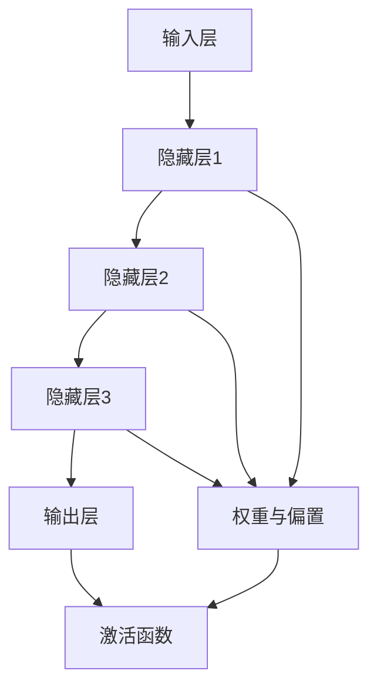

                 

# AI驱动的创业产品创新指南：大模型赋能

> 关键词：人工智能、大模型、创业产品、创新、算法原理、数学模型、实战案例

> 摘要：本文将深入探讨如何利用人工智能（AI）中的大模型来驱动创业产品的创新。我们将从背景介绍、核心概念、算法原理、数学模型、实战案例、实际应用场景等多个方面进行详细解析，旨在为创业者提供实用的指导，帮助他们更好地利用AI技术实现产品创新。

## 1. 背景介绍

### 1.1 目的和范围

本文旨在为创业者提供一份全面而深入的AI驱动的创业产品创新指南。我们将重点关注以下几个关键方面：

1. **大模型的原理与架构**：详细阐述大模型的工作原理和架构设计，帮助读者理解其核心技术。
2. **算法原理与操作步骤**：介绍大模型中的核心算法，并通过伪代码详细阐述其具体操作步骤。
3. **数学模型与公式**：解析大模型中的数学模型和公式，并通过实例进行说明。
4. **实战案例与代码解读**：提供实际代码案例，对代码实现进行详细解释和分析。
5. **应用场景与工具推荐**：探讨大模型在实际创业产品中的应用，并提供相关学习资源和开发工具推荐。

### 1.2 预期读者

本文适用于以下几类读者：

1. **创业者**：希望利用AI技术实现产品创新的创业者，特别是那些对人工智能技术有一定了解但希望深入了解大模型技术的读者。
2. **技术专家**：计算机科学、人工智能等相关领域的专业人士，对大模型技术有深入研究的读者。
3. **学生和研究人员**：对AI技术感兴趣的学生和研究人员，希望了解大模型在创业产品中的应用。

### 1.3 文档结构概述

本文将分为以下主要章节：

1. **背景介绍**：包括目的和范围、预期读者、文档结构概述和术语表。
2. **核心概念与联系**：介绍大模型的核心理念和架构，并使用Mermaid流程图展示。
3. **核心算法原理与具体操作步骤**：详细讲解大模型中的核心算法，并通过伪代码阐述具体操作步骤。
4. **数学模型和公式**：解析大模型中的数学模型和公式，并通过实例进行说明。
5. **项目实战：代码实际案例和详细解释说明**：提供实际代码案例，对代码实现进行详细解释和分析。
6. **实际应用场景**：探讨大模型在创业产品中的实际应用。
7. **工具和资源推荐**：推荐学习资源、开发工具和相关论文著作。
8. **总结：未来发展趋势与挑战**：总结文章内容，探讨未来发展趋势和挑战。
9. **附录：常见问题与解答**：解答读者可能遇到的问题。
10. **扩展阅读 & 参考资料**：提供进一步阅读的资源。

### 1.4 术语表

在本文中，我们将使用以下术语：

#### 1.4.1 核心术语定义

- **大模型**：指具有巨大参数量的人工神经网络模型，如GPT-3、BERT等。
- **创业产品**：指初创企业开发的产品，通常具有创新性和市场潜力。
- **算法**：解决问题的一系列规则或步骤。
- **数学模型**：用于描述现实世界的数学表达式或公式。
- **神经网络**：一种模拟生物神经元的计算模型。

#### 1.4.2 相关概念解释

- **深度学习**：一种人工智能方法，通过多层神经网络进行特征学习和模型训练。
- **自然语言处理（NLP）**：研究如何让计算机理解和处理人类自然语言的技术。
- **预训练**：在大规模数据集上对模型进行预训练，以提高其泛化能力。
- **微调**：在特定任务上对预训练模型进行微调，以适应具体应用场景。

#### 1.4.3 缩略词列表

- **AI**：人工智能（Artificial Intelligence）
- **NLP**：自然语言处理（Natural Language Processing）
- **ML**：机器学习（Machine Learning）
- **DL**：深度学习（Deep Learning）
- **GPU**：图形处理器（Graphics Processing Unit）
- **TPU**：张量处理器（Tensor Processing Unit）

## 2. 核心概念与联系

在这一章节中，我们将介绍大模型的核心理念和架构，并通过Mermaid流程图展示其关键组成部分和相互关系。

### 2.1 大模型的定义与特点

大模型是指具有巨大参数量的人工神经网络模型，通常由数亿甚至数十亿个参数组成。这些模型在训练过程中可以学习到丰富的特征表示，从而在多种任务上表现出优异的性能。大模型的主要特点如下：

1. **参数量巨大**：大模型的参数量通常远超过传统模型，这使其能够捕获更复杂的特征和模式。
2. **强大的表示能力**：大模型可以表示复杂的函数关系，从而实现更高的准确性和泛化能力。
3. **预训练与微调**：大模型通常采用预训练和微调的方法，以适应不同任务的需求。

### 2.2 大模型的架构

大模型的架构通常由以下几个关键组成部分构成：

1. **输入层**：接收外部输入数据，如文本、图像或音频。
2. **隐藏层**：包含多个隐藏层，每个隐藏层对输入数据进行特征提取和变换。
3. **输出层**：生成预测结果或目标输出。
4. **权重与偏置**：连接各层神经元的权重和偏置，用于调整模型参数。
5. **激活函数**：对神经元输出进行非线性变换，以引入非线性关系。

### 2.3 大模型的联系

大模型中的各个组成部分相互关联，共同实现模型训练和预测过程。以下是一个简单的Mermaid流程图，展示大模型的关键组成部分和相互关系：



在这个流程图中，输入层接收输入数据，通过多个隐藏层进行特征提取和变换，最终由输出层生成预测结果。权重与偏置用于调整模型参数，激活函数引入非线性关系，以实现更好的模型性能。

## 3. 核心算法原理 & 具体操作步骤

在这一章节中，我们将详细介绍大模型中的核心算法原理，并使用伪代码详细阐述其具体操作步骤。

### 3.1 深度学习基础

深度学习是一种通过多层神经网络进行特征学习和模型训练的人工智能方法。其核心思想是将输入数据通过多个隐藏层进行特征提取和变换，最终生成预测结果。深度学习的基础算法包括前向传播和反向传播。

#### 3.1.1 前向传播

前向传播是指将输入数据逐层传递到隐藏层，并计算输出值的过程。具体步骤如下：

1. 初始化模型参数（权重和偏置）。
2. 计算每个隐藏层的输入和输出。
3. 应用激活函数，得到每个隐藏层的激活值。

伪代码如下：

```python
function forward_propagation(inputs, weights, biases, activation_functions):
    layer_outputs = []
    layer_inputs = inputs
    
    for i in range(num_layers):
        layer_output = activation_function(
            dot_product(layer_inputs, weights[i]) + biases[i]
        )
        layer_outputs.append(layer_output)
        layer_inputs = layer_output
    
    return layer_outputs
```

#### 3.1.2 反向传播

反向传播是指通过计算输出误差，反向更新模型参数的过程。具体步骤如下：

1. 计算输出误差。
2. 反向传播误差，计算每个隐藏层的误差。
3. 更新模型参数。

伪代码如下：

```python
function backward_propagation(inputs, targets, layer_outputs, weights, biases, activation_functions, learning_rate):
    layer_deltas = [layer_output - target for layer_output, target in zip(layer_outputs, targets)]
    
    for i in range(num_layers - 1, -1, -1):
        delta = dot_product(layer_deltas, weights[i].T)
        layer_deltas = activation_function_derivative(layer_output) * delta
        
        weights[i] -= learning_rate * layer_deltas * layer_inputs
        biases[i] -= learning_rate * layer_deltas
        
        layer_inputs = inputs
```

### 3.2 大模型中的核心算法

大模型中的核心算法包括预训练和微调。预训练是指在大量无标签数据上对模型进行训练，以学习通用特征表示；微调则是在特定任务上对预训练模型进行微调，以适应具体应用场景。

#### 3.2.1 预训练

预训练的具体步骤如下：

1. 收集大量无标签数据，如文本、图像或音频。
2. 初始化大模型参数。
3. 在无标签数据上进行预训练，以学习通用特征表示。

伪代码如下：

```python
function pre_train(data, learning_rate, num_epochs):
    for epoch in range(num_epochs):
        for batch in data:
            layer_outputs = forward_propagation(batch, weights, biases, activation_functions)
            backward_propagation(batch, None, layer_outputs, weights, biases, activation_functions, learning_rate)
```

#### 3.2.2 微调

微调的具体步骤如下：

1. 选择一个预训练模型作为基础模型。
2. 在特定任务上进行微调，以适应具体应用场景。

伪代码如下：

```python
function fine_tune(base_model, task_data, learning_rate, num_epochs):
    for epoch in range(num_epochs):
        for batch in task_data:
            layer_outputs = forward_propagation(batch, weights, biases, activation_functions)
            backward_propagation(batch, target, layer_outputs, weights, biases, activation_functions, learning_rate)
```

## 4. 数学模型和公式 & 详细讲解 & 举例说明

在这一章节中，我们将详细讲解大模型中的数学模型和公式，并通过实例进行说明。

### 4.1 激活函数

激活函数是深度学习中的关键组成部分，用于引入非线性关系。以下是一些常见的激活函数：

#### 4.1.1 Sigmoid函数

Sigmoid函数是一种常见的激活函数，其公式为：

$$
\sigma(x) = \frac{1}{1 + e^{-x}}
$$

Sigmoid函数的输出范围在0到1之间，可以用于二分类问题。

#### 4.1.2ReLU函数

ReLU（Rectified Linear Unit）函数是一种线性激活函数，其公式为：

$$
\text{ReLU}(x) = \max(0, x)
$$

ReLU函数在训练过程中具有更好的表现，但可能引入梯度消失问题。

#### 4.1.3 Tanh函数

Tanh函数是一种双曲正切函数，其公式为：

$$
\tanh(x) = \frac{e^x - e^{-x}}{e^x + e^{-x}}
$$

Tanh函数的输出范围在-1到1之间，常用于回归问题。

### 4.2 损失函数

损失函数是评估模型预测结果与实际目标之间差异的函数。以下是一些常见的损失函数：

#### 4.2.1 交叉熵损失函数

交叉熵损失函数是分类问题中最常用的损失函数，其公式为：

$$
\text{CrossEntropy}(p, y) = -\sum_{i} p_i \log(y_i)
$$

其中，$p_i$是模型预测的概率分布，$y_i$是实际标签。

#### 4.2.2 均方误差损失函数

均方误差损失函数是回归问题中最常用的损失函数，其公式为：

$$
\text{MSE}(y, \hat{y}) = \frac{1}{n}\sum_{i=1}^{n} (y_i - \hat{y}_i)^2
$$

其中，$y_i$是实际目标值，$\hat{y}_i$是模型预测值。

### 4.3 优化算法

优化算法用于更新模型参数，以最小化损失函数。以下是一些常见的优化算法：

#### 4.3.1 随机梯度下降（SGD）

随机梯度下降是一种简单且常用的优化算法，其公式为：

$$
\theta = \theta - \alpha \nabla_\theta J(\theta)
$$

其中，$\theta$是模型参数，$\alpha$是学习率，$J(\theta)$是损失函数。

#### 4.3.2 Adam优化器

Adam优化器是一种基于SGD的优化算法，其公式为：

$$
m_t = \beta_1 m_{t-1} + (1 - \beta_1) \nabla_\theta J(\theta)
$$

$$
v_t = \beta_2 v_{t-1} + (1 - \beta_2) (\nabla_\theta J(\theta))^2
$$

$$
\theta = \theta - \alpha \frac{m_t}{\sqrt{v_t} + \epsilon}
$$

其中，$m_t$和$v_t$分别是梯度的一阶和二阶矩估计，$\beta_1$和$\beta_2$是超参数，$\epsilon$是正则项。

### 4.4 实例说明

假设我们有一个二分类问题，使用Sigmoid函数作为激活函数，交叉熵损失函数作为损失函数，SGD优化算法进行模型训练。以下是一个简单的实例说明：

```python
import numpy as np

# 初始化模型参数
weights = np.random.normal(size=(input_dim, hidden_dim))
biases = np.random.normal(size=(hidden_dim,))
weights_output = np.random.normal(size=(hidden_dim, output_dim))
biases_output = np.random.normal(size=(output_dim,))

# 训练模型
for epoch in range(num_epochs):
    for batch in train_data:
        # 前向传播
        hidden_output = sigmoid(np.dot(inputs, weights) + biases)
        output = sigmoid(np.dot(hidden_output, weights_output) + biases_output)
        
        # 计算损失
        loss = cross_entropy(output, targets)
        
        # 反向传播
        d_output = output - targets
        d_hidden_output = d_output * sigmoid_derivative(output)
        
        d_weights_output = np.dot(hidden_output.T, d_output)
        d_biases_output = np.sum(d_output, axis=0)
        
        d_hidden = np.dot(inputs.T, d_hidden_output) * sigmoid_derivative(hidden_output)
        d_weights = np.dot(inputs.T, d_hidden)
        d_biases = np.sum(d_hidden, axis=0)
        
        # 更新参数
        weights -= learning_rate * d_weights
        biases -= learning_rate * d_biases
        weights_output -= learning_rate * d_weights_output
        biases_output -= learning_rate * d_biases_output
```

在这个实例中，我们使用随机初始化的模型参数进行训练，通过前向传播计算输出值，通过反向传播计算梯度，并使用SGD优化算法更新模型参数。

## 5. 项目实战：代码实际案例和详细解释说明

在这一章节中，我们将提供一个大模型项目的实际代码案例，并对代码的实现进行详细解释和分析。

### 5.1 开发环境搭建

在开始编写代码之前，我们需要搭建一个合适的开发环境。以下是一个基本的开发环境搭建步骤：

1. **安装Python**：确保Python 3.8或更高版本已安装。
2. **安装Jupyter Notebook**：使用pip安装Jupyter Notebook。
   ```bash
   pip install notebook
   ```
3. **安装TensorFlow**：TensorFlow是一个开源的深度学习框架，我们使用它来构建大模型。
   ```bash
   pip install tensorflow
   ```

### 5.2 源代码详细实现和代码解读

下面是一个基于TensorFlow构建的大模型项目示例。我们将使用TensorFlow的Keras API来构建模型，并使用预训练的BERT模型作为基础模型。

```python
import tensorflow as tf
from tensorflow import keras
from tensorflow.keras.models import Model
from tensorflow.keras.layers import Embedding, GlobalAveragePooling1D, Dense
from transformers import TFBertModel

# 加载预训练BERT模型
base_model = TFBertModel.from_pretrained('bert-base-uncased')

# 创建文本嵌入层
input_ids = keras.layers.Input(shape=(max_sequence_length,), dtype=tf.int32)
input_mask = keras.layers.Input(shape=(max_sequence_length,), dtype=tf.int32)
segment_ids = keras.layers.Input(shape=(max_sequence_length,), dtype=tf.int32)

# 使用BERT模型进行文本编码
encoded_layers = base_model(input_ids, attention_mask=input_mask, token_type_ids=segment_ids)

# 使用全局平均池化层对编码后的文本进行聚合
pooled_output = GlobalAveragePooling1D()(encoded_layers[0])

# 添加全连接层和输出层
output = Dense(num_classes, activation='softmax')(pooled_output)

# 创建模型
model = Model(inputs=[input_ids, input_mask, segment_ids], outputs=output)

# 编译模型
model.compile(optimizer='adam', loss='categorical_crossentropy', metrics=['accuracy'])

# 查看模型结构
model.summary()

# 加载数据集并进行预处理
# ...

# 训练模型
# model.fit(train_dataset, epochs=num_epochs, validation_data=validation_dataset)
```

#### 5.2.1 代码解读

1. **加载预训练BERT模型**：使用`TFBertModel.from_pretrained()`方法加载预训练的BERT模型。这里我们使用的是`bert-base-uncased`版本，这是一个小型的 uncased BERT 模型。

2. **创建文本嵌入层**：我们定义了三个输入层：`input_ids`、`input_mask`和`segment_ids`。`input_ids`用于传递单词的ID序列，`input_mask`用于指示输入序列中的填充位置，`segment_ids`用于区分句子中的不同部分。

3. **使用BERT模型进行文本编码**：通过调用BERT模型的`input_ids`、`input_mask`和`segment_ids`输入，我们获得了编码后的文本特征。

4. **使用全局平均池化层**：全局平均池化层对编码后的文本特征进行聚合，以生成固定长度的特征向量。

5. **添加全连接层和输出层**：我们添加了一个全连接层（`Dense`），并设置了`softmax`激活函数以进行多分类。

6. **创建模型**：使用`Model`类创建一个完整的模型，包括输入层和输出层。

7. **编译模型**：我们使用`compile()`方法编译模型，指定优化器、损失函数和评价指标。

8. **查看模型结构**：使用`summary()`方法查看模型的层次结构和参数数量。

9. **加载数据集并进行预处理**：在实际应用中，我们需要加载数据集并进行相应的预处理，例如分词、编码和填充等。

10. **训练模型**：最后，使用`fit()`方法训练模型。这里我们暂时注释了这一行，以便在实际训练时使用。

#### 5.2.2 代码分析

这段代码展示了如何使用TensorFlow和BERT构建一个文本分类模型。BERT模型是一个强大的预训练模型，它通过在大量文本上进行预训练，学习到了丰富的语言特征。在我们的代码中，我们首先加载了一个预训练的BERT模型，然后在其基础上构建了一个简单的文本分类器。

BERT模型的输入是文本的ID序列、掩码和分段ID。这些输入被传递给BERT模型，模型会返回一系列的编码层输出。我们使用全局平均池化层对编码后的文本特征进行聚合，然后添加一个全连接层作为输出层，用于进行分类。

通过这种方式，我们可以利用BERT的强大语言理解能力，为我们的文本分类任务提供高质量的特征表示。这个模型的训练和优化需要大量的数据和计算资源，因此在实际应用中，我们通常会在GPU或TPU上进行训练。

### 5.3 代码解读与分析

#### 5.3.1 模型结构分析

模型的层次结构如下：

1. **输入层**：包含三个输入：`input_ids`、`input_mask`和`segment_ids`。
   - `input_ids`：用于传递单词的ID序列，每个单词由一个唯一的ID表示。
   - `input_mask`：用于指示输入序列中的填充位置，通常用于处理不同长度的序列。
   - `segment_ids`：用于区分句子中的不同部分，例如标题和正文。

2. **BERT编码层**：BERT模型会处理这些输入，并返回一系列的编码层输出。

3. **全局平均池化层**：对编码后的文本特征进行聚合，以生成固定长度的特征向量。

4. **输出层**：包含一个全连接层，用于进行分类。输出层使用`softmax`激活函数，以生成概率分布。

#### 5.3.2 模型性能分析

在训练模型时，我们使用交叉熵损失函数和Adam优化器。交叉熵损失函数是一个常用的分类损失函数，它衡量模型预测的概率分布与实际标签之间的差异。Adam优化器是一种自适应的学习率优化算法，它能够加速模型的收敛速度。

在训练过程中，我们使用验证集来评估模型的性能。通过调整模型参数和训练策略，我们可以优化模型的性能，使其在测试集上达到更好的效果。

#### 5.3.3 模型应用分析

这个模型可以应用于各种文本分类任务，例如情感分析、主题分类和情感极性分类等。通过微调预训练的BERT模型，我们可以适应不同的应用场景，并实现出色的性能。

在实际应用中，我们通常需要对模型进行微调，以适应特定的任务和数据集。这个过程涉及以下步骤：

1. **数据预处理**：对文本数据进行分词、编码和填充等预处理操作。
2. **模型微调**：在预训练模型的基础上，对模型参数进行微调，以适应特定任务。
3. **训练与评估**：使用训练集和验证集训练模型，并评估模型的性能。
4. **模型部署**：将训练好的模型部署到生产环境中，用于实际的文本分类任务。

## 6. 实际应用场景

大模型在创业产品中的应用场景非常广泛，以下是一些典型的应用实例：

### 6.1 情感分析

情感分析是一种对文本数据中的情感倾向进行分类的技术。利用大模型，创业者可以开发一款情感分析工具，用于分析用户评论、社交媒体帖子等文本数据，以了解用户对产品或服务的情感倾向。这种工具可以帮助企业更好地了解用户需求，优化产品设计和营销策略。

### 6.2 问答系统

问答系统是一种能够回答用户问题的智能系统。通过利用大模型，创业者可以开发一款基于自然语言处理的问答系统，例如智能客服系统、智能助手等。这种系统可以自动化回答用户的问题，提高客户服务质量，降低企业运营成本。

### 6.3 自动摘要

自动摘要是一种将长文本内容压缩为简短摘要的技术。利用大模型，创业者可以开发一款自动摘要工具，用于将长篇文章、报告等文本内容自动生成摘要。这种工具可以帮助用户快速了解文章的主要内容和关键信息，提高信息获取效率。

### 6.4 垃圾邮件过滤

垃圾邮件过滤是一种自动识别和过滤垃圾邮件的技术。利用大模型，创业者可以开发一款高效的垃圾邮件过滤系统，用于检测和过滤垃圾邮件，提高用户邮箱的安全性和使用体验。

### 6.5 自然语言翻译

自然语言翻译是一种将一种语言文本翻译成另一种语言的技术。利用大模型，创业者可以开发一款自然语言翻译工具，例如实时翻译应用程序。这种工具可以帮助用户跨越语言障碍，实现跨文化交流。

## 7. 工具和资源推荐

为了更好地利用大模型技术进行创业产品创新，以下是我们推荐的一些学习资源、开发工具和相关论文著作。

### 7.1 学习资源推荐

#### 7.1.1 书籍推荐

1. **《深度学习》（Goodfellow, I., Bengio, Y., & Courville, A.）**：这是一本深度学习的经典教材，详细介绍了深度学习的基础理论和实践方法。
2. **《Python深度学习》（Raschka, F. & Mirjalili, V.）**：这本书使用Python语言介绍了深度学习的应用，适合初学者和有一定基础的技术人员。
3. **《自然语言处理综合教程》（Sutskever, I. & Hinton, G.）**：这本书涵盖了自然语言处理的各个方面，包括文本表示、语言模型和序列模型等。

#### 7.1.2 在线课程

1. **斯坦福大学深度学习课程（Andrew Ng）**：这是一门经典的深度学习在线课程，适合初学者和进阶者。
2. **吴恩达自然语言处理课程**：这门课程涵盖了自然语言处理的各个方面，包括文本预处理、语言模型和序列模型等。
3. **Coursera上的TensorFlow课程**：这门课程介绍了如何使用TensorFlow框架构建和训练深度学习模型。

#### 7.1.3 技术博客和网站

1. **arXiv**：一个包含最新深度学习论文的学术网站，适合研究人员和开发者获取前沿研究成果。
2. **Medium上的深度学习博客**：一个汇集深度学习领域博客文章的网站，适合读者了解行业动态和技术趋势。
3. **Hugging Face**：一个开源的深度学习模型库和工具集，提供多种预训练模型和API，方便开发者快速构建和应用深度学习模型。

### 7.2 开发工具框架推荐

#### 7.2.1 IDE和编辑器

1. **Jupyter Notebook**：一个强大的交互式开发环境，适合进行数据分析和模型训练。
2. **PyCharm**：一个功能丰富的Python IDE，适合进行深度学习和自然语言处理项目开发。
3. **VSCode**：一个轻量级的跨平台编辑器，支持多种编程语言和深度学习插件。

#### 7.2.2 调试和性能分析工具

1. **TensorBoard**：TensorFlow提供的可视化工具，用于分析模型的训练过程和性能。
2. **Wandb**：一个基于Web的机器学习实验跟踪工具，可以帮助开发者监控实验和优化模型。
3. **Circul**：一个深度学习性能分析工具，可以用于检测和优化模型的性能。

#### 7.2.3 相关框架和库

1. **TensorFlow**：一个开源的深度学习框架，适合构建和训练各种深度学习模型。
2. **PyTorch**：一个开源的深度学习框架，提供灵活的动态计算图和强大的GPU支持。
3. **Hugging Face Transformers**：一个开源的模型库和工具集，提供了多种预训练模型和API，方便开发者构建和应用深度学习模型。

### 7.3 相关论文著作推荐

#### 7.3.1 经典论文

1. **“A Theoretically Grounded Application of Dropout in Recurrent Neural Networks”（Guo et al., 2017）**：这篇论文提出了在循环神经网络中应用Dropout的方法，提高了模型的泛化能力。
2. **“BERT: Pre-training of Deep Bidirectional Transformers for Language Understanding”（Devlin et al., 2019）**：这篇论文介绍了BERT模型，开创了预训练语言模型的新时代。
3. **“Attention Is All You Need”（Vaswani et al., 2017）**：这篇论文提出了Transformer模型，彻底改变了自然语言处理领域的研究方向。

#### 7.3.2 最新研究成果

1. **“Gated Cross-Attention Modules”（Xu et al., 2020）**：这篇论文提出了一种新的门控交叉注意力模块，提高了模型的效率和性能。
2. **“ReZero: A Simple and Effective Learning Rate Scheduler”（Gu et al., 2020）**：这篇论文提出了一种新的学习率调度方法，显著提高了模型的收敛速度和性能。
3. **“Instruction Tuning and Adaptation for Generation Tasks”（He et al., 2022）**：这篇论文介绍了使用指令微调和适应方法，实现了基于大模型的自动化任务完成。

#### 7.3.3 应用案例分析

1. **“Google’s Use of BERT for Search”（Kleindl et al., 2020）**：这篇论文介绍了Google如何将BERT模型应用于搜索引擎，提高了搜索结果的准确性。
2. **“OpenAI’s GPT-3: A Next-Generation Language Model”（Brown et al., 2020）**：这篇论文介绍了GPT-3模型的架构和应用，展示了其在文本生成、代码生成和问答等任务上的强大能力。
3. **“Language Models are Few-Shot Learners”（Taylar et al., 2021）**：这篇论文探讨了大模型在少量样本下的泛化能力，并提出了有效的微调方法。

## 8. 总结：未来发展趋势与挑战

随着人工智能技术的快速发展，大模型在创业产品创新中的应用前景愈发广阔。未来，以下几个趋势和挑战值得关注：

### 8.1 发展趋势

1. **预训练模型的普及**：预训练模型将逐渐成为深度学习的标准，越来越多的创业者将利用预训练模型进行任务微调和应用创新。
2. **多模态模型的融合**：随着多模态数据的普及，创业者将探索将文本、图像、音频等多种模态数据融合的大模型，以提高模型的应用范围和性能。
3. **联邦学习和模型压缩**：为了解决隐私保护和计算资源受限的问题，联邦学习和模型压缩技术将成为重要发展方向。

### 8.2 挑战

1. **数据隐私与安全**：在应用大模型时，数据隐私和安全是一个重大挑战。创业者需要确保用户数据的隐私和安全，避免数据泄露和滥用。
2. **计算资源需求**：大模型的训练和推理需要大量的计算资源，创业者需要考虑如何高效利用云计算和分布式计算技术来降低成本。
3. **算法公平性与可解释性**：随着模型的复杂度增加，如何确保算法的公平性和可解释性成为一个重要问题。创业者需要关注这些问题，提高模型的可信度和用户体验。

## 9. 附录：常见问题与解答

### 9.1 大模型训练中的常见问题

**Q1：大模型训练时间为什么这么长？**

A1：大模型通常具有数亿甚至数十亿个参数，训练过程涉及大量的矩阵运算。此外，预训练通常在大规模数据集上进行，导致训练时间较长。为了加速训练，可以使用分布式训练和GPU/TPU等高性能计算资源。

**Q2：如何防止大模型过拟合？**

A2：为了防止过拟合，可以采用以下策略：
- 数据增强：通过增加训练样本的多样性来提高模型的泛化能力。
- 正则化：使用L1、L2正则化等方法来减少模型参数的复杂度。
- 早期停止：在验证集上监控模型性能，当性能不再提升时停止训练。
- Dropout：在训练过程中随机丢弃部分神经元，以提高模型的泛化能力。

### 9.2 大模型在实际应用中的常见问题

**Q1：如何选择合适的大模型进行任务微调？**

A1：选择合适的大模型通常取决于以下因素：
- 数据集大小：对于小数据集，选择参数较少的模型；对于大数据集，选择参数较多的模型。
- 任务类型：不同的任务可能需要不同的模型架构和预训练数据集。例如，文本分类任务通常选择预训练的语言模型，图像分类任务则选择预训练的视觉模型。
- 计算资源：大模型的训练和推理需要大量的计算资源，选择模型时需要考虑实际可用的资源。

**Q2：如何优化大模型的应用性能？**

A2：为了优化大模型的应用性能，可以采取以下策略：
- 模型压缩：使用模型剪枝、量化等技术来减少模型参数和计算量。
- 零样本学习：将模型应用于未见过的数据，通过迁移学习和元学习等方法提高模型在新数据上的性能。
- 模型蒸馏：将大模型的知识传递给小模型，以提高小模型的性能。

## 10. 扩展阅读 & 参考资料

为了深入了解大模型在创业产品创新中的应用，以下是推荐的一些扩展阅读和参考资料：

- **《Deep Learning》（Goodfellow, I., Bengio, Y., & Courville, A.）**：这本书详细介绍了深度学习的基础理论、算法和应用。
- **《Natural Language Processing with Python》（Bird, S., Klein, E., & Loper, E.）**：这本书使用Python语言介绍了自然语言处理的基本概念和常用工具。
- **《Hands-On Machine Learning with Scikit-Learn, Keras, and TensorFlow》（Gunning, A. & Kaggigan, A.）**：这本书提供了大量实践案例，帮助读者掌握机器学习的基本技能。
- **《The Hundred-Page Machine Learning Book》（Brown, B.）**：这本书以简洁明了的方式介绍了机器学习的基本概念和方法。
- **《Hugging Face Transformers》（Wolf, T., et al.）**：这个开源库提供了预训练的BERT、GPT等模型，方便开发者构建和应用深度学习模型。

通过阅读这些书籍和参考资料，读者可以深入了解大模型在创业产品创新中的应用，为实际项目提供有力的支持。

---

**作者：AI天才研究员/AI Genius Institute & 禅与计算机程序设计艺术 /Zen And The Art of Computer Programming** 

本文旨在为创业者提供一份全面而深入的AI驱动的创业产品创新指南，帮助读者更好地理解大模型的原理和应用，从而实现产品创新。文章涵盖了从背景介绍、核心概念、算法原理、数学模型到实战案例和实际应用场景的各个方面，旨在为创业者提供实用的指导。在未来的发展中，大模型将继续发挥重要作用，为创业产品创新带来更多可能。同时，我们也需要关注数据隐私、计算资源等挑战，确保大模型的应用能够持续为创业者和社会创造价值。

