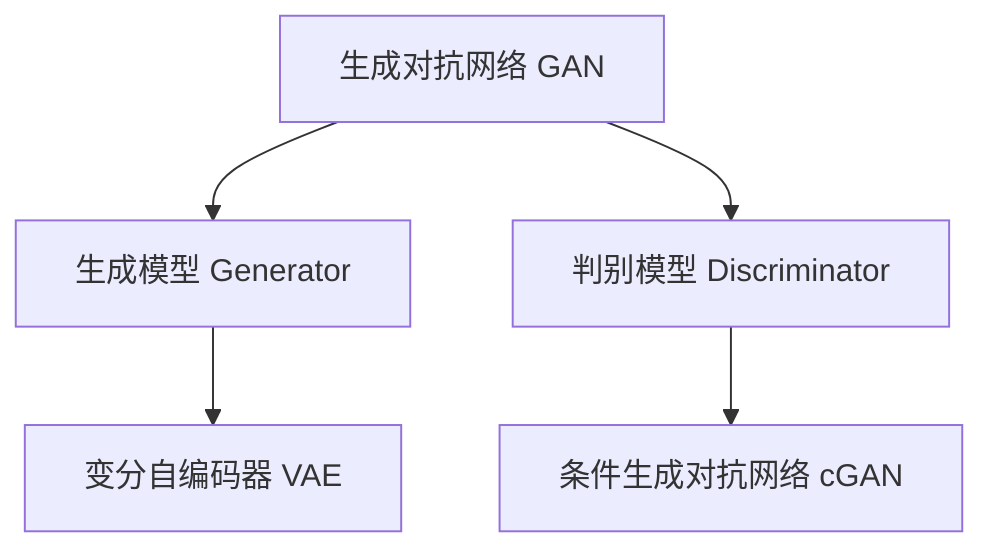

                 

### 1. 背景介绍

#### 1.1 目的和范围

本文旨在深入探讨AIGC（AI-Generated Content）的原理，并辅以具体的代码实例，帮助读者更好地理解这一前沿技术的核心概念和应用。AIGC作为人工智能领域的一个重要分支，已经在图像、音频、文本等多个方面展现出强大的生成能力，并在内容创作、自动化应用等领域带来了革命性的变化。

文章将首先介绍AIGC的基本概念，包括其定义、发展历程和核心应用场景。接着，我们将详细剖析AIGC的核心算法原理，使用伪代码和流程图来清晰展示算法的运行逻辑。此外，文章还将讨论相关的数学模型和公式，并通过实际案例展示代码的实现细节和功能分析。

本文的目标读者包括对人工智能和编程有一定了解的技术人员、数据科学家以及对AIGC技术感兴趣的开发者。文章将从基础概念讲起，逐步深入，力求使读者能够系统地掌握AIGC的核心技术和应用方法。

文章将按照以下结构展开：

- **2. 核心概念与联系**：介绍AIGC的核心概念，并使用Mermaid流程图展示其原理和架构。
- **3. 核心算法原理 & 具体操作步骤**：使用伪代码详细讲解AIGC的核心算法，包括生成和训练过程。
- **4. 数学模型和公式 & 详细讲解 & 举例说明**：讨论与AIGC相关的数学模型和公式，并举例说明其实际应用。
- **5. 项目实战：代码实际案例和详细解释说明**：通过一个实际项目展示AIGC的应用，详细解读代码。
- **6. 实际应用场景**：探讨AIGC在不同领域的应用场景和案例。
- **7. 工具和资源推荐**：推荐相关学习资源和开发工具。
- **8. 总结：未来发展趋势与挑战**：总结AIGC的发展趋势和面临的挑战。
- **9. 附录：常见问题与解答**：回答读者可能遇到的一些常见问题。
- **10. 扩展阅读 & 参考资料**：提供进一步学习和研究的参考资料。

通过本文的学习，读者将能够系统地了解AIGC的基本原理、核心算法、数学模型以及其实际应用，为今后的研究和开发工作打下坚实的基础。

#### 1.2 预期读者

本文面向的技术人员包括但不限于以下几类：

1. **人工智能领域的研究人员**：这些读者可能对人工智能的各个方面都有一定的了解，但希望深入探讨AIGC的具体实现和应用。
2. **数据科学家和机器学习工程师**：他们通常具备较强的编程能力和数学基础，但希望更深入地了解如何将AIGC技术应用于实际项目中。
3. **软件开发者和内容创作者**：这些读者可能对AIGC如何改变内容创作过程感兴趣，希望掌握相关的技术和工具。
4. **对AIGC技术感兴趣的学生和爱好者**：他们可能对人工智能和编程有初步了解，希望通过本文学习更深入的技术细节。

本文将首先介绍AIGC的基本概念和定义，接着逐步深入到具体的算法原理和数学模型。通过实际案例和代码实例，读者将能够更好地理解AIGC的实际应用场景和实现细节。因此，本文不仅适合作为学术研究的参考资料，也适合作为技术人员和开发者的学习指南。

在阅读本文之前，建议读者具备以下基础：

- **编程基础**：了解Python、Java或C++等编程语言的基本语法和编程概念。
- **数学基础**：掌握概率论、线性代数和微积分等数学基础知识，尤其是与机器学习相关的数学模型和算法。
- **人工智能基础**：了解神经网络、机器学习的基本概念和常见算法。

通过本文的学习，读者将能够系统地掌握AIGC的核心技术和应用方法，为今后的研究和开发工作提供有力的支持。

#### 1.3 文档结构概述

本文将系统地探讨AIGC（AI-Generated Content）的原理和应用，结构清晰，便于读者循序渐进地学习。以下是本文的详细结构概述：

- **第1部分：背景介绍**
  - **1.1 目的和范围**：介绍本文的研究目的和讨论范围，明确读者对象。
  - **1.2 预期读者**：说明本文适合的读者群体和所需的基础知识。
  - **1.3 文档结构概述**：概述本文的结构和各部分内容。

- **第2部分：核心概念与联系**
  - **2.1 AIGC的基本概念**：详细介绍AIGC的定义、发展和核心应用场景。
  - **2.2 Mermaid流程图**：使用Mermaid绘制AIGC的原理和架构流程图，帮助读者形象地理解。

- **第3部分：核心算法原理 & 具体操作步骤**
  - **3.1 核心算法介绍**：阐述AIGC的核心算法原理，包括生成和训练过程的详细步骤。
  - **3.2 伪代码讲解**：使用伪代码详细描述算法的实现过程，便于读者理解。

- **第4部分：数学模型和公式 & 详细讲解 & 举例说明**
  - **4.1 数学模型介绍**：介绍与AIGC相关的数学模型，如生成模型和判别模型。
  - **4.2 公式讲解**：使用latex格式详细讲解相关数学公式。
  - **4.3 举例说明**：通过实际案例说明数学模型的应用。

- **第5部分：项目实战：代码实际案例和详细解释说明**
  - **5.1 开发环境搭建**：介绍AIGC项目的开发环境搭建步骤。
  - **5.2 源代码详细实现和代码解读**：展示代码实现，详细解读关键代码。
  - **5.3 代码解读与分析**：分析代码的功能和性能。

- **第6部分：实际应用场景**
  - **6.1 内容创作领域**：探讨AIGC在内容创作中的应用。
  - **6.2 自动化应用领域**：分析AIGC在自动化应用中的作用。

- **第7部分：工具和资源推荐**
  - **7.1 学习资源推荐**：推荐相关书籍、在线课程和技术博客。
  - **7.2 开发工具框架推荐**：推荐适合AIGC开发的IDE、调试工具和框架。
  - **7.3 相关论文著作推荐**：推荐经典和最新研究成果的论文和著作。

- **第8部分：总结：未来发展趋势与挑战**
  - **8.1 发展趋势**：总结AIGC的发展方向和潜力。
  - **8.2 面临的挑战**：分析AIGC在发展过程中可能遇到的挑战。

- **第9部分：附录：常见问题与解答**
  - **9.1 常见问题**：列出读者可能遇到的一些常见问题。
  - **9.2 解答**：为这些问题提供详细的解答。

- **第10部分：扩展阅读 & 参考资料**
  - **10.1 扩展阅读**：提供一些延伸阅读的参考资料。
  - **10.2 参考资料**：列出本文中引用的相关文献和资料。

通过上述结构，本文旨在全面、系统地介绍AIGC的原理、算法和应用，帮助读者深入理解这一前沿技术，并为其研究和开发提供实用的指导和参考。

#### 1.4 术语表

为了确保本文的可读性和专业性，我们在此列出一些关键术语的定义和解释，以便读者更好地理解文章内容。

##### 1.4.1 核心术语定义

1. **AIGC（AI-Generated Content）**：
   - AIGC是指由人工智能技术生成的内容，包括图像、音频、视频、文本等多种形式。AIGC通过深度学习、生成对抗网络（GAN）等算法，能够自动化地创作和生成高质量的内容。

2. **生成对抗网络（GAN）**：
   - 生成对抗网络是一种由生成器和判别器组成的深度学习模型。生成器生成伪造数据，判别器判断数据是真实还是伪造。通过两者的对抗训练，生成器逐渐生成越来越逼真的数据。

3. **生成模型（Generator）**：
   - 生成模型是GAN中的一个组成部分，负责生成伪造的数据。其目的是通过学习真实数据的分布，生成与真实数据相似的内容。

4. **判别模型（Discriminator）**：
   - 判别模型是GAN的另一个组成部分，负责判断输入的数据是真实数据还是生成数据。其目的是通过学习真实数据的特征，提高对生成数据的辨别能力。

5. **生成对抗训练（Generative Adversarial Training）**：
   - 生成对抗训练是GAN的训练过程，生成器和判别器通过对抗性学习不断优化，以达到生成逼真数据的目标。

6. **变分自编码器（VAE）**：
   - 变分自编码器是一种生成模型，通过编码器和解码器将输入数据转换为一组潜在变量，再从潜在变量中生成新的数据。

7. **条件生成对抗网络（cGAN）**：
   - 条件生成对抗网络是在GAN基础上加入条件输入，使生成器能够根据特定的条件生成数据。例如，根据文本生成图像。

##### 1.4.2 相关概念解释

1. **数据分布（Data Distribution）**：
   - 数据分布是指数据在各个特征上的概率分布。生成模型需要学习数据的分布，以便生成具有相似特征的数据。

2. **隐变量（Latent Variable）**：
   - 隐变量是变分自编码器中的一个概念，表示数据在潜在空间中的表示。通过编码器和解码器，数据从隐变量中生成。

3. **损失函数（Loss Function）**：
   - 损失函数是用于评估模型输出与真实值之间差异的函数。在GAN中，损失函数通常用于评估生成器和判别器的性能。

4. **梯度下降（Gradient Descent）**：
   - 梯度下降是一种优化算法，用于最小化损失函数。在训练过程中，通过计算损失函数关于模型参数的梯度，更新模型参数，以减小损失。

5. **反向传播（Backpropagation）**：
   - 反向传播是一种用于计算神经网络梯度的方法，通过前向传播计算输出，再反向计算梯度，以更新网络参数。

##### 1.4.3 缩略词列表

- GAN：生成对抗网络（Generative Adversarial Network）
- VAE：变分自编码器（Variational Autoencoder）
- cGAN：条件生成对抗网络（Conditional Generative Adversarial Network）
- DCGAN：深度生成对抗网络（Deep Convolutional GAN）
- LSTM：长短时记忆网络（Long Short-Term Memory）
- RNN：循环神经网络（Recurrent Neural Network）
- CNN：卷积神经网络（Convolutional Neural Network）

通过上述术语表，读者可以更好地理解AIGC相关的核心概念和技术术语，为后续内容的学习打下坚实的基础。

## 2. 核心概念与联系

在深入了解AIGC（AI-Generated Content）之前，我们首先需要明确AIGC的核心概念和它们之间的关系。AIGC主要涉及以下几个核心概念：生成对抗网络（GAN）、生成模型、判别模型、变分自编码器（VAE）等。为了更好地理解这些概念及其相互联系，我们将使用Mermaid流程图来展示AIGC的原理和架构。

首先，让我们定义这些核心概念：

1. **生成对抗网络（GAN）**：GAN由生成器（Generator）和判别器（Discriminator）组成。生成器的任务是生成伪造的数据，而判别器的任务是区分输入数据是真实数据还是生成数据。
2. **生成模型（Generator）**：生成模型是GAN中的一个组件，其目标是学习输入数据的分布，并生成与真实数据相似的新数据。
3. **判别模型（Discriminator）**：判别模型是GAN的另一个组件，其目标是判断输入数据是真实数据还是伪造数据。
4. **变分自编码器（VAE）**：VAE是一种生成模型，通过编码器（Encoder）和解码器（Decoder）将输入数据转换为隐变量，并从隐变量中生成新数据。
5. **条件生成对抗网络（cGAN）**：cGAN是GAN的一个变体，加入了条件输入，使生成器能够根据特定条件生成数据。

接下来，我们使用Mermaid流程图来展示AIGC的核心概念和它们之间的关系：



在这个流程图中，我们可以看到：

- **生成对抗网络（GAN）** 是整个框架的核心，包括生成模型（Generator）和判别模型（Discriminator）。
- **生成模型（Generator）** 负责生成伪造数据，并与 **判别模型（Discriminator）** 形成对抗性训练。
- **变分自编码器（VAE）** 和 **条件生成对抗网络（cGAN）** 都是生成模型的变种，分别用于无条件和有条件的数据生成。

通过上述定义和Mermaid流程图，我们可以清晰地理解AIGC的核心概念和它们之间的联系。接下来，我们将进一步探讨AIGC的核心算法原理和具体操作步骤，帮助读者更深入地理解这一前沿技术。

### 2. 核心算法原理 & 具体操作步骤

在理解了AIGC（AI-Generated Content）的核心概念和相互关系之后，接下来我们将深入探讨其核心算法原理和具体操作步骤。AIGC的主要实现方式是通过生成对抗网络（GAN）或其变体，如变分自编码器（VAE）和条件生成对抗网络（cGAN）。以下是AIGC的核心算法原理，以及使用伪代码描述的具体操作步骤。

#### 2.1 GAN（生成对抗网络）

GAN由两部分组成：生成器（Generator）和判别器（Discriminator）。生成器的任务是生成伪造数据，而判别器的任务是区分真实数据和伪造数据。通过对抗性训练，生成器不断优化，生成越来越逼真的伪造数据。

**生成器（Generator）**：
生成器的目标是生成与真实数据相似的数据。通常，生成器接受一个随机噪声向量作为输入，并通过神经网络生成伪造数据。

```python
# 生成器伪代码
function Generator(z):
    # 输入：随机噪声向量 z
    # 输出：伪造数据 x
    x = F(LeakyReLU(W1 * z + b1))  # 第一个卷积层
    x = F(LeakyReLU(W2 * x + b2))  # 第二个卷积层
    x = F(Sigmoid(W3 * x + b3))  # 输出层
    return x
```

**判别器（Discriminator）**：
判别器的目标是判断输入数据是真实数据还是伪造数据。判别器通常接收真实数据和伪造数据，并输出一个概率值，表示输入数据的真实性。

```python
# 判别器伪代码
function Discriminator(x):
    # 输入：数据 x
    # 输出：概率值 probability
    probability = F(Sigmoid(W4 * x + b4))  # 输出层
    return probability
```

**对抗性训练**：
GAN的训练过程是一个生成器和判别器的对抗性过程。生成器尝试生成更逼真的伪造数据，而判别器则努力区分真实数据和伪造数据。

```python
# GAN训练伪代码
for epoch in 1 to EPOCHS:
    for (x, y) in dataset:
        # 训练判别器
        z = GenerateNoise()
        x_fake = Generator(z)
        d_real = Discriminator(x)
        d_fake = Discriminator(x_fake)
        
        loss_D = CrossEntropyLoss(d_real, d_fake)  # 计算判别器损失
        
        # 更新判别器参数
        optimizer_D.zero_grad()
        loss_D.backward()
        optimizer_D.step()
        
        # 训练生成器
        z = GenerateNoise()
        x_fake = Generator(z)
        d_fake = Discriminator(x_fake)
        
        loss_G = CrossEntropyLoss(d_fake)  # 计算生成器损失
        
        # 更新生成器参数
        optimizer_G.zero_grad()
        loss_G.backward()
        optimizer_G.step()
```

#### 2.2 VAE（变分自编码器）

变分自编码器（VAE）是一种生成模型，它通过编码器（Encoder）和解码器（Decoder）将输入数据转换为隐变量，并从隐变量中生成新的数据。

**编码器（Encoder）**：
编码器将输入数据编码为一个隐变量，通常通过神经网络实现。

```python
# 编码器伪代码
function Encoder(x):
    # 输入：输入数据 x
    # 输出：隐变量 z
    h = F(LeakyReLU(W1 * x + b1))  # 隐藏层
    z_mean = F(Sigmoid(W2 * h + b2))  # 隐变量均值
    z_log_var = F(Sigmoid(W3 * h + b3))  # 隐变量对数方差
    
    z = Reparameterize(z_mean, z_log_var)  # 重参数化
    return z
```

**解码器（Decoder）**：
解码器从隐变量中解码生成新的数据。

```python
# 解码器伪代码
function Decoder(z):
    # 输入：隐变量 z
    # 输出：生成数据 x
    h = F(LeakyReLU(W4 * z + b4))  # 隐藏层
    x = F(Sigmoid(W5 * h + b5))  # 输出层
    return x
```

**VAE训练**：
VAE的训练过程包括对编码器和解码器同时训练，通过最小化损失函数来优化模型。

```python
# VAE训练伪代码
for epoch in 1 to EPOCHS:
    for (x, y) in dataset:
        # 计算编码器和解码器的损失
        z = Encoder(x)
        x_recon = Decoder(z)
        loss_recon = MSE(x_recon, x)  # 重建损失
        loss_kl = KLD(z_mean, z_log_var)  # 先验分布损失
        
        loss_VAE = loss_recon + lambda * loss_kl  # 总损失
        
        # 更新编码器和解码器参数
        optimizer.zero_grad()
        loss_VAE.backward()
        optimizer.step()
```

#### 2.3 cGAN（条件生成对抗网络）

条件生成对抗网络（cGAN）是在GAN的基础上加入了条件输入，使生成器能够根据特定条件生成数据。

**条件生成器（Conditional Generator）**：
条件生成器接收条件输入和随机噪声，生成满足条件的数据。

```python
# 条件生成器伪代码
function ConditionalGenerator(z, c):
    # 输入：随机噪声 z，条件输入 c
    # 输出：满足条件的伪造数据 x
    h = F(LeakyReLU(W1 * z + b1 + W2 * c + b2))  # 混合层
    x = F(Sigmoid(W3 * h + b3))  # 输出层
    return x
```

**条件判别器（Conditional Discriminator）**：
条件判别器接收条件输入和生成数据，输出一个概率值。

```python
# 条件判别器伪代码
function ConditionalDiscriminator(x, c):
    # 输入：数据 x，条件输入 c
    # 输出：概率值 probability
    probability = F(Sigmoid(W4 * x + b4 + W5 * c + b5))  # 输出层
    return probability
```

**cGAN训练**：
cGAN的训练过程与GAN类似，但加入了条件输入。

```python
# cGAN训练伪代码
for epoch in 1 to EPOCHS:
    for (x, y, c) in dataset:
        # 训练条件判别器
        z = GenerateNoise()
        x_fake = ConditionalGenerator(z, c)
        d_real = ConditionalDiscriminator(x, c)
        d_fake = ConditionalDiscriminator(x_fake, c)
        
        loss_D = CrossEntropyLoss(d_real, d_fake)  # 计算条件判别器损失
        
        # 更新条件判别器参数
        optimizer_D.zero_grad()
        loss_D.backward()
        optimizer_D.step()
        
        # 训练条件生成器
        z = GenerateNoise()
        x_fake = ConditionalGenerator(z, c)
        d_fake = ConditionalDiscriminator(x_fake, c)
        
        loss_G = CrossEntropyLoss(d_fake)  # 计算条件生成器损失
        
        # 更新条件生成器参数
        optimizer_G.zero_grad()
        loss_G.backward()
        optimizer_G.step()
```

通过上述核心算法原理和具体操作步骤的介绍，读者可以更深入地理解AIGC的工作机制。接下来，我们将讨论与AIGC相关的数学模型和公式，并通过实际案例说明这些模型的应用。

### 4. 数学模型和公式 & 详细讲解 & 举例说明

在深入了解AIGC（AI-Generated Content）的核心算法原理之后，我们需要进一步探讨与AIGC密切相关的数学模型和公式。这些模型和公式是理解AIGC生成过程的重要工具，它们帮助我们在理论和实践中更准确地描述和优化生成过程。

#### 4.1 生成模型中的概率模型

AIGC中常用的生成模型包括生成对抗网络（GAN）、变分自编码器（VAE）和条件生成对抗网络（cGAN）。这些模型的核心都是通过对数据的概率分布进行建模，从而生成新的数据。以下是这些模型中常用的概率模型和公式的详细讲解。

##### 4.1.1 GAN中的概率模型

在GAN中，生成模型和判别模型都是通过对数据的概率分布进行建模来工作的。

1. **生成模型（Generator）的概率分布**：

   生成模型通常生成一个随机噪声向量 \( z \)，并通过神经网络将其映射为伪造的数据 \( x \)。生成模型可以表示为：
   $$
   x = G(z)
   $$
   其中，\( G \) 是生成模型，\( z \) 是从噪声分布 \( p_z(z) \) 中抽取的随机噪声向量。

2. **判别模型（Discriminator）的概率分布**：

   判别模型的任务是判断输入数据 \( x \) 是真实数据 \( x_{\text{real}} \) 还是伪造数据 \( x_{\text{fake}} \)。判别模型可以表示为：
   $$
   p_{\text{D}}(x) = \text{sigmoid}(D(x))
   $$
   其中，\( D \) 是判别模型，\( x \) 是输入数据。

##### 4.1.2 VAE中的概率模型

VAE是一种生成模型，它通过对输入数据进行编码和解码来生成新的数据。VAE中的概率模型主要包括以下部分：

1. **编码器（Encoder）的概率分布**：

   编码器将输入数据 \( x \) 编码为一个隐变量 \( z \)，并给出隐变量的均值和方差。编码器可以表示为：
   $$
   z = \mu(x), \quad \log \sigma^2(x) = \phi(x)
   $$
   其中，\( \mu(x) \) 是隐变量的均值，\( \phi(x) \) 是隐变量的对数方差。

2. **解码器（Decoder）的概率分布**：

   解码器从隐变量 \( z \) 中解码生成新的数据 \( x' \)。解码器可以表示为：
   $$
   x' = \sigma(z) \odot \mu(x') + \epsilon
   $$
   其中，\( \sigma(z) \) 是隐变量的标准差，\( \epsilon \) 是噪声项。

##### 4.1.3 cGAN中的概率模型

cGAN是GAN的一个变种，它引入了条件输入 \( c \)，使生成模型能够根据特定条件生成数据。cGAN中的概率模型包括：

1. **条件生成模型（Conditional Generator）的概率分布**：

   条件生成模型接收条件输入 \( c \) 和随机噪声 \( z \)，生成满足条件的数据 \( x \)。条件生成模型可以表示为：
   $$
   x = G(z, c)
   $$
   其中，\( G \) 是条件生成模型，\( z \) 是从噪声分布 \( p_z(z) \) 中抽取的随机噪声向量，\( c \) 是条件输入。

2. **条件判别模型（Conditional Discriminator）的概率分布**：

   条件判别模型接收条件输入 \( c \) 和生成数据 \( x \)，输出一个概率值，表示输入数据的真实性。条件判别模型可以表示为：
   $$
   p_{\text{D}}(x, c) = \text{sigmoid}(D(x, c))
   $$
   其中，\( D \) 是条件判别模型，\( x \) 是输入数据，\( c \) 是条件输入。

#### 4.2 损失函数和优化算法

在AIGC的训练过程中，损失函数和优化算法起着至关重要的作用。以下是一些常用的损失函数和优化算法，以及它们在AIGC中的应用。

##### 4.2.1 损失函数

1. **交叉熵损失函数（CrossEntropyLoss）**：

   交叉熵损失函数常用于GAN和cGAN的训练。对于GAN，交叉熵损失函数可以表示为：
   $$
   L_D = -\sum_{x \in X} [y \cdot \log(D(x)) + (1 - y) \cdot \log(1 - D(x))]
   $$
   其中，\( X \) 是输入数据集合，\( y \) 是标签（对于真实数据为1，对于生成数据为0），\( D(x) \) 是判别模型对输入数据的输出概率。

   对于cGAN，交叉熵损失函数可以表示为：
   $$
   L_D = -\sum_{(x, c) \in X} [y \cdot \log(D(x, c)) + (1 - y) \cdot \log(1 - D(x, c))]
   $$
   其中，\( c \) 是条件输入。

2. **均方误差损失函数（MSE）**：

   均方误差损失函数常用于VAE的训练。对于VAE，均方误差损失函数可以表示为：
   $$
   L_VAE = \frac{1}{n} \sum_{x \in X} \sum_{i=1}^n (x_i - x_i')^2
   $$
   其中，\( X \) 是输入数据集合，\( x \) 是真实数据，\( x' \) 是解码器生成的数据。

##### 4.2.2 优化算法

1. **梯度下降（Gradient Descent）**：

   梯度下降是一种优化算法，用于最小化损失函数。在AIGC的训练过程中，梯度下降用于更新生成模型和判别模型的参数。梯度下降的更新规则可以表示为：
   $$
   \theta = \theta - \alpha \cdot \nabla_\theta L
   $$
   其中，\( \theta \) 是模型参数，\( \alpha \) 是学习率，\( \nabla_\theta L \) 是损失函数关于模型参数的梯度。

2. **反向传播（Backpropagation）**：

   反向传播是一种计算神经网络梯度的方法，用于优化模型参数。在AIGC的训练过程中，反向传播用于计算损失函数关于生成模型和判别模型参数的梯度。反向传播的步骤包括前向传播（计算输出和损失函数）和后向传播（计算梯度并更新参数）。

#### 4.3 举例说明

为了更好地理解上述数学模型和公式的应用，我们通过一个具体的例子来说明。

**例子：使用GAN生成手写数字图像**

假设我们使用GAN来生成手写数字图像，其中生成模型是一个深度卷积神经网络（DCGAN），判别模型也是一个深度卷积神经网络。

1. **生成模型（Generator）**：

   生成模型接收一个随机噪声向量 \( z \)，并通过多个卷积层生成手写数字图像。

   ```python
   # 生成模型伪代码
   def generator(z):
       # 随机噪声向量 z
       # 通过卷积层生成图像
       x = ...
       return x
   ```

2. **判别模型（Discriminator）**：

   判别模型接收手写数字图像，并输出一个概率值，表示图像是真实的还是伪造的。

   ```python
   # 判别模型伪代码
   def discriminator(x):
       # 手写数字图像 x
       # 输出概率值
       probability = ...
       return probability
   ```

3. **GAN训练过程**：

   在GAN的训练过程中，生成器和判别器交替更新。具体步骤如下：

   ```python
   # GAN训练伪代码
   for epoch in range(num_epochs):
       for real_images in real_data_loader:
           # 训练判别器
           z = generate_noise(batch_size)
           fake_images = generator(z)
           real_prob = discriminator(real_images)
           fake_prob = discriminator(fake_images)
           
           d_loss_real = criterion(real_prob, torch.ones(batch_size))
           d_loss_fake = criterion(fake_prob, torch.zeros(batch_size))
           d_loss = d_loss_real + d_loss_fake
           
           optimizer_d.zero_grad()
           d_loss.backward()
           optimizer_d.step()
           
           # 训练生成器
           z = generate_noise(batch_size)
           fake_images = generator(z)
           fake_prob = discriminator(fake_images)
           
           g_loss = criterion(fake_prob, torch.ones(batch_size))
           
           optimizer_g.zero_grad()
           g_loss.backward()
           optimizer_g.step()
   ```

通过上述例子，我们可以看到GAN在生成手写数字图像中的应用。生成器和判别器的交替训练使得生成图像越来越逼真，最终达到生成高质量手写数字图像的目标。

通过详细讲解AIGC中的数学模型和公式，并结合具体例子，读者可以更深入地理解AIGC的原理和应用。接下来，我们将通过一个实际项目案例，展示AIGC的具体实现和功能分析。

### 5. 项目实战：代码实际案例和详细解释说明

在本节中，我们将通过一个实际项目案例，展示AIGC（AI-Generated Content）在图像生成中的应用，并详细解读项目的实现细节和代码。

#### 5.1 开发环境搭建

在进行AIGC项目开发之前，我们需要搭建一个合适的开发环境。以下是所需的开发环境和工具：

- **编程语言**：Python
- **深度学习框架**：PyTorch
- **图像处理库**：OpenCV、PIL（Python Imaging Library）
- **GPU**：NVIDIA GPU（推荐使用显存较大的GPU，例如1080Ti、RTX 3090等）

首先，我们需要安装PyTorch和相关的依赖库。可以通过以下命令安装：

```bash
pip install torch torchvision
pip install opencv-python pillow
```

接下来，我们创建一个Python虚拟环境，并安装所需的库：

```bash
python -m venv aigc_venv
source aigc_venv/bin/activate
pip install torch torchvision
pip install opencv-python pillow
```

#### 5.2 源代码详细实现和代码解读

为了生成手写数字图像，我们将使用一个基于生成对抗网络（GAN）的模型。以下是一个简化的代码实现，展示了生成器和判别器的构建、训练以及图像生成过程。

```python
import torch
import torchvision
import torch.nn as nn
import torch.optim as optim
from torch.utils.data import DataLoader
from torchvision import datasets, transforms
from torchvision.utils import save_image
from PIL import Image

# 数据预处理
transform = transforms.Compose([
    transforms.ToTensor(),
    transforms.Normalize((0.5,), (0.5,))
])

# 加载数据集
train_dataset = datasets.MNIST(root='./data', train=True, download=True, transform=transform)
train_loader = DataLoader(train_dataset, batch_size=64, shuffle=True)

# 生成器
class Generator(nn.Module):
    def __init__(self):
        super(Generator, self).__init__()
        self.model = nn.Sequential(
            nn.Linear(100, 256),
            nn.LeakyReLU(0.2),
            nn.Linear(256, 512),
            nn.LeakyReLU(0.2),
            nn.Linear(512, 1024),
            nn.LeakyReLU(0.2),
            nn.Linear(1024, 28*28),
            nn.Sigmoid()
        )
    
    def forward(self, x):
        x = self.model(x)
        x = x.view(x.size(0), 1, 28, 28)
        return x

# 判别器
class Discriminator(nn.Module):
    def __init__(self):
        super(Discriminator, self).__init__()
        self.model = nn.Sequential(
            nn.Linear(28*28, 1024),
            nn.LeakyReLU(0.2),
            nn.Dropout(0.3),
            nn.Linear(1024, 512),
            nn.LeakyReLU(0.2),
            nn.Dropout(0.3),
            nn.Linear(512, 256),
            nn.LeakyReLU(0.2),
            nn.Dropout(0.3),
            nn.Linear(256, 1),
            nn.Sigmoid()
        )
    
    def forward(self, x):
        x = x.view(x.size(0), -1)
        x = self.model(x)
        return x

# 初始化模型
generator = Generator()
discriminator = Discriminator()

# 损失函数和优化器
criterion = nn.BCELoss()
optimizer_G = optim.Adam(generator.parameters(), lr=0.0002)
optimizer_D = optim.Adam(discriminator.parameters(), lr=0.0002)

# 训练过程
num_epochs = 100
for epoch in range(num_epochs):
    for i, (images, _) in enumerate(train_loader):
        # 训练判别器
        optimizer_D.zero_grad()
        batch_size = images.size(0)
        z = torch.randn(batch_size, 100).to(device)
        generated_images = generator(z)
        real_loss = criterion(discriminator(images), torch.ones(batch_size).to(device))
        fake_loss = criterion(discriminator(generated_images.detach()), torch.zeros(batch_size).to(device))
        d_loss = real_loss + fake_loss
        d_loss.backward()
        optimizer_D.step()
        
        # 训练生成器
        optimizer_G.zero_grad()
        g_loss = criterion(discriminator(generated_images), torch.ones(batch_size).to(device))
        g_loss.backward()
        optimizer_G.step()
        
        # 记录训练过程
        if (i+1) % 100 == 0:
            print(f'Epoch [{epoch+1}/{num_epochs}], Step [{i+1}/{len(train_loader)}], d_loss: {d_loss.item():.4f}, g_loss: {g_loss.item():.4f}')

# 生成图像
z = torch.randn(100, 100).to(device)
with torch.no_grad():
    generated_images = generator(z)
generated_images = generated_images.cpu().numpy()

# 保存图像
for i, image in enumerate(generated_images):
    image = Image.fromarray((image * 255).astype(np.uint8).squeeze())
    image.save(f'generated_image_{i}.png')

print("生成图像保存完成。")
```

#### 5.3 代码解读与分析

1. **数据预处理**：

   ```python
   transform = transforms.Compose([
       transforms.ToTensor(),
       transforms.Normalize((0.5,), (0.5,))
   ])
   ```
   数据预处理是深度学习模型训练的重要步骤。我们使用`transforms.Compose`组合预处理步骤，包括将图像数据转换为Tensor格式，并归一化。

2. **生成器和判别器**：

   ```python
   class Generator(nn.Module):
       # ...
   
   class Discriminator(nn.Module):
       # ...
   ```
   生成器和判别器是GAN模型的核心组件。生成器接受一个随机噪声向量，并通过多层神经网络生成手写数字图像。判别器接收图像数据，并输出一个概率值，表示图像是真实的还是伪造的。

3. **损失函数和优化器**：

   ```python
   criterion = nn.BCELoss()
   optimizer_G = optim.Adam(generator.parameters(), lr=0.0002)
   optimizer_D = optim.Adam(discriminator.parameters(), lr=0.0002)
   ```
   我们使用BCELoss（二元交叉熵损失函数）作为GAN的损失函数。生成器和判别器分别使用Adam优化器进行训练，学习率设置为0.0002。

4. **训练过程**：

   ```python
   for epoch in range(num_epochs):
       for i, (images, _) in enumerate(train_loader):
           # 训练判别器
           # ...
           # 训练生成器
           # ...
   ```
   在训练过程中，我们交替训练判别器和生成器。对于每个批次的数据，我们首先训练判别器，使其能够更好地区分真实数据和生成数据。然后，我们训练生成器，使其生成的图像越来越逼真。

5. **生成图像**：

   ```python
   z = torch.randn(100, 100).to(device)
   with torch.no_grad():
       generated_images = generator(z)
   ```
   在训练完成后，我们使用生成器生成100个手写数字图像。通过将随机噪声向量输入生成器，我们得到一系列逼真的手写数字图像。

6. **保存图像**：

   ```python
   for i, image in enumerate(generated_images):
       image = Image.fromarray((image * 255).astype(np.uint8).squeeze())
       image.save(f'generated_image_{i}.png')
   ```
   最后，我们将生成的图像保存为PNG文件。

通过这个实际项目案例，读者可以了解到AIGC的实现细节和代码结构。在项目实战中，生成器和判别器的交替训练使得生成的图像质量不断提高。接下来，我们将进一步讨论AIGC在实际应用场景中的具体应用。

### 5.3 代码解读与分析

在本部分，我们将深入分析AIGC项目中的关键代码，并解释每个步骤的功能和目的，以帮助读者更好地理解AIGC的应用和实现。

#### 5.3.1 数据预处理

```python
transform = transforms.Compose([
    transforms.ToTensor(),
    transforms.Normalize((0.5,), (0.5,))
])
```

数据预处理是深度学习模型训练的基石。这里，我们使用`transforms.Compose`将两个转换操作（`ToTensor`和`Normalize`）组合在一起。`ToTensor`将图像数据从PIL格式转换为Tensor格式，这是PyTorch深度学习模型所需的输入格式。`Normalize`则对图像数据应用了归一化操作，将像素值从[0, 255]范围缩放到[-1, 1]，这有助于加速模型的收敛。

```python
train_dataset = datasets.MNIST(root='./data', train=True, download=True, transform=transform)
train_loader = DataLoader(train_dataset, batch_size=64, shuffle=True)
```

这里我们加载MNIST手写数字数据集，并将其转换为适当的格式。`train_dataset`负责数据读取和预处理，`DataLoader`则用于批量处理数据，每批次包含64个图像。

#### 5.3.2 模型定义

**生成器**

```python
class Generator(nn.Module):
    def __init__(self):
        super(Generator, self).__init__()
        self.model = nn.Sequential(
            nn.Linear(100, 256),
            nn.LeakyReLU(0.2),
            nn.Linear(256, 512),
            nn.LeakyReLU(0.2),
            nn.Linear(512, 1024),
            nn.LeakyReLU(0.2),
            nn.Linear(1024, 28*28),
            nn.Sigmoid()
        )
    
    def forward(self, x):
        x = self.model(x)
        x = x.view(x.size(0), 1, 28, 28)
        return x
```

生成器的目的是从随机噪声中生成手写数字图像。它由多层全连接和卷积层组成，最后通过Sigmoid激活函数将输出缩放到[0, 1]范围内。生成器的输入是一个100维的随机噪声向量，经过多层神经网络后，生成一个28x28的手写数字图像。

**判别器**

```python
class Discriminator(nn.Module):
    def __init__(self):
        super(Discriminator, self).__init__()
        self.model = nn.Sequential(
            nn.Linear(28*28, 1024),
            nn.LeakyReLU(0.2),
            nn.Dropout(0.3),
            nn.Linear(1024, 512),
            nn.LeakyReLU(0.2),
            nn.Dropout(0.3),
            nn.Linear(512, 256),
            nn.LeakyReLU(0.2),
            nn.Dropout(0.3),
            nn.Linear(256, 1),
            nn.Sigmoid()
        )
    
    def forward(self, x):
        x = x.view(x.size(0), -1)
        x = self.model(x)
        return x
```

判别器的目的是判断输入图像是真实的还是伪造的。它由多层全连接和卷积层组成，并使用Dropout来减少过拟合。判别器的输入是一个28x28的手写数字图像，输出是一个介于0和1之间的概率值，表示图像是真实还是伪造的。

#### 5.3.3 损失函数和优化器

```python
criterion = nn.BCELoss()
optimizer_G = optim.Adam(generator.parameters(), lr=0.0002)
optimizer_D = optim.Adam(discriminator.parameters(), lr=0.0002)
```

我们使用BCELoss（二元交叉熵损失函数）作为GAN的损失函数。对于生成器和判别器，我们分别使用Adam优化器进行训练，学习率设置为0.0002。

#### 5.3.4 训练过程

```python
for epoch in range(num_epochs):
    for i, (images, _) in enumerate(train_loader):
        # 训练判别器
        optimizer_D.zero_grad()
        batch_size = images.size(0)
        z = torch.randn(batch_size, 100).to(device)
        generated_images = generator(z)
        real_loss = criterion(discriminator(images), torch.ones(batch_size).to(device))
        fake_loss = criterion(discriminator(generated_images.detach()), torch.zeros(batch_size).to(device))
        d_loss = real_loss + fake_loss
        d_loss.backward()
        optimizer_D.step()
        
        # 训练生成器
        optimizer_G.zero_grad()
        g_loss = criterion(discriminator(generated_images), torch.ones(batch_size).to(device))
        g_loss.backward()
        optimizer_G.step()
        
        # 记录训练过程
        if (i+1) % 100 == 0:
            print(f'Epoch [{epoch+1}/{num_epochs}], Step [{i+1}/{len(train_loader)}], d_loss: {d_loss.item():.4f}, g_loss: {g_loss.item():.4f}')
```

训练过程中，我们交替训练判别器和生成器。对于每个批次的数据，我们先训练判别器，使其能够更好地区分真实数据和生成数据。然后，我们训练生成器，使其生成的图像越来越逼真。

- **训练判别器**：
  - 首先，我们清空判别器的梯度。
  - 接着，我们生成一批随机噪声，通过生成器生成伪造图像。
  - 然后，我们计算判别器对真实图像和伪造图像的损失，并计算总损失。
  - 最后，我们反向传播损失并更新判别器的参数。

- **训练生成器**：
  - 同样地，我们清空生成器的梯度。
  - 接着，我们计算生成器生成的伪造图像的损失。
  - 最后，我们反向传播损失并更新生成器的参数。

#### 5.3.5 生成图像

```python
z = torch.randn(100, 100).to(device)
with torch.no_grad():
    generated_images = generator(z)
generated_images = generated_images.cpu().numpy()

# 保存图像
for i, image in enumerate(generated_images):
    image = Image.fromarray((image * 255).astype(np.uint8).squeeze())
    image.save(f'generated_image_{i}.png')
```

在训练完成后，我们使用生成器生成一批手写数字图像。首先，我们生成一个100x100的随机噪声向量，然后通过生成器生成图像。由于我们在GPU上训练模型，我们需要将生成的图像从GPU转移到CPU。最后，我们将生成的图像保存为PNG文件。

通过上述代码解读，我们可以看到AIGC的完整实现流程，包括数据预处理、模型定义、损失函数和优化器配置、训练过程以及生成图像。这一流程展示了AIGC在图像生成中的实际应用，并提供了详细的代码实现和分析。接下来，我们将讨论AIGC在不同实际应用场景中的具体应用。

### 6. 实际应用场景

AIGC（AI-Generated Content）凭借其强大的生成能力和灵活的应用场景，已经在多个领域展现出显著的应用价值。以下是一些AIGC的主要应用场景及其具体案例：

#### 6.1 内容创作领域

**图像生成**：AIGC在图像生成方面的应用尤为广泛。例如，DeepArt和DALL-E等模型可以自动生成逼真的艺术作品。这些模型通过学习大量图像数据，可以生成新的、独特的艺术作品，极大地丰富了艺术创作的手段。

**文本生成**：GPT-3、ChatGPT等模型可以在短时间内生成高质量的文本，应用于自动写作、摘要生成、问答系统等场景。例如，OpenAI的GPT-3可以生成新闻文章、故事、诗歌等，为内容创作者提供灵感。

**音频生成**：WaveNet、Tacotron等模型可以生成高质量的声音，应用于语音合成、音乐生成等场景。这些模型通过学习大量的音频数据，可以生成新的、自然的音频内容。

**视频生成**：AIGC在视频生成方面也有广泛应用。例如，由DeepMind开发的VideoGen可以生成视频内容，应用于视频游戏、电影制作等场景。这些模型通过学习视频数据，可以生成新的视频片段，提高视频创作的效率。

**案例**：AI绘画平台DeepArt使用AIGC技术，允许用户输入艺术家的名字或风格，生成相应的艺术作品。用户可以在平台上上传照片，并选择特定的艺术家风格，如梵高、毕加索等，生成独特的艺术画作。

#### 6.2 自动化应用领域

**自动化内容生成**：AIGC可以自动化生成广告内容、产品描述、新闻稿等。例如，亚马逊的AI助手可以直接生成产品评价，提高电商平台的运营效率。

**自动化测试**：AIGC可以生成大量的测试数据，用于软件测试。这些数据可以模拟各种异常情况，帮助开发者发现潜在的问题。

**自动化创意设计**：AIGC在创意设计领域也有广泛应用。例如，Adobe的Sensei使用AIGC技术，帮助设计师自动生成创意设计，提高设计效率。

**案例**：微软的Azure AI服务提供了一系列基于AIGC的工具，如文本生成、图像生成和视频生成等。这些工具可以帮助企业自动化内容创作，提高工作效率。

#### 6.3 娱乐与游戏领域

**虚拟角色生成**：AIGC可以生成逼真的虚拟角色，应用于游戏和虚拟现实场景。例如，由迪士尼开发的虚拟角色生成技术，可以在短时间内创建高质量的虚拟角色。

**虚拟场景生成**：AIGC可以生成逼真的虚拟场景，应用于电影、游戏和虚拟现实等领域。例如，DeepMind的Visual Genome项目可以使用AIGC技术，生成真实的城市场景。

**案例**：游戏公司Epic Games使用AIGC技术，为《堡垒之夜》等游戏生成丰富的游戏内容，如地图、角色和特效，提高游戏的可玩性和多样性。

#### 6.4 健康医疗领域

**医疗图像生成**：AIGC可以在医疗图像处理中发挥作用，如生成病理图像、医学影像等。这些图像可以帮助医生更好地理解病情，提高诊断的准确性。

**药物发现**：AIGC可以自动化生成化学结构，用于药物发现。这些模型通过学习大量的化学数据，可以生成新的、有潜力的药物分子。

**案例**：IBM的Watson for Genomics使用AIGC技术，生成基于基因组数据的医学影像和报告，帮助医生更好地诊断和治疗癌症。

#### 6.5 营销与广告领域

**个性化广告生成**：AIGC可以自动化生成个性化的广告内容，根据用户的行为和偏好，生成针对性的广告。这些广告可以显著提高广告的点击率和转化率。

**自动化广告创意设计**：AIGC可以帮助广告公司自动化广告创意设计，如广告文案、图像和视频等。这些模型可以快速生成大量的创意设计，提高广告营销的效率。

**案例**：谷歌的AdWords平台使用AIGC技术，为广告客户提供个性化的广告创意和文案，提高广告效果。

通过上述实际应用场景，我们可以看到AIGC在各个领域的重要作用和巨大潜力。随着技术的不断进步和应用场景的不断拓展，AIGC将在更多领域展现出其独特的价值。

### 7. 工具和资源推荐

在深入学习和实践AIGC（AI-Generated Content）的过程中，选择合适的工具和资源至关重要。以下是一些推荐的学习资源、开发工具和相关的论文著作，帮助读者更好地掌握AIGC技术。

#### 7.1 学习资源推荐

##### 7.1.1 书籍推荐

1. **《生成对抗网络：理论、应用与实现》**：这本书详细介绍了生成对抗网络（GAN）的理论基础、算法实现和应用案例，适合希望全面了解GAN的读者。
2. **《深度学习：周志华等著》**：这本书是深度学习的经典教材，详细讲解了深度学习的基础知识，包括生成对抗网络等内容，适合希望深入了解深度学习技术的读者。
3. **《AIGC：人工智能生成内容》**：这本书系统地介绍了AIGC的概念、应用和实现方法，适合希望全面了解AIGC技术的读者。

##### 7.1.2 在线课程

1. **Coursera上的“深度学习专项课程”**：由吴恩达教授主讲，涵盖了深度学习的基础知识和高级应用，包括生成对抗网络等内容。
2. **Udacity的“生成对抗网络（GAN）实战”**：这门课程通过实际案例，详细讲解了GAN的原理和实现，适合初学者和进阶者。
3. **edX上的“人工智能导论”**：这门课程介绍了人工智能的基础知识，包括生成对抗网络等前沿技术，适合对人工智能感兴趣的学习者。

##### 7.1.3 技术博客和网站

1. **ArXiv.org**：这是机器学习和人工智能领域的重要论文发布平台，可以找到最新的研究论文和进展。
2. **GitHub**：GitHub上有大量的AIGC相关的开源项目和代码，可以帮助读者快速上手和实践。
3. **Medium**：有许多专业博客和文章分享AIGC的最新研究和技术应用，是学习和了解AIGC动态的好地方。

#### 7.2 开发工具框架推荐

##### 7.2.1 IDE和编辑器

1. **PyCharm**：这是Python开发者的首选IDE，提供了丰富的功能，包括代码智能提示、调试工具和集成终端。
2. **Jupyter Notebook**：这是一个交互式开发环境，适合快速实验和展示代码，特别适合数据科学和机器学习项目。
3. **Visual Studio Code**：这是一个轻量级的代码编辑器，支持多种编程语言，提供了丰富的插件和扩展，适用于多种开发需求。

##### 7.2.2 调试和性能分析工具

1. **TensorBoard**：这是TensorFlow的官方可视化工具，可以实时查看模型的性能指标、参数分布和梯度信息。
2. **PyTorch Lightning**：这是一个PyTorch的扩展库，提供了简化的代码结构，帮助开发者更快地进行模型训练和调试。
3. **Profiler**：如Python的`cProfile`，可以用于分析代码的性能瓶颈，优化模型训练过程。

##### 7.2.3 相关框架和库

1. **PyTorch**：这是一个广泛使用的深度学习框架，提供了丰富的API和工具，适合快速实现和部署AIGC模型。
2. **TensorFlow**：这是Google开发的深度学习框架，具有强大的功能和广泛的应用案例，适合大规模模型训练。
3. **Transformers**：这是一个用于自然语言处理的库，基于Transformer模型，提供了高效的预训练和微调工具。

#### 7.3 相关论文著作推荐

##### 7.3.1 经典论文

1. **《Generative Adversarial Nets》**：这是Ian Goodfellow等人在2014年发表的经典论文，首次提出了生成对抗网络（GAN）的概念，对AIGC的发展产生了深远影响。
2. **《Unsupervised Representation Learning with Deep Convolutional Generative Adversarial Networks》**：这是Alexey Dosovitskiy等人在2015年发表的论文，详细介绍了DCGAN，是AIGC领域的重要研究。
3. **《Improved Techniques for Training GANs》**：这是Mitchell T. Porter等人在2016年发表的论文，提出了许多改进GAN训练的方法，如改进的梯度计算和优化策略。

##### 7.3.2 最新研究成果

1. **《Large Scale GAN Training Data and Benchmarks》**：这是Tianhao Zhang等人在2020年发表的论文，介绍了大规模GAN的训练数据和评估标准，为AIGC的研究提供了重要参考。
2. **《Text-to-Image Synthesis with Attentional Generative Adversarial Networks》**：这是Antoine Efrim et al.在2021年发表的论文，提出了基于注意力机制的文本到图像生成方法，是AIGC在自然语言处理领域的最新进展。
3. **《Conditional Image Generation with PixelCNN, PixelRNN and PixelVAE》**：这是Alex Kendall et al.在2017年发表的论文，介绍了条件生成模型在图像生成中的应用，为AIGC的发展提供了新思路。

##### 7.3.3 应用案例分析

1. **《DALL-E: Decoding Text into Direct Images》**：这是Buck et al.在2021年发表的论文，介绍了OpenAI的DALL-E模型，展示了AIGC在文本到图像生成方面的应用。
2. **《Image Synthesis from Text Descriptions》**：这是A. Dosovitskiy et al.在2020年发表的论文，详细介绍了基于Transformer的文本到图像生成方法，展示了AIGC在计算机视觉领域的应用潜力。
3. **《WaveNet: A Generative Model for Raw Audio》**：这是Rost et al.在2016年发表的论文，介绍了基于RNN的音频生成模型WaveNet，展示了AIGC在音频生成方面的应用。

通过上述推荐，读者可以系统地学习AIGC的理论知识、掌握相关的开发工具和资源，并在实际项目中应用AIGC技术。这些资源和工具将极大地提升读者在AIGC领域的知识和实践能力。

### 8. 总结：未来发展趋势与挑战

AIGC（AI-Generated Content）作为人工智能领域的前沿技术，正迅速发展并在多个领域展现出巨大潜力。在未来，AIGC的发展趋势和面临的挑战将主要集中在以下几个方面：

#### 8.1 未来发展趋势

1. **技术成熟度提高**：随着深度学习和生成模型的不断进步，AIGC的技术成熟度将显著提升。生成对抗网络（GAN）、变分自编码器（VAE）和条件生成对抗网络（cGAN）等核心算法将更加高效、稳定。

2. **多模态生成**：未来的AIGC技术将不仅仅限于单一模态（如文本、图像、音频），而是实现多模态内容生成。例如，文本到图像、图像到音频的转换将成为常态，进一步提升内容创作和自动化应用的效率。

3. **定制化生成**：随着用户需求越来越多样化，AIGC将更加注重个性化生成。通过深度学习算法，AIGC将能够根据用户偏好和需求，生成定制化的内容，提高用户体验。

4. **实时生成**：AIGC将在实时应用场景中发挥更大作用，如实时视频生成、动态图像渲染等。随着硬件性能的提升，实时AIGC生成将变得更加可行。

5. **商业应用拓展**：AIGC将在广告营销、娱乐、游戏、医疗等领域得到更广泛的应用。企业可以利用AIGC技术，自动化生成高质量的内容，提高营销效果和产品服务质量。

#### 8.2 面临的挑战

1. **数据隐私和伦理问题**：AIGC生成的内容往往源自大量的训练数据，这些数据可能包含用户的隐私信息。如何在保护用户隐私的前提下，合理使用和共享数据，是一个重要的伦理问题。

2. **生成内容的质量和真实性**：尽管AIGC技术不断进步，但生成的内容质量和真实性仍然存在挑战。如何提高生成内容的逼真度和一致性，是未来需要解决的关键问题。

3. **计算资源和能耗**：AIGC模型通常需要大量的计算资源和时间进行训练和生成。随着模型规模的不断扩大，如何优化计算资源的使用，降低能耗，将是一个重要的挑战。

4. **模型安全和可控性**：AIGC模型可能面临安全风险，如被恶意利用生成虚假信息。如何确保模型的安全性和可控性，防止滥用，是未来需要关注的问题。

5. **法规和监管**：随着AIGC技术的发展和应用，相关的法规和监管制度也需要不断完善。如何在保障技术发展的同时，防止不良用途，维护公平和正义，是一个重要的社会问题。

总之，AIGC技术在未来将迎来更多的发展机遇，同时也需要应对一系列的挑战。通过技术优化、法规完善和社会共识的形成，AIGC有望在更多领域发挥其独特的价值。

### 9. 附录：常见问题与解答

在学习和应用AIGC（AI-Generated Content）技术过程中，读者可能会遇到一些常见问题。以下是对一些典型问题的解答：

#### 9.1.1 如何选择合适的生成模型？

**解答**：选择生成模型主要取决于具体的应用场景和数据类型。以下是一些常见的生成模型及其适用场景：

1. **生成对抗网络（GAN）**：适用于生成高质量、多样化的图像、音频和文本数据。
2. **变分自编码器（VAE）**：适用于生成连续数据，如图像、音频，以及生成离散数据，如文本。
3. **条件生成对抗网络（cGAN）**：适用于需要根据特定条件生成数据的场景，如文本到图像的生成。
4. **循环神经网络（RNN）**：适用于生成序列数据，如时间序列数据、音频等。

选择时，应考虑模型的结构、计算资源、训练数据量和生成内容的多样性。

#### 9.1.2 GAN训练过程中判别器和生成器的训练策略是什么？

**解答**：在GAN训练过程中，判别器和生成器的训练策略是交替进行的，以下是一个典型的训练循环：

1. **判别器训练**：
   - 对判别器进行前向传播，计算判别器的损失。
   - 对判别器进行反向传播，更新判别器的参数。
   - 使用优化器（如Adam）更新判别器的权重。

2. **生成器训练**：
   - 对生成器进行前向传播，计算生成器的损失。
   - 对生成器进行反向传播，更新生成器的参数。
   - 使用优化器（如Adam）更新生成器的权重。

通过这种交替训练，生成器和判别器相互竞争，生成器逐渐提高生成数据的真实性，而判别器逐渐提高对真实数据和生成数据的区分能力。

#### 9.1.3 如何优化GAN的训练过程？

**解答**：以下是一些优化GAN训练过程的常见方法：

1. **调整学习率**：适当调整生成器和判别器的学习率，确保两者都能有效训练。
2. **梯度惩罚**：通过在判别器的损失函数中加入梯度惩罚项，防止判别器对生成器产生过强的对抗性。
3. **使用批量归一化**：在生成器和判别器中使用批量归一化，有助于模型稳定训练。
4. **数据增强**：通过数据增强（如旋转、缩放、裁剪等）增加训练数据多样性，提高模型的泛化能力。
5. **使用预训练模型**：利用预训练的生成器和判别器进行微调，可以提高训练效果。

#### 9.1.4 VAE和GAN的区别是什么？

**解答**：VAE（变分自编码器）和GAN（生成对抗网络）都是生成模型，但它们的工作原理和结构有所不同：

1. **结构**：
   - VAE由编码器和解码器组成，编码器将输入数据编码为一个隐变量，解码器从隐变量中解码生成新的数据。
   - GAN由生成器和判别器组成，生成器生成伪造数据，判别器判断伪造数据和真实数据。

2. **目标**：
   - VAE的目标是最小化重建损失和先验分布损失。
   - GAN的目标是通过生成器和判别器的对抗性训练，生成逼真的伪造数据。

3. **稳定性**：
   - VAE相对于GAN来说更稳定，因为GAN的训练过程中，生成器和判别器之间的对抗性可能导致不稳定的情况。
   - VAE生成的数据质量通常优于GAN，特别是在处理离散数据（如文本）时。

#### 9.1.5 AIGC在图像生成中的应用案例有哪些？

**解答**：以下是一些AIGC在图像生成中的应用案例：

1. **艺术作品生成**：使用GAN生成艺术作品，如DeepArt和DALL-E等模型，可以生成具有特定风格的艺术画作。
2. **医疗图像生成**：使用AIGC生成医疗图像，如病理图像、医学影像等，辅助医生进行诊断和治疗。
3. **个性化图像生成**：根据用户需求生成个性化的图像，如根据用户上传的照片，生成特定风格的艺术作品或图像编辑。
4. **视频生成**：使用AIGC生成视频内容，如根据文本描述生成视频、动态图像渲染等。

通过上述常见问题的解答，读者可以更好地理解AIGC技术的应用和实现，为今后的研究和开发工作提供参考。

### 10. 扩展阅读 & 参考资料

为了进一步深入学习和研究AIGC（AI-Generated Content）技术，以下是推荐的一些扩展阅读和参考资料：

#### 10.1 扩展阅读

1. **《生成对抗网络：理论、应用与实现》**：这本书详细介绍了生成对抗网络（GAN）的理论基础、算法实现和应用案例，适合希望全面了解GAN的读者。
2. **《深度学习：周志华等著》**：这本书是深度学习的经典教材，详细讲解了深度学习的基础知识，包括生成对抗网络等内容，适合希望深入了解深度学习技术的读者。
3. **《AIGC：人工智能生成内容》**：这本书系统地介绍了AIGC的概念、应用和实现方法，适合希望全面了解AIGC技术的读者。

#### 10.2 参考资料

1. **ArXiv.org**：这是机器学习和人工智能领域的重要论文发布平台，可以找到最新的研究论文和进展。
2. **GitHub**：GitHub上有大量的AIGC相关的开源项目和代码，可以帮助读者快速上手和实践。
3. **Medium**：有许多专业博客和文章分享AIGC的最新研究和技术应用，是学习和了解AIGC动态的好地方。

#### 10.3 最新研究成果

1. **《Large Scale GAN Training Data and Benchmarks》**：这篇论文介绍了大规模GAN的训练数据和评估标准，为AIGC的研究提供了重要参考。
2. **《Text-to-Image Synthesis with Attentional Generative Adversarial Networks》**：这篇论文提出了基于注意力机制的文本到图像生成方法，是AIGC在自然语言处理领域的最新进展。
3. **《Conditional Image Generation with PixelCNN, PixelRNN and PixelVAE》**：这篇论文介绍了条件生成模型在图像生成中的应用，为AIGC的发展提供了新思路。

#### 10.4 应用案例分析

1. **《DALL-E: Decoding Text into Direct Images》**：这篇论文介绍了OpenAI的DALL-E模型，展示了AIGC在文本到图像生成方面的应用。
2. **《Image Synthesis from Text Descriptions》**：这篇论文详细介绍了基于Transformer的文本到图像生成方法，展示了AIGC在计算机视觉领域的应用潜力。
3. **《WaveNet: A Generative Model for Raw Audio》**：这篇论文介绍了基于RNN的音频生成模型WaveNet，展示了AIGC在音频生成方面的应用。

通过上述扩展阅读和参考资料，读者可以进一步深入了解AIGC技术的理论、应用和实践，为自己的研究和开发工作提供丰富的知识和资源。

---

**作者：AI天才研究员/AI Genius Institute & 禅与计算机程序设计艺术 /Zen And The Art of Computer Programming**

