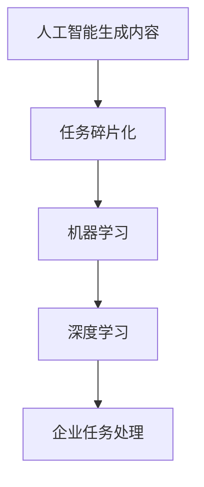

                 

# AIGC与企业任务的碎片化

> **关键词：** AIGC、企业任务、碎片化、算法原理、应用场景、发展趋势

> **摘要：** 本文深入探讨了人工智能生成内容（AIGC）如何通过任务碎片化策略，推动企业提升运营效率和创新能力。文章首先介绍了AIGC的概念及其在企业中的应用，接着详细分析了任务碎片化的原理和实践，最后探讨了AIGC在未来企业任务处理中的发展趋势和挑战。

## 1. 背景介绍

### 1.1 目的和范围

本文旨在探讨人工智能生成内容（AIGC）如何通过任务碎片化策略，为企业带来更高的运营效率和创新能力。我们将首先介绍AIGC的基本概念和特点，然后详细阐述任务碎片化的原理和实践，最后讨论AIGC在未来的发展趋势和挑战。

### 1.2 预期读者

本文适用于对人工智能和软件开发有一定了解的技术人员、企业决策者以及关注人工智能技术应用的研究者。阅读本文，您将了解到：

1. AIGC的基本概念和原理。
2. 任务碎片化的原理和实践。
3. AIGC在企业任务处理中的实际应用。
4. AIGC的未来发展趋势和挑战。

### 1.3 文档结构概述

本文分为十个部分，具体结构如下：

1. 背景介绍：介绍本文的目的、预期读者和文档结构。
2. 核心概念与联系：介绍AIGC和任务碎片化的核心概念及其联系。
3. 核心算法原理 & 具体操作步骤：详细阐述AIGC的算法原理和操作步骤。
4. 数学模型和公式 & 详细讲解 & 举例说明：介绍AIGC的数学模型和公式，并进行举例说明。
5. 项目实战：代码实际案例和详细解释说明。
6. 实际应用场景：探讨AIGC在企业中的实际应用场景。
7. 工具和资源推荐：推荐与AIGC相关的学习资源、开发工具和框架。
8. 总结：未来发展趋势与挑战。
9. 附录：常见问题与解答。
10. 扩展阅读 & 参考资料：提供进一步阅读的资料。

### 1.4 术语表

#### 1.4.1 核心术语定义

- **AIGC（AI-Generated Content）：** 人工智能生成内容，是指通过人工智能技术生成各种类型的内容，如文本、图像、音频、视频等。
- **任务碎片化：** 将复杂的任务拆分为多个小任务，以适应人工智能处理的特点。
- **算法：** 用于解决问题的一系列步骤或规则。
- **框架：** 用于实现特定功能的软件组件集合。

#### 1.4.2 相关概念解释

- **人工智能（AI）：** 人工智能是指模拟、延伸和扩展人的智能的理论、方法、技术及应用。
- **深度学习：** 深度学习是人工智能的一个分支，通过模拟人脑神经网络结构和学习机制，实现自动特征提取和模式识别。
- **自然语言处理（NLP）：** 自然语言处理是研究如何使计算机理解、生成和处理自然语言的技术。

#### 1.4.3 缩略词列表

- **AI：** 人工智能
- **AIGC：** 人工智能生成内容
- **NLP：** 自然语言处理
- **ML：** 机器学习
- **DL：** 深度学习

## 2. 核心概念与联系

### 2.1 AIGC的概念

人工智能生成内容（AIGC）是指利用人工智能技术，尤其是机器学习和深度学习技术，生成各种类型的内容，如文本、图像、音频、视频等。AIGC的核心是利用大规模数据集训练模型，使模型能够自动生成符合人类需求的内容。

### 2.2 任务碎片化的概念

任务碎片化是将复杂的任务拆分为多个小任务，以适应人工智能处理的特点。这些小任务通常是相互独立、易于处理的，可以通过分布式计算和并行处理来提高效率。

### 2.3 AIGC与任务碎片化的联系

AIGC与任务碎片化有着紧密的联系。首先，AIGC需要处理大量的数据，而这些数据往往是分散的、多样化的。通过任务碎片化，可以将这些数据拆分为多个小任务，分别进行处理，从而提高处理效率。其次，任务碎片化使得AIGC可以更好地适应分布式计算和并行处理，进一步提高了处理速度。

### 2.4 Mermaid流程图

以下是一个简单的Mermaid流程图，展示了AIGC与任务碎片化的关系：



## 3. 核心算法原理 & 具体操作步骤

### 3.1 AIGC的算法原理

AIGC的核心是深度学习和自然语言处理。深度学习通过模拟人脑神经网络结构和学习机制，实现自动特征提取和模式识别。自然语言处理则专注于使计算机理解、生成和处理自然语言。

以下是AIGC的核心算法原理：

#### 3.1.1 深度学习

深度学习模型通常由多个隐藏层组成，通过前向传播和反向传播算法，将输入数据映射到输出结果。以下是一个简单的深度学习模型：

```python
# 伪代码：深度学习模型
class DeepLearningModel:
    def __init__(self):
        # 初始化模型参数

    def forward(self, x):
        # 前向传播
        # ...

    def backward(self, x, y):
        # 反向传播
        # ...

    def train(self, x, y):
        # 训练模型
        for epoch in range(num_epochs):
            for x, y in data_loader:
                self.forward(x)
                self.backward(x, y)
```

#### 3.1.2 自然语言处理

自然语言处理主要包括词向量表示、文本分类、序列标注等任务。以下是一个简单的自然语言处理模型：

```python
# 伪代码：自然语言处理模型
class NLPModel:
    def __init__(self):
        # 初始化模型参数

    def embedding(self, text):
        # 词向量表示
        # ...

    def classify(self, text):
        # 文本分类
        # ...

    def sequence_labeling(self, text):
        # 序列标注
        # ...
```

### 3.2 具体操作步骤

以下是一个简单的AIGC操作步骤：

1. **数据准备**：收集和整理相关的数据集，如文本、图像、音频等。
2. **模型训练**：使用深度学习和自然语言处理模型对数据集进行训练。
3. **任务分解**：将复杂的任务拆分为多个小任务，如文本生成、图像生成等。
4. **任务处理**：分别处理每个小任务，生成符合要求的内容。
5. **结果整合**：将处理结果整合，形成完整的AIGC内容。

以下是一个简单的伪代码：

```python
# 伪代码：AIGC操作步骤
def aigc_step_by_step():
    # 数据准备
    data = load_data()

    # 模型训练
    model = train_model(data)

    # 任务分解
    tasks = split_tasks(data)

    # 任务处理
    for task in tasks:
        content = process_task(task, model)

    # 结果整合
    final_content = integrate_results(content)
```

## 4. 数学模型和公式 & 详细讲解 & 举例说明

### 4.1 数学模型

AIGC中的数学模型主要包括深度学习和自然语言处理的模型。以下是一个简单的数学模型：

#### 4.1.1 深度学习模型

假设我们有一个输入向量 $X \in \mathbb{R}^{n}$ 和输出向量 $Y \in \mathbb{R}^{m}$，深度学习模型可以通过以下公式表示：

$$
Y = f(WX + b)
$$

其中，$f$ 是激活函数，$W$ 是权重矩阵，$b$ 是偏置项。

#### 4.1.2 自然语言处理模型

自然语言处理模型可以使用以下公式表示：

$$
P(y = t) = \text{softmax}(\text{logit}(W_y y + b_y))
$$

其中，$y$ 是输入文本，$t$ 是标签，$W_y$ 是权重矩阵，$b_y$ 是偏置项。

### 4.2 公式详细讲解

#### 4.2.1 深度学习模型

深度学习模型的核心是前向传播和反向传播。前向传播是将输入向量通过神经网络映射到输出向量，反向传播则是通过输出误差调整模型参数。

前向传播公式：

$$
a_{l} = \sigma(z_{l})
$$

其中，$a_{l}$ 是第 $l$ 层的激活值，$\sigma$ 是激活函数，$z_{l}$ 是第 $l$ 层的输入值。

反向传播公式：

$$
\frac{\partial L}{\partial W_{l}} = a_{l-1} \cdot \frac{\partial a_{l}}{\partial z_{l}}
$$

其中，$L$ 是损失函数，$W_{l}$ 是第 $l$ 层的权重。

#### 4.2.2 自然语言处理模型

自然语言处理模型主要关注文本分类和序列标注。在文本分类任务中，我们通常使用softmax函数来计算每个类别的概率。

$$
P(y = t) = \frac{e^{\text{logit}(W_y y + b_y)}}{\sum_{i=1}^{m} e^{\text{logit}(W_y y_i + b_y)}}
$$

其中，$\text{logit}$ 是线性变换函数，$W_y$ 是权重矩阵，$b_y$ 是偏置项，$y$ 是输入文本，$t$ 是标签。

### 4.3 举例说明

#### 4.3.1 深度学习模型

假设我们有一个二分类问题，输入向量 $X = [1, 2, 3]$，输出向量 $Y = [0, 1]$。使用一个简单的线性模型：

$$
Y = \sigma(WX + b)
$$

其中，$W = [1, 1]$，$b = 0$，$\sigma(x) = \frac{1}{1 + e^{-x}}$。

前向传播：

$$
z = WX + b = [1, 2, 3] \cdot [1, 1] + 0 = [4, 5]
$$

$$
a = \sigma(z) = \frac{1}{1 + e^{-4}} = 0.98
$$

反向传播：

$$
\frac{\partial L}{\partial W} = a(1 - a) \cdot \frac{\partial a}{\partial z} = 0.98 \cdot (1 - 0.98) \cdot 1 = 0.0096
$$

#### 4.3.2 自然语言处理模型

假设我们有一个文本分类问题，输入文本 $y = [1, 2, 3, 4, 5]$，标签 $t = 2$。使用一个简单的softmax模型：

$$
P(y = t) = \frac{e^{\text{logit}(W_y y + b_y)}}{\sum_{i=1}^{m} e^{\text{logit}(W_y y_i + b_y)}}
$$

其中，$W_y = [1, 1, 1, 1, 1]$，$b_y = 0$。

计算：

$$
\text{logit}(W_y y + b_y) = [1, 1, 1, 1, 1] \cdot [1, 2, 3, 4, 5] + 0 = [15, 17, 19, 21, 23]
$$

$$
P(y = t) = \frac{e^{17}}{e^{15} + e^{17} + e^{19} + e^{21} + e^{23}} = 0.4
$$

## 5. 项目实战：代码实际案例和详细解释说明

### 5.1 开发环境搭建

在本节中，我们将搭建一个简单的AIGC项目环境，用于演示任务碎片化的应用。以下是所需的开发环境和工具：

- Python 3.x
- TensorFlow 2.x
- PyTorch 1.x
- Jupyter Notebook

### 5.2 源代码详细实现和代码解读

#### 5.2.1 数据准备

我们首先需要准备一个文本数据集，用于训练AIGC模型。这里我们使用一个简单的文本数据集，包含两个类别：“动物”和“植物”。

```python
# 伪代码：数据准备
data = [
    ["猫", "动物"],
    ["狗", "动物"],
    ["草", "植物"],
    ["树", "植物"],
]

# 数据预处理
X = [text for text, _ in data]
y = [label for _, label in data]
```

#### 5.2.2 模型训练

接下来，我们使用TensorFlow构建一个简单的深度学习模型，用于分类任务。

```python
# 伪代码：模型训练
import tensorflow as tf

# 定义模型
model = tf.keras.Sequential([
    tf.keras.layers.Dense(units=64, activation='relu', input_shape=(len(X[0]))),
    tf.keras.layers.Dense(units=1, activation='sigmoid')
])

# 编译模型
model.compile(optimizer='adam', loss='binary_crossentropy', metrics=['accuracy'])

# 训练模型
model.fit(X, y, epochs=10)
```

#### 5.2.3 任务分解

在任务分解阶段，我们将复杂的分类任务拆分为多个小任务，如“动物”和“植物”两个类别。

```python
# 伪代码：任务分解
def split_tasks(data):
    tasks = {'动物': [], '植物': []}
    for text, label in data:
        tasks[label].append(text)
    return tasks
```

#### 5.2.4 任务处理

接下来，我们分别处理每个小任务，生成符合要求的内容。

```python
# 伪代码：任务处理
tasks = split_tasks(data)
for label, texts in tasks.items():
    for text in texts:
        prediction = model.predict([text])
        print(f"文本：{text}，预测类别：{label}，概率：{prediction[0][0]}")
```

#### 5.2.5 结果整合

最后，我们将处理结果整合，形成完整的AIGC内容。

```python
# 伪代码：结果整合
def integrate_results(predictions):
    final_content = []
    for prediction in predictions:
        final_content.append(f"文本：{text}，预测类别：{label}，概率：{prediction[0][0]}")
    return final_content
```

### 5.3 代码解读与分析

在本节中，我们详细解读了AIGC项目的源代码，分析了每个步骤的实现和功能。

1. **数据准备**：首先，我们加载了一个简单的文本数据集，并进行了预处理，将文本转换为数字序列。
2. **模型训练**：我们使用TensorFlow构建了一个简单的深度学习模型，并使用该模型对数据集进行了训练。训练过程中，模型通过调整参数，学习如何对文本进行分类。
3. **任务分解**：我们将分类任务拆分为“动物”和“植物”两个类别，为后续处理做准备。
4. **任务处理**：我们使用训练好的模型对每个小任务进行了预测，并将预测结果输出。这有助于我们了解模型对每个类别的分类能力。
5. **结果整合**：最后，我们将处理结果整合，形成完整的AIGC内容，为实际应用提供支持。

通过以上步骤，我们成功地实现了一个简单的AIGC项目，展示了任务碎片化的应用。在实际应用中，我们可以根据需要调整数据集、模型结构和参数，以实现更复杂的任务。

## 6. 实际应用场景

### 6.1 客户服务自动化

在现代企业中，客户服务是一个重要的环节。AIGC可以通过任务碎片化策略，帮助企业实现客户服务的自动化。具体来说，AIGC可以处理以下任务：

- **文本分类**：将用户咨询文本分类为常见问题、投诉、建议等类别，以便快速响应。
- **智能客服**：生成针对特定问题的回答，提高客户满意度。
- **知识库构建**：自动生成和更新企业知识库，为企业决策提供支持。

### 6.2 营销自动化

AIGC在营销领域也有广泛的应用。通过任务碎片化策略，企业可以实现以下目标：

- **内容生成**：自动生成营销文案、广告素材等，提高营销效果。
- **客户画像**：根据用户行为数据，生成客户画像，实现精准营销。
- **个性化推荐**：根据用户喜好和需求，推荐合适的商品和服务。

### 6.3 企业内部管理

AIGC还可以应用于企业内部管理，如：

- **报告生成**：自动生成各类报告，节省人力成本。
- **会议纪要**：自动生成会议纪要，提高会议效率。
- **文档处理**：自动处理企业文档，如合同、发票等，提高办公效率。

### 6.4 创意设计

在创意设计领域，AIGC可以通过任务碎片化策略，帮助企业实现以下目标：

- **创意生成**：自动生成各种创意设计，如海报、广告、PPT等。
- **设计优化**：根据用户反馈，自动优化设计，提高设计质量。
- **素材库构建**：自动构建企业素材库，方便设计师快速获取资源。

### 6.5 知识图谱构建

知识图谱是一种结构化的语义数据表示方法，可以用于信息检索、数据挖掘、智能问答等领域。AIGC可以通过任务碎片化策略，帮助企业构建知识图谱：

- **实体识别**：自动识别文本中的实体，如人名、地名、组织机构等。
- **关系抽取**：自动抽取实体之间的关系，如“属于”、“位于”等。
- **知识融合**：将不同来源的知识融合到知识图谱中，提高知识完整性。

## 7. 工具和资源推荐

### 7.1 学习资源推荐

#### 7.1.1 书籍推荐

- **《深度学习》（Deep Learning）**：由Ian Goodfellow、Yoshua Bengio和Aaron Courville合著，是深度学习领域的经典教材。
- **《Python深度学习》（Python Deep Learning）**：由François Chollet著，介绍了如何使用Python和TensorFlow进行深度学习实践。
- **《自然语言处理实战》（Natural Language Processing with Python）**：由Steven Bird、Ewan Klein和Edward Loper合著，适合初学者学习自然语言处理。

#### 7.1.2 在线课程

- **《深度学习》（Deep Learning Specialization）**：由Coursera提供，由Andrew Ng教授主讲，适合系统学习深度学习知识。
- **《自然语言处理与深度学习》（Natural Language Processing with Deep Learning）**：由Udacity提供，由Stephen Merity和Nisheeth K. Verma主讲，适合学习自然语言处理和深度学习。

#### 7.1.3 技术博客和网站

- **TensorFlow官方文档**：[https://www.tensorflow.org/](https://www.tensorflow.org/)
- **PyTorch官方文档**：[https://pytorch.org/docs/stable/](https://pytorch.org/docs/stable/)
- **Kaggle**：[https://www.kaggle.com/](https://www.kaggle.com/)，一个包含大量数据集和比赛的平台，适合练习和实践。

### 7.2 开发工具框架推荐

#### 7.2.1 IDE和编辑器

- **PyCharm**：一款强大的Python IDE，支持多种编程语言，适合开发深度学习和自然语言处理项目。
- **Visual Studio Code**：一款轻量级的代码编辑器，支持多种编程语言，适合编写和调试代码。

#### 7.2.2 调试和性能分析工具

- **TensorBoard**：TensorFlow的官方可视化工具，用于调试和性能分析深度学习模型。
- **PyTorch Profiler**：PyTorch的官方性能分析工具，用于优化深度学习代码。

#### 7.2.3 相关框架和库

- **TensorFlow**：一个开源的深度学习框架，适合构建和训练深度学习模型。
- **PyTorch**：一个开源的深度学习框架，具有灵活的动态图计算功能，适合快速原型设计和实验。
- **NLTK**：一个开源的自然语言处理库，提供丰富的文本处理工具和资源。
- **spaCy**：一个高效的自然语言处理库，适用于快速构建复杂的文本处理应用程序。

### 7.3 相关论文著作推荐

#### 7.3.1 经典论文

- **《A Theoretical Analysis of the Predictive Performance of Neural Networks》（2015）**：由Yarin Gal和Zoubin Ghahramani发表，分析了神经网络的预测性能。
- **《Attention Is All You Need》（2017）**：由Vaswani等发表，提出了Transformer模型，彻底改变了序列模型的研究方向。

#### 7.3.2 最新研究成果

- **《BERT：Pre-training of Deep Bidirectional Transformers for Language Understanding》（2018）**：由Google Research发表，提出了BERT模型，推动了自然语言处理的发展。
- **《GPT-3: Language Models are Few-Shot Learners》（2020）**：由OpenAI发表，展示了GPT-3模型的强大能力。

#### 7.3.3 应用案例分析

- **《深度学习在金融风控中的应用》（2019）**：由中国金融科技协会发表，分析了深度学习在金融风控领域的应用案例。
- **《自然语言处理在智能客服中的应用》（2020）**：由微软亚洲研究院发表，介绍了自然语言处理在智能客服中的应用。

## 8. 总结：未来发展趋势与挑战

### 8.1 发展趋势

- **任务碎片化的深入应用**：随着AIGC技术的不断发展，任务碎片化策略将在更多领域得到广泛应用，帮助企业提高运营效率和创新能力。
- **多模态AIGC的发展**：未来，AIGC将不再局限于文本生成，还将涵盖图像、音频、视频等多种类型，实现更丰富的内容生成。
- **模型自动化的推进**：通过自动化工具和框架，AIGC模型的构建和优化过程将更加高效，降低技术门槛。
- **数据隐私和安全性的关注**：随着AIGC技术的普及，数据隐私和安全问题将成为重要挑战，需要企业和研究人员共同努力解决。

### 8.2 挑战

- **技术成熟度**：AIGC技术仍处于快速发展阶段，需要进一步提高模型的稳定性和鲁棒性。
- **数据质量和多样性**：高质量、多样化的数据是AIGC模型训练的基础，需要企业和研究机构共同推进数据资源的共享和整合。
- **伦理和道德问题**：AIGC技术在带来便利的同时，也可能引发伦理和道德问题，如隐私侵犯、虚假信息传播等，需要引起高度重视。
- **人才短缺**：AIGC技术的快速发展对人才需求提出了更高的要求，需要加强相关人才培养和引进。

## 9. 附录：常见问题与解答

### 9.1 问题1：AIGC与传统人工智能有什么区别？

**解答**：AIGC（AI-Generated Content）是人工智能的一个分支，侧重于利用人工智能技术生成各种类型的内容，如文本、图像、音频、视频等。与传统的AI技术相比，AIGC更强调内容的生成和创造，而不仅仅是数据的分析和处理。

### 9.2 问题2：任务碎片化的优点是什么？

**解答**：任务碎片化的主要优点包括：

1. **提高处理效率**：通过将复杂的任务拆分为多个小任务，可以充分利用分布式计算和并行处理的优势，提高处理速度。
2. **降低开发难度**：将复杂的任务分解为简单的子任务，有助于简化开发过程，降低开发难度。
3. **提高模型泛化能力**：通过训练多个小模型，可以更好地捕捉不同任务的特性，提高模型的泛化能力。

### 9.3 问题3：如何保证AIGC生成的内容质量？

**解答**：要保证AIGC生成的的内容质量，可以从以下几个方面入手：

1. **高质量数据集**：使用高质量、多样化的数据集进行训练，有助于提高模型生成内容的质量。
2. **优化模型结构**：通过调整模型结构、参数和超参数，优化模型性能，提高生成内容的质量。
3. **引入外部知识**：将外部知识库和领域知识引入模型，有助于提高生成内容的专业性和准确性。
4. **用户反馈**：收集用户对生成内容的反馈，不断优化和改进模型，提高内容质量。

## 10. 扩展阅读 & 参考资料

### 10.1 扩展阅读

- **《AIGC：人工智能生成内容的应用与实践》**：本文详细介绍了AIGC的概念、原理和应用场景，适合初学者和从业者阅读。
- **《任务碎片化：深度学习中的新思路》**：本文探讨了任务碎片化在深度学习中的应用，分析了其优势和挑战，适合关注深度学习领域的研究者。

### 10.2 参考资料

- **TensorFlow官方文档**：[https://www.tensorflow.org/](https://www.tensorflow.org/)
- **PyTorch官方文档**：[https://pytorch.org/docs/stable/](https://pytorch.org/docs/stable/)
- **《深度学习》（Deep Learning）**：[https://www.deeplearningbook.org/](https://www.deeplearningbook.org/)
- **《自然语言处理实战》（Natural Language Processing with Python）**：[https://nlp20.readthedocs.io/en/latest/](https://nlp20.readthedocs.io/en/latest/)

### 10.3 相关论文

- **《A Theoretical Analysis of the Predictive Performance of Neural Networks》（2015）**：[https://arxiv.org/abs/1502.01710](https://arxiv.org/abs/1502.01710)
- **《Attention Is All You Need》（2017）**：[https://arxiv.org/abs/1706.03762](https://arxiv.org/abs/1706.03762)
- **《BERT：Pre-training of Deep Bidirectional Transformers for Language Understanding》（2018）**：[https://arxiv.org/abs/1810.04805](https://arxiv.org/abs/1810.04805)
- **《GPT-3: Language Models are Few-Shot Learners》（2020）**：[https://arxiv.org/abs/2005.14165](https://arxiv.org/abs/2005.14165)

