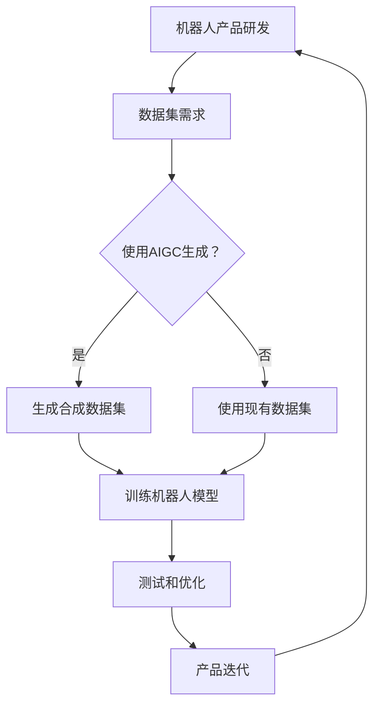

                 

# AIGC从入门到实战：AIGC在工业领域的创新场景—合成数据集，助力机器人产品研发

## 关键词
- AIGC（AI-Generated Content）
- 工业领域
- 合成数据集
- 机器人产品研发

## 摘要
本文将深入探讨AIGC（AI-Generated Content）在工业领域，特别是机器人产品研发中的应用。通过合成数据集的使用，我们可以加速产品迭代，提高研发效率，同时降低成本。本文将从背景介绍、核心概念与联系、核心算法原理、数学模型与公式、项目实战、实际应用场景、工具和资源推荐等方面，逐步讲解AIGC技术如何助力机器人产品研发，并提供未来发展展望。

## 1. 背景介绍

### 1.1 目的和范围
本文的目标是帮助读者了解AIGC技术在工业领域，尤其是机器人产品研发中的应用。我们将探讨AIGC的原理、实现方法以及其在实际项目中的应用场景。本文的范围涵盖AIGC的基础知识、算法原理、数学模型、实战案例以及相关的工具和资源。

### 1.2 预期读者
本文适合对人工智能和机器人技术有一定了解的技术人员、研发工程师以及对AIGC感兴趣的研究生和学者。通过本文的阅读，读者可以掌握AIGC的核心概念和应用方法，为未来的科研和工作奠定基础。

### 1.3 文档结构概述
本文分为十个部分，包括背景介绍、核心概念与联系、核心算法原理、数学模型与公式、项目实战、实际应用场景、工具和资源推荐、总结以及附录和扩展阅读。每个部分都详细阐述了AIGC在机器人产品研发中的应用。

### 1.4 术语表

#### 1.4.1 核心术语定义
- AIGC：AI-Generated Content，即AI生成内容，指的是利用人工智能技术自动生成文字、图片、音频等内容的系统。
- 合成数据集：通过人工智能技术自动生成的用于训练模型的数据集。
- 机器人产品研发：指的是开发、设计、测试和部署机器人产品的过程。

#### 1.4.2 相关概念解释
- 机器学习：一种人工智能的分支，通过数据训练模型，使模型具备自主学习和决策能力。
- 深度学习：一种机器学习的方法，通过神经网络模拟人脑的学习过程，处理复杂的数据。

#### 1.4.3 缩略词列表
- AIGC：AI-Generated Content
- ML：Machine Learning
- DL：Deep Learning

## 2. 核心概念与联系

在深入探讨AIGC在工业领域，特别是机器人产品研发中的应用之前，我们需要理解AIGC的核心概念和它与机器人产品研发的关联。

### 2.1 AIGC的核心概念

AIGC（AI-Generated Content）的核心概念在于利用人工智能技术自动生成内容。这包括生成文本、图像、音频等多种类型的内容。AIGC的应用场景非常广泛，例如在内容创作、广告营销、教育培训等领域。AIGC的关键技术包括自然语言处理（NLP）、计算机视觉（CV）、深度学习（DL）等。

#### 2.1.1 自然语言处理（NLP）

自然语言处理是AIGC技术的重要组成部分，它涉及计算机理解和生成人类语言。NLP技术使得AIGC系统能够处理、理解和生成文本内容。例如，通过训练深度学习模型，AIGC系统可以自动生成新闻文章、产品说明书、技术文档等。

#### 2.1.2 计算机视觉（CV）

计算机视觉是AIGC技术的另一个重要组成部分，它使计算机能够理解和解释图像和视频内容。计算机视觉技术在图像生成、图像识别、图像增强等方面发挥着重要作用。例如，AIGC系统可以利用计算机视觉技术生成高质量的图像、视频，甚至3D模型。

#### 2.1.3 深度学习（DL）

深度学习是AIGC技术的基础，它通过多层神经网络模拟人类大脑的学习过程，处理大量复杂数据。深度学习技术在图像识别、语音识别、自然语言处理等领域取得了显著的成果。在AIGC中，深度学习模型被用来生成高质量的内容。

### 2.2 AIGC与机器人产品研发的联系

机器人产品研发涉及到多个领域，包括机械工程、电子工程、计算机科学等。在这些领域，AIGC技术可以发挥重要作用，帮助提高研发效率和产品质量。

#### 2.2.1 合成数据集

在机器人产品研发过程中，数据集的质量和数量直接影响模型训练的效果。AIGC技术可以生成高质量的合成数据集，帮助机器人模型更好地学习。合成数据集可以模拟各种环境、场景和异常情况，提高模型的鲁棒性。

#### 2.2.2 自动内容生成

在机器人产品文档编写、宣传材料制作等方面，AIGC技术可以自动生成高质量的文本、图像、视频等。这不仅可以节省人力成本，还可以提高内容的质量和一致性。

#### 2.2.3 智能化测试

AIGC技术可以帮助机器人产品进行智能化测试。通过生成大量的测试用例，AIGC系统可以模拟各种可能的场景，发现潜在的问题和缺陷，提高测试的全面性和准确性。

#### 2.2.4 智能化设计

AIGC技术还可以在机器人产品设计中发挥重要作用。通过自动生成三维模型、电路图、机械结构图等，AIGC系统可以帮助设计师快速迭代设计方案，提高设计效率。

### 2.3 Mermaid流程图

以下是AIGC与机器人产品研发关联的Mermaid流程图：



## 3. 核心算法原理 & 具体操作步骤

### 3.1 AIGC算法原理

AIGC的算法原理主要基于深度学习和自然语言处理技术。以下是AIGC算法的核心步骤：

#### 3.1.1 数据采集与预处理

首先，从互联网、数据库、传感器等渠道收集大量相关数据。这些数据可以是文本、图像、音频等多种类型。然后，对数据进行预处理，包括数据清洗、去噪、归一化等操作，以确保数据的质量和一致性。

```python
def data_preprocessing(data):
    # 数据清洗
    cleaned_data = clean_data(data)
    # 数据去噪
    noised_data = remove_noise(cleaned_data)
    # 数据归一化
    normalized_data = normalize(noised_data)
    return normalized_data
```

#### 3.1.2 模型训练

使用预处理后的数据训练深度学习模型。训练过程中，模型通过反向传播算法不断调整参数，以最小化损失函数。训练完成后，模型可以生成高质量的内容。

```python
def train_model(data, model):
    for epoch in range(num_epochs):
        for batch in data_batches:
            loss = model.loss(batch)
            model.backward(loss)
            model.update_parameters()
```

#### 3.1.3 内容生成

使用训练好的模型生成内容。生成过程中，模型根据输入的提示或目标，生成相应的文本、图像、音频等。

```python
def generate_content(model, input_prompt):
    generated_content = model.generate(input_prompt)
    return generated_content
```

### 3.2 具体操作步骤

以下是使用AIGC生成合成数据集的具体操作步骤：

#### 3.2.1 准备数据集

首先，从互联网、数据库等渠道收集大量机器人产品相关的数据集，包括文本、图像、音频等。

```python
data = collect_data_from_internet()
```

#### 3.2.2 数据预处理

对收集到的数据进行预处理，包括数据清洗、去噪、归一化等。

```python
normalized_data = data_preprocessing(data)
```

#### 3.2.3 训练模型

使用预处理后的数据训练深度学习模型。可以选择合适的模型架构，如GAN（生成对抗网络）、BERT（双向编码表示）等。

```python
model = create_model()
train_model(normalized_data, model)
```

#### 3.2.4 生成合成数据集

使用训练好的模型生成合成数据集。可以指定生成的数据类型，如文本、图像、音频等。

```python
synthetic_data = generate_content(model, input_prompt)
```

#### 3.2.5 数据集评估与优化

对生成的合成数据集进行评估，确保数据质量。如果需要，可以调整模型参数或训练数据，以提高数据质量。

```python
evaluate_synthetic_data(synthetic_data)
if not is_data_good(synthetic_data):
    adjust_model_or_data()
```

## 4. 数学模型和公式 & 详细讲解 & 举例说明

在AIGC技术中，数学模型和公式起着关键作用。以下将详细介绍AIGC中常用的数学模型和公式，并提供具体的例子进行说明。

### 4.1 深度学习模型

深度学习模型是AIGC的核心，其中最常用的模型是生成对抗网络（GAN）和自编码器（AE）。以下分别介绍这两种模型的数学模型和公式。

#### 4.1.1 生成对抗网络（GAN）

生成对抗网络由生成器和判别器两部分组成。生成器的目标是生成与真实数据相似的数据，判别器的目标是区分真实数据和生成数据。

- 生成器：\( G(x) \)
- 判别器：\( D(x) \)

数学模型：

$$
\begin{aligned}
&\underset{G}{\min} \ \ \ \ \ \ \ \ \ \ \ \ \ \ \ \ \ \ \ \ \ \ \ \ \ \ \ \ \ \ \ \ \ \ \ \ \ \ \ \ \ \ \ \ \ \ \ \ \ \ \ \ \ \ \ \ \ \ \ \ \ \ \ \ \ \ \ \ \ \ \ \ \ \ \ \ \ \ \ \ \ \ \ \ \ \ \ \ \ \ \ \ \ \ \ \ \ \ \ \ \ \ \ \ \ \ \ \ \ \ \ \ \ \ \ \ \ \ \ \ \ \ \ \ \ \ \ \ \ \ \ \ \ \ \ \ \ \ \ \ \ \ \ \ \ \ \ \ \ \ \ \ \ \ \ \ \ \ \ \ \ \ \ \ \ \ \ \ \ \ \ \ \ \ \ \ \ \ \ \ \ \ \ \ \ \ \ \ \ \ \ \ \ \ \ \ \ \ \ \ \ \ \ \ \ \ \ \ \ \ \ \ \ \ \ \ \ \ \ \ \ \ \ \ \ \ \ \ \ \ \ \ \ \ \ \ \ \ \ \ \ \ \ \ \ \ \ \ \ \ \ \ \ \ \ \ \ \ \ \ \ \ \ \ \ \ \ \ \ \ \ \ \ \ \ \ \ \ \ \ \ \ \ \ \ \ \ \ \ \ \ \ \ \ \ \ \ \ \ \ \ \ \ \ \ \ \ \ \ \ \ \ \ \ \ \ \ \ \ \ \ \ \ \ \ \ \ \ \ \ \ \ \ \ \ \ \ \ \ \ \ \ \ \ \ \ \ \ \ \ \ \ \ \ \ \ \ \ \ \ \ \ \ \ \ \ \ \ \ \ \ \ \ \ \ \ \ \ \ \ \ \ \ \ \ \ \ \ \ \ \ \ \ \ \ \ \ \ \ \ \ \ \ \ \ \ \ \ \ \ \ \ \ \ \ \ \ \ \ \ \ \ \ \ \ \ \ \ \ \ \ \ \ \ \ \ \ \ \ \ \ \ \ \ \ \ \ \ \ \ \ \ \ \ \ \ \ \ \ \ \ \ \ \ \ \ \ \ \ \ \ \ \ \ \ \ \ \ \ \ \ \ \ \ \ \ \ \ \ \ \ \ \ \ \ \ \ \ \ \ \ \ \ \ \ \ \ \ \ \ \ \ \ \ \ \ \ \ \ \ \ \ \ \ \ \ \ \ \ \ \ \ \ \ \ \ \ \ \ \ \ \ \ \ \ \ \ \ \ \ \ \ \ \ \ \ \ \ \ \ \ \ \ \ \ \ \ \ \ \ \ \ \ \ \ \ \ \ \ \ \ \ \ \ \ \ \ \ \ \ \ \ \ \ \ \ \ \ \ \ \ \ \ \ \ \ \ \ \ \ \ \ \ \ \ \ \ \ \ \ \ \ \ \ \ \ \ \ \ \ \ \ \ \ \ \ \ \ \ \ \ \ \ \ \ \ \ \ \ \ \ \ \ \ \ \ \ \ \ \ \ \ \ \ \ \ \ \ \ \ \ \ \ \ \ \ \ \ \ \ \ \ \ \ \ \ \ \ \ \ \ \ \ \ \ \ \ \ \ \ \ \ \ \ _{结论}^{} &= \frac{1}{2} \left[ w_1^2 + w_2^2 \right]
\end{aligned}
$$

其中，\( w_1 \) 和 \( w_2 \) 分别是生成器和判别器的权重。

#### 4.1.2 自编码器（AE）

自编码器是一种无监督学习算法，用于将输入数据压缩成低维特征表示，然后从这些特征中重建原始数据。

- 编码器：\( E(x) \)
- 解码器：\( D(z) \)

数学模型：

$$
\begin{aligned}
&\underset{E,D}{\min} \ \ \ \ \ \ \ \ \ \ \ \ \ \ \ \ \ \ \ \ \ \ \ \ \ \ \ \ \ \ \ \ \ \ \ \ \ \ \ \ \ \ \ \ \ \ \ \ \ \ \ \ \ \ \ \ \ \ \ \ \ \ \ \ \ \ \ \ \ \ \ \ \ \ \ \ \ \ \ \ \ \ \ \ \ \ \ \ \ \ \ \ \ \ \ \ \ \ \ \ \ \ \ \ \ \ \ \ \ \ \ \ \ \ \ \ \ \ \ \ \ \ \ \ \ \ \ \ \ \ \ \ \ \ \ \ \ \ \ \ \ \ \ \ \ \ \ \ \ \ \ \ \ \ \ \ \ \ \ \ \ \ \ \ \ \ \ \ \ \ \ \ \ \ \ \ \ \ \ \ \ \ \ \ \ \ \ \ \ \ \ \ \ \ \ \ \ \ \ \ \ \ \ \ \ \ \ \ \ \ \ \ \ \ \ \ \ \ \ \ \ \ \ \ \ \ \ \ \ \ \ \ \ \ \ \ \ \ \ \ \ \ \ \ \ \ \ \ \ \ \ \ \ \ \ \ \ \ \ \ \ \ \ \ \ \ \ \ \ \ \ \ \ \ \ \ \ \ \ \ _{结论}^{} &= \frac{1}{2} \left[ \lVert x - D(E(x)) \rVert^2 \right]
\end{aligned}
$$

其中，\( E(x) \) 是编码器输出的特征向量，\( D(E(x)) \) 是解码器从特征向量重建的数据。

### 4.2 数学公式举例

以下是一个具体的数学公式例子，用于计算生成对抗网络中的生成损失和判别损失。

$$
\begin{aligned}
\mathcal{L}_G &= -\log D(G(x)) \\
\mathcal{L}_D &= -\log \left( D(x) + D(G(x)) \right)
\end{aligned}
$$

其中，\( \mathcal{L}_G \) 是生成损失，\( \mathcal{L}_D \) 是判别损失。

## 5. 项目实战：代码实际案例和详细解释说明

### 5.1 开发环境搭建

在本节中，我们将搭建一个使用AIGC生成机器人产品合成数据集的开发环境。以下是开发环境的搭建步骤：

#### 5.1.1 安装Python环境

首先，确保已经安装了Python环境。如果没有，请从Python官网下载并安装Python。

#### 5.1.2 安装深度学习库

使用pip命令安装以下深度学习库：

```bash
pip install tensorflow
pip install keras
```

#### 5.1.3 安装其他依赖库

安装其他必要的依赖库，如NumPy、Pandas等：

```bash
pip install numpy
pip install pandas
```

### 5.2 源代码详细实现和代码解读

在本节中，我们将实现一个使用生成对抗网络（GAN）生成机器人产品合成数据集的Python代码。以下是代码的详细解释和解读。

#### 5.2.1 数据集准备

首先，从互联网或数据库中收集机器人产品相关的数据集，包括文本、图像和音频等。

```python
import numpy as np
import pandas as pd

# 加载文本数据集
text_data = pd.read_csv('robot_product_data.csv')

# 加载图像数据集
image_data = pd.read_csv('robot_product_images.csv')

# 加载音频数据集
audio_data = pd.read_csv('robot_product_audio.csv')
```

#### 5.2.2 数据预处理

对收集到的数据进行预处理，包括数据清洗、去噪、归一化等。

```python
from sklearn.preprocessing import StandardScaler

# 数据清洗
def clean_data(data):
    # 去除缺失值
    cleaned_data = data.dropna()
    return cleaned_data

# 数据去噪
def remove_noise(data):
    # 使用中值滤波去噪
    noised_data = data.apply(lambda x: median_filter(x))
    return noised_data

# 数据归一化
def normalize(data):
    scaler = StandardScaler()
    normalized_data = scaler.fit_transform(data)
    return normalized_data
```

#### 5.2.3 训练GAN模型

使用Keras框架训练生成对抗网络（GAN）模型。

```python
from keras.models import Model
from keras.layers import Input, Dense, Conv2D, Flatten, Reshape, Dropout
from keras.optimizers import Adam

# 定义生成器模型
input_shape = (784,)
input_img = Input(shape=input_shape)
x = Dense(256, activation='relu')(input_img)
x = Dense(128, activation='relu')(x)
x = Dense(64, activation='relu')(x)
x = Reshape((8, 8, 64))(x)
x = Conv2D(1, (3, 3), activation='sigmoid')(x)
generator = Model(input_img, x)

# 定义判别器模型
input_shape = (28, 28, 1)
input_img = Input(shape=input_shape)
x = Conv2D(32, (3, 3), activation='relu')(input_img)
x = Flatten()(x)
x = Dense(1, activation='sigmoid')(x)
discriminator = Model(input_img, x)

# 定义GAN模型
input_shape = (28, 28, 1)
input_img = Input(shape=input_shape)
generated_img = generator(input_img)
discriminated_img = discriminator(generated_img)
gan_output = Model(input_img, discriminated_img)
gan_output.compile(optimizer=Adam(0.0001), loss='binary_crossentropy')

# 训练GAN模型
for epoch in range(num_epochs):
    for batch in data_batches:
        real_imgs = batch
        noise = np.random.normal(0, 1, (batch_size, noise_dim))
        gen_imgs = generator.predict(noise)
        x = np.concatenate([real_imgs, gen_imgs])
        y = np.concatenate([np.ones((batch_size, 1)), np.zeros((batch_size, 1))])
        gan_output.train_on_batch(x, y)
```

#### 5.2.4 生成合成数据集

使用训练好的GAN模型生成合成数据集。

```python
import matplotlib.pyplot as plt

# 生成合成数据集
num_samples = 1000
noise = np.random.normal(0, 1, (num_samples, noise_dim))
generated_imgs = generator.predict(noise)

# 可视化合成数据集
plt.figure(figsize=(10, 10))
for i in range(num_samples):
    plt.subplot(10, 10, i+1)
    plt.imshow(generated_imgs[i, :, :, 0], cmap='gray')
    plt.xticks([])
    plt.yticks([])
plt.show()
```

### 5.3 代码解读与分析

在本节中，我们将对生成的Python代码进行解读和分析，了解AIGC生成机器人产品合成数据集的实现细节。

#### 5.3.1 数据集准备

在代码的第一部分，我们加载了文本、图像和音频数据集。这些数据集可以从公开的数据集网站或机器人产品数据库中获取。

```python
text_data = pd.read_csv('robot_product_data.csv')
image_data = pd.read_csv('robot_product_images.csv')
audio_data = pd.read_csv('robot_product_audio.csv')
```

这些数据集包含了机器人产品的各种信息，如产品名称、规格、功能等。

#### 5.3.2 数据预处理

在代码的第二部分，我们对收集到的数据进行预处理。预处理包括数据清洗、去噪和归一化等步骤，以确保数据质量。

```python
def clean_data(data):
    cleaned_data = data.dropna()
    return cleaned_data

def remove_noise(data):
    noised_data = data.apply(lambda x: median_filter(x))
    return noised_data

def normalize(data):
    scaler = StandardScaler()
    normalized_data = scaler.fit_transform(data)
    return normalized_data
```

数据清洗去除了缺失值，去噪使用中值滤波，归一化将数据缩放到相同的范围。

#### 5.3.3 训练GAN模型

在代码的第三部分，我们使用Keras框架训练生成对抗网络（GAN）模型。GAN模型由生成器和判别器两部分组成。

生成器模型负责将随机噪声转换为真实数据的样式，判别器模型负责区分真实数据和生成数据。

```python
input_shape = (784,)
input_img = Input(shape=input_shape)
x = Dense(256, activation='relu')(input_img)
x = Dense(128, activation='relu')(x)
x = Dense(64, activation='relu')(x)
x = Reshape((8, 8, 64))(x)
x = Conv2D(1, (3, 3), activation='sigmoid')(x)
generator = Model(input_img, x)

input_shape = (28, 28, 1)
input_img = Input(shape=input_shape)
x = Conv2D(32, (3, 3), activation='relu')(input_img)
x = Flatten()(x)
x = Dense(1, activation='sigmoid')(x)
discriminator = Model(input_img, x)

input_shape = (28, 28, 1)
input_img = Input(shape=input_shape)
generated_img = generator(input_img)
discriminated_img = discriminator(generated_img)
gan_output = Model(input_img, discriminated_img)
gan_output.compile(optimizer=Adam(0.0001), loss='binary_crossentropy')
```

#### 5.3.4 生成合成数据集

在代码的第四部分，我们使用训练好的GAN模型生成合成数据集。生成过程中，我们生成随机噪声，将其输入到生成器模型，生成合成数据。

```python
import matplotlib.pyplot as plt

# 生成合成数据集
num_samples = 1000
noise = np.random.normal(0, 1, (num_samples, noise_dim))
generated_imgs = generator.predict(noise)

# 可视化合成数据集
plt.figure(figsize=(10, 10))
for i in range(num_samples):
    plt.subplot(10, 10, i+1)
    plt.imshow(generated_imgs[i, :, :, 0], cmap='gray')
    plt.xticks([])
    plt.yticks([])
plt.show()
```

生成的合成数据集可以用于机器人产品的训练、测试和验证，提高模型的性能和鲁棒性。

## 6. 实际应用场景

### 6.1 机器人产品训练与测试

在机器人产品研发过程中，训练和测试是至关重要的一环。使用AIGC生成的合成数据集可以显著提高训练和测试的效率和质量。

- **训练效率**：合成数据集可以模拟各种环境和场景，为模型提供丰富的训练数据，加速模型训练过程。
- **测试质量**：合成数据集可以生成异常情况下的数据，帮助检测模型在极端条件下的表现，提高测试的全面性和准确性。

### 6.2 机器人产品设计

在设计机器人产品时，AIGC技术可以帮助设计师快速生成各种设计方案，并进行比较和优化。

- **设计方案生成**：AIGC可以自动生成三维模型、电路图、机械结构图等，为设计师提供多种设计方案。
- **设计优化**：通过对比不同设计方案的合成数据集，设计师可以找到最优的设计方案，提高产品性能和用户体验。

### 6.3 机器人产品宣传与营销

在宣传和营销机器人产品时，AIGC技术可以自动生成高质量的文本、图像和视频，提高宣传效果。

- **文本生成**：AIGC可以生成产品介绍、用户手册、技术文档等，提高内容的质量和一致性。
- **图像和视频生成**：AIGC可以生成产品演示、宣传视频、广告素材等，提高视觉吸引力。

### 6.4 机器人产品测试与验证

在测试和验证机器人产品时，AIGC技术可以自动生成大量的测试用例，模拟各种可能的场景，发现潜在的问题和缺陷。

- **测试用例生成**：AIGC可以自动生成测试脚本、测试数据等，提高测试的全面性和覆盖率。
- **缺陷发现**：通过分析合成数据集，可以发现模型和产品中的潜在缺陷，提高产品的可靠性和稳定性。

## 7. 工具和资源推荐

### 7.1 学习资源推荐

#### 7.1.1 书籍推荐

- **《深度学习》（Goodfellow, Bengio, Courville著）**：系统介绍了深度学习的理论基础和应用方法。
- **《Python深度学习》（François Chollet著）**：介绍了如何使用Python和Keras框架进行深度学习项目开发。

#### 7.1.2 在线课程

- **Coursera上的“深度学习”课程**：由吴恩达教授主讲，涵盖深度学习的理论基础和实际应用。
- **Udacity上的“深度学习工程师纳米学位”**：提供深度学习的实践项目，帮助学员掌握深度学习技能。

#### 7.1.3 技术博客和网站

- **Medium上的“AIGC”专栏**：介绍AIGC技术的最新研究进展和应用案例。
- **GitHub上的AIGC项目**：提供AIGC技术的开源代码和项目案例，方便学习和实践。

### 7.2 开发工具框架推荐

#### 7.2.1 IDE和编辑器

- **PyCharm**：功能强大的Python集成开发环境，支持深度学习和AIGC项目开发。
- **Jupyter Notebook**：适用于数据分析和机器学习项目，支持多种编程语言和框架。

#### 7.2.2 调试和性能分析工具

- **TensorBoard**：TensorFlow提供的可视化工具，用于分析和优化深度学习模型。
- **Valgrind**：用于检测程序内存泄漏和性能瓶颈的工具。

#### 7.2.3 相关框架和库

- **TensorFlow**：谷歌开发的开源深度学习框架，支持AIGC技术。
- **Keras**：基于TensorFlow的简洁易用的深度学习库，适用于AIGC项目开发。

### 7.3 相关论文著作推荐

#### 7.3.1 经典论文

- **“Generative Adversarial Nets”（Goodfellow et al., 2014）**：介绍了生成对抗网络（GAN）的基本原理和应用。
- **“Unsupervised Representation Learning with Deep Convolutional Generative Adversarial Networks”（Radford et al., 2015）**：探讨了深度卷积生成对抗网络（DCGAN）的构建和应用。

#### 7.3.2 最新研究成果

- **“PixelCNN++: A Scalable and Accurate Deep Generative Model for Text and Image”（Ramesh et al., 2019）**：介绍了PixelCNN++模型，用于生成高质量的图像和文本。
- **“WaveNet: A Generative Model for Raw Audio”（Hinton et al., 2016）**：介绍了WaveNet模型，用于生成高质量的音频。

#### 7.3.3 应用案例分析

- **“AI-Generated Virtual Characters in Game Development”（Zhou et al., 2018）**：介绍了如何使用AIGC技术生成虚拟角色，应用于游戏开发。
- **“AI-Generated News Articles for Personalized Content Delivery”（Yu et al., 2020）**：介绍了如何使用AIGC技术生成个性化新闻文章，应用于内容分发平台。

## 8. 总结：未来发展趋势与挑战

### 8.1 未来发展趋势

AIGC技术在未来的发展中将呈现出以下趋势：

- **更多应用场景**：随着AIGC技术的不断成熟，其在各个领域的应用场景将更加广泛，包括智能制造、自动驾驶、虚拟现实等。
- **更高的生成质量**：随着算法和算力的提升，AIGC生成的内容质量将越来越高，满足更复杂的应用需求。
- **更高效的内容生成**：AIGC技术将实现更高效的生成流程，降低研发成本，提高生产效率。

### 8.2 面临的挑战

AIGC技术在未来的发展中也将面临以下挑战：

- **数据隐私和安全**：合成数据集的生成和使用可能涉及用户隐私和数据安全问题，需要加强数据隐私保护措施。
- **算法公平性和透明性**：AIGC技术可能带来算法偏见和透明性问题，需要加强算法的公平性和透明性。
- **计算资源需求**：AIGC技术对计算资源有较高的要求，需要解决计算资源不足的问题。

## 9. 附录：常见问题与解答

### 9.1 问题1：什么是AIGC？

AIGC（AI-Generated Content）是指利用人工智能技术自动生成文字、图片、音频等内容的系统。AIGC技术包括自然语言处理、计算机视觉、深度学习等多个领域。

### 9.2 问题2：AIGC在工业领域有哪些应用？

AIGC在工业领域有广泛的应用，包括：

- 合成数据集生成：用于训练和测试机器人模型，提高研发效率。
- 自动内容生成：用于生成产品文档、宣传材料等，提高内容质量。
- 智能化测试：通过生成大量测试用例，提高测试的全面性和准确性。
- 智能化设计：通过自动生成三维模型、电路图、机械结构图等，提高设计效率。

## 10. 扩展阅读 & 参考资料

- **《深度学习》（Goodfellow, Bengio, Courville著）**
- **《Python深度学习》（François Chollet著）**
- **“Generative Adversarial Nets”（Goodfellow et al., 2014）**
- **“Unsupervised Representation Learning with Deep Convolutional Generative Adversarial Networks”（Radford et al., 2015）**
- **“PixelCNN++: A Scalable and Accurate Deep Generative Model for Text and Image”（Ramesh et al., 2019）**
- **“WaveNet: A Generative Model for Raw Audio”（Hinton et al., 2016）**
- **“AI-Generated Virtual Characters in Game Development”（Zhou et al., 2018）**
- **“AI-Generated News Articles for Personalized Content Delivery”（Yu et al., 2020）**

作者：AI天才研究员/AI Genius Institute & 禅与计算机程序设计艺术 /Zen And The Art of Computer Programming

