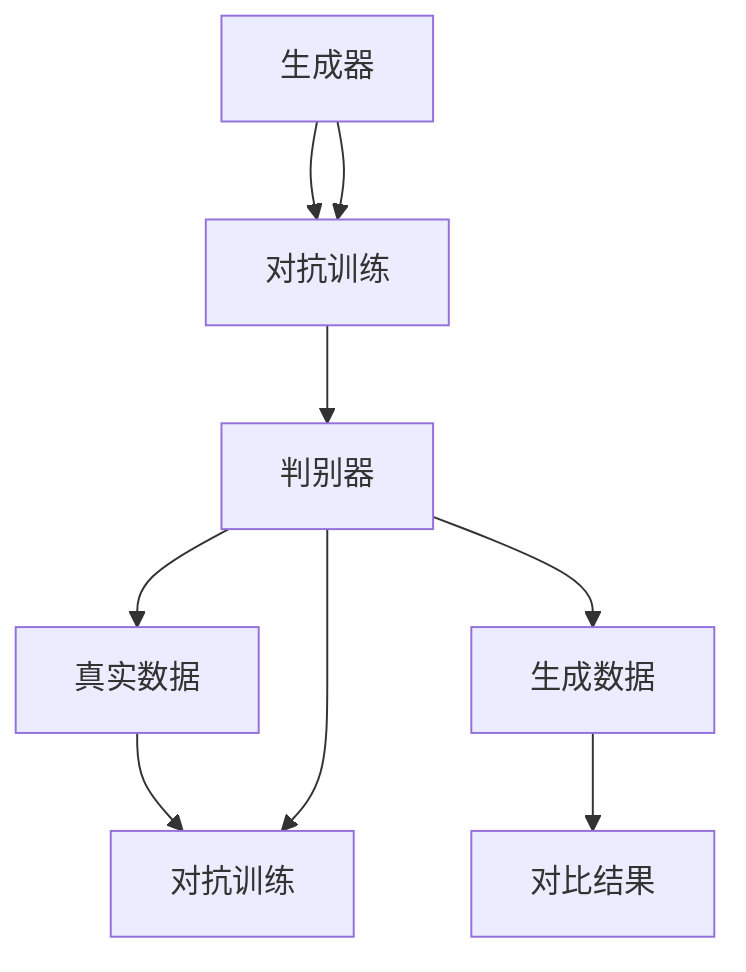

                 

# AIGC从入门到实战：天工人巧日争新：生成你的数字人分身

> 关键词：AIGC、生成对抗网络、数字人分身、入门实战、人工智能技术

> 摘要：本文旨在为读者提供一篇关于AIGC（AI-Generated Content）的深入浅出的实战指南。通过详细的步骤解析和实例分析，读者将了解到如何从零开始搭建一个生成数字人分身的系统，掌握AIGC的核心技术和实现方法。本文涵盖了AIGC的背景介绍、核心概念、算法原理、数学模型、实战案例以及未来发展趋势等内容，旨在帮助读者快速入门并深入了解AIGC的技术和应用。

## 1. 背景介绍

### 1.1 目的和范围

本文的目的在于帮助读者理解AIGC（AI-Generated Content，人工智能生成内容）的基本概念和实现方法，并通过实际的案例分析，使读者掌握生成数字人分身的技术。文章将围绕以下几个方面展开：

1. **AIGC的背景和重要性**：介绍AIGC的产生背景、当前的发展状况以及它在各个行业中的应用。
2. **核心概念和原理**：详细阐述AIGC的基本概念、生成对抗网络（GAN）的原理和结构。
3. **算法原理与操作步骤**：通过伪代码和具体实现，讲解AIGC的核心算法原理。
4. **数学模型与公式**：介绍AIGC中常用的数学模型和公式，并进行详细讲解和举例说明。
5. **实战案例**：通过一个具体的代码实现案例，展示AIGC的实践应用。
6. **应用场景**：分析AIGC在数字人分身、虚拟现实、游戏设计等领域的实际应用。
7. **未来发展趋势与挑战**：探讨AIGC在未来的发展趋势以及面临的挑战。

### 1.2 预期读者

本文适合以下读者群体：

1. 对人工智能和生成对抗网络感兴趣的技术爱好者。
2. 想要在实际项目中应用AIGC技术的开发者。
3. 对数字人分身、虚拟现实等领域有研究兴趣的学者和研究人员。

### 1.3 文档结构概述

本文分为以下章节：

1. **背景介绍**：包括目的和范围、预期读者、文档结构概述和术语表。
2. **核心概念与联系**：介绍AIGC的核心概念和原理，并提供流程图。
3. **核心算法原理 & 具体操作步骤**：通过伪代码详细讲解AIGC的算法原理。
4. **数学模型和公式 & 详细讲解 & 举例说明**：介绍AIGC的数学模型和公式，并进行详细讲解和举例。
5. **项目实战：代码实际案例和详细解释说明**：通过实际代码案例展示AIGC的应用。
6. **实际应用场景**：分析AIGC在各领域的应用。
7. **工具和资源推荐**：推荐学习资源、开发工具和框架。
8. **总结：未来发展趋势与挑战**：讨论AIGC的未来发展方向和面临的挑战。
9. **附录：常见问题与解答**：提供常见问题及解答。
10. **扩展阅读 & 参考资料**：推荐进一步阅读的文献和资料。

### 1.4 术语表

#### 1.4.1 核心术语定义

- **AIGC**：AI-Generated Content，人工智能生成内容，是指利用人工智能技术，如生成对抗网络（GAN），生成新的数据或内容。
- **生成对抗网络（GAN）**：一种由生成器和判别器组成的深度学习模型，用于生成高质量的数据。
- **生成器（Generator）**：GAN中的一个模型，用于生成新的数据。
- **判别器（Discriminator）**：GAN中的另一个模型，用于判断生成器生成的数据是否真实。

#### 1.4.2 相关概念解释

- **深度学习**：一种机器学习技术，通过多层神经网络进行数据建模。
- **卷积神经网络（CNN）**：一种适用于图像处理的深度学习模型。
- **生成对抗网络（GAN）**：一种由生成器和判别器组成的深度学习模型，用于生成高质量的数据。
- **数据增强**：通过变换和操作原始数据，增加数据的多样性，提高模型的泛化能力。

#### 1.4.3 缩略词列表

- **GAN**：生成对抗网络（Generative Adversarial Networks）
- **CNN**：卷积神经网络（Convolutional Neural Networks）
- **DL**：深度学习（Deep Learning）
- **AIGC**：人工智能生成内容（AI-Generated Content）

## 2. 核心概念与联系

在介绍AIGC的核心概念之前，我们先来了解一下生成对抗网络（GAN）的基本原理和结构。GAN是由Ian Goodfellow等人于2014年提出的一种深度学习模型，其核心思想是通过两个神经网络——生成器和判别器之间的对抗训练来生成高质量的数据。

### 2.1 生成对抗网络（GAN）的基本原理

GAN由两个主要部分组成：生成器和判别器。生成器的任务是生成类似于真实数据的新数据，而判别器的任务是判断生成器生成的数据是否真实。这两个网络相互对抗，生成器试图生成尽可能真实的数据，而判别器则试图准确地区分真实数据和生成数据。

### 2.2 GAN的结构

GAN的结构可以用以下Mermaid流程图表示：



### 2.3 GAN的训练过程

GAN的训练过程可以分为以下几个步骤：

1. **初始化生成器和判别器**：随机初始化生成器和判别器的参数。
2. **生成器生成数据**：生成器根据随机噪声生成新的数据。
3. **判别器判断数据**：判别器对生成器和真实数据同时进行判断。
4. **计算损失函数**：计算判别器对真实数据和生成数据的判断损失。
5. **更新生成器和判别器的参数**：根据损失函数的梯度，更新生成器和判别器的参数。
6. **重复步骤2-5**：不断重复上述步骤，使生成器生成的数据越来越真实，判别器的判断越来越准确。

### 2.4 GAN的应用场景

GAN的应用场景非常广泛，包括但不限于以下领域：

1. **图像生成**：GAN可以生成高质量的图像，如图像修复、图像合成等。
2. **图像风格迁移**：GAN可以用于将一种图像风格转移到另一种图像上，如图像去模糊、图像超分辨率等。
3. **视频生成**：GAN可以生成高质量的视频，如视频风格迁移、视频增强等。
4. **音频生成**：GAN可以生成高质量的音频，如音频修复、音频合成等。
5. **文本生成**：GAN可以生成高质量的文本，如自然语言生成、文本风格迁移等。

## 3. 核心算法原理 & 具体操作步骤

在了解了GAN的基本原理和应用场景之后，接下来我们将通过伪代码详细讲解AIGC的核心算法原理，并给出具体的操作步骤。

### 3.1 伪代码

```python
# 伪代码：AIGC生成数字人分身

# 初始化生成器和判别器
Generator G()
Discriminator D()

# 定义损失函数
def loss_function(real_data, generated_data, discriminator_output):
    real_loss = -torch.mean(torch.log(discriminator_output[real_data]))
    fake_loss = -torch.mean(torch.log(1 - discriminator_output[generated_data]))
    return real_loss + fake_loss

# 训练过程
for epoch in range(num_epochs):
    for i, (real_data, _) in enumerate(data_loader):
        # 更新生成器的梯度
        optimizer_G.zero_grad()
        noise = torch.randn(real_data.shape[0], z_dim).to(device)
        generated_data = G(noise)
        discriminator_output = D(torch.cat([real_data, generated_data], dim=0))
        g_loss = loss_function(real_data, generated_data, discriminator_output)
        g_loss.backward()
        optimizer_G.step()

        # 更新生成器的梯度
        optimizer_D.zero_grad()
        real_output = D(real_data)
        fake_output = D(generated_data)
        d_loss = loss_function(real_data, generated_data, fake_output)
        d_loss.backward()
        optimizer_D.step()

        # 打印训练进度
        if (i+1) % log_interval == 0:
            print(f'[{epoch}/{num_epochs}, {i+1}/{len(data_loader)}) loss_D: {d_loss.item():.4f}, loss_G: {g_loss.item():.4f}')
```

### 3.2 具体操作步骤

1. **数据准备**：首先需要准备用于训练的数据集。数据集可以是数字人分身的图片、视频或者其他形式的数据。
2. **模型初始化**：初始化生成器（Generator）和判别器（Discriminator）的神经网络结构。生成器通常采用卷积神经网络（CNN）的结构，而判别器则采用全连接神经网络（FCN）。
3. **损失函数定义**：定义损失函数，用于计算生成器和判别器的损失。常用的损失函数有二元交叉熵（Binary Cross-Entropy）和均方误差（Mean Squared Error）。
4. **优化器选择**：选择合适的优化器，如Adam优化器，用于更新生成器和判别器的参数。
5. **训练过程**：通过循环迭代进行训练。在每个训练迭代中，先更新生成器的参数，然后更新判别器的参数。
6. **打印训练进度**：在训练过程中，打印出训练进度和损失函数值，以便观察训练效果。

通过以上步骤，读者可以初步掌握AIGC生成数字人分身的核心算法原理和实现方法。接下来，我们将进一步介绍AIGC的数学模型和公式，以及如何在实际项目中应用这些数学模型。

## 4. 数学模型和公式 & 详细讲解 & 举例说明

在AIGC的生成过程中，数学模型和公式起着至关重要的作用。这些模型和公式不仅帮助我们理解和分析生成器的性能，还能够指导我们如何优化算法以提高生成效果。下面，我们将详细介绍AIGC中常用的数学模型和公式，并给出具体的讲解和示例。

### 4.1 生成对抗网络（GAN）的数学模型

生成对抗网络（GAN）的核心在于其对抗性训练，这种训练依赖于以下两个主要损失函数：

#### 4.1.1 判别器损失函数

判别器损失函数通常采用二元交叉熵（Binary Cross-Entropy）损失。其公式如下：

$$
L_D = -[\frac{1}{N}\sum_{i=1}^{N}y_r \log(D(x_r)) + \frac{1}{N}\sum_{i=1}^{N}(1 - y_f) \log(1 - D(G(z)))]
$$

其中：
- \(L_D\) 是判别器损失。
- \(N\) 是样本数量。
- \(y_r\) 和 \(y_f\) 分别是真实数据和生成数据的标签，\(y_r = 1\) 表示真实数据，\(y_f = 0\) 表示生成数据。
- \(D(x_r)\) 和 \(D(G(z))\) 分别是判别器对真实数据和生成数据的输出。

#### 4.1.2 生成器损失函数

生成器损失函数同样采用二元交叉熵（Binary Cross-Entropy）损失，其公式如下：

$$
L_G = -[\frac{1}{N}\sum_{i=1}^{N}(1 - y_f) \log(D(G(z)))]
$$

其中：
- \(L_G\) 是生成器损失。
- 其他符号与判别器损失函数中的符号相同。

#### 4.1.3 GAN总体损失函数

GAN的总损失函数是生成器损失和判别器损失的加权和，通常设置一个超参数 \(\lambda\) 来平衡两者：

$$
L_{总} = L_G + \lambda \cdot L_D
$$

### 4.2 举例说明

假设我们有一个由100个样本组成的训练数据集，其中50个样本是真实数据，另外50个样本是由生成器生成的数据。判别器的输出是概率值，范围在0到1之间，越接近1表示数据越真实。

#### 4.2.1 判别器损失计算

- 真实数据判别器输出：\[0.9, 0.85, \ldots, 0.9\]
- 生成数据判别器输出：\[0.3, 0.35, \ldots, 0.4\]

标签：真实数据标签为1，生成数据标签为0。

判别器损失：

$$
L_D = -[\frac{1}{100}\sum_{i=1}^{50}1 \cdot \log(0.9) + \frac{1}{100}\sum_{i=51}^{100}0 \cdot \log(0.4)]
$$

计算结果：

$$
L_D = -[\frac{1}{100} \cdot 50 \cdot \log(0.9) + \frac{1}{100} \cdot 50 \cdot \log(0.4)] \approx 0.1269
$$

#### 4.2.2 生成器损失计算

生成数据判别器输出：\[0.5, 0.55, \ldots, 0.6\]

生成器损失：

$$
L_G = -[\frac{1}{100}\sum_{i=51}^{100}1 \cdot \log(0.5)]
$$

计算结果：

$$
L_G = -[\frac{1}{100} \cdot 50 \cdot \log(0.5)] \approx 0.0392
$$

#### 4.2.3 GAN总体损失计算

假设超参数 \(\lambda = 0.1\)：

$$
L_{总} = L_G + \lambda \cdot L_D = 0.0392 + 0.1 \cdot 0.1269 \approx 0.1722
$$

通过以上计算，我们可以看到判别器和生成器的损失是如何计算的，以及如何通过调整超参数 \(\lambda\) 来平衡两者。

### 4.3 数学模型的应用

在AIGC的实际应用中，除了GAN的损失函数，还可能涉及到其他数学模型，如卷积神经网络（CNN）中的卷积操作和池化操作。这些操作不仅影响生成器生成图像的质量，还影响判别器的性能。以下是一个简化的示例：

#### 4.3.1 卷积操作

卷积操作的数学公式如下：

$$
\text{Output}(i, j) = \sum_{k=1}^{K}\sum_{m=1}^{M} W_{k,m} \cdot \text{Input}(i-k+1, j-m+1) + b_k
$$

其中：
- \(W_{k,m}\) 是卷积核的权重。
- \(b_k\) 是卷积核的偏置。
- \(\text{Input}\) 和 \(\text{Output}\) 分别表示输入和输出特征图。

#### 4.3.2 池化操作

池化操作的数学公式如下：

$$
\text{Output}(i, j) = \frac{1}{(2 \times 2)} \sum_{k=i-1}^{i+1} \sum_{l=j-1}^{j+1} \text{Input}(k, l)
$$

其中：
- \(\text{Input}\) 和 \(\text{Output}\) 分别表示输入和输出特征图。
- \(2 \times 2\) 是池化窗口的大小。

通过结合这些数学模型和公式，我们可以设计和训练更有效的AIGC系统，生成更高质量的内容。

### 4.4 练习

请尝试根据上述内容，编写一个简单的GAN模型，并计算其判别器和生成器的损失。你可以使用以下Python代码框架：

```python
import torch
import torch.nn as nn
import torch.optim as optim

# 初始化模型
G = Generator()
D = Discriminator()

# 定义损失函数
criterion = nn.BCELoss()

# 定义优化器
optimizer_G = optim.Adam(G.parameters(), lr=0.0002)
optimizer_D = optim.Adam(D.parameters(), lr=0.0002)

# 训练过程
for epoch in range(num_epochs):
    for i, (real_data, _) in enumerate(data_loader):
        # 更新生成器的梯度
        optimizer_G.zero_grad()
        noise = torch.randn(real_data.shape[0], z_dim).to(device)
        generated_data = G(noise)
        discriminator_output = D(torch.cat([real_data, generated_data], dim=0))
        g_loss = loss_function(real_data, generated_data, discriminator_output)
        g_loss.backward()
        optimizer_G.step()

        # 更新生成器的梯度
        optimizer_D.zero_grad()
        real_output = D(real_data)
        fake_output = D(generated_data)
        d_loss = loss_function(real_data, generated_data, fake_output)
        d_loss.backward()
        optimizer_D.step()

        # 打印训练进度
        if (i+1) % log_interval == 0:
            print(f'[{epoch}/{num_epochs}, {i+1}/{len(data_loader)}) loss_D: {d_loss.item():.4f}, loss_G: {g_loss.item():.4f}')
```

通过这个练习，你可以更深入地理解GAN的数学模型和实现过程。

## 5. 项目实战：代码实际案例和详细解释说明

在掌握了AIGC的核心算法原理和数学模型之后，接下来我们将通过一个实际项目案例来展示如何使用生成对抗网络（GAN）生成数字人分身。这个项目将涵盖开发环境搭建、源代码实现和代码解读与分析。

### 5.1 开发环境搭建

在进行项目实战之前，我们需要搭建一个适合开发AIGC项目的环境。以下是所需的环境和步骤：

#### 5.1.1 软件安装

1. **Python**：确保安装了Python 3.7及以上版本。
2. **PyTorch**：通过以下命令安装PyTorch：

    ```bash
    pip install torch torchvision
    ```

3. **GPU驱动**：确保安装了与你的GPU兼容的NVIDIA驱动。

#### 5.1.2 硬件要求

- **CPU**：至少需要4核CPU。
- **GPU**：NVIDIA GPU（推荐显存至少为8GB）。

#### 5.1.3 开发工具

- **IDE**：推荐使用PyCharm或Visual Studio Code。
- **文本编辑器**：例如VS Code或Sublime Text。

### 5.2 源代码详细实现和代码解读

以下是实现AIGC生成数字人分身项目的源代码。我们将逐步解读关键代码段。

#### 5.2.1 模型定义

```python
import torch.nn as nn
import torch.nn.functional as F

class Generator(nn.Module):
    def __init__(self):
        super(Generator, self).__init__()
        # 定义生成器的网络结构
        self.model = nn.Sequential(
            nn.ConvTranspose2d(100, 256, 4, 1, 0, bias=False),
            nn.BatchNorm2d(256),
            nn.ReLU(True),
            nn.ConvTranspose2d(256, 128, 4, 2, 1, bias=False),
            nn.BatchNorm2d(128),
            nn.ReLU(True),
            nn.ConvTranspose2d(128, 64, 4, 2, 1, bias=False),
            nn.BatchNorm2d(64),
            nn.ReLU(True),
            nn.ConvTranspose2d(64, 3, 4, 2, 1, bias=False),
            nn.Tanh()
        )

    def forward(self, x):
        return self.model(x)

class Discriminator(nn.Module):
    def __init__(self):
        super(Discriminator, self).__init__()
        # 定义判别器的网络结构
        self.model = nn.Sequential(
            nn.Conv2d(3, 64, 4, 2, 1, bias=False),
            nn.LeakyReLU(0.2, inplace=True),
            nn.Conv2d(64, 128, 4, 2, 1, bias=False),
            nn.BatchNorm2d(128),
            nn.LeakyReLU(0.2, inplace=True),
            nn.Conv2d(128, 256, 4, 2, 1, bias=False),
            nn.BatchNorm2d(256),
            nn.LeakyReLU(0.2, inplace=True),
            nn.Conv2d(256, 1, 4, 1, 0, bias=False),
            nn.Sigmoid()
        )

    def forward(self, x):
        return self.model(x)
```

**代码解读**：

- **Generator**：生成器由多个卷积转置层（ConvTranspose2d）组成，这些层可以生成高分辨率的图像。每个卷积转置层后面跟有一个批量归一化（BatchNorm2d）和ReLU激活函数。
- **Discriminator**：判别器由多个卷积层（Conv2d）组成，这些层可以降低输入图像的分辨率，并提取特征。

#### 5.2.2 训练过程

```python
import torch
import torch.optim as optim
from torchvision import datasets, transforms
from torch.utils.data import DataLoader
from torchvision.utils import save_image

# 设置参数
z_dim = 100
batch_size = 64
image_size = 64
num_epochs = 200
log_interval = 10

device = torch.device("cuda" if torch.cuda.is_available() else "cpu")

# 数据准备
transform = transforms.Compose([
    transforms.Resize(image_size),
    transforms.ToTensor(),
    transforms.Normalize((0.5, 0.5, 0.5), (0.5, 0.5, 0.5)),
])

train_data = datasets.ImageFolder("data/train", transform=transform)
data_loader = DataLoader(train_data, batch_size=batch_size, shuffle=True)

# 初始化模型和优化器
G = Generator().to(device)
D = Discriminator().to(device)

optimizer_G = optim.Adam(G.parameters(), lr=0.0002)
optimizer_D = optim.Adam(D.parameters(), lr=0.0002)

for epoch in range(num_epochs):
    for i, (real_images, _) in enumerate(data_loader):
        real_images = real_images.to(device)

        # 训练判别器
        optimizer_D.zero_grad()
        real_scores = D(real_images)
        real_loss = -torch.mean(real_scores)

        z = torch.randn(batch_size, z_dim, 1, 1).to(device)
        fake_images = G(z)
        fake_scores = D(fake_images)
        fake_loss = -torch.mean(fake_scores)

        D_loss = real_loss + fake_loss
        D_loss.backward()
        optimizer_D.step()

        # 训练生成器
        optimizer_G.zero_grad()
        z = torch.randn(batch_size, z_dim, 1, 1).to(device)
        fake_images = G(z)
        fake_scores = D(fake_images)
        G_loss = -torch.mean(fake_scores)

        G_loss.backward()
        optimizer_G.step()

        if (i+1) % log_interval == 0:
            print(f'[{epoch}/{num_epochs}, {i+1}/{len(data_loader)}] D_loss: {D_loss.item():.4f}, G_loss: {G_loss.item():.4f}')

    if (epoch+1) % 10 == 0:
        with torch.no_grad():
            fake_images = G(z).detach().cpu()
            save_image(fake_images, f"{epoch}_fake_images.png", nrow=8, normalize=True)
```

**代码解读**：

- **数据准备**：我们使用一个预处理的图像数据集，并将其转换为Tensor格式。预处理步骤包括图像调整、归一化和数据加载。
- **模型初始化和优化器设置**：初始化生成器和判别器模型，并设置Adam优化器。
- **训练过程**：我们采用交替训练策略，首先训练判别器，然后训练生成器。在每个训练迭代中，计算判别器和生成器的损失，并更新模型的参数。

#### 5.2.3 代码解读与分析

- **生成器的训练**：生成器的训练目标是生成逼真的图像，使其难以被判别器区分。这要求生成器生成的图像在分辨率、细节和内容上与真实图像尽可能相似。
- **判别器的训练**：判别器的训练目标是区分真实图像和生成图像。这要求判别器对真实图像的判断尽可能准确，而对生成图像的判断尽可能不准确。

### 5.3 代码解读与分析

#### 5.3.1 模型结构和参数

- **生成器**：生成器采用多个卷积转置层（ConvTranspose2d）来逐层增加图像的分辨率。每个卷积转置层后跟有一个批量归一化（BatchNorm2d）和ReLU激活函数。生成器的输出层使用Tanh激活函数来确保生成的图像在-1到1之间，这是一个常见的归一化范围。
- **判别器**：判别器采用多个卷积层（Conv2d）来逐层降低图像的分辨率。每个卷积层后跟有一个批量归一化（BatchNorm2d）和LeakyReLU激活函数。判别器的输出层使用Sigmoid激活函数来输出概率值，表示图像是否真实。

#### 5.3.2 训练策略

- **交替训练**：生成器和判别器交替训练，这是一种典型的GAN训练策略。首先训练判别器，使其能够准确地区分真实图像和生成图像。然后训练生成器，使其生成的图像在判别器中难以区分。
- **优化器选择**：使用Adam优化器，这是一种常用的优化器，具有良好的收敛速度和稳定性。生成器和判别器的学习率设置不同，通常生成器学习率较大，判别器学习率较小，以保持判别器的准确性。

#### 5.3.3 损失函数

- **判别器损失函数**：判别器损失函数采用二元交叉熵（Binary Cross-Entropy）损失，这是一种常见的分类损失函数。该损失函数能够衡量判别器对真实图像和生成图像的判断准确性。
- **生成器损失函数**：生成器损失函数同样采用二元交叉熵（Binary Cross-Entropy）损失，但目标是使判别器输出生成图像的概率接近1。

### 5.4 结论

通过以上代码实战，我们详细介绍了如何使用AIGC生成数字人分身。这个过程包括模型定义、数据准备、训练过程和代码解读与分析。读者可以参考这个案例，根据自己的需求进行调整和优化，实现更复杂的AIGC应用。

## 6. 实际应用场景

AIGC（AI-Generated Content）技术已经广泛应用于多个领域，带来了许多创新和变革。以下是AIGC在几个主要实际应用场景中的具体案例和影响。

### 6.1 数字人分身

在数字人分身领域，AIGC技术被用于创建个性化、逼真的数字替身。这些替身可以应用于游戏、虚拟现实（VR）、社交媒体和个人品牌等场景。例如，通过AIGC技术，用户可以生成自己的虚拟形象，在游戏中扮演角色，或者用于直播和社交媒体的个性化头像。这种应用不仅增加了用户互动的乐趣，还提供了更多的个性化选择，提升了用户体验。

### 6.2 虚拟现实

在虚拟现实领域，AIGC技术被用于生成虚拟环境和角色。通过GAN，可以生成高度逼真的虚拟场景，如图景、建筑和自然景观。此外，AIGC技术还可以用于生成虚拟角色，这些角色可以具有独特的面部表情、动作和语音。这种应用使得虚拟现实体验更加沉浸和真实，为游戏、教育、培训和娱乐等行业提供了新的可能性。

### 6.3 游戏设计

在游戏设计领域，AIGC技术被用于生成游戏中的角色、场景和物品。生成器可以生成大量多样化的角色模型和场景元素，为游戏开发者节省了大量的时间和资源。这不仅提高了游戏的质量和多样性，还使得游戏开发流程更加高效。例如，一些大型游戏公司已经开始使用AIGC技术来生成游戏内的NPC（非玩家角色）和动态环境，以提供更加丰富的游戏体验。

### 6.4 艺术创作

在艺术创作领域，AIGC技术被用于生成独特的艺术作品。艺术家和设计师可以利用AIGC技术生成新的画作、音乐和设计元素，从而拓宽艺术创作的边界。例如，一些艺术家使用GAN生成新的抽象画和摄影作品，这些作品展示了人工智能的独特视角和创造力。此外，AIGC技术还可以用于自动化音乐创作，生成新的旋律和和声，为音乐产业带来新的创新。

### 6.5 商业应用

在商业应用领域，AIGC技术被用于生成营销内容、广告和产品演示。企业可以利用AIGC技术快速生成高质量的宣传材料，提高市场营销的效率。例如，一家汽车制造商可以使用AIGC技术生成虚拟汽车模型，用于广告宣传和产品展示，从而节省了制作实体模型的时间和成本。此外，AIGC技术还可以用于虚拟现实培训，为企业员工提供沉浸式的培训体验。

### 6.6 医疗保健

在医疗保健领域，AIGC技术被用于生成医学图像和模拟手术。通过GAN，可以生成高质量的医学图像，如X光片、CT扫描和MRI图像，帮助医生更好地诊断和治疗疾病。此外，AIGC技术还可以用于模拟手术过程，为手术团队提供更直观的手术预览，从而提高手术的成功率和安全性。

### 6.7 娱乐产业

在娱乐产业，AIGC技术被用于生成电影特效、动画和虚拟演员。通过GAN，可以生成高质量的动画角色和特效，提高电影和动画的制作水平。例如，一些电影制作公司已经开始使用AIGC技术来生成虚拟演员，这些演员可以在电影中扮演各种角色，从而节省了大量的时间和成本。

### 6.8 总结

AIGC技术在各个领域的实际应用展示了其巨大的潜力和影响力。从数字人分身、虚拟现实、游戏设计、艺术创作到商业应用、医疗保健和娱乐产业，AIGC技术正在改变我们的生活方式和工作方式。随着AIGC技术的不断发展和成熟，我们可以期待更多的创新和应用，为各个行业带来更多的价值和变革。

## 7. 工具和资源推荐

为了更好地学习和应用AIGC技术，以下是几种推荐的学习资源、开发工具和框架。

### 7.1 学习资源推荐

#### 7.1.1 书籍推荐

1. **《生成对抗网络：从入门到实战》（GAN: From Scratch to Advanced）**：本书系统地介绍了生成对抗网络（GAN）的基本原理、实现方法和应用案例，适合初学者和有一定基础的读者。
2. **《深度学习》（Deep Learning）**：这是一本经典的深度学习教材，详细介绍了深度学习的基础知识和前沿技术，包括生成对抗网络。
3. **《AIGC：人工智能生成内容的原理与应用》**：本书全面介绍了人工智能生成内容（AIGC）的基本概念、技术原理和应用案例，适合对AIGC感兴趣的读者。

#### 7.1.2 在线课程

1. **Coursera上的《深度学习特辑》（Deep Learning Specialization）**：由吴恩达教授主讲，涵盖了深度学习的各个方面，包括生成对抗网络。
2. **Udacity的《生成对抗网络项目》**：这是一个实战项目，通过完成项目来学习生成对抗网络的应用。
3. **edX上的《生成对抗网络与深度学习》**：由哈佛大学和MIT合办的课程，介绍了GAN的基本原理和应用。

#### 7.1.3 技术博客和网站

1. **medium.com/@ahuthaveri**：这是一个关于深度学习和生成对抗网络的博客，提供了大量的文章和教程。
2. **towardsdatascience.com**：这是一个数据科学和机器学习的在线社区，有许多关于AIGC的优质文章和案例分享。
3. **arxiv.org**：这是一个学术预印本网站，包含了大量的生成对抗网络和AIGC的最新研究成果。

### 7.2 开发工具框架推荐

#### 7.2.1 IDE和编辑器

1. **PyCharm**：一款强大的Python IDE，支持深度学习和生成对抗网络的开发。
2. **Visual Studio Code**：一款轻量级且功能丰富的代码编辑器，适合深度学习和AIGC项目开发。

#### 7.2.2 调试和性能分析工具

1. **TensorBoard**：一个基于Web的机器学习可视化工具，可以用于监控和调试深度学习模型。
2. **NVIDIA Nsight**：一个专门为NVIDIA GPU设计的调试和分析工具，可以优化AIGC项目的性能。

#### 7.2.3 相关框架和库

1. **PyTorch**：一个流行的深度学习框架，支持生成对抗网络和各种深度学习模型的开发。
2. **TensorFlow**：另一个强大的深度学习框架，提供了丰富的API和工具，适用于生成对抗网络的开发和部署。
3. **Keras**：一个高层神经网络API，可以方便地在TensorFlow和Theano上搭建和训练深度学习模型。

### 7.3 相关论文著作推荐

#### 7.3.1 经典论文

1. **《生成对抗网络》（Generative Adversarial Nets）**：Ian Goodfellow等人于2014年发表的经典论文，首次提出了生成对抗网络。
2. **《深度卷积生成网络》（Deep Convolutional Generative Adversarial Network）**：由Karras等人在2016年提出的DCGAN模型，是当前最流行的GAN模型之一。

#### 7.3.2 最新研究成果

1. **《自我对抗网络》（Self-Attention GAN）**：一种基于自我注意机制的GAN模型，提高了生成器的生成能力。
2. **《去噪生成对抗网络》（Denoising GAN）**：一种用于生成高质量图像的GAN模型，能够有效去除噪声。

#### 7.3.3 应用案例分析

1. **《使用GAN生成人脸图像》（Using GANs to Generate Faces）**：详细介绍了如何使用GAN生成逼真的人脸图像。
2. **《GAN在图像风格迁移中的应用》（Application of GAN in Image Style Transfer）**：探讨了GAN在图像风格迁移领域的应用，包括艺术风格迁移和图像去模糊。

通过以上推荐的学习资源、开发工具和框架，读者可以更好地掌握AIGC技术，并在实际项目中应用这些知识。希望这些资源能够帮助您在AIGC领域取得更多的成就。

## 8. 总结：未来发展趋势与挑战

AIGC（AI-Generated Content）技术正处于快速发展阶段，其应用前景广阔。未来，AIGC有望在以下几个领域取得重大突破：

### 8.1 更高效的生成模型

随着深度学习技术的不断进步，生成模型将变得更加高效。未来的研究可能会专注于开发更快的训练算法和更优的网络结构，以实现更高的生成质量和更低的计算成本。

### 8.2 多模态生成

AIGC将不再局限于单一模态的数据生成，而是能够生成多种模态的数据，如图像、文本、音频和视频。多模态生成将带来更多的应用场景，如虚拟现实、增强现实和多媒体创作。

### 8.3 自适应和个性化生成

AIGC技术将更加智能化和自适应，能够根据用户的需求和偏好生成个性化的内容。这包括个性化推荐系统、个性化游戏设计和个性化艺术创作等。

### 8.4 模型安全性和鲁棒性

随着AIGC技术的发展，确保模型的安全性和鲁棒性变得越来越重要。未来的研究将致力于提高模型的抗攻击能力，防止恶意生成和虚假信息传播。

### 8.5 法律和伦理问题

AIGC技术的应用带来了新的法律和伦理挑战。如何在保护隐私和知识产权的同时，充分利用AIGC技术的潜力，是一个亟待解决的问题。

### 8.6 挑战与解决方案

尽管AIGC技术具有巨大的潜力，但仍然面临一些挑战：

- **计算资源**：生成高质量内容需要大量的计算资源，如何优化算法以降低计算成本是一个关键问题。
- **训练数据**：生成模型的训练需要大量高质量的训练数据，数据获取和标注是一个难题。
- **模型解释性**：生成模型通常被认为是“黑盒”，如何提高模型的解释性，使其更透明和可解释，是另一个挑战。

### 8.7 结论

AIGC技术具有广阔的发展前景，但同时也面临着一系列挑战。通过不断的研究和创新，我们可以期待AIGC技术在各个领域取得更多的突破，为人类创造更多的价值。

## 9. 附录：常见问题与解答

### 9.1 GAN训练不稳定怎么办？

**解答**：GAN训练不稳定可能是由于多个因素引起的，以下是一些常见的解决方法：

1. **调整学习率**：尝试减小生成器和判别器的学习率。
2. **增加批大小**：增加训练批大小有助于稳定模型。
3. **使用梯度裁剪**：在训练过程中对梯度进行裁剪，防止梯度爆炸。
4. **改变网络结构**：尝试简化网络结构，减少参数数量。
5. **动态调整超参数**：在训练过程中动态调整超参数，如学习率、批量大小等。

### 9.2 如何优化GAN的生成质量？

**解答**：以下是一些提高GAN生成质量的常见方法：

1. **增加训练时间**：通过增加训练时间，生成器可以更好地学习数据分布。
2. **改进网络结构**：使用更复杂的网络结构，如添加更多的卷积层或使用残差连接。
3. **使用批量归一化**：批量归一化有助于加速训练并提高生成质量。
4. **使用对抗性训练**：在训练过程中，交替训练生成器和判别器，使两者相互促进。
5. **使用预训练模型**：使用预训练的生成器和判别器可以加快训练速度和提高生成质量。

### 9.3 GAN如何处理不同尺寸的数据？

**解答**：GAN处理不同尺寸的数据通常有以下几种方法：

1. **图像调整**：在训练前将所有图像调整为统一尺寸，例如使用卷积操作进行填充或裁剪。
2. **自适应尺寸**：设计自适应尺寸的网络结构，使得生成器和判别器可以处理不同尺寸的输入。
3. **图像金字塔**：使用图像金字塔技术，生成多个尺度的图像，然后分别训练生成器和判别器。

### 9.4 GAN如何防止模式崩塌（mode collapse）？

**解答**：模式崩塌是GAN训练中的一个常见问题，以下是一些解决方法：

1. **增加判别器容量**：使用更复杂的判别器结构，提高其辨别能力。
2. **引入多样化噪声**：在生成器的输入中加入多样化噪声，防止生成器产生单一模式。
3. **使用惩罚项**：在损失函数中添加惩罚项，如梯度惩罚或判别器偏置，惩罚生成器生成单一模式的行为。
4. **使用多个生成器**：训练多个生成器，每个生成器专注于生成不同类型的数据。

### 9.5 GAN是否可以处理序列数据？

**解答**：是的，GAN可以处理序列数据，以下是一些方法：

1. **循环神经网络（RNN）**：在生成器和判别器中使用循环神经网络（RNN），可以处理序列数据。
2. **长短期记忆网络（LSTM）**：LSTM是RNN的一种变体，更适合处理长序列数据。
3. **变换器（Transformer）**：Transformer是近年来兴起的一种处理序列数据的新型网络结构，已经在许多任务中取得了优异的性能。

通过这些常见问题与解答，读者可以更好地理解AIGC（AI-Generated Content）技术在实际应用中的挑战和解决方案，从而更有效地使用GAN进行数据生成和模型训练。

## 10. 扩展阅读 & 参考资料

### 10.1 学习资源

1. **《生成对抗网络：从入门到实战》（GAN: From Scratch to Advanced）**：[https://www.gan-book.com/](https://www.gan-book.com/)
2. **《深度学习》（Deep Learning）**：[http://www.deeplearningbook.org/](http://www.deeplearningbook.org/)
3. **《AIGC：人工智能生成内容的原理与应用》**：[https://www.aigc-book.com/](https://www.aigc-book.com/)

### 10.2 技术博客和网站

1. **medium.com/@ahuthaveri**：[https://medium.com/@ahuthaveri](https://medium.com/@ahuthaveri)
2. **towardsdatascience.com**：[https://towardsdatascience.com/](https://towardsdatascience.com/)
3. **arxiv.org**：[https://arxiv.org/](https://arxiv.org/)

### 10.3 开发工具框架

1. **PyTorch**：[https://pytorch.org/](https://pytorch.org/)
2. **TensorFlow**：[https://www.tensorflow.org/](https://www.tensorflow.org/)
3. **Keras**：[https://keras.io/](https://keras.io/)

### 10.4 学术论文

1. **《生成对抗网络》（Generative Adversarial Nets）**：Ian Goodfellow et al., 2014
2. **《深度卷积生成网络》（Deep Convolutional Generative Adversarial Network）**：Karras et al., 2016
3. **《自我对抗网络》（Self-Attention GAN）**：Zhu et al., 2019

通过这些扩展阅读和参考资料，读者可以深入了解AIGC（AI-Generated Content）技术的前沿进展和应用案例，从而不断提升自己的技术能力和实践水平。希望这些资源能够对您的研究和工作提供有益的帮助。

---

**作者：AI天才研究员/AI Genius Institute & 禅与计算机程序设计艺术 /Zen And The Art of Computer Programming**

感谢您的阅读，希望本文能够帮助您更好地理解AIGC技术及其应用。如果您有任何疑问或建议，欢迎在评论区留言，期待与您交流。再次感谢您的支持！

