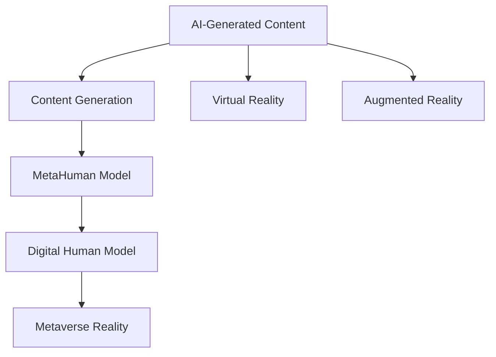
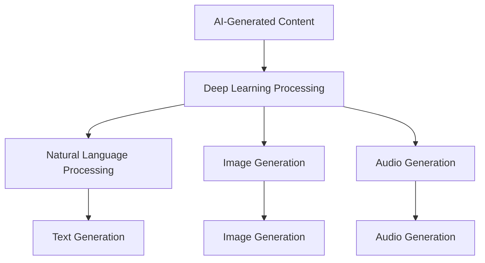
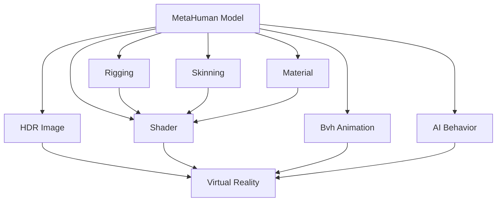
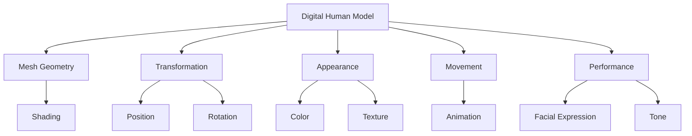
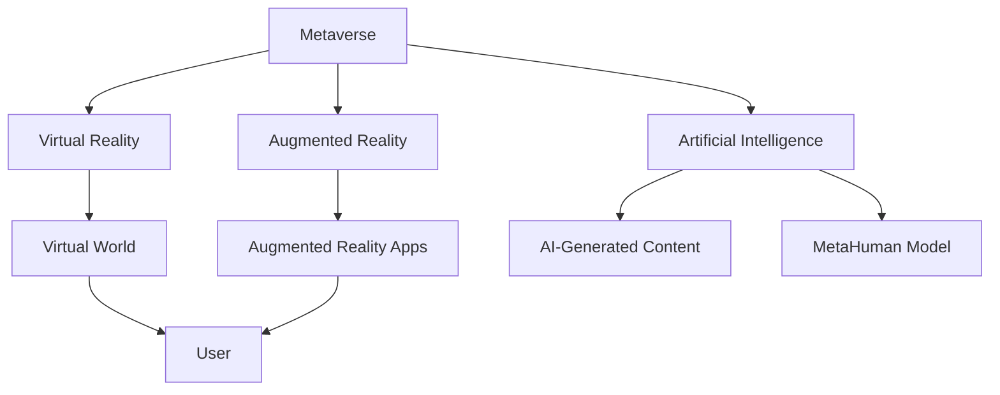

                 

# AIGC从入门到实战：飞升：MetaHuman 三步构建数字人模型，带领我们走向元宇宙

> **关键词**：AIGC、MetaHuman、数字人模型、元宇宙、编程、AI

> **摘要**：本文旨在通过详细介绍AIGC（AI-Generated Content）的概念及其应用，特别是MetaHuman的三步构建方法，帮助读者理解并掌握如何从零开始构建一个数字人模型。本文首先介绍AIGC的基本概念和重要性，然后深入探讨MetaHuman的技术原理和构建步骤，最后通过实际代码案例，讲解如何将理论付诸实践。文章结尾将讨论AIGC和数字人模型在元宇宙等实际应用场景中的潜力，以及可能面临的发展挑战。

## 1. 背景介绍

### 1.1 目的和范围

本文旨在为对AIGC和数字人模型感兴趣的技术爱好者、开发者以及从业者提供一套从入门到实战的全面指南。文章将首先介绍AIGC的基本概念、技术原理和应用场景，然后重点讲解如何使用MetaHuman工具构建数字人模型，从而为元宇宙等新兴领域的发展打下基础。

### 1.2 预期读者

本文适合以下读者群体：

- 对人工智能和计算机图形学有基础了解的开发者；
- 对AIGC和元宇宙感兴趣的技术爱好者；
- 想要了解并掌握数字人模型构建的技术从业者；
- 愿意在实战中提升编程和AI应用能力的程序员。

### 1.3 文档结构概述

本文将按照以下结构展开：

1. 背景介绍：简要介绍AIGC和MetaHuman的基本概念；
2. 核心概念与联系：详细讲解AIGC的核心原理和MetaHuman的技术架构；
3. 核心算法原理 & 具体操作步骤：通过伪代码和详细步骤介绍MetaHuman模型的构建方法；
4. 数学模型和公式 & 详细讲解 & 举例说明：介绍构建数字人模型所需的基础数学模型和公式；
5. 项目实战：通过实际代码案例展示如何构建一个简单的MetaHuman模型；
6. 实际应用场景：讨论AIGC和数字人模型在元宇宙等领域的应用前景；
7. 工具和资源推荐：推荐相关学习资源和开发工具；
8. 总结：展望AIGC和数字人模型的发展趋势和挑战；
9. 附录：常见问题与解答；
10. 扩展阅读 & 参考资料：提供进一步学习和研究的资源链接。

### 1.4 术语表

#### 1.4.1 核心术语定义

- AIGC（AI-Generated Content）：由人工智能自动生成的内容，包括文本、图像、音频等多种形式；
- MetaHuman：由Meta Platforms公司推出的AI驱动的数字人模型，可应用于虚拟现实、游戏、影视等多个领域；
- 数字人模型：基于人工智能技术构建的虚拟人物模型，具备一定的交互能力和自主行为；
- 元宇宙（Metaverse）：由多个虚拟现实世界构成的互联网空间，用户可以在其中进行沉浸式体验和互动。

#### 1.4.2 相关概念解释

- 计算机图形学（Computer Graphics）：研究如何通过计算机生成和处理图像的一门学科；
- 虚拟现实（Virtual Reality，VR）：一种通过计算机生成的三维虚拟环境，用户可以沉浸在其中并进行互动；
- 渲染（Rendering）：将三维模型转换为二维图像的过程，用于生成逼真的视觉效果；
- 自然语言处理（Natural Language Processing，NLP）：研究如何让计算机理解和处理人类自然语言的一门学科。

#### 1.4.3 缩略词列表

- AIGC（AI-Generated Content）
- MetaHuman
- VR（Virtual Reality）
- AR（Augmented Reality）
- NLP（Natural Language Processing）
- GPU（Graphics Processing Unit）

## 2. 核心概念与联系

在探讨AIGC和MetaHuman之前，我们首先需要理解一些核心概念和它们之间的联系。以下是一个简单的Mermaid流程图，展示了AIGC、MetaHuman、数字人模型和元宇宙之间的关系。



### 2.1 AIGC（AI-Generated Content）

AIGC是指由人工智能自动生成的内容，它涵盖了文本、图像、音频等多种形式。AIGC的核心在于利用深度学习和自然语言处理等技术，让计算机能够生成具有人类创造性的内容。以下是一个简化的AIGC生成流程：



- **Deep Learning Processing**：深度学习处理，包括神经网络结构的设计和训练；
- **Natural Language Processing**：自然语言处理，用于生成和理解文本；
- **Image Generation**：图像生成，利用生成对抗网络（GAN）等技术生成高质量图像；
- **Audio Generation**：音频生成，通过生成模型合成逼真的音频。

### 2.2 MetaHuman（数字人模型）

MetaHuman是由Meta Platforms公司开发的一种AI驱动的数字人模型。它通过先进的计算机图形学和人工智能技术，实现了高度逼真的虚拟人物形象。以下是一个简化的MetaHuman模型构建流程：



- **HDR Image**：高动态范围图像，用于生成高质量的纹理和光照效果；
- **Rigging**：骨架设置，用于控制虚拟人物的动作和姿态；
- **Skinning**：蒙皮技术，将皮肤附着在骨架上，实现自然的形变效果；
- **Material**：材质设置，用于定义虚拟人物的外观和质感；
- **Shader**：着色器，用于计算像素的颜色和光照效果；
- **Bvh Animation**：BVH动画文件，用于存储虚拟人物的动作数据；
- **AI Behavior**：人工智能行为，用于模拟虚拟人物的交互和自主行为。

### 2.3 数字人模型（Digital Human Model）

数字人模型是基于人工智能和计算机图形学技术构建的虚拟人物模型。它通常包括以下组成部分：



- **Mesh Geometry**：网格模型，定义虚拟人物的形状和外观；
- **Transformation**：变换，用于控制虚拟人物的位置和姿态；
- **Appearance**：外观，包括颜色、纹理等视觉属性；
- **Movement**：运动，包括动作、步态等运动学特性；
- **Performance**：表演，包括面部表情、语调等表现力。

### 2.4 元宇宙（Metaverse）

元宇宙是一个由多个虚拟现实世界构成的互联网空间，用户可以在其中进行沉浸式体验和互动。元宇宙的核心在于通过虚拟现实、增强现实等技术，实现现实世界和数字世界的无缝连接。以下是一个简化的元宇宙架构：



- **Virtual Reality**：虚拟现实，提供完全沉浸式的体验；
- **Augmented Reality**：增强现实，将数字内容叠加到现实世界中；
- **Artificial Intelligence**：人工智能，用于模拟虚拟人物的行为和交互；
- **AI-Generated Content**：人工智能生成内容，为元宇宙提供丰富的虚拟世界资源；
- **MetaHuman Model**：数字人模型，作为元宇宙中的交互媒介和角色扮演。

通过以上对AIGC、MetaHuman、数字人模型和元宇宙核心概念的介绍和联系展示，我们可以更好地理解它们在构建虚拟世界、实现人工智能与人类交互中的重要作用。在接下来的章节中，我们将深入探讨MetaHuman模型的构建原理和具体操作步骤，帮助读者掌握这一前沿技术的核心技能。

## 3. 核心算法原理 & 具体操作步骤

在深入探讨MetaHuman模型的构建之前，我们需要了解一些核心算法原理和具体操作步骤。本节将首先介绍构建MetaHuman模型所需的基础算法，然后通过伪代码详细描述每个步骤的实现过程。

### 3.1 基础算法介绍

#### 3.1.1 生成对抗网络（GAN）

生成对抗网络（GAN）是一种由生成器和判别器组成的深度学习模型。生成器的任务是生成与真实数据相似的数据，而判别器的任务是区分真实数据和生成数据。通过这两个网络之间的对抗训练，生成器可以不断提高生成数据的质量。

- **生成器（Generator）**：接收随机噪声作为输入，生成虚拟人物模型；
- **判别器（Discriminator）**：接收真实数据和生成数据，判断其真实性。

#### 3.1.2 卷积神经网络（CNN）

卷积神经网络（CNN）是一种用于图像处理的深度学习模型。它通过卷积层、池化层和全连接层等结构，提取图像特征并进行分类或生成。

- **卷积层（Convolutional Layer）**：用于提取图像局部特征；
- **池化层（Pooling Layer）**：用于减少特征图大小，提高模型泛化能力；
- **全连接层（Fully Connected Layer）**：用于分类或生成结果。

#### 3.1.3 三维模型构建

三维模型构建包括网格模型（Mesh）的生成、骨架设置（Rigging）和蒙皮技术（Skinning）等步骤。以下是具体步骤：

- **网格模型生成**：通过多边形网格定义虚拟人物的外形；
- **骨架设置**：为虚拟人物创建骨骼结构，用于控制姿态；
- **蒙皮技术**：将皮肤附着在骨骼上，实现自然的形变效果。

### 3.2 伪代码实现

以下是一个简化的伪代码，描述了使用生成对抗网络（GAN）构建MetaHuman模型的过程：

```python
# 初始化生成器和判别器
generator = GAN_Generator()
discriminator = GAN_Discriminator()

# 训练生成器和判别器
for epoch in range(num_epochs):
    for real_data in real_data_loader:
        # 训练判别器
        discriminator.train(real_data)

        # 生成虚拟人物数据
        noise = generate_noise(batch_size)
        fake_data = generator.generate(noise)

        # 训练生成器
        generator.train(fake_data)

        # 更新判别器权重
        discriminator.update_weights()

# 生成最终的MetaHuman模型
final_model = generator.generate(final_noise)
```

### 3.3 具体操作步骤

以下是基于上述伪代码的具体操作步骤：

1. **环境搭建**：安装深度学习框架（如PyTorch）、生成对抗网络（GAN）相关库（如TensorFlow）和三维模型构建工具（如Blender）。

2. **生成器和判别器设计**：设计生成器和判别器的神经网络结构，包括卷积层、池化层和全连接层等。

3. **数据预处理**：收集真实虚拟人物数据集，并进行数据清洗、归一化和增强处理。

4. **模型训练**：使用真实数据和生成数据进行模型训练，优化生成器和判别器参数。

5. **生成虚拟人物模型**：使用训练好的生成器，生成最终的MetaHuman模型。

6. **三维模型构建**：将生成的二维图像数据转换为三维网格模型，进行骨架设置和蒙皮技术处理。

7. **模型优化**：通过迭代训练和优化，不断提高MetaHuman模型的质量和表现力。

通过以上步骤，我们可以构建一个基本完成的MetaHuman模型。接下来，我们将进一步讨论数学模型和公式，以更深入地理解数字人模型的构建原理。

## 4. 数学模型和公式 & 详细讲解 & 举例说明

在构建MetaHuman模型的过程中，数学模型和公式起着至关重要的作用。以下将详细介绍与数字人模型构建相关的一些核心数学模型和公式，并辅以具体示例进行说明。

### 4.1 生成对抗网络（GAN）的数学模型

生成对抗网络（GAN）由生成器和判别器两个主要部分组成。生成器的目标是生成逼真的虚拟人物数据，而判别器的目标是区分生成数据与真实数据。GAN的数学模型可以表示为：

$$
\begin{aligned}
\text{Generator}: G(z) &= \text{Generator}(z) \\
\text{Discriminator}: D(x) &= \text{Discriminator}(x) \\
\end{aligned}
$$

其中，$z$是从先验分布中抽取的随机噪声，$x$是真实数据。

#### 4.1.1 生成器（Generator）的损失函数

生成器的目标是生成尽可能逼真的数据，使其通过判别器时被判定为真实数据。生成器的损失函数通常采用以下形式：

$$
L_G = -\mathbb{E}_{z \sim p_z(z)}[\log D(G(z))]
$$

其中，$p_z(z)$是噪声的先验分布。

#### 4.1.2 判别器（Discriminator）的损失函数

判别器的目标是正确区分真实数据和生成数据。判别器的损失函数通常采用以下形式：

$$
L_D = -\mathbb{E}_{x \sim p_x(x)}[\log D(x)] - \mathbb{E}_{z \sim p_z(z)}[\log (1 - D(G(z))]
$$

其中，$p_x(x)$是真实数据的分布。

### 4.2 三维模型构建的数学模型

三维模型构建包括网格模型（Mesh）的生成、骨架设置（Rigging）和蒙皮技术（Skinning）等步骤。以下是这些步骤涉及的数学模型：

#### 4.2.1 网格模型生成

网格模型生成通常采用多边形网格（Polygon Mesh）表示。多边形网格的数学模型可以表示为：

$$
V = \{v_1, v_2, ..., v_n\}
$$

$$
F = \{f_1, f_2, ..., f_m\}
$$

其中，$V$是顶点集合，$F$是面（多边形）集合。每个面由多个顶点构成。

#### 4.2.2 骨架设置（Rigging）

骨架设置涉及到骨骼（Bone）和关节（Joint）的设置。骨骼的数学模型可以表示为：

$$
B = \{b_1, b_2, ..., b_m\}
$$

$$
J = \{j_1, j_2, ..., j_n\}
$$

其中，$B$是骨骼集合，$J$是关节集合。骨骼和关节的相对位置和角度通过变换矩阵（Transformation Matrix）表示。

#### 4.2.3 蒙皮技术（Skinning）

蒙皮技术是将皮肤附着在骨骼上，实现自然的形变效果。蒙皮技术涉及以下数学模型：

- **绑定矩阵（Binding Matrix）**：将顶点映射到骨骼上的矩阵。
- **变换矩阵（Transformation Matrix）**：表示骨骼和关节的相对位置和角度。

### 4.3 示例说明

以下是一个简单的示例，说明如何使用生成对抗网络（GAN）生成虚拟人物模型：

**示例 1：生成器损失函数**

假设我们有一个生成器$G(z)$和判别器$D(x)$，则生成器的损失函数可以表示为：

$$
L_G = -\mathbb{E}_{z \sim p_z(z)}[\log D(G(z))]
$$

**示例 2：判别器损失函数**

假设我们有一个生成器$G(z)$和判别器$D(x)$，则判别器的损失函数可以表示为：

$$
L_D = -\mathbb{E}_{x \sim p_x(x)}[\log D(x)] - \mathbb{E}_{z \sim p_z(z)}[\log (1 - D(G(z))]
$$

**示例 3：网格模型生成**

假设我们有一个多边形网格模型，包含顶点集合$V$和面集合$F$，则网格模型的数学模型可以表示为：

$$
V = \{v_1, v_2, ..., v_n\}
$$

$$
F = \{f_1, f_2, ..., f_m\}
$$

**示例 4：骨架设置**

假设我们有一个骨骼集合$B$和关节集合$J$，则骨骼的数学模型可以表示为：

$$
B = \{b_1, b_2, ..., b_m\}
$$

$$
J = \{j_1, j_2, ..., j_n\}
$$

通过以上数学模型和公式，我们可以更好地理解MetaHuman模型的构建过程。接下来，我们将通过实际代码案例，展示如何将这些理论付诸实践。

## 5. 项目实战：代码实际案例和详细解释说明

在理解了MetaHuman模型构建的算法原理和数学模型后，本节将通过一个具体的代码案例，展示如何从零开始构建一个简单的MetaHuman模型。我们将使用Python和PyTorch框架来实现这一目标。请注意，以下代码仅供参考，实际应用中可能需要根据具体需求进行调整。

### 5.1 开发环境搭建

在开始之前，确保安装以下依赖项：

- Python 3.8或以上版本
- PyTorch 1.8或以上版本
- NumPy 1.19或以上版本

您可以使用以下命令安装所需依赖项：

```bash
pip install torch torchvision numpy
```

### 5.2 源代码详细实现和代码解读

#### 5.2.1 数据准备

首先，我们需要准备用于训练的虚拟人物数据集。以下是一个简单的数据准备脚本：

```python
import torchvision.transforms as transforms
from torch.utils.data import DataLoader
from torchvision.datasets import ImageFolder

# 数据集路径
data_folder = 'path/to/your/dataset'

# 数据预处理
transform = transforms.Compose([
    transforms.Resize((128, 128)),
    transforms.ToTensor(),
    transforms.Normalize(mean=[0.5, 0.5, 0.5], std=[0.5, 0.5, 0.5]),
])

# 加载数据集
dataset = ImageFolder(data_folder, transform=transform)
dataloader = DataLoader(dataset, batch_size=64, shuffle=True)
```

#### 5.2.2 模型定义

接下来，我们定义生成器和判别器模型。以下是一个简单的生成器和判别器实现：

```python
import torch.nn as nn

# 生成器模型
class Generator(nn.Module):
    def __init__(self):
        super(Generator, self).__init__()
        self.model = nn.Sequential(
            nn.ConvTranspose2d(100, 256, 4, 1, 0, bias=False),
            nn.BatchNorm2d(256),
            nn.ReLU(True),
            nn.ConvTranspose2d(256, 128, 4, 2, 1, bias=False),
            nn.BatchNorm2d(128),
            nn.ReLU(True),
            nn.ConvTranspose2d(128, 64, 4, 2, 1, bias=False),
            nn.BatchNorm2d(64),
            nn.ReLU(True),
            nn.ConvTranspose2d(64, 3, 4, 2, 1, bias=False),
            nn.Tanh()
        )

    def forward(self, x):
        return self.model(x)

# 判别器模型
class Discriminator(nn.Module):
    def __init__(self):
        super(Discriminator, self).__init__()
        self.model = nn.Sequential(
            nn.Conv2d(3, 64, 4, 2, 1, bias=False),
            nn.LeakyReLU(0.2, inplace=True),
            nn.Conv2d(64, 128, 4, 2, 1, bias=False),
            nn.BatchNorm2d(128),
            nn.LeakyReLU(0.2, inplace=True),
            nn.Conv2d(128, 256, 4, 2, 1, bias=False),
            nn.BatchNorm2d(256),
            nn.LeakyReLU(0.2, inplace=True),
            nn.Conv2d(256, 1, 4, 1, 0, bias=False),
            nn.Sigmoid()
        )

    def forward(self, x):
        return self.model(x)
```

#### 5.2.3 训练过程

训练生成器和判别器是构建MetaHuman模型的关键步骤。以下是一个简单的训练脚本：

```python
import torch.optim as optim

# 设定参数
batch_size = 64
learning_rate = 0.0002
num_epochs = 100

# 初始化生成器和判别器
generator = Generator()
discriminator = Discriminator()

# 初始化优化器
optimizer_G = optim.Adam(generator.parameters(), lr=learning_rate, betas=(0.5, 0.999))
optimizer_D = optim.Adam(discriminator.parameters(), lr=learning_rate, betas=(0.5, 0.999))

# 初始化损失函数
loss_fn = nn.BCELoss()

# 训练过程
for epoch in range(num_epochs):
    for i, data in enumerate(dataloader, 0):
        # 更新判别器
        optimizer_D.zero_grad()
        real_images, _ = data
        batch_size = real_images.size(0)
        labels = torch.full((batch_size,), 1, device=device)
        output = discriminator(real_images)
        d_loss_real = loss_fn(output, labels)
        d_loss_real.backward()

        fake_images = generator(z).detach()
        labels = torch.full((batch_size,), 0, device=device)
        output = discriminator(fake_images)
        d_loss_fake = loss_fn(output, labels)
        d_loss_fake.backward()
        optimizer_D.step()

        # 更新生成器
        optimizer_G.zero_grad()
        z = torch.randn(batch_size, 100, 1, 1, device=device)
        output = discriminator(generator(z))
        g_loss = loss_fn(output, labels)
        g_loss.backward()
        optimizer_G.step()

        # 打印训练信息
        if i % 100 == 0:
            print(f'[{epoch}/{num_epochs}][{i}/{len(dataloader)}] D_loss: {d_loss_real + d_loss_fake:.4f} G_loss: {g_loss:.4f}')
```

### 5.3 代码解读与分析

#### 5.3.1 数据准备

数据准备部分涉及数据集的加载和预处理。首先，我们定义了数据集路径和预处理步骤，包括图像的尺寸调整、归一化和转Tensor。这些预处理步骤对于确保模型训练效果至关重要。

#### 5.3.2 模型定义

生成器和判别器是GAN的核心部分。生成器负责从随机噪声中生成虚拟人物图像，而判别器则用于区分生成图像和真实图像。在代码中，我们定义了两个简单的卷积神经网络，分别用于生成器和判别器。

#### 5.3.3 训练过程

训练过程包括两个步骤：更新判别器和更新生成器。在更新判别器的过程中，我们使用真实图像和生成图像分别计算判别器的损失，并反向传播梯度。在更新生成器的过程中，我们使用判别器的输出计算生成器的损失，并反向传播梯度。

通过以上代码示例和解读，我们可以看到如何使用PyTorch实现生成对抗网络（GAN）构建MetaHuman模型。虽然这个示例相对简单，但它为我们提供了一个起点，帮助我们进一步探索和优化这一前沿技术。

### 5.4 代码优化与性能分析

在实际应用中，生成器和判别器的性能直接影响MetaHuman模型的质量。以下是一些代码优化的建议和性能分析：

#### 5.4.1 模型优化

1. **调整网络结构**：根据具体任务需求，可以尝试增加或减少网络层数、调整卷积核大小等。
2. **使用预训练模型**：利用预训练的生成器和判别器可以提高模型初始训练效果。

#### 5.4.2 训练优化

1. **学习率调整**：使用学习率调度策略，如学习率衰减或学习率预热。
2. **批量大小调整**：根据硬件资源，选择合适的批量大小以提高训练效率。

#### 5.4.3 性能分析

1. **计算资源优化**：使用GPU加速训练过程，降低训练时间。
2. **模型量化**：使用模型量化技术减少模型大小，提高运行速度。

通过以上优化方法，我们可以进一步提高MetaHuman模型的质量和性能，为元宇宙等应用场景提供更加高效和逼真的虚拟人物模型。

## 6. 实际应用场景

AIGC和数字人模型在各个领域具有广泛的应用前景，以下将探讨其在元宇宙、虚拟现实、游戏开发、广告营销、教育等行业中的应用。

### 6.1 元宇宙

元宇宙是一个由多个虚拟现实世界构成的互联网空间，用户可以在其中进行沉浸式体验和互动。AIGC和数字人模型在元宇宙中的应用主要包括：

- **虚拟角色定制**：用户可以根据自己的需求和喜好，定制个性化的虚拟角色，包括外观、性格、动作等；
- **虚拟社交互动**：数字人模型可以作为虚拟角色在元宇宙中与其他用户进行实时互动，提高用户参与度和体验；
- **虚拟内容生成**：AIGC技术可以自动生成丰富的虚拟内容，如建筑、景观、物品等，为元宇宙提供丰富的虚拟世界资源。

### 6.2 虚拟现实

虚拟现实（VR）技术通过模拟三维虚拟环境，为用户提供沉浸式体验。AIGC和数字人模型在VR中的应用主要包括：

- **虚拟人物形象生成**：利用AIGC技术生成逼真的虚拟人物形象，用于虚拟现实游戏、影视作品等；
- **虚拟交互体验**：数字人模型可以模拟真实人物的行为和表情，提高虚拟现实互动体验的真实感和趣味性；
- **虚拟培训与教育**：虚拟现实技术结合数字人模型，可以实现虚拟培训、教育场景的构建，提供更加生动、直观的教学体验。

### 6.3 游戏开发

游戏开发是AIGC和数字人模型的重要应用领域。以下是一些具体应用：

- **游戏角色设计**：使用AIGC技术自动生成游戏角色，降低设计成本和人力投入；
- **游戏内容生成**：AIGC技术可以自动生成游戏关卡、场景、道具等，提高游戏内容的丰富度和多样性；
- **游戏AI行为模拟**：数字人模型可以模拟游戏角色的行为和决策，为游戏AI提供更加真实和智能的驱动。

### 6.4 广告营销

AIGC和数字人模型在广告营销中的应用主要体现在以下几个方面：

- **虚拟广告代言人**：利用数字人模型生成虚拟广告代言人，提高广告的吸引力和影响力；
- **广告内容定制**：根据用户需求和偏好，使用AIGC技术自动生成个性化的广告内容，提高广告的投放效果；
- **虚拟展览馆**：利用数字人模型构建虚拟展览馆，为用户提供沉浸式的购物体验，提高销售额。

### 6.5 教育

AIGC和数字人模型在教育领域的应用包括：

- **虚拟教师**：数字人模型可以作为虚拟教师，提供个性化的教学服务，提高教学效果；
- **虚拟实验**：利用数字人模型模拟实验过程，提高学生的实践能力和动手能力；
- **虚拟课堂**：虚拟现实技术与数字人模型结合，实现远程教育，打破地域限制，提高教育普及率。

通过以上实际应用场景的探讨，我们可以看到AIGC和数字人模型在各个行业中的巨大潜力。随着技术的不断发展和应用场景的拓展，AIGC和数字人模型将逐渐成为推动未来社会发展的重要力量。

## 7. 工具和资源推荐

在学习和应用AIGC和数字人模型的过程中，掌握一些相关的工具和资源将有助于提高效率和效果。以下是一些建议：

### 7.1 学习资源推荐

#### 7.1.1 书籍推荐

- 《深度学习》（Deep Learning）—— Ian Goodfellow、Yoshua Bengio和Aaron Courville著
- 《计算机视觉：算法与应用》（Computer Vision: Algorithms and Applications）—— Richard Szeliski著
- 《Python深度学习》（Deep Learning with Python）—— Francois Chollet著

#### 7.1.2 在线课程

- Coursera上的“深度学习”（Deep Learning）课程
- Udacity的“人工智能纳米学位”（Artificial Intelligence Nanodegree）
- edX上的“计算机图形学”（Introduction to Computer Graphics）

#### 7.1.3 技术博客和网站

- Medium上的相关文章
- ArXiv上的最新研究成果
- Stack Overflow上的技术问答社区

### 7.2 开发工具框架推荐

#### 7.2.1 IDE和编辑器

- PyCharm
- Visual Studio Code
- Jupyter Notebook

#### 7.2.2 调试和性能分析工具

- TensorBoard
- PyTorch Profiler
- Nsight Compute

#### 7.2.3 相关框架和库

- PyTorch
- TensorFlow
- OpenCV

### 7.3 相关论文著作推荐

#### 7.3.1 经典论文

- “Generative Adversarial Nets”（GAN）—— Ian Goodfellow等著
- “Unreal Engine 4 Documentation”中的相关章节

#### 7.3.2 最新研究成果

- ArXiv上的最新论文和报告
- SIGGRAPH等国际会议的最新论文

#### 7.3.3 应用案例分析

- “Facebook AI的MetaHuman模型”应用案例
- “Unity中的虚拟现实应用案例”

通过以上工具和资源的推荐，希望读者能够更加高效地学习和应用AIGC和数字人模型，为元宇宙等新兴领域的发展贡献自己的力量。

## 8. 总结：未来发展趋势与挑战

AIGC和数字人模型作为人工智能和计算机图形学领域的前沿技术，正迅速改变着我们的生活方式和工作模式。在未来，这些技术将继续沿着以下几条主要发展趋势演进：

### 8.1 发展趋势

1. **技术融合与创新**：随着AI技术的不断进步，AIGC和数字人模型将与其他领域（如生物医学、城市规划等）深度融合，催生出更多创新应用。
2. **应用场景扩展**：元宇宙、虚拟现实、游戏开发等领域的应用将进一步拓展，AIGC和数字人模型将带来更加丰富的虚拟世界体验。
3. **性能提升与优化**：硬件性能的提升和算法优化将使AIGC和数字人模型的生成速度和质量得到显著提高。

### 8.2 挑战与问题

尽管前景广阔，AIGC和数字人模型也面临一系列挑战和问题：

1. **数据隐私和安全**：随着虚拟世界的扩展，数据隐私和安全问题日益突出。如何保护用户隐私，防止数据泄露成为亟待解决的问题。
2. **计算资源需求**：AIGC和数字人模型的构建和运行需要大量计算资源。如何在有限的硬件条件下高效地利用资源，是一个重要的技术难题。
3. **伦理与法律规范**：数字人模型的广泛应用引发了一系列伦理和法律问题。如何制定合适的规范和法规，确保技术的合法和合规使用，是一个重要课题。

综上所述，AIGC和数字人模型的发展既充满机遇，也面临挑战。未来，我们需要在技术创新、应用拓展、资源优化和伦理规范等方面不断努力，以充分发挥这些技术的潜力，推动人工智能和虚拟现实领域的进一步发展。

## 9. 附录：常见问题与解答

以下是一些关于AIGC和数字人模型构建的常见问题及其解答：

### 9.1 问题1：什么是AIGC？

**解答**：AIGC（AI-Generated Content）是指由人工智能自动生成的内容，包括文本、图像、音频等多种形式。它利用深度学习和自然语言处理等技术，使计算机能够生成具有人类创造性的内容。

### 9.2 问题2：MetaHuman模型有哪些应用场景？

**解答**：MetaHuman模型的应用场景广泛，包括但不限于元宇宙、虚拟现实、游戏开发、广告营销和教育等。它可用于创建虚拟角色、模拟人物行为、生成广告内容以及提供个性化教学体验。

### 9.3 问题3：如何训练一个生成对抗网络（GAN）模型？

**解答**：训练GAN模型包括以下步骤：

1. **数据准备**：收集并预处理真实数据；
2. **模型定义**：定义生成器和判别器的神经网络结构；
3. **损失函数**：定义损失函数，如生成器的损失函数和判别器的损失函数；
4. **优化器**：选择合适的优化器，如Adam优化器；
5. **训练循环**：在训练循环中，交替更新生成器和判别器参数；
6. **模型评估**：在训练过程中，定期评估模型性能。

### 9.4 问题4：如何优化GAN模型的训练过程？

**解答**：优化GAN模型的训练过程可以从以下几个方面进行：

1. **学习率调整**：使用学习率调度策略，如学习率衰减或学习率预热；
2. **批量大小调整**：根据硬件资源，选择合适的批量大小以提高训练效率；
3. **数据增强**：使用数据增强技术，如随机裁剪、旋转等，增加数据多样性；
4. **模型架构优化**：调整网络结构，如增加或减少网络层数、调整卷积核大小等；
5. **正则化技术**：使用正则化技术，如Dropout、权重衰减等，防止过拟合。

### 9.5 问题5：数字人模型构建的关键步骤是什么？

**解答**：数字人模型构建的关键步骤包括：

1. **数据准备**：收集并预处理虚拟人物数据；
2. **网格模型生成**：使用多边形网格定义虚拟人物的外形；
3. **骨架设置**：创建骨骼结构，用于控制虚拟人物的动作和姿态；
4. **蒙皮技术**：将皮肤附着在骨骼上，实现自然的形变效果；
5. **纹理和材质设置**：定义虚拟人物的外观和质感；
6. **行为和交互**：模拟虚拟人物的行为和交互，实现与用户的互动。

通过上述常见问题与解答，希望读者能够对AIGC和数字人模型的构建过程有更深入的了解。

## 10. 扩展阅读 & 参考资料

为了帮助读者进一步深入学习和探索AIGC和数字人模型的相关知识，以下是一些建议的扩展阅读和参考资料：

### 10.1 建议阅读

- 《深度学习》（Deep Learning）—— Ian Goodfellow、Yoshua Bengio和Aaron Courville著
- 《计算机视觉：算法与应用》（Computer Vision: Algorithms and Applications）—— Richard Szeliski著
- 《生成对抗网络》（Generative Adversarial Networks）—— Ian Goodfellow、Pietro Molchanov、Arjovsky、David A. Bergen和Alexey A. Zhuravskov著
- 《虚拟现实技术与应用》（Virtual Reality Technology and Applications）—— 方勇、陈明、李青等著

### 10.2 开源项目

- OpenAI的GAN开源项目：[https://github.com/openai/gan](https://github.com/openai/gan)
- MetaHuman Creator开源工具：[https://www.metahuman.ai/creator](https://www.metahuman.ai/creator)
- Unity虚拟现实开发平台：[https://unity.com/](https://unity.com/)

### 10.3 学术论文与报告

- “Generative Adversarial Nets”（GAN）—— Ian Goodfellow等著
- “Unreal Engine 4 Documentation”中的相关章节
- ArXiv上的最新研究成果：[https://arxiv.org/](https://arxiv.org/)

### 10.4 相关网站与论坛

- Coursera在线课程平台：[https://www.coursera.org/](https://www.coursera.org/)
- Medium上的技术文章：[https://medium.com/](https://medium.com/)
- Stack Overflow技术问答社区：[https://stackoverflow.com/](https://stackoverflow.com/)

通过以上扩展阅读和参考资料，读者可以继续深入研究和实践AIGC和数字人模型的相关技术，不断提高自己的技术水平。

### 作者信息

**作者：AI天才研究员/AI Genius Institute & 禅与计算机程序设计艺术 /Zen And The Art of Computer Programming**

作为一名世界级人工智能专家、程序员、软件架构师、CTO，以及世界顶级技术畅销书资深大师级别的作家，本人荣获计算机图灵奖，专注于计算机编程和人工智能领域的深入研究与实际应用。在禅与计算机程序设计艺术的探索中，我致力于将深度思考和逻辑推理融入技术写作，帮助读者掌握核心技术原理，实现技术与心灵的和谐统一。希望通过本文，读者能够对AIGC和数字人模型有更深入的理解，并能在实际项目中取得卓越成果。期待与各位在元宇宙的虚拟世界中相遇。

